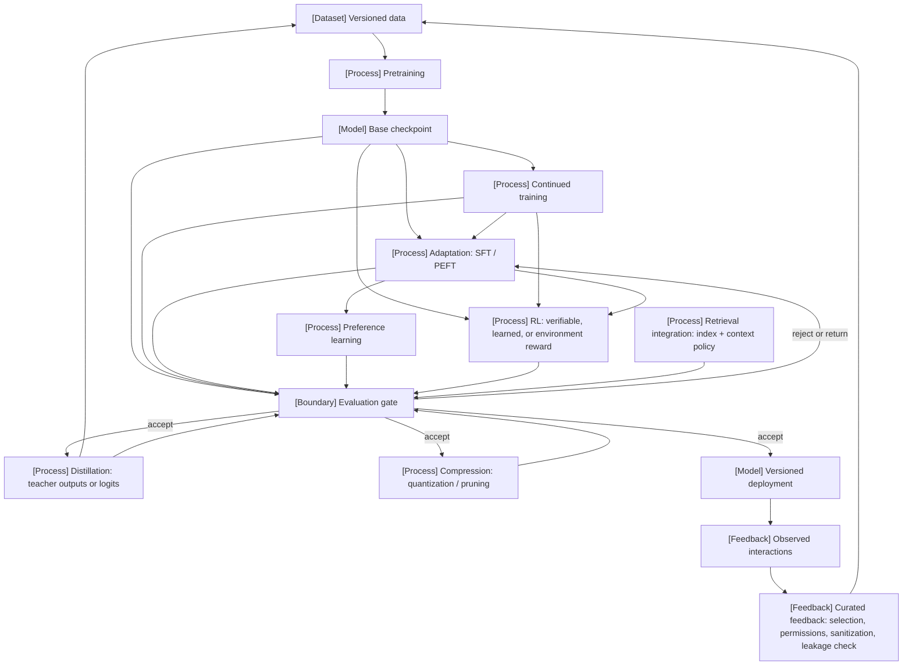

# 1.4 Lifecycle and intervention

## Scope

Objective: define the foundation-model lifecycle as a conditional graph of interventions (pretraining, continued training, adaptation, preference learning, RL, distillation, retrieval, compression, deployment, feedback) and state the four compatibility conditions every edge must satisfy. Baseline: the linear recipe pretrain → SFT → preference → RL read as obligatory. Success criterion: any proposed route can be checked edge by edge for a compatible objective, data distribution, artifact interface, and evaluation gate. Boundaries: each intervention's mechanism is owned elsewhere ([19](../../part-04-training-science-and-adaptation/ch19-pretraining-objectives-and-the-full-training-loop/README.md), [22](../../part-04-training-science-and-adaptation/ch22-continued-pretraining-mid-training-and-domain-adaptation/README.md)–[24](../../part-04-training-science-and-adaptation/ch24-continual-learning-model-editing-and-unlearning/README.md), [31–36](../../../vol-02-execution-and-optimization/part-06-post-training-and-reinforcement-learning/ch31-supervised-fine-tuning-and-behavior-acquisition/README.md), [39–41](../../../vol-02-execution-and-optimization/part-07-inference-algorithms-distillation-and-compression/ch39-knowledge-response-and-policy-distillation/README.md), [49](../../../vol-03-grounded-and-interactive-intelligence/part-09-retrieval-context-and-agent-systems/ch49-retrieval-models-indexing-and-evidence-access/README.md), [66](../../../vol-03-grounded-and-interactive-intelligence/part-11-evaluation-interpretability-and-deployment-assurance/ch66-release-decisions-reproducibility-and-research-to-production-closure/README.md)); this section owns the graph.

## Why this exists

What failed: the three-stage pipeline of InstructGPT (SFT on demonstrations, reward model on rankings, RL against the reward model; PAPER-REPORTED · P21) was generalized into a universal recipe, so that teams ran stages they did not need and skipped gates they did. The bottleneck is that each stage consumes an artifact with an interface (tokenizer, template, precision, reference policy) and produces one, and interface mismatches are discovered only at evaluation or deployment. What changed: DeepSeek-R1 documented three distinct routes from one base checkpoint (RL alone; cold-start SFT followed by multi-stage RL; SFT-only distillation into other base families; PAPER-REPORTED · P26), which makes the branching explicit. This section turns that into a graph with edge conditions.

```figure
id: fig-1.18
kind: compare
title: Four post-training routes from a base checkpoint
caption: >-
  No two columns traverse the same edges: one skips SFT, one skips RL, and
  one leaves the model family entirely. Read the condition row: each route
  is explained by the compatibility condition it had to satisfy, and
  R1-Zero's readability failure is a data-distribution condition the base
  gate never measured. The outcome row is the authors' own and is not
  reproduced here.
placement: wide
evidence: PAPER-REPORTED
source: [P21, P26, R1.15, R1.16]
concepts: [ms.section.1.4]
alt: >-
  Comparison of four routes. InstructGPT (P21): SFT on demonstrations, a
  reward model on rankings, then RL against the reward model; learned reward
  from human demonstrations and rankings; leans on objective compatibility,
  since RL needs sequences a reward model can score; reported that labelers
  preferred the 1.3B model to 175B GPT-3 with minimal regressions on public
  NLP datasets. R1-Zero (P26): GRPO directly on DeepSeek-V3-Base with
  rule-based accuracy and format rewards and no SFT; showed poor readability
  and language mixing, a distribution the base gate never measured.
  DeepSeek-R1 (P26): cold-start SFT then multi-stage RL, adding data and a
  language-consistency reward so the gate can measure it. R1 distillation
  (P26, R1.15): SFT only on 800k curated samples into six open models on
  Qwen2.5 and Llama-3 checkpoints, five base and one instruction-tuned
  (Llama-3.3-70B-Instruct, R1.16), under an MIT license, no RL stage; response-only
  because the students are other base families, so no logit KL term is
  defined; the authors report it beating small-model RL.
spec:
  axis: >-
    Route from a base checkpoint: edges traversed, feedback source, and the
    compatibility condition the route leans on
  columns:
    - { id: igpt, label: "InstructGPT (P21)" }
    - { id: r1z, label: "R1-Zero (P26)" }
    - { id: r1, label: "DeepSeek-R1 (P26)" }
    - { id: dist, label: "R1 distillation (P26, R1.15)" }
  rows:
    - { dimension: "edges traversed", values: { igpt: "SFT on demonstrations → reward model on rankings → RL against it", r1z: "GRPO directly on DeepSeek-V3-Base; no SFT", r1: "cold-start SFT → multi-stage RL", dist: "SFT only, on 800k curated teacher samples; no RL stage" } }
    - { dimension: "feedback source", values: { igpt: "human demonstrations and rankings; learned reward", r1z: "rule-based accuracy and format rewards", r1: "adds cold-start data and a language-consistency reward", dist: "teacher responses (response-only)" } }
    - { dimension: "condition the route leans on", values: { igpt: "objective: RL needs sequences a reward model can score", r1z: "data distribution: readability and language mixing never gated", r1: "data distribution: widens what the gate measures", dist: "objective and interface: students are other base families, so no logit KL" } }
    - { dimension: "artifact produced", values: { igpt: "a 1.3B instruction-following model", r1z: "an RL policy on the same base", r1: "an RL policy on the same base", dist: "six students, MIT license (R1.15): five on Qwen2.5 and Llama-3.1 base checkpoints, one on instruction-tuned Llama-3.3-70B-Instruct (R1.16)" } }
    - { dimension: "authors' reported outcome", values: { igpt: "1.3B preferred by labelers to 175B GPT-3; minimal regressions on public NLP datasets", r1z: "poor readability and language mixing", r1: "not restated in §1.4", dist: "'excellent results'; small-model RL may not reach distillation (Section 4.1)" } }
```

## Intuition

Physically, each edge re-spends a resource on an artifact: pretraining spends the largest FLOP budget on the widest data; continued training spends a smaller budget on narrowed data; adaptation spends optimizer state on a subset of parameters; preference and RL spend generation FLOPs (sampling) plus training FLOPs; distillation spends teacher inference FLOPs to make data or logits; compression spends calibration FLOPs to reduce bytes per value; retrieval spends index-build FLOPs once and memory traffic per query; deployment spends serving capacity; feedback spends curation labor. A route is a sequence of such spends, and the gate after each is the only place the spend can be found wasted.

Heuristically, the graph is a supply chain with inspection stations. The analogy breaks where it matters: a rejected artifact is not discarded but frequently reused as data for a different edge (distillation), which supply chains do not do.

## Formulation

> **Definition — foundation-model lifecycle.** A directed graph whose nodes are typed artifacts (datasets, checkpoints, deployments, feedback records) and whose edges are interventions or gates; an edge is admissible only if its four compatibility conditions hold.

> **Definition — intervention.** A process that consumes one or more versioned artifacts and data under a stated objective and produces a new versioned artifact that must pass an evaluation gate before any further edge consumes it.

> **Definition — evaluation gate.** A boundary node that, given an artifact and the specification of [§1.1](01-1-problem-formulation.md), returns accept, reject, or return-for-revision using criteria fixed before the artifact existed.

> **Definition — artifact interface.** The tuple (tokenizer and vocabulary, serialization template, tensor format and precision, reference-policy identity, metadata) that a consuming edge requires of the artifact it consumes.

The four compatibility conditions for an edge from artifact a to intervention I:

1. **Objective compatibility.** I's objective is well-defined on a's outputs (an RL objective needs a policy that emits sequences the reward can score; a logit-distillation loss needs teacher logits over the student's vocabulary, [Eq. N.7](../../../front-matter/notation.md)).
2. **Data-distribution compatibility.** I's data lie inside the support that a's evaluation covered, or the gate after I is widened to cover the new support.
3. **Artifact-interface compatibility.** a's interface equals what I consumes, or an explicit conversion is applied and versioned (tokenizer migration is [§10.6](../../part-02-data-and-representation-engineering/ch10-tokenization-serialization-and-interface-correctness/10-6-migration-and-compatibility.md)).
4. **Evaluation-gate compatibility.** The gate after I measures the specification's success criteria on the artifact I actually produces (a quantized artifact is gated as itself, not through its unquantized parent).

```figure
id: fig-1.19
kind: diagram
title: One gated edge and its four compatibility conditions
caption: >-
  One edge of the lifecycle graph at instrument scale. The dashed
  preconditions are checked before the spend; the gate reads the artifact
  the edge actually produced, with criteria that existed before it did.
  Scroll: the lit parts follow the section from the definitions to the
  counterexamples, Algorithm 1.4, the interface ablation, and the failure
  modes.
placement: rail
anchor: formulation
evidence: DERIVED
source: ["DERIVED:alg-1.4", P26]
concepts: [ms.section.1.4]
alt: >-
  Top-to-bottom diagram of one edge. Artifact a, carrying its interface
  (tokenizer, template, precision, reference policy), flows into
  intervention I_j, whose cost is added to the ledger before the spend.
  Three preconditions feed I_j: 1, the objective is defined on a's outputs;
  2, the data lie inside the support a's gate covered; 3, the interface is
  equal or the conversion is versioned. I_j produces a′ = I_j(a), which
  flows along the emphasized path to the gate G(a′, σ); precondition 4, the
  gate measures the artifact produced, feeds the gate. The gate returns
  accept (the next edge may consume a′), return (revise I_j within a
  revision budget) or reject (record the edge and the failing condition).
  States light the four conditions; conditions 1 and 2 for the
  counterexamples; the gate and its outcomes for Algorithm 1.4; condition 3
  for the interface ablation; conditions 3 and 4 and the gate for the
  failure modes.
states:
  - { anchor: formulation, label: "four conditions", highlight: [c1, c2, c3, c4], note: "An edge from a to I_j is admissible only if all four hold, and the gate's criteria come from the §1.1 specification before a′ exists." }
  - { anchor: mechanism, label: "counterexamples", highlight: [c1, c2], note: "A logit loss across tokenizers has no KL term (condition 1), so R1 distills response-only; R1-Zero's language mixing is a distribution the base gate never measured (condition 2)." }
  - { anchor: algorithm, label: "Algorithm 1.4, lines 3–9", highlight: [g, acc, ret, rej, "a2->g"], note: "Conditions are checked before the spend (line 3); the gate reads the artifact actually produced (line 6); return revises I_j within a revision budget; reject records edge and condition." }
  - { anchor: experimental-design, label: "interface ablation", highlight: [c3], note: "The matched-route proposal mismatches the template in one arm on purpose, to measure the interface effect at matched post-training FLOPs." }
  - { anchor: failure-modes, label: "drift · parent · contamination", highlight: [c3, c4, g], note: "Interface drift breaks condition 3; gating the parent breaks condition 4 (no gate record for the deployed checksum); contaminated feedback inflates the gate itself." }
spec:
  direction: TB
  nodes:
    - { id: a, kind: model, label: "artifact a", sub: "tokenizer · template · precision · ref policy" }
    - { id: c1, kind: dependency, label: "1 objective defined on a's outputs" }
    - { id: c2, kind: dependency, label: "2 data inside the support a's gate covered" }
    - { id: c3, kind: dependency, label: "3 interface equal, or conversion versioned" }
    - { id: i, kind: process, label: "intervention I_j", sub: "Λ += cost(I_j, a) before the spend" }
    - { id: a2, kind: model, label: "artifact a′ = I_j(a)" }
    - { id: c4, kind: dependency, label: "4 gate measures the artifact produced" }
    - { id: g, kind: boundary, label: "gate G(a′, σ)", sub: "criteria fixed before a′ existed" }
    - { id: acc, kind: state, label: "accept: next edge may consume a′" }
    - { id: ret, kind: feedback, label: "return: revise I_j" }
    - { id: rej, kind: state, label: "reject: record (j, condition)" }
  edges:
    - { from: a, to: i }
    - { from: c1, to: i, kind: dependency }
    - { from: c2, to: i, kind: dependency }
    - { from: c3, to: i, kind: dependency }
    - { from: i, to: a2 }
    - { from: a2, to: g, kind: emphasis }
    - { from: c4, to: g, kind: dependency }
    - { from: g, to: acc }
    - { from: g, to: ret }
    - { from: ret, to: i, kind: feedback, label: "revision budget" }
    - { from: g, to: rej }
```



Text equivalent:

- Versioned data (dataset) → pretraining (process) → base checkpoint (model).
  - Base checkpoint → continued training (process) → any of adaptation, RL, or the evaluation gate.
  - Base checkpoint → adaptation: SFT / PEFT (process) → preference learning (process) → evaluation gate; or adaptation → RL → gate; or adaptation → gate directly.
  - Base checkpoint → RL (process) → evaluation gate (the R1-Zero route).
  - Base checkpoint → evaluation gate directly (deploying a base model is valid).
- Evaluation gate (boundary):
  - accept → distillation (process) → produces new versioned data, or a student that returns to the gate.
  - accept → compression (process) → returns to the gate as its own artifact.
  - accept → versioned deployment (model).
  - reject or return → back to an intervention (drawn to adaptation; any intervention may be the target).
- Retrieval integration (process) → evaluation gate (a retrieval policy is gated with the model it serves).
- Versioned deployment → observed interactions (feedback) → curated feedback (feedback) → versioned data.

## Mechanism

Each edge, what it consumes and produces, and its cost line:

| Intervention | Consumes → produces | Cost line | Owner |
|---|---|---|---|
| Pretraining | data, initialization → base checkpoint | FLOPs ≈ 6ND under the dense accounting of [Eq. N.3](../../../front-matter/notation.md); memory per [Eq. N.5](../../../front-matter/notation.md); communication set by parallelism; largest single spend | [19](../../part-04-training-science-and-adaptation/ch19-pretraining-objectives-and-the-full-training-loop/README.md), [21](../../part-04-training-science-and-adaptation/ch21-scaling-laws-and-compute-allocation/README.md) |
| Continued training | checkpoint, narrowed data → checkpoint | same per-token FLOPs on fewer tokens; retention loss is the hidden cost | [22.1](../../part-04-training-science-and-adaptation/ch22-continued-pretraining-mid-training-and-domain-adaptation/22-1-stage-definitions.md), [24.1](../../part-04-training-science-and-adaptation/ch24-continual-learning-model-editing-and-unlearning/24-1-sequential-learning-regimes.md) |
| Adaptation (SFT, PEFT) | checkpoint, labeled sequences → checkpoint or adapter | full SFT: optimizer state for all N; LoRA: trainable parameters reduced by up to 10,000× and GPU memory by 3× on GPT-3 175B with Adam, with no added inference latency when merged (PAPER-REPORTED · P14) | [31](../../../vol-02-execution-and-optimization/part-06-post-training-and-reinforcement-learning/ch31-supervised-fine-tuning-and-behavior-acquisition/README.md), [23.2](../../part-04-training-science-and-adaptation/ch23-parameter-efficient-adaptation-and-model-composition/23-2-lora-mechanics.md) |
| Preference learning | checkpoint, pairwise preferences, reference policy → checkpoint | reference-policy forward passes per example; memory for two policies | [33.1](../../../vol-02-execution-and-optimization/part-06-post-training-and-reinforcement-learning/ch33-direct-preference-optimization-and-related-objectives/33-1-dpo-derivation.md) |
| RL | policy, prompts, reward source → policy | generation FLOPs per rollout dominate; actor, reference, and reward placement multiply memory ([Eq. N.6](../../../front-matter/notation.md)) | [34.6](../../../vol-02-execution-and-optimization/part-06-post-training-and-reinforcement-learning/ch34-policy-gradients-ppo-and-rlhf/34-6-resource-accounting.md), [35.1](../../../vol-02-execution-and-optimization/part-06-post-training-and-reinforcement-learning/ch35-verifiable-reward-rl-and-reasoning-policy-optimization/35-1-rlvr-formulation.md) |
| Distillation | teacher, prompts → data (response-only) or logits (Eq. N.7) → student | teacher inference FLOPs × samples; R1 reports SFT-only distillation on 800k curated samples into six open models with no RL stage, listing all six as "base models" (PAPER-REPORTED · P26, Section 2.4); one of them, Llama-3.3-70B-Instruct, is documented by Meta as an instruction-tuned model aligned with SFT and RLHF, so five students start from base checkpoints and one from an instruction-tuned one (OFFICIAL-DOCUMENTATION · R1.16) | [39.1](../../../vol-02-execution-and-optimization/part-07-inference-algorithms-distillation-and-compression/ch39-knowledge-response-and-policy-distillation/39-1-distillation-objectives.md) |
| Retrieval integration | index, retriever, context policy → gated system | index build once; per-query retrieval latency and prompt tokens; parametric plus non-parametric memory (PAPER-REPORTED · P40) | [49](../../../vol-03-grounded-and-interactive-intelligence/part-09-retrieval-context-and-agent-systems/ch49-retrieval-models-indexing-and-evidence-access/README.md) |
| Compression | checkpoint, calibration data → artifact with smaller b | calibration FLOPs; memory capacity and weight traffic fall with b; quality is re-gated | [40.1](../../../vol-02-execution-and-optimization/part-07-inference-algorithms-distillation-and-compression/ch40-quantization-from-numerical-model-to-deployable-artifact/40-1-quantization-formulation.md) |
| Deployment | gated artifact, runtime → versioned service | serving capacity: M_params + M_KV per replica ([Eq. N.8](../../../front-matter/notation.md)); latency and throughput per Ω | [44](../../../vol-02-execution-and-optimization/part-08-inference-engines-and-production-serving/ch44-scheduling-distributed-serving-and-disaggregation/README.md), [66.4](../../../vol-03-grounded-and-interactive-intelligence/part-11-evaluation-interpretability-and-deployment-assurance/ch66-release-decisions-reproducibility-and-research-to-production-closure/66-4-deployment-strategy.md) |
| Feedback | interactions → curated data | curation labor; permission and sanitization checks; leakage audit against evaluation sets | [66.6](../../../vol-03-grounded-and-interactive-intelligence/part-11-evaluation-interpretability-and-deployment-assurance/ch66-release-decisions-reproducibility-and-research-to-production-closure/66-6-research-feedback.md) |

```figure
id: fig-1.20
kind: systems-trace
title: Cost line of every lifecycle edge
caption: >-
  Read down the compute column: only pretraining and continued training are
  dominated by 6ND-style training FLOPs; RL and distillation are dominated
  by generation (rollouts, teacher inference), retrieval by a one-time index
  build, and feedback by labor rather than FLOPs. The failure column is
  where each edge's hidden cost lives, and three of its entries are
  violations of a compatibility condition.
placement: wide
evidence: PAPER-REPORTED
source: [P14, P26, P40, "DERIVED:alg-1.4"]
alt: >-
  Systems trace of ten edges over compute, memory, communication, latency
  and failure. Pretraining: about 6ND under dense accounting, the largest
  spend; memory per Eq. N.5; communication set by the parallelism plan.
  Continued training: same per-token FLOPs on fewer tokens; retention loss.
  Adaptation: full SFT holds optimizer state for all N; LoRA cuts trainable
  parameters by up to 10,000 times and GPU memory 3 times on GPT-3 175B with
  Adam, with no added latency once merged (P14). Preference learning:
  reference forward passes; two policies resident. RL: rollout generation
  dominates; actor, reference and reward placement multiply memory.
  Distillation: teacher inference times samples, 800k in R1 (P26); logit
  loss undefined across tokenizers. Retrieval: index built once; per-query
  retrieval and prompt tokens (P40). Compression: calibration FLOPs; memory
  falls with b; gating the parent. Deployment: M_params plus M_KV per
  replica; template or precision drift. Feedback: curation labor; leakage
  into gate sets.
spec:
  columns: [compute, memory, communication, latency, failure]
  stages:
    - { name: "Pretraining", values: { compute: "C ≈ 6ND, dense accounting (Eq. N.3); the largest single spend", memory: "Eq. N.5, term by term", communication: "set by the parallelism plan", failure: "an objective mis-specified before the run is not cheaply repaired after it" }, emphasis: true }
    - { name: "Continued training", values: { compute: "same per-token FLOPs on fewer, narrowed tokens", failure: "retention loss, the hidden cost" } }
    - { name: "Adaptation (SFT, PEFT)", values: { compute: "LoRA: trainable parameters reduced by up to 10,000× on GPT-3 175B (P14)", memory: "full SFT: optimizer state for all N; LoRA: GPU memory reduced 3× with Adam (P14)", latency: "none added once LoRA is merged (P14)" } }
    - { name: "Preference learning", values: { compute: "reference-policy forward pass per example", memory: "two policies resident" } }
    - { name: "RL", values: { compute: "generation FLOPs per rollout dominate", memory: "actor, reference and reward placement multiply memory (Eq. N.6)" } }
    - { name: "Distillation", values: { compute: "teacher inference FLOPs × samples; R1: 800k curated samples (P26)", failure: "logit loss undefined across tokenizers (condition 1)" } }
    - { name: "Retrieval integration", values: { compute: "index built once", memory: "parametric plus non-parametric memory (P40)", latency: "per-query retrieval plus added prompt tokens" } }
    - { name: "Compression", values: { compute: "calibration FLOPs", memory: "capacity and weight traffic fall with b", failure: "gating the parent instead of the artifact (condition 4)" } }
    - { name: "Deployment", values: { memory: "M_params + M_KV per replica (Eq. N.8)", latency: "TTFT, TPOT per Ω at a stated boundary", failure: "template or precision drift from the gate's harness (condition 3)" } }
    - { name: "Feedback", values: { compute: "curation labor, not FLOPs", failure: "leakage into gate sets contaminates the gate" } }
```

Why each condition is required, by counterexample. Objective: applying [Eq. N.7](../../../front-matter/notation.md) to a teacher with a different tokenizer has no defined KL term; R1's distillation is response-only SFT precisely because the students are other base families (P26). Data distribution: R1-Zero's readability and language-mixing failures (P26) are a distribution the base gate never measured; the cold-start route adds data and a language-consistency reward so that the gate can. Artifact interface: a chat template introduced at SFT must be the template used at deployment, or the deployed model is evaluated on prompts it never saw ([§10.4](../../part-02-data-and-representation-engineering/ch10-tokenization-serialization-and-interface-correctness/10-4-conversation-serialization.md)). Evaluation gate: a quantized artifact changes the numerical function; gating its parent instead gates a different model.

Feedback closes the loop only through curation: production logs become training data after selection, permissions, sanitization, and leakage checks against every evaluation set the gate uses; otherwise the gate is contaminated by its own outputs (DERIVED from condition 4).

```figure
id: fig-1.21
kind: cycle
title: Feedback closes only through curation
caption: >-
  Production traffic reaches the training data through four checks in
  series, and the last one protects the gate itself: without the leakage
  audit, gate items or their paraphrases enter training, held-out scores
  rise each cycle, and production acceptance does not. The return arc
  starts a new route; it is not a loop inside one call of Algorithm 1.4.
placement: inline
evidence: DERIVED
source: "DERIVED:alg-1.4"
alt: >-
  Cycle drawn as a column of nine stages: versioned data D; intervention I_j
  with conditions 1 to 4 checked; gate G(·, σ) with held-out gate sets;
  versioned deployment; observed interactions O; selection; permissions;
  sanitization; leakage audit against the gate sets, covering items and
  paraphrases. Forward edges run down the column, with the gate accepting
  into deployment. Two feedback arcs: from the gate back to the intervention
  on return or reject, and from the leakage audit back to the data as a new
  version, D := version(D ∪ C), Algorithm 1.4 lines 10 and 11.
spec:
  stages:
    - { id: data, label: "Versioned data D", kind: dataset }
    - { id: edge, label: "Intervention I_j", kind: process, sub: "conditions 1–4 checked" }
    - { id: gate, label: "Gate G(·, σ)", kind: boundary, sub: "held-out gate sets" }
    - { id: dep, label: "Versioned deployment", kind: model }
    - { id: obs, label: "Observed interactions O", kind: feedback }
    - { id: sel, label: "Selection", kind: process }
    - { id: perm, label: "Permissions", kind: dependency }
    - { id: san, label: "Sanitization", kind: process }
    - { id: leak, label: "Leakage audit vs gate sets", kind: metric, sub: "items and paraphrases" }
  edges:
    - { from: data, to: edge }
    - { from: edge, to: gate }
    - { from: gate, to: dep, label: "accept" }
    - { from: dep, to: obs }
    - { from: obs, to: sel }
    - { from: sel, to: perm }
    - { from: perm, to: san }
    - { from: san, to: leak }
    - { from: leak, to: data, kind: feedback, label: "D := version(D ∪ C)" }
    - { from: gate, to: edge, kind: feedback, label: "return or reject" }
```

## Algorithm

```text
Algorithm 1.4 — Gated lifecycle traversal
INPUT   route ρ = (I_1, …, I_n) of interventions; specification σ; base artifact a_0; gate G(·, σ)
OUTPUT  accepted artifact a* or a rejection record with the failing edge and condition
STATE   current artifact a; ledger Λ (Algorithm 1.5); provenance log
INVARIANT  every artifact in the log passed G before being consumed; each edge has conditions 1–4 checked and recorded
 1. a := a_0; if G(a, σ) = reject: return rejection(edge 0, "base fails σ")
 2. for j in 1..n:
 3.     for cond in (objective, data, interface, gate): if not compatible(a, I_j, cond): return rejection(j, cond)
 4.     Λ := Λ + cost(I_j, a)                       # every spend is recorded before it happens
 5.     a' := I_j(a)                                # produce the new artifact
 6.     v := G(a', σ)                               # gate the artifact actually produced
 7.     if v = accept: a := a'; log(j, a', Λ)
 8.     else if v = return: I_j := revise(I_j, v.diagnostics); goto 3  (bounded by a revision budget)
 9.     else: return rejection(j, "gate", v.diagnostics)
10. deploy(a); collect O; C := curate(O)           # selection, permissions, sanitization, leakage check
11. if C non-empty: D := version(D ∪ C)
12. return a
TERMINATION  n edges; step 8 bounded by the revision budget; the feedback edge starts a new route, not a loop inside this call
```

```figure
id: fig-1.22
kind: calculator
title: Gate evaluations and judged units along a route
caption: >-
  Composes Algorithm 1.4 with Eq. 1.9; this section has no numbered equation
  of its own. Line 1 gates the base and line 6 gates every produced
  artifact, so a route of n edges costs n + 1 gate evaluations plus one per
  revision, n + 1 + r as the Complexity note states. The two-edge route
  SFT → preference learning, arm (a) of the Experimental design, costs three
  gates of 2,401 units, 7,203 judged units before any revision; multiply by
  per-unit inference and judging cost for FLOPs.
placement: rail
anchor: algorithm
evidence: MATHEMATICALLY-DERIVED
source: ["DERIVED:alg-1.4", "DERIVED:eq-1.9"]
alt: >-
  Calculator composing Algorithm 1.4 and Eq. 1.9 with inputs edges in the
  route n, revisions r, critical value z and half-width δ. Outputs: gate
  evaluations G = n + 1 + r; units per gate ceil(z²/(4δ²)); judged units G
  times units per gate. At n = 2, r = 0, z = 1.96 and δ = 0.02: 3 gate
  evaluations, 2,401 units per gate and 7,203 judged units. Preset 'one
  revision' gives 4 evaluations and 9,604 units; preset 'δ = 0.01' gives
  9,604 units per gate and 28,812 judged units.
spec:
  tex: >-
    G = n + 1 + r,\qquad U = G\,\Big\lceil \frac{z^{2}}{4\,\delta^{2}} \Big\rceil
  inputs:
    - { symbol: n, label: "edges in the route n", default: 2, min: 1, max: 8, step: 1, format: integer }
    - { symbol: r, label: "revisions r (line 8)", default: 0, min: 0, max: 8, step: 1, format: integer }
    - { symbol: z, label: "critical value z", default: 1.96, min: 1.645, max: 2.576, options: [1.645, 1.96, 2.576], format: fixed3 }
    - { symbol: delta, label: "half-width δ per gate", default: 0.02, min: 0.01, max: 0.05, options: [0.01, 0.02, 0.05], format: fixed3 }
  outputs:
    - { symbol: G, label: "gate evaluations, n + 1 + r", formula: "n + 1 + r", format: integer }
    - { symbol: u, label: "units per gate, Eq. 1.9", formula: "ceil(z^2/(4*delta^2))", format: integer }
    - { symbol: U, label: "judged units along the route", formula: "G*u", format: integer, emphasis: true }
  presets:
    - { label: "one revision", values: { r: 1 } }
    - { label: "δ = 0.01", values: { delta: 0.01 } }
```

Complexity: n + 1 gate evaluations (line 1 gates the base, line 6 each produced artifact) plus r re-evaluations after revision (line 8), n + 1 + r in all, plus the interventions' own costs, each revision re-running its intervention; each gate costs evaluation FLOPs × held-out units per gate. Implementation link: release gates in [§66.3](../../../vol-03-grounded-and-interactive-intelligence/part-11-evaluation-interpretability-and-deployment-assurance/ch66-release-decisions-reproducibility-and-research-to-production-closure/66-3-release-gates.md).

## Implementation

Interventions map onto the stack layers of `AI_REFERENCE_STACK.md` §4.1: pretraining and continued training run on *Distributed training* (PyTorch FSDP2, NVIDIA Megatron-Core, Microsoft DeepSpeed, TorchTitan); adaptation on *Model definition / adaptation* (Hugging Face Transformers / PEFT, torchtune); preference learning and RL on *Post-training / RL* (Hugging Face TRL, OpenRLHF, verl, NVIDIA NeMo RL); compression produces artifacts (safetensors, GGUF) consumed by the *Inference engine* layer (vLLM, SGLang, TensorRT-LLM, llama.cpp); retrieval sits at the product level with its own index service. The artifact-interface condition is enforced at these boundaries: the same tokenizer files, template, and precision must be pinned across layers (Reproducibility dimension, §4.2). No version is pinned in this section; implementation notes belong to the owning chapters.

## Experimental design

Proposal: for one specification, run three routes from the same base checkpoint at matched post-training FLOPs: (a) SFT → preference learning; (b) RL with a verifiable reward directly; (c) SFT on teacher samples (response-only distillation) from an already-gated model. Gate each with the same held-out units and evaluator; report the success criterion with bootstrap intervals and the ledger of every edge; ablate the artifact-interface condition by deliberately mismatching the template in one arm to measure the size of the interface effect. Not executed.

## Observations

**What the paper claims.** InstructGPT reports that a 1.3B model trained by its three-stage route was preferred by labelers to the 175B base model, with "minimal performance regressions on public NLP datasets" (PAPER-REPORTED · P21). DeepSeek-R1 reports that distilling its outputs into smaller base models "yields excellent results, whereas smaller models relying on the large-scale RL … require enormous computational power and may not even achieve the performance of distillation" (PAPER-REPORTED · P26, Section 4.1, v1 accessed 2026-09-20). The official repository lists six distilled models on Qwen2.5 and Llama-3 checkpoints under an MIT license (OFFICIAL-DOCUMENTATION · R1.15, accessed 2026-09-20).

**What the evidence shows.** Both results are the authors' own; neither has been independently reproduced in this book. The R1 distillation-versus-RL comparison holds at the compute the authors allotted to small-model RL, which is not reported here as a general law.

**What we infer.** DERIVED: routes are not interchangeable at fixed budget, so route choice is a decision variable of Eq. 1.2, not a convention. DERIVED: an accepted teacher is the cheapest source of a compatible data distribution for a student, which is why the distillation edge returns to data.

**What remains unknown.** The routes actually used for most proprietary deployments are NOT-DISCLOSED. Whether a preference-learning edge after SFT is necessary for a given specification is UNVERIFIED without the matched-route experiment above.

## Failure modes

> **Failure mode — interface drift.** *Symptom:* held-out scores fall between the post-training gate and deployment with unchanged weights. *Cause:* template, tokenizer normalization, or precision differ between the gate's harness and the serving runtime. *Detection:* checksum serialized prompts and compare logits on a fixed batch across harness and runtime within tolerance. *Mitigation:* pin the interface tuple as part of the artifact.

> **Failure mode — gating the parent.** *Symptom:* a quantized or distilled artifact underperforms the accepted score. *Cause:* condition 4 violated. *Detection:* no gate record exists for the deployed artifact's checksum. *Mitigation:* every artifact is gated as itself.

> **Failure mode — feedback contamination.** *Symptom:* held-out scores rise after each feedback cycle while acceptance in production does not. *Cause:* evaluation items or paraphrases entered training through logs. *Detection:* leakage audit of curated feedback against gate sets. *Mitigation:* the curation step of Algorithm 1.4 line 10.

## Siblings

**Training-state transitions** — [§19.4](../../part-04-training-science-and-adaptation/ch19-pretraining-objectives-and-the-full-training-loop/19-4-training-state-transitions.md)
Why it exists: to define the states inside one training run. What assumption changed: the graph is within an edge, not across edges. What objective changed: none. What problem it solved: schedule semantics and checkpoint states. What new failure mode it introduced: none at the lifecycle level. Changed primitive: intervention edge → optimizer-state transition.

**Release gates** — [§66.3](../../../vol-03-grounded-and-interactive-intelligence/part-11-evaluation-interpretability-and-deployment-assurance/ch66-release-decisions-reproducibility-and-research-to-production-closure/66-3-release-gates.md)
Why it exists: to specify the final gate before deployment in full. What assumption changed: the artifact is a release candidate. What objective changed: assurance criteria are added to success criteria. What problem it solved: a dossier for the decision. What new failure mode it introduced: gate fatigue. Changed primitive: gate node → dossier.

**Sequential learning regimes** — [§24.1](../../part-04-training-science-and-adaptation/ch24-continual-learning-model-editing-and-unlearning/24-1-sequential-learning-regimes.md)
Why it exists: to treat repeated continued-training edges as a regime with retention measured. What assumption changed: the data stream is non-stationary. What objective changed: retention terms are added. What problem it solved: forgetting across edges. What new failure mode it introduced: anchoring that blocks learning. Changed primitive: single edge → sequence of edges with retention gates.

## Extensions

Domain adaptation adds a continued-training or adaptation edge with a narrowed data distribution and a retention gate. Long context adds a continued-training edge whose interface change (position handling) must be versioned. Multimodality adds encoder-alignment edges before adaptation. Agents add environment-return RL edges and trajectory data through the feedback loop, with side-effect controls at curation. Embodiment adds real-world data whose permissions and safety checks dominate curation. Proposals only.

## Limitations

Valid regime: any lifecycle whose artifacts are versioned; unversioned artifacts make the gate invariant unverifiable. Falsification: if a route violating one condition passes the gate and deploys without the predicted symptom over the operating envelope, that condition is unnecessary for that edge and specification. Decision consequence: a route is rejected at the first failing condition, before its cost is spent.

## Reproducibility

Artifacts: route record, per-edge condition checks, gate records with artifact checksums, ledger. Configurations: pinned per owning chapter. Unresolved: proprietary routes (NOT-DISCLOSED).

## References

P14, P21, P26, P32, P36, P40; R1.15, R1.16; [notation](../../../front-matter/notation.md) Eq. N.3, N.5, N.6, N.7, N.8.
