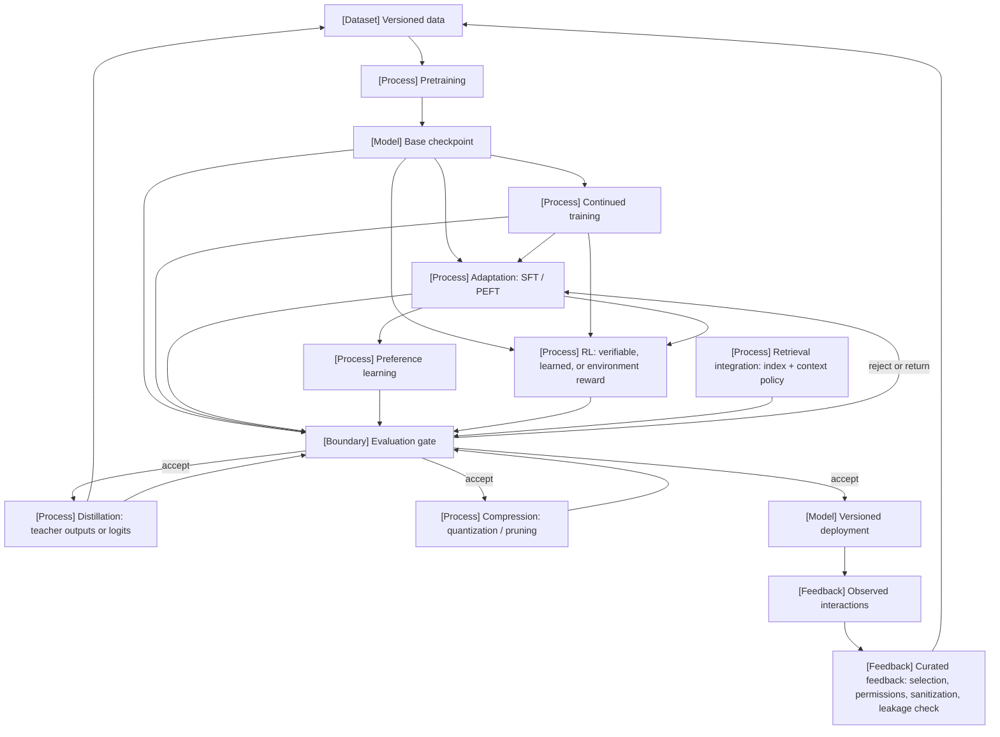

# 1.4 Lifecycle and intervention

## Scope

The lifecycle includes pretraining, continued training, supervised or parameter-efficient adaptation, preference learning, reinforcement learning, distillation, retrieval integration, compression, deployment, and feedback. Published pipelines traverse different subsets. This section reconstructs their artifact and data dependencies, objective/interface compatibility, stage evaluation, and final-release criteria. It compares InstructGPT and DeepSeek-R1 routes without presenting either as obligatory. Canonical method chapters supply the full optimization derivations.

## Why this exists

PAPER-REPORTED · [P21, §3.1](https://arxiv.org/pdf/2203.02155) documents demonstration fine-tuning, reward modeling, and PPO, including iteration between comparison collection and policy optimization. PAPER-REPORTED · [P26, §§2.2–2.4](https://arxiv.org/html/2501.12948v1) documents a different collection of routes: RL directly on a base policy; cold-start SFT followed by several data/optimization stages; and SFT of smaller students on curated teacher responses. DERIVED: these are existence examples of different routes, not evidence that one sequence is universally necessary. A lifecycle record must specify the dependencies and acceptance conditions for the route actually chosen.

```figure
id: fig-1.18
kind: compare
title: Four published post-training routes
caption: >-
  These are dated source pipelines, not obligatory lifecycle stages.
  The R1 student collection includes one instruction-tuned starting model;
  repository and upstream model licenses remain distinct.
placement: wide
evidence: PAPER-REPORTED
source: [P21, P26, R1.15, R1.16]
alt: >-
  InstructGPT uses demonstrations, a learned reward model, and PPO;
  R1-Zero directly applies RL; R1 adds cold start and further SFT/RL;
  R1 distillation uses response-only SFT into six students.
spec:
  axis: "Stages, feedback, and scope of the published comparison"
  columns:
    - { id: igpt, label: "InstructGPT" }
    - { id: zero, label: "R1-Zero" }
    - { id: r1, label: "DeepSeek-R1" }
    - { id: dist, label: "R1 students" }
  rows:
    - { dimension: "route", values: { igpt: "SFT → reward-model fitting → PPO, optionally ptx", zero: "base → rule-reward RL", r1: "cold-start SFT → reasoning RL → curated SFT → final RL", dist: "800k response examples → student SFT; no added student RL" } }
    - { dimension: "feedback", values: { igpt: "demonstrations and ranked completions", zero: "accuracy and format rewards", r1: "reasoning rewards, curated responses, further rewards", dist: "teacher-generated response supervision" } }
    - { dimension: "reported limit", values: { igpt: "retention measured separately; PPO-ptx mitigates regressions", zero: "poor readability and language mixing", r1: "added-stage contributions not all isolated", dist: "comparison with small-model RL is not a complete cost match" } }
    - { dimension: "interface", values: { igpt: "reward model and policy are separate artifacts", zero: "starting base is measured by the source", r1: "intermediate artifacts have different stage criteria", dist: "cross-family responses can be retokenized; logit matching needs an event-space mapping" } }
```

## Intuition

DERIVED: each edge changes a specific artifact and its resource ledger. Continued training need not use fewer tokens or a narrower distribution than the original run. Full adaptation updates all weights; parameter-efficient adaptation updates a restricted parameterization. RL includes rollout generation, scoring, and learner updates, whose relative costs depend on the configuration. Compression may require retraining, calibration, or neither. Retrieval may rebuild the index when the corpus or encoder changes. These distinctions prevent a stage name from substituting for its actual procedure or cost.

## Formulation

> **Definition — foundation-model lifecycle.** A directed graph whose nodes are typed artifacts (datasets, checkpoints, deployments, feedback records) and whose edges are interventions or gates; an edge is admissible only if its four compatibility conditions hold.

> **Definition — intervention.** A process that consumes specified versioned artifacts and data under a stated objective and produces a candidate artifact. A stage-specific compatibility check governs further processing; a final deployment gate governs release. A base policy need not satisfy the final product criteria before adaptation can improve it.

> **Definition — evaluation gate.** A boundary node returning accept, reject, or return-for-revision under versioned, stage-appropriate criteria fixed before the candidate evaluation. Acceptance at an intermediate stage is not deployment authorization or proof of final task quality.

> **Definition — artifact interface.** The tuple (tokenizer and vocabulary, serialization template, tensor format and precision, reference-policy identity, metadata) that a consuming edge requires of the artifact it consumes.

The four compatibility conditions for an edge from artifact a to intervention I:

1. **Objective compatibility.** I's objective is well-defined on a's outputs (an RL objective needs a policy that emits sequences the reward can score; a logit-distillation loss needs teacher logits over the student's vocabulary, [Eq. N.7](../../../front-matter/notation.md)).
2. **Data-distribution compatibility.** I's data and preprocessing are characterized; the next evaluation covers the newly claimed domain and any required retention population. A finite prior evaluation cannot certify coverage of an entire distributional support, and adaptation is permitted to introduce a new domain.
3. **Artifact-interface compatibility.** a's interface equals what I consumes, or an explicit conversion is applied and versioned (tokenizer migration is [§10.6](../../part-02-data-and-representation-engineering/ch10-tokenization-serialization-and-interface-correctness/10-6-migration-and-compatibility.md)).
4. **Evaluation-gate compatibility.** The gate after I measures the specification's success criteria on the artifact I actually produces (a quantized artifact is gated as itself, not through its unquantized parent).

```figure
id: fig-1.19
kind: diagram
title: One gated edge and its four compatibility conditions
caption: >-
  One edge of the lifecycle graph at instrument scale. The dashed
  preconditions are checked before the spend; the gate reads the artifact
  the edge actually produced, with criteria that existed before it did.
  Scroll: the lit parts follow the section from the definitions to the
  counterexamples, Algorithm 1.4, the published retention ablation, and the failure
  modes.
placement: rail
anchor: formulation
evidence: DERIVED
source: ["DERIVED:alg-1.4", P26]
concepts: [ms.section.1.4]
alt: >-
  Top-to-bottom diagram of one edge. Artifact a, carrying its interface
  (tokenizer, template, precision, reference policy), flows into
  intervention I_j, whose estimated cost is reserved before execution and incurred cost recorded afterward.
  Three preconditions feed I_j: 1, the objective is defined on a's outputs;
  2, the data shift and required retention checks are documented; 3, the interface is
  equal or the conversion is versioned. I_j produces a′ = I_j(a), which
  flows along the emphasized path to the gate G(a′, σ); precondition 4, the
  gate measures the artifact produced, feeds the gate. The gate returns
  accept (the next edge may consume a′), return (revise I_j within a
  revision budget) or reject (record the edge and the failing condition).
  States light the four conditions; conditions 1 and 2 for the
  counterexamples; the gate and its outcomes for Algorithm 1.4; condition 3
  for the published retention ablation; conditions 3 and 4 and the gate for the
  failure modes.
states:
  - { anchor: formulation, label: "four conditions", highlight: [c1, c2, c3, c4], note: "An edge from a to I_j is admissible only if all four hold, and the gate's criteria come from the §1.1 specification before a′ exists." }
  - { anchor: mechanism, label: "counterexamples", highlight: [c1, c2], note: "Cross-tokenizer logit matching needs a common event space; R1 uses response-only supervision. Readability and language consistency require separately defined outcomes." }
  - { anchor: algorithm, label: "Algorithm 1.4, lines 3–9", highlight: [g, acc, ret, rej, "a2->g"], note: "Conditions are checked before the spend (line 3); the gate reads the artifact actually produced (line 6); return revises I_j within a revision budget; reject records edge and condition." }
  - { anchor: experimental-design, label: "published retention ablation", highlight: [c3], note: "P21 compares PPO and PPO-ptx for benchmark retention; no template-ablation experiment is reported in this chapter." }
  - { anchor: failure-modes, label: "drift · parent · contamination", highlight: [c3, c4, g], note: "Interface drift breaks condition 3; gating the parent breaks condition 4 (no gate record for the deployed checksum); contaminated feedback inflates the gate itself." }
spec:
  direction: TB
  nodes:
    - { id: a, kind: model, label: "artifact a", sub: "tokenizer · template · precision · ref policy" }
    - { id: c1, kind: dependency, label: "1 objective defined on a's outputs" }
    - { id: c2, kind: dependency, label: "2 data shift and retention checks documented" }
    - { id: c3, kind: dependency, label: "3 interface equal, or conversion versioned" }
    - { id: i, kind: process, label: "intervention I_j", sub: "Λ += cost(I_j, a) before the spend" }
    - { id: a2, kind: model, label: "artifact a′ = I_j(a)" }
    - { id: c4, kind: dependency, label: "4 gate measures the artifact produced" }
    - { id: g, kind: boundary, label: "gate G(a′, σ)", sub: "criteria fixed before a′ existed" }
    - { id: acc, kind: state, label: "accept: next edge may consume a′" }
    - { id: ret, kind: feedback, label: "return: revise I_j" }
    - { id: rej, kind: state, label: "reject: record (j, condition)" }
  edges:
    - { from: a, to: i }
    - { from: c1, to: i, kind: dependency }
    - { from: c2, to: i, kind: dependency }
    - { from: c3, to: i, kind: dependency }
    - { from: i, to: a2 }
    - { from: a2, to: g, kind: emphasis }
    - { from: c4, to: g, kind: dependency }
    - { from: g, to: acc }
    - { from: g, to: ret }
    - { from: ret, to: i, kind: feedback, label: "revision budget" }
    - { from: g, to: rej }
```


```mermaid
flowchart TD
  D["[Dataset] Versioned data"] --> B["[Process] Pretraining"]
  B --> W0["[Model] Base checkpoint"]
  W0 --> M["[Process] Continued training"]
  W0 --> S["[Process] Adaptation: SFT / PEFT"]
  W0 --> R["[Process] RL: verifiable, learned, or environment reward"]
  W0 --> E["[Boundary] Evaluation gate"]
  M --> S
  M --> R
  M --> E
  S --> P["[Process] Preference learning"]
  S --> R
  S --> E
  P --> E
  R --> E
  E -->|accept| T["[Process] Distillation: teacher outputs or logits"]
  T --> D
  T --> E
  E -->|accept| Q["[Process] Compression: quantization / pruning"]
  Q --> E
  K["[Process] Retrieval integration: index + context policy"] --> E
  E -->|accept| V["[Model] Versioned deployment"]
  E -->|reject or return| S
  V --> O["[Feedback] Observed interactions"]
  O --> C["[Feedback] Curated feedback: selection, permissions, sanitization, leakage check"]
  C --> D
```

Text equivalent:

- Versioned data (dataset) → pretraining (process) → base checkpoint (model).
  - Base checkpoint → continued training (process) → any of adaptation, RL, or the evaluation gate.
  - Base checkpoint → adaptation: SFT / PEFT (process) → preference learning (process) → evaluation gate; or adaptation → RL → gate; or adaptation → gate directly.
  - Base checkpoint → RL (process) → evaluation gate (the R1-Zero route).
  - Base checkpoint → evaluation gate directly (deploying a base model is valid).
- Evaluation gate (boundary):
  - accept → distillation (process) → produces new versioned data, or a student that returns to the gate.
  - accept → compression (process) → returns to the gate as its own artifact.
  - accept → versioned deployment (model).
  - reject or return → back to an intervention (drawn to adaptation; any intervention may be the target).
- Retrieval integration (process) → evaluation gate (a retrieval policy is gated with the model it serves).
- Versioned deployment → observed interactions (feedback) → curated feedback (feedback) → versioned data.

## Mechanism

### Methodology

DERIVED: the graph and four checks are this book's analytical representation of disclosed pipelines. The canonical mathematical objectives and optimizer derivations remain in the linked owner chapters. At lifecycle level the executable object is a versioned route: each stage records its inputs, objective, data transformation, model state updated, output serialization, estimated budget, and evaluation evidence. Candidate output is written separately from the currently accepted artifact; failure retains the parent identity and records partial cost rather than replacing it silently.

PAPER-REPORTED · [P21, §3.5, Eqs. 1–2 and Appendix C](https://arxiv.org/pdf/2203.02155): SFT fits demonstrations; the reward model fits ranked completions using pairwise logistic comparisons grouped by prompt; PPO improves the supervised policy with reward and a KL penalty to the SFT reference. PPO-ptx additionally mixes pretraining gradients. These are separate data sources, objectives, and model states. The scalar reward model is an auxiliary artifact, not the final deployed policy. Policy-dependent comparison collection makes the feedback loop part of the method rather than a fixed dataset followed by a one-time update.

PAPER-REPORTED · [P26, §§2.3–2.4](https://arxiv.org/html/2501.12948v1): the R1 route first fine-tunes on thousands of cold-start examples, applies reasoning-focused RL, curates reasoning and non-reasoning responses, fine-tunes again, and applies a final RL stage. Smaller students receive the resulting 800k-example collection through SFT without a subsequent RL stage in the described study. A response-only dataset can be retokenized for each student. This is distinct from matching teacher/student vocabulary logits: a cross-tokenizer KL needs an explicit common event space or mapping, but different architectures alone do not make KL undefined.

PAPER-REPORTED · [P32, §2](https://arxiv.org/pdf/1503.02531): soft-target distillation uses teacher probabilities at a shared temperature, with an optional hard-label term and temperature-squared scaling for gradient balance. The response-only R1 route does not use that exact loss. PAPER-REPORTED · [P40, §§2.1–2.4](https://arxiv.org/pdf/2005.11401): original RAG initializes a DPR retriever and BART generator, marginalizes retrieved documents at sequence or token level, and jointly trains query encoder and generator while keeping document embeddings fixed. Generic retrieval concatenation is therefore not automatically this published RAG training procedure. Its full derivation is owned by Chapter 50.

Each edge, what it consumes and produces, and its cost line:

| Intervention | Consumes → produces | Cost line | Owner |
|---|---|---|---|
| Pretraining | data, initialization → base checkpoint | FLOPs ≈ 6ND under the dense accounting of [Eq. N.3](../../../front-matter/notation.md); memory per [Eq. N.5](../../../front-matter/notation.md); communication set by parallelism; budget depends on the chosen run | [19](../../part-04-training-science-and-adaptation/ch19-pretraining-objectives-and-the-full-training-loop/README.md), [21](../../part-04-training-science-and-adaptation/ch21-scaling-laws-and-compute-allocation/README.md) |
| Continued training | checkpoint, narrowed data → checkpoint | per-token FLOPs depend on the architecture; token budget and retention evaluation are recorded separately | [22.1](../../part-04-training-science-and-adaptation/ch22-continued-pretraining-mid-training-and-domain-adaptation/22-1-stage-definitions.md), [24.1](../../part-04-training-science-and-adaptation/ch24-continual-learning-model-editing-and-unlearning/24-1-sequential-learning-regimes.md) |
| Adaptation (SFT, PEFT) | checkpoint, labeled sequences → checkpoint or adapter | full SFT: optimizer state for all N; LoRA: fewer trainable matrices and optimizer state; merged inference uses the updated full matrix (P14, §4) | [31](../../../vol-02-execution-and-optimization/part-06-post-training-and-reinforcement-learning/ch31-supervised-fine-tuning-and-behavior-acquisition/README.md), [23.2](../../part-04-training-science-and-adaptation/ch23-parameter-efficient-adaptation-and-model-composition/23-2-lora-mechanics.md) |
| Preference learning | checkpoint, pairwise preferences, reference policy → checkpoint | objective-dependent reference evaluation; reference scores may be precomputed, with storage and scheduling recorded | [33.1](../../../vol-02-execution-and-optimization/part-06-post-training-and-reinforcement-learning/ch33-direct-preference-optimization-and-related-objectives/33-1-dpo-derivation.md) |
| RL | policy, prompts, reward source → policy | rollout generation and learner updates are separate entries; actor, reference, and reward placement multiply memory ([Eq. N.6](../../../front-matter/notation.md)) | [34.6](../../../vol-02-execution-and-optimization/part-06-post-training-and-reinforcement-learning/ch34-policy-gradients-ppo-and-rlhf/34-6-resource-accounting.md), [35.1](../../../vol-02-execution-and-optimization/part-06-post-training-and-reinforcement-learning/ch35-verifiable-reward-rl-and-reasoning-policy-optimization/35-1-rlvr-formulation.md) |
| Distillation | teacher, prompts → data (response-only) or logits (Eq. N.7) → student | teacher inference FLOPs × samples; R1 reports SFT-only distillation on 800k curated samples into six open models with no RL stage, listing all six as "base models" (PAPER-REPORTED · P26, Section 2.4); one of them, Llama-3.3-70B-Instruct, is documented by Meta as an instruction-tuned model aligned with SFT and RLHF, so five students start from base checkpoints and one from an instruction-tuned one (OFFICIAL-DOCUMENTATION · R1.16) | [39.1](../../../vol-02-execution-and-optimization/part-07-inference-algorithms-distillation-and-compression/ch39-knowledge-response-and-policy-distillation/39-1-distillation-objectives.md) |
| Retrieval integration | index, retriever, context policy → gated system | index build once; per-query retrieval latency and prompt tokens; parametric plus non-parametric memory (PAPER-REPORTED · P40) | [49](../../../vol-03-grounded-and-interactive-intelligence/part-09-retrieval-context-and-agent-systems/ch49-retrieval-models-indexing-and-evidence-access/README.md) |
| Compression | checkpoint, optional calibration data → quantized or otherwise compressed artifact | quantization: calibration and format-conversion cost; pruning: changed structure; actual footprint, traffic, kernels, and quality are re-evaluated | [40.1](../../../vol-02-execution-and-optimization/part-07-inference-algorithms-distillation-and-compression/ch40-quantization-from-numerical-model-to-deployable-artifact/40-1-quantization-formulation.md) |
| Deployment | gated artifact, runtime → versioned service | serving capacity: M_params + M_KV per replica ([Eq. N.8](../../../front-matter/notation.md)); latency and throughput per Ω | [44](../../../vol-02-execution-and-optimization/part-08-inference-engines-and-production-serving/ch44-scheduling-distributed-serving-and-disaggregation/README.md), [66.4](../../../vol-03-grounded-and-interactive-intelligence/part-11-evaluation-interpretability-and-deployment-assurance/ch66-release-decisions-reproducibility-and-research-to-production-closure/66-4-deployment-strategy.md) |
| Feedback | interactions → curated data | curation labor; permission and sanitization checks; leakage audit against evaluation sets | [66.6](../../../vol-03-grounded-and-interactive-intelligence/part-11-evaluation-interpretability-and-deployment-assurance/ch66-release-decisions-reproducibility-and-research-to-production-closure/66-6-research-feedback.md) |

```figure
id: fig-1.20
kind: systems-trace
title: Resource entries associated with lifecycle interventions
caption: >-
  Entries identify work to account for, without asserting a universal
  dominant cost. Precision reduction and pruning require separate execution checks.
placement: wide
evidence: ASSUMED
source: [P14, P21, P26, P32, P40, "DERIVED:alg-1.4"]
alt: >-
  Ten lifecycle stages are paired with compute, state, communication,
  latency, and failure checks. Stage costs depend on route and workload.
spec:
  columns: [compute, memory, communication, latency, failure]
  stages:
    - { name: "Pretraining", values: { compute: "conditional dense 6ND estimate", memory: "parameters, gradients, optimizer, activations", communication: "parallelism plan", failure: "objective/data mismatch" } }
    - { name: "Continued training", values: { compute: "new token exposure and retention evaluation", failure: "retention regression" } }
    - { name: "SFT / PEFT", values: { compute: "training forward/backward work", memory: "trainable versus frozen state; adapter state", latency: "merged LoRA uses updated full matrices" } }
    - { name: "Preference learning", values: { compute: "policy and optional reference evaluation", memory: "cached scores or reference placement", failure: "preference population mismatch" } }
    - { name: "RL", values: { compute: "rollout generation, reward, learner updates", memory: "actor/reference/reward/critic as applicable", failure: "reward or estimator mismatch" } }
    - { name: "Distillation", values: { compute: "teacher generation plus student training", failure: "unmapped output-event space for logit matching" } }
    - { name: "Retrieval", values: { compute: "index construction/update; retrieval", memory: "index plus model state", latency: "retrieval and added context" } }
    - { name: "Compression", values: { compute: "calibration, conversion, optional retraining", memory: "format and structure dependent", failure: "untested child artifact" } }
    - { name: "Deployment", values: { memory: "resident state and workspace", latency: "measured under declared load", failure: "interface drift" } }
    - { name: "Feedback", values: { compute: "collection, curation, deduplication, auditing", failure: "permission or evaluation leakage" } }
```

DERIVED: each compatibility check addresses a distinct invalid inference. A tokenwise KL over unmatched vocabulary indices compares different events. Changing the prompt serialization changes the conditioning even when the weight checksum is fixed. Evaluating an unquantized parent does not evaluate a quantized child. None of these establishes that an untested change necessarily causes a regression. PAPER-REPORTED · P26, §2.3.2: the language-consistency reward trades a reported slight reasoning-performance degradation for more readable outputs; it does not establish what a prior base-model gate measured.

Feedback closes the loop only through curation: production logs become training data after selection, permissions, sanitization, and leakage checks against every evaluation set the gate uses; otherwise the gate is contaminated by its own outputs (DERIVED from condition 4).

```figure
id: fig-1.21
kind: cycle
title: Feedback closes only through curation
caption: >-
  Production traffic reaches the training data through four checks in
  series, and the last one protects the gate itself: without leakage checks, evaluation material can enter training and
  invalidate interpretation of later held-out scores. A check does not
  guarantee complete exclusion of paraphrases. The return arc
  starts a new route; it is not a loop inside one call of Algorithm 1.4.
placement: inline
evidence: DERIVED
source: "DERIVED:alg-1.4"
alt: >-
  Cycle drawn as a column of nine stages: versioned data D; intervention I_j
  with conditions 1 to 4 checked; gate G(·, σ) with held-out gate sets;
  versioned deployment; observed interactions O; selection; permissions;
  sanitization; leakage audit against the gate sets, covering items and
  paraphrases. Forward edges run down the column, with the gate accepting
  into deployment. Two feedback arcs: from the gate back to the intervention
  on return or reject, and from the leakage audit back to the data as a new
  version, D := version(D ∪ C), Algorithm 1.4 lines 10 and 11.
spec:
  stages:
    - { id: data, label: "Versioned data D", kind: dataset }
    - { id: edge, label: "Intervention I_j", kind: process, sub: "conditions 1–4 checked" }
    - { id: gate, label: "Gate G(·, σ)", kind: boundary, sub: "held-out gate sets" }
    - { id: dep, label: "Versioned deployment", kind: model }
    - { id: obs, label: "Observed interactions O", kind: feedback }
    - { id: sel, label: "Selection", kind: process }
    - { id: perm, label: "Permissions", kind: dependency }
    - { id: san, label: "Sanitization", kind: process }
    - { id: leak, label: "Leakage audit vs gate sets", kind: metric, sub: "items and paraphrases" }
  edges:
    - { from: data, to: edge }
    - { from: edge, to: gate }
    - { from: gate, to: dep, label: "accept" }
    - { from: dep, to: obs }
    - { from: obs, to: sel }
    - { from: sel, to: perm }
    - { from: perm, to: san }
    - { from: san, to: leak }
    - { from: leak, to: data, kind: feedback, label: "D := version(D ∪ C)" }
    - { from: gate, to: edge, kind: feedback, label: "return or reject" }
```

## Algorithm

```text
Algorithm 1.4 — Gated lifecycle traversal
INPUT   route ρ = (I_1, …, I_n) of interventions; specification σ; base artifact a_0; gate G(·, σ)
OUTPUT  accepted artifact a* or a rejection record with the failing edge and condition
STATE   current artifact a; ledger Λ (Algorithm 1.5); provenance log
INVARIANT  accepted parent is unchanged until a candidate passes its stage gate; incurred and reserved costs are separate
 1. a := a_0; validate its identity and input contract; record its baseline evaluation without requiring final release quality
 2. for j in 1..n:
 3.     for cond in (objective, data, interface, gate): if not compatible(a, I_j, cond): return rejection(j, cond)
 4.     reserve estimated cost(I_j, a); stop if the total route/revision budget is exhausted
 5.     a' := I_j(a) in a separate candidate location; record incurred cost and any execution failure
 6.     v := G_stage(j, a', σ)                      # gate the artifact actually produced against stage criteria
 7.     if v = accept: a := a'; log(j, a', Λ)
 8.     else if v = return: I_j := revise(I_j, v.diagnostics); goto 3  (bounded by a revision budget)
 9.     else: return rejection(j, "gate", v.diagnostics)
10. if G_release(a, σ) ≠ accept: return rejection("release gate"); deploy only the accepted release identity
11. if C non-empty: D := version(D ∪ C)
12. return a
TERMINATION  n edges; step 8 bounded by the revision budget; the feedback edge starts a new route, not a loop inside this call
```

```figure
id: fig-1.22
kind: calculator
title: Gate evaluations and judged units along a route
caption: >-
  Composes Algorithm 1.4 with Eq. 1.9; this section has no numbered equation
  of its own. Line 1 gates the base and line 6 gates every produced
  artifact, so a route of n edges costs n + 1 gate evaluations plus one per
  revision, n + 1 + r as the Complexity note states. The two-edge route
  SFT → preference learning, arm (a) of the Experimental design, costs three
  gates of 2,401 units, 7,203 judged units before any revision; multiply by
  per-unit inference and judging cost for FLOPs.
placement: rail
anchor: algorithm
evidence: MATHEMATICALLY-DERIVED
source: ["DERIVED:alg-1.4", "DERIVED:eq-1.9"]
alt: >-
  Calculator composing Algorithm 1.4 and Eq. 1.9 with inputs edges in the
  route n, revisions r, critical value z and half-width δ. Outputs: gate
  evaluations G = n + 1 + r; units per gate ceil(z²/(4δ²)); judged units G
  times units per gate. At n = 2, r = 0, z = 1.96 and δ = 0.02: 3 gate
  evaluations, 2,401 units per gate and 7,203 judged units. Preset 'one
  revision' gives 4 evaluations and 9,604 units; preset 'δ = 0.01' gives
  9,604 units per gate and 28,812 judged units.
spec:
  tex: >-
    G = n + 1 + r,\qquad U = G\,\Big\lceil \frac{z^{2}}{4\,\delta^{2}} \Big\rceil
  inputs:
    - { symbol: n, label: "edges in the route n", default: 2, min: 1, max: 8, step: 1, format: integer }
    - { symbol: r, label: "revisions r (line 8)", default: 0, min: 0, max: 8, step: 1, format: integer }
    - { symbol: z, label: "critical value z", default: 1.96, min: 1.645, max: 2.576, options: [1.645, 1.96, 2.576], format: fixed3 }
    - { symbol: delta, label: "half-width δ per gate", default: 0.02, min: 0.01, max: 0.05, options: [0.01, 0.02, 0.05], format: fixed3 }
  outputs:
    - { symbol: G, label: "gate evaluations, n + 1 + r", formula: "n + 1 + r", format: integer }
    - { symbol: u, label: "units per gate, Eq. 1.9", formula: "ceil(z^2/(4*delta^2))", format: integer }
    - { symbol: U, label: "judged units along the route", formula: "G*u", format: integer, emphasis: true }
  presets:
    - { label: "one revision", values: { r: 1 } }
    - { label: "δ = 0.01", values: { delta: 0.01 } }
```

Complexity: n stage-gate evaluations plus one release-gate evaluation and r repeated stage evaluations, n + 1 + r in all, excluding any separate baseline evaluation; add the interventions' own costs, each revision re-running its intervention; each gate costs evaluation FLOPs × held-out units per gate. Implementation link: release gates in [§66.3](../../../vol-03-grounded-and-interactive-intelligence/part-11-evaluation-interpretability-and-deployment-assurance/ch66-release-decisions-reproducibility-and-research-to-production-closure/66-3-release-gates.md).

## Implementation

Interventions map onto the stack layers of `AI_REFERENCE_STACK.md` §4.1: pretraining and continued training run on *Distributed training* (PyTorch FSDP2, NVIDIA Megatron-Core, Microsoft DeepSpeed, TorchTitan); adaptation on *Model definition / adaptation* (Hugging Face Transformers / PEFT, torchtune); preference learning and RL on *Post-training / RL* (Hugging Face TRL, OpenRLHF, verl, NVIDIA NeMo RL); compression produces artifacts (safetensors, GGUF) consumed by the *Inference engine* layer (vLLM, SGLang, TensorRT-LLM, llama.cpp); retrieval sits at the product level with its own index service. The artifact-interface condition is enforced at these boundaries: the same tokenizer files, template, and precision must be pinned across layers (Reproducibility dimension, §4.2). No version is pinned in this section; implementation notes belong to the owning chapters.

## Experimental design

### Reported experiments

PAPER-REPORTED · [P21, §§3.6, 4.2, Appendix C](https://arxiv.org/pdf/2203.02155): comparison arms include pretrained GPT-3, SFT, PPO, and PPO-ptx at several policy sizes, with human preference and public-dataset metrics. PPO-ptx tests mixing pretraining gradients to reduce regressions; preference improvement and benchmark retention are measured separately. These comparisons do not give a compute-matched ranking of all post-training families.

PAPER-REPORTED · [P26, §3, §4.1 and Tables 5–6](https://arxiv.org/html/2501.12948v1): student evaluation covers mathematical and coding tasks. The default reported sampling setup uses temperature 0.6, top-p 0.95, a 32,768-token generation cap, and repeated responses for pass@1 estimation. The authors also train Qwen-32B-Base with RL for over 10k steps and compare it with the distilled 32B model. Exact equality of teacher-generation cost, student-training cost, data, and evaluation compute between the two routes is not established; the comparison is conditional on the disclosed runs, not a universal advantage of distillation.

## Observations

**What the paper claims.** PAPER-REPORTED · P21, §4.2: mixing pretraining gradients mitigates measured public-benchmark regressions. PAPER-REPORTED · P26, §4.1: the described 32B distillation run outperforms the authors' small-model RL comparison on their reported mathematical evaluations. OFFICIAL-DOCUMENTATION · R1.15–R1.16: one of the six student starting checkpoints is Llama-3.3-70B-Instruct; the students do not all start from base models. Upstream licenses remain separate from the repository's MIT license.

**What the evidence shows.** Both results are the authors' own; neither has been independently reproduced in this book. The R1 distillation-versus-RL comparison holds at the compute the authors allotted to small-model RL, which is not reported here as a general law.

**What we infer.** DERIVED: response-only distillation creates a dataset dependency from teacher to student; it does not imply the teacher is the cheapest or best data source. Route choice belongs in Eq. 1.2 because its data, training, generation, and retention measurements differ.

**What remains unknown.** The routes actually used for most proprietary deployments are NOT-DISCLOSED. Whether a preference-learning edge after SFT is necessary for a given specification is UNVERIFIED without a matched-route experiment such as the proposal in verification.md.

## Failure modes

> **Failure mode — interface drift.** *Symptom:* held-out scores fall between the post-training gate and deployment with unchanged weights. *Cause:* template, tokenizer normalization, or precision differ between the gate's harness and the serving runtime. *Detection:* checksum serialized prompts and compare logits on a fixed batch across harness and runtime within tolerance. *Mitigation:* pin the interface tuple as part of the artifact.

> **Failure mode — gating the parent.** *Symptom:* a quantized or distilled artifact underperforms the accepted score. *Cause:* condition 4 violated. *Detection:* no gate record exists for the deployed artifact's checksum. *Mitigation:* every artifact is gated as itself.

> **Failure mode — feedback contamination.** *Symptom:* held-out scores rise after each feedback cycle while acceptance in production does not. *Cause:* evaluation items or paraphrases entered training through logs. *Detection:* leakage audit of curated feedback against gate sets. *Mitigation:* the separate feedback route of Algorithm 1.4 line 11.

## Siblings

**Training-state transitions** — [§19.4](../../part-04-training-science-and-adaptation/ch19-pretraining-objectives-and-the-full-training-loop/19-4-training-state-transitions.md)
Why it exists: to define the states inside one training run. What assumption changed: the graph is within an edge, not across edges. What objective changed: none. What problem it solved: schedule semantics and checkpoint states. What new failure mode it introduced: none at the lifecycle level. Changed primitive: intervention edge → optimizer-state transition.

**Release gates** — [§66.3](../../../vol-03-grounded-and-interactive-intelligence/part-11-evaluation-interpretability-and-deployment-assurance/ch66-release-decisions-reproducibility-and-research-to-production-closure/66-3-release-gates.md)
Why it exists: to specify the final gate before deployment in full. What assumption changed: the artifact is a release candidate. What objective changed: assurance criteria are added to success criteria. What problem it solved: a dossier for the decision. What new failure mode it introduced: gate fatigue. Changed primitive: gate node → dossier.

**Sequential learning regimes** — [§24.1](../../part-04-training-science-and-adaptation/ch24-continual-learning-model-editing-and-unlearning/24-1-sequential-learning-regimes.md)
Why it exists: to treat repeated continued-training edges as a regime with retention measured. What assumption changed: the data stream is non-stationary. What objective changed: retention terms are added. What problem it solved: forgetting across edges. What new failure mode it introduced: anchoring that blocks learning. Changed primitive: single edge → sequence of edges with retention gates.

## Extensions

### Improvements

PAPER-REPORTED · P21, §4.2: PPO-ptx changes the learner objective by adding pretraining gradients; its supporting ablation measures benchmark retention as well as preference. Its cost includes additional pretraining forward/backward work. PAPER-REPORTED · P26, §2.3: the R1 route adds readable cold-start data, language-consistency reward, rejection-sampled SFT, and a final RL stage to address R1-Zero's limitations. The report does not isolate the contribution of every added stage, so complete-route gains cannot be assigned to cold start alone. The language reward has a stated quality trade-off. These are dated improvements in specific pipelines, with unresolved component attribution, rather than obligatory lifecycle edges.

## Limitations

DERIVED: the graph is a bookkeeping and dependency contract, not a theorem guaranteeing quality. Passing finite tests does not establish full distributional support or exclude rare failures. Intermediate gates can permit experimental artifacts that fail final release requirements. Repeated revision against the same held-out set creates selection dependence; a final independent evaluation is required by the declared protocol. The atomicity guarantee is limited to artifact identity and promotion; incurred compute, sampled data, and external side effects cannot be rolled back by restoring a checkpoint.

## Reproducibility

Artifacts: route record, per-edge condition checks, gate records with artifact checksums, ledger. Configurations: pinned per owning chapter. Unresolved: proprietary routes (NOT-DISCLOSED).

## References

P14, P21, P26, P32, P36, P40; R1.15, R1.16; [notation](../../../front-matter/notation.md) Eq. N.3, N.5, N.6, N.7, N.8.
