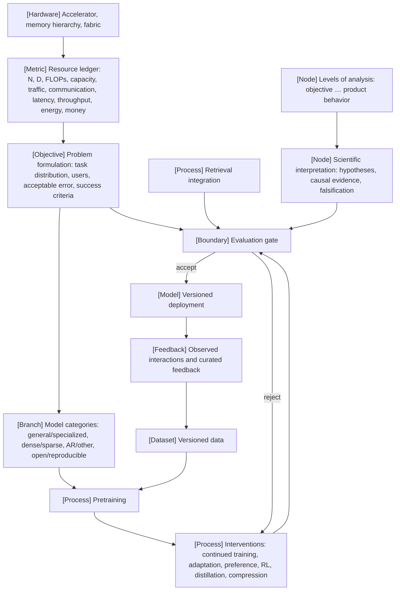

VOLUME I / PART I — SCIENTIFIC FOUNDATIONS / CHAPTER 01

# 01 — The foundation-model lifecycle as a scientific system

A foundation model is not an artifact but a gated sequence of interventions over versioned data and checkpoints, and each intervention is defensible only when its objective, its resource cost, and the measurement that would reject it are written down before it is run.

6 sections · 20 spine papers · 20 implementations named by stack layer, 0 pinned · prerequisites: graduate-level ML and software engineering; [front-matter notation](../../../front-matter/notation.md) · artifact: a system specification with measurable objectives and resource constraints · updated 2026-09-20

## Why this chapter exists

**What failed before.** The field inherited a linear recipe (pretraining, then supervised fine-tuning, then preference optimization) presented as obligatory, with evaluation appended at the end. Vendor and paper numbers were repeated as if they measured the reader's workload. Claims mixed levels: an objective change was described as an architecture change, a kernel speedup was credited to a method, and a behavioral gain after reinforcement learning was credited to the algorithm when the data and the base checkpoint had also changed.

**What bottleneck appeared.** A large training run is too expensive to iterate by trial, and a mis-specified objective discovered after the run cannot be repaired cheaply. The dominant constraint is physical: FLOPs, memory capacity, memory traffic, communication, latency, energy, and money bound what can be tried, while the evidence for each choice has a different provenance and reliability.

**What changed in the solution.** This chapter treats the lifecycle as a conditional graph whose edges are permitted only when objective, data distribution, artifact interface, and evaluation gate are compatible. It formulates the application as a constrained optimization problem with rejection criteria fixed in advance, separates seven levels of analysis so that evidence is attributed to the level it belongs to, fixes a ten-dimensional resource ledger, and states the interpretive stance of the book: physical constraints are explanations, cognitive analogies are heuristics, and every claim carries the measurement that could falsify it.

```figure
id: fig-1.1
kind: compare
title: Inherited recipe against the gated lifecycle
caption: >-
  Each row pairs a habit the chapter names as a failure with the replacement
  one section installs, and every replacement is something a measurement can
  reject. The columns are not ranked: the left is how the field inherited the
  lifecycle, the right is the discipline the rest of the book assumes, and
  the section in brackets owns each row.
placement: wide
evidence: DERIVED
source: ["DERIVED:eq-1.2", "DERIVED:eq-1.3", "DERIVED:eq-1.4", "DERIVED:alg-1.5"]
concepts: [ms.chapter.1]
alt: >-
  Two-column comparison, inherited linear recipe against the gated lifecycle
  of this chapter, on seven rows. Shape: pretraining then SFT then preference
  optimization presented as obligatory, against a conditional graph whose
  edges need a compatible objective, data distribution, artifact interface
  and gate (1.4). Evaluation: appended at the end, against a gate after every
  edge with criteria fixed first (1.4). The application: an informal brief,
  against maximising the accepted-task rate Q(ψ) under error, latency,
  memory, throughput and cost constraints, Eq. 1.2 (1.1). Attribution: to
  the named method or model, against one of seven levels with the other six
  held fixed, Eq. 1.3 (1.2). Categories: brand or total size, against four
  disclosure-based axes with N_act for FLOPs and N_total for memory, Eq. 1.4
  (1.3). Cost: parameter count, peak FLOP/s and GPU-hours, with vendor and
  paper numbers repeated as the reader's workload, against a ten-entry ledger
  with unit, bound and provenance (1.5). A claim: a score or a cognitive
  label, against a stated rung of evidence and a pre-stated rejection
  condition (1.6).
spec:
  axis: >-
    How the lifecycle is specified and what counts as evidence for a choice
    inside it, before any run is paid for
  columns:
    - { id: recipe, label: "Inherited linear recipe" }
    - { id: gated, label: "Gated lifecycle (this chapter)" }
  rows:
    - { dimension: "shape of the lifecycle", values: { recipe: "pretraining → SFT → preference optimization, presented as obligatory", gated: "conditional graph; an edge is admissible only if objective, data, interface and gate are compatible (§1.4)" } }
    - { dimension: "when evaluation happens", values: { recipe: "appended at the end", gated: "a gate after every edge, with criteria fixed before the artifact exists (§1.4)" } }
    - { dimension: "what the application is", values: { recipe: "an informal brief nothing can be rejected against", gated: "max Q(ψ) under error, latency, memory, throughput and cost constraints, Eq. 1.2 (§1.1)" } }
    - { dimension: "where a gain is attributed", values: { recipe: "to the named method, or to the last intervention applied", gated: "to one of seven levels with the other six held fixed, Eq. 1.3 (§1.2)" } }
    - { dimension: "how a model is categorised", values: { recipe: "by brand, or by total parameter count", gated: "four axes from disclosure; N_act for FLOPs, N_total for memory, Eq. 1.4 (§1.3)" } }
    - { dimension: "what cost means", values: { recipe: "parameter count, peak FLOP/s, GPU-hours; vendor numbers read as the reader's workload", gated: "ten-entry ledger with unit, bound and provenance; peaks recorded as bounds (§1.5)" } }
    - { dimension: "what a claim needs", values: { recipe: "a score, or a cognitive label used as an explanation", gated: "a stated rung of evidence and a pre-stated rejection condition (§1.6)" } }
```

## Concept map



Text equivalent:

- Problem formulation (objective) → defines the evaluation gate and constrains the model category.
  - Model category (branch) → selects the pretraining route.
  - Versioned data (dataset) → pretraining (process) → interventions (process) → evaluation gate (boundary).
  - Retrieval integration (process) → evaluation gate.
  - Evaluation gate → accept → versioned deployment (model) → observed interactions and curated feedback (feedback) → versioned data.
  - Evaluation gate → reject → back to interventions.
- Hardware → resource ledger (metric) → problem formulation (constraints).
- Levels of analysis (node) → scientific interpretation (node) → evaluation gate (what counts as evidence).

```figure
id: fig-1.2
kind: cycle
title: The foundation-model lifecycle with its return paths
caption: >-
  The column is one forward route; every arc on the right carries information
  upstream. Three returns do the work: a rejected or returned artifact goes
  back to an intervention, an accepted teacher becomes data for a student,
  and production traffic re-enters the data only through curation. The
  specification enters from outside the loop, on the left: its criteria
  exist before any artifact the gate will judge.
placement: inline
evidence: DERIVED
source: ["DERIVED:alg-1.4", "DERIVED:eq-1.2", P26]
concepts: [ms.section.1.4]
alt: >-
  Cycle drawn as a column of nine stages: specification σ (objective, Eq. 1.2,
  rejection criteria fixed first); versioned data; pretraining (C ≈ 6ND under
  dense accounting); base checkpoint; interventions (CT for continued
  training, SFT or PEFT, preference learning, RL, compression); evaluation
  gate (accept, reject, return); versioned deployment (M_params plus M_KV per
  replica); observed interactions; curated feedback (permissions and leakage
  check). Forward edges run down the column; the specification feeds the
  gate its criteria, and the base checkpoint may be gated directly. Feedback
  arcs: gate back to interventions on reject or return; gate back to data
  when an accepted teacher is distilled into samples; curated feedback back
  to data as a new version.
spec:
  stages:
    - { id: spec, label: "Specification σ", kind: objective, sub: "Eq. 1.2 · rejection fixed first" }
    - { id: data, label: "Versioned data", kind: dataset, sub: "D tokens, one version per route" }
    - { id: pre, label: "Pretraining", kind: process, sub: "C ≈ 6ND, dense accounting" }
    - { id: base, label: "Base checkpoint", kind: model }
    - { id: int, label: "Interventions", kind: process, sub: "CT · SFT/PEFT · pref · RL · compress" }
    - { id: gate, label: "Evaluation gate", kind: boundary, sub: "accept · reject · return" }
    - { id: dep, label: "Versioned deployment", kind: model, sub: "M_params + M_KV per replica" }
    - { id: obs, label: "Observed interactions", kind: feedback }
    - { id: cur, label: "Curated feedback", kind: feedback, sub: "permissions · leakage check" }
  edges:
    - { from: spec, to: gate, label: "criteria" }
    - { from: data, to: pre }
    - { from: pre, to: base }
    - { from: base, to: int }
    - { from: base, to: gate, label: "base may be gated" }
    - { from: int, to: gate }
    - { from: gate, to: dep, label: "accept" }
    - { from: dep, to: obs }
    - { from: obs, to: cur }
    - { from: cur, to: data, kind: feedback, label: "new data version" }
    - { from: gate, to: int, kind: feedback, label: "reject or return" }
    - { from: gate, to: data, kind: feedback, label: "distillation samples" }
```

## Position in the book

| Relation | Chapters and sections |
|---|---|
| Prerequisites | graduate-level ML and software engineering; [Notation](../../../front-matter/notation.md) |
| Siblings (same part) | [02 Mathematical and statistical foundations](../ch02-mathematical-and-statistical-foundations/README.md) · [03 Numerical computation](../ch03-numerical-computation-and-trustworthy-training/README.md) · [04 Language modeling objectives](../ch04-language-modeling-and-learning-objectives/README.md) · [05 Minimal Transformer](../ch05-minimal-transformer-and-execution-trace/README.md) · [06 Experimental design](../ch06-experimental-design-and-evaluation-before-optimization/README.md) |
| Downstream | [§2.6 Optimization language](../ch02-mathematical-and-statistical-foundations/02-6-optimization-language.md) · [§6.3 Controlled comparisons](../ch06-experimental-design-and-evaluation-before-optimization/06-3-controlled-comparisons.md) · [§19.1 Objective selection](../../part-04-training-science-and-adaptation/ch19-pretraining-objectives-and-the-full-training-loop/19-1-objective-selection.md) · [§21.2 Compute-optimal design](../../part-04-training-science-and-adaptation/ch21-scaling-laws-and-compute-allocation/21-2-compute-optimal-design.md) · [§25.3 Roofline reasoning](../../../vol-02-execution-and-optimization/part-05-hardware-kernels-and-distributed-execution/ch25-accelerators-memory-hierarchy-and-performance-models/25-3-roofline-reasoning.md) · [§42.2 State accounting](../../../vol-02-execution-and-optimization/part-07-inference-algorithms-distillation-and-compression/ch42-prefill-decode-kv-state-and-inference-resource-models/42-2-state-accounting.md) · [§48.5 Economics](../../../vol-02-execution-and-optimization/part-08-inference-engines-and-production-serving/ch48-capacity-planning-benchmarking-and-lifecycle-economics/48-5-economics.md) · [§61.4 Validity threats](../../../vol-03-grounded-and-interactive-intelligence/part-11-evaluation-interpretability-and-deployment-assurance/ch61-capability-portfolios-and-benchmark-validity/61-4-validity-threats.md) · [§66.3 Release gates](../../../vol-03-grounded-and-interactive-intelligence/part-11-evaluation-interpretability-and-deployment-assurance/ch66-release-decisions-reproducibility-and-research-to-production-closure/66-3-release-gates.md) |
| Trades off with | [§64.1 Behavioral versus mechanistic evidence](../../../vol-03-grounded-and-interactive-intelligence/part-11-evaluation-interpretability-and-deployment-assurance/ch64-mechanistic-interpretability-and-causal-model-analysis/64-1-behavioral-versus-mechanistic-evidence.md) (depth of explanation vs cost of evidence) · [§35.6 Scientific boundaries](../../../vol-02-execution-and-optimization/part-06-post-training-and-reinforcement-learning/ch35-verifiable-reward-rl-and-reasoning-policy-optimization/35-6-scientific-boundaries.md) (attribution of post-training gains) |

## Sections

| Section | Title | What changes here | Primary evidence labels |
|---|---|---|---|
| [1.1](01-1-problem-formulation.md) | Problem formulation | An application becomes a task distribution, an error tolerance, an operating envelope, and a constrained optimization problem | MATHEMATICALLY-DERIVED, PAPER-REPORTED, ASSUMED |
| [1.2](01-2-levels-of-analysis.md) | Levels of analysis | Seven levels are separated and each is assigned the evidence that can support a claim about it | KNOWN, DERIVED, PAPER-REPORTED |
| [1.3](01-3-model-categories.md) | Model categories | Four category axes are defined by what they change in the ledger, not by brand | PAPER-REPORTED, MATHEMATICALLY-DERIVED, NOT-DISCLOSED |
| [1.4](01-4-lifecycle-and-intervention.md) | Lifecycle and intervention | Training and deployment become a conditional graph with four compatibility conditions per edge | PAPER-REPORTED, DERIVED, OFFICIAL-DOCUMENTATION |
| [1.5](01-5-resource-accounting.md) | Resource accounting | Ten resource dimensions are fixed as a ledger with units, bounds, and provenance | MATHEMATICALLY-DERIVED, PAPER-REPORTED, UNVERIFIED |
| [1.6](01-6-scientific-interpretation.md) | Scientific interpretation | Physical explanation, cognitive analogy, causal evidence, and falsification are separated as distinct epistemic moves | KNOWN, PAPER-REPORTED, DERIVED |

## Artifact

A **system specification** for one application: a versioned record (`spec.yaml` plus `spec-rationale.md`) with fields `task_distribution` (population, sampling procedure, schema, held-out split id, contamination policy), `users_and_operating_conditions` (segments, request mix, arrival envelope, context-length quantiles, hardware class, permissions), `capabilities` (each bound to a benchmark record, [§6.1](../ch06-experimental-design-and-evaluation-before-optimization/06-1-evaluation-units.md)), `acceptable_errors` (class, severity, tolerated rate, estimator), `success_criteria` (metric, estimator, threshold, confidence procedure, evaluator independence), `resource_constraints` (the ten-entry ledger of [§1.5](01-5-resource-accounting.md)), `rejection_criteria` (from [verification.md](verification.md)), and `provenance` (label and source per field).

## Verification

One application is written as a constrained optimization problem whose decision variables are model category, parameter count, precision, context policy, retrieval policy, and replica count; whose objective is the accepted-task rate on a held-out task distribution; and whose constraints are latency quantiles, memory capacity, throughput at the arrival envelope, and cost per accepted task. [verification.md](verification.md) lists the measurements that reject the design: an accepted-task-rate interval below threshold, a p95 latency above the SLO under declared load, a predicted memory footprint above capacity, or a cost per accepted task above budget. The protocol is a proposal; nothing was measured for this edition.

## Lineage

- 2015 · Hidden Technical Debt in Machine Learning Systems [R1.5] · conceptual ancestor (the model as one component in a system with hidden feedback loops and data dependencies).
- 2019 · Model Cards for Model Reporting [R1.3] · conceptual ancestor (intended use and evaluation across conditions as first-class fields).
- 2020 · Scaling Laws for Neural Language Models (P08) · conceptual ancestor (loss as a function of the resource ledger).
- 2022 · Training Compute-Optimal Large Language Models (P09) · engineering optimization (allocation of fixed compute between N and D).
- 2022 · Training language models to follow instructions with human feedback (P21) · conceptual ancestor of the intervention graph; its reading as a universal recipe is a superseded approach.
- 2022 · Holistic Evaluation of Language Models (P50) · conceptual ancestor (multi-metric, multi-scenario success criteria).
- 2024 · DeepSeek-V3 Technical Report (P13) · current frontier (joint architecture, training, and systems disclosure with reported GPU-hours).
- 2025 · DeepSeek-R1 (P26) · current frontier (branching post-training routes and SFT-only student pathways).
- 2026 · CS336, Spring 2026 [R1.1] · current frontier (curriculum that builds the lifecycle from scratch).

```figure
id: fig-1.3
kind: lineage
title: Lineage of the lifecycle-as-system view
caption: >-
  Five of the ten timeline points are conceptual ancestors of one field of the
  specification or the ledger: hidden feedback loops, intended-use
  reporting, loss as a function of the ledger, the intervention graph, and
  multi-metric success criteria. The one superseded entry is a reading, not
  a paper: InstructGPT stays an ancestor of the intervention graph while its
  use as a universal recipe is what §1.4 replaces. The frontier is two
  disclosures and a curriculum, not a method.
placement: inline
evidence: PAPER-REPORTED
source: [R1.5, R1.3, P08, P09, P21, P50, P13, P26, R1.1]
alt: >-
  Timeline of the nine entries of the Lineage list, drawn as ten points
  because the InstructGPT (P21) entry appears twice, once as an ancestor and
  once as a superseded reading. 2015, Hidden Technical
  Debt in Machine Learning Systems (R1.5), conceptual ancestor: hidden
  feedback loops and data dependencies. 2019, Model Cards for Model
  Reporting (R1.3), conceptual ancestor: intended use and evaluation across
  conditions. 2020, Scaling Laws for Neural Language Models (P08),
  conceptual ancestor: loss as a function of the ledger. 2022, Training
  Compute-Optimal Large Language Models (P09), engineering optimization:
  fixed compute split between N and D. 2022, InstructGPT (P21), conceptual
  ancestor of the intervention graph; the same route read as a universal
  recipe, superseded approach. 2022, Holistic Evaluation of Language Models
  (P50), conceptual ancestor: multi-metric success criteria. 2024,
  DeepSeek-V3 Technical Report (P13), current frontier: joint disclosure
  with reported GPU-hours. 2025, DeepSeek-R1 (P26), current frontier:
  branching post-training routes. 2026, CS336 Spring 2026 (R1.1), current
  frontier: a curriculum that builds the lifecycle from scratch.
spec:
  entries:
    - { year: 2015, work: "Hidden Technical Debt in Machine Learning Systems", cite: R1.5, relation: "conceptual ancestor", node: ms.section.1.4, note: "the model as one component in a system with hidden feedback loops and data dependencies" }
    - { year: 2019, work: "Model Cards for Model Reporting", cite: R1.3, relation: "conceptual ancestor", node: ms.section.1.1, note: "intended use and evaluation across conditions as first-class fields" }
    - { year: 2020, work: "Scaling Laws for Neural Language Models", cite: P08, relation: "conceptual ancestor", node: ms.section.1.5, note: "loss as a function of the resource ledger" }
    - { year: 2022, work: "Training Compute-Optimal Large Language Models", cite: P09, relation: "engineering optimization", node: ms.section.1.5, note: "allocation of fixed compute between N and D" }
    - { year: 2022, work: "Training language models to follow instructions with human feedback", cite: P21, relation: "conceptual ancestor", node: ms.section.1.4, note: "the three-stage route as an ancestor of the intervention graph" }
    - { year: 2022, work: "The three-stage route read as a universal recipe", cite: P21, relation: "superseded approach", node: ms.section.1.4, note: "the reading, not the paper, is what the gated graph replaces" }
    - { year: 2022, work: "Holistic Evaluation of Language Models", cite: P50, relation: "conceptual ancestor", node: ms.section.1.1, note: "multi-metric, multi-scenario success criteria" }
    - { year: 2024, work: "DeepSeek-V3 Technical Report", cite: P13, relation: "current frontier", node: ms.section.1.3, note: "joint architecture, training and systems disclosure with reported GPU-hours" }
    - { year: 2025, work: "DeepSeek-R1", cite: P26, relation: "current frontier", node: ms.section.1.4, note: "branching post-training routes and SFT-only student pathways" }
    - { year: 2026, work: "CS336, Spring 2026", cite: R1.1, relation: "current frontier", note: "curriculum that builds the lifecycle from scratch" }
```

## Terms owned here

| Term | One-line definition | Section |
|---|---|---|
| foundation-model lifecycle | The gated graph of data, training, intervention, evaluation, deployment, and feedback edges through which a model version is produced and revised | [1.4](01-4-lifecycle-and-intervention.md) |
| system specification | The versioned record fixing task distribution, users, capabilities, acceptable errors, operating conditions, success criteria, and resource constraints before development | [1.1](01-1-problem-formulation.md) |
| task distribution | The population of (conditioning, reference, user-context) triples over which quality is defined and estimated | [1.1](01-1-problem-formulation.md) |
| operating conditions | The envelope of input, load, hardware, and policy conditions under which success criteria must hold | [1.1](01-1-problem-formulation.md) |
| acceptable error | A tolerated rate for a named error class with a stated severity and estimator | [1.1](01-1-problem-formulation.md) |
| success criterion | A metric, estimator, threshold, confidence procedure, and evaluator-independence statement fixed before measurement | [1.1](01-1-problem-formulation.md) |
| level of analysis | One of objective, representation, algorithm, implementation, runtime, infrastructure, product behavior; the unit at which a claim is attributed | [1.2](01-2-levels-of-analysis.md) |
| held-fixed rule | A claim about a level is supported only by a comparison in which the other six levels are held fixed or their variation is accounted for | [1.2](01-2-levels-of-analysis.md) |
| general versus specialized model | A distinction by the width of the task distribution the specification commits to, not by size or brand | [1.3](01-3-model-categories.md) |
| open weights versus reproducible training | Disclosure of inference-time parameters versus disclosure sufficient to re-run training within stated tolerances | [1.3](01-3-model-categories.md) |
| intervention | A process that consumes a versioned artifact and data and produces a new artifact that must pass an evaluation gate | [1.4](01-4-lifecycle-and-intervention.md) |
| evaluation gate | A boundary at which a produced artifact is accepted, rejected, or returned according to pre-registered criteria | [1.4](01-4-lifecycle-and-intervention.md) |
| artifact interface | The tokenizer, template, tensor format, precision, and metadata a consuming process requires of a produced artifact | [1.4](01-4-lifecycle-and-intervention.md) |
| resource ledger | The ten-entry accounting record (parameters, tokens, FLOPs, memory capacity, memory traffic, communication, latency, throughput, energy, money) attached to every mechanism | [1.5](01-5-resource-accounting.md) |
| cost line | The one-line statement of a mechanism's ledger entries, or NOT-DISCLOSED / UNVERIFIED | [1.5](01-5-resource-accounting.md) |
| cognitive analogy | A heuristic description of model behavior in mental vocabulary, admissible only when marked and never itself an explanation | [1.6](01-6-scientific-interpretation.md) |
| falsification condition | The pre-stated measurement outcome that would reject a claim | [1.6](01-6-scientific-interpretation.md) |
| competing hypotheses | The alternative explanations a design must discriminate before a gain is attributed | [1.6](01-6-scientific-interpretation.md) |

## Reference-stack coverage

The table binds this chapter to `Instruction/AI_REFERENCE_STACK.md`. "Surface used" is the URL exactly as the reference stack lists it. For lab rows the listed surface is the index route; the primary text of every paper was opened on arXiv (§3, #1) on 2026-09-20, and where the page actually opened differs from the listed surface the row says so.

| Stack section | Entry | Stack layer | What this chapter takes from it | Surface used | Sections | Evidence label |
|---|---|---|---|---|---|---|
| §1 lab | #1 Anthropic | n/a | Circuit Tracing methods page (P52): hypotheses validated by perturbation of the underlying model; stated limitations. Page opened at transformer-circuits.pub, the plan's P52 URL, indexed from the listed research surface | Research: https://www.anthropic.com/research | 1.6 | OFFICIAL-DOCUMENTATION |
| §1 lab | #2 OpenAI | n/a | Scaling-law abstract (P08); three-stage instruction-following route and labeler-preference result (P21); contrastive pretraining task (P44); GPT-4 Technical Report Section 2 scope statement as the NOT-DISCLOSED exemplar (R1.14) | Papers: https://openai.com/research/index/publication/ | 1.1, 1.3, 1.4, 1.5, 1.6 | PAPER-REPORTED |
| §1 lab | #3 Google DeepMind | n/a | Compute-optimal allocation: equal scaling of N and D, over 400 models from 70M to 16B parameters (P09) | Papers: https://deepmind.google/research/publications/ | 1.5, 1.6 | PAPER-REPORTED |
| §1 lab | #4 Meta AI / FAIR | n/a | Parametric plus non-parametric memory formulation of retrieval (P40); joint-embedding predictive family (P47) | Papers: https://ai.meta.com/results/?content_types%5B0%5D=publication | 1.3, 1.4, verification | PAPER-REPORTED |
| §1 lab | #4 Meta AI / FAIR | n/a | Llama-3.3-70B-Instruct model card: the 70B release is instruction tuned with SFT and RLHF, so one of R1's six distillation students does not start from a base checkpoint (R1.16); opened at huggingface.co/meta-llama/Llama-3.3-70B-Instruct under the listed organization on 2026-09-24 | Models: https://huggingface.co/meta-llama | 1.4 | OFFICIAL-DOCUMENTATION |
| §1 lab | #8 DeepSeek | n/a | DeepSeek-V3 abstract: 671B total and 37B activated parameters, 14.8T tokens, 2.788M H800 GPU-hours (P13); DeepSeekMath continued pretraining on 120B math tokens (P25); DeepSeek-R1 routes, Section 2.4 SFT-only distillation, Section 4.1 distillation versus RL (P26) | Papers: https://github.com/deepseek-ai | 1.2, 1.3, 1.4, 1.5, 1.6 | PAPER-REPORTED |
| §1 lab | #8 DeepSeek | n/a | DeepSeek-R1 repository README: six distilled models on Qwen2.5 and Llama-3 checkpoints, MIT license (R1.15); opened at github.com/deepseek-ai/DeepSeek-R1 under the listed organization | Code: https://github.com/deepseek-ai | 1.4 | OFFICIAL-DOCUMENTATION |
| §1 lab | #13 Microsoft Research / Microsoft AI | n/a | LoRA abstract: frozen base weights, trainable-parameter and GPU-memory reductions on GPT-3 175B, no added inference latency (P14) | Papers: https://www.microsoft.com/research/publications/ | 1.2, 1.4 | PAPER-REPORTED |
| §1 lab | #18 Google Research | n/a | Text-to-text and denoising objectives, C4 (P02); single-expert routing at constant per-example compute (P10); soft-target distillation (P32); Model Cards (R1.3); BERT (R1.9); training energy and carbon factors (R1.12); hidden technical debt (R1.5, opened at the NeurIPS proceedings page) | Papers: https://research.google/pubs/ | 1.1, 1.3, 1.4, 1.5, lineage | PAPER-REPORTED |
| §1 lab | #22 Allen Institute for AI (Ai2) | n/a | Dolma corpus and curation toolkit (P05); OLMo release of weights, training data, training and evaluation code (R1.7) as reproducible-training exemplars | Papers: https://allenai.org/papers | 1.3 | PAPER-REPORTED |
| §1 lab | #38 Stanford CRFM | n/a | HELM (P50): seven metrics on 16 core scenarios for 30 models; multi-metric success criteria; the HELM harness as the quality-measurement route | Code: https://github.com/stanford-crfm | 1.1, 1.6 | PAPER-REPORTED |
| §0 ranking signal | Epoch AI model database | n/a | Third-party compute, hardware, and cost estimates as ledger provenance (R1.13); the page opened was the parent https://epoch.ai/data, the plan's anchor | https://epoch.ai/data/ai-models | 1.5, source route | OFFICIAL-DOCUMENTATION |
| §0 ranking signal | LMArena leaderboards; Artificial Analysis models | n/a | Named only as examples of rung-0 evidence; no value taken, no page opened | https://lmarena.ai/leaderboard ; https://artificialanalysis.ai/models/ | 1.6 | KNOWN (route only) |
| §2 conference | #1 NeurIPS | n/a | Archival venue for R1.5 (NIPS 2015, opened at papers.nips.cc) and venue status of P40; first stop of the conference workflow in the source route | Papers: https://proceedings.neurips.cc/ | lineage, 1.4, source route | PAPER-REPORTED |
| §2 conference | #4 ACL | n/a | Venue status of Dolma (ACL 2024) and of the energy-reporting paper R1.11 (ACL 2019), as stated on their arXiv pages; Anthology pages not opened | Papers: https://aclanthology.org/venues/acl/ | 1.3, 1.5 | PAPER-REPORTED |
| §3 discovery source | #1 arXiv | n/a | Abstract pages of every spine and R-keyed paper; HTML full text of P26 v1 for Sections 2.4 and 4.1; PDF of R1.14 for Section 2 | Home: https://arxiv.org/ ; Search/API: https://arxiv.org/search/advanced | all | PAPER-REPORTED |
| §3 discovery source | #2 OpenReview | n/a | Revision-history step of the paper cascade for ICLR versions (for example P14); not opened | Home: https://openreview.net/ | source route | KNOWN (route only) |
| §3 discovery source | #7 Semantic Scholar | n/a | Bibliographic identity check and the API query pattern of source-route item 4; search results confirmed the identity of R1.5 | Search/API: https://api.semanticscholar.org/api-docs/ | source route | KNOWN (route only) |
| §4 system | #4 NVIDIA NCCL; #10 AMD RCCL | Kernels / numerics / collectives | Named as the measurement point for the communication entry of the ledger; no documentation claim taken | https://docs.nvidia.com/deeplearning/nccl/ ; https://rocm.docs.amd.com/projects/rccl/en/latest/ | 1.5 | KNOWN (placement only; version UNVERIFIED) |
| §4 system | #39 FlashAttention | Kernels / numerics / collectives | Exact attention with reduced HBM reads and writes as the exemplar of an implementation-level change (P19) | https://github.com/Dao-AILab/flash-attention | 1.2, 1.5 | PAPER-REPORTED |
| §4 system | #17 PyTorch | Model / autograd framework | Host of rung-2 forward-pass interventions | https://pytorch.org/docs/stable/ | 1.6 | KNOWN (placement only; version UNVERIFIED) |
| §4 system | #19 PyTorch FSDP2; #20 PyTorch DTensor / DeviceMesh; #21 TorchTitan; #23 NVIDIA Megatron-Core; #25 Microsoft DeepSpeed | Distributed training | Placement of the pretraining and continued-training edges, of expert parallelism for sparse models, and of rung-1 and rung-3 re-runs | https://docs.pytorch.org/docs/stable/distributed.fsdp.fully_shard.html ; https://docs.pytorch.org/docs/stable/distributed.tensor.html ; https://github.com/pytorch/torchtitan ; https://docs.nvidia.com/megatron-core/index.html ; https://www.deepspeed.ai/ | 1.3, 1.4, 1.6 | KNOWN (placement only; version UNVERIFIED) |
| §4 system | #26 Hugging Face Transformers; #28 Hugging Face PEFT; #32 torchtune | Model definition / adaptation | Placement of the adaptation edge; released configs as the source of the dense/sparse coordinate; quality measurement under a pinned harness | https://huggingface.co/docs/transformers/ ; https://huggingface.co/docs/peft/ ; https://docs.pytorch.org/torchtune/stable/ | 1.1, 1.3, 1.4, 1.6 | KNOWN (placement only; version UNVERIFIED) |
| §4 system | #29 Hugging Face TRL; #36 OpenRLHF; #37 verl; #38 NVIDIA NeMo RL | Post-training / RL | Placement of the preference-learning and RL edges and of matched-route experiments | https://huggingface.co/docs/trl/ ; https://github.com/OpenRLHF/OpenRLHF ; https://verl.readthedocs.io/en/latest/ ; https://docs.nvidia.com/nemo/rl/latest/index.html | 1.4, 1.6 | KNOWN (placement only; version UNVERIFIED) |
| §4 system | #41 vLLM | Inference engine | Paged KV allocation as the exemplar of a runtime-level change and of capacity as a binding ledger entry (P36); measurement point for latency and throughput rows | https://docs.vllm.ai/ | 1.1, 1.2, 1.3, 1.4, 1.5, 1.6, verification | PAPER-REPORTED |
| §4 system | #42 SGLang; #43 TensorRT-LLM; #45 llama.cpp | Inference engine | Alternative runtimes for runtime-level comparisons at fixed weights; consumers of compressed artifacts (safetensors, GGUF) on the deployment edge | https://docs.sglang.ai/ ; https://docs.nvidia.com/tensorrt-llm/ ; https://github.com/ggml-org/llama.cpp | 1.1, 1.2, 1.3, 1.4, 1.5 | KNOWN (placement only; version UNVERIFIED) |
| **Outside the reference stack (routed via book_plan.md anchors)** | | | | | | |
| plan anchor, Chapter 01 | CS336: Language Modeling from Scratch, Spring 2026 and Spring 2025 archive (R1.1, R1.2) | n/a | Five-assignment build of the lifecycle (basics, systems, scaling, data, alignment and reasoning RL); the plan names it as this chapter's source anchor and as the current curriculum reference | https://cs336.stanford.edu/ ; https://cs336.stanford.edu/spring2025/ | lineage, source route | OFFICIAL-DOCUMENTATION |
| plan spine, Appendix D | P28 (Sea AI Lab and collaborators); P11 (Gu and Dao); P36 (UC Berkeley authors) | n/a | Authors' organizations are not entries of §1 under these names; the works are admitted because Appendix D lists them as spine papers | arXiv URLs of Appendix D | 1.2, 1.3, 1.4, 1.6 | PAPER-REPORTED |
| no plan anchor; admitted as lineage or as a verified primary source | Pythia (R1.8, EleutherAI); Datasheets for Datasets (R1.4); Denoising Diffusion Probabilistic Models (R1.10); Energy and Policy Considerations (R1.11); Marr, *Vision* (R1.6) | n/a | Reproducible-training exemplar; dataset documentation fields; iterative-refinement family; energy reporting; historical note on levels. None is in the reference stack or the plan; each was opened and checked, and each can be removed without affecting a derivation | arXiv abstract pages; publisher page for R1.6 | 1.1, 1.2, 1.3, 1.5 | PAPER-REPORTED |

**Inspection dimensions applied.** Of the §4.2 dimensions, this chapter applies *Metrics* throughout [§1.5](01-5-resource-accounting.md) and [verification.md](verification.md) (MFU, FLOP/s, HBM bandwidth, tokens/s/GPU, TTFT, TPOT, ITL, p50/p95/p99, goodput, cost per accepted task, used with the fixed names and never redefined); *Memory* in [§1.3](01-3-model-categories.md) (total versus activated parameters) and [§1.5](01-5-resource-accounting.md) (capacity and traffic entries, Eq. 1.6); *Communication* in [§1.3](01-3-model-categories.md) (expert dispatch) and [§1.5](01-5-resource-accounting.md) (collective counters); *Precision* in [§1.5](01-5-resource-accounting.md) and the verification sweep over bytes per value; *Kernels* in [§1.2](01-2-levels-of-analysis.md) as the implementation level; *Post-training* in [§1.4](01-4-lifecycle-and-intervention.md) (SFT, preference learning, RL, actor/reference/reward placement as a cost line); *Inference* in [§1.2](01-2-levels-of-analysis.md), [§1.4](01-4-lifecycle-and-intervention.md), and [§1.5](01-5-resource-accounting.md) (paged cache, batching, quantized artifacts); and *Reproducibility* in [§1.2](01-2-levels-of-analysis.md) and [§1.4](01-4-lifecycle-and-intervention.md) (pinned commit, container, driver, model revision, tokenizer, kernel flags as the artifact interface). *Parallelism*, *Checkpointing*, and *Reliability* are named only as ledger or lifecycle placeholders and are analysed by their owners (Chapters 29 and 30); this chapter makes no claim under them.

## Source route

Queries use the exact protocols of `Instruction/AI_REFERENCE_STACK.md`.

1. Lab-level protocol (§1.1, steps 3–4): `site:arxiv.org/abs "DeepSeek" "technical report"`, then `site:github.com/deepseek-ai "configuration"` for configs and licenses before any architecture claim.
2. Lab-level training-detail template (§1.1): `"DeepSeek-R1" (training OR pretraining OR post-training OR inference OR architecture) filetype:pdf`.
3. Conference workflow (§2.1): last two editions of NeurIPS/ICML/ICLR for compute-optimal allocation, then ACL/EMNLP for evaluation validity; arXiv query `cat:cs.LG AND ti:"scaling laws"`.
4. Paper-search cascade (§3.1) with the Semantic Scholar pattern: `https://api.semanticscholar.org/graph/v1/paper/search?query=holistic evaluation of language models&year=2022-2026&openAccessPdf&fields=title,year,authors,venue,citationCount,url,openAccessPdf`.
5. Training-stack protocol (§4.3), performance-evidence line: `"vLLM" (throughput OR MFU OR tokens/s OR TTFT OR TPOT) "<GPU_OR_ACCELERATOR>"` with the reader's accelerator filled in.
6. Independent measurement (§1.1 step 5): Epoch AI data and measurement programs [R1.13], only after the exact model version is identified.

## Status

Editorial status: manuscript_draft. Every mechanism carries a cost line; all experiments are proposals; every URL in [references.md](references.md) was opened on 2026-09-20, except R1.16, opened on 2026-09-24. Labels used: KNOWN, DERIVED, ASSUMED, NOT-DISCLOSED, UNVERIFIED, PAPER-REPORTED, OFFICIAL-DOCUMENTATION, MATHEMATICALLY-DERIVED.

NOT-DISCLOSED and UNVERIFIED items carried:

- Architecture, parameter count, training compute, and data of models whose reports withhold them (example in [§1.3](01-3-model-categories.md)): NOT-DISCLOSED.
- Energy and money of every named training run; GPU-hours alone are neither: NOT-DISCLOSED.
- Numeric thresholds in the verification protocol: ASSUMED planning inputs.
- The fraction of reported post-training gains attributable to the algorithm rather than data, base checkpoint, or protocol: UNVERIFIED ([§1.6](01-6-scientific-interpretation.md)).
- Whether OLMo's release includes intermediate checkpoints and logs (not stated in its abstract): UNVERIFIED ([§1.3](01-3-model-categories.md)).
- Achieved memory-bandwidth fractions for any engine on any accelerator: UNVERIFIED ([§1.5](01-5-resource-accounting.md)).
