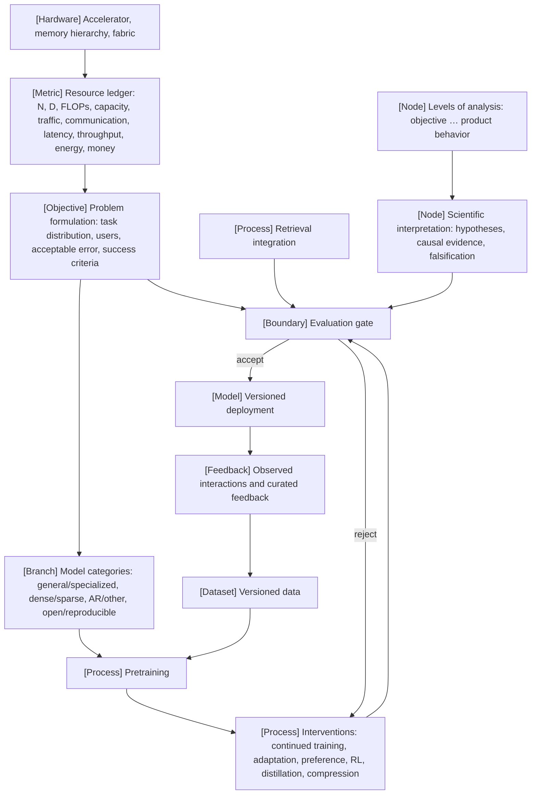

VOLUME I / PART I — SCIENTIFIC FOUNDATIONS / CHAPTER 01

# 01 — The foundation-model lifecycle as a scientific system

A foundation model is trained on broad data for adaptation across downstream tasks; explaining its deployed behavior requires distinguishing the training artifact, adaptation procedure, execution system, evaluation population, and evidence for each claimed effect (R1.17, §§1.1, 4.3–4.4).

6 sections · 20 spine papers · 20 implementations named by stack layer, 0 pinned · prerequisites: graduate-level ML and software engineering; [front-matter notation](../../../front-matter/notation.md) · artifact: a system specification with measurable objectives and resource constraints · updated 2026-10-07

## Why this chapter exists

The foundation-model report defines adaptation as part of the model's use and identifies evaluation under different access, data, and resource requirements as a separate scientific problem (R1.17, §§4.3–4.4). HELM operationalizes evaluation as scenarios, adaptation procedures, and metrics, exposing trade-offs hidden by a single score (P50, §§2–4). These distinctions are necessary when a model is assessed as part of a service: the measured object includes prompting, retrieval, decoding, runtime, workload, and evaluator, alongside its weights.

Published methods intervene at different points. InstructGPT changes a pretrained policy through demonstrations, preference modeling, and PPO; R1-Zero applies rule-reward RL without preliminary SFT; the R1 student route instead uses generated-response supervision (P21; P26). FlashAttention changes the IO schedule of attention, whereas PagedAttention changes allocation and sharing of serving state (P19; P36). A gain reported for one intervention cannot establish the effect of every component in the package, nor transfer automatically to another workload.

This chapter develops a system specification, a comparison map, and a resource ledger for those distinctions. Its equations and gate procedures are explicitly identified as book formulations. Published experimental methods and outcomes are explained separately from the chapter's unexecuted verification proposals. The resulting account supports bounded conclusions: an operation count is not measured latency, available weights are not reproduced training, and a behavior label is not an internal mechanism.

```figure
id: fig-1.1
kind: compare
title: Scientific objects in a foundation-model system
caption: >-
  Each column names a different object of analysis. Evidence about one
  object transfers to another only through an explicit comparison or model.
placement: wide
evidence: ASSUMED
source: [R1.17, P50, P19, P21]
concepts: [ms.chapter.1]
alt: >-
  Comparison of task specification, model and adaptation, execution,
  and evidence. Each has distinct inputs, outcomes, and validation limits.
spec:
  axis: "Object, question, and evidence boundary"
  columns:
    - { id: task, label: "Task specification" }
    - { id: model, label: "Model and adaptation" }
    - { id: execution, label: "Execution" }
    - { id: evidence, label: "Evidence" }
  rows:
    - { dimension: "question", values: { task: "which population and errors matter?", model: "which training intervention changes the artifact?", execution: "which work, state, and transfers are required?", evidence: "which measurement supports the claim?" } }
    - { dimension: "record", values: { task: "acceptance function and constraints (§1.1)", model: "categories and versioned route (§1.3–1.4)", execution: "ten-entry ledger (§1.5)", evidence: "comparison and claim records (§1.2, §1.6)" } }
    - { dimension: "limit", values: { task: "finite samples do not certify all users", model: "pipeline gains do not isolate every stage", execution: "bounds do not establish achieved performance", evidence: "provenance does not supply causal identification" } }
```

## Concept map


```mermaid
flowchart TD
  SPEC["[Objective] Problem formulation: task distribution, users, acceptable error, success criteria"]
  LEV["[Node] Levels of analysis: objective … product behavior"]
  CAT["[Branch] Model categories: general/specialized, dense/sparse, AR/other, open/reproducible"]
  DATA["[Dataset] Versioned data"]
  PRE["[Process] Pretraining"]
  INT["[Process] Interventions: continued training, adaptation, preference, RL, distillation, compression"]
  RET["[Process] Retrieval integration"]
  GATE["[Boundary] Evaluation gate"]
  DEP["[Model] Versioned deployment"]
  FB["[Feedback] Observed interactions and curated feedback"]
  HW["[Hardware] Accelerator, memory hierarchy, fabric"]
  LEDGER["[Metric] Resource ledger: N, D, FLOPs, capacity, traffic, communication, latency, throughput, energy, money"]
  INTERP["[Node] Scientific interpretation: hypotheses, causal evidence, falsification"]
  SPEC --> GATE
  SPEC --> CAT
  CAT --> PRE
  DATA --> PRE
  PRE --> INT
  INT --> GATE
  RET --> GATE
  GATE -->|accept| DEP
  GATE -->|reject| INT
  DEP --> FB
  FB --> DATA
  HW --> LEDGER
  LEDGER --> SPEC
  LEV --> INTERP
  INTERP --> GATE
```

Text equivalent:

- Problem formulation (objective) → defines the evaluation gate and constrains the model category.
  - Model category (branch) → selects the pretraining route.
  - Versioned data (dataset) → pretraining (process) → interventions (process) → evaluation gate (boundary).
  - Retrieval integration (process) → evaluation gate.
  - Evaluation gate → accept → versioned deployment (model) → observed interactions and curated feedback (feedback) → versioned data.
  - Evaluation gate → reject → back to interventions.
- Hardware → resource ledger (metric) → problem formulation (constraints).
- Levels of analysis (node) → scientific interpretation (node) → evaluation gate (what counts as evidence).

```figure
id: fig-1.2
kind: cycle
title: The foundation-model lifecycle with its return paths
caption: >-
  The column is one forward route; every arc on the right carries information
  upstream. Three returns do the work: a rejected or returned artifact goes
  back to an intervention, an accepted teacher becomes data for a student,
  and production traffic re-enters the data only through curation. The
  specification enters from outside the loop, on the left: its criteria
  exist before any artifact the gate will judge.
placement: inline
evidence: DERIVED
source: ["DERIVED:alg-1.4", "DERIVED:eq-1.2", P26]
concepts: [ms.section.1.4]
alt: >-
  Cycle drawn as a column of nine stages: specification σ (objective, Eq. 1.2,
  rejection criteria fixed first); versioned data; pretraining (C ≈ 6ND under
  dense accounting); base checkpoint; interventions (CT for continued
  training, SFT or PEFT, preference learning, RL, compression); evaluation
  gate (accept, reject, return); versioned deployment (M_params plus M_KV per
  replica); observed interactions; curated feedback (permissions and leakage
  check). Forward edges run down the column; the specification feeds the
  gate its criteria, and the base checkpoint may be gated directly. Feedback
  arcs: gate back to interventions on reject or return; gate back to data
  when an accepted teacher is distilled into samples; curated feedback back
  to data as a new version.
spec:
  stages:
    - { id: spec, label: "Specification σ", kind: objective, sub: "Eq. 1.2 · rejection fixed first" }
    - { id: data, label: "Versioned data", kind: dataset, sub: "D tokens, one version per route" }
    - { id: pre, label: "Pretraining", kind: process, sub: "C ≈ 6ND, dense accounting" }
    - { id: base, label: "Base checkpoint", kind: model }
    - { id: int, label: "Interventions", kind: process, sub: "CT · SFT/PEFT · pref · RL · compress" }
    - { id: gate, label: "Evaluation gate", kind: boundary, sub: "accept · reject · return" }
    - { id: dep, label: "Versioned deployment", kind: model, sub: "M_params + M_KV per replica" }
    - { id: obs, label: "Observed interactions", kind: feedback }
    - { id: cur, label: "Curated feedback", kind: feedback, sub: "permissions · leakage check" }
  edges:
    - { from: spec, to: gate, label: "criteria" }
    - { from: data, to: pre }
    - { from: pre, to: base }
    - { from: base, to: int }
    - { from: base, to: gate, label: "base may be gated" }
    - { from: int, to: gate }
    - { from: gate, to: dep, label: "accept" }
    - { from: dep, to: obs }
    - { from: obs, to: cur }
    - { from: cur, to: data, kind: feedback, label: "new data version" }
    - { from: gate, to: int, kind: feedback, label: "reject or return" }
    - { from: gate, to: data, kind: feedback, label: "distillation samples" }
```

## Position in the book

| Relation | Chapters and sections |
|---|---|
| Prerequisites | graduate-level ML and software engineering; [Notation](../../../front-matter/notation.md) |
| Siblings (same part) | [02 Mathematical and statistical foundations](../ch02-mathematical-and-statistical-foundations/README.md) · [03 Numerical computation](../ch03-numerical-computation-and-trustworthy-training/README.md) · [04 Language modeling objectives](../ch04-language-modeling-and-learning-objectives/README.md) · [05 Minimal Transformer](../ch05-minimal-transformer-and-execution-trace/README.md) · [06 Experimental design](../ch06-experimental-design-and-evaluation-before-optimization/README.md) |
| Downstream | [§2.6 Optimization language](../ch02-mathematical-and-statistical-foundations/02-6-optimization-language.md) · [§6.3 Controlled comparisons](../ch06-experimental-design-and-evaluation-before-optimization/06-3-controlled-comparisons.md) · [§19.1 Objective selection](../../part-04-training-science-and-adaptation/ch19-pretraining-objectives-and-the-full-training-loop/19-1-objective-selection.md) · [§21.2 Compute-optimal design](../../part-04-training-science-and-adaptation/ch21-scaling-laws-and-compute-allocation/21-2-compute-optimal-design.md) · [§25.3 Roofline reasoning](../../../vol-02-execution-and-optimization/part-05-hardware-kernels-and-distributed-execution/ch25-accelerators-memory-hierarchy-and-performance-models/25-3-roofline-reasoning.md) · [§42.2 State accounting](../../../vol-02-execution-and-optimization/part-07-inference-algorithms-distillation-and-compression/ch42-prefill-decode-kv-state-and-inference-resource-models/42-2-state-accounting.md) · [§48.5 Economics](../../../vol-02-execution-and-optimization/part-08-inference-engines-and-production-serving/ch48-capacity-planning-benchmarking-and-lifecycle-economics/48-5-economics.md) · [§61.4 Validity threats](../../../vol-03-grounded-and-interactive-intelligence/part-11-evaluation-interpretability-and-deployment-assurance/ch61-capability-portfolios-and-benchmark-validity/61-4-validity-threats.md) · [§66.3 Release gates](../../../vol-03-grounded-and-interactive-intelligence/part-11-evaluation-interpretability-and-deployment-assurance/ch66-release-decisions-reproducibility-and-research-to-production-closure/66-3-release-gates.md) |
| Trades off with | [§64.1 Behavioral versus mechanistic evidence](../../../vol-03-grounded-and-interactive-intelligence/part-11-evaluation-interpretability-and-deployment-assurance/ch64-mechanistic-interpretability-and-causal-model-analysis/64-1-behavioral-versus-mechanistic-evidence.md) (depth of explanation vs cost of evidence) · [§35.6 Scientific boundaries](../../../vol-02-execution-and-optimization/part-06-post-training-and-reinforcement-learning/ch35-verifiable-reward-rl-and-reasoning-policy-optimization/35-6-scientific-boundaries.md) (attribution of post-training gains) |

## Sections

| Section | Title | What changes here | Primary evidence labels |
|---|---|---|---|
| [1.1](01-1-problem-formulation.md) | Problem formulation | An application becomes a task distribution, an error tolerance, an operating envelope, and a constrained optimization problem | MATHEMATICALLY-DERIVED, PAPER-REPORTED, ASSUMED |
| [1.2](01-2-levels-of-analysis.md) | Levels of analysis | Seven levels are separated and each is assigned the evidence that can support a claim about it | KNOWN, DERIVED, PAPER-REPORTED |
| [1.3](01-3-model-categories.md) | Model categories | Four category axes are defined by what they change in the ledger, not by brand | PAPER-REPORTED, MATHEMATICALLY-DERIVED, NOT-DISCLOSED |
| [1.4](01-4-lifecycle-and-intervention.md) | Lifecycle and intervention | Training and deployment become a conditional graph with four compatibility conditions per edge | PAPER-REPORTED, DERIVED, OFFICIAL-DOCUMENTATION |
| [1.5](01-5-resource-accounting.md) | Resource accounting | Ten resource dimensions are fixed as a ledger with units, bounds, and provenance | MATHEMATICALLY-DERIVED, PAPER-REPORTED, UNVERIFIED |
| [1.6](01-6-scientific-interpretation.md) | Scientific interpretation | Behavioral, resource, internal-intervention, and training-intervention evidence are matched to their estimands | KNOWN, PAPER-REPORTED, DERIVED |

## Artifact

A **system specification** for one application: a versioned record (`spec.yaml` plus `spec-rationale.md`) with fields `task_distribution` (population, sampling procedure, schema, held-out split id, contamination policy), `users_and_operating_conditions` (segments, request mix, arrival envelope, context-length quantiles, hardware class, permissions), `capabilities` (each bound to a benchmark record, [§6.1](../ch06-experimental-design-and-evaluation-before-optimization/06-1-evaluation-units.md)), `acceptable_errors` (class, severity, tolerated rate, estimator), `success_criteria` (metric, estimator, threshold, confidence procedure, evaluator independence), `resource_constraints` (the ten-entry ledger of [§1.5](01-5-resource-accounting.md)), `rejection_criteria` (from [verification.md](verification.md)), and `provenance` (label and source per field).

## Verification

One application is written as a constrained optimization problem whose decision variables are model category, parameter count, precision, context policy, retrieval policy, and replica count; whose objective is the accepted-task rate on a held-out task distribution; and whose constraints are latency quantiles, memory capacity, throughput at the arrival envelope, and cost per accepted task. [verification.md](verification.md) lists the measurements that reject the design: an accepted-task-rate interval below threshold, a p95 latency above the SLO under declared load, a predicted memory footprint above capacity, or a cost per accepted task above budget. The protocol is a proposal; nothing was measured for this edition.

## Lineage

- 2015 · Hidden Technical Debt in Machine Learning Systems (R1.5) · conceptual ancestor: dependencies and feedback around the predictor.
- 2019 · Model Cards for Model Reporting (R1.3) · conceptual ancestor: intended use, evaluation factors, and limitations.
- 2020 · Scaling Laws for Neural Language Models (P08) · conceptual ancestor: empirical resource/loss relationships.
- 2022 · Chinchilla (P09) · engineering optimization: token/parameter allocation at fixed training compute.
- 2022 · InstructGPT (P21) · alternative branch: demonstrations, preference modeling, and PPO with retention measurements.
- 2022–2023 · HELM (P50) · conceptual ancestor: scenario, adaptation, and multi-metric evaluation.
- 2024–2025 · DeepSeek-V3 (P13) · engineering optimization: routed experts, MLA, and joint training/system accounting.
- 2025 · DeepSeek-R1 v1 (P26) · alternative branch: distinct RL and response-distillation routes.
- 2025 · Circuit Tracing (P52) · engineering optimization: sparse replacement-model analysis with perturbation validation.

```figure
id: fig-1.3
kind: lineage
title: Dated sources for the chapter's scientific distinctions
caption: >-
  Dates identify the cited works, not a claim that they are the latest or
  universally best method. Each contributes a different comparison or account.
placement: inline
evidence: PAPER-REPORTED
source: [R1.5, R1.3, P08, P09, P21, P50, P13, P26, P52]
alt: >-
  Timeline from system technical debt in 2015 through reporting and scaling,
  compute allocation, instruction following, HELM, sparse-system accounting,
  R1 pipelines, and circuit tracing in 2025.
spec:
  entries:
    - { year: 2015, work: "Hidden Technical Debt", cite: R1.5, relation: "conceptual ancestor", note: "dependencies and feedback" }
    - { year: 2019, work: "Model Cards", cite: R1.3, relation: "conceptual ancestor", note: "intended use and evaluation factors" }
    - { year: 2020, work: "Scaling Laws", cite: P08, relation: "conceptual ancestor", note: "resource/loss relationships" }
    - { year: 2022, work: "Chinchilla", cite: P09, relation: "engineering optimization", note: "compute-matched allocation" }
    - { year: 2022, work: "InstructGPT", cite: P21, relation: "alternative branch", note: "supervision, preferences, PPO" }
    - { year: 2022, work: "HELM", cite: P50, relation: "conceptual ancestor", note: "scenarios, adaptation, metrics" }
    - { year: 2024, work: "DeepSeek-V3", cite: P13, relation: "engineering optimization", note: "architecture and resource accounting" }
    - { year: 2025, work: "DeepSeek-R1 v1", cite: P26, relation: "alternative branch", note: "RL and student-response supervision" }
    - { year: 2025, work: "Circuit Tracing", cite: P52, relation: "engineering optimization", note: "replacement models and validation" }
```

## Terms owned here

| Term | One-line definition | Section |
|---|---|---|
| foundation-model lifecycle | The gated graph of data, training, intervention, evaluation, deployment, and feedback edges through which a model version is produced and revised | [1.4](01-4-lifecycle-and-intervention.md) |
| system specification | The versioned record fixing task distribution, users, capabilities, acceptable errors, operating conditions, success criteria, and resource constraints before development | [1.1](01-1-problem-formulation.md) |
| task distribution | The population of (conditioning, reference, user-context) triples over which quality is defined and estimated | [1.1](01-1-problem-formulation.md) |
| operating conditions | The envelope of input, load, hardware, and policy conditions under which success criteria must hold | [1.1](01-1-problem-formulation.md) |
| acceptable error | A tolerated rate for a named error class with a stated severity and estimator | [1.1](01-1-problem-formulation.md) |
| success criterion | A metric, estimator, threshold, confidence procedure, and evaluator-independence statement fixed before measurement | [1.1](01-1-problem-formulation.md) |
| level of analysis | One of objective, representation, algorithm, implementation, runtime, infrastructure, product behavior; the unit at which a claim is attributed | [1.2](01-2-levels-of-analysis.md) |
| held-fixed rule | An attribution must state changed and controlled variables together with the assumptions identifying the contrast | [1.2](01-2-levels-of-analysis.md) |
| general versus specialized model | A distinction by the width of the task distribution the specification commits to, not by size or brand | [1.3](01-3-model-categories.md) |
| open weights versus reproducible training | Disclosure of inference-time parameters versus disclosure sufficient to re-run training within stated tolerances | [1.3](01-3-model-categories.md) |
| intervention | A process that consumes a versioned artifact and data and produces a new artifact that must pass an evaluation gate | [1.4](01-4-lifecycle-and-intervention.md) |
| evaluation gate | A boundary at which a produced artifact is accepted, rejected, or returned according to pre-registered criteria | [1.4](01-4-lifecycle-and-intervention.md) |
| artifact interface | The tokenizer, template, tensor format, precision, and metadata a consuming process requires of a produced artifact | [1.4](01-4-lifecycle-and-intervention.md) |
| resource ledger | The ten-entry accounting record (parameters, tokens, FLOPs, memory capacity, memory traffic, communication, latency, throughput, energy, money) attached to every mechanism | [1.5](01-5-resource-accounting.md) |
| cost line | The one-line statement of a mechanism's ledger entries, or NOT-DISCLOSED / UNVERIFIED | [1.5](01-5-resource-accounting.md) |
| cognitive analogy | An operationally defined behavior or process label; its wording supplies no additional mechanistic evidence | [1.6](01-6-scientific-interpretation.md) |
| falsification condition | The pre-stated measurement outcome that would reject a claim | [1.6](01-6-scientific-interpretation.md) |
| competing hypotheses | The alternative explanations a design must discriminate before a gain is attributed | [1.6](01-6-scientific-interpretation.md) |

## Reference-stack coverage

This table records permitted source and implementation routes. The fulltexts actually inspected, revisions, locators, and access dates are in [references](references.md). Listed lab index URLs identify the reference-stack route; they are not represented as separately inspected evidence. Implementation names indicate analytical placement, not verified software execution.

| Stack section | Entry | Stack layer | What this chapter takes from it | Surface used | Sections | Evidence label |
|---|---|---|---|---|---|---|
| §1 lab | #1 Anthropic | n/a | Circuit Tracing methods page (P52): hypotheses validated by perturbation of the underlying model; stated limitations. Page opened at transformer-circuits.pub, the plan's P52 URL, indexed from the listed research surface | Research: https://www.anthropic.com/research | 1.6 | OFFICIAL-DOCUMENTATION |
| §1 lab | #2 OpenAI | n/a | Scaling-law fulltext (P08); three-stage instruction-following route and labeler-preference result (P21); contrastive pretraining task (P44); GPT-4 Technical Report Section 2 scope statement as the NOT-DISCLOSED exemplar (R1.14) | Papers: https://openai.com/research/index/publication/ | 1.1, 1.3, 1.4, 1.5, 1.6 | PAPER-REPORTED |
| §1 lab | #3 Google DeepMind | n/a | Compute-optimal allocation: equal scaling of N and D, over 400 models from 70M to 16B parameters (P09) | Papers: https://deepmind.google/research/publications/ | 1.5, 1.6 | PAPER-REPORTED |
| §1 lab | #4 Meta AI / FAIR | n/a | Parametric plus non-parametric memory formulation of retrieval (P40); joint-embedding predictive family (P47) | Papers: https://ai.meta.com/results/?content_types%5B0%5D=publication | 1.3, 1.4, verification | PAPER-REPORTED |
| §1 lab | #4 Meta AI / FAIR | n/a | Llama-3.3-70B-Instruct model card: the 70B release is instruction tuned with SFT and RLHF, so one of R1's six distillation students does not start from a base checkpoint (R1.16); opened at huggingface.co/meta-llama/Llama-3.3-70B-Instruct under the listed organization on 2026-10-07 | Models: https://huggingface.co/meta-llama | 1.4 | OFFICIAL-DOCUMENTATION |
| §1 lab | #8 DeepSeek | n/a | DeepSeek-V3 §§1–2 and Table 1: 671B total and 37B activated parameters, 14.8T tokens, 2.788M H800 GPU-hours (P13); DeepSeekMath continued pretraining on 120B math tokens (P25); DeepSeek-R1 routes, Section 2.4 SFT-only distillation, Section 4.1 distillation versus RL (P26) | Papers: https://github.com/deepseek-ai | 1.2, 1.3, 1.4, 1.5, 1.6 | PAPER-REPORTED |
| §1 lab | #8 DeepSeek | n/a | DeepSeek-R1 repository README: six distilled models on Qwen2.5 and Llama-3 checkpoints, MIT license (R1.15); opened at github.com/deepseek-ai/DeepSeek-R1 under the listed organization | Code: https://github.com/deepseek-ai | 1.4 | OFFICIAL-DOCUMENTATION |
| §1 lab | #13 Microsoft Research / Microsoft AI | n/a | LoRA §4: frozen base weights, trainable low-rank update, and merged inference matrix (P14) | Papers: https://www.microsoft.com/research/publications/ | 1.2, 1.4 | PAPER-REPORTED |
| §1 lab | #18 Google Research | n/a | Text-to-text and denoising objectives, C4 (P02); single-expert routing at constant per-example compute (P10); soft-target distillation (P32); Model Cards (R1.3); BERT (R1.9); training energy and carbon factors (R1.12); hidden technical debt (R1.5, opened at the NeurIPS proceedings page) | Papers: https://research.google/pubs/ | 1.1, 1.3, 1.4, 1.5, lineage | PAPER-REPORTED |
| §1 lab | #22 Allen Institute for AI (Ai2) | n/a | Dolma corpus and curation toolkit (P05); OLMo release of weights, training data, training and evaluation code (R1.7) as reproducible-training exemplars | Papers: https://allenai.org/papers | 1.3 | PAPER-REPORTED |
| §1 lab | #38 Stanford CRFM | n/a | HELM (P50): scenario/adaptation/metric methodology, Table 7 protocol and Figs. 24–25 calibration comparisons (P50); adaptation/evaluation framework (R1.17) | Code: https://github.com/stanford-crfm | 1.1, 1.6 | PAPER-REPORTED |
| §2 conference | #1 NeurIPS | n/a | Archival venue for R1.5 (NIPS 2015, opened at papers.nips.cc) and venue status of P40; first stop of the conference workflow in the source route | Papers: https://proceedings.neurips.cc/ | lineage, 1.4, source route | PAPER-REPORTED |
| §2 conference | #4 ACL | n/a | Venue status of Dolma (ACL 2024) and of the energy-reporting paper R1.11 (ACL 2019), as stated on their arXiv pages; Anthology pages not opened | Papers: https://aclanthology.org/venues/acl/ | 1.3, 1.5 | PAPER-REPORTED |
| §3 discovery source | #1 arXiv | n/a | HTML or PDF fulltexts of cited papers, with source-specific method and experiment locators recorded in references.md | Home: https://arxiv.org/ ; Search/API: https://arxiv.org/search/advanced | all | PAPER-REPORTED |
| §3 discovery source | #2 OpenReview | n/a | Revision-history step of the paper cascade for ICLR versions (for example P14); not opened | Home: https://openreview.net/ | source route | KNOWN (route only) |
| §4 system | #4 NVIDIA NCCL; #10 AMD RCCL | Kernels / numerics / collectives | Named as the measurement point for the communication entry of the ledger; no documentation claim taken | https://docs.nvidia.com/deeplearning/nccl/ ; https://rocm.docs.amd.com/projects/rccl/en/latest/ | 1.5 | KNOWN (placement only; version UNVERIFIED) |
| §4 system | #39 FlashAttention | Kernels / numerics / collectives | Exact attention with reduced HBM reads and writes as the exemplar of an implementation-level change (P19) | https://github.com/Dao-AILab/flash-attention | 1.2, 1.5 | PAPER-REPORTED |
| §4 system | #17 PyTorch | Model / autograd framework | Host of internal-perturbation forward-pass interventions | https://pytorch.org/docs/stable/ | 1.6 | KNOWN (placement only; version UNVERIFIED) |
| §4 system | #19 PyTorch FSDP2; #20 PyTorch DTensor / DeviceMesh; #21 TorchTitan; #23 NVIDIA Megatron-Core; #25 Microsoft DeepSpeed | Distributed training | Placement of the pretraining and continued-training edges, of expert parallelism for sparse models, and of controlled-comparison and training-intervention re-runs | https://docs.pytorch.org/docs/stable/distributed.fsdp.fully_shard.html ; https://docs.pytorch.org/docs/stable/distributed.tensor.html ; https://github.com/pytorch/torchtitan ; https://docs.nvidia.com/megatron-core/index.html ; https://www.deepspeed.ai/ | 1.3, 1.4, 1.6 | KNOWN (placement only; version UNVERIFIED) |
| §4 system | #26 Hugging Face Transformers; #28 Hugging Face PEFT; #32 torchtune | Model definition / adaptation | Placement of the adaptation edge; released configs as the source of the dense/sparse coordinate; quality measurement under a pinned harness | https://huggingface.co/docs/transformers/ ; https://huggingface.co/docs/peft/ ; https://docs.pytorch.org/torchtune/stable/ | 1.1, 1.3, 1.4, 1.6 | KNOWN (placement only; version UNVERIFIED) |
| §4 system | #29 Hugging Face TRL; #36 OpenRLHF; #37 verl; #38 NVIDIA NeMo RL | Post-training / RL | Placement of the preference-learning and RL edges and of matched-route experiments | https://huggingface.co/docs/trl/ ; https://github.com/OpenRLHF/OpenRLHF ; https://verl.readthedocs.io/en/latest/ ; https://docs.nvidia.com/nemo/rl/latest/index.html | 1.4, 1.6 | KNOWN (placement only; version UNVERIFIED) |
| §4 system | #41 vLLM | Inference engine | Paged KV allocation as the exemplar of a runtime-level change and of capacity as a binding ledger entry (P36); measurement point for latency and throughput rows | https://docs.vllm.ai/ | 1.1, 1.2, 1.3, 1.4, 1.5, 1.6, verification | PAPER-REPORTED |
| §4 system | #42 SGLang; #43 TensorRT-LLM; #45 llama.cpp | Inference engine | Alternative runtimes for runtime-level comparisons at fixed weights; consumers of compressed artifacts (safetensors, GGUF) on the deployment edge | https://docs.sglang.ai/ ; https://docs.nvidia.com/tensorrt-llm/ ; https://github.com/ggml-org/llama.cpp | 1.1, 1.2, 1.3, 1.4, 1.5 | KNOWN (placement only; version UNVERIFIED) |
| **Outside the reference stack (routed via book_plan.md anchors)** | | | | | | |
| plan anchor, Chapter 01 | CS336: Language Modeling from Scratch, Spring 2026 and Spring 2025 archive (R1.1, R1.2) | n/a | Five-assignment build of the lifecycle (basics, systems, scaling, data, alignment and reasoning RL); the plan names it as this chapter's source anchor and as the current curriculum reference | https://cs336.stanford.edu/ ; https://cs336.stanford.edu/spring2025/ | lineage, source route | OFFICIAL-DOCUMENTATION |
| plan spine, Appendix D | P28 (Sea AI Lab and collaborators); P11 (Gu and Dao); P36 (UC Berkeley authors) | n/a | Authors' organizations are not entries of §1 under these names; the works are admitted because Appendix D lists them as spine papers | arXiv URLs of Appendix D | 1.2, 1.3, 1.4, 1.6 | PAPER-REPORTED |

| plan §07.5 and stack §2 ACL / §1 Berkeley AI Research | Dataset documentation and primary research papers | n/a | Datasheets (R1.4), DDPM (R1.10), ACL energy methodology (R1.11); fulltext methods rather than a new laboratory admission | https://aclanthology.org/venues/acl/ ; https://bair.berkeley.edu/ | 1.1, 1.3, 1.5 | PAPER-REPORTED |

**Inspection dimensions applied.** Memory, Precision, Communication, Kernels, Inference, and Metrics are accounted for in §§1.2–1.5. Post-training is reconstructed in §1.4; Reproducibility distinguishes source pinning, available artifacts, and independent reruns throughout. Parallelism, Checkpointing, and Reliability are ledger/dependency boundaries here; their algorithmic treatment belongs to their canonical chapters. No runtime version, current accelerator performance, or power measurement is certified.

## Source route

Queries use the exact protocols of `Instruction/AI_REFERENCE_STACK.md`.

1. Lab-level protocol (§1.1, steps 3–4): `site:arxiv.org/abs "DeepSeek" "technical report"`, then `site:github.com/deepseek-ai "configuration"` for configs and licenses before any architecture claim.
2. Lab-level training-detail template (§1.1): `"DeepSeek-R1" (training OR pretraining OR post-training OR inference OR architecture) filetype:pdf`.
3. Conference workflow (§2.1): last two editions of NeurIPS/ICML/ICLR for compute-optimal allocation, then ACL/EMNLP for evaluation validity; arXiv query `cat:cs.LG AND ti:"scaling laws"`.
4. Paper-search cascade (§3.1) with the Semantic Scholar pattern: `https://api.semanticscholar.org/graph/v1/paper/search?query=holistic evaluation of language models&year=2022-2026&openAccessPdf&fields=title,year,authors,venue,citationCount,url,openAccessPdf`.
5. Training-stack protocol (§4.3), performance-evidence line: `"vLLM" (throughput OR MFU OR tokens/s OR TTFT OR TPOT) "<GPU_OR_ACCELERATOR>"` with the reader's accelerator filled in.
6. Claim verification: locate methods, experiment configuration, results, uncertainty, and limitations in the primary fulltext before entering a comparison.

## Status

Editorial status: **manuscript_draft**. All six sections now explain source methods, reported experiments, observations, and documented improvements. The book's algorithms, ledger approximations, and verification designs are identified separately. Thirty-four primary fulltexts or official records were inspected on 2026-10-07; no experiment was independently run.

Material gaps remain: some PDF revisions and live pages are not immutably pinned; no software commit or end-to-end rerun is verified; proprietary corpora and some configurations are unavailable; circuit-validation transfer and complete component attribution are not established. DeepSeek-V3's $5.576M training estimate **is disclosed** under its $2/H800-hour assumption, while facility energy and complete research-program cost are not. The [verification coverage audit](verification.md#coverage-audit) records topic boundaries and unresolved obligations without claiming exhaustive literature coverage.
