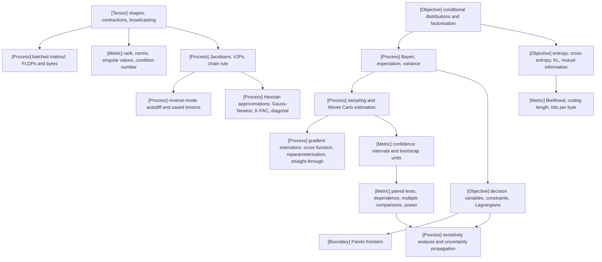

VOLUME I / PART I — SCIENTIFIC FOUNDATIONS / CHAPTER 02

# 02 — Mathematical and statistical foundations

Every quantity the rest of this book reports — a loss, a gradient, a benchmark difference, a compute-optimal allocation — is an estimator with a shape, a cost, and an uncertainty, and this chapter fixes the notation and estimation rules under which those three things are stated consistently.

6 sections · 5 spine papers · 3 implementations · prerequisites: 01, front-matter/notation · artifact: a consistent notation and statistical-estimation reference · updated 2026-09-20

## Why this chapter exists

What failed before is not the mathematics, which is textbook material, but its *accounting*. Chapter 01 established that a foundation model is a constrained optimisation problem whose evidence lives at several levels of analysis. Reading the primary literature with that lens exposes three recurring defects. First, losses are reported without their normalisation (per token, per sequence, per byte), so that two "perplexities" from different tokenisers are compared as if they measured the same thing. Second, benchmark differences are reported without a variance model, and where a variance model exists it typically resamples the wrong unit: individual prompts that share a template, a passage, or a seed are treated as independent draws, and confidence intervals come out several times too narrow. Third, derivative quantities — gradients, Hessian approximations, policy-gradient estimators — are named without stating what they cost to compute, so that a method that needs a Hessian-vector product per step is compared to one that needs a gradient as if the two had the same price.

```figure
id: fig-2.1
kind: compare
title: Three accounting defects and the rule that repairs each
caption: >-
  Read the "quantity misstated" row first: none of the three defects is an
  error in mathematics. One is a missing denominator, one a missing variance
  factor, one a missing price. Each column is repaired by one rule owned by
  one section, and each rule carries a number the reader can check by hand.
  The middle column's is the largest: at m = 10 prompts per template and
  ρ = 0.5 the naive interval is 2.3 times too narrow.
placement: wide
evidence: MATHEMATICALLY-DERIVED
source: ["DERIVED:eq-2.13", "DERIVED:eq-2.22", "DERIVED:eq-2.14"]
alt: >-
  Comparison table with three columns, one per accounting defect named in
  the chapter opening: loss normalisation (§02.3), the resampled unit
  (§02.5) and the price of a derivative (§02.4). Loss normalisation misstates
  the denominator and log base; it is repaired by bits per byte,
  BPB = (L_T/L_B)·ℓ/ln 2 (Eq. 2.13), with the worked number 1 nat = 1.443
  bits. The resampled unit misstates the variance, σ²/n instead of
  (σ²/n)·DE; it is repaired by resampling the independent unit
  (Algorithm 2.5) with DE = 1 + (m − 1)ρ (Eq. 2.22); at m = 10 and ρ = 0.5,
  DE = 5.5, the interval is about 2.3 times too narrow and a nominal z = 2 is
  z ≈ 0.85. The derivative price misstates cost as a multiple of a forward
  pass and the saved bytes; it is repaired by writing derivatives as VJP,
  JVP or HVP priced per application (Eq. 2.14, 2.17); backward is about twice
  forward, forward plus backward about 6 FLOPs per parameter per token, and
  forming a Hessian needs N² entries. A last row names the falsifiable check
  for each.
spec:
  axis: >-
    What each defect named in this chapter's opening misstates about a
    reported number, and the rule, worked number and check that repair it;
    no method, paper or lab is ranked
  columns:
    - { id: norm, label: "Loss normalisation", node: ms.section.2.3 }
    - { id: unit, label: "Resampled unit", node: ms.section.2.5 }
    - { id: price, label: "Price of a derivative", node: ms.section.2.4 }
  rows:
    - { dimension: "defect as stated", values: { norm: "losses reported without per-token, per-sequence or per-byte normalisation; perplexities across tokenisers compared", unit: "prompts sharing a template, passage or seed resampled as independent draws", price: "a method needing a Hessian-vector product per step compared with one needing a gradient as if equal in price" } }
    - { dimension: "quantity misstated", values: { norm: "the denominator (token or byte) and the log base", unit: "the variance: σ²/n reported where (σ²/n)·DE holds", price: "cost as a multiple of a forward pass, and the bytes saved for backward" } }
    - { dimension: "rule fixed here", values: { norm: "BPB = (L_T/L_B)·ℓ/ln 2 (Eq. 2.13); unit, denominator and tokenizer stated with every loss", unit: "resample the independent unit (Algorithm 2.5); DE = 1 + (m − 1)ρ (Eq. 2.22)", price: "derivatives written as VJP, JVP or HVP and priced per application (Eq. 2.14, 2.17)" } }
    - { dimension: "worked number", values: { norm: "1 nat = 1/ln 2 ≈ 1.443 bits (Eq. 2.10)", unit: "m = 10, ρ = 0.5: DE = 5.5; interval √5.5 ≈ 2.3× too narrow; a nominal z = 2 is z ≈ 0.85", price: "backward ≈ 2× forward; forward + backward ≈ 6 FLOPs per parameter per token; forming H needs N² entries" } }
    - { dimension: "falsifiable check", values: { norm: "§04.6 verification: one byte corpus scored under two tokenisers", unit: "Experiment 2.2: per-prompt against per-cluster coverage", price: "§02.4 proposal: gradient, HVP and K-FAC statistics timed as multiples of a forward pass" } }
```

The bottleneck that appeared as models scaled is that every one of these defects is now expensive. An experiment whose confidence interval is wrong wastes a training run; a scaling fit whose parameter uncertainty is unpropagated allocates a compute budget to the wrong (N, D) point; an estimator whose variance is unmanaged makes an RL run diverge. The constraint that became dominant is therefore *auditability*: each number must be traceable to an estimator whose assumptions, shape, normalisation, cost, and uncertainty are explicit. What changed in the solution is nothing more than discipline: one notation (front-matter/notation.md), one cost line per mechanism, one evidence label per claim, and one rule for which unit is resampled. This chapter supplies the reference against which every later chapter's mathematics is checked.

## Concept map



Text equivalent:

- Tensor algebra (§02.1)
  - shapes, contractions, broadcasting → batched matmul cost (FLOPs, bytes) → arithmetic intensity
  - rank, norms, singular values → condition number → numerical sensitivity
- Probability (§02.2)
  - conditional distributions and factorisation → Bayes, expectation, variance → sampling and Monte Carlo estimation
- Information theory (§02.3)
  - entropy, cross-entropy, KL, mutual information → likelihood, coding length, bits per byte
- Differential calculus (§02.4)
  - Jacobians, VJPs, chain rule → reverse-mode autodiff (memory of saved tensors) and Hessian approximations
  - Monte Carlo estimation → gradient estimators (score function, reparameterisation, straight-through)
- Statistical inference (§02.5)
  - Monte Carlo estimation → confidence intervals and bootstrap units → paired tests, dependence, multiple comparisons, effect sizes, power
- Optimisation language (§02.6)
  - decision variables, constraints, Lagrangians → Pareto frontiers; sensitivity analysis and uncertainty propagation (fed by §02.5)

## Position in the book

| Relation | Links |
|---|---|
| Prerequisites | [Chapter 01](../ch01-foundation-model-lifecycle/README.md) (problem formulation, levels of analysis, resource accounting); [Notation](../../../front-matter/notation.md) |
| Siblings (same part) | [01](../ch01-foundation-model-lifecycle/README.md) · [03](../ch03-numerical-computation-and-trustworthy-training/README.md) · [04](../ch04-language-modeling-and-learning-objectives/README.md) · [05](../ch05-minimal-transformer-and-execution-trace/README.md) · [06](../ch06-experimental-design-and-evaluation-before-optimization/README.md) |
| Downstream | [§03.3 Automatic differentiation](../ch03-numerical-computation-and-trustworthy-training/03-3-automatic-differentiation.md) · [§04.6 Likelihood and capability](../ch04-language-modeling-and-learning-objectives/04-6-likelihood-and-capability.md) · [§06.4 Measurement uncertainty](../ch06-experimental-design-and-evaluation-before-optimization/06-4-measurement-uncertainty.md) · [§06.5 Quality/resource frontiers](../ch06-experimental-design-and-evaluation-before-optimization/06-5-quality-resource-frontiers.md) · [§20.1 Optimizer mechanics](../../part-04-training-science-and-adaptation/ch20-optimization-schedules-and-training-stability/20-1-optimizer-mechanics.md) · [§21.2 Compute-optimal design](../../part-04-training-science-and-adaptation/ch21-scaling-laws-and-compute-allocation/21-2-compute-optimal-design.md) · [§33.1 DPO derivation](../../../vol-02-execution-and-optimization/part-06-post-training-and-reinforcement-learning/ch33-direct-preference-optimization-and-related-objectives/33-1-dpo-derivation.md) · [§34.2 Policy gradients](../../../vol-02-execution-and-optimization/part-06-post-training-and-reinforcement-learning/ch34-policy-gradients-ppo-and-rlhf/34-2-policy-gradients.md) · [§62.2 Pairwise aggregation](../../../vol-03-grounded-and-interactive-intelligence/part-11-evaluation-interpretability-and-deployment-assurance/ch62-human-preference-model-judges-and-uncertainty/62-2-pairwise-aggregation.md) |
| Trades off with | Estimator variance vs cost (§02.2, §02.4); interval validity vs sample efficiency (§02.5); scalarised vs frontier comparison (§02.6, [§48.5 Economics](../../../vol-02-execution-and-optimization/part-08-inference-engines-and-production-serving/ch48-capacity-planning-benchmarking-and-lifecycle-economics/48-5-economics.md)) |

## Sections

| § | Title | What changes here | Primary evidence labels |
|---|---|---|---|
| [02.1](02-1-tensor-algebra.md) | Tensor algebra | every tensor operation acquires a shape contract, a FLOP count, a byte count, and a conditioning bound | MATHEMATICALLY-DERIVED, OFFICIAL-DOCUMENTATION |
| [02.2](02-2-probability.md) | Probability | expectations become Monte Carlo estimators with a stated variance and per-sample cost | MATHEMATICALLY-DERIVED |
| [02.3](02-3-information-theory.md) | Information theory | likelihood becomes coding length; bits per byte replaces perplexity as the tokenizer-independent unit | MATHEMATICALLY-DERIVED, PAPER-REPORTED |
| [02.4](02-4-differential-calculus.md) | Differential calculus | derivatives become VJPs with a memory cost; Hessians become products and factored approximations; stochastic gradients become named estimators with bias/variance | MATHEMATICALLY-DERIVED, PAPER-REPORTED |
| [02.5](02-5-statistical-inference.md) | Statistical inference | the resampled unit is the independent experimental unit, never the prompt when prompts are clustered | MATHEMATICALLY-DERIVED, PAPER-REPORTED |
| [02.6](02-6-optimization-language.md) | Optimisation language | design choices become decision variables under constraints; multipliers become prices; fitted parameters carry propagated uncertainty | MATHEMATICALLY-DERIVED, PAPER-REPORTED |

## Artifact

A consistent notation and statistical-estimation reference, delivered as:

1. `notation-extension.md` — the local symbols introduced in this chapter (contraction indices, σ_i, κ, J, vᵀJ, H, G, ρ, DE, λ_i as multipliers, Σ) with shape and unit, extending but never redefining [front-matter/notation.md](../../../front-matter/notation.md).
2. `estimator-table.md` — one row per estimator used in the book: estimand · estimator formula · unbiasedness · variance formula · per-sample cost · resampling unit · owning section.
3. `ce_gradient_check.py` — reference code (UNVERIFIED for version) that computes softmax + cross-entropy in log-sum-exp form and checks ∂L/∂z = p − y against finite differences.
4. `paired_cluster_bootstrap.py` — reference code (UNVERIFIED for version) implementing Algorithm 2.5, with unit tests that fail when the resampled unit is not the declared independent unit.

Field lists are given in [verification.md](verification.md).

## Verification

Two falsifiable tasks. (i) Derive the gradient of softmax cross-entropy in its log-sum-exp form and show, by finite-difference comparison in FP64 on ordinary and extreme logits, that ∂L/∂z = p − y to a stated tolerance; a persistent discrepancy larger than the tolerance rejects either the derivation or the numerical form. (ii) Implement a paired bootstrap that resamples independent experimental units (clusters), and demonstrate on a synthetic clustered population with known intra-cluster correlation that per-prompt resampling under-covers the true difference while cluster resampling attains nominal coverage within Monte Carlo error; if cluster resampling also fails coverage, the chapter's variance model is wrong. The full protocol is in [verification.md](verification.md).

## Lineage

- 1948 · Shannon, *A Mathematical Theory of Communication* [R2.1] · conceptual ancestor (entropy, coding length)
- 1979 · Efron, *Bootstrap Methods: Another Look at the Jackknife* [R2.2] · conceptual ancestor (resampling inference)
- 1992 · Williams, REINFORCE [R2.3] · conceptual ancestor (score-function gradient estimator)
- 2013 · Kingma and Welling, *Auto-Encoding Variational Bayes* [R2.4] · alternative branch (reparameterisation estimator)
- 2015 · Martens and Grosse, K-FAC [R2.5] · engineering optimization (factored curvature)
- 2018 · Baydin et al., autodiff survey [R2.6] · conceptual ancestor (forward vs reverse mode accounting)
- 2020 · Kaplan et al. [P08] · engineering optimization (power-law fits to loss)
- 2022 · Hoffmann et al. [P09] · current frontier (constrained allocation of N and D under a fitted loss)
- 2024 · Miller, *Adding Error Bars to Evals* [R2.7] · current frontier (clustered standard errors for evaluation items)

```figure
id: fig-2.2
kind: lineage
title: Lineage of the chapter's estimators and accounting rules
caption: >-
  Four of the nine entries supply an estimator the book still uses as
  written: entropy as coding length, the bootstrap, the score-function
  gradient and the reparameterised gradient. Two turn a quantity into
  something affordable (factored curvature, reverse-mode accounting). The
  last three are what the chapter's rules are applied to: fitted loss curves,
  an allocation under a constraint, and error bars on evaluation items.
  R2.1–R2.3 are UNVERIFIED in references.md (no primary URL opened).
placement: inline
evidence: PAPER-REPORTED
source: [R2.1, R2.2, R2.3, R2.4, R2.5, R2.6, P08, P09, R2.7]
alt: >-
  Timeline of the nine works in the chapter's Lineage list. 1948, Shannon,
  A Mathematical Theory of Communication (R2.1), conceptual ancestor: entropy
  and coding length. 1979, Efron, Bootstrap Methods (R2.2), conceptual
  ancestor: resampling inference. 1992, Williams, REINFORCE (R2.3),
  conceptual ancestor: the score-function gradient estimator. 2013, Kingma
  and Welling, Auto-Encoding Variational Bayes (R2.4), alternative branch:
  the reparameterisation estimator. 2015, Martens and Grosse, K-FAC (R2.5),
  engineering optimization: factored curvature. 2018, Baydin et al.,
  automatic differentiation survey (R2.6), conceptual ancestor: forward
  versus reverse mode accounting. 2020, Kaplan et al. (P08), engineering
  optimization: power-law fits to loss. 2022, Hoffmann et al. (P09), current
  frontier: constrained allocation of N and D under a fitted loss. 2024,
  Miller, Adding Error Bars to Evals (R2.7), current frontier: clustered
  standard errors for evaluation items.
spec:
  entries:
    - { year: 1948, work: "A Mathematical Theory of Communication", cite: R2.1, relation: "conceptual ancestor", node: ms.section.2.3, note: "entropy and coding length; the compressor reading of likelihood in §02.3" }
    - { year: 1979, work: "Bootstrap Methods: Another Look at the Jackknife", cite: R2.2, relation: "conceptual ancestor", node: ms.section.2.5, note: "resampling inference; §02.5 fixes which unit is resampled" }
    - { year: 1992, work: "REINFORCE (Williams)", cite: R2.3, relation: "conceptual ancestor", node: ms.section.2.4, note: "score-function estimator, Eq. 2.18; the policy gradient of §34.2" }
    - { year: 2013, work: "Auto-Encoding Variational Bayes", cite: R2.4, relation: "alternative branch", node: ms.section.2.4, note: "reparameterisation estimator, Eq. 2.19; continuous x only, so not for tokens" }
    - { year: 2015, work: "K-FAC: Kronecker-factored Approximate Curvature", cite: R2.5, relation: "engineering optimization", node: ms.section.2.4, note: "per-layer Fisher block as A ⊗ G_ℓ: d_in² + d_out² stored instead of (d_in·d_out)²" }
    - { year: 2018, work: "Automatic differentiation in machine learning: a survey", cite: R2.6, relation: "conceptual ancestor", node: ms.section.2.4, note: "forward versus reverse accumulation, the vocabulary of Eq. 2.14" }
    - { year: 2020, work: "Scaling Laws for Neural Language Models", cite: P08, relation: "engineering optimization", node: ms.section.2.6, note: "power-law fits of loss to N, D and C" }
    - { year: 2022, work: "Training Compute-Optimal Large Language Models", cite: P09, relation: "current frontier", node: ms.section.21.2, note: "allocation of N and D under 6ND = C and a fitted loss; Eq. 2.26" }
    - { year: 2024, work: "Adding Error Bars to Evals", cite: R2.7, relation: "current frontier", node: ms.section.2.5, note: "clustered and paired standard errors and a sample-size formula for evals" }
```

## Terms owned here

| Term | One-line definition | Section |
|---|---|---|
| tensor contraction | summation over shared index labels of two or more tensors, generalising matrix multiplication | 02.1 |
| broadcasting | implicit expansion of size-1 or missing leading axes so that elementwise operations apply across mismatched shapes | 02.1 |
| batched matrix multiplication | a contraction over one index applied independently across one or more leading batch axes | 02.1 |
| condition number | κ₂(A) = σ_max/σ_min; the worst-case relative amplification of input perturbations by a linear map | 02.1 |
| factorisation (of a joint distribution) | rewriting a joint as a product of conditionals under a chosen ordering or conditional-independence structure | 02.2 |
| Monte Carlo estimator | the sample mean of a function under samples from a distribution, with variance σ²/n | 02.2 |
| importance sampling / effective sample size | reweighting samples from a proposal by p/q; ESS = (Σw)²/Σw² | 02.2 |
| entropy, cross-entropy, KL divergence | H(p), H(p,q) = H(p) + KL(p‖q), and KL(p‖q) ≥ 0 | 02.3 |
| mutual information | I(X;Y) = KL(p(x,y) ‖ p(x)p(y)) | 02.3 |
| coding length | −log₂ q(x) bits: the length of the code assigned to x by an ideal coder using model q | 02.3 |
| bits per byte | total coding length of a byte string under the model divided by its byte count | 02.3 |
| Jacobian, VJP, JVP | the matrix of first derivatives; its left product with a cotangent vector; its right product with a tangent vector | 02.4 |
| forward-mode / reverse-mode differentiation | propagation of tangents with the computation / of cotangents against it | 02.4 |
| Hessian-vector product | Hv computed without forming H, at a small multiple of gradient cost | 02.4 |
| Gauss–Newton matrix | JᵀH_out J: the curvature of a composed loss with the second derivative of the inner map dropped | 02.4 |
| score-function estimator | ∇E_{p_θ}[f] = E[f ∇log p_θ]; unbiased, high variance, requires no differentiable f | 02.4 |
| reparameterisation estimator | ∇E_{p_θ}[f] = E_ε[∇_θ f(g(θ,ε))]; requires differentiable f and continuous x | 02.4 |
| straight-through estimator | a biased surrogate that replaces the Jacobian of a non-differentiable operation by the identity | 02.4 |
| experimental unit / bootstrap unit | the smallest entity that is independently sampled or assigned; the unit that must be resampled | 02.5 |
| design effect | DE = 1 + (m−1)ρ, the variance inflation of a clustered mean relative to an iid mean of the same size | 02.5 |
| paired test | a test on within-unit differences, removing between-unit variance | 02.5 |
| effect size | the magnitude of a difference in the metric's own units, or standardised by its standard deviation | 02.5 |
| statistical power | the probability of detecting a stated effect at a stated level | 02.5 |
| decision variable, Lagrangian, KKT conditions | the quantities a designer controls; the constrained objective with multipliers; its first-order optimality conditions | 02.6 |
| shadow price | ∂f*/∂b, the optimal multiplier: marginal objective change per unit of constraint relaxation | 02.6 |
| Pareto dominance / Pareto frontier | x dominates x′ if no worse in every objective and better in one; the set of non-dominated points | 02.6 |
| sensitivity analysis | the change of an optimum or a prediction under perturbation of its inputs, local or global | 02.6 |
| delta-method uncertainty propagation | Var[g(X)] ≈ ∇gᵀ Σ ∇g | 02.6 |

## Reference-stack coverage

Rows bind this chapter to `Instruction/AI_REFERENCE_STACK.md`. Names, rank numbers, and surface URLs are copied from that file. Lab attribution was checked against each paper's title page before a row was written (R2.7: "Anthropic", evanmiller@anthropic.com; P08: "Johns Hopkins University, OpenAI"; P25: "DeepSeek-AI, Tsinghua University, Peking University"); where the paper was read on arXiv rather than on the lab surface, the row says so.

| Stack section | Entry (exact name, rank) | Stack layer | What this chapter takes from it | Surface used | Sections | Evidence label |
|---|---|---|---|---|---|---|
| §1 lab | **Anthropic** (#1) | — | Miller, *Adding Error Bars to Evals* [R2.7]: CLT standard error (its Eq. 1), clustered standard error for non-independent questions (Eq. 4), paired-difference standard error (Eq. 7), sample-size formula (Eq. 9). Lab research page for the paper opened; equations read on arXiv. | Research: https://www.anthropic.com/research | 02.5 | PAPER-REPORTED |
| §1 lab | **OpenAI** (#2) | — | P08: power-law dependence of loss on model size, dataset size, and compute; allocation conclusion contrasted with P09. Lab surface returned HTTP 403 on fetch; read on arXiv. | Papers: https://openai.com/research/index/publication/ | 02.6 | PAPER-REPORTED |
| §1 lab | **Google DeepMind** (#3) | — | P09: parametric loss E + A/N^α + B/D^β fitted with Huber loss and L-BFGS; "scaled equally" allocation; differing exponents across three approaches — the input to Eq. 2.26 and to the propagation of Eq. 2.27. Read on arXiv; lab surface not opened. | Papers: https://deepmind.google/research/publications/ | 02.6 | PAPER-REPORTED |
| §1 lab | **DeepSeek** (#8) | — | P25: the per-token sampled KL estimator of GRPO (its Eq. 4), reported as unbiased and guaranteed positive; derived here as k₃ = r − log r − 1. Read on arXiv. | Code: https://github.com/deepseek-ai | 02.2, 02.3 | PAPER-REPORTED |
| §1 lab | **Stanford CRFM** (#38) | — | P50 (HELM): multi-scenario, multi-metric evaluation design; the scenario as a natural resampling cluster. HELM project page opened; paper read on arXiv. | Research: https://crfm.stanford.edu/research.html | 02.5 | PAPER-REPORTED |
| §2 conference | **NeurIPS** (#1) | — | Archival proceedings record for R2.16 (Agarwal et al., NeurIPS 2021; page opened); archival route for P09 (NeurIPS 2022) and R2.14 (NIPS 2015), not opened. | papers: https://proceedings.neurips.cc/ | 02.4, 02.5, 02.6 | PAPER-REPORTED |
| §2 conference | **ICML** (#2) | — | Archival record of K-FAC [R2.5]: Proceedings of the 32nd ICML, PMLR 37, pp. 2408–2417 (page opened). | papers: https://proceedings.mlr.press/ | 02.4 | PAPER-REPORTED |
| §3 discovery | **arXiv** (#1) | — | Abstract pages and HTML renderings of every cited preprint (P03, P08, P09, P25, P50, R2.4–R2.7, R2.12–R2.17); advanced-search queries 2 and 3 of the source route. | home: https://arxiv.org/ · search/API: https://arxiv.org/search/advanced | 02.2–02.6 | PAPER-REPORTED |
| §3 discovery | **PMLR** (#3) | — | Stable citation for R2.5 (volume 37). | home: https://proceedings.mlr.press/ | 02.4 | PAPER-REPORTED |
| §3 discovery | **NeurIPS Proceedings** (#4) | — | Stable citation and author list for R2.16. | home: https://proceedings.neurips.cc/ | 02.5 | PAPER-REPORTED |
| §3 discovery | **Semantic Scholar** (#7) | — | Bibliographic identity cross-check and source-route query 4. The API returned HTTP 429 on 2026-09-20, so the cross-check was not completed. | search/API: https://api.semanticscholar.org/api-docs/ | 02.5 | UNVERIFIED |
| §4 system | **NVIDIA cuBLAS / cuBLASLt** (#2) | Kernels / numerics / collectives | Named as the GEMM library to which batched contractions (Eq. 2.1–2.2) are dispatched; no documentation claim is taken, and per-shape algorithm selection is deferred to Chapter 26. | docs/code: https://docs.nvidia.com/cuda/cublas/ | 02.1 | UNVERIFIED |
| §4 system | **PyTorch** (#17) | Model / autograd framework | Version 2.14 documentation: broadcasting rule; `expand` as a stride-0 view that "does not allocate new memory"; autograd graph recording and tensors saved for backward [R2.8, R2.11]. Target API of `ce_gradient_check.py`. The listed URL redirects to docs.pytorch.org/docs/2.14/. | docs/code: https://pytorch.org/docs/stable/ | 02.1, 02.2, 02.4, verification | OFFICIAL-DOCUMENTATION |
| §4 system | **JAX** (#18) | Model / autograd framework | *The Autodiff Cookbook* [R2.10]: VJP and JVP each "about three times the cost of evaluating f"; reverse-mode memory "scales with the depth of the computation"; forward-over-reverse Hessian-vector products. | docs/code: https://docs.jax.dev/ | 02.4 | OFFICIAL-DOCUMENTATION |
| §4 system | **Liger Kernel** (#40) | Kernels / numerics / collectives | README [R2.9]: `LigerFusedLinearCrossEntropyLoss` with "chunk-by-chunk computation to reduce memory", the realisation of not materialising the [B, T, V] logits and p − y tensors. Release-specific chunking policy UNVERIFIED. | docs/code: https://github.com/linkedin/Liger-Kernel | 02.3, 02.4 | OFFICIAL-DOCUMENTATION |
| *Outside the reference stack (routed via book_plan.md anchors)* | | | | | | |
| outside | CS336: Language Modeling from Scratch (Spring 2026; Spring 2025 archive) [R2.18, R2.19] | — | The plan's source anchor for Chapter 02 ("CS336 prerequisites and technical syllabus") and an Appendix G curriculum: stated prerequisites in calculus, linear algebra, probability and statistics; assignment list for reproducible references. | https://cs336.stanford.edu/ · https://cs336.stanford.edu/spring2025/ | README, all | OFFICIAL-DOCUMENTATION |
| outside | `rliable` [official code of R2.16] | — | Reference implementation of stratified-bootstrap intervals and interquartile mean; not a §4 system. Its repository sits under the Code surface of **Google Research** (#18), https://github.com/google-research. Routed via the plan's requirement for "bootstrap units" in row 02.5. | https://github.com/google-research/rliable | 02.5 | OFFICIAL-DOCUMENTATION |
| outside | Classical references: Shannon 1948 [R2.1], Efron 1979 [R2.2], Williams 1992 [R2.3] | — | Lineage attribution for entropy/coding length, the bootstrap, and the score-function estimator — items the plan's 02.3–02.5 rows require and that CS336's probability-and-statistics prerequisite presupposes. No URL in a permitted root; bibliographic details from memory. | null | README lineage, 02.3–02.5 | UNVERIFIED |
| outside | JMLR (venue of R2.6; stated on its arXiv abstract page) | — | Archival venue for the autodiff survey; JMLR is not a §2/§3 entry, so the work is reached through **arXiv** (#1). | https://arxiv.org/abs/1502.05767 | 02.4 | PAPER-REPORTED |
| outside | NumPy | — | Target API of `paired_cluster_bootstrap.py`, as the chapter brief specifies "PyTorch/NumPy-level" reference code; not a §4 entry and no claim is taken from its documentation. | null | verification | UNVERIFIED |

**NVIDIA CUTLASS** (#5), **Triton language** (#6), and **AMD ROCm** (#8) are named in §02.1 only as forward pointers to Chapter 26; no claim is taken from them, so they have no row.

**Inspection dimensions applied.** Of the §4.2 dimensions, this chapter analyses: *Memory* — the [B, H, T, T] score tensor and contiguity copies (§02.1), the [B, T, V] logits and cotangent tensors (§02.3, §02.4), and saved tensors of reverse mode as the M_act term (§02.4, Algorithm 2.4); *Kernels* — batched GEMM cost and arithmetic intensity (§02.1) and fused linear cross-entropy (§02.3, §02.4); *Precision* — unit roundoff against the condition number (§02.1), the shifted log-sum-exp form (§02.4), and the dtype sweep of Experiment 2.1; *Post-training* — importance ratios and ESS (§02.2), forward versus reverse KL and the sampled KL estimator (§02.3), score-function gradients (§02.4); *Metrics* — bits per byte (§02.3), intervals, effect sizes, and power for any reported metric (§02.5), and the ratio uncertainty of cost per accepted task (§02.6), without redefining any fixed metric name; *Reproducibility* — the per-section Reproducibility headings, seeded resampling in Algorithm 2.5, and the reporting fields of [verification.md](verification.md). *Communication* is touched only as byte counts (teacher logits in §02.3; K-FAC factor reduction in §02.4) and deferred to Chapter 29. *Parallelism*, *Checkpointing*, *Inference*, and *Reliability* are not analysed here.

## Source route

Use the exact protocols of `Instruction/AI_REFERENCE_STACK.md`.

1. Lab-level search protocol §1.1, "Lab + topic" template, for evaluation-uncertainty methodology: `site:arxiv.org/abs "Anthropic" "error bars" evals` → resolve on arXiv → cross-check identity on Semantic Scholar.
2. arXiv advanced query (§3.2): `cat:cs.LG AND ti:"scaling laws" AND abs:"compute-optimal"` → newest revision → then P08/P09 archival versions via the conference workflow §2.1.
3. arXiv advanced query (§3.2): `cat:stat.ML AND (abs:"bootstrap" OR abs:"clustered standard errors") AND abs:"language model"`.
4. Semantic Scholar API (§3.2): `https://api.semanticscholar.org/graph/v1/paper/search?query=paired bootstrap language model evaluation uncertainty&year=2024-2026&openAccessPdf&fields=title,year,authors,venue,citationCount,url,openAccessPdf`.
5. Conference workflow §2.1 for gradient estimators: search the last two editions of NeurIPS/ICML/ICLR for "Monte Carlo gradient estimation", then `site:openreview.net "gradient estimator" "variance reduction"`.
6. Training-stack search protocol §4.3, "Architecture and algorithm details": `site:github.com "PyTorch" (architecture OR design OR RFC OR benchmark) autograd` → official documentation root `https://pytorch.org/docs/stable/` for the autograd and broadcasting semantics pages.

## Status

Editorial status: manuscript_draft. Evidence coverage: the mathematical content is MATHEMATICALLY-DERIVED under stated assumptions; the applied claims (scaling-fit forms, evaluation-uncertainty practice, K-FAC, reparameterisation) are PAPER-REPORTED from the cited works; framework semantics are OFFICIAL-DOCUMENTATION. No experiment was run; both verification tasks are proposals.

NOT-DISCLOSED / UNVERIFIED items carried by this chapter:

- UNVERIFIED — the reference code in `verification.md` targets a PyTorch 2.x-style API and NumPy; no pinned version was executed.
- UNVERIFIED — the constant factor by which a reverse-mode VJP exceeds forward cost in a specific framework is stated only as a bounded multiple (§02.4).
- UNVERIFIED — the exact chunking strategy of fused linear-cross-entropy kernels in any named project version (§02.4).
- NOT-DISCLOSED — the resampling unit and variance model behind most vendor-reported benchmark intervals (§02.5).
- NOT-DISCLOSED — parameter covariance of published scaling fits, so downstream allocation uncertainty (§02.6) cannot be propagated from the published numbers alone.
