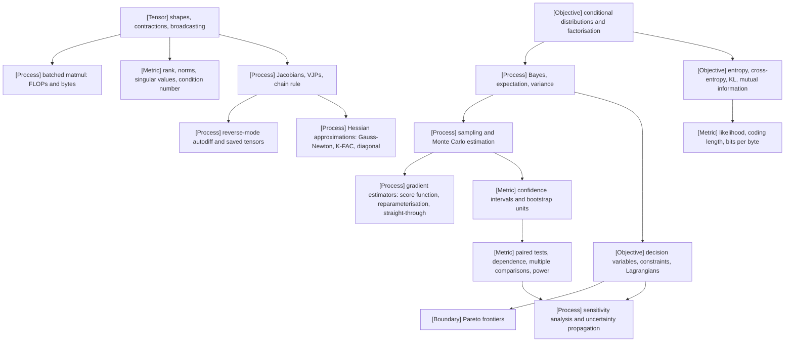

VOLUME I / PART I — SCIENTIFIC FOUNDATIONS / CHAPTER 02

# 02 — Mathematical and statistical foundations

This chapter establishes the mathematical contracts for tensor execution, probability estimation, likelihood reporting, differentiation, experimental uncertainty, and constrained allocation. These contracts distinguish an exact identity from a finite-sample estimator, a documented interface from an inspected implementation, and an optimum of a fitted model from an experimentally validated design. A loss can be a deterministic value on a fixed corpus; a benchmark average can estimate a population quantity. Neither is automatically accompanied by a valid uncertainty model.

6 sections · 5 spine papers · 3 implementations · prerequisites: 01, notation · artifact: notation and statistical-estimation reference · updated 2026-10-07

## Why this chapter exists

Normalization, support, and sampling units alter the quantity being computed. Byte-normalized likelihood fixes a shared denominator but retains tokenizer, context, and termination conditions. Importance weights require overlap and integrand-specific moments; weight concentration alone does not certify precision. A reverse-mode derivative computes a pullback through an executed program, while curvature approximations deliberately omit or factor particular terms. Each section makes those choices explicit before connecting them to resource costs [MATHEMATICALLY-DERIVED · DERIVED:eq-2.10; DERIVED:eq-2.17; DERIVED:eq-2.29].

Source-reported protocols then establish the empirical boundary: Pile document likelihoods, SGVB and K-FAC experiments, clustered-evaluation uncertainty, repeated-run bootstrap coverage, and compute-allocation fits. Their reported outcomes are attributed to their original settings; the chapter does not turn a historical CPU/GPU result into a current language-model throughput claim [PAPER-REPORTED · P03, §3.2; R2.4, §5; R2.5, §13; R2.7, Table 4; R2.16, §4.1; P09, §3.3].

The proposed FP64 derivative and paired-bootstrap checks remain in verification.md. Their acceptance criteria are chosen test inputs, not evidence that a manuscript or implementation has passed review.

```figure
id: fig-2.1
kind: compare
title: Three accounting defects and the rule that repairs each
caption: >-
  Read the "quantity misstated" row first: none of the three defects is an
  error in mathematics. One is a missing denominator, one a missing variance
  factor, one a missing price. Each column is repaired by one rule owned by
  one section, and each rule carries a number the reader can check by hand.
  The middle column's is the largest: at m = 10 prompts per template and
  ρ = 0.5 the naive interval is 2.3 times too narrow.
placement: wide
evidence: MATHEMATICALLY-DERIVED
source: ["DERIVED:eq-2.13", "DERIVED:eq-2.22", "DERIVED:eq-2.14"]
alt: >-
  Comparison table with three columns, one per accounting defect named in
  the chapter opening: loss normalisation (§02.3), the resampled unit
  (§02.5) and the price of a derivative (§02.4). Loss normalisation misstates
  the denominator and log base; it is repaired by bits per byte,
  BPB = (L_T/L_B)·ℓ/ln 2 (Eq. 2.13), with the worked number 1 nat = 1.443
  bits. The resampled unit misstates the variance, σ²/n instead of
  (σ²/n)·DE; it is repaired by resampling the independent unit
  (Algorithm 2.5) with DE = 1 + (m − 1)ρ (Eq. 2.22); at m = 10 and ρ = 0.5,
  DE = 5.5, the interval is about 2.3 times too narrow and a nominal z = 2 is
  z ≈ 0.85. The derivative price misstates cost as a multiple of a forward
  pass and the saved bytes; it is repaired by writing derivatives as VJP,
  JVP or HVP priced per application (Eq. 2.14, 2.17); backward is about twice
  forward, forward plus backward about 6 FLOPs per parameter per token, and
  forming a Hessian needs N² entries. A last row names the falsifiable check
  for each.
spec:
  axis: >-
    What each defect named in this chapter's opening misstates about a
    reported number, and the rule, worked number and check that repair it;
    no method, paper or lab is ranked
  columns:
    - { id: norm, label: "Loss normalisation", node: ms.section.2.3 }
    - { id: unit, label: "Resampled unit", node: ms.section.2.5 }
    - { id: price, label: "Price of a derivative", node: ms.section.2.4 }
  rows:
    - { dimension: "defect as stated", values: { norm: "losses reported without per-token, per-sequence or per-byte normalisation; perplexities across tokenisers compared", unit: "prompts sharing a template, passage or seed resampled as independent draws", price: "a method needing a Hessian-vector product per step compared with one needing a gradient as if equal in price" } }
    - { dimension: "quantity misstated", values: { norm: "the denominator (token or byte) and the log base", unit: "the variance: σ²/n reported where (σ²/n)·DE holds", price: "cost as a multiple of a forward pass, and the bytes saved for backward" } }
    - { dimension: "rule fixed here", values: { norm: "BPB = (L_T/L_B)·ℓ/ln 2 (Eq. 2.13); unit, denominator and tokenizer stated with every loss", unit: "resample the independent unit (Algorithm 2.5); DE = 1 + (m − 1)ρ (Eq. 2.22)", price: "derivatives written as VJP, JVP or HVP and priced per application (Eq. 2.14, 2.17)" } }
    - { dimension: "worked number", values: { norm: "1 nat = 1/ln 2 ≈ 1.443 bits (Eq. 2.10)", unit: "m = 10, ρ = 0.5: DE = 5.5; interval √5.5 ≈ 2.3× too narrow; a nominal z = 2 is z ≈ 0.85", price: "backward ≈ 2× forward; forward + backward ≈ 6 FLOPs per parameter per token; forming H needs N² entries" } }
    - { dimension: "falsifiable check", values: { norm: "§04.6 verification: one byte corpus scored under two tokenisers", unit: "Experiment 2.2: per-prompt against per-cluster coverage", price: "§02.4 proposal: gradient, HVP and K-FAC statistics timed as multiples of a forward pass" } }
```

## Concept map


```mermaid
flowchart TD
    A["[Tensor] shapes, contractions, broadcasting"] --> B["[Process] batched matmul: FLOPs and bytes"]
    A --> C["[Metric] rank, norms, singular values, condition number"]
    D["[Objective] conditional distributions and factorisation"] --> E["[Process] Bayes, expectation, variance"]
    E --> F["[Process] sampling and Monte Carlo estimation"]
    D --> G["[Objective] entropy, cross-entropy, KL, mutual information"]
    G --> H["[Metric] likelihood, coding length, bits per byte"]
    A --> I["[Process] Jacobians, VJPs, chain rule"]
    I --> J["[Process] reverse-mode autodiff and saved tensors"]
    I --> K["[Process] Hessian approximations: Gauss-Newton, K-FAC, diagonal"]
    F --> L["[Process] gradient estimators: score function, reparameterisation, straight-through"]
    F --> M["[Metric] confidence intervals and bootstrap units"]
    M --> N["[Metric] paired tests, dependence, multiple comparisons, power"]
    E --> O["[Objective] decision variables, constraints, Lagrangians"]
    O --> P["[Boundary] Pareto frontiers"]
    O --> Q["[Process] sensitivity analysis and uncertainty propagation"]
    N --> Q
```

Text equivalent:

- Tensor algebra (§02.1)
  - shapes, contractions, broadcasting → batched matmul cost (FLOPs, bytes) → arithmetic intensity
  - rank, norms, singular values → condition number → numerical sensitivity
- Probability (§02.2)
  - conditional distributions and factorisation → Bayes, expectation, variance → sampling and Monte Carlo estimation
- Information theory (§02.3)
  - entropy, cross-entropy, KL, mutual information → likelihood, coding length, bits per byte
- Differential calculus (§02.4)
  - Jacobians, VJPs, chain rule → reverse-mode autodiff (memory of saved tensors) and Hessian approximations
  - Monte Carlo estimation → gradient estimators (score function, reparameterisation, straight-through)
- Statistical inference (§02.5)
  - Monte Carlo estimation → confidence intervals and bootstrap units → paired tests, dependence, multiple comparisons, effect sizes, power
- Optimisation language (§02.6)
  - decision variables, constraints, Lagrangians → Pareto frontiers; sensitivity analysis and uncertainty propagation (fed by §02.5)

## Position in the book

| Relation | Links |
|---|---|
| Prerequisites | [Chapter 01](../ch01-foundation-model-lifecycle/README.md) (problem formulation, levels of analysis, resource accounting); [Notation](../../../front-matter/notation.md) |
| Siblings (same part) | [01](../ch01-foundation-model-lifecycle/README.md) · [03](../ch03-numerical-computation-and-trustworthy-training/README.md) · [04](../ch04-language-modeling-and-learning-objectives/README.md) · [05](../ch05-minimal-transformer-and-execution-trace/README.md) · [06](../ch06-experimental-design-and-evaluation-before-optimization/README.md) |
| Downstream | [§03.3 Automatic differentiation](../ch03-numerical-computation-and-trustworthy-training/03-3-automatic-differentiation.md) · [§04.6 Likelihood and capability](../ch04-language-modeling-and-learning-objectives/04-6-likelihood-and-capability.md) · [§06.4 Measurement uncertainty](../ch06-experimental-design-and-evaluation-before-optimization/06-4-measurement-uncertainty.md) · [§06.5 Quality/resource frontiers](../ch06-experimental-design-and-evaluation-before-optimization/06-5-quality-resource-frontiers.md) · [§20.1 Optimizer mechanics](../../part-04-training-science-and-adaptation/ch20-optimization-schedules-and-training-stability/20-1-optimizer-mechanics.md) · [§21.2 Compute-optimal design](../../part-04-training-science-and-adaptation/ch21-scaling-laws-and-compute-allocation/21-2-compute-optimal-design.md) · [§33.1 DPO derivation](../../../vol-02-execution-and-optimization/part-06-post-training-and-reinforcement-learning/ch33-direct-preference-optimization-and-related-objectives/33-1-dpo-derivation.md) · [§34.2 Policy gradients](../../../vol-02-execution-and-optimization/part-06-post-training-and-reinforcement-learning/ch34-policy-gradients-ppo-and-rlhf/34-2-policy-gradients.md) · [§62.2 Pairwise aggregation](../../../vol-03-grounded-and-interactive-intelligence/part-11-evaluation-interpretability-and-deployment-assurance/ch62-human-preference-model-judges-and-uncertainty/62-2-pairwise-aggregation.md) |
| Trades off with | Estimator variance vs cost (§02.2, §02.4); interval validity vs sample efficiency (§02.5); scalarised vs frontier comparison (§02.6, [§48.5 Economics](../../../vol-02-execution-and-optimization/part-08-inference-engines-and-production-serving/ch48-capacity-planning-benchmarking-and-lifecycle-economics/48-5-economics.md)) |

## Sections

| § | Title | What changes here | Primary evidence labels |
|---|---|---|---|
| [02.1](02-1-tensor-algebra.md) | Tensor algebra | contractions have explicit shapes and resource boundaries; specified solves have perturbation bounds | MATHEMATICALLY-DERIVED, OFFICIAL-DOCUMENTATION |
| [02.2](02-2-probability.md) | Probability | expectations become Monte Carlo estimators with a stated variance and per-sample cost | MATHEMATICALLY-DERIVED |
| [02.3](02-3-information-theory.md) | Information theory | likelihood becomes coding length; bits per byte supplies a shared raw-byte denominator under explicit scoring conventions | MATHEMATICALLY-DERIVED, PAPER-REPORTED |
| [02.4](02-4-differential-calculus.md) | Differential calculus | derivatives become VJPs with a memory cost; Hessians become products and factored approximations; stochastic gradients become named estimators with bias/variance | MATHEMATICALLY-DERIVED, PAPER-REPORTED |
| [02.5](02-5-statistical-inference.md) | Statistical inference | resampling reproduces the declared independent-unit sampling design and preserves pairing/weighting | MATHEMATICALLY-DERIVED, PAPER-REPORTED |
| [02.6](02-6-optimization-language.md) | Optimisation language | design choices become decision variables under constraints; multipliers become prices; fitted parameters carry propagated uncertainty | MATHEMATICALLY-DERIVED, PAPER-REPORTED |

## Artifact

This chapter delivers six manuscript sections, the source ledger, and the proposed verification specification. The artifact fields in [verification.md](verification.md#1-artifact-specification) describe the notation-extension, estimator-table, gradient-check, and bootstrap records to be produced by that protocol. Standalone programs or execution-result files have not been created or run in this content revision.

## Verification

The plan requires a cross-entropy gradient derivation and a paired bootstrap over independent units. Their full unexecuted protocols, chosen tolerances, rejection conditions, and topic-completeness audit are in [verification.md](verification.md). Source-reported experiments are described in the owning manuscript sections and have not been reproduced by the book.

## Lineage

- 1948 · Shannon, *A Mathematical Theory of Communication* [R2.1] · conceptual ancestor (entropy, coding length)
- 1979 · Efron, *Bootstrap Methods: Another Look at the Jackknife* [R2.2] · historical attribution pending full-text inspection (resampling inference)
- 1992 · Williams, REINFORCE [R2.3] · historical attribution pending full-text inspection (score-function gradient estimator)
- 2013 · Kingma and Welling, *Auto-Encoding Variational Bayes* [R2.4] · alternative branch (reparameterisation estimator)
- 2015 · Martens and Grosse, K-FAC [R2.5] · engineering optimization (factored curvature)
- 2018 · Baydin et al., autodiff survey [R2.6] · conceptual ancestor (forward vs reverse mode accounting)
- 2020 · Kaplan et al. [P08] · engineering optimization (power-law fits to loss)
- 2022 · Hoffmann et al. [P09] · documented allocation revision (three estimation approaches under specified training protocols)
- 2024 · Miller, *Adding Error Bars to Evals* [R2.7] · documented uncertainty treatment (clustered and paired standard errors for evaluation items)

```figure
id: fig-2.2
kind: lineage
title: Lineage of the chapter's estimators and accounting rules
caption: >-
  Four of the nine entries supply an estimator the book still uses as
  written: entropy as coding length, the bootstrap, the score-function
  gradient and the reparameterised gradient. Two turn a quantity into
  something affordable (factored curvature, reverse-mode accounting). The
  last three are what the chapter's rules are applied to: fitted loss curves,
  an allocation under a constraint, and error bars on evaluation items.
  R2.1–R2.3 are UNVERIFIED in references.md (no primary URL opened).
placement: inline
evidence: PAPER-REPORTED
source: [R2.1, R2.2, R2.3, R2.4, R2.5, R2.6, P08, P09, R2.7]
alt: >-
  Timeline of the nine works in the chapter's Lineage list. 1948, Shannon,
  A Mathematical Theory of Communication (R2.1), conceptual ancestor: entropy
  and coding length. 1979, Efron, Bootstrap Methods (R2.2), conceptual
  ancestor: resampling inference. 1992, Williams, REINFORCE (R2.3),
  conceptual ancestor: the score-function gradient estimator. 2013, Kingma
  and Welling, Auto-Encoding Variational Bayes (R2.4), alternative branch:
  the reparameterisation estimator. 2015, Martens and Grosse, K-FAC (R2.5),
  engineering optimization: factored curvature. 2018, Baydin et al.,
  automatic differentiation survey (R2.6), conceptual ancestor: forward
  versus reverse mode accounting. 2020, Kaplan et al. (P08), engineering
  optimization: power-law fits to loss. 2022, Hoffmann et al. (P09), current
  frontier: constrained allocation of N and D under a fitted loss. 2024,
  Miller, Adding Error Bars to Evals (R2.7), current frontier: clustered
  standard errors for evaluation items.
spec:
  entries:
    - { year: 1948, work: "A Mathematical Theory of Communication", cite: R2.1, relation: "conceptual ancestor", node: ms.section.2.3, note: "entropy and coding length; the compressor reading of likelihood in §02.3" }
    - { year: 1979, work: "Bootstrap Methods: Another Look at the Jackknife", cite: R2.2, relation: "conceptual ancestor", node: ms.section.2.5, note: "resampling inference; §02.5 fixes which unit is resampled" }
    - { year: 1992, work: "REINFORCE (Williams)", cite: R2.3, relation: "conceptual ancestor", node: ms.section.2.4, note: "score-function estimator, Eq. 2.18; the policy gradient of §34.2" }
    - { year: 2013, work: "Auto-Encoding Variational Bayes", cite: R2.4, relation: "alternative branch", node: ms.section.2.4, note: "reparameterisation estimator, Eq. 2.19; continuous x only, so not for tokens" }
    - { year: 2015, work: "K-FAC: Kronecker-factored Approximate Curvature", cite: R2.5, relation: "engineering optimization", node: ms.section.2.4, note: "per-layer Fisher block as A ⊗ G_ℓ: d_in² + d_out² stored instead of (d_in·d_out)²" }
    - { year: 2018, work: "Automatic differentiation in machine learning: a survey", cite: R2.6, relation: "conceptual ancestor", node: ms.section.2.4, note: "forward versus reverse accumulation, the vocabulary of Eq. 2.14" }
    - { year: 2020, work: "Scaling Laws for Neural Language Models", cite: P08, relation: "engineering optimization", node: ms.section.2.6, note: "power-law fits of loss to N, D and C" }
    - { year: 2022, work: "Training Compute-Optimal Large Language Models", cite: P09, relation: "current frontier", node: ms.section.21.2, note: "allocation of N and D under 6ND = C and a fitted loss; Eq. 2.26" }
    - { year: 2024, work: "Adding Error Bars to Evals", cite: R2.7, relation: "current frontier", node: ms.section.2.5, note: "clustered and paired standard errors and a sample-size formula for evals" }
```

## Terms owned here

| Term | One-line definition | Section |
|---|---|---|
| tensor contraction | summation over shared index labels of two or more tensors, generalising matrix multiplication | 02.1 |
| broadcasting | implicit expansion of size-1 or missing leading axes so that elementwise operations apply across mismatched shapes | 02.1 |
| batched matrix multiplication | a contraction over one index applied independently across one or more leading batch axes | 02.1 |
| condition number | κ₂(A) = σ_max/σ_min for a nonsingular square solve; bounds relative sensitivity under its perturbation contract | 02.1 |
| factorisation (of a joint distribution) | rewriting a joint as a product of conditionals under a chosen ordering or conditional-independence structure | 02.2 |
| Monte Carlo estimator | the sample mean of a function under samples from a distribution, with variance σ²/n | 02.2 |
| importance sampling / effective sample size | reweighting samples from a proposal by p/q; ESS = (Σw)²/Σw² | 02.2 |
| entropy, cross-entropy, KL divergence | H(p), H(p,q) = H(p) + KL(p‖q), and KL(p‖q) ≥ 0 | 02.3 |
| mutual information | I(X;Y) = KL(p(x,y) ‖ p(x)p(y)) | 02.3 |
| coding length | −log₂ q(x) bits: the length of the code assigned to x by an ideal coder using model q | 02.3 |
| bits per byte | total coding length of a byte string under the model divided by its byte count | 02.3 |
| Jacobian, VJP, JVP | the matrix of first derivatives; its left product with a cotangent vector; its right product with a tangent vector | 02.4 |
| forward-mode / reverse-mode differentiation | propagation of tangents with the computation / of cotangents against it | 02.4 |
| Hessian-vector product | Hv computed without forming H, at a small multiple of gradient cost | 02.4 |
| Gauss–Newton matrix | JᵀH_out J: the curvature of a composed loss with the second derivative of the inner map dropped | 02.4 |
| score-function estimator | ∇E_{p_θ}[f] = E[f ∇log p_θ]; unbiased under support/interchange conditions; uses sampled f values rather than their path derivatives | 02.4 |
| reparameterisation estimator | ∇E_{p_θ}[f] = E_ε[∇_θ f(g(θ,ε))]; requires an applicable differentiable sampling transformation and integrand | 02.4 |
| straight-through estimator | a biased surrogate that replaces the Jacobian of a non-differentiable operation by the identity | 02.4 |
| bootstrap unit | the independently sampled unit reproduced by the declared resampling scheme; experimental design is owned by §06.1 | 02.5 |
| design effect | DE = 1 + (m−1)ρ, the variance inflation of a clustered mean relative to an iid mean of the same size | 02.5 |
| paired test | a test on within-unit differences, removing between-unit variance | 02.5 |
| effect size | the magnitude of a difference in the metric's own units, or standardised by its standard deviation | 02.5 |
| statistical power | the probability of detecting a stated effect at a stated level | 02.5 |
| decision variable, Lagrangian, KKT conditions | the quantities a designer controls; the constrained objective with multipliers; its first-order optimality conditions | 02.6 |
| shadow price | ∂f*/∂b = −η*: marginal objective change per unit of bound relaxation under regularity | 02.6 |
| Pareto dominance / Pareto frontier | x dominates x′ if no worse in every objective and better in one; the set of non-dominated points | 02.6 |
| sensitivity analysis | the change of an optimum or a prediction under perturbation of its inputs, local or global | 02.6 |
| delta-method uncertainty propagation | Var[g(X)] ≈ ∇gᵀ Σ ∇g | 02.6 |

## Reference-stack coverage

The table records source routes from the exact reference-stack vocabulary. Paper claims were checked on their full primary texts; a route URL is not itself evidence for a mechanism. No old access outcome is inherited.

| Stack section | Entry (exact name, rank) | Stack layer | What this chapter takes from it | Surface used | Sections | Evidence label |
|---|---|---|---|---|---|---|
| §1 lab | Anthropic (#1) | — | R2.7 clustered and paired uncertainty; actual versus fictional tables distinguished | Research: https://www.anthropic.com/research | 02.2, 02.5 | PAPER-REPORTED |
| §1 lab | OpenAI (#2) | — | P08 historical compute-allocation study; primary v1 read on arXiv | Papers: https://openai.com/research/index/publication/ | 02.6 | PAPER-REPORTED |
| §1 lab | Google DeepMind (#3) | — | P09 fitted allocation and three approaches; primary v1 read on arXiv | Papers: https://deepmind.google/research/publications/ | 02.6 | PAPER-REPORTED |
| §1 lab | DeepSeek (#8) | — | P25 sampled KL expression and objective placement; primary v2 read on arXiv | Code: https://github.com/deepseek-ai | 02.2, 02.3 | PAPER-REPORTED |
| §1 lab | Stanford CRFM (#38) | — | P50 scenario/metric framework; no inferred cluster independence | Research: https://crfm.stanford.edu/research.html | 02.5 | PAPER-REPORTED |
| §2 conference | NeurIPS (#1) | — | Archival route for P09, R2.14, R2.16; primary versions in references ledger | papers: https://proceedings.neurips.cc/ | 02.4–02.6 | PAPER-REPORTED |
| §2 conference | ICML (#2) | — | K-FAC archival route; expanded v5 method/experiment text inspected | papers: https://proceedings.mlr.press/ | 02.4 | PAPER-REPORTED |
| §3 discovery | arXiv (#1) | — | Retrieval of versioned primary full texts; discovery is not the experimental evidence | home: https://arxiv.org/ · search/API: https://arxiv.org/search/advanced | 02.2–02.6 | OFFICIAL-DOCUMENTATION |
| §4 system | PyTorch (#17) | Model / autograd framework | Inspected 2.14 broadcasting/expand, sampling API, autograd and loss contracts | docs/code: https://pytorch.org/docs/stable/ | 02.1, 02.2, 02.4 | OFFICIAL-DOCUMENTATION |
| §4 system | JAX (#18) | Model / autograd framework | Unpinned cookbook JVP/VJP/HVP transformation contracts | docs/code: https://docs.jax.dev/ | 02.4 | OFFICIAL-DOCUMENTATION |
| §4 system | Liger Kernel (#40) | Kernels / numerics / collectives | Unpinned README fused-linear-loss interface; no measured allocation/time claim | docs/code: https://github.com/linkedin/Liger-Kernel | 02.3, 02.4 | OFFICIAL-DOCUMENTATION |
| *Outside the reference stack (routed via book_plan.md anchors)* | | | | | | |
| outside | Stanford CS336 [R2.18, R2.19] | — | Exact Chapter 02 source anchor: mathematical prerequisites and syllabus | https://cs336.stanford.edu/ · https://cs336.stanford.edu/spring2025/ | all | OFFICIAL-DOCUMENTATION |
| outside | Original mathematical/statistical works [R2.1–R2.7, R2.12–R2.17] | — | Plan rows 02.3–02.5 require coding, gradient estimation, and statistical inference; original method sources plus explicit derivations; JMLR/MLSys archival PDFs when relevant | Exact primary URLs and inspected revisions in [references.md](references.md) | 02.3–02.5 | PAPER-REPORTED |
| outside | Efron 1979 [R2.2]; Williams 1992 [R2.3] | — | Historical entries retained with unsuccessful full-text inspection; no detailed method is attributed to them | Exact attempted URLs in [references.md](references.md) | Lineage | UNVERIFIED |

**Inspection dimensions applied.** *Precision*: solve sensitivity and finite-logit differentiation (§§02.1,02.4). *Memory*: operands, temporary copies, reverse-mode state, curvature factors (§§02.1,02.4). *Kernels*: contraction accounting and documented fused-loss interface (§§02.1,02.3,02.4). *Post-training*: importance ratios, sampled KL, score derivatives (§§02.2–02.4). *Metrics*: BPB, paired differences, confidence intervals and power (§§02.3,02.5). *Reproducibility*: inspected revisions, declared units, resampling labels and unexecuted verification. *Communication* is counted only when explicitly introduced by a placement; distributed mechanisms are owned by Chapter 29. Parallelism, checkpoint/restart, deployment reliability, and production serving behavior are not chapter-owned implementations.

## Source route

Use the exact protocols of `Instruction/AI_REFERENCE_STACK.md`.

1. Lab-level search protocol §1.1, "Lab + topic" template, for evaluation-uncertainty methodology: `site:arxiv.org/abs "Anthropic" "error bars" evals` → resolve on arXiv → cross-check identity on Semantic Scholar.
2. arXiv advanced query (§3.2): `cat:cs.LG AND ti:"scaling laws" AND abs:"compute-optimal"` → newest revision → then P08/P09 archival versions via the conference workflow §2.1.
3. arXiv advanced query (§3.2): `cat:stat.ML AND (abs:"bootstrap" OR abs:"clustered standard errors") AND abs:"language model"`.
4. Semantic Scholar API (§3.2): `https://api.semanticscholar.org/graph/v1/paper/search?query=paired bootstrap language model evaluation uncertainty&year=2024-2026&openAccessPdf&fields=title,year,authors,venue,citationCount,url,openAccessPdf`.
5. Conference workflow §2.1 for gradient estimators: search the last two editions of NeurIPS/ICML/ICLR for "Monte Carlo gradient estimation", then `site:openreview.net "gradient estimator" "variance reduction"`.
6. Training-stack search protocol §4.3, "Architecture and algorithm details": `site:github.com "PyTorch" (architecture OR design OR RFC OR benchmark) autograd` → official documentation root `https://pytorch.org/docs/stable/` for the autograd and broadcasting semantics pages.

## Status

Editorial status: manuscript_draft. All six planned topic rows have substantive treatments and an anchor/source audit. This is not an independent scientific review or an executed verification result. Actual primary-source inspection occurred on 2026-10-07, as recorded in [references.md](references.md).

Open review items are original full-text historical attribution for R2.2/R2.3; joint scaling-fit covariance not disclosed by the inspected fitting account; unpinned JAX/Liger surfaces; workload-specific numerical tolerance, allocation, runtime, energy, and cost checks. API documentation supports an interface claim, not executable compatibility. These boundaries constrain the chapter's claims and prevent a reviewed status.
