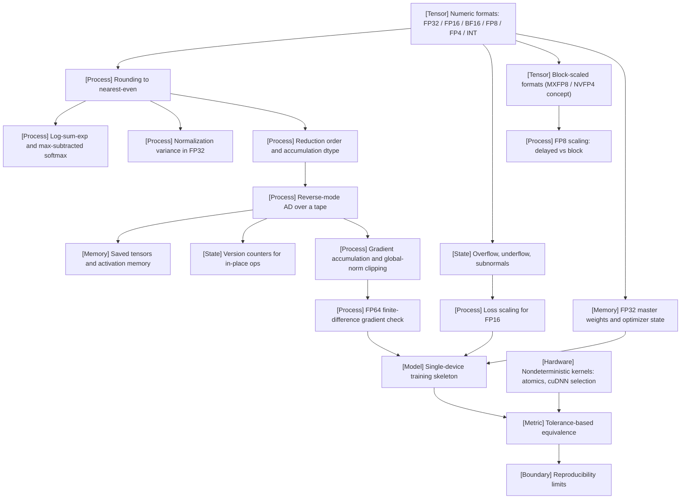

VOLUME I / PART I — SCIENTIFIC FOUNDATIONS / CHAPTER 03

# 03 — Numerical computation and a trustworthy training program

**Thesis.** A training program is trustworthy only when every finite-precision operation it performs can be bounded against a high-precision reference, and this chapter establishes those bounds, the primitives that respect them, and the single-device skeleton that is checked against them before any scale is added.

6 sections · 4 spine papers (P01, P13, P18, P19) · 6 implementations · prerequisites: 01–02 · artifact: a numerically checked single-device training skeleton · updated 2026-09-20

## Why this chapter exists

**What failed before.** Training programs were written as if arithmetic were exact. Softmax computed as a naive exponential overflowed the moment a logit exceeded roughly eleven in FP16; variances computed as E[x²] − E[x]² went negative; a gradient that was correct in FP32 silently vanished in FP16 because its magnitude sat below the format's smallest normal number. None of these failures produced an exception. They produced NaNs several thousand steps later, or a loss curve that was wrong by an amount no one could attribute [KNOWN — the failure classes are those catalogued by the mixed-precision training literature, R3.3].

**What bottleneck appeared.** Once accelerators exposed tensor-core throughput that scales inversely with mantissa width, the pressure to store and compute in 16-, 8-, and 4-bit formats became a first-order design input rather than an optimization. The ratio of representable dynamic range to precision changed by format, and the cost of a wrong choice became a wasted multi-week run [KNOWN — R3.2, P13].

**Which constraint became dominant.** The dominant constraint is that *storage dtype, compute dtype, and accumulation dtype are three separate decisions*, and that reproducibility is bounded by reduction order, kernel selection, and hardware, not by seeds alone. A program can be bit-exact against itself on one device and differ at the fourth significant digit on another while both are correct [MATHEMATICALLY-DERIVED — summation error bounds, §3.2 and §3.6].

**What changed in the solution.** The solution is a discipline, not a library: derive tolerances from the formats' machine epsilon; write every reduction with an explicit accumulation dtype; keep FP32 master weights where the update would otherwise round to zero; verify gradients against FP64 finite differences on both ordinary and extreme inputs; and define equivalence as a stated tolerance rather than bitwise identity. Chapters 19–20, 26, 28, and 40 build on the vocabulary fixed here.

## Concept map



Text equivalent of the concept map:

- [Tensor] Numeric formats FP32 / FP16 / BF16 / FP8 / FP4 / INT (§3.1)
  - [Process] Rounding to nearest-even (§3.1)
    - [Process] Log-sum-exp and max-subtracted softmax (§3.2)
    - [Process] Normalization variance in FP32 (§3.2)
    - [Process] Reduction order and accumulation dtype (§3.2)
      - [Process] Reverse-mode AD over a tape (§3.3)
        - [Memory] Saved tensors and activation memory (§3.3)
        - [State] Version counters for in-place ops (§3.3)
        - [Process] Gradient accumulation and global-norm clipping (§3.3)
          - [Process] FP64 finite-difference gradient check (§3.3)
  - [State] Overflow, underflow, subnormals (§3.1)
    - [Process] Loss scaling for FP16 (§3.4)
  - [Tensor] Block-scaled formats, MXFP8 / NVFP4 concept (§3.1)
    - [Process] FP8 scaling: delayed vs block (§3.4)
  - [Memory] FP32 master weights and optimizer state (§3.4)
- [Model] Single-device training skeleton (§3.5)
  - [Metric] Tolerance-based equivalence (§3.6)
    - [Hardware] Nondeterministic kernels: atomics, cuDNN algorithm selection (§3.6)
    - [Boundary] Reproducibility limits (§3.6)

## Position in the book

| Relation | Links |
|---|---|
| Prerequisites | [Chapter 01](../ch01-foundation-model-lifecycle/README.md) (resource accounting, §1.5); [Chapter 02](../ch02-mathematical-and-statistical-foundations/README.md), especially [§2.1 Tensor algebra](../ch02-mathematical-and-statistical-foundations/02-1-tensor-algebra.md) and [§2.4 Differential calculus](../ch02-mathematical-and-statistical-foundations/02-4-differential-calculus.md); [Notation](../../../front-matter/notation.md) |
| Siblings (same part) | [Chapter 04](../ch04-language-modeling-and-learning-objectives/README.md) (objectives and masks); [Chapter 05](../ch05-minimal-transformer-and-execution-trace/README.md) (the model the skeleton trains); [Chapter 06](../ch06-experimental-design-and-evaluation-before-optimization/README.md) (seed variance, §6.4) |
| Downstream | [§19.2 Batch semantics](../../part-04-training-science-and-adaptation/ch19-pretraining-objectives-and-the-full-training-loop/19-2-batch-semantics.md), [§19.4 Training-state transitions](../../part-04-training-science-and-adaptation/ch19-pretraining-objectives-and-the-full-training-loop/19-4-training-state-transitions.md); [§20.1 Optimizer mechanics](../../part-04-training-science-and-adaptation/ch20-optimization-schedules-and-training-stability/20-1-optimizer-mechanics.md), [§20.4 Stability instrumentation](../../part-04-training-science-and-adaptation/ch20-optimization-schedules-and-training-stability/20-4-stability-instrumentation.md); [§26.6 Correctness under optimization](../../../vol-02-execution-and-optimization/part-05-hardware-kernels-and-distributed-execution/ch26-kernel-programming-and-numerical-equivalence/26-6-correctness-under-optimization.md); [Chapter 28](../../../vol-02-execution-and-optimization/part-05-hardware-kernels-and-distributed-execution/ch28-frameworks-graph-compilers-and-runtime-integration/README.md); [§29.1 Data/state parallelism](../../../vol-02-execution-and-optimization/part-05-hardware-kernels-and-distributed-execution/ch29-parallelism-collectives-and-distributed-optimization/29-1-data-state-parallelism.md); [§30.6 Recovery and reproducibility](../../../vol-02-execution-and-optimization/part-05-hardware-kernels-and-distributed-execution/ch30-large-training-runs-reliability-monitoring-and-recovery/30-6-recovery-and-reproducibility.md); [§40.2 Quantization targets](../../../vol-02-execution-and-optimization/part-07-inference-algorithms-distillation-and-compression/ch40-quantization-from-numerical-model-to-deployable-artifact/40-2-quantization-targets.md) |
| Trades off with | Throughput and memory (narrower formats) against precision and dynamic range (§3.1, §3.4); bitwise determinism against kernel throughput (§3.6); activation memory against recomputation FLOPs (§3.3) |

## Sections

| § | Title | What changes here | Primary evidence labels |
|---|---|---|---|
| [3.1](03-1-numeric-representations.md) | Numeric representations | Every tensor acquires an exponent range, a machine epsilon, a rounding rule, and an overflow/underflow behavior fixed by its format | MATHEMATICALLY-DERIVED, PAPER-REPORTED, OFFICIAL-DOCUMENTATION |
| [3.2](03-2-stable-primitives.md) | Stable primitives | Reductions acquire an explicit order and accumulation dtype; exponentials and variances are rewritten to avoid overflow and cancellation | MATHEMATICALLY-DERIVED, PAPER-REPORTED |
| [3.3](03-3-automatic-differentiation.md) | Automatic differentiation | The backward pass becomes a memory contract (saved tensors), a mutation contract (version counters), and a checked artifact (FP64 finite differences) | OFFICIAL-DOCUMENTATION, MATHEMATICALLY-DERIVED |
| [3.4](03-4-mixed-precision-execution.md) | Mixed-precision execution | Storage, compute, and accumulation dtypes are separated; scaling and master weights are introduced where a format cannot carry the update | PAPER-REPORTED, OFFICIAL-DOCUMENTATION, MATHEMATICALLY-DERIVED |
| [3.5](03-5-reference-implementation.md) | Reference implementation | Shape, mask, initialization, and fixture contracts are fixed so that the skeleton is testable before it is fast | DERIVED, OFFICIAL-DOCUMENTATION, UNVERIFIED (code target version) |
| [3.6](03-6-reproducibility-limits.md) | Reproducibility limits | Equivalence is redefined as a tolerance; seeds, kernels, reduction order, and hardware are enumerated as the sources that consume it | MATHEMATICALLY-DERIVED, OFFICIAL-DOCUMENTATION, ASSUMED |

## Artifact

A **numerically checked single-device training skeleton**, consisting of:

- `formats.md` — the format table of §3.1 (bits, exponent, mantissa, ε, max, min normal, min subnormal) and the derived tolerance table used by every test.
- `primitives.py` — log-sum-exp, max-subtracted softmax, FP32-variance RMSNorm/LayerNorm, blocked FP32 accumulation (§3.2), each with an FP64 reference twin.
- `skeleton.py` — model stub, causal/padding/loss masks, initialization, gradient accumulation, global-norm clipping, optimizer step, mixed-precision context (§3.3–3.5); reference-level PyTorch written against the 2.14 documented API, execution UNVERIFIED.
- `fixtures/` — deterministic fixtures: seeded token batches, an "extreme inputs" set (large logits, fully masked rows, zero-variance rows, subnormal-range activations, near-cancelling vectors), and their FP64 expected outputs.
- `checks.py` — forward-vs-FP64 comparison, FP64 finite-difference gradient check, tiny-batch overfitting test, two-run equivalence test with declared tolerances (§3.6).
- `manifest.json` — framework version, device, driver, kernel flags, deterministic-mode settings, seeds, RNG state hashes, and the tolerances used (§3.6).

## Verification

The falsifiable task: run the skeleton's forward pass and backward pass in FP32 and in the chosen mixed-precision configuration on ordinary fixtures and on the extreme-input fixtures, and compare values and gradients against an FP64 reference. The chapter's central claim — that every deviation from the reference is bounded by a tolerance derivable from the formats' machine epsilon and the reduction length — is rejected if any ordinary-input comparison exceeds the derived worst-case bound, if any extreme-input case produces a non-finite value where the reference is finite, or if the FP64 finite-difference check disagrees with the analytic gradient beyond the truncation-plus-rounding bound. The full protocol, with tolerances and their derivations, is in [verification.md](verification.md).

```figure
id: fig-3.1
kind: diagram
title: From unit roundoff to a verdict
caption: >-
  Follow the heavy path. The chapter's central result is that every tolerance
  is computed, not chosen. A format fixes u, u and the reduction length n fix
  the summation bound, the bound sets the tolerance table, and Eq. 3.22 turns
  it into a verdict on the skeleton against its FP64 twin. The finite-difference
  bound (Eq. 3.14) and the update-loss threshold (Eq. 3.17) feed the same table
  from u₆₄ and u_bf16. The manifest does not change any bound. It only
  attributes a difference once one appears.
placement: wide
evidence: MATHEMATICALLY-DERIVED
source: ["DERIVED:eq-3.2", "DERIVED:eq-3.9", "DERIVED:eq-3.14", "DERIVED:eq-3.17", "DERIVED:eq-3.22"]
alt: >-
  Left-to-right diagram of how the chapter derives tolerances. A numeric
  format (w exponent bits, p stored mantissa bits, Table 3.1) determines the
  unit roundoff u = 2^−(p+1) of Eq. 3.2. The unit roundoff and the reduction
  length n with its accumulation dtype determine the summation bound
  γ_n·Σ|x_i| of Eq. 3.9. The same u, taken as u₆₄, bounds the FP64 central
  difference of Eq. 3.14, and taken as u_bf16 it sets the update-loss
  threshold of Eq. 3.17. All three feed the tolerance table T1 to T10 of
  verification.md. The table supplies atol and rtol to the equivalence test
  |a − b| ≤ atol + rtol·|b| of Eq. 3.22. That test compares the single-device
  skeleton against its FP64 reference twin built from stored fixtures. The
  verdict is bitwise, tolerance-equivalent, or not equivalent. The manifest
  (seeds, kernels, SM count, flags) attributes any difference. A result
  outside tolerance rejects the chapter's claim. The emphasised path runs
  format, u, summation bound, tolerance table, Eq. 3.22, verdict.
spec:
  direction: LR
  nodes:
    - { id: fmt, kind: tensor, label: "numeric format (w, p)", sub: "Table 3.1" }
    - { id: u, kind: metric, label: "unit roundoff u = 2^−(p+1)", sub: "Eq. 3.2" }
    - { id: n, kind: dependency, label: "reduction length n, accumulation dtype", sub: "d_model, d_ff, T, V" }
    - { id: gam, kind: process, label: "summation bound γ_n·Σ|x_i|", sub: "Eq. 3.9" }
    - { id: fd, kind: process, label: "FP64 central difference", sub: "Eq. 3.14, h = 1e−5" }
    - { id: upd, kind: process, label: "update-loss threshold", sub: "Eq. 3.17, 2^−8·|w|" }
    - { id: tt, kind: metric, label: "tolerance table T1–T10", sub: "verification.md §3" }
    - { id: ref, kind: model, label: "FP64 reference twin", sub: "stored fixtures (§3.5)" }
    - { id: sk, kind: model, label: "single-device skeleton", sub: "FP32 or mixed-precision recipe" }
    - { id: eq, kind: process, label: "|a − b| ≤ atol + rtol·|b|", sub: "Eq. 3.22" }
    - { id: man, kind: dependency, label: "manifest", sub: "seeds, kernels, SM count, flags" }
    - { id: v, kind: branch, label: "verdict", sub: "bitwise · tolerance-equivalent · not" }
    - { id: rej, kind: state, label: "central claim rejected", sub: "bound exceeded, non-finite, FD mismatch" }
  edges:
    - { from: fmt, to: u, kind: emphasis }
    - { from: u, to: gam, kind: emphasis }
    - { from: n, to: gam, kind: dependency }
    - { from: u, to: fd, kind: dependency, label: "u₆₄" }
    - { from: u, to: upd, kind: dependency, label: "u_bf16" }
    - { from: gam, to: tt, kind: emphasis, label: "T1–T4, T6, T8" }
    - { from: fd, to: tt, label: "T5" }
    - { from: upd, to: tt, label: "T10" }
    - { from: tt, to: eq, kind: emphasis, label: "atol, rtol" }
    - { from: sk, to: eq }
    - { from: ref, to: eq, kind: dependency, label: "reference" }
    - { from: eq, to: v, kind: emphasis }
    - { from: man, to: v, kind: dependency, label: "attribution" }
    - { from: v, to: rej, label: "outside tolerance" }
```

## Lineage

- 1985 · IEEE Std 754 (binary floating-point arithmetic; revised 2008, 2019) [R3.1] · *conceptual ancestor*
- 1991 · Goldberg, floating-point arithmetic for computer scientists [R3.8] · *conceptual ancestor*
- 2002 · Higham, *Accuracy and Stability of Numerical Algorithms*, 2nd ed. [R3.7] · *conceptual ancestor*
- 2013 · Pascanu, Mikolov, Bengio, gradient-norm clipping [R3.22] · *conceptual ancestor*
- 2016 · Chen et al., sublinear-memory training by recomputation [R3.24] · *engineering optimization*
- 2017 · Micikevicius et al., mixed-precision training with FP32 master weights and loss scaling [R3.3] · *engineering optimization*
- 2019 · Kalamkar et al., BF16 for deep-learning training [R3.4] · *alternative branch*
- 2022 · FlashAttention, online softmax without a materialized score matrix (P19) · *engineering optimization*
- 2022 · Micikevicius et al., FP8 formats E4M3 and E5M2 [R3.2] · *current frontier*
- 2023 · Rouhani et al., microscaling (block-scaled) data formats [R3.5] · *current frontier*
- 2024 · DeepSeek-V3 technical report, fine-grained FP8 training recipe (P13) · *current frontier*

```figure
id: fig-3.2
kind: lineage
title: Lineage of trustworthy low-precision training
caption: >-
  Two strands meet here. The first four entries (1985–2013) are theory: the
  format, its error model, summation bounds and clipping. The 2016–2024
  entries spend that theory on memory and throughput. Each frontier entry
  narrows a format, and each one had to add a scale to make the narrower
  format work (loss scale, per-tensor FP8 scale, per-block MX scale, per-tile
  FP8 scale). The three classical works (R3.1, R3.7, R3.8) were not opened for
  this edition. They are UNVERIFIED in references.md and are listed for lineage
  only.
placement: inline
evidence: PAPER-REPORTED
source: [R3.22, R3.24, R3.3, R3.4, P19, R3.2, R3.5, P13]
alt: >-
  Timeline of eleven works from the chapter's Lineage list. 1985, IEEE Std 754
  binary floating-point arithmetic (R3.1), conceptual ancestor. 1991, Goldberg,
  What Every Computer Scientist Should Know About Floating-Point Arithmetic
  (R3.8), conceptual ancestor. 2002, Higham, Accuracy and Stability of
  Numerical Algorithms (R3.7), conceptual ancestor. 2013, Pascanu, Mikolov and
  Bengio, gradient-norm clipping (R3.22), conceptual ancestor. 2016, Chen et
  al., sublinear-memory training by recomputation (R3.24), engineering
  optimization. 2017, Micikevicius et al., Mixed Precision Training (R3.3),
  engineering optimization. 2019, Kalamkar et al., BF16 for deep-learning
  training (R3.4), alternative branch. 2022, FlashAttention (P19),
  engineering optimization. 2022, FP8 Formats for Deep Learning (R3.2),
  current frontier. 2023, Microscaling data formats (R3.5), current frontier.
  2024, DeepSeek-V3 technical report (P13), current frontier.
spec:
  entries:
    - { year: 1985, work: "IEEE Std 754, binary floating-point arithmetic", cite: R3.1, relation: "conceptual ancestor", node: ms.section.3.1, note: "layouts and round-to-nearest-even; revised 2008, 2019; not opened (UNVERIFIED)" }
    - { year: 1991, work: "What Every Computer Scientist Should Know About Floating-Point Arithmetic", cite: R3.8, relation: "conceptual ancestor", note: "Goldberg; lineage only, not opened (UNVERIFIED)" }
    - { year: 2002, work: "Accuracy and Stability of Numerical Algorithms, 2nd ed.", cite: R3.7, relation: "conceptual ancestor", node: ms.section.3.2, note: "Higham; standard model and γ_k summation bounds, re-derived in §3.2" }
    - { year: 2013, work: "On the Difficulty of Training Recurrent Neural Networks", cite: R3.22, relation: "conceptual ancestor", node: ms.section.3.3, note: "gradient-norm clipping, Eq. 3.13" }
    - { year: 2016, work: "Training Deep Nets with Sublinear Memory Cost", cite: R3.24, relation: "engineering optimization", node: ms.section.3.3, note: "O(√n) activation memory for one extra forward pass" }
    - { year: 2017, work: "Mixed Precision Training", cite: R3.3, relation: "engineering optimization", node: ms.section.3.4, note: "FP32 master copy and loss scaling (ICLR 2018)" }
    - { year: 2019, work: "A Study of BFLOAT16 for Deep Learning Training", cite: R3.4, relation: "alternative branch", node: ms.section.3.4, note: "FP32's exponent range in 16 bits; no loss scaling" }
    - { year: 2022, work: "FlashAttention", cite: P19, relation: "engineering optimization", node: ms.section.27.1, note: "online softmax without a materialised score matrix (Algorithm 3.2)" }
    - { year: 2022, work: "FP8 Formats for Deep Learning", cite: R3.2, relation: "current frontier", node: ms.section.3.1, note: "E4M3 (x_max 448) for weights and activations, E5M2 (x_max 57344) for gradients" }
    - { year: 2023, work: "Microscaling Data Formats for Deep Learning", cite: R3.5, relation: "current frontier", node: ms.section.3.1, note: "blocks of 32 elements sharing one 8-bit E8M0 scale" }
    - { year: 2024, work: "DeepSeek-V3 Technical Report", cite: P13, relation: "current frontier", node: ms.section.3.4, note: "E4M3 throughout; 1×128 tiles, 128×128 blocks; FP32 promotion every 128 elements" }
```

## Terms owned here

- **Machine epsilon (ε) and unit roundoff (u)** — the spacing between 1 and the next representable number, and half of it; the relative rounding error bound under round-to-nearest (§3.1).
- **Subnormal number** — a value below the smallest normal magnitude represented with a reduced-precision significand (§3.1).
- **Block-scaled format** — a low-precision element format paired with a shared scale per fixed-size block of elements (§3.1).
- **Accumulation dtype** — the format in which partial sums of a reduction are held, distinct from input and output dtypes (§3.2).
- **Catastrophic cancellation** — loss of relative precision when nearly equal quantities are subtracted (§3.2).
- **Max-subtracted log-sum-exp** — the overflow-safe evaluation of log Σ exp (§3.2).
- **Saved tensor** — an intermediate retained by the forward pass because a backward formula needs it (§3.3).
- **Version counter** — the per-tensor mutation count that autograd checks to detect in-place modification of a saved tensor (§3.3).
- **Gradient accumulation (micro-batch)** — summing gradients over K micro-batches before one optimizer step, with normalization consistent with the loss (§3.3).
- **Global-norm gradient clipping** — rescaling all gradients by one factor so that the concatenated gradient norm does not exceed a threshold (§3.3).
- **Finite-difference gradient check** — comparison of the analytic gradient to an FP64 central-difference estimate under a derived tolerance (§3.3).
- **Master weights** — an FP32 copy of parameters that receives the optimizer update when the storage format cannot represent it (§3.4).
- **Loss scaling (static / dynamic)** — multiplying the loss by a factor S so that FP16 gradients stay above the underflow threshold, then dividing before the update (§3.4).
- **Delayed scaling / block scaling (FP8)** — per-tensor scale factors computed from a history of absolute maxima versus per-block scale factors computed from the current block (§3.4).
- **Deterministic fixture** — a seeded, stored input/expected-output pair that is independent of the framework's RNG stream (§3.5).
- **Tiny-batch overfitting test** — the check that the skeleton drives the loss on a fixed handful of examples to near its floor (§3.5).
- **Tolerance-based equivalence** — the relation |a − b| ≤ atol + rtol·|b| used in place of bitwise identity (§3.6).
- **Reduction-order nondeterminism** — run-to-run differences caused by the non-associativity of floating-point addition under varying summation order (§3.6).

## Reference-stack coverage

Rows bind this chapter to `Instruction/AI_REFERENCE_STACK.md`. Entry names, rank numbers, and surfaces are those of the reference stack; "Surface used" is the URL listed there, under which the pages recorded in [references.md](references.md) were opened on 2026-09-20.

| Stack section | Entry (rank) | Stack layer | What this chapter takes from it | Surface used | Sections | Evidence label |
|---|---|---|---|---|---|---|
| §1 lab | **DeepSeek** (#8) | — | DeepSeek-V3 Technical Report §3.3: E4M3 on all tensors, 1×128 / 128×128 scaling groups, online scaling, FP32 promotion every 128 elements, BF16 AdamW moments with FP32 master weights and gradients, < 0.25% relative loss error on two ablation scales | Papers — https://github.com/deepseek-ai (report at arXiv 2412.19437, P13) | 3.1, 3.3, 3.4 | PAPER-REPORTED |
| §1 lab | **NVIDIA Research** (#14) | — | Authorship route for the FP8-formats and mixed-precision-training papers; NVIDIA documentation on IEEE 754 behavior of GPUs | Papers — https://research.nvidia.com/publications | 3.1, 3.4, 3.6 | PAPER-REPORTED |
| §1 lab | **Microsoft Research / Microsoft AI** (#13) | — | ZeRO's 2Ψ + 2Ψ + 12Ψ = 16Ψ byte accounting for mixed-precision Adam (P18); first author's affiliation on the microscaling paper (R3.5) | Papers — https://www.microsoft.com/research/publications/ | 3.3, 3.4 | PAPER-REPORTED |
| §2 conference | **ICLR** (#3) | — | Archival venue of *Mixed Precision Training* (2018) and *8-bit Optimizers via Block-wise Quantization* (2022) | Open proceedings — https://openreview.net/group?id=ICLR.cc/2026/Conference (venue route; both papers were opened on arXiv) | 3.4 | PAPER-REPORTED |
| §2 conference | **NeurIPS** (#1) | — | Archival venue of FlashAttention (P19), RMSNorm (R3.20), and the Transformer (P01) | Open proceedings — https://proceedings.neurips.cc/ | 3.2, 3.3, 3.5 | PAPER-REPORTED |
| §3 discovery source | **arXiv** (#1) | — | Primary access to R3.2–R3.5, R3.18, R3.20–R3.24, P01, P13, P18, P19 (abs pages and PDFs) | Entry point — https://arxiv.org/ ; search — https://arxiv.org/search/advanced | 3.1–3.5 | PAPER-REPORTED |
| §4 system | **NVIDIA Transformer Engine** (#7) | Kernels / numerics / collectives | FP8 delayed and current scaling, MXFP8 (32-value blocks, E8M0), NVFP4 (16-element blocks, E4M3 scale), blockwise FP8; recipe classes | docs/code — https://docs.nvidia.com/deeplearning/transformer-engine/ | 3.1, 3.4 | OFFICIAL-DOCUMENTATION |
| §4 system | **NVIDIA cuBLAS / cuBLASLt** (#2) | Kernels / numerics / collectives | Compute type separate from operand types; bitwise-reproducibility statement and its multi-stream caveat; `CUBLAS_WORKSPACE_CONFIG`; atomics note | docs/code — https://docs.nvidia.com/cuda/cublas/ | 3.1, 3.2, 3.6 | OFFICIAL-DOCUMENTATION |
| §4 system | **NVIDIA cuDNN** (#3) | Kernels / numerics / collectives | Engine numerical notes (`CUDNN_NUMERICAL_NOTE_NONDETERMINISTIC`) and heuristic engine selection as a nondeterminism source | docs/code — https://docs.nvidia.com/deeplearning/cudnn/ | 3.6 | OFFICIAL-DOCUMENTATION |
| §4 system | **NVIDIA CUDA** (#1) | Accelerator / driver / compiler | Round-to-nearest default, `-ftz=true` flush-to-zero, FMA single rounding, reordering under parallelization | docs/code — https://docs.nvidia.com/cuda/ | 3.1, 3.2, 3.6 | OFFICIAL-DOCUMENTATION |
| §4 system | **PyTorch** (#17) | Model / autograd framework | Autograd mechanics (saved tensors, version counters, `.grad` accumulation), autocast op lists, `GradScaler` defaults, `clip_grad_norm_`, `gradcheck`, `torch.utils.checkpoint`, reproducibility and CUDA-semantics notes | docs/code — https://pytorch.org/docs/stable/ | 3.1–3.6 | OFFICIAL-DOCUMENTATION |
| §4 system | **JAX** (#18) | Model / autograd framework | Explicit PRNG keys, `check_grads`, `jax.checkpoint` / `jax.remat`, matmul precision levels | docs/code — https://docs.jax.dev/ | 3.1, 3.3, 3.6 | OFFICIAL-DOCUMENTATION |
| §4 system | **FlashAttention** (#39) | Kernels / numerics / collectives | Online softmax with running max and rescaled partial sums (Algorithm 3.2); recomputation of probabilities in backward | docs/code — https://github.com/Dao-AILab/flash-attention | 3.2, 3.3 | PAPER-REPORTED |
| *Outside the reference stack (routed via book_plan.md anchors)* | | | | | | |
| plan anchor (Chapter 03) | TorchAO | Kernels / numerics / collectives by role; not a §4 entry | float8 training recipes `tensorwise` / `rowwise` / `rowwise_with_gw_hp`; MXFP8 training as prototype | https://github.com/pytorch/ao (the plan's Chapter 03 source anchor; Appendix B) | 3.4 | OFFICIAL-DOCUMENTATION |
| plan anchor (Chapter 03; Appendix G) | Stanford CS336, Spring 2026 | — | From-scratch implementation sequence that motivates a testable skeleton | https://cs336.stanford.edu/ (the plan's Chapter 03 source anchor) | 3.5 | OFFICIAL-DOCUMENTATION |
| chapter brief (FP8 formats) | *FP8 Formats for Deep Learning*, arXiv 2209.05433 | — | E4M3 / E5M2 encodings and constants (Table 3.1) | reached through §3 source arXiv (#1) | 3.1, 3.4 | PAPER-REPORTED |
| classical numerical analysis | IEEE Std 754; Higham; Goldberg; Kahan; Welford; Griewank and Walther (R3.1, R3.6–R3.10, R3.19) | — | Definitions and bounds that the chapter re-derives; none was opened, so no claim rests on them | null (Status UNVERIFIED in references.md) | 3.1–3.3 | MATHEMATICALLY-DERIVED (re-derived in text) |

**Inspection dimensions applied.** Of the §4.2 dimensions, this chapter analyses **Precision** throughout (formats and ε in §3.1; accumulation dtype in §3.2; BF16/FP16, FP8, MXFP8, FP4/NVFP4, accumulation and optimizer precision in §3.4); **Memory** in §3.3 (saved tensors, recomputation) and §3.4 (bytes per parameter, Eq. 3.18); **Kernels** in §3.2 (fused softmax and normalization, GEMM accumulation) and §3.6 (atomics, engine selection); **Checkpointing** only as the requirement that RNG and scaling state be saved (§3.4, §3.6; the design is owned by §19.4 and §30.3); **Metrics** only through the error metrics of [verification.md](verification.md), not throughput; **Reliability** as non-finite-step gating and loss-scale collapse (§3.3, §3.4); and **Reproducibility** as the manifest of §3.6 (exact commit, driver/runtime version, kernel flags). Parallelism, Communication, Post-training, and Inference are out of scope for a single-device chapter and are forward-linked to Chapters 29, 31–36, and 40–42.

## Source route

Following `AI_REFERENCE_STACK.md` §4.3 (training-stack search protocol) and §3.1 (paper cascade):

1. `"Transformer Engine" official documentation distributed training` — then navigate the docs root https://docs.nvidia.com/deeplearning/transformer-engine/ to the FP8 recipe pages (delayed scaling, current scaling, MXFP8, NVFP4).
2. `site:github.com "Transformer Engine" (architecture OR design OR RFC OR benchmark)` — for recipe classes and amax-history semantics.
3. `"TorchAO" official documentation distributed training` and `site:github.com "pytorch/ao" (architecture OR design OR RFC OR benchmark)` — for float8 training recipes (tensor-wise vs row-wise scaling) at https://github.com/pytorch/ao.
4. `site:github.com "Transformer Engine" (OOM OR deadlock OR NCCL OR RCCL OR checkpoint OR hang)` — the failure/debug path for scaling-factor state in checkpoints.
5. `cat:cs.LG AND ti:"FP8"` and `cat:cs.LG AND abs:"mixed precision" AND abs:"loss scaling"` — arXiv advanced query (§3.2 recipes), then resolve to the archival venue version for R3.3.
6. `"PyTorch" official documentation distributed training` — then the stable docs root https://pytorch.org/docs/stable/ pages *Autograd mechanics*, *Automatic Mixed Precision*, *Reproducibility*, and *CUDA semantics*.

## Status

- Editorial status: `manuscript_draft`.
- Evidence coverage: format constants are MATHEMATICALLY-DERIVED from the IEEE 754 and BF16 definitions; FP8 E4M3/E5M2 constants are PAPER-REPORTED from R3.2; DeepSeek-V3's FP8 recipe is PAPER-REPORTED from P13; framework semantics are OFFICIAL-DOCUMENTATION read at the stable docs roots, which resolved to PyTorch 2.14 and Transformer Engine 2.13/2.14 pages on 2026-09-20.
- NOT-DISCLOSED: exact tensor-core accumulator width for any accelerator generation (the chapter treats it as a per-device parameter to be read from vendor documentation); the internal reduction tree of any cuBLAS / cuBLASLt kernel; DeepSeek-V3's full per-layer precision map beyond what the report states.
- UNVERIFIED: execution of the reference skeleton in §3.5 (it targets the PyTorch 2.14 documented API but was not run); the shipped `DelayedScaling` formula, margin, and history defaults in Transformer Engine (the fetched page body was navigation-only); whether NVFP4 carries a second-level per-tensor FP32 scale; E2M1 constants against the OCP specification text; the throughput cost of deterministic mode; the bibliographic URLs of R3.1, R3.6–R3.10, R3.19 (not opened; no claim rests on them).
- Grounding note: every PAPER-REPORTED and OFFICIAL-DOCUMENTATION claim was checked against a source opened on 2026-09-20 (list and page ranges in [references.md](references.md)). The Transformer Engine current-scaling and NVFP4 sentences were read from docs.nvidia.com search-index excerpts because the page fetch returned navigation only; this is recorded against R3.12.
