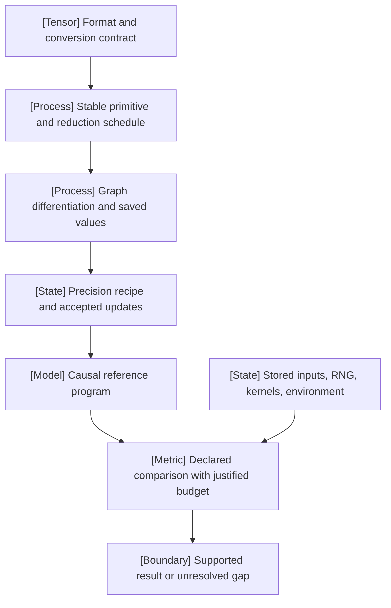

VOLUME I / PART I — SCIENTIFIC FOUNDATIONS / CHAPTER03

# 03 — Numerical computation and a trustworthy training program

**Thesis.** [DERIVED] A trustworthy training program makes its objective, representation, arithmetic, state transitions, and comparison criteria inspectable. This chapter derives local numerical guarantees under explicit premises, reconstructs the primary training methods that use them, and specifies a causal reference program. It does not infer a universal training-error bound from unit roundoff alone.

6 sections — 4 spine papers (P01, P13, P18, P19) — 6 implementations — prerequisites:01–02 — artifact target: a numerically checked single-device training skeleton — updated2026-10-07

## Why this chapter exists

[MATHEMATICALLY-DERIVED] Representation error, arithmetic error, conditioning, and objective errors have different causes. Max-shifting prevents positive exponential arguments for finite logits, but does not define an empty masked row. FP32 accumulation reduces reduction error, but does not recover a channel erased during operand conversion. FP64 derivative checks can validate the derivative of a wrongly masked objective. Each intervention therefore needs a precise boundary and an independent test of what it claims to protect.

[PAPER-REPORTED] The low-precision literature progressively changes the granularity and role of quantization: FP16 scaling and persistent update storage, BF16's wider exponent field, FP8 element designs, shared microscaling, and fine-grained training recipes. The2025–2026 FP4 studies add gradient-estimation, rotation, optimizer, and attention-specific mechanisms. Their convergence results depend on disclosed architectures, baselines, token budgets, and precision exemptions. [R3.2–5, R3.27–29](references.md).

[DERIVED] The chapter follows the computation vertically. First establish the representable values and conversion boundaries; then reconstruct stable reductions and normalization; then connect graph differentiation to saved state and accumulation; then assign precision to each training role. The reference program consumes real causal/padding masks and preserves its FP64 path. Finally, reproducibility distinguishes exact replay, justified numerical comparison, and run-level scientific conclusions.

## Concept map


```mermaid
flowchart TD
    F["[Tensor] Format and conversion contract"] --> R["[Process] Stable primitive and reduction schedule"]
    R --> A["[Process] Graph differentiation and saved values"]
    A --> P["[State] Precision recipe and accepted updates"]
    P --> M["[Model] Causal reference program"]
    M --> C["[Metric] Declared comparison with justified budget"]
    S["[State] Stored inputs, RNG, kernels, environment"] --> C
    C --> U["[Boundary] Supported result or unresolved gap"]
```

Text equivalent of the concept map:

- [Tensor] Format and conversion contract determines representable values.
  - [Process] Stable primitives fix reduction schedules and local conditions.
    - [Process] Graph differentiation adds saved-value and accumulation contracts.
      - [State] Precision recipes add scales and accepted-update state.
        - [Model] The causal reference joins the contracts.
          - [Metric] Comparisons require justified budgets and stored inputs.
            - [Boundary] Unsupported premises remain explicit gaps.
- [State] RNG, kernel and environment state delimit replay and diagnosis.
  - [Metric] A manifest records candidate causes without proving attribution.


## Position in the book


| Relation | Links |
|---|---|
| Prerequisites | [Chapter 01](../ch01-foundation-model-lifecycle/README.md) (resource accounting, §1.5); [Chapter 02](../ch02-mathematical-and-statistical-foundations/README.md), especially [§2.1 Tensor algebra](../ch02-mathematical-and-statistical-foundations/02-1-tensor-algebra.md) and [§2.4 Differential calculus](../ch02-mathematical-and-statistical-foundations/02-4-differential-calculus.md); [Notation](../../../front-matter/notation.md) |
| Siblings (same part) | [Chapter 04](../ch04-language-modeling-and-learning-objectives/README.md) (objectives and masks); [Chapter 05](../ch05-minimal-transformer-and-execution-trace/README.md) (the model the skeleton trains); [Chapter 06](../ch06-experimental-design-and-evaluation-before-optimization/README.md) (seed variance, §6.4) |
| Downstream | [§19.2 Batch semantics](../../part-04-training-science-and-adaptation/ch19-pretraining-objectives-and-the-full-training-loop/19-2-batch-semantics.md), [§19.4 Training-state transitions](../../part-04-training-science-and-adaptation/ch19-pretraining-objectives-and-the-full-training-loop/19-4-training-state-transitions.md); [§20.1 Optimizer mechanics](../../part-04-training-science-and-adaptation/ch20-optimization-schedules-and-training-stability/20-1-optimizer-mechanics.md), [§20.4 Stability instrumentation](../../part-04-training-science-and-adaptation/ch20-optimization-schedules-and-training-stability/20-4-stability-instrumentation.md); [§26.6 Correctness under optimization](../../../vol-02-execution-and-optimization/part-05-hardware-kernels-and-distributed-execution/ch26-kernel-programming-and-numerical-equivalence/26-6-correctness-under-optimization.md); [Chapter 28](../../../vol-02-execution-and-optimization/part-05-hardware-kernels-and-distributed-execution/ch28-frameworks-graph-compilers-and-runtime-integration/README.md); [§29.1 Data/state parallelism](../../../vol-02-execution-and-optimization/part-05-hardware-kernels-and-distributed-execution/ch29-parallelism-collectives-and-distributed-optimization/29-1-data-state-parallelism.md); [§30.6 Recovery and reproducibility](../../../vol-02-execution-and-optimization/part-05-hardware-kernels-and-distributed-execution/ch30-large-training-runs-reliability-monitoring-and-recovery/30-6-recovery-and-reproducibility.md); [§40.2 Quantization targets](../../../vol-02-execution-and-optimization/part-07-inference-algorithms-distillation-and-compression/ch40-quantization-from-numerical-model-to-deployable-artifact/40-2-quantization-targets.md) |
| Trades off with | Throughput and memory (narrower formats) against precision and dynamic range (§3.1, §3.4); bitwise determinism against kernel throughput (§3.6); activation memory against recomputation FLOPs (§3.3) |


## Sections

| — | Title | Methodological result |
|---|---|---|
| [3.1](03-1-numeric-representations.md) | Numeric representations | Exact normal/subnormal ranges, neighboring-value rounding, FP8/FP4/shared-scale distinctions, and conversion failures |
| [3.2](03-2-stable-primitives.md) | Stable primitives | Shifted log-sum-exp, direct softmax, online normalization, centered/Welford statistics, conditioned reduction bounds and accumulator contracts |
| [3.3](03-3-automatic-differentiation.md) | Automatic differentiation | DAG cotangent accumulation, saved-value lifetime/mutation, token-weighted micro-batches, clipping and conditional finite-difference analysis |
| [3.4](03-4-mixed-precision-execution.md) | Mixed-precision execution | Role-specific precision, scaling state machines, exact lost-update intervals, complete state accounting and documented FP4 successors |
| [3.5](03-5-reference-implementation.md) | Reference implementation | Real causal attention, target-transition supervision, safe empty rows, FP64-preserving execution and explicit pre-update rejection |
| [3.6](03-6-reproducibility-limits.md) | Reproducibility limits | RNG consumption, deterministic-selection/execution distinction, library guarantee scope, nontransitive tolerances and potentially unresolved attribution |

## Artifact

[DERIVED] The plan's artifact remains a **numerically checked single-device training skeleton**. This revision supplies the manuscript algorithms and reference listing; executable files, fixtures, and a run report are proposed in [verification.md](verification.md). Their names are specifications rather than claims that files already exist or checks have passed.

| Proposed component | Defined responsibility | Current boundary |
|---|---|---|
| Format/conversion module | Neighboring-value, underflow, overflow, scale and rounding contracts | Derived manuscript specifications |
| Primitive module | Stable reductions and dtype-preserving FP64 counterparts | Algorithms in§3.2; execution unverified |
| Causal reference | Shapes, masks, loss, backward and finite-update gate | Listing in§3.5; syntax inspected, training unexecuted |
| Stored fixtures | Realized parameters, inputs, masks, hashes, expected values/gradients | Not generated |
| Comparison/report module | Conditional bounds, semantic checks, derivative diagnostics and failures | Proposed protocol only |
| Environment/state manifest | Exact versions, kernels, RNG, scaling and update state | Schema-level specification |

## Verification

[DERIVED] The plan's comparison task is retained with a narrower, defensible claim: compare candidate forward values and gradients with a high-precision reference on fixed ordinary/extreme inputs, separating representation error from arithmetic error. Assert hard bounds only for operations whose premises have been established. For composite model paths without such a bound, record diagnostic errors and prespecified review thresholds separately; exceeding a diagnostic threshold does not itself prove a specific bug. Non-finite/empty-row, mask, alignment, connectivity, and accepted-update contracts supply categorical checks independent of numerical closeness.

```figure
id: fig-3.1
kind: diagram
title: From numerical premises to a supported verdict
caption: >-
  A format and reduction length supply only part of an error analysis.
  Operation schedules, input conditions, elementary-function error, and
  sensitivity determine which budgets are justified. Unsupported composite
  budgets remain explicit gaps. A manifest records candidate causes rather
  than automatically proving attribution.
placement: wide
evidence: MATHEMATICALLY-DERIVED
source: ["DERIVED:eq-3.9", "DERIVED:eq-3.14", "DERIVED:eq-3.17", "DERIVED:eq-3.22", "DERIVED:eq-3.23"]
alt: >-
  Representation, arithmetic schedule, conditioning, and function-evaluation
  premises feed a justified local budget. Stored reference values and candidate
  values are compared using that budget. The result records a supported
  comparison or an unresolved premise; the manifest supports diagnosis.
spec:
  direction: LR
  nodes:
    - { id: fmt, kind: tensor, label: "representation and conversion", sub: "§3.1" }
    - { id: arith, kind: process, label: "arithmetic schedule and function error", sub: "§3.2" }
    - { id: cond, kind: dependency, label: "conditioning and sensitivity", sub: "Eqs 3.10,3.14,3.23" }
    - { id: budget, kind: metric, label: "justified budget or explicit gap", sub: "verification.md" }
    - { id: ref, kind: model, label: "stored reference and candidate", sub: "same objective and inputs" }
    - { id: compare, kind: process, label: "categorical and numerical comparison", sub: "Eq 3.22 where justified" }
    - { id: manifest, kind: state, label: "execution manifest", sub: "candidate causal differences" }
    - { id: verdict, kind: branch, label: "supported result / unresolved", sub: "no automatic attribution" }
  edges:
    - { from: fmt, to: budget, kind: dependency }
    - { from: arith, to: budget, kind: emphasis }
    - { from: cond, to: budget, kind: dependency }
    - { from: budget, to: compare, kind: emphasis }
    - { from: ref, to: compare }
    - { from: compare, to: verdict, kind: emphasis }
    - { from: manifest, to: verdict, kind: dependency }
```

## Lineage

[DERIVED] The lineage records changed mechanisms with their evidence boundaries. It is not a ranking across incompatible workloads. Historical foundations remain useful;2026 work is included only where an inspected primary version adds a concrete method.

```figure
id: fig-3.2
kind: lineage
title: Documented changes in low-precision training methods
caption: >-
  Precision evolves through changes to update retention, range allocation,
  scaling granularity, gradient estimation, and sensitive-path handling.
  Every entry is an inspected primary method; none implies uniform accuracy
  or throughput across the later methods' different workloads.
placement: inline
evidence: PAPER-REPORTED
source: [R3.3, R3.4, R3.2, R3.5, P13, R3.27, R3.28, R3.29]
alt: >-
  Eight entries:2018 mixed precision,2019 BF16,2022 FP8,2023 microscaling,
  2025 DeepSeek-V3 and NVIDIA NVFP4,2026 QuartetII and Full-Stack FP4.
  The final entry uses fake-quantization numerical evaluation rather than
  native FP4 throughput measurement.
spec:
  entries:
    - { year: 2018, work: "Mixed Precision Training", cite: R3.3, relation: "engineering optimization", node: ms.section.3.4, note: "loss scaling, wider accumulation, persistent update storage" }
    - { year: 2019, work: "A Study of BFLOAT16 for Deep Learning Training", cite: R3.4, relation: "alternative branch", node: ms.section.3.1, note: "wider exponent field with coarser significand" }
    - { year: 2022, work: "FP8 Formats for Deep Learning", cite: R3.2, relation: "engineering optimization", node: ms.section.3.1, note: "E4M3/E5M2 elements and tensor scaling" }
    - { year: 2023, work: "Microscaling Data Formats", cite: R3.5, relation: "engineering optimization", node: ms.section.3.4, note: "shared scales over blocks and role-specific compute flow" }
    - { year: 2025, work: "DeepSeek-V3 v2", cite: P13, relation: "engineering optimization", node: ms.section.3.4, note: "fine-grained FP8 Linear inputs and FP32 promotion" }
    - { year: 2025, work: "Pretraining LLMs with NVFP4", cite: R3.27, relation: "engineering optimization", node: ms.section.3.4, note: "rotation, stochastic gradients, square weight scaling, exemptions" }
    - { year: 2026, work: "QuartetII", cite: R3.28, relation: "current frontier", node: ms.section.3.4, note: "MS-EDEN gradient estimation and hardware-aware scale processing" }
    - { year: 2026, work: "Full-Stack FP4", cite: R3.29, relation: "current frontier", node: ms.section.3.4, note: "optimizer/attention extensions; fake-quantization study; prospective code" }
```

## Terms owned here

[DERIVED] Canonical terms are defined at their mechanistic locations: machine epsilon/unit roundoff, normal/subnormal ranges and block-scaled representations in§3.1; accumulation dtype, cancellation and stable primitives in§3.2; saved tensors, mutation counters, accumulation, clipping and derivative checks in§3.3; scale-state recipes and persistent master/update storage in§3.4; explicit fixtures and causal reference contracts in§3.5; RNG consumption, numerical comparison and determinism in§3.6. These terms retain their stated conditions rather than acquiring stronger meanings in an index.

## Reference-stack coverage


Rows bind this chapter to `Instruction/AI_REFERENCE_STACK.md`. Entry names, index numbers, and surfaces are those of the reference stack; "Surface used" is the URL listed there, under which the pages recorded in [references.md](references.md) were opened on 2026-10-07.

| Stack section | Entry (rank) | Stack layer | What this chapter takes from it | Surface used | Sections | Evidence label |
|---|---|---|---|---|---|---|
| §1 lab | **DeepSeek** (#8) | — | DeepSeek-V3 Technical Report §3.3: E4M3 on Linear GEMM input tensors, 1×128 / 128×128 scaling groups, online scaling, FP32 promotion every 128 elements, BF16 AdamW moments with FP32 master weights and gradients, < 0.25% relative loss error on two ablation scales | Papers — https://github.com/deepseek-ai (report at arXiv 2412.19437, P13) | 3.1, 3.3, 3.4 | PAPER-REPORTED |
| §1 lab | **NVIDIA Research** (#14) | — | Authorship route for the FP8-formats and mixed-precision-training papers; NVIDIA documentation on IEEE 754 behavior of GPUs | Papers — https://research.nvidia.com/publications | 3.1, 3.4, 3.6 | PAPER-REPORTED |
| §1 lab | **Microsoft Research / Microsoft AI** (#13) | — | ZeRO's 2Ψ + 2Ψ + 12Ψ = 16Ψ byte accounting for mixed-precision Adam (P18); first author's affiliation on the microscaling paper (R3.5) | Papers — https://www.microsoft.com/research/publications/ | 3.3, 3.4 | PAPER-REPORTED |
| §2 conference | **ICLR** (#3) | — | Archival venue of *Mixed Precision Training* (2018) and *8-bit Optimizers via Block-wise Quantization* (2022) | Open proceedings — https://openreview.net/group?id=ICLR.cc/2026/Conference (venue route; both papers were opened on arXiv) | 3.4 | PAPER-REPORTED |
| §2 conference | **NeurIPS** (#1) | — | Archival venue of FlashAttention (P19), RMSNorm (R3.20), and the Transformer (P01) | Open proceedings — https://proceedings.neurips.cc/ | 3.2, 3.3, 3.5 | PAPER-REPORTED |
| §3 discovery source | **arXiv** (#1) | — | Primary access to R3.2–R3.5, R3.18, R3.20–R3.24, P01, P13, P18, P19 (versioned full texts and PDFs) | Entry point — https://arxiv.org/ ; search — https://arxiv.org/search/advanced | 3.1–3.5 | PAPER-REPORTED |
| §4 system | **NVIDIA Transformer Engine** (#7) | Kernels / numerics / collectives | FP8 delayed/current scaling, MXFP8 (32-value blocks/E8M0), NVFP4 (FP4 elements, local E4M3 and global FP32 scales), blockwise FP8; recipe classes | docs/code — https://docs.nvidia.com/deeplearning/transformer-engine/ | 3.1, 3.4 | OFFICIAL-DOCUMENTATION |
| §4 system | **NVIDIA cuBLAS / cuBLASLt** (#2) | Kernels / numerics / collectives | Compute type separate from operand types; bitwise-reproducibility statement and its multi-stream caveat; `CUBLAS_WORKSPACE_CONFIG`; atomics note | docs/code — https://docs.nvidia.com/cuda/cublas/ | 3.1, 3.2, 3.6 | OFFICIAL-DOCUMENTATION |
| §4 system | **NVIDIA cuDNN** (#3) | Kernels / numerics / collectives | Engine numerical notes (`CUDNN_NUMERICAL_NOTE_NONDETERMINISTIC`) and heuristic engine selection as a nondeterminism source | docs/code — https://docs.nvidia.com/deeplearning/cudnn/ | 3.6 | OFFICIAL-DOCUMENTATION |
| §4 system | **NVIDIA CUDA** (#1) | Accelerator / driver / compiler | Round-to-nearest default, `-ftz=true` flush-to-zero, FMA single rounding, reordering under parallelization | docs/code — https://docs.nvidia.com/cuda/ | 3.1, 3.2, 3.6 | OFFICIAL-DOCUMENTATION |
| §4 system | **PyTorch** (#17) | Model / autograd framework | Autograd mechanics (saved tensors, version counters, `.grad` accumulation), autocast op lists, `GradScaler` defaults, `clip_grad_norm_`, `gradcheck`, `torch.utils.checkpoint`, reproducibility and CUDA-semantics notes | docs/code — https://pytorch.org/docs/stable/ | 3.1–3.6 | OFFICIAL-DOCUMENTATION |
| §4 system | **JAX** (#18) | Model / autograd framework | Explicit PRNG keys, `check_grads`, `jax.checkpoint` / `jax.remat`, matmul precision levels | docs/code — https://docs.jax.dev/ | 3.1, 3.3, 3.6 | OFFICIAL-DOCUMENTATION |
| §4 system | **FlashAttention** (#39) | Kernels / numerics / collectives | Online softmax with running max and rescaled partial sums (Algorithm 3.2); recomputation of probabilities in backward | docs/code — https://github.com/Dao-AILab/flash-attention | 3.2, 3.3 | PAPER-REPORTED |
| §3 discovery source | **PMLR** (#3) | — | Primary open proceedings PDF for the initialization study R3.30; retrieval route rather than independent result evidence | https://proceedings.mlr.press/ | 3.5 | PAPER-REPORTED |
| *Outside the reference stack (routed via book_plan.md anchors)* | | | | | | |
| plan anchor (Chapter 03) | TorchAO | Kernels / numerics / collectives by role; not a §4 entry | float8 training recipes `tensorwise` / `rowwise` / `rowwise_with_gw_hp`; MXFP8 training as prototype | https://github.com/pytorch/ao (the plan's Chapter 03 source anchor; exact opened workflow in references.md) | 3.4 | OFFICIAL-DOCUMENTATION |
| plan anchor (Chapter 03; Appendix G) | Stanford CS336, Spring 2026 | — | From-scratch implementation sequence that motivates a testable skeleton | https://cs336.stanford.edu/ (the plan's Chapter 03 source anchor) | 3.5 | OFFICIAL-DOCUMENTATION |
| chapter brief (FP8 formats) | *FP8 Formats for Deep Learning*, arXiv 2209.05433 | — | E4M3 / E5M2 encodings and constants (Table 3.1) | reached through §3 source arXiv (#1) | 3.1, 3.4 | PAPER-REPORTED |

**Inspection dimensions applied.** Of the §4.2 dimensions, this chapter analyses **Precision** throughout (formats and ε in §3.1; accumulation dtype in §3.2; BF16/FP16, FP8, MXFP8, FP4/NVFP4, accumulation and optimizer precision in §3.4); **Memory** in §3.3 (saved tensors, recomputation) and §3.4 (bytes per parameter, Eq. 3.18); **Kernels** in §3.2 (fused softmax and normalization, GEMM accumulation) and §3.6 (atomics, engine selection); **Checkpointing** only as the requirement that RNG and scaling state be saved (§3.4, §3.6; the design is owned by §19.4 and §30.3); **Metrics** only through the error metrics of [verification.md](verification.md), not throughput; **Reliability** as non-finite-step gating and loss-scale collapse (§3.3, §3.4); and **Reproducibility** as the manifest of §3.6 (exact commit, driver/runtime version, kernel flags). Parallelism, Communication, Post-training, and Inference are out of scope for a single-device chapter and are forward-linked to Chapters 29, 31–36, and 40–42.

[DERIVED] OCP MX v1.0 supplies the normative representation/conversion details required by the Chapter 03 FP4/microscaling brief, reached through R3.5. The numerical-analysis and AD primary papers resolve the plan's stable-primitive and differentiation obligations through the arXiv/PMLR discovery routes; no discovery ranking is treated as scientific evidence.


## Source route

[DERIVED] Research retrieval followed the reference stack's paper cascade to versioned arXiv full texts, PMLR and the originating JMLR PDF; inspected method/experiment locators are in [references.md](references.md). Official implementation retrieval followed PyTorch, JAX, NVIDIA Transformer Engine, CUDA/cuBLAS/cuDNN and the plan's TorchAO anchor to exact pages. Discovery/proceedings routes locate evidence; only the originating text supports a scientific or implementation claim. CS336 supplies the planned from-scratch curriculum context rather than benchmark evidence.

## Status

[DERIVED] Editorial status remains `manuscript_draft`. The six manuscripts now contain source-grounded methods, conditional derivations, algorithms, reported protocols, observations, and improvement lineage. The [topic-completeness audit](verification.md#5-topic-completeness-audit) records required concepts, source locators, applicable obligations, and gaps. Structure and source inspection do not establish independent scientific review or executed correctness.

[UNVERIFIED] Remaining material gaps include execution of the reference listing and fixtures, full end-to-end model/gradient error budgets, native FP4 reproduction, and independent reproduction of source quality/throughput results. Closed-kernel schedules and absent source trial/seed details remain disclosure limits. Previously unresolved OCP E2M1, NVFP4 global scaling, and delayed-scaling semantics were inspected through the readable primary surfaces in this revision.
