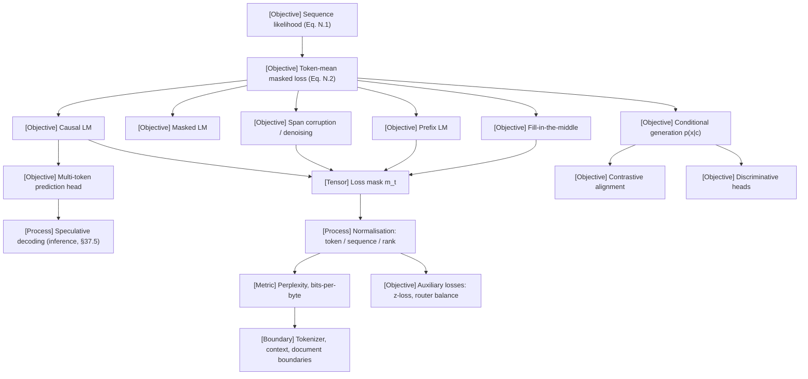

VOLUME I / PART I — SCIENTIFIC FOUNDATIONS / CHAPTER 04

# 04 — Language modeling and learning objectives

**Thesis.** Every training signal a foundation model ever receives is fully specified by four ledger fields — what the model may condition on, which positions carry targets, which positions carry loss, and how the loss is normalised — and a chapter that fixes those fields for each objective family is the only way to make later losses, perplexities, and capability claims comparable at all.

6 sections · 8 spine papers · 6 implementations · prerequisites: [02](../ch02-mathematical-and-statistical-foundations/README.md), [03](../ch03-numerical-computation-and-trustworthy-training/README.md) · artifact: an objective ledger specifying conditioning, targets, masks, and normalisation · updated 2026-09-20

## Why this chapter exists

What failed before was a vocabulary collapse: "the pretraining objective" became a synonym for next-token prediction, and every other signal — masked reconstruction, span corruption, prefix conditioning, infilling, contrastive alignment, auxiliary heads, action-conditioned prediction — was filed as an architecture choice or a data trick. The corrections table of `book_plan.md` records this as a category error, and the cost of the error is concrete: papers report "loss 2.1" or "perplexity 12.3" without stating the tokenizer, the loss mask, the normalisation, the context window, or the document-boundary treatment, and readers compare them.

The bottleneck that appeared was comparability. As objectives diversified (encoder-only, encoder–decoder, decoder-only with prefix visibility, fill-in-the-middle, multi-token heads, multimodal conditioning), the single scalar "loss" stopped being a shared coordinate. Two models trained with different target masks or different normalisation denominators do not sit on the same axis, and the shared mathematical contract of this book (Eq. N.1/N.2 in [notation](../../../front-matter/notation.md)) exists precisely to prevent the silent aliasing.

The constraint that became dominant is that objective choices have physical costs that are rarely stated next to them: span corruption changes the target-length ratio and therefore the decoder FLOPs per input token; encoder–decoder objectives add cross-attention and a second parameter stack; multi-token prediction adds output-head evaluations at vocabulary width; contrastive objectives make the effective batch a part of the objective. What changed in the solution is a bookkeeping discipline rather than a new algorithm: this chapter treats each objective as a row in a ledger with conditioning, targets, masks, normalisation, and cost fields, derives the shared likelihood contract once, and shows by hand-auditable example exactly which tokens carry gradient under each family. Every downstream chapter that reports a loss inherits this ledger.

```figure
id: fig-4.1
kind: compare
title: Six objective families on the four ledger fields
caption: >-
  Read along a row. The first four rows are the thesis's four ledger fields,
  and no two columns agree on all of them, which is why a bare "loss" has no
  shared axis. The ρ row is counted on the 12-token verification sequence
  where the chapter builds that row, and the last row says what each loss is
  blind to. Masked LM and the contrastive row define no sampler over x at
  all.
placement: wide
evidence: MATHEMATICALLY-DERIVED
source: ["DERIVED:eq-4.2", "DERIVED:eq-4.6", P01, R4.1, P02, R4.8, R4.5, P44]
concepts: [ms.section.4.1, ms.section.4.2, ms.section.4.3, ms.section.4.5]
alt: >-
  Comparison table of six objective families on the chapter's four ledger
  fields plus the target-length ratio and the blind spot of each loss. Causal
  LM: sees x before t; causal mask; every x_t is a target; mask 1 on all
  non-pad targets with a global token-count denominator; ρ = 13/13 on the
  audit; blind to sampled-prefix behaviour and thresholded success. Masked LM:
  sees all of the corrupted input; bidirectional; targets are the original
  tokens at masked positions; mean over |M|; ρ = |M|/T with 15% masking in
  BERT; no ordered likelihood and no sampler. Span corruption: bidirectional
  encoder, causal decoder with cross-attention; target is sentinels plus
  dropped spans; mean over |y|; ρ = 6/11 on the audit; no likelihood of the
  clean sequence. Prefix LM: prefix bidirectional, rest causal; targets after
  P; mean over T − P; ρ = 5/13; no loss on the prefix. FIM in PSM order:
  causal over the rearranged sequence; loss on all sections or on the middle
  only; ρ = 1 or 6/16; the text loss does not run the infilled code.
  Contrastive pair: two encoders; target is the matched pair in the batch;
  mean over 2N rows; ρ undefined; no likelihood and no perplexity.
spec:
  axis: >-
    The thesis's four ledger fields (conditioning, targets, loss mask,
    normalisation) plus ρ and the blind spot of each loss, for one training
    sequence of each family
  columns:
    - { id: causal, label: "Causal LM (§4.1)", node: ms.section.4.1 }
    - { id: mlm, label: "Masked LM (§4.2)", node: ms.section.4.2 }
    - { id: span, label: "Span corruption, enc–dec (§4.2)", node: ms.section.4.2 }
    - { id: prefix, label: "Prefix LM (§4.2)", node: ms.section.4.2 }
    - { id: fim, label: "FIM, PSM order (§4.3)", node: ms.section.4.3 }
    - { id: con, label: "Contrastive pair (§4.5)", node: ms.section.4.5 }
  rows:
    - { dimension: "conditioning: what a scored position sees", values: { causal: "x_{<t}, plus text c as a prefix", mlm: "all of the corrupted input x̃", span: "enc(x̃) through cross-attention, plus y_{<j}", prefix: "x_{1:P} bidirectionally, then x_{<t}", fim: "x_{<t} of the rearranged sequence: prefix and suffix precede the middle", con: "nothing across pairs; f_a and f_b encode a_i and b_i separately" } }
    - { dimension: "attention mask", values: { causal: "causal", mlm: "bidirectional", span: "bidirectional encoder; causal decoder + cross", prefix: "block: prefix bidirectional, rest causal", fim: "causal", con: "none between the two encoders" } }
    - { dimension: "targets", values: { causal: "every x_t", mlm: "original x_t for t ∈ M only", span: "y = s_1∘span_1∘…∘s_{K+1}", prefix: "x_t for t > P", fim: "every token of the rearranged sequence", con: "which of the N candidates is the matched pair" } }
    - { dimension: "loss mask m_t and denominator", values: { causal: "1 on all non-pad targets; global token count (Eq. 4.2)", mlm: "1[t ∈ M]; mean over |M| (Eq. 4.3)", span: "1 on all of y; mean over |y| (Eq. 4.4)", prefix: "1[t > P]; mean over T − P (Eq. 4.5)", fim: "1 on all sections (R4.5); variant: middle only", con: "one per pair; mean over 2N rows (Eq. 4.13)" } }
    - { dimension: "ρ, gradient-bearing share (Eq. 4.6)", values: { causal: "1; 13/13 on the audit", mlm: "|M|/T; 15% masking in R4.1", span: "|y|/|x̃|; 6/11 on the audit", prefix: "(T − P)/T; 5/13 on the audit", fim: "1 on the audit; middle-only 6/16", con: "undefined: no token targets" } }
    - { dimension: "what the loss cannot measure", values: { causal: "behaviour on the model's own sampled prefixes; thresholded task success", mlm: "any ordered likelihood: no sampler, no §4.6 perplexity", span: "p(x) of the clean sequence; only p(y | x̃) over dropped spans", prefix: "the prefix itself, which carries m_t = 0", fim: "whether the infilled code runs; that needs execution and Eq. 4.8", con: "the likelihood of either modality; perplexity is undefined" } }
```

## Concept map



- [Objective] Sequence likelihood (Eq. N.1)
  - [Objective] Token-mean masked loss (Eq. N.2)
    - [Objective] Causal LM → [Objective] Multi-token prediction head → [Process] Speculative decoding (inference, §37.5)
    - [Objective] Masked LM
    - [Objective] Span corruption / denoising
    - [Objective] Prefix LM
    - [Objective] Fill-in-the-middle
    - [Objective] Conditional generation p(x|c) → [Objective] Contrastive alignment; [Objective] Discriminative heads
    - [Tensor] Loss mask m_t (fed by causal, span, prefix, FIM)
      - [Process] Normalisation: token / sequence / rank
        - [Metric] Perplexity, bits-per-byte → [Boundary] Tokenizer, context, document boundaries
        - [Objective] Auxiliary losses: z-loss, router balance

## Position in the book

| Relation | Links |
|---|---|
| Prerequisites | [§2.2 Probability](../ch02-mathematical-and-statistical-foundations/02-2-probability.md), [§2.3 Information theory](../ch02-mathematical-and-statistical-foundations/02-3-information-theory.md), [§3.2 Stable primitives](../ch03-numerical-computation-and-trustworthy-training/03-2-stable-primitives.md), [§3.5 Reference implementation](../ch03-numerical-computation-and-trustworthy-training/03-5-reference-implementation.md), [Notation](../../../front-matter/notation.md) |
| Siblings (same part) | [01](../ch01-foundation-model-lifecycle/README.md), [02](../ch02-mathematical-and-statistical-foundations/README.md), [03](../ch03-numerical-computation-and-trustworthy-training/README.md), [05](../ch05-minimal-transformer-and-execution-trace/README.md), [06](../ch06-experimental-design-and-evaluation-before-optimization/README.md) |
| Downstream | [§5.5 Training and generation](../ch05-minimal-transformer-and-execution-trace/05-5-training-and-generation.md), [§10.5 Tool and multimodal interfaces](../../part-02-data-and-representation-engineering/ch10-tokenization-serialization-and-interface-correctness/10-5-tool-and-multimodal-interfaces.md), [§18.4 Learning objectives](../../part-03-model-architectures-and-state/ch18-multimodal-architectural-primitives/18-4-learning-objectives.md), [§19.1 Objective selection](../../part-04-training-science-and-adaptation/ch19-pretraining-objectives-and-the-full-training-loop/19-1-objective-selection.md), [§31.1 SFT objectives](../../../vol-02-execution-and-optimization/part-06-post-training-and-reinforcement-learning/ch31-supervised-fine-tuning-and-behavior-acquisition/31-1-sft-objectives.md), [§39.1 Distillation objectives](../../../vol-02-execution-and-optimization/part-07-inference-algorithms-distillation-and-compression/ch39-knowledge-response-and-policy-distillation/39-1-distillation-objectives.md), [55–60](../../../vol-03-grounded-and-interactive-intelligence/part-10-multimodal-world-and-embodied-models/README.md) |
| Trades off with | [§21.6 Capability prediction](../../part-04-training-science-and-adaptation/ch21-scaling-laws-and-compute-allocation/21-6-capability-prediction.md) (loss vs thresholded metrics), [§37.5 Speculative decoding](../../../vol-02-execution-and-optimization/part-07-inference-algorithms-distillation-and-compression/ch37-decoding-constrained-generation-and-speculative-execution/37-5-speculative-decoding.md) (training heads vs inference algorithms), [§61.4 Validity threats](../../../vol-03-grounded-and-interactive-intelligence/part-11-evaluation-interpretability-and-deployment-assurance/ch61-capability-portfolios-and-benchmark-validity/61-4-validity-threats.md) |

## Sections

| § | Title | What changes here | Primary labels |
|---|---|---|---|
| [4.1](04-1-autoregressive-modeling.md) | Autoregressive modeling | The chain rule becomes a training procedure: teacher forcing with a causal mask, and token vs sequence likelihood get distinct normalisations | MATHEMATICALLY-DERIVED, PAPER-REPORTED |
| [4.2](04-2-alternative-objectives.md) | Alternative objectives | Visibility is decoupled from prediction: masked, span-corruption, denoising, prefix, and encoder–decoder objectives each change the attention mask and the target set | PAPER-REPORTED, MATHEMATICALLY-DERIVED |
| [4.3](04-3-code-and-structured-sequences.md) | Code and structured sequences | Document rearrangement (FIM) lets a causal model condition on the future; targets may be grounded in execution rather than text | PAPER-REPORTED, DERIVED |
| [4.4](04-4-auxiliary-prediction.md) | Auxiliary prediction | Extra heads and regularisers reshape gradient without changing the deployed sampler; training heads are separated from inference algorithms | PAPER-REPORTED, DERIVED |
| [4.5](04-5-conditional-and-multimodal-learning.md) | Conditional and multimodal learning | The conditioning c stops being text; generative and discriminative objectives diverge in what they must normalise over | PAPER-REPORTED, MATHEMATICALLY-DERIVED |
| [4.6](04-6-likelihood-and-capability.md) | Likelihood and capability | Perplexity is shown to be a tokenizer-, context-, and boundary-dependent quantity, and likelihood is bounded as a deployment objective | MATHEMATICALLY-DERIVED, DERIVED, UNVERIFIED |

## Artifact

**Objective ledger** — a table with one row per objective family and the columns `objective_id · family · sequence construction · conditioning (visible positions) · attention mask · target positions · loss mask m_t · normalisation (token / sequence / rank; denominator) · special tokens · target-length ratio · extra parameters / FLOPs · paper anchor · label`. The schema and a fully populated ledger for causal LM, masked LM, span corruption, BART-style denoising, prefix LM, supervised encoder–decoder, FIM (PSM and SPM), causal masking, multi-token prediction, contrastive alignment, and discriminative heads live in [verification.md](verification.md) §1.

## Verification

The falsifiable task is to take a 12-token hand-audited sequence, write out input ids, target ids, loss mask, and attention-visibility pattern for causal LM, span corruption, prefix LM, and FIM, and check that the ledger row reproduces exactly those tensors; the second half demonstrates, with two synthetic perplexity reports, that they become incomparable when tokenizer, normalisation, context window, document-boundary treatment, or evaluation set differ. The protocol, acceptance criteria, and rejection conditions are in [verification.md](verification.md).

## Lineage

- 2017 · Attention Is All You Need (P01) · *conceptual ancestor* — teacher-forced encoder–decoder likelihood with a causal decoder mask
- 2018 · BERT [R4.1] · *alternative branch* — masked-token reconstruction with bidirectional visibility
- 2019 · T5 (P02) · *current frontier* for span-corruption bookkeeping — sentinel-delimited targets and a controlled objective comparison
- 2019 · BART [R4.3] · *alternative branch* — full-sequence denoising reconstruction
- 2022 · UL2 [R4.4] · *engineering optimization* — a mixture of denoisers with mode tokens
- 2022 · Efficient Training of Language Models to Fill in the Middle [R4.5] · *engineering optimization* — document rearrangement for infilling in causal models
- 2024 · DeepSeek-V3 (P13) · *current frontier* for a sequential multi-token-prediction head in a released report
- 2021 · CLIP (P44) · *alternative branch* — contrastive alignment replacing token likelihood

```figure
id: fig-4.2
kind: lineage
title: Lineage of the objective ledger
caption: >-
  Three branches change what is predicted (BERT reconstructs masked tokens,
  BART the whole document, CLIP the matched pair); two engineering entries
  keep an existing objective and change the data or the mixture (UL2's mode
  tokens, FIM's rearrangement). The two current-frontier entries are frontier
  only for a bookkeeping practice: T5's sentinel-delimited targets and
  DeepSeek-V3's sequential MTP head, not as models.
placement: inline
evidence: PAPER-REPORTED
source: [P01, R4.1, P02, R4.3, P44, R4.4, R4.5, P13]
alt: >-
  Timeline of the eight works in the chapter's Lineage list, in year order.
  2017, Attention Is All You Need (P01), conceptual ancestor: teacher-forced
  encoder–decoder likelihood with a causal decoder mask. 2018, BERT (R4.1),
  alternative branch: masked-token reconstruction with bidirectional
  visibility. 2019, T5 (P02), current frontier for span-corruption
  bookkeeping: sentinel-delimited targets and a controlled objective
  comparison. 2019, BART (R4.3), alternative branch: full-sequence denoising
  reconstruction. 2021, CLIP (P44), alternative branch: contrastive alignment
  replacing token likelihood. 2022, UL2 (R4.4), engineering optimization: a
  mixture of denoisers with mode tokens. 2022, Efficient Training of Language
  Models to Fill in the Middle (R4.5), engineering optimization: document
  rearrangement for infilling in causal models. 2024, DeepSeek-V3 (P13),
  current frontier for a sequential multi-token-prediction head in a released
  report.
spec:
  entries:
    - { year: 2017, work: "Attention Is All You Need", cite: P01, relation: "conceptual ancestor", node: ms.section.4.1, note: "teacher-forced encoder–decoder likelihood with a causal decoder mask" }
    - { year: 2018, work: "BERT", cite: R4.1, relation: "alternative branch", node: ms.section.4.2, note: "masked-token reconstruction with bidirectional visibility" }
    - { year: 2019, work: "T5", cite: P02, relation: "current frontier", node: ms.section.4.2, note: "for span-corruption bookkeeping: sentinel-delimited targets and a controlled objective comparison" }
    - { year: 2019, work: "BART", cite: R4.3, relation: "alternative branch", node: ms.section.4.2, note: "full-sequence denoising reconstruction" }
    - { year: 2021, work: "CLIP", cite: P44, relation: "alternative branch", node: ms.section.4.5, note: "contrastive alignment replacing token likelihood" }
    - { year: 2022, work: "UL2", cite: R4.4, relation: "engineering optimization", node: ms.section.4.2, note: "a mixture of denoisers with mode tokens" }
    - { year: 2022, work: "Efficient Training of Language Models to Fill in the Middle", cite: R4.5, relation: "engineering optimization", node: ms.section.4.3, note: "document rearrangement for infilling in causal models" }
    - { year: 2024, work: "DeepSeek-V3", cite: P13, relation: "current frontier", node: ms.section.4.4, note: "for a sequential multi-token-prediction head in a released report" }
```

## Terms owned here

- **Autoregressive factorisation** — the chain-rule decomposition of a sequence distribution into per-position conditionals (§4.1).
- **Teacher forcing** — conditioning each training-time prediction on ground-truth prefixes rather than model samples (§4.1).
- **Loss mask** — the binary vector m_t selecting which positions contribute to the loss (§4.1; symbol from notation).
- **Token-mean / sequence-mean normalisation** — the two denominators of Eq. N.2 and their gradient consequences (§4.1).
- **Exposure bias** — the train/inference mismatch introduced by teacher forcing (§4.1).
- **Masked language modeling** — reconstruction of a subset of positions under bidirectional visibility (§4.2).
- **Span corruption** — replacement of contiguous spans by sentinels with sentinel-delimited targets (§4.2).
- **Prefix language modeling** — bidirectional visibility over a prefix with causal targets over the remainder (§4.2).
- **Fill-in-the-middle (PSM/SPM)** — document rearrangement so that a causal model predicts a middle segment after seeing prefix and suffix (§4.3).
- **Execution-grounded target** — a training or evaluation target defined by running the output rather than matching text (§4.3).
- **Multi-token prediction (training head)** — an auxiliary head predicting tokens beyond t+1 during training (§4.4).
- **Auxiliary loss** — a loss term added to the primary objective for regularisation or stability, not for the deployed prediction (§4.4).
- **Target-length ratio** — target tokens divided by input tokens for an objective row (§4.2).
- **Conditional generative objective** — Eq. N.2 applied to targets with a conditioning input that enters through an interface and carries zero loss mask at every conditioning position (§4.5).
- **Discriminative objective** — an objective whose softmax or scoring runs over a finite candidate set rather than over sequences, with no sampler over the target modality (§4.5).
- **Perplexity comparability conditions** — the five conditions under which two perplexities share an axis (§4.6).

## Reference-stack coverage

This table binds the chapter to `Instruction/AI_REFERENCE_STACK.md`. The *Surface used* cell is the URL exactly as that file lists it; the cell also says whether that surface was itself opened on 2026-09-20 or whether the work was reached through arXiv (§3 #1) with the lab surface serving only as the attribution route. Per-work URLs and access dates are in [references.md](references.md).

| Stack section | Entry (rank) | Stack layer | What this chapter takes from it | Surface used | Sections | Evidence label |
|---|---|---|---|---|---|---|
| §1 lab | **DeepSeek** (#8) | — | DeepSeek-V3 Technical Report: sequential MTP modules (shared Emb/OutHead, TRM_k, M_k ∈ ℝ^{d×2d}), D = 1, λ = 0.3 → 0.1 at 10T of 14.8T tokens, discard-or-repurpose at inference, sequence-wise balance loss α = 0.0001 | Papers: https://github.com/deepseek-ai (organisation page opened; report opened via arXiv HTML) | 4.4 | PAPER-REPORTED |
| §1 lab | **DeepSeek** (#8) | — | DeepSeek-V3 repository README: 685B stored weights = 671B main + 14B MTP module; framework MTP support "under active development" | Code: https://github.com/deepseek-ai (organisation page and `DeepSeek-V3` README opened) | 4.4 | OFFICIAL-DOCUMENTATION |
| §1 lab | **Google Research** (#18) | — | T5 span corruption with sentinels and its objective/architecture comparison; BERT masked LM (15%, 80/10/10, masked-only loss); UL2 Mixture-of-Denoisers; PaLM z-loss; ST-MoE router z-loss; Switch balance loss; the Transformer's causal decoder mask and label-smoothing observation | Code: https://github.com/google-research (`text-to-text-transfer-transformer` and `bert` READMEs opened; papers opened via arXiv/ar5iv) | 4.1, 4.2, 4.4, 4.6 | PAPER-REPORTED |
| §1 lab | **OpenAI** (#2) | — | Fill-in-the-middle (PSM/SPM, loss on all sections, 50% rate, context-level FIM); CLIP symmetric contrastive objective; Codex/HumanEval functional correctness and pass@k; Whisper audio-conditional decoder with task tokens | Code: https://github.com/openai (organisation page, `CLIP`, `whisper`, `human-eval` READMEs opened; papers opened via arXiv/ar5iv) | 4.3, 4.5 | PAPER-REPORTED |
| §1 lab | **Meta AI / FAIR** (#4) | — | Parallel-head multi-token prediction with sequential head backward (R4.13); Code Llama infilling rate 0.9 with PSM/SPM halves (R4.12); InCoder causal masking (R4.9); BART denoising (R4.3) | Papers: https://ai.meta.com/results/?content_types%5B0%5D=publication (not opened; papers opened via arXiv/ar5iv; affiliation as printed on the papers) | 4.2, 4.3, 4.4 | PAPER-REPORTED |
| §1 lab | **Google DeepMind** (#3) | — | Gato: one token stream over text, images, proprioception, and actions, used for the action-conditioned ledger row | Papers: https://deepmind.google/research/publications/ (not opened; abstract opened via arXiv) | 4.5 | PAPER-REPORTED |
| §1 lab | **Microsoft Research / Microsoft AI** (#13) | — | UniLM: unidirectional, bidirectional, and sequence-to-sequence objectives selected by self-attention masks — the prefix-LM row | Papers: https://www.microsoft.com/research/publications/ (not opened; abstract opened via arXiv) | 4.2 | PAPER-REPORTED |
| §2 conference | **NeurIPS** (#1) | — | Archival identity of P01 (Advances in Neural Information Processing Systems 30) | Papers: https://proceedings.neurips.cc/ (P01 abstract page opened) | 4.1, 4.2 | KNOWN |
| §2 conference | **ICML** (#2) | — | Archival identity of CLIP (PMLR 139), calibration (PMLR 70), speculative decoding (PMLR 202) | Papers: https://proceedings.mlr.press/ (three paper pages opened) | 4.4, 4.5, 4.6 | KNOWN |
| §2 conference | **ACL** (#4) | — | Archival identity of BART (ACL 2020) | Papers: https://aclanthology.org/venues/acl/ (paper page `2020.acl-main.703` in the same archive opened) | 4.2 | KNOWN |
| §3 discovery source | **arXiv** (#1) | — | Primary route to every paper in the chapter; abstract pages for identity, arXiv HTML for P13 and R4.13 full text | Entry point: https://arxiv.org/ (abs and HTML pages opened; see references.md) | 4.1–4.6 | KNOWN |
| §3 discovery source | **ACL Anthology** (#5) | — | Archival identity of BERT (NAACL 2019, N19-1423) | Entry point: https://aclanthology.org/ (paper page opened) | 4.2 | KNOWN |
| §4 system | **PyTorch** (#17) | Model / autograd framework | `torch.nn.functional.cross_entropy`: `ignore_index` excludes targets from the gradient; `mean` averages over non-ignored targets; `label_smoothing` — the within-call half of Eq. 4.2 | docs/code: https://pytorch.org/docs/stable/ (function page opened at the `docs.pytorch.org` 2.14 URL that the stable link redirects to) | 4.1, 4.6 | OFFICIAL-DOCUMENTATION |
| §4 system | **TorchTitan** (#21) | Distributed training | Reference loss: `cross_entropy_loss(..., reduction="sum", ignore_index=IGNORE_INDEX)` then division by `global_valid_tokens` — the global token-mean denominator | docs/code: https://github.com/pytorch/torchtitan (README and `torchtitan/components/loss.py` on `main` opened; commit not pinned) | 4.1 | KNOWN |
| §4 system | **NVIDIA Megatron-Core** (#23) | Distributed training | Identity of the component that owns `megatron/core/`: "a self contained, light weight PyTorch library"; no loss-function detail is taken from the docs site | docs/code: https://docs.nvidia.com/megatron-core/index.html (landing page opened; a guessed developer-guide sub-page returned HTTP 404) | 4.1 | OFFICIAL-DOCUMENTATION |
| §4 system | **Megatron-LM** (#24) | Distributed training | `vocab_parallel_cross_entropy`: MAX all-reduce of logit maxima, SUM all-reduce of sum-exp, target logit gathered on the owning vocabulary shard; README: "This repository contains two components: Megatron-LM and Megatron Core" | docs/code: https://github.com/NVIDIA/Megatron-LM (README and `megatron/core/tensor_parallel/cross_entropy.py` on `main` opened; commit not pinned) | 4.1, 4.4 | KNOWN |
| §4 system | **Liger Kernel** (#40) | Kernels / numerics / collectives | Fused linear cross-entropy: chunk the BT tokens, never materialise the full [BT, V] logits, compute the gradient in the forward pass, accumulate the weight gradient across chunks | docs/code: https://github.com/linkedin/Liger-Kernel (README and `src/liger_kernel/ops/fused_linear_cross_entropy.py` on `main` opened; commit not pinned) | 4.1, 4.4 | KNOWN |
| §4 system | **Hugging Face Transformers** (#26) | Model definition / adaptation | Perplexity page: definition, tokenizer dependence, strided evaluation, the 19.44 → 16.44 example; T5 page: 100 `extra_id` sentinels, `_shift_right`, −100 label masking | docs/code: https://huggingface.co/docs/transformers/ (`perplexity` and `model_doc/t5` pages opened) | 4.2, 4.6 | OFFICIAL-DOCUMENTATION |
| §4 system | **FlashAttention** (#39) | Kernels / numerics / collectives | Named only as the class of kernel whose block-mask support decides whether a prefix-LM mask costs O(T²) bytes; no behaviour is asserted | docs/code: https://github.com/Dao-AILab/flash-attention (not opened) | 4.2 | UNVERIFIED |
| *Outside the reference stack (routed via book_plan.md anchors)* | JMLR (journal page of T5) | — | Archival identity of P02 (JMLR 21(140), 2020); justified by the plan's Chapter 04 source anchor "T5" and by Appendix F, which lists JMLR as a publication route | https://jmlr.org/papers/v21/20-074.html (opened) | 4.2 | KNOWN |
| *Outside the reference stack (routed via book_plan.md anchors)* | ar5iv rendering of arXiv papers | — | Full-text HTML of arXiv papers where the arXiv PDF could not be parsed by the fetch tool; the content is the arXiv paper, so attribution remains §3 #1 | https://ar5iv.labs.arxiv.org/ (per-paper pages opened) | 4.1–4.6 | KNOWN |
| *Outside the reference stack (routed via book_plan.md anchors)* | Works whose authoring organisations are not §1 entries: R4.11 StarCoder, R4.16 Medusa, R4.17 calibration, R4.19 LLaVA, R4.20 Decision Transformer, R4.23 label smoothing | — | One ledger row or one definition each; justified by the plan's corrections row requiring that "autoregressive, masked, denoising, prefix, infilling, contrastive, predictive, and multimodal objectives are distinguished" and by Appendix D (P35, P44) for the mechanisms they attach to | reached through §3 #1 https://arxiv.org/ (abs pages opened) | 4.3–4.6 | PAPER-REPORTED |

**Inspection dimensions applied.** Of the §4.2 dimensions, the chapter analyses: *Parallelism* — the tensor-parallel (vocabulary-parallel) output head in §4.1 and the last-pipeline-stage placement of an MTP module in §4.4; *Precision* — the accumulation dtype of logits and of the summed NLL in §4.1 and §4.6; *Memory* — the [B, T, V] logits tensor and its fused/chunked elimination (§4.1), the extra logits per prediction head (§4.4), and KV positions consumed by a conditioning prefix (§4.5); *Communication* — the max and sum-exp collectives of a sharded softmax (§4.1) and the embedding all-gather that fixes a contrastive candidate set (§4.5); *Kernels* — fused linear cross-entropy (§4.1) and block-mask attention support (§4.2); *Post-training* — the response-only mask as a forward pointer to §31.1 (§4.5); *Inference* — SPM cache reuse (§4.3), the separation of training heads from speculative decoding (§4.4), and strided evaluation cost (§4.6); *Metrics* — tokens/s and ITL appear only inside proposed Experiment 4.4, while perplexity and bits-per-byte are quality units defined here, not members of the fixed systems-metric vocabulary; *Reproducibility* — tokenizer id, mask, normalisation, stride, boundary rule, and unpinned commits are recorded as ledger or reference fields throughout. *Checkpointing* and *Reliability* are not analysed in this chapter.

## Source route

Following the paper cascade of `AI_REFERENCE_STACK.md` §3.1 (arXiv/OpenReview → proceedings → Semantic Scholar/OpenAlex → GitHub/Hugging Face → lab report) and the lab protocol §1.1:

1. `site:arxiv.org/abs "fill in the middle" "language models"` — resolve arXiv 2207.14255 and its official repository before asserting PSM/SPM details.
2. `cat:cs.CL AND ti:"span corruption"` (arXiv advanced query, §3.2) — locate T5 descendants and UL2 for denoiser-mixture claims.
3. `"DeepSeek-V3" (training OR pretraining OR architecture) filetype:pdf` (§1.1 template) — confirm the multi-token-prediction section of P13 and the reported loss weight schedule.
4. `"Multi-token prediction" (NeurIPS OR ICML OR ICLR)` (§1.1 exact-venue template) — find the archival version of the independent-heads formulation.
5. `site:github.com/pytorch "torchtitan" (loss OR "cross_entropy" OR "ignore_index")` (§4.3 training-stack protocol) — inspect how a reference trainer applies the loss mask and normalisation.
6. `https://api.semanticscholar.org/graph/v1/paper/search?query=perplexity tokenizer comparability bits per byte&year=2025-2026&openAccessPdf` (§3.2) — find independent treatments of perplexity normalisation.

## Status

Editorial status: `manuscript_draft`. Evidence coverage: every objective family is anchored to a primary paper (PAPER-REPORTED) whose full text or abstract was opened on 2026-09-20 (see the Accessed column of [references.md](references.md)); every mask/normalisation statement is derived (MATHEMATICALLY-DERIVED); reference-trainer and kernel behaviour is KNOWN from source files on `main` without a pinned commit; no experiment was run. NOT-DISCLOSED items: the MTP loss masking at document boundaries and the pipeline placement of the MTP module in P13; whether released FIM-trained models other than R4.5 (which keeps loss on all sections) restrict loss to the middle; production loss-normalisation and conditioning-mask choices for any named lab model; boundary conventions of most published perplexity evaluations. UNVERIFIED items: the exact sentinel layout of the SPM variant beyond the segment order; the P13 acceptance-rate figure for MTP used as a speculative draft (not confirmed in the fetched rendering, so not quoted); the magnitude of exposure-bias effects at foundation-model scale; whether any auxiliary loss improves downstream capability rather than training stability alone; whether MTP improves next-token NLL at matched FLOPs; span-sampling details inside current data collators; cross-rank gradient semantics of contrastive implementations; block-mask support in FlashAttention-class kernels (repository not opened); the venue cells of eight works whose proceedings pages were not opened (listed in the notes of [references.md](references.md)); every source-file behaviour cited from a `main` branch is unpinned and holds for 2026-09-20 only.
