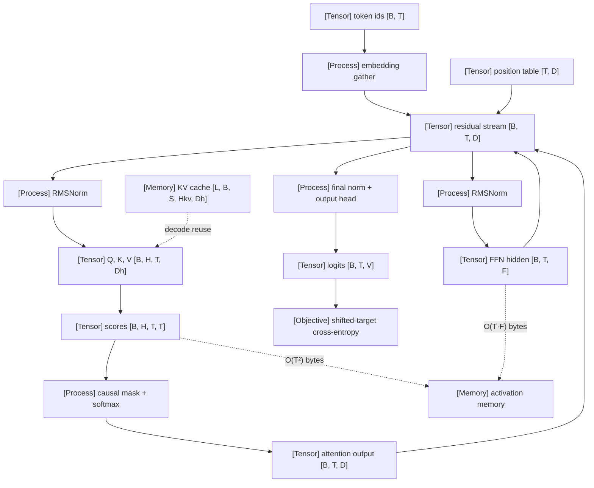

VOLUME I / PART I — SCIENTIFIC FOUNDATIONS / CHAPTER 05

# 05 — A minimal Transformer and its execution trace

A decoder-only Transformer is fully specified by a short list of typed tensors and the operators between them, and every later chapter's cost claim — parameters, FLOPs, activation bytes, cache bytes — must reduce to that list, so the list is what this chapter fixes.

6 sections · 2 spine papers · 2 implementations · prerequisites: 03–04 · artifact: a small reference Transformer with inspectable intermediate tensors · updated 2026-09-20

## Why this chapter exists

What failed before is not the Transformer; it is the way it is usually taught. Block diagrams and the single equation `softmax(QKᵀ/√d)V` convey the idea and hide everything that determines cost: which tensors exist at which shape, which are saved for the backward pass, which are recomputed, and which survive from one decode step to the next. Engineers who learned the architecture from diagrams routinely mis-estimate memory by the size of a materialised `[B, H, T, T]` score matrix, or attribute decode latency to arithmetic when the arithmetic per token is fixed and the bytes per token are what grow with context.

The bottleneck that appeared as models scaled was that architectural decisions — pre-norm versus post-norm, gated versus ungated feed-forward blocks, tied versus untied embeddings — were argued from quality alone while their parameter, FLOP and byte consequences were left implicit. Each of those decisions changes a specific line in the tensor trace, and the change is auditable only if the trace exists.

The dominant constraint this chapter respects is memory traffic rather than arithmetic. The attention score matrix is quadratic in sequence length; the per-token state that must persist across decode steps is linear in it; the weight matrices are neither. Separating these three growth regimes is the chapter's main analytical result, and it is why the incremental-decode verification task — full-sequence versus cached inference — is placed here rather than in the serving volume.

```figure
id: fig-5.1
kind: compare
title: Three growth regimes of the reference trace
caption: >-
  Read down each column. Going from T = 1024 to T = 8192 leaves the weights at
  13.5 MiB per layer, multiplies the linear column by 8 and the score column
  by 64. Every later efficiency intervention in the book can be filed under
  exactly one column, which is why the chapter separates them before costing
  anything. Illustrative configuration, not a named model.
placement: wide
evidence: MATHEMATICALLY-DERIVED
source: ["DERIVED:eq-5.8", "DERIVED:eq-5.21", "DERIVED:eq-5.22"]
alt: >-
  Comparison table with three columns (weights, per-token state, attention
  scores) for one layer of the chapter's illustrative reference configuration,
  not a named model: B = 8, D = 768, H = 12, Dh = 64, F = 3072, BF16. Weights
  are constant in T at (4·D² + 2·D·F)·b = 13.5 MiB per layer. Per-token state
  is linear in T: one [B, T, D] tensor is 12 MiB at T = 1024 and 96 MiB at
  T = 8192, and K plus V are 24 MiB and 192 MiB. At decode the cache grows by
  36 KiB per token across all 12 layers. Scores are quadratic in T:
  B·H·T²·b is 192 MiB at T = 1024 and 12 GiB at T = 8192 per materialised
  copy. The interventions listed are none for weights (not a function of T);
  head sharing, latent caches and paging for state; IO-aware kernels and sparse
  or local masks for scores.
spec:
  axis: >-
    Bytes per layer as sequence length T grows, one block of the illustrative
    reference configuration (B = 8, D = 768, H = 12, Dh = 64, F = 3072, BF16)
  columns:
    - { id: weights, label: "Weights, O(1) in T" }
    - { id: state, label: "Per-token state, O(T)" }
    - { id: scores, label: "Attention scores, O(T²)" }
  rows:
    - { dimension: "tensors", values: { weights: "W_Q, W_K, W_V, W_O, W_1, W_2", state: "residual stream [B, T, D]; K, V [B, H, T, Dh]", scores: "S and P [B, H, T, T]" } }
    - { dimension: "bytes per layer", values: { weights: "(4·D² + 2·D·F)·b", state: "B·T·D·b per [B, T, D]; 2·B·T·D·b for K and V", scores: "B·H·T²·b per copy (Eq. 5.8)" } }
    - { dimension: "at T = 1024", values: { weights: "13.5 MiB", state: "12 MiB per [B, T, D]; K + V 24 MiB", scores: "192 MiB" } }
    - { dimension: "at T = 8192", values: { weights: "13.5 MiB", state: "96 MiB per [B, T, D]; K + V 192 MiB", scores: "12 GiB" } }
    - { dimension: "set by", values: { weights: "D, F (and L, V for the whole model)", state: "B, T, D; K and V by H_kv·Dh", scores: "B, H, T" } }
    - { dimension: "at a decode step", values: { weights: "read in full every step", state: "cache grows 36 KiB per token over 12 layers (Eq. 5.21)", scores: "one query row [B, H, 1, s], linear in s" } }
    - { dimension: "interventions in this book", values: { weights: "none by T (not a function of T)", state: "GQA/MQA §14.1, latent cache §14.2, paging §42.3", scores: "IO-aware kernels §27.1, sparse or local masks §14.3" } }
```

What changed in the solution is the object of study. The model is treated as an execution trace: a sequence of `[B, T, D] → op → [B, T, F]` lines, each with a parameter count, a FLOP count and a byte count attached. Later chapters replace individual lines (attention variants in Chapter 14, positions in Chapter 15, kernels in Chapter 27, cache organisation in Chapter 42) without changing the trace's grammar.

## Concept map



- [Tensor] token ids `[B, T]`
  - [Process] embedding gather → [Tensor] residual stream `[B, T, D]`; [Tensor] position table `[T, D]` is added
- [Tensor] residual stream `[B, T, D]` (persists across all L blocks)
  - [Process] RMSNorm → [Tensor] Q, K, V `[B, H, T, Dh]`
    - [Tensor] scores `[B, H, T, T]` → [Process] causal mask + softmax → [Tensor] attention output `[B, T, D]` → back into the residual stream
  - [Process] RMSNorm → [Tensor] FFN hidden `[B, T, F]` → back into the residual stream
  - [Process] final norm + output head → [Tensor] logits `[B, T, V]` → [Objective] shifted-target cross-entropy
- [Memory] KV cache `[L, B, S, Hkv, Dh]` feeds Q, K, V at decode time (definition owned by §42.2)
- [Memory] activation memory receives the `O(T²)` score bytes and the `O(T·F)` FFN bytes

## Position in the book

| Relation | Links |
|---|---|
| Prerequisites | [Chapter 03 — Numerical computation](../ch03-numerical-computation-and-trustworthy-training/README.md) (stable softmax, autodiff, mixed precision); [Chapter 04 — Language modeling objectives](../ch04-language-modeling-and-learning-objectives/README.md) (autoregressive factorisation, teacher forcing) |
| Siblings (same part) | [01](../ch01-foundation-model-lifecycle/README.md) · [02](../ch02-mathematical-and-statistical-foundations/README.md) · [03](../ch03-numerical-computation-and-trustworthy-training/README.md) · [04](../ch04-language-modeling-and-learning-objectives/README.md) · [06](../ch06-experimental-design-and-evaluation-before-optimization/README.md) |
| Downstream | [Chapter 13 — Dense design](../../part-03-model-architectures-and-state/ch13-dense-transformer-design-and-parameter-allocation/README.md); [Chapter 14 — Attention architectures](../../part-03-model-architectures-and-state/ch14-attention-architectures-and-cache-representations/README.md); [Chapter 19 — Training loop](../../part-04-training-science-and-adaptation/ch19-pretraining-objectives-and-the-full-training-loop/README.md); [Chapter 25 — Accelerators](../../../vol-02-execution-and-optimization/part-05-hardware-kernels-and-distributed-execution/ch25-accelerators-memory-hierarchy-and-performance-models/README.md); [Chapter 26 — Kernels](../../../vol-02-execution-and-optimization/part-05-hardware-kernels-and-distributed-execution/ch26-kernel-programming-and-numerical-equivalence/README.md); [Chapter 27 — Attention kernels](../../../vol-02-execution-and-optimization/part-05-hardware-kernels-and-distributed-execution/ch27-attention-latent-attention-and-expert-kernels/README.md); [Chapter 42 — KV state](../../../vol-02-execution-and-optimization/part-07-inference-algorithms-distillation-and-compression/ch42-prefill-decode-kv-state-and-inference-resource-models/README.md); [Chapter 64 — Mechanistic analysis](../../../vol-03-grounded-and-interactive-intelligence/part-11-evaluation-interpretability-and-deployment-assurance/ch64-mechanistic-interpretability-and-causal-model-analysis/README.md) |
| Trades off with | [§13.3 Feed-forward alternatives](../../part-03-model-architectures-and-state/ch13-dense-transformer-design-and-parameter-allocation/13-3-feed-forward-alternatives.md) (gated width vs. matrix count); [§14.1 MHA, MQA, GQA](../../part-03-model-architectures-and-state/ch14-attention-architectures-and-cache-representations/14-1-mha-mqa-and-gqa.md) (cache bytes vs. head sharing); [§42.4 Cache reduction](../../../vol-02-execution-and-optimization/part-07-inference-algorithms-distillation-and-compression/ch42-prefill-decode-kv-state-and-inference-resource-models/42-4-cache-reduction.md) (recompute vs. store) |

## Sections

| § | Title | What changes here | Primary evidence labels |
|---|---|---|---|
| [5.1](05-1-end-to-end-forward-pass.md) | End-to-end forward pass | The model becomes a typed tensor trace from `[B, T]` ids to `[B, T, V]` logits | MATHEMATICALLY-DERIVED, PAPER-REPORTED |
| [5.2](05-2-attention-calculation.md) | Attention calculation | A `[B, H, T, T]` score matrix appears and its bytes, not its FLOPs, become the constraint | MATHEMATICALLY-DERIVED, PAPER-REPORTED |
| [5.3](05-3-feed-forward-computation.md) | Feed-forward computation | The per-token cost is dominated by two (or three) dense matrices whose width is a free design input | MATHEMATICALLY-DERIVED, PAPER-REPORTED |
| [5.4](05-4-residual-organization.md) | Residual organization | Normalisation placement decides the variance of the residual stream at initialisation | PAPER-REPORTED, MATHEMATICALLY-DERIVED |
| [5.5](05-5-training-and-generation.md) | Training and generation | Prefill and cached decode compute the same function with different tensors alive | MATHEMATICALLY-DERIVED, OFFICIAL-DOCUMENTATION |
| [5.6](05-6-reference-accounting.md) | Reference accounting | Parameters, FLOPs and bytes are tabulated for one concrete configuration | MATHEMATICALLY-DERIVED, ASSUMED |

## Artifact

A small reference Transformer with inspectable intermediate tensors, delivered as:

- `reference_transformer.py` — decoder-only, pre-norm, RMSNorm, learned absolute positions (RoPE is a forward link), GELU feed-forward with a SwiGLU switch, untied head by default with a tie switch; every sub-module returns its intermediate tensors in a dictionary keyed by the trace line names of §5.1 (reference-level; written against the PyTorch 2.14.0 documented API, accessed 2026-09-20; not executed for this edition, so its numerics are UNVERIFIED).
- `trace.md` — the tensor trace of §5.1 with shapes, dtypes and byte counts for the concrete configuration of §5.6.
- `accounting.csv` — the parameter-by-component table and the per-token FLOP table of §5.6, one row per component with fields `component, tensor, shape, params, flops_per_token_forward, bytes_bf16`.
- `equivalence_report.json` — the output of the verification protocol: per-position maximum absolute and relative logit differences between full-sequence and cached inference, with dtype and tolerance fields.

Field lists are in [verification.md](verification.md).

## Verification

The falsifiable task is that full-sequence inference over a prompt of S tokens and incremental cached inference that consumes the same prompt one token at a time must produce logits that agree at every position within a tolerance derived from the storage dtype and accumulation dtype. Disagreement localised to positions ≥ 1 with the first position correct indicates a mask or cache-indexing error; disagreement that grows linearly with position indicates a position-offset error; disagreement bounded by the BF16 unit roundoff times an accumulation-length factor is the expected numerical noise. The protocol, tolerances and rejection conditions are in [verification.md](verification.md).

## Lineage

- 2017 · Attention Is All You Need (P01) · conceptual ancestor — the encoder–decoder, post-norm, ReLU-FFN reference; this chapter's decoder-only block is a restriction of it.
- 2019 · Fast Transformer Decoding: One Write-Head is All You Need (R5.6) · engineering optimization — the incremental-decoding memory analysis that motivates the cached-decode trace.
- 2019 · Language Models are Unsupervised Multitask Learners (R5.2) · engineering optimization — pre-norm ordering and residual-branch initialisation scaling.
- 2019 · Root Mean Square Layer Normalization (R5.3) · engineering optimization — drops the mean subtraction of LayerNorm.
- 2020 · On Layer Normalization in the Transformer Architecture (R5.4) · engineering optimization — gradient-at-initialisation analysis of post-norm versus pre-norm.
- 2020 · GLU Variants Improve Transformer (R5.5) · alternative branch — three-matrix gated feed-forward at matched parameter count.
- 2021 · RoFormer (R5.7) · alternative branch — rotary positions; developed in §15.1, not here.
- 2022 · FlashAttention (P19) · engineering optimization — exact attention without a materialised score matrix; developed in §27.1.
- 2023 · LLaMA (R5.8) · current frontier — the pre-norm / RMSNorm / SwiGLU / RoPE decoder block that the reference model follows, except for positions.

```figure
id: fig-5.2
kind: lineage
title: Lineage of the reference decoder block
caption: >-
  Five of the nine entries change or analyse a single line of the §5.1 trace
  (norm placement, norm form, FFN form, positions); two change what is kept
  in memory rather than what is computed (the cached-decode analysis and the
  non-materialising kernel). The 2023 entry combines the single-line changes;
  only the 2017 ancestor defines the whole trace.
placement: inline
evidence: PAPER-REPORTED
source: [P01, R5.6, R5.2, R5.3, R5.4, R5.5, R5.7, P19, R5.8]
alt: >-
  Timeline of nine works from the chapter's Lineage list. 2017, Attention Is
  All You Need (P01), conceptual ancestor. 2019, Fast Transformer Decoding
  (R5.6), engineering optimization, the incremental-decoding memory analysis.
  2019, Language Models are Unsupervised Multitask Learners (R5.2),
  engineering optimization, pre-norm ordering and residual initialisation
  scaling. 2019, Root Mean Square Layer Normalization (R5.3), engineering
  optimization. 2020, On Layer Normalization in the Transformer Architecture
  (R5.4), engineering optimization. 2020, GLU Variants Improve Transformer
  (R5.5), alternative branch. 2021, RoFormer (R5.7), alternative branch.
  2022, FlashAttention (P19), engineering optimization. 2023, LLaMA (R5.8),
  current frontier.
spec:
  entries:
    - { year: 2017, work: "Attention Is All You Need", cite: P01, relation: "conceptual ancestor", node: ms.section.5.1, note: "encoder–decoder, post-norm, ReLU-FFN reference; the decoder-only block is a restriction of it" }
    - { year: 2019, work: "Fast Transformer Decoding: One Write-Head is All You Need", cite: R5.6, relation: "engineering optimization", node: ms.section.5.5, note: "incremental-decoding memory analysis behind the cached-decode trace" }
    - { year: 2019, work: "Language Models are Unsupervised Multitask Learners", cite: R5.2, relation: "engineering optimization", node: ms.section.5.4, note: "pre-norm ordering and residual-branch initialisation scaling" }
    - { year: 2019, work: "Root Mean Square Layer Normalization", cite: R5.3, relation: "engineering optimization", node: ms.section.5.4, note: "drops the mean subtraction of LayerNorm" }
    - { year: 2020, work: "On Layer Normalization in the Transformer Architecture", cite: R5.4, relation: "engineering optimization", node: ms.section.5.4, note: "gradient-at-initialisation analysis of post-norm versus pre-norm" }
    - { year: 2020, work: "GLU Variants Improve Transformer", cite: R5.5, relation: "alternative branch", node: ms.section.5.3, note: "three-matrix gated feed-forward at matched parameter count" }
    - { year: 2021, work: "RoFormer", cite: R5.7, relation: "alternative branch", node: ms.section.15.1, note: "rotary positions; developed in §15.1, not here" }
    - { year: 2022, work: "FlashAttention", cite: P19, relation: "engineering optimization", node: ms.section.27.1, note: "exact attention without a materialised score matrix; developed in §27.1" }
    - { year: 2023, work: "LLaMA", cite: R5.8, relation: "current frontier", note: "pre-norm, RMSNorm, SwiGLU and RoPE block the reference model follows, except for positions" }
```

## Terms owned here

| Term | One-line definition | Section |
|---|---|---|
| residual stream | The `[B, T, D]` tensor that every block reads from and adds to, carried unchanged in shape from embedding to final norm. | 5.1 |
| tensor trace | The ordered list of `shape → op → shape` lines, with dtype and byte counts, that fully specifies a forward pass. | 5.1 |
| scaled dot-product attention | `softmax(QKᵀ/√d_h + M)V` computed per head with an additive mask M. | 5.2 |
| attention score matrix | The `[B, H, T, T]` pre-softmax tensor `QKᵀ/√d_h`; the chapter's only O(T²) object. | 5.2 |
| multi-head attention (reference form) | H_q = H_kv = H independent scaled dot-product attentions whose outputs are concatenated and projected by W_O; head-sharing variants are owned by §14.1. | 5.2 |
| position-wise feed-forward block | The per-token map `W_2 · act(W_1 x)` (or its gated form) applied identically at every position. | 5.3 |
| pre-norm block / post-norm block | Block orderings `x + f(norm(x))` and `norm(x + f(x))` respectively. | 5.4 |
| shifted targets | The target sequence `x_{2:T+1}` aligned so that the logits at position t predict token t+1. | 5.5 |
| prompt prefill | The single full-sequence forward pass over a prompt that populates per-layer K and V for later reuse. | 5.5 |
| cached decode step | A forward pass over one new token whose attention reads stored K and V for all earlier positions. | 5.5 |
| 2N-per-token rule | The approximation that a dense forward pass costs 2N FLOPs per token from weight matmuls, excluding the attention score term. | 5.6 |

## Reference-stack coverage

Rows bind the chapter to `Instruction/AI_REFERENCE_STACK.md`. "Surface used" is the URL exactly as the reference stack lists it; where the primary text was opened through arXiv instead of the lab's own surface, the row says so. Dates and the exact pages opened are in [references.md](references.md).

| Stack section | Entry | Stack layer | What this chapter takes from it | Surface used | Sections | Evidence label |
|---|---|---|---|---|---|---|
| §1 lab | #18 Google Research | — | P01 (attention equation, √d_k footnote, FFN, post-norm, base hyperparameters, tied embeddings); R5.5 GLU variants (2/3·d_ff parameter matching); R5.6 incremental-decoding bandwidth motivation; R5.9 PaLM (three-matrix SwiGLU, parallel block, no biases). Texts opened via arXiv, not via the lab index. | Papers: https://research.google/pubs/ | 5.1–5.5 | PAPER-REPORTED |
| §1 lab | #4 Meta AI / FAIR | — | R5.8 LLaMA §2.2 and §2.4: pre-normalisation with RMSNorm, SwiGLU at 2/3·4d, RoPE, causal attention that does not store attention weights. Text opened via arXiv. | Papers: https://ai.meta.com/results/?content_types%5B0%5D=publication | 5.1, 5.3, 5.4, 5.5 | PAPER-REPORTED |
| §1 lab | #2 OpenAI | — | R5.2 GPT-2 report §2.3 (norm moved to sub-block input, final norm, 1/√N residual initialisation, Table 2 sizes); P08 §2.1 and Table 1 (non-embedding N, `2N + 2·n_layer·n_ctx·d_attn`, `C ≈ 6N`). | Papers: https://openai.com/research/index/publication/ | 5.4, 5.6 | PAPER-REPORTED |
| §1 lab | #13 Microsoft Research / Microsoft AI | — | R5.10 DeepNet abstract: residual-connection modification with derived initialisation, used only as a sibling differential. Text opened via arXiv. | Papers: https://www.microsoft.com/research/publications/ | 5.4 | PAPER-REPORTED |
| §2 conference | #1 NeurIPS | — | Archival venue of P01 (2017), R5.3 (2019) and P19 (2022); the archival versions were not separately opened — quotations are from arXiv renderings. | Papers: https://proceedings.neurips.cc/ | 5.1, 5.2, 5.4 | PAPER-REPORTED |
| §2 conference | #2 ICML | — | Archival venue of R5.4 (ICML 2020), the post-LN / pre-LN gradient analysis. | Papers: https://proceedings.mlr.press/ | 5.4 | PAPER-REPORTED |
| §3 discovery source | #1 arXiv | — | Primary route actually used for every paper in `references.md` (abstract pages, the v7 HTML of P01, and PDFs with local text extraction). | Home: https://arxiv.org/ · Search/API: https://arxiv.org/search/advanced | 5.1–5.6 | PAPER-REPORTED |
| §3 discovery source | #4 NeurIPS Proceedings | — | Route for resolving the archival P01 and P19 versions (Source route, query 1); not opened in this edition. | Home: https://proceedings.neurips.cc/ | 5.1, 5.2 | UNVERIFIED |
| §3 discovery source | #2 OpenReview | — | Route for checking reviewed versions of R5.4 and later pre-norm analyses (Source route, query 2); not opened in this edition. | Home: https://openreview.net/ | 5.4 | UNVERIFIED |
| §3 discovery source | #7 Semantic Scholar | — | Citation-graph route for the pre-"KV cache" lineage of incremental decoding (Source route, query 6); not opened in this edition. | Search/API: https://api.semanticscholar.org/api-docs/ | 5.5 | UNVERIFIED |
| §4 system | #17 PyTorch | Model / autograd framework | The reference implementation's API surface: `scaled_dot_product_attention` signature, three fused implementations plus fallback, `attn_mask`/`is_causal` exclusivity (R5.13); `torch.nn.RMSNorm` formula and ε default (R5.14). The stack's URL redirects to `docs.pytorch.org`; the 2.14 pages were the ones opened. | docs/code: https://pytorch.org/docs/stable/ | 5.1–5.6, verification | OFFICIAL-DOCUMENTATION |
| §4 system | #39 FlashAttention | Kernels / numerics / collectives | fp16/bf16 support, head dimension ≤ 256, bottom-right causal alignment, `flash_attn_with_kvcache` (R5.15); the algorithm itself is only a forward pointer to §27.1. | docs/code: https://github.com/Dao-AILab/flash-attention | 5.2, 5.5 | OFFICIAL-DOCUMENTATION |
| §4 system | #2 NVIDIA cuBLAS / cuBLASLt | Kernels / numerics / collectives | The GEMM primitive to which every `Linear` line of the trace lowers on NVIDIA hardware; cuBLASLt documented as a library dedicated to GEMM with programmable layouts, types and epilogues (R5.18, cuBLAS 13.4 docs). | docs/code: https://docs.nvidia.com/cuda/cublas/ | 5.1, 5.3 | OFFICIAL-DOCUMENTATION |
| §4 system | #41 vLLM | Inference engine | Forward pointer only: the contiguous cache of Algorithm 5.6 is what an engine replaces by paged blocks; the landing page lists PagedAttention KV management, continuous batching, chunked prefill and prefix caching (R5.17). Mechanism owned by §42.3 and §43.2. | docs/code: https://docs.vllm.ai/ | 5.1, 5.5 | OFFICIAL-DOCUMENTATION |
| §4 system | #26 Hugging Face Transformers | Model definition / adaptation | Documented role as the model-definition layer shared by trainers and inference engines (R5.19); named as the place where the block conventions of §5.1–§5.4 appear as per-model definitions. No claim in the chapter rests on its code. | docs/code: https://huggingface.co/docs/transformers/ | chapter page only; not cited inside a section | OFFICIAL-DOCUMENTATION |
| §4 system | #40 Liger Kernel | Kernels / numerics / collectives | Named as an example source of fused SwiGLU and add-norm kernels; which fusions apply per dtype and release is carried as NOT-DISCLOSED. | docs/code: https://github.com/linkedin/Liger-Kernel | 5.3, 5.4 | NOT-DISCLOSED |
| §4 system | #7 NVIDIA Transformer Engine | Kernels / numerics / collectives | Named as an example source of fused norm and MLP layers; no property asserted. | docs/code: https://docs.nvidia.com/deeplearning/transformer-engine/ | 5.3, 5.4 | NOT-DISCLOSED |
| *Outside the reference stack (routed via book_plan.md anchors)* | Stanford CS336, Spring 2026 (course page, Assignment 1 handout v26.0.3 and repository; R5.11, R5.12, R5.16) | — | Pre-norm block with final norm, bias-free linears, SwiGLU at 8/3·d_model rounded to 64, initialisation rule, the `2mnp` FLOPs rule and the accounting exercise. Justified by the plan's Chapter 05 source anchor "CS336 assignments" and by Appendix G. | https://cs336.stanford.edu/ | 5.3, 5.4, 5.6, verification | OFFICIAL-DOCUMENTATION |

**Inspection dimensions applied.** Of the §4.2 dimensions, this chapter analyses *Precision* (BF16 versus FP32 storage and accumulation for the residual stream, softmax, log-softmax and the cache: §5.1, §5.4, §5.5, verification §3), *Memory* (activation bytes per trace line, the O(T²) score tensor, cache bytes per token, weights: §5.2, §5.3, §5.5, §5.6), *Kernels* (GEMM, fused attention, fused MLP/norm as named lowering targets, never as measured results: §5.1–§5.4), *Inference* (prefill, cached decode, cache as state; paged and prefix caches only as forward pointers: §5.5), *Metrics* (FLOPs per token and the regime of the 2N / 6N rule that MFU calculations later depend on: §5.6) and *Reproducibility* (pinned documentation version, configuration record, fixture, tolerance-based equivalence: every section's Reproducibility heading and `verification.md`). *Parallelism* and *Communication* appear only as forward links to Chapter 29; *Checkpointing* only as activation recomputation in the FLOP and byte accounting (§5.5, §5.6); *Post-training* and *Reliability* are not analysed here.

## Source route

1. Paper cascade (§3.1 of the reference stack): `"Attention Is All You Need" (NeurIPS OR ICML OR ICLR OR ACL OR CVPR OR EMNLP OR ICCV OR ECCV OR AAAI OR IJCAI)` → resolve the archival NeurIPS 2017 version at `proceedings.neurips.cc`, then the arXiv revision history for equation numbering.
2. arXiv advanced query (§3.2): `cat:cs.LG AND ti:"layer normalization" AND abs:"transformer"` → pre-norm versus post-norm analyses; check OpenReview for the ICML 2020 version of R5.4.
3. Training-stack search protocol (§4.3): `site:github.com "FlashAttention" (architecture OR design OR RFC OR benchmark)` → the official Dao-AILab repository for the causal-mask and dtype constraints that §27 develops.
4. Lab-level protocol (§1.1): `site:arxiv.org/abs "Google" "GLU variants"` and `site:arxiv.org/abs "Meta AI" "LLaMA"` → the gated-FFN and pre-norm/RMSNorm block references.
5. Curriculum anchor (Appendix G): the Spring 2026 course page at https://cs336.stanford.edu/ lists "Assignment 1: Basics" (repository `github.com/stanford-cs336/assignment1-basics`, handout `cs336_assignment1_basics.pdf`, Version 26.0.3) as the assignment that builds a Transformer language model from scratch (OFFICIAL-DOCUMENTATION, R5.11–R5.12, accessed 2026-09-20); use the Spring 2025 archive for the earlier pinned handout.
6. Semantic Scholar API (§3.2): `query=incremental decoding transformer key value cache&fields=title,year,authors,venue,url` → the lineage of cached decoding before it was named "KV cache".

## Status

Editorial status: `manuscript_draft`. Evidence coverage: all mechanism claims are MATHEMATICALLY-DERIVED from stated shapes or PAPER-REPORTED / OFFICIAL-DOCUMENTATION from sources opened on 2026-09-20 (P01, P08, P19, R5.1–R5.16; see `references.md`); no measurement in this chapter is the book's own.

NOT-DISCLOSED / UNVERIFIED items carried by this chapter:

- The reference implementation targets the PyTorch 2.14.0 documented API (R5.13, R5.14) but has not been executed for this edition; its numerics, the attention backend dispatched for the reference shapes, and the built-in RMSNorm's internal up-cast behaviour for BF16 inputs are UNVERIFIED.
- The exact numerical tolerance at which cached and full-sequence inference agree on a specific accelerator is UNVERIFIED until the protocol in `verification.md` is executed; the thresholds there are ASSUMED from dtype arithmetic.
- Whether a given production model uses biases, a packed QKV layout, a non-default attention scale, a particular ε, or residual-branch initialisation scaling is NOT-DISCLOSED unless its report says so; the reference model omits biases following PaLM (R5.9) and the CS336 handout (R5.11) as an ASSUMED design input.
- Which fused GEMM-epilogue, SwiGLU or add-norm kernels apply to a given dtype and release is NOT-DISCLOSED here rather than inferred.
- Runtime workspace and allocator overheads on top of the §5.6 byte tables are NOT-DISCLOSED for any runtime until measured.
