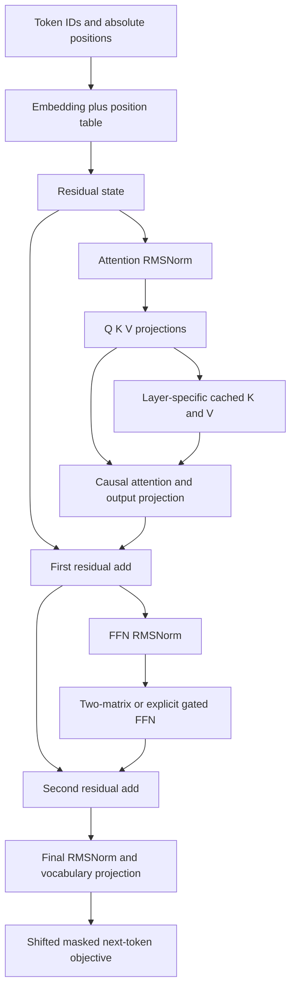

# 05 - A minimal Transformer and its execution trace

A Transformer specification must identify its function, parameter sharing, positions, visibility, numerical operators, and execution state. Shape compatibility alone leaves many different models possible. This chapter specifies a sequential pre-RMSNorm decoder with learned absolute positions and a two-matrix GELU FFN, then derives its attention, derivatives, incremental-cache invariant, and component resources. Its SwiGLU comparison changes the branch explicitly rather than treating activation names as interchangeable.

The analytical reference is not a reconstruction of a named production model. The original Transformer, GPT-2, LLaMA, and PaLM have distinct complete configurations. Their papers supply method definitions, source-reported protocols, and bounded comparisons; they do not supply measured quality or latency for the chapter's mixed reference. Exact mathematical consequences are distinguished from reported experiments and unexecuted verification proposals throughout.

## Why this chapter exists

Parameter count does not determine compute, peak memory, or latency. A tied vocabulary allocation is stored once but still used by the output projection. Learned positions consume storage without a dense matrix multiply. Full-attention pair arithmetic grows quadratically in sequence length, while KV storage grows linearly in consumed tokens. A fused exact-attention implementation can avoid materializing pairwise intermediates without removing quadratic arithmetic. These differences follow from specific operators and lifetimes, not a single model-size constant. (MATHEMATICALLY-DERIVED; P08 section 2.1; P19 section 3.)

The chapter therefore treats logical tensor traces, saved allocation schedules, and runtime traffic as related but distinct objects. Source reports establish historical designs and implementation results under their own protocols. The verification page states what would be needed to validate an actual implementation, without presenting a proposed listing as an executed artifact.

```figure
id: fig-5.1
kind: compare
title: Three growth regimes of the reference trace
caption: >-
  Projection weights are constant in T, residual/KV allocations linear,
  and materialized full-attention pairs quadratic. Interventions can affect
  several terms at once; this is an analytical comparison, not a taxonomy
  of mutually exclusive optimizations. T=8192 exceeds the reference
  position table and is only an allocation sensitivity calculation.
placement: wide
evidence: MATHEMATICALLY-DERIVED
source: ["DERIVED:eq-5.8", "DERIVED:eq-5.21", "DERIVED:eq-5.22"]
alt: >-
  Comparison table with three columns (weights, per-token state, attention
  scores) for one layer of the chapter's illustrative reference configuration,
  not a named model: B = 8, D = 768, H = 12, Dh = 64, F = 3072, BF16. Weights
  are constant in T at (4·D² + 2·D·F)·b = 13.5 MiB per layer. Per-token state
  is linear in T: one [B, T, D] tensor is 12 MiB at T = 1024 and 96 MiB at
  T = 8192, and K plus V are 24 MiB and 192 MiB. At decode the cache grows by
  36 KiB per token across all 12 layers. Scores are quadratic in T:
  B·H·T²·b is 192 MiB at T = 1024 and 12 GiB at T = 8192 per materialised
  copy. The interventions listed are none for weights (not a function of T);
  head sharing, latent caches and paging for state; IO-aware kernels and sparse
  or local masks for scores.
spec:
  axis: >-
    Bytes per layer as sequence length T grows, one block of the illustrative
    reference configuration (B = 8, D = 768, H = 12, Dh = 64, F = 3072, BF16)
  columns:
    - { id: weights, label: "Weights, O(1) in T" }
    - { id: state, label: "Per-token state, O(T)" }
    - { id: scores, label: "Attention scores, O(T²)" }
  rows:
    - { dimension: "tensors", values: { weights: "W_Q, W_K, W_V, W_O, W_1, W_2", state: "residual stream [B, T, D]; K, V [B, H, T, Dh]", scores: "S and P [B, H, T, T]" } }
    - { dimension: "bytes per layer", values: { weights: "(4·D² + 2·D·F)·b", state: "B·T·D·b per [B, T, D]; 2·B·T·D·b for K and V", scores: "B·H·T²·b per copy (Eq. 5.8)" } }
    - { dimension: "at T = 1024", values: { weights: "13.5 MiB", state: "12 MiB per [B, T, D]; K + V 24 MiB", scores: "192 MiB" } }
    - { dimension: "at T = 8192", values: { weights: "13.5 MiB", state: "96 MiB per [B, T, D]; K + V 192 MiB", scores: "12 GiB" } }
    - { dimension: "set by", values: { weights: "D, F (and L, V for the whole model)", state: "B, T, D; K and V by H_kv·Dh", scores: "B, H, T" } }
    - { dimension: "at a decode step", values: { weights: "dense matrix/cache read model must declare reuse", state: "cache grows 36 KiB per token over 12 layers (Eq. 5.21)", scores: "one query row [B, H, 1, s], linear in s" } }
    - { dimension: "interventions in this book", values: { weights: "quantization,sharding,offload change storage/traffic", state: "GQA/MQA §14.1, latent cache §14.2, paging §42.3", scores: "IO-aware kernels §27.1, sparse or local masks §14.3" } }
```

## Concept map


```mermaid
flowchart TD
    X[Token IDs and absolute positions] --> E[Embedding plus position table]
    E --> H[Residual state]
    H --> N1[Attention RMSNorm]
    N1 --> Q[Q K V projections]
    Q --> A[Causal attention and output projection]
    H --> ADD1[First residual add]
    A --> ADD1
    ADD1 --> N2[FFN RMSNorm]
    N2 --> F[Two-matrix or explicit gated FFN]
    ADD1 --> ADD2[Second residual add]
    F --> ADD2
    ADD2 --> FINAL[Final RMSNorm and vocabulary projection]
    FINAL --> LOSS[Shifted masked next-token objective]
    Q --> CACHE[Layer-specific cached K and V]
    CACHE --> A
```

- [Tensor] Token IDs and absolute positions produce an embedding-plus-position residual state.
  - [Process] Attention RMSNorm and Q/K/V projections feed causal attention and its output projection.
    - [Memory] Per-layer keys and values persist in the cache for permitted incremental reuse.
  - [Process] The first residual add feeds FFN RMSNorm and the specified dense or gated branch.
  - [Process] The second residual add passes the updated state to the next block or final normalization.
    - [Tensor] The vocabulary head produces logits for the declared rows.
    - [Objective] Shifted masked targets define the next-token loss.

The cache contains keys and values, not query vectors. Its valid length counts consumed positions. Full and incremental execution agree in real arithmetic only when parameters, positions, conditioning, visibility, and deterministic row-local operators remain the same. The proof and exceptions are in 5.5; numerical verification remains separate.

## Sections

| Section | Detailed treatment |
|---|---|
| [5.1 End-to-end forward pass](05-1-end-to-end-forward-pass.md) | Complete embedding-to-head specification; independent layer parameters; trace shapes; sharing, positions, and implementation identity |
| [5.2 Attention calculation](05-2-attention-calculation.md) | Allowed-key sets, stable softmax, derivatives, dense/causal arithmetic, score bytes, fully masked rows, API mask alignment, and exact tiled execution |
| [5.3 Feed-forward computation](05-3-feed-forward-computation.md) | GELU/SiLU derivatives, gated backward paths, matched projection counts, width rounding, saving policies, and source T5/C4 observations |
| [5.4 Residual organization](05-4-residual-organization.md) | Norm Jacobians, covariance expansion, finite epsilon, initialization theorem premises, branch scaling, and precision failure mechanisms |
| [5.5 Training and generation](05-5-training-and-generation.md) | Shifted objective, gradient paths, cache equivalence induction, prefill head rows, consumed/sample boundaries, and invalidation conditions |
| [5.6 Reference accounting](05-6-reference-accounting.md) | Exact parameters, leading arithmetic, live-allocation inventory, state dtypes, matrix/cache read model, and limits of extrapolated counts |

## Position in the book

Chapters 03-04 supply numerical differentiation, stable probability calculations, and objective/target conventions. Chapters 13-18 change the architecture and therefore require new traces. Chapters 25-30 analyze hardware, kernels, distributed state, and training execution. Chapter 42 develops serving-level cache allocation and capacity beyond this single-model account. Those links are destinations in the book plan; their presence does not imply every linked manuscript is already written.

## Artifact and verification

[verification.md](verification.md) contains a topic/obligation matrix and three unexecuted implementation protocols: full-versus-cached evaluation, attention/FFN differentiation, and allocation/operation accounting. It records actual standard-library analytical checks separately, including4096 causal-pair lengths,8256 generation-boundary cases, and 64 vectors for both norm Jacobians. No model, checkpoint, accelerator benchmark, or executed numerical-equivalence report is claimed.

A faithful future reference must record the complete configuration, parameter/alias identities, positions, masks, normalization epsilon, activation formula, dtypes, repository revision, backend, and device. A source-compatible API name by itself is insufficient. Error thresholds require workload-specific numerical reasoning; dtype precision is not a universal full-model tolerance.

## Lineage and evidence

```figure
id: fig-5.2
kind: lineage
title: Lineage of the reference decoder block
caption: >-
  The sources specify distinct architectures, normalization/FFN/position
  methods, and exact-attention executions. This chapter composes an explicit
  analytical reference; it does not identify that mixed configuration with
  any one paper. Architecture adoption is separate from controlled ablation
  and implementation performance evidence.
placement: inline
evidence: PAPER-REPORTED
source: [P01, R5.6, R5.2, R5.3, R5.4, R5.5, R5.7, P19, R5.8]
alt: >-
  Timeline of nine works from the chapter's Lineage list. 2017, Attention Is
  All You Need (P01), conceptual ancestor. 2019, Fast Transformer Decoding
  (R5.6), engineering optimization, the incremental-decoding memory analysis.
  2019, Language Models are Unsupervised Multitask Learners (R5.2),
  engineering optimization, pre-norm ordering and residual initialisation
  scaling. 2019, Root Mean Square Layer Normalization (R5.3), engineering
  optimization. 2020, On Layer Normalization in the Transformer Architecture
  (R5.4), engineering optimization. 2020, GLU Variants Improve Transformer
  (R5.5), alternative branch. 2021, RoFormer (R5.7), alternative branch.
  2022, FlashAttention (P19), engineering optimization. 2023, LLaMA (R5.8),
  alternative branch.
spec:
  entries:
    - { year: 2017, work: "Attention Is All You Need", cite: P01, relation: "conceptual ancestor", node: ms.section.5.1, note: "encoder–decoder, post-norm, ReLU-FFN reference; the decoder-only block is a restriction of it" }
    - { year: 2019, work: "Fast Transformer Decoding: One Write-Head is All You Need", cite: R5.6, relation: "engineering optimization", node: ms.section.5.5, note: "incremental-decoding memory analysis behind the cached-decode trace" }
    - { year: 2019, work: "Language Models are Unsupervised Multitask Learners", cite: R5.2, relation: "engineering optimization", node: ms.section.5.4, note: "pre-norm ordering and residual-branch initialisation scaling" }
    - { year: 2019, work: "Root Mean Square Layer Normalization", cite: R5.3, relation: "engineering optimization", node: ms.section.5.4, note: "drops the mean subtraction of LayerNorm" }
    - { year: 2020, work: "On Layer Normalization in the Transformer Architecture", cite: R5.4, relation: "engineering optimization", node: ms.section.5.4, note: "gradient-at-initialisation analysis of post-norm versus pre-norm" }
    - { year: 2020, work: "GLU Variants Improve Transformer", cite: R5.5, relation: "alternative branch", node: ms.section.5.3, note: "three-matrix gated feed-forward at matched parameter count" }
    - { year: 2021, work: "RoFormer", cite: R5.7, relation: "alternative branch", node: ms.section.15.1, note: "rotary positions; developed in §15.1, not here" }
    - { year: 2022, work: "FlashAttention", cite: P19, relation: "engineering optimization", node: ms.section.27.1, note: "exact attention without a materialised score matrix; developed in §27.1" }
    - { year: 2023, work: "LLaMA", cite: R5.8, relation: "alternative branch", note: "documents pre-RMSNorm,SwiGLU,and RoPE;reference GELU and learned positions differ" }
```

P01 defines the encoder-decoder attention/FFN architecture and reports component variations. GPT-2 documents pre-LayerNorm, a final norm, and depth-aware initialization. RMSNorm, Xiong's normalization analysis, and GLU variants supply distinct method/theory evidence. LLaMA and PaLM document later combinations; their adoption records are not factorial ablations of this reference. FlashAttention changes exact-attention execution and memory traffic. The inspected Stanford CS336 handout provides an official construction/accounting exercise, including explicit initialization and width-rounding conventions.

## Reference-stack coverage

| Source role | Inspected primary surfaces | Use and boundary |
|---|---|---|
| Architecture and objectives | P01; R5.2 GPT-2; R5.8 LLaMA; R5.9 PaLM | Equations, architecture declarations, source protocols; different complete models |
| FFN and normalization | R5.1 GELU; R5.3 RMSNorm; R5.4 Xiong; R5.5 GLU; R5.10 DeepNet | Formal methods and source experiments; theorem premises and joint-design limits retained |
| Arithmetic, cache, and IO | P08; P19; R5.6 incremental decoding | Source accounting convention, exact attention, shared-KV analysis; no reference latency measurement |
| Official learning artifact | R5.11 handout Version 26.0.3; R5.12 course; R5.16 repository | Handout methods/accounting inspected; no assignment tests executed |
| Versioned operator contracts | R5.13 SDPA; R5.14 RMSNorm; R5.20 lower-right causal bias | PyTorch 2.14 documented behavior; dispatch and installed-runtime behavior unverified |
| Position-method lineage | R5.7 RoFormer | Method pointer to Chapter 15; no reference long-context quality claim |

The full reference ledger records exact inspected versions/surfaces and dates. Mutable repository and documentation roots are not commit-pinned implementation evidence. Historical vLLM, cuBLAS, and Transformers landing-page entries are retained as UNVERIFIED source routes and do not support mechanism or version claims in this revision.

## Evidence limitations

The six section manuscripts and their figure captions have been revised as technical exposition. They remain drafts because independent implementation reproduction, immutable live-source pinning, trained-reference quality, backend dispatch, and accelerator profiling are unfinished. The configuration's learned position table ends at 1024; plots beyond that length are explicitly mathematical sensitivity calculations requiring a changed positional specification before execution. Nothing in the source reports establishes proprietary or undisclosed internals by assumption.
