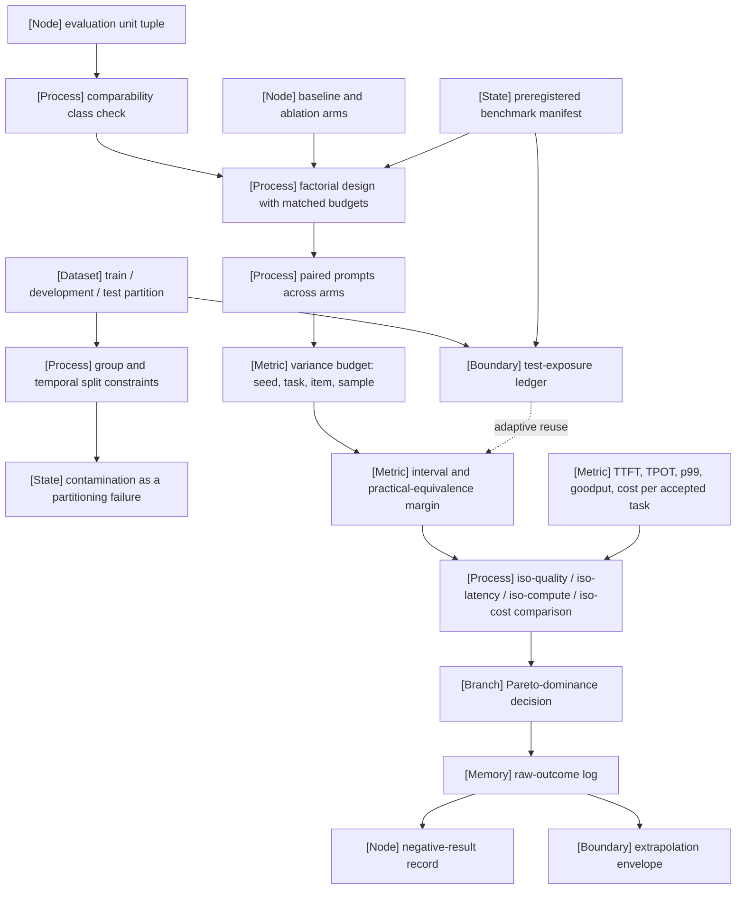

VOLUME I / PART I — SCIENTIFIC FOUNDATIONS / CHAPTER 06

# 06 — Experimental design and evaluation before optimization

A score is a measurement of a fully specified evaluation unit on a partitioned sample under a declared budget, so an optimisation claim is admissible only when its units, splits, controls, uncertainty model, resource constraint, and evidence record were fixed before the optimisation began.

6 sections · 6 spine papers · 7 implementations · prerequisites: 01–05 · artifact: a preregistered experiment and benchmark manifest · updated 2026-09-20

## Why this chapter exists

What failed before is the ordering. The plan's corrections table records that evaluation "appears predominantly near the end" of the usual curriculum and replaces that with "define data splits and metrics first; assess every data, model, runtime, and agent change" (KNOWN · book_plan.md corrections table). When evaluation is designed after a system has been tuned, every design choice in the evaluation — which prompt format, which subset, which seed, which baseline budget — is made with the outcome visible, and the analysis becomes what Nosek et al. call postdiction: "the use of data to generate hypotheses about why something occurred" (PAPER-REPORTED · R6.30).

The bottleneck that appeared is attribution. A number on a leaderboard is produced by a checkpoint, a tokenizer, a prompt, a scaffold, an engine, a hardware system, and often a hosted endpoint acting together; HELM reports that all of its models "show significant sensitivity to the formatting of prompt, the particular choice of in-context examples, and the number of in-context examples" (PAPER-REPORTED · P50), and the LM Evaluation Harness authors report score changes above twenty points from the prompt style alone (PAPER-REPORTED · R6.4). A difference between two rows therefore has at least as many explanations as the rows have unshared components.

The constraint that became dominant is the number of independent observations per unit of compute. Training runs are the expensive replicate; benchmark items are clustered; test sets are reused across hundreds of decisions. Statistical resolution, not benchmark availability, limits what can be concluded (DERIVED from [§2.5](../ch02-mathematical-and-statistical-foundations/02-5-statistical-inference.md)).

What changed in the solution is that the experiment becomes an artifact that exists before any result: a preregistered manifest naming the unit tuple, the partition, the factorial design and its matched budgets, the variance model, the resource constraint under which systems are compared, and the rule for publishing every outcome including the negative ones.

```figure
id: fig-6.1
kind: diagram
title: Six commitments fixed before the optimisation runs
caption: >-
  The chapter's central result as a dependency graph. Follow the heavy path.
  A claim is admissible only if all six commitments, one per section, were
  frozen in the manifest before the first run consumed compute. The
  optimisation itself sits off the path. It produces raw outcomes, and those
  feed the verdict only through the frozen record. Any commitment made after
  outcomes were visible routes the claim to postdiction, which is Nosek et
  al.'s term (R6.30), however careful the later analysis.
placement: wide
evidence: DERIVED
source: ["DERIVED:eq-6.2", "DERIVED:eq-6.3", "DERIVED:eq-6.8", "DERIVED:eq-6.9", "DERIVED:eq-6.13", "DERIVED:eq-6.14", R6.30]
concepts: [ms.section.6.1, ms.section.6.2, ms.section.6.3, ms.section.6.4, ms.section.6.5, ms.section.6.6]
alt: >-
  Left-to-right diagram. A dated preregistered manifest (prereg.yaml and
  benchmark_manifest.yaml) governs six commitments in sequence, which form
  the emphasised path. First, the evaluation-unit tuple of nine components
  and its comparability class (Eq. 6.2, Algorithm 6.1). Second, the
  partition contract with group and temporal keys and the test-exposure
  ledger (Eq. 6.3). Third, factorial arms with a named matched budget
  (Eq. 6.7, Eq. 6.8). Fourth, the variance budget and practical margin δ
  (Eq. 6.9). Fifth, the resource constraint and feasible set (Eq. 6.12,
  Eq. 6.13). Sixth, the evidence record (Eq. 6.14). The six feed a branch,
  "claim admissible?". The optimisation (runs, tuning, selection) is fixed
  by the manifest and writes to the append-only raw-outcome log, which also
  feeds the branch. If all six were fixed first, the claim is attributable,
  bounded, constrained and replayable. If any was fixed after outcomes were
  visible, it is postdiction (R6.30).
spec:
  direction: LR
  nodes:
    - { id: man, kind: state, label: "preregistered manifest, dated", sub: "prereg.yaml + benchmark_manifest.yaml" }
    - { id: unit, kind: node, label: "6.1 unit tuple, 9 components", sub: "Eq. 6.2; Algorithm 6.1", group: pre }
    - { id: part, kind: dataset, label: "6.2 partition contract", sub: "Eq. 6.3; exposure ledger", group: pre }
    - { id: arms, kind: process, label: "6.3 factorial arms, matched budget", sub: "Eq. 6.7, Eq. 6.8", group: pre }
    - { id: var, kind: metric, label: "6.4 variance budget and δ", sub: "Eq. 6.9", group: pre }
    - { id: cons, kind: boundary, label: "6.5 resource constraint", sub: "Eq. 6.12, Eq. 6.13", group: pre }
    - { id: rec, kind: memory, label: "6.6 evidence record", sub: "Eq. 6.14", group: pre }
    - { id: opt, kind: process, label: "optimisation: runs, tuning, selection", sub: "reads the test only via the ledger" }
    - { id: log, kind: memory, label: "raw-outcome log", sub: "outcomes.jsonl, append-only" }
    - { id: claim, kind: branch, label: "claim admissible?" }
    - { id: yes, kind: state, label: "attributable · bounded · constrained · replayable", emphasis: true }
    - { id: no, kind: state, label: "postdiction", sub: "a design choice made with the outcome visible (R6.30)" }
  edges:
    - { from: man, to: unit, kind: dependency, label: "freezes" }
    - { from: unit, to: part, kind: emphasis }
    - { from: part, to: arms, kind: emphasis }
    - { from: arms, to: var, kind: emphasis }
    - { from: var, to: cons, kind: emphasis }
    - { from: cons, to: rec, kind: emphasis }
    - { from: rec, to: claim, kind: emphasis }
    - { from: man, to: opt, kind: dependency, label: "fixed before" }
    - { from: opt, to: log }
    - { from: log, to: claim, label: "outcomes" }
    - { from: claim, to: yes, kind: emphasis, label: "all six fixed first" }
    - { from: claim, to: no, label: "any fixed after" }
  groups:
    - { id: pre, label: "fixed before any result" }
```

## Concept map



- [Node] evaluation unit tuple
  - [Process] comparability class check → [Process] factorial design with matched budgets
- [Dataset] train / development / test partition
  - [Boundary] test-exposure ledger (feeds interval width under adaptive reuse)
  - [Process] group and temporal split constraints → [State] contamination as a partitioning failure
- [Node] baseline and ablation arms → [Process] factorial design with matched budgets
  - [Process] paired prompts across arms
    - [Metric] variance budget: seed, task, item, sample
      - [Metric] interval and practical-equivalence margin
        - [Process] iso-quality / iso-latency / iso-compute / iso-cost comparison (also fed by [Metric] TTFT, TPOT, p99, goodput, cost per accepted task)
          - [Branch] Pareto-dominance decision → [Memory] raw-outcome log
            - [Node] negative-result record
            - [Boundary] extrapolation envelope
- [State] preregistered benchmark manifest (governs the factorial design and the test-exposure ledger)

## Position in the book

| Relation | Links |
|---|---|
| Prerequisites | [Chapter 01 — Lifecycle](../ch01-foundation-model-lifecycle/README.md) (system specification, held-fixed rule, evaluation gate, resource ledger, falsification condition); [Chapter 02 — Mathematical and statistical foundations](../ch02-mathematical-and-statistical-foundations/README.md) (experimental unit, design effect, paired test, power, Pareto frontier, delta method); [Chapter 03 — Numerical computation](../ch03-numerical-computation-and-trustworthy-training/README.md) (reproducibility limits, tolerance-based equivalence); [Chapter 04 — Objectives](../ch04-language-modeling-and-learning-objectives/README.md) (perplexity comparability conditions); [Chapter 05 — Minimal Transformer](../ch05-minimal-transformer-and-execution-trace/README.md) (the 2N-per-token rule used in FLOP matching) |
| Siblings (same part) | [01](../ch01-foundation-model-lifecycle/README.md) · [02](../ch02-mathematical-and-statistical-foundations/README.md) · [03](../ch03-numerical-computation-and-trustworthy-training/README.md) · [04](../ch04-language-modeling-and-learning-objectives/README.md) · [05](../ch05-minimal-transformer-and-execution-trace/README.md) |
| Downstream | [Chapter 08 — Cleaning and contamination](../../part-02-data-and-representation-engineering/ch08-cleaning-deduplication-privacy-filtering-and-contamination/README.md); [Chapter 09 — Mixtures](../../part-02-data-and-representation-engineering/ch09-data-mixtures-curricula-and-sample-efficiency/README.md); [Chapter 21 — Scaling laws](../../part-04-training-science-and-adaptation/ch21-scaling-laws-and-compute-allocation/README.md); [Chapter 33 — DPO and related objectives](../../../vol-02-execution-and-optimization/part-06-post-training-and-reinforcement-learning/ch33-direct-preference-optimization-and-related-objectives/README.md); [Chapter 43 — Engine selection](../../../vol-02-execution-and-optimization/part-08-inference-engines-and-production-serving/ch43-runtime-architecture-and-inference-engine-selection/README.md); [Chapter 48 — Capacity and benchmarking](../../../vol-02-execution-and-optimization/part-08-inference-engines-and-production-serving/ch48-capacity-planning-benchmarking-and-lifecycle-economics/README.md); [Chapter 61 — Benchmark validity](../../../vol-03-grounded-and-interactive-intelligence/part-11-evaluation-interpretability-and-deployment-assurance/ch61-capability-portfolios-and-benchmark-validity/README.md); [Chapter 62 — Preference and judges](../../../vol-03-grounded-and-interactive-intelligence/part-11-evaluation-interpretability-and-deployment-assurance/ch62-human-preference-model-judges-and-uncertainty/README.md); [Chapter 63 — System reliability evaluation](../../../vol-03-grounded-and-interactive-intelligence/part-11-evaluation-interpretability-and-deployment-assurance/ch63-agent-retrieval-multimodal-and-system-reliability-evaluation/README.md); [Chapter 66 — Release decisions](../../../vol-03-grounded-and-interactive-intelligence/part-11-evaluation-interpretability-and-deployment-assurance/ch66-release-decisions-reproducibility-and-research-to-production-closure/README.md) |
| Trades off with | [§21.5 Pilot methodology](../../part-04-training-science-and-adaptation/ch21-scaling-laws-and-compute-allocation/21-5-pilot-methodology.md) (replicates per cell versus cells per sweep under one compute budget); [§48.2 Load-test methodology](../../../vol-02-execution-and-optimization/part-08-inference-engines-and-production-serving/ch48-capacity-planning-benchmarking-and-lifecycle-economics/48-2-load-test-methodology.md) (measurement duration versus endpoint drift); [§61.3 Version and protocol control](../../../vol-03-grounded-and-interactive-intelligence/part-11-evaluation-interpretability-and-deployment-assurance/ch61-capability-portfolios-and-benchmark-validity/61-3-version-and-protocol-control.md) (frozen protocols versus benchmark refresh) |

## Sections

| § | Title | What changes here | Primary evidence labels |
|---|---|---|---|
| [6.1](06-1-evaluation-units.md) | Evaluation units | A score is attached to a nine-component tuple, and a difference is attributable only within a comparability class | DERIVED, PAPER-REPORTED, OFFICIAL-DOCUMENTATION |
| [6.2](06-2-data-partitioning.md) | Data partitioning | Independence of the test sample becomes a design-time contract with group, temporal, and exposure constraints | MATHEMATICALLY-DERIVED, PAPER-REPORTED |
| [6.3](06-3-controlled-comparisons.md) | Controlled comparisons | Factors are crossed under matched token and FLOP budgets so that interactions are estimable instead of confounded | MATHEMATICALLY-DERIVED, PAPER-REPORTED |
| [6.4](06-4-measurement-uncertainty.md) | Measurement uncertainty | The variance of a reported difference is budgeted across seeds, tasks, items, and samples before a run is paid for | MATHEMATICALLY-DERIVED, PAPER-REPORTED |
| [6.5](06-5-quality-resource-frontiers.md) | Quality/resource frontiers | Systems are compared at a fixed quality, latency, compute, or cost, and the constraint is part of the claim | DERIVED, PAPER-REPORTED, OFFICIAL-DOCUMENTATION |
| [6.6](06-6-reproducible-evidence.md) | Reproducible evidence | The manifest is frozen before results, raw outcomes are retained, and negative results and extrapolation limits are first-class records | DERIVED, PAPER-REPORTED, OFFICIAL-DOCUMENTATION |

```figure
id: fig-6.2
kind: compare
title: What each commitment prices, and the verdict when it comes late
caption: >-
  The table above says what each section changes. This one says what each
  commitment costs to omit. Read the "worked number" row. Every entry is
  computed in its section from the chapter's own equations, and none is a
  measurement. The last row names the failure verdict a reviewer should
  return when the commitment was made after outcomes were visible. It is the
  row that ties the chapter together. Each late commitment converts a
  quantity into an unknown.
placement: wide
evidence: DERIVED
source: ["DERIVED:eq-6.2", "DERIVED:eq-6.4", "DERIVED:eq-6.7", "DERIVED:eq-6.9", "DERIVED:eq-6.13", "DERIVED:eq-6.14", P07]
alt: >-
  Comparison of the six commitments, one per section. Fixed before
  results: 6.1 the nine-component unit tuple and declared factors; 6.2
  roles, group keys, cut-off and exposure ledger; 6.3 factor levels, the
  matched resource and the baseline's tuning budget; 6.4 variance budget,
  estimator, δ and stopping rule; 6.5 quality floor, latency quantile,
  compute or cost limit; 6.6 manifest digests, the raw-outcome schema and
  the publication rule. Governing equation and worked number: Eq. 6.2,
  three differing components give 7 unknowns from one equation; Eq. 6.4,
  n = 1,000 and k = 100 give a bound of 0.0480 score units; Eq. 6.7, a
  2³ design with 3 seeds at DCLM 400M-1x costs about 4.8 × 10²⁰ FLOPs;
  seed-block interval, two seeds give a t quantile of 12.7 and a half-width
  of about 9·s_Δ; Eq. 6.13, at q_min = 0.70 configuration a dominates c
  while a and b are incomparable; Eq. 6.14, 30 planned runs each need a
  terminal record. Verdict when late: confounded or underspecified;
  optimism of unknown size; interaction read as main effect; non-significance
  called equivalence; infeasible winner; unwitnessed registration.
spec:
  axis: >-
    What each section fixes before optimisation, the equation that prices
    it, a worked number from that section, and the verdict when it is fixed
    after outcomes are visible; no section is ranked
  columns:
    - { id: s1, label: "6.1 Evaluation units", node: ms.section.6.1 }
    - { id: s2, label: "6.2 Data partitioning", node: ms.section.6.2 }
    - { id: s3, label: "6.3 Controlled comparisons", node: ms.section.6.3 }
    - { id: s4, label: "6.4 Measurement uncertainty", node: ms.section.6.4 }
    - { id: s5, label: "6.5 Quality/resource frontiers", node: ms.section.6.5 }
    - { id: s6, label: "6.6 Reproducible evidence", node: ms.section.6.6 }
  rows:
    - { dimension: "fixed before results", values: { s1: "nine-component unit tuple; declared factor set Φ", s2: "roles, group keys, cut-off, test-exposure ledger", s3: "factor levels, matched resource, baseline tuning budget", s4: "variance budget, estimator, δ, stopping rule", s5: "quality floor, latency quantile, compute or cost limit", s6: "manifest digests, raw-outcome schema, publication rule" } }
    - { dimension: "governing equation", values: { s1: "Eq. 6.2: one pair gives 1 equation for 2^|Δ| − 1 unknowns", s2: "Eq. 6.4: E[max e_j] ≤ σ√(2 ln k), fixed candidates only", s3: "Eq. 6.7: Var = σ_run²/(r·2^k); Eq. 6.8 top-up", s4: "Eq. 6.9: each term divided by its own replication count", s5: "Eq. 6.13: conservative measured feasible set", s6: "Eq. 6.14: result = A(score(O), M) with both digests" } }
    - { dimension: "worked number", values: { s1: "|Δ| = 3: 7 unknowns from 1 equation", s2: "n = 1,000, k = 100: bound 0.0480 score units", s3: "2³ × 3 seeds at DCLM 400M-1x: ≈ 4.8 × 10²⁰ FLOPs", s4: "r = 2 seed blocks: t = 12.7, half-width ≈ 9·s_Δ", s5: "q_min = 0.70: a dominates c; a and b incomparable", s6: "30 planned runs, each needs a terminal record" } }
    - { dimension: "verdict when fixed late", values: { s1: "CONFOUNDED or UNDERSPECIFIED (Algorithm 6.1)", s2: "optimism of unknown size; adaptive reuse outside Eq. 6.4", s3: "interaction read as main effect; untuned baseline", s4: "non-significance called equivalence; δ moved after the fact", s5: "infeasible winner; impossible composite point", s6: "unwitnessed registration; success-only log" } }
    - { dimension: "artifact file", values: { s1: "benchmark_manifest.yaml", s2: "partition.yaml", s3: "prereg.yaml, design block", s4: "prereg.yaml, analysis block", s5: "prereg.yaml and outcomes.jsonl", s6: "outcomes.jsonl, negative_results.md, deviations.md" } }
```

## Artifact

A preregistered experiment and benchmark manifest, specified as six files whose field lists are given in full in [verification.md](verification.md):

- `prereg.yaml` — hypotheses with their falsification conditions, primary metric and estimator, factors and levels, matched-budget rule, seeds, analysis plan, practical-equivalence margin, stopping rule, and the list of planned deviations that would void the registration.
- `benchmark_manifest.yaml` — one benchmark record per task (capability measured, task construction, metric, dataset id and hash, contamination risks, protocol, known limitations, comparability) plus the evaluation-unit tuple of §6.1 with a content hash per component.
- `partition.yaml` — split identifiers, group keys, temporal cut-offs, and the test-exposure ledger of §6.2.
- `outcomes.jsonl` — append-only raw outcomes, one line per (unit, item, sample, seed), never aggregated in place.
- `negative_results.md` and `deviations.md` — every arm that did not support its hypothesis and every departure from `prereg.yaml`, each dated and hashed against the manifest.

An illustrative design and complete field specification are provided in verification.md and marked ASSUMED. No executable run package, witnessed registration, or raw experimental outcomes are claimed.

## Verification

The falsifiable task is to design an ablation that distinguishes a data-quality gain from extra training compute. The proposal crosses filtering with two consumed-token budgets at fixed architecture and tokenizer, matches training resources within each budget level, and adds separate unfiltered arms receiving the incremental curation compute as extra training. Independent seed-block contrasts estimate training variability conditional on a fixed suite; cluster-conditional analyses preserve item dependence. The practical-quality claim is unsupported when the registered interval fails to establish an improvement beyond δ, with equivalence distinguished from an inconclusive wide interval. A held-out transfer domain tests the scope of the gain. The full protocol is in [verification.md](verification.md); it has not been executed.

## Lineage

- 2015 · The Ladder: A Reliable Leaderboard for Machine Learning Competitions (R6.16) · conceptual ancestor — repeated holdout queries treated as an adaptive estimation problem.
- 2015 · Generalization in Adaptive Data Analysis and Holdout Reuse (R6.15) · conceptual ancestor — validity guarantees for adaptively chosen hypotheses.
- 2018 · The preregistration revolution (R6.30) · conceptual ancestor — prediction separated from postdiction by committing to the analysis before outcomes.
- 2019 · Do ImageNet Classifiers Generalize to ImageNet? (R6.14) · conceptual ancestor — fresh test sets as an empirical probe of benchmark reuse.
- 2019 · Show Your Work (R6.24) · conceptual ancestor — results reported as a function of computation budget.
- 2019 · MLPerf Inference Benchmark (R6.28) · alternative branch — the complete hardware/software system as the measured unit, under named load scenarios.
- 2020 · Language Models are Few-Shot Learners (R6.21) · conceptual ancestor — a model report that names training-on-web-corpora contamination as a methodological issue.
- 2021 · Accounting for Variance in Machine Learning Benchmarks (R6.25) · conceptual ancestor — multiple variance sources randomised together.
- 2022 · Training Compute-Optimal Large Language Models (P09) · conceptual ancestor — comparisons organised by a fixed compute budget.
- 2022 · Holistic Evaluation of Language Models (P50) · engineering optimization — standardised adaptation, multi-metric measurement, released raw prompts and completions.
- 2024 · Chatbot Arena (P51) · alternative branch — pairwise human preference as the measured quantity.
- 2024 · Lessons from the Trenches on Reproducible Evaluation of Language Models (R6.4) · engineering optimization — configuration-file task definitions and per-sample logs in the LM Evaluation Harness.
- 2024 · LiveBench (R6.20) · alternative branch — scheduled question refresh instead of a static held-out split.
- 2024 · DataComp-LM (P07) · current frontier — dataset interventions compared under a training recipe fixed per scale.
- 2024 · Adding Error Bars to Evals (R6.1) · current frontier — clustered and paired standard errors and power analysis as evaluation defaults.

```figure
id: fig-6.3
kind: lineage
title: Lineage of evaluation before optimisation
caption: >-
  Three strands converge in 2024. The 2015–2019 ancestors treat the test set
  as a finite resource spent by adaptive queries (R6.16, R6.15), by
  undisclosed tuning budgets (R6.24) and by postdiction (R6.30). MLPerf,
  Chatbot Arena and LiveBench branch by changing the measured unit, the
  estimand or the split. The two frontier entries are the chapter's
  defaults. P07 fixes the recipe per scale and varies only the dataset.
  R6.1 attaches clustered, paired errors to every score.
placement: inline
evidence: PAPER-REPORTED
source: [R6.16, R6.15, R6.30, R6.14, R6.24, R6.28, R6.21, R6.25, P09, P50, P51, R6.4, R6.20, P07, R6.1]
alt: >-
  Timeline of the fifteen Lineage entries. 2015, The Ladder (R6.16),
  conceptual ancestor. 2015, adaptive data analysis and holdout reuse
  (R6.15), conceptual ancestor. 2018, The preregistration revolution
  (R6.30), conceptual ancestor. 2019, fresh ImageNet test sets (R6.14),
  conceptual ancestor. 2019, Show Your Work (R6.24), conceptual ancestor.
  2019, MLPerf Inference (R6.28), alternative branch: the whole system as
  the unit. 2020, GPT-3 report (R6.21), conceptual ancestor: contamination
  named. 2021, variance in ML benchmarks (R6.25), conceptual ancestor.
  2022, compute-optimal training (P09), conceptual ancestor. 2022, HELM
  (P50), engineering optimization. 2024, Chatbot Arena (P51), alternative
  branch: pairwise preference. 2024, Lessons from the Trenches (R6.4),
  engineering optimization. 2024, LiveBench (R6.20), alternative branch:
  scheduled refresh. 2024, DataComp-LM (P07), current frontier. 2024,
  Adding Error Bars to Evals (R6.1), current frontier.
spec:
  entries:
    - { year: 2015, work: "The Ladder: A Reliable Leaderboard for Machine Learning Competitions", cite: R6.16, relation: "conceptual ancestor", node: ms.section.6.2, note: "repeated holdout queries treated as an adaptive estimation problem" }
    - { year: 2015, work: "Generalization in Adaptive Data Analysis and Holdout Reuse", cite: R6.15, relation: "conceptual ancestor", node: ms.section.6.2, note: "validity guarantees for adaptively chosen hypotheses; not borrowed by counting queries" }
    - { year: 2018, work: "The preregistration revolution", cite: R6.30, relation: "conceptual ancestor", node: ms.section.6.6, note: "prediction separated from postdiction by committing to the analysis before outcomes" }
    - { year: 2019, work: "Do ImageNet Classifiers Generalize to ImageNet?", cite: R6.14, relation: "conceptual ancestor", node: ms.section.6.2, note: "fresh test sets as an empirical probe of benchmark reuse" }
    - { year: 2019, work: "Show Your Work", cite: R6.24, relation: "conceptual ancestor", node: ms.section.6.3, note: "expected validation performance reported as a function of computation budget" }
    - { year: 2019, work: "MLPerf Inference Benchmark", cite: R6.28, relation: "alternative branch", node: ms.section.48.2, note: "the complete hardware/software system as the unit, under named load scenarios" }
    - { year: 2020, work: "Language Models are Few-Shot Learners", cite: R6.21, relation: "conceptual ancestor", node: ms.section.6.2, note: "names training-on-web-corpora contamination as a methodological issue" }
    - { year: 2021, work: "Accounting for Variance in Machine Learning Benchmarks", cite: R6.25, relation: "conceptual ancestor", node: ms.section.6.4, note: "data sampling, initialisation and hyperparameter choice randomised together" }
    - { year: 2022, work: "Training Compute-Optimal Large Language Models", cite: P09, relation: "conceptual ancestor", node: ms.section.21.2, note: "comparisons organised by a fixed compute budget" }
    - { year: 2022, work: "Holistic Evaluation of Language Models", cite: P50, relation: "engineering optimization", node: ms.section.6.1, note: "standardised adaptation, multi-metric scenarios, released prompts and completions" }
    - { year: 2024, work: "Chatbot Arena", cite: P51, relation: "alternative branch", node: ms.section.62.2, note: "pairwise human preference as the measured quantity; a different estimand" }
    - { year: 2024, work: "Lessons from the Trenches on Reproducible Evaluation of Language Models", cite: R6.4, relation: "engineering optimization", node: ms.section.6.6, note: "configuration-file tasks and per-sample logs in the LM Evaluation Harness" }
    - { year: 2024, work: "LiveBench", cite: R6.20, relation: "alternative branch", node: ms.section.6.2, note: "scheduled question refresh in place of a static held-out split" }
    - { year: 2024, work: "DataComp-LM", cite: P07, relation: "current frontier", node: ms.section.6.3, note: "dataset interventions compared under a training recipe fixed per scale" }
    - { year: 2024, work: "Adding Error Bars to Evals", cite: R6.1, relation: "current frontier", node: ms.section.6.4, note: "clustered and paired standard errors and power analysis as evaluation defaults" }
```

## Terms owned here

| Term | One-line definition | Section |
|---|---|---|
| evaluation unit | The nine-component tuple (model, checkpoint, tokenizer, prompt, scaffold, endpoint, engine, hardware system, product) to which a score belongs | 6.1 |
| evaluation scaffold | The program around model calls — sampling settings, answer extraction, tools, retries, aggregation — that turns a prompt into a scored outcome | 6.1 |
| comparability class | A set of evaluation units that differ only in the components named as factors | 6.1 |
| partition contract | The preregistered statement of which data may influence which decision: training, development, and test roles with group and temporal constraints | 6.2 |
| group split | A partition in which all items sharing a group key fall on one side | 6.2 |
| temporal split | A partition in which training/development data precede a cut-off and test data are at or after it | 6.2 |
| contamination (as a partitioning failure) | Any path by which test items, or items in their group, reach a training or tuning role of the unit's lineage; detection methods are owned by §8.5 | 6.2 |
| test-exposure ledger | The append-only count of decisions that consumed a test-set statistic | 6.2 |
| baseline arm / ablation arm | The reference configuration at matched budget; a configuration that removes exactly one component of a proposed system | 6.3 |
| factorial design (evaluation) | A crossing of factor levels in which every combination is run, making interaction effects estimable | 6.3 |
| interaction effect | The part of a response not explained by the sum of factor main effects | 6.3 |
| matched-budget comparison | A comparison in which a named resource (tokens, training FLOPs, total FLOPs, wall-clock, money) is equal across arms by construction | 6.3 |
| paired prompts | The same items, in the same format and order, presented to every arm | 6.3 |
| variance budget | The planned allocation of independent runs, tasks, clusters, and samples to reduce uncertainty under a resource constraint | 6.4 |
| seed variance / task variance | Variance of a score across training or sampling seeds at fixed items; variance of a per-task effect across the tasks of a suite | 6.4 |
| practical-equivalence margin | The preregistered effect magnitude below which a difference does not change a decision | 6.4 |
| iso-quality / iso-latency / iso-compute / iso-cost comparison | A comparison of the remaining objectives at a fixed value of quality, latency quantile, compute, or cost | 6.5 |
| preregistration | A retained, dated commitment to hypotheses, design, analysis, and stopping rules made before relevant outcomes are observed | 6.6 |
| benchmark manifest | The immutable record binding benchmark records, unit tuples, partitions, and code revisions by content hash | 6.6 |
| raw-outcome log | The append-only per-item, per-sample record from which every reported statistic must be recomputable | 6.6 |
| negative-result record | The preregistered-format record of an arm that failed to support its hypothesis | 6.6 |
| extrapolation envelope | The range of unit components, workloads, and budgets actually tested, outside which a claim is UNVERIFIED | 6.6 |

Terms applied but owned elsewhere: experimental unit / bootstrap unit, design effect, paired test, effect size, statistical power ([§2.5](../ch02-mathematical-and-statistical-foundations/02-5-statistical-inference.md)); Pareto dominance / Pareto frontier, sensitivity analysis, delta-method uncertainty propagation ([§2.6](../ch02-mathematical-and-statistical-foundations/02-6-optimization-language.md)); held-fixed rule ([§1.2](../ch01-foundation-model-lifecycle/01-2-levels-of-analysis.md)); evaluation gate ([§1.4](../ch01-foundation-model-lifecycle/01-4-lifecycle-and-intervention.md)); resource ledger and cost line ([§1.5](../ch01-foundation-model-lifecycle/01-5-resource-accounting.md)); competing hypotheses and falsification condition ([§1.6](../ch01-foundation-model-lifecycle/01-6-scientific-interpretation.md)); perplexity comparability conditions ([§4.6](../ch04-language-modeling-and-learning-objectives/04-6-likelihood-and-capability.md)).

## Reference-stack coverage

Rows bind the chapter to `Instruction/AI_REFERENCE_STACK.md`. "Surface used" is the URL exactly as the reference stack lists it; where the primary text was opened through arXiv or a documentation sub-page, the row says so. The four §0 entries are the reference stack's own ranking-signal sources; this chapter uses them as objects of analysis (what kind of unit they measure), never as evidence about any model. Dates and exact pages are in [references.md](references.md).

| Stack section | Entry | Stack layer | What this chapter takes from it | Surface used | Sections | Evidence label |
|---|---|---|---|---|---|---|
| §0 reference source | Artificial Analysis models | — | Methodology pages: endpoints as the measured object ("a single model may have multiple endpoints across different providers"), token counts normalised to one tokenizer, TTFT and output-speed definitions, workload and sampling schedule (R6.7, R6.8). Opened at the `/methodology` sub-pages. | https://artificialanalysis.ai/models/ | 6.1, 6.5 | OFFICIAL-DOCUMENTATION |
| §0 reference source | LMArena leaderboards | — | Candidate current-platform claims R6.11 and R6.12 could not be retrieved and confirmed during continuation; historical methodology is instead attributed to P51. No model rank is used. | https://lmarena.ai/leaderboard | 6.1, 6.2 | UNVERIFIED |
| §0 reference source | Epoch AI model database | — | Data page and Benchmarking Hub: estimated versus measured fields, internally run versus externally sourced benchmarks, repeated runs and ± one standard error display (R6.9, R6.10). Opened at `/data` and `/benchmarks`. | https://epoch.ai/data/ai-models | 6.1, 6.4 | OFFICIAL-DOCUMENTATION |
| §0 reference source | Hugging Face Open LLM Leaderboard | — | About page: six tasks run through a fork of the LM Evaluation Harness, the reproduction command, the chat-template flags, and the note that results vary with batch size (R6.13). Current operating status of the Space is UNVERIFIED. | https://huggingface.co/spaces/open-llm-leaderboard/open_llm_leaderboard | 6.1, 6.6 | OFFICIAL-DOCUMENTATION |
| §1 lab | #38 Stanford CRFM | — | P50 HELM (scenario/adaptation/metric decomposition, black-box text interface, three-element definition of holistic evaluation, released prompts and completions) and the HELM repository README including its maintenance-mode notice (R6.5). | Code: https://github.com/stanford-crfm · Research: https://crfm.stanford.edu/research.html | 6.1, 6.6 | PAPER-REPORTED |
| §1 lab | #1 Anthropic | — | R6.1 (Miller, arXiv 2411.00640) and the accompanying research post R6.6: CLT and clustered standard errors, variance decomposition, paired differences, power analysis. | Research: https://www.anthropic.com/research | 6.4 | PAPER-REPORTED |
| §1 lab | #27 Hugging Face Research | — | P06 FineWeb ablation protocol (two seeds and two data subsamples per dataset variant, early-signal task selection); R6.36 chat-template documentation. | Papers: https://huggingface.co/papers · docs via the §4 row below | 6.1, 6.3, 6.4 | PAPER-REPORTED |
| §1 lab | #3 Google DeepMind | — | P09 (comparisons at a fixed compute budget); R6.19 temporal generalisation. Texts opened via arXiv. | Papers: https://deepmind.google/research/publications/ | 6.2, 6.3, 6.5 | PAPER-REPORTED |
| §1 lab | #2 OpenAI | — | R6.21: the abstract's statement that some datasets raise "methodological issues related to training on large web corpora". Opened via arXiv. | Papers: https://openai.com/research/index/publication/ | 6.2 | PAPER-REPORTED |
| §2 conference | #3 ICLR | — | Archival venue of R6.22 (ICLR 2024) and R6.20 (ICLR 2025 spotlight) as stated on their arXiv records; OpenReview versions not separately opened. | Papers: https://openreview.net/group?id=ICLR.cc/2026/Conference | 6.1, 6.2 | PAPER-REPORTED |
| §2 conference | #6 EMNLP | — | Archival R6.26 page (EMNLP 2020) opened in ACL Anthology; R6.18's EMNLP 2023 identity is stated on its arXiv record. | Papers: https://aclanthology.org/venues/emnlp/ | 6.2, 6.4 | PAPER-REPORTED |
| §2 conference | #1 NeurIPS | — | Archival venue of R6.19 (NeurIPS 2021) as stated on its arXiv record. | Papers: https://proceedings.neurips.cc/ | 6.2 | PAPER-REPORTED |
| §3 discovery source | #1 arXiv | — | Primary route for the arXiv papers in references.md; R6.26 uses ACL Anthology and R6.30 the publisher page. | Home: https://arxiv.org/ · Search/API: https://arxiv.org/search/advanced | 6.1–6.6 | PAPER-REPORTED |
| §3 discovery source | #2 OpenReview | — | Route for reviewed versions of R6.20 and R6.22 (Source route, query 3); not opened in this edition. | Home: https://openreview.net/ | 6.1, 6.2 | UNVERIFIED |
| §4 system | #26 Hugging Face Transformers | Model definition / adaptation | Checkpoint, tokenizer, and chat-template components of the unit tuple; the documented warning that wrong control tokens or duplicated special tokens degrade performance (R6.36, living page; release pin UNVERIFIED). | docs/code: https://huggingface.co/docs/transformers/ | 6.1, 6.6 | OFFICIAL-DOCUMENTATION |
| §4 system | #41 vLLM | Inference engine | Engine component of the unit tuple: documented absence of default reproducibility and its same-hardware, same-version condition (R6.33); `vllm bench serve` load, percentile, and goodput arguments (R6.34). | docs/code: https://docs.vllm.ai/ | 6.1, 6.4, 6.5, 6.6 | OFFICIAL-DOCUMENTATION |
| §4 system | #42 SGLang | Inference engine | Documented cause of batch-size-dependent nondeterminism and the deterministic-inference flag (R6.35); the listed URL redirected to `docs.sglang.io`. | docs/code: https://docs.sglang.ai/ | 6.1, 6.4 | OFFICIAL-DOCUMENTATION |
| §4 system | #43 TensorRT-LLM | Inference engine | Named as an engine level in the unit tuple and the engine-swap experiment; no property asserted. | docs/code: https://docs.nvidia.com/tensorrt-llm/ | 6.1, 6.5 | NOT-DISCLOSED |
| §4 system | #45 llama.cpp | Inference engine | Named as the GGUF-backed engine reachable from the LM Evaluation Harness (`--model gguf`, R6.2); quantised artifacts as a distinct checkpoint component. | docs/code: https://github.com/ggml-org/llama.cpp | 6.1 | OFFICIAL-DOCUMENTATION |
| §4 system | #33 MosaicML LLM Foundry | Distributed training | Named by P07 as the basis of the DCLM evaluation suite; no property asserted beyond the paper's statement. | docs/code: https://docs.mosaicml.com/projects/llm-foundry/ | 6.3 | PAPER-REPORTED |
| §4 system | #35 Nanotron | Distributed training | Named by P06 as the training library of the FineWeb ablation models. | docs/code: https://github.com/huggingface/nanotron | 6.3 | PAPER-REPORTED |
| *Outside the reference stack (routed via book_plan.md anchors)* | LM Evaluation Harness (EleutherAI; R6.2, R6.3, R6.4) | — | Backends, per-sample logging, response cache, seed defaults, chat-template flags, configuration-file tasks. Justified by the plan's Appendix B "Evaluation" row and the §06.6 guidance; EleutherAI is not a §1 entry and the harness is not a §4 entry. | https://github.com/EleutherAI/lm-evaluation-harness | 6.1, 6.4, 6.6 | OFFICIAL-DOCUMENTATION |
| *Outside the reference stack* | HELM framework (P50 code; R6.5) | — | `helm-run` / `helm-summarize` / `helm-server` command structure; maintenance-mode status. Justified by the Chapter 06 source anchor. The owning lab is a §1 entry; the framework is not a §4 entry. | https://github.com/stanford-crfm/helm | 6.6 | OFFICIAL-DOCUMENTATION |
| *Outside the reference stack* | DataComp-LM (P07), OpenLM | — | The plan's Chapter 06 source anchor and Appendix C "controlled data-selection experiments and matched training recipes" row. | https://arxiv.org/abs/2406.11794 | 6.3, verification | PAPER-REPORTED |
| *Outside the reference stack* | MLPerf Inference (R6.28); statistics and methodology papers R6.14–R6.18, R6.24–R6.26, R6.29–R6.32 | — | Appendix B "MLPerf tooling" entry; the remaining works are reached by the §3.1 paper cascade from the two source anchors. | Primary arXiv/proceedings/publisher pages in `references.md` | 6.2–6.6 | PAPER-REPORTED |

**Inspection dimensions applied.** Of the §4.2 dimensions, this chapter analyses *Metrics* (which quantity is fixed and which is compared — TTFT, TPOT, ITL, p50/p95/p99, goodput, tokens/s/GPU, cost per accepted task — and the measurement boundary that makes two figures commensurable: §6.1, §6.5), *Reproducibility* (exact commit, container, driver/runtime version, model revision, tokenizer, kernel flags as manifest fields; engine-documented reproducibility conditions: §6.1, §6.4, §6.6, `verification.md`), *Inference* (engine, batching, and cache state as components of the evaluated unit rather than as mechanisms: §6.1, §6.5), *Precision* (numeric format as part of the checkpoint component and as a source of cross-engine score differences: §6.1, §6.4), and *Reliability* (repeated-run variability of hosted endpoints and of nondeterministic kernels as variance terms: §6.4). *Parallelism*, *Memory*, *Communication*, *Kernels*, and *Checkpointing* enter only as manifest fields that must be recorded for a system-level unit (§6.6); *Post-training* appears only as the downstream consumer of matched-budget comparison in [§33.6](../../../vol-02-execution-and-optimization/part-06-post-training-and-reinforcement-learning/ch33-direct-preference-optimization-and-related-objectives/33-6-controlled-comparison.md).

## Source route

1. Paper cascade (§3.1): `"Holistic Evaluation of Language Models"` on arXiv → TMLR 2023 version noted on the arXiv record → `site:github.com/stanford-crfm "helm"` for the framework, its run commands, and its maintenance-mode policy.
2. Lab-level protocol (§1.1): `site:anthropic.com/research "statistical" OR site:arxiv.org/abs "Anthropic" "error bars" evals` → the research post, then arXiv 2411.00640 for the equations.
3. Conference workflow (§2.1): `site:openreview.net/forum ICLR "prompt format" sensitivity` and `site:aclanthology.org "EMNLP" "statistical power"` → the reviewed versions of R6.22 and R6.26.
4. arXiv advanced query (§3.2): `cat:cs.LG AND (ti:"data contamination" OR abs:"test set contamination") AND abs:"benchmark"` → design-time contamination controls; detection methods are then followed in §8.5.
5. Training-stack search protocol (§4.3): `"vLLM" official documentation reproducibility` and `"vLLM" (throughput OR TTFT OR TPOT) "goodput"` → the engine's own statements about determinism and its benchmark CLI.
6. Independent measurement (§1.1 step 5): only after fixing an exact model identifier, provider, and date — `site:artificialanalysis.ai methodology` and `site:epoch.ai benchmarks methodology` → read the methodology before any figure.

## Status

Editorial status: `manuscript_draft`. Evidence coverage: design identities are MATHEMATICALLY-DERIVED or DERIVED from §2.5–§2.6; practice claims are PAPER-REPORTED or OFFICIAL-DOCUMENTATION from sources opened on 2026-09-20; every numeric planning input in the illustrative manifest is ASSUMED; no measurement in this chapter is the book's own.

NOT-DISCLOSED / UNVERIFIED items carried by this chapter:

- The serving engine, numeric format, batching policy, and hardware behind hosted endpoints measured by third-party sources are NOT-DISCLOSED in the methodology pages inspected; endpoint results are therefore never read as properties of a checkpoint.
- Run-to-run (seed) variance of the DCLM results is NOT-DISCLOSED: P07's limitations state "We also could not sufficiently explore run-to-run variation."
- The compute consumed by DCLM's model-based filtering relative to training compute is NOT-DISCLOSED in the pages inspected; the verification protocol treats curation FLOPs as a quantity to be measured.
- Most paper claims were checked against arXiv records/renderings; R6.26 was also opened in ACL Anthology and R6.30 at PNAS. Uninspected archival revisions and any differences from the cited versions remain UNVERIFIED.
- The current operating status of the Hugging Face Open LLM Leaderboard Space is UNVERIFIED; its About page was reachable and carries no status notice.
- Whether the intra-cluster correlations and between-model score correlations reported or assumed in R6.1 transfer to any particular benchmark suite is UNVERIFIED until measured on that suite.
- The performance overhead of deterministic or batch-invariant inference modes is NOT-DISCLOSED on the engine documentation pages inspected.
- The thresholds in `verification.md` (practical-equivalence margin, seeds per cell, curation-compute fraction) are ASSUMED planning inputs with stated sensitivity.

Continuation audit: R6.11–R6.12 could not be revalidated and remain UNVERIFIED. Runtime commits and the previous draft's exact Transformers documentation release pin remain UNVERIFIED. All nine chapter files are manuscript drafts; structural and arithmetic checks are editorial validation, not executed experiments. Forward destinations listed in the atlas manifest may still await their own manuscripts.
