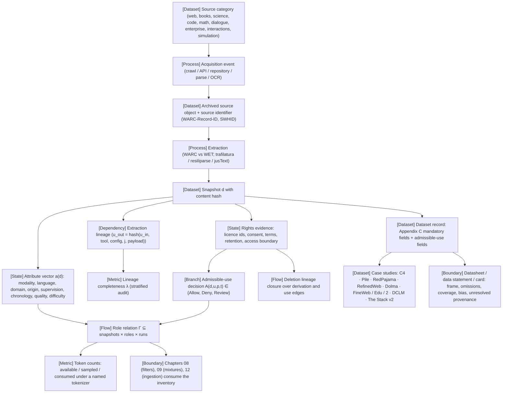

VOLUME I / PART II — DATA AND REPRESENTATION ENGINEERING / CHAPTER 07

# 07 — Data provenance, acquisition, and dataset semantics

**Thesis.** A dataset is a content-hashed snapshot with a typed attribute vector and a chain of recorded acquisition and transformation events, and its training role is a relation to a run rather than a property of the bytes — so every later claim about mixtures, filters, contamination, rights, or reproducibility is only as auditable as the inventory that records those fields, and this chapter must fix that inventory before any of them is built.

6 sections · 8 spine papers · 3 implementations · prerequisites: [04](../../part-01-scientific-foundations/ch04-language-modeling-and-learning-objectives/README.md), [06](../../part-01-scientific-foundations/ch06-experimental-design-and-evaluation-before-optimization/README.md) · artifact: a dataset inventory with provenance and admissible-use fields · updated 2026-09-23

## Why this chapter exists

What failed before was the phrase "the training data". Corpora were named by the stage that consumed them and described by a single token count, and the count was compared across tokenizers as if it were a physical quantity. The Pile's authors found in 2020 that "researchers often fail to clearly document where their data came from and under what terms its use was consented to" (PAPER-REPORTED · P03); a 2021 audit of C4, two years after its release, discovered that its most represented site was a patent aggregator serving machine-translated text and that its blocklist removed dialect-bearing documents disproportionately (PAPER-REPORTED · R7.28); a 2023 audit of 1,800+ datasets reported licence omission above 70% on hosting sites (PAPER-REPORTED · R7.25).

The bottleneck that appeared was traceability under change. Extractors turned out to be training variables (FineWeb and DCLM both measure WARC-versus-WET effects), custodians closed interfaces (Pushshift), rights holders sent takedowns (FineWeb v1.3.0), and opt-outs had to be propagated from users to repositories to files (The Stack v2). None of these events can be honoured by a corpus that stores text and a URL.

The constraint that became dominant is that provenance, rights, and role must be recorded at acquisition time or they are unrecoverable: a discarded WARC record id, an unlogged consent-notice version, or a role baked into a file name cannot be reconstructed later by adding a column. What changed in the solution is a data model. Open corpora — Dolma, FineWeb, DCLM, The Stack v2 — began shipping per-record source identifiers, extractor identities, datasheets, and removal paths, and the plan's Appendix C fixed the mandatory dataset fields and the training-role taxonomy. This chapter turns those practices into one inventory with a role relation, an admissible-use predicate, a lineage-completeness metric, and nine filled Dataset records whose gaps are reported as NOT-DISCLOSED rather than guessed.

```figure
id: fig-7.1
kind: diagram
title: Four post-release events and the field each one needs
caption: >-
  Each event in the upper group happened to a named corpus after release, and
  none of them can be honoured by a corpus that stores only text and a URL.
  Follow each edge to the field that would have honoured it. All four are
  facts about acquisition or custody, so they must be written when the bytes
  arrive; that is why the emphasised edge ends in one inventory rather than
  four later patches.
placement: inline
evidence: PAPER-REPORTED
source: [P06, P07, P05, R7.5, R7.12]
concepts: [ms.section.7.3, ms.section.7.4]
alt: >-
  Diagram. A corpus that stores only text and a URL cannot honour four events.
  First, the extractor changes: FineWeb and DCLM both measured WARC-versus-WET
  effects, so the record needs the extractor identity, its tool and
  configuration digests. Second, the custodian closes its interface: Pushshift
  stopped distributing Reddit data after the Reddit API terms changed, so the
  record needs the terms revision in force at collection. Third, a rights
  holder sends a takedown: FineWeb v1.3.0 removed domains after a
  cease-and-desist notice, so the record needs a per-record source identifier
  and a removal closure. Fourth, an opt-out propagates from users to
  repositories to files, as in The Stack v2, so the record needs owner,
  repository and file edges. All four fields must be recorded at acquisition
  time, because a discarded identifier cannot be recovered by adding a column,
  and together they feed the chapter's inventory of snapshot, event chain and
  role relation.
spec:
  direction: LR
  nodes:
    - { id: corpus, kind: dataset, label: "text + URL corpus", sub: "what failed before" }
    - { id: e1, kind: process, label: "extractor changes", sub: "WARC vs WET, ablated by FineWeb and DCLM", group: ev }
    - { id: e2, kind: dependency, label: "custodian closes its interface", sub: "Pushshift, after Reddit API terms changed", group: ev }
    - { id: e3, kind: feedback, label: "rights-holder takedown", sub: "FineWeb v1.3.0 domains removed after C&D", group: ev }
    - { id: e4, kind: feedback, label: "opt-out propagated", sub: "The Stack v2: users → repos → files", group: ev }
    - { id: f1, kind: state, label: "extractor identity", sub: "h_tool, h_config (§7.3)", group: fld }
    - { id: f2, kind: state, label: "terms revision at collection", sub: "instrument + date (§7.4)", group: fld }
    - { id: f3, kind: state, label: "source identifier + removal closure", sub: "WARC-Record-ID · Eq. 7.9", group: fld }
    - { id: f4, kind: state, label: "owner → repository → file edges", sub: "derivation edges (§7.4)", group: fld }
    - { id: acq, kind: boundary, label: "recorded at acquisition time", sub: "unrecoverable by adding a column later" }
    - { id: inv, kind: dataset, label: "inventory: snapshot + event chain + role relation Γ", sub: "the chapter's artifact", emphasis: true }
  edges:
    - { from: corpus, to: e1, kind: dependency, label: "cannot honour" }
    - { from: corpus, to: e2, kind: dependency }
    - { from: corpus, to: e3, kind: dependency }
    - { from: corpus, to: e4, kind: dependency }
    - { from: e1, to: f1, label: "needs" }
    - { from: e2, to: f2, label: "needs" }
    - { from: e3, to: f3, label: "needs" }
    - { from: e4, to: f4, label: "needs" }
    - { from: f1, to: acq }
    - { from: f2, to: acq }
    - { from: f3, to: acq }
    - { from: f4, to: acq }
    - { from: acq, to: inv, kind: emphasis }
  groups:
    - { id: ev, label: "events after release" }
    - { id: fld, label: "fields that honour them" }
```

## Concept map



- [Dataset] Source category (§7.1)
  - [Process] Acquisition event (§7.3)
    - [Dataset] Archived source object + source identifier
      - [Process] Extraction (WARC vs WET; named extractors)
        - [Dataset] Snapshot d with content hash
          - [State] Attribute vector a(d) (§7.2) → [Flow] Role relation Γ (§7.2) → [Metric] Token counts with qualifier and tokenizer; → [Boundary] Chapters 08, 09, 12
          - [Dependency] Extraction lineage (§7.3) → [Metric] Lineage completeness λ (verification)
          - [State] Rights evidence (§7.4) → [Branch] Admissible-use decision → Γ; → [Flow] Deletion lineage closure
          - [Dataset] Dataset record (§7.6) → [Dataset] Nine case studies; → [Boundary] Datasheet / card fields (§7.5)

## Position in the book

| Relation | Links |
|---|---|
| Prerequisites | [§4.1 Autoregressive modeling](../../part-01-scientific-foundations/ch04-language-modeling-and-learning-objectives/04-1-autoregressive-modeling.md), [§4.6 Likelihood and capability](../../part-01-scientific-foundations/ch04-language-modeling-and-learning-objectives/04-6-likelihood-and-capability.md), [§6.2 Data partitioning](../../part-01-scientific-foundations/ch06-experimental-design-and-evaluation-before-optimization/06-2-data-partitioning.md), [§6.6 Reproducible evidence](../../part-01-scientific-foundations/ch06-experimental-design-and-evaluation-before-optimization/06-6-reproducible-evidence.md), [§2.5 Statistical inference](../../part-01-scientific-foundations/ch02-mathematical-and-statistical-foundations/02-5-statistical-inference.md), [Notation](../../../front-matter/notation.md) |
| Siblings (same part) | [08](../ch08-cleaning-deduplication-privacy-filtering-and-contamination/README.md), [09](../ch09-data-mixtures-curricula-and-sample-efficiency/README.md), [10](../ch10-tokenization-serialization-and-interface-correctness/README.md), [11](../ch11-synthetic-data-preferences-and-interactive-trajectories/README.md), [12](../ch12-scalable-data-infrastructure-and-reproducible-ingestion/README.md) |
| Downstream | [§8.1 Normalization](../ch08-cleaning-deduplication-privacy-filtering-and-contamination/08-1-normalization.md), [§8.5 Evaluation contamination](../ch08-cleaning-deduplication-privacy-filtering-and-contamination/08-5-evaluation-contamination.md), [§9.1 Mixture formulation](../ch09-data-mixtures-curricula-and-sample-efficiency/09-1-mixture-formulation.md), [§10.3 Vocabulary economics](../ch10-tokenization-serialization-and-interface-correctness/10-3-vocabulary-economics.md), [§11.5 Interactive collection](../ch11-synthetic-data-preferences-and-interactive-trajectories/11-5-interactive-collection.md), [§12.1 Storage and formats](../ch12-scalable-data-infrastructure-and-reproducible-ingestion/12-1-storage-and-formats.md), [§22.2 Distribution transitions](../../part-04-training-science-and-adaptation/ch22-continued-pretraining-mid-training-and-domain-adaptation/22-2-distribution-transitions.md), [§49.1 Corpus construction](../../../vol-03-grounded-and-interactive-intelligence/part-09-retrieval-context-and-agent-systems/ch49-retrieval-models-indexing-and-evidence-access/49-1-corpus-construction.md), [§65.4 Controls](../../../vol-03-grounded-and-interactive-intelligence/part-11-evaluation-interpretability-and-deployment-assurance/ch65-security-privacy-safety-and-adversarial-robustness/65-4-controls.md), [§66.2 Artifact integrity](../../../vol-03-grounded-and-interactive-intelligence/part-11-evaluation-interpretability-and-deployment-assurance/ch66-release-decisions-reproducibility-and-research-to-production-closure/66-2-artifact-integrity.md) |
| Trades off with | [§8.2 Quality estimation](../ch08-cleaning-deduplication-privacy-filtering-and-contamination/08-2-quality-estimation.md) (estimator-defined populations vs recorded origin), [§9.6 Data scaling limits](../ch09-data-mixtures-curricula-and-sample-efficiency/09-6-data-scaling-limits.md) (available vs consumed tokens), [§61.4 Validity threats](../../../vol-03-grounded-and-interactive-intelligence/part-11-evaluation-interpretability-and-deployment-assurance/ch61-capability-portfolios-and-benchmark-validity/61-4-validity-threats.md) (role collisions as contamination) |

## Sections

| § | Title | What changes here | Primary labels |
|---|---|---|---|
| [7.1](07-1-source-categories.md) | Source categories | Nine custody chains, each with a unit of sampling, typical supervision, provenance risk, and a yield-chain cost line; category is decided from custody, never from content | PAPER-REPORTED, DERIVED, NOT-DISCLOSED |
| [7.2](07-2-orthogonal-dataset-axes.md) | Orthogonal dataset axes | A typed attribute vector over eight snapshot axes; training role becomes a relation Γ to a run; token counts acquire qualifier and tokenizer (Proposition 7.1) | MATHEMATICALLY-DERIVED, OFFICIAL-DOCUMENTATION, KNOWN |
| [7.3](07-3-acquisition-and-extraction.md) | Acquisition and extraction | WARC vs WET, robots semantics, APIs, Software Heritage, PDF/OCR; extractor identity becomes part of pipeline identity; source identifiers and a sidecar for sensitive locators | PAPER-REPORTED, OFFICIAL-DOCUMENTATION, ASSUMED |
| [7.4](07-4-rights-and-governance-metadata.md) | Rights and governance metadata | Licences, consent, terms, retention, access, deletion as typed evidence; admissibility is a function of the use; removal is a closure over derivation *and* use edges | PAPER-REPORTED, MATHEMATICALLY-DERIVED, UNVERIFIED |
| [7.5](07-5-dataset-documentation.md) | Dataset documentation | Datasheet → data statement → model card → data card → Hub card lineage; frames, three-valued omissions, coverage and retention fractions, bias with mechanism, unresolved provenance | PAPER-REPORTED, DERIVED, NOT-DISCLOSED |
| [7.6](07-6-corpus-case-studies.md) | Corpus case studies | Nine Dataset records filled from primary sources; a comparison contract χ; every count with tokenizer and qualifier; NOT-DISCLOSED where the source is silent | OFFICIAL-DOCUMENTATION, PAPER-REPORTED, NOT-DISCLOSED |

## Artifact

**Dataset inventory with provenance and admissible-use fields** — two tables with one key. `snapshots` carries the seventeen mandatory Appendix C fields (dataset id, snapshot/hash, origin, acquisition time, modality, language, domain, unit of sampling, label schema, generator/policy, license/permission record, extraction/filter/dedup versions, training role — as a pointer, train/evaluation membership, contamination results, retention/deletion conditions, known limitations) plus the chapter's additions: `token_counts[]` with qualifier and tokenizer revision, `bytes_per_token`, `yield_chain`, `source_identifier_scheme`, `sidecar_ref`, `frame` with coverage and retention by stratum, `card_timestamps`, and `admissible_use` (purpose → decision, policy revision, evaluation time, jurisdiction). `role_assignments` carries one row per (snapshot, role, run) with sampling proportion, tokenizer, loss mask, template, consumed tokens, and the decision reference that authorised the row. The schema, an illustrative row marked ASSUMED, and the nine filled case-study records are in [verification.md](verification.md) §1 and [§7.6](07-6-corpus-case-studies.md).

```figure
id: fig-7.2
kind: diagram
title: "The inventory: snapshot, event chain, role relation"
caption: >-
  The chapter's central result as a data model. The emphasised path runs from
  an archived source object through extraction to a content-hashed snapshot,
  and from the snapshot to a run only through a role_assignments row. Role is
  therefore a row keyed by (snapshot, role, run), never a column of the
  snapshot. Rights reach a run only as the decision_ref an Allow wrote.
  Removal and audit are the two return paths: the closure walks derivation
  and use edges, and λ walks a consumed record back to its acquisition event.
placement: wide
evidence: DERIVED
source: ["DERIVED:eq-7.4", "DERIVED:eq-7.5", "DERIVED:eq-7.6", "DERIVED:eq-7.8", "DERIVED:eq-7.9"]
concepts: [ms.section.7.2, ms.section.7.3, ms.section.7.4, ms.section.7.5]
alt: >-
  Diagram of the inventory in three groups. Lineage: an acquisition event
  (time, interface, status, robots status) archives a source object
  identified by a WARC-Record-ID plus path or a SWHID; an extraction step
  assigns u_out by hashing parent identity, tool and configuration digests,
  ordinal and payload digest. Snapshots table: snapshot d carries a content
  hash and the seventeen Appendix C fields, plus its attribute vector a(d)
  (eight axes with methods), rights evidence (licence, consent, terms,
  retention) and token counts (qualifier, count, tokenizer revision); rights
  evidence feeds the decision A(d, u, p, t) of Allow, Deny or Review.
  Role_assignments table: a row (d, r, u) carries q_k, tokenizer, mask,
  template and a decision_ref to an Allow, and links the snapshot to run u,
  whose consumed tokens are the sum of q_k times available tokens (Eq. 7.5).
  Two return paths: a removal closure over derivation and use edges (Eq.
  7.9), and lineage completeness λ, which traces sampled consumed records
  back to their acquisition events.
spec:
  direction: LR
  nodes:
    - { id: acq, kind: process, label: "acquisition event", sub: "time · interface · status · robots_status", group: lin }
    - { id: src, kind: dataset, label: "archived source object", sub: "WARC-Record-ID + path · SWHID", group: lin }
    - { id: ext, kind: process, label: "extraction step", sub: "u_out = hash(u_in, h_tool, h_config, j, h_payload)", group: lin }
    - { id: snap, kind: dataset, label: "snapshot d", sub: "content hash · 17 Appendix C fields", group: snaps, emphasis: true }
    - { id: attr, kind: state, label: "attribute vector a(d)", sub: "8 axes, each with method and label", group: snaps }
    - { id: rights, kind: dependency, label: "rights evidence records", sub: "licence · consent · terms · retention", group: snaps }
    - { id: tc, kind: metric, label: "token_counts[]", sub: "qualifier · count · tokenizer revision", group: snaps }
    - { id: dec, kind: branch, label: "admissible_use A(d, u, p, t)", sub: "Allow · Deny · Review (Eq. 7.8)", group: snaps }
    - { id: gam, kind: flow, label: "role_assignments row (d, r, u)", sub: "q_k · tok_u · mask · template · decision_ref", group: roles }
    - { id: run, kind: model, label: "run u", sub: "lineage id ℓ(u)", group: roles }
    - { id: cons, kind: metric, label: "consumed tokens", sub: "Σ_k q_k · D_avail,k (Eq. 7.5)", group: roles }
    - { id: clo, kind: feedback, label: "removal closure", sub: "derivation + use edges (Eq. 7.9)" }
    - { id: lam, kind: feedback, label: "lineage completeness λ", sub: "sampled consumed records traced back" }
  edges:
    - { from: acq, to: src, label: "archives" }
    - { from: src, to: ext, kind: emphasis }
    - { from: ext, to: snap, kind: emphasis }
    - { from: snap, to: attr, kind: dependency }
    - { from: snap, to: rights, kind: dependency }
    - { from: snap, to: tc, kind: dependency }
    - { from: rights, to: dec }
    - { from: snap, to: gam, kind: emphasis, label: "consumed in role r" }
    - { from: dec, to: gam, kind: dependency, label: "decision_ref = Allow" }
    - { from: gam, to: run, kind: emphasis }
    - { from: run, to: cons }
    - { from: rights, to: clo, label: "removal request" }
    - { from: clo, to: ext, kind: feedback, label: "derivation edges" }
    - { from: clo, to: gam, kind: feedback, label: "use edges" }
    - { from: cons, to: lam, label: "stratified sample" }
    - { from: lam, to: acq, kind: feedback, label: "resolve (i)–(iv)" }
  groups:
    - { id: lin, label: "acquisition + extraction lineage (§7.3)" }
    - { id: snaps, label: "snapshots table (§7.2, §7.4, §7.5)" }
    - { id: roles, label: "role_assignments table (§7.2)" }
```

## Verification

The falsifiable task is to draw a stratified random sample of the records a training run actually consumed and resolve each one, from inventory fields alone, to an acquisition event, an archived source object whose digest matches, every transformation identity on its path, and an Allow decision for the role in which it was consumed; lineage completeness λ is reported per stratum with a design-appropriate interval, misses are profiled by field, and records whose source no longer exists at the custodian are separated from records whose identifier was never recorded. Thresholds are ASSUMED; the protocol and the result that would reject the chapter's central claim are in [verification.md](verification.md).

## Lineage

- 2018 · Datasheets for Datasets (R7.27) · *conceptual ancestor* — per-dataset documentation of motivation, composition, collection, uses, maintenance
- 2018 · Data Statements for NLP (R7.21) · *alternative branch* — speaker/annotator population framing for language data
- 2019 · CCNet (R7.17) and C4 (P02) · *conceptual ancestor* — WET-based web extraction with language identification and heuristic cleaning
- 2020 · The Pile (P03) · *conceptual ancestor* — per-constituent accounting and a three-tier consent classification
- 2021 · Documenting C4 (R7.28) · *engineering optimization* — post-hoc provenance audit of a released corpus
- 2023 · RefinedWeb (P04) · *engineering optimization* — WARC extraction with trafilatura at trillion-token scale
- 2023 · Data Provenance Initiative (R7.25) · *engineering optimization* — dataset-level licence and lineage audit tooling
- 2024 · Dolma (P05) · *current frontier* — multi-source open corpus with datasheet, per-source recoverability, and toolkit
- 2024 · The Stack v2 (R7.12) · *current frontier* for code provenance — SWHID identifiers, file-level licence detection, quantified opt-out
- 2024 · FineWeb (P06) and DCLM (P07) · *current frontier* — extraction and filtering as ablated training variables; WARC-level identifiers retained
- 2025 · FineWeb2 (R7.18) · *current frontier* for multilingual coverage — per-language pipelines, removed-data publication, measured domain concentration
- 2019 · WET-only corpus construction (P02) · *superseded approach* for quality-sensitive web corpora, per the P03/P04/P06/P07 ablations

```figure
id: fig-7.3
kind: lineage
title: Lineage of dataset provenance practice
caption: >-
  Two strands converge by 2024. The documentation strand (datasheets, data
  statements, the C4 audit, the licence audit) asks what a corpus is and who
  may use it. The construction strand (CCNet and C4, The Pile, RefinedWeb)
  asks how web text is extracted. The current-frontier releases are frontier
  for one practice each: per-source recoverability, SWHID-level code
  provenance, extraction as an ablated variable, per-language coverage. The
  one superseded entry is WET-only construction, and only for
  quality-sensitive web corpora.
placement: inline
evidence: PAPER-REPORTED
source: [R7.27, R7.21, R7.17, P02, P03, R7.28, P04, R7.25, P05, R7.12, P06, P07, R7.18]
alt: >-
  Timeline of the chapter's Lineage list. 2018: Datasheets for Datasets
  (R7.27), conceptual ancestor; Data Statements for NLP (R7.21), alternative
  branch, population framing. 2019: CCNet (R7.17) and C4 (P02), conceptual
  ancestors, WET-based extraction with language identification and heuristic
  cleaning; WET-only construction (P02), superseded approach for
  quality-sensitive web corpora per the P03, P04, P06 and P07 ablations. 2020:
  The Pile (P03), conceptual ancestor, per-constituent accounting and three
  consent tiers. 2021: Documenting C4 (R7.28), engineering optimization, a
  post-hoc audit. 2023: RefinedWeb (P04), engineering optimization, WARC plus
  trafilatura at trillion-token scale; Data Provenance Initiative (R7.25),
  engineering optimization, licence audit tooling. 2024, current frontier:
  Dolma (P05), per-source recoverability and toolkit; The Stack v2 (R7.12),
  SWHIDs, file-level licences and quantified opt-out; FineWeb (P06) and DCLM
  (P07), extraction as an ablated variable with WARC-level identifiers. 2025:
  FineWeb2 (R7.18), current frontier for multilingual coverage.
spec:
  entries:
    - { year: 2018, work: "Datasheets for Datasets", cite: R7.27, relation: "conceptual ancestor", node: ms.section.7.5, note: "per-dataset documentation of motivation, composition, collection, uses, maintenance" }
    - { year: 2018, work: "Data Statements for NLP", cite: R7.21, relation: "alternative branch", node: ms.section.7.5, note: "speaker/annotator population framing for language data" }
    - { year: 2019, work: "CCNet", cite: R7.17, relation: "conceptual ancestor", node: ms.section.7.3, note: "WET-based web extraction with language identification and heuristic cleaning" }
    - { year: 2019, work: "C4", cite: P02, relation: "conceptual ancestor", node: ms.section.7.6, note: "WET-based web extraction with language identification and heuristic cleaning" }
    - { year: 2019, work: "WET-only corpus construction", cite: P02, relation: "superseded approach", node: ms.section.7.3, note: "for quality-sensitive web corpora, per the P03/P04/P06/P07 ablations" }
    - { year: 2020, work: "The Pile", cite: P03, relation: "conceptual ancestor", node: ms.section.7.1, note: "per-constituent accounting and a three-tier consent classification" }
    - { year: 2021, work: "Documenting C4", cite: R7.28, relation: "engineering optimization", node: ms.section.7.5, note: "post-hoc provenance audit of a released corpus" }
    - { year: 2023, work: "RefinedWeb", cite: P04, relation: "engineering optimization", node: ms.section.7.3, note: "WARC extraction with trafilatura at trillion-token scale" }
    - { year: 2023, work: "Data Provenance Initiative", cite: R7.25, relation: "engineering optimization", node: ms.section.7.4, note: "dataset-level licence and lineage audit tooling" }
    - { year: 2024, work: "Dolma", cite: P05, relation: "current frontier", node: ms.section.7.6, note: "multi-source open corpus with datasheet, per-source recoverability, and toolkit" }
    - { year: 2024, work: "The Stack v2", cite: R7.12, relation: "current frontier", node: ms.section.7.4, note: "for code provenance: SWHID identifiers, file-level licence detection, quantified opt-out" }
    - { year: 2024, work: "FineWeb", cite: P06, relation: "current frontier", node: ms.section.7.3, note: "extraction and filtering as ablated training variables; WARC-level identifiers retained" }
    - { year: 2024, work: "DCLM", cite: P07, relation: "current frontier", node: ms.section.7.3, note: "extraction and filtering as ablated training variables; WARC-level identifiers retained" }
    - { year: 2025, work: "FineWeb2", cite: R7.18, relation: "current frontier", node: ms.section.7.5, note: "for multilingual coverage: per-language pipelines, removed-data publication, measured domain concentration" }
```

## Terms owned here

- **Source category** — the class of generating process and custody chain from which a dataset's raw records were obtained (§7.1).
- **Unit of sampling (data)** — the smallest record a dataset build treats as indivisible when drawing, deduplicating, splitting, or deleting (§7.1).
- **Provenance risk** — the category-typical way the chain from a record to its origin, rights holder, and population fails (§7.1).
- **Dataset attribute vector** — the typed tuple a(d) of modality, language, domain, origin, supervision, chronology, quality, difficulty with assignment methods (§7.2).
- **Training role** — the function a snapshot serves in one run, assigned by the run as a relation Γ, never a property of the snapshot (§7.2).
- **Token-count qualifier (available / sampled / consumed)** — the three meanings of D, each stated with its tokenizer (§7.2).
- **Acquisition event** — a timestamped observation of a source through a specified interface with locator, status, integrity metadata, and content identity or failure (§7.3).
- **Extraction lineage** — the directed record of source objects, transformation identities, and derived records for every extraction step (§7.3).
- **Source identifier** — an identifier that resolves from a training record to its archived source object by a documented procedure (§7.3).
- **Admissible-use decision** — a versioned Allow/Deny/Review result for (snapshot, use, policy, time) with evidence references (§7.4).
- **Rights evidence record** — a typed observation of a licence, consent notice, contract clause, or terms revision with scope and observation time (§7.4).
- **Deletion lineage** — the graph from a removal request through derivation and use edges to affected artifacts and their remediation status (§7.4).
- **Sampling frame (dataset)** — the identifiable set of units eligible for selection by a stated collection procedure in a stated window (§7.5).
- **Provenance completeness** — the fraction of records whose required lineage fields are present and resolvable under an explicit audit rule (§7.5; estimated as λ in verification).

## Reference-stack coverage

This table binds the chapter to `Instruction/AI_REFERENCE_STACK.md`. The *Surface used* cell is the URL exactly as that file lists it, with a note on whether that surface was itself opened or whether the work was reached through arXiv (§3 #1) with the lab surface as the attribution route. Per-work URLs and access dates are in [references.md](references.md).

| Stack section | Entry (rank) | Stack layer | What this chapter takes from it | Surface used | Sections | Evidence label |
|---|---|---|---|---|---|---|
| §1 lab | **Allen Institute for AI (Ai2)** (#22) | — | Dolma paper and datasheet (per-source accounting, CCNet yield, recoverability, jurisdiction statements, Paloma decontamination), Dolma dataset card (versions, OLMo/Llama token tables, licence change, PII form), Dolma toolkit README, C4 mirror card, WildChat consent mechanism, Dodge et al. C4 audit | Models: https://huggingface.co/allenai (dataset cards `dolma`, `c4` opened as raw README); Code: https://github.com/allenai (`dolma` README opened); papers via arXiv | 7.1–7.6 | PAPER-REPORTED / OFFICIAL-DOCUMENTATION |
| §1 lab | **Hugging Face Research** (#27) | — | FineWeb paper (WARC vs WET ablation, trafilatura, MinHash parameters, FineWeb-Edu classifier cost), FineWeb / FineWeb-Edu / FineWeb2 dataset cards (fields, pipeline steps, changelogs, C&D removal, PII forms, multilingual limitations, refusal to report subword tokens), FineWeb2 paper (Bible/Wikipedia concentration), datatrove README, Hub dataset-card documentation | Models: https://huggingface.co/ (three dataset cards opened as raw README); Code: https://github.com/huggingface (`datatrove`, `hub-docs` opened); papers via arXiv | 7.1–7.6 | PAPER-REPORTED / OFFICIAL-DOCUMENTATION |
| §1 lab | **Together AI Research** (#26) | — | RedPajama paper (V1 LLaMA-recipe reproduction, V2 WET+CCNet pool, quality signals, Books3 takedown, reproduction-gap statement) and RedPajama-Data repository (84 snapshots, document counts, 30.4 T estimated tokens without tokenizer, Apache-2.0 code licence) | Code: https://github.com/togethercomputer (`RedPajama-Data` README opened); paper via arXiv | 7.1, 7.3, 7.4, 7.6 | PAPER-REPORTED / OFFICIAL-DOCUMENTATION |
| §1 lab | **OpenAI** (#2) | — | InstructGPT: Playground-only prompt provenance, consent notification, PII filtering, per-user cap and user-id splits | Papers: https://openai.com/research/index/publication/ (not opened; paper opened via arXiv/ar5iv) | 7.1, 7.3, 7.4, 7.5 | PAPER-REPORTED |
| §1 lab | **DeepSeek** (#8) | — | DeepSeekMath corpus: classifier-mined mathematics from Common Crawl as the mathematics source category; 120 B tokens with tokenizer NOT-DISCLOSED | Papers: https://github.com/deepseek-ai (not opened; paper via arXiv/ar5iv) | 7.1, 7.6 | PAPER-REPORTED |
| §1 lab | **Google Research** (#18) | — | T5/C4 construction (WET input, April 2019, langdetect, line and bad-words rules, TFDS release); Model Cards and Data Cards as documentation lineage | Papers: https://research.google/pubs/ (not opened; papers via arXiv/ar5iv) | 7.3, 7.5, 7.6 | PAPER-REPORTED |
| §1 lab | **Meta AI / FAIR** (#4) | — | CCNet pipeline identity (language identification, paragraph dedup, Wikipedia-perplexity buckets) as used by Dolma and RedPajama; Nougat OCR framing | Code: https://github.com/facebookresearch (`cc_net` not opened; identity via arXiv abs and P05/R7.3) | 7.3, 7.6 | PAPER-REPORTED |
| §1 lab | **Microsoft Research / Microsoft AI** (#13) | — | Datasheets for Datasets (author affiliations as printed): seven-section template, non-automation principle, retention/maintenance questions | Papers: https://www.microsoft.com/research/publications/ (not opened; paper via arXiv/ar5iv) | 7.4, 7.5 | PAPER-REPORTED |
| §2 conference | **ACL** (#4) | — | Archival identity of Dolma (ACL 2024 Long Papers, pp. 15725–15788) | Papers: https://aclanthology.org/venues/acl/ (paper page `2024.acl-long.840` opened) | 7.1–7.6 | KNOWN |
| §2 conference | **NeurIPS** (#1) | — | Archival identity of FineWeb, RedPajama, Croissant (Datasets and Benchmarks Track 2024) | Papers: https://proceedings.neurips.cc/ (FineWeb hash page located via search, not opened; RedPajama and Croissant venue from arXiv comments) | 7.2, 7.5, 7.6 | KNOWN / UNVERIFIED (pages not opened) |
| §2 conference | **EMNLP** (#6) | — | Archival identity of Documenting C4 (EMNLP 2021, per arXiv comments) | Papers: https://aclanthology.org/venues/emnlp/ (not opened) | 7.5, 7.6 | UNVERIFIED (venue page not opened) |
| §3 discovery source | **arXiv** (#1) | — | Primary route to every paper: abs pages for identity and version, arXiv HTML for P05/P06/P07/R7.3/R7.12/R7.18 full text | Entry point: https://arxiv.org/ (abs and HTML pages opened; see references.md) | 7.1–7.6 | KNOWN |
| §3 discovery source | **ACL Anthology** (#5) | — | Archival identity of Data Statements (TACL 6, Q18-1041) and Dolma | Entry point: https://aclanthology.org/ (two paper pages opened) | 7.5 | KNOWN |
| §4 system | **Hugging Face Transformers** (#26) | Model definition / adaptation | The tokenizer interface through which every token count (gpt2, Llama, GPT-NeoX, OLMo) must be pinned by repository id and revision; consumer of extracted text | docs/code: https://huggingface.co/docs/transformers/ (index opened 2026-09-23) | 7.1–7.6 | OFFICIAL-DOCUMENTATION |
| §4 system | **PyTorch** (#17) | Model / autograd framework | The training input path whose consumed-token counter is reconciled against Σ q_k D_avail,k (Eq. 7.5) | docs/code: https://pytorch.org/docs/stable/ (opened 2026-09-23; redirects to `docs.pytorch.org` 2.14) | 7.2–7.6 | OFFICIAL-DOCUMENTATION |
| §4 system | **Nanotron** (#35) | Distributed training | "a library for pretraining transformer models"; the trainer FineWeb's card names for its ablation models, hence the run side of Γ in any replication | docs/code: https://github.com/huggingface/nanotron (README opened 2026-09-23) | 7.3–7.6 | OFFICIAL-DOCUMENTATION |
| §4 system | **TorchTitan** (#21) | Distributed training | Named as a reference trainer where run-side fields (mask, packing, sampling) are realised; no behaviour asserted | docs/code: https://github.com/pytorch/torchtitan (not opened this chapter) | 7.2 | UNVERIFIED |
| *Outside the reference stack (routed via book_plan.md anchors)* | Common Crawl Foundation (get-started, CCBot pages) | — | WARC/WAT/WET definitions, hosting bucket and HTTPS prefix, crawl naming, crawler user-agent and blocking; justified by the plan's FineWeb/Dolma/DCLM anchors, all of which are Common Crawl derivatives | https://commoncrawl.org/get-started and https://commoncrawl.org/ccbot (opened) | 7.1, 7.3 | OFFICIAL-DOCUMENTATION |
| *Outside the reference stack (routed via book_plan.md anchors)* | IETF RFC 9309 | — | Robots Exclusion Protocol semantics ("not a form of access authorization", unavailable vs unreachable, cache, size limit); justified by the plan's §7.3 "robots handling" coverage item | https://www.rfc-editor.org/rfc/rfc9309.txt (opened) | 7.3 | OFFICIAL-DOCUMENTATION |
| *Outside the reference stack (routed via book_plan.md anchors)* | DCLM team (`mlfoundations`; multi-institution) | — | DataComp-LM paper (P07, a spine paper) and the DCLM-baseline card: resiliparse, WARC metadata retention, robots/PII/redaction statements, CC-BY-4.0, token counts | https://arxiv.org/abs/2406.11794 and https://huggingface.co/datasets/mlfoundations/dclm-baseline-1.0 (opened) | 7.1, 7.3–7.6 | PAPER-REPORTED / OFFICIAL-DOCUMENTATION |
| *Outside the reference stack (routed via book_plan.md anchors)* | Technology Innovation Institute (RefinedWeb, P04) and EleutherAI (The Pile, P03) | — | Spine papers P04 and P03: extraction choices, dedup, licences, consent tiers, datasheets | https://arxiv.org/abs/2306.01116 and https://arxiv.org/abs/2101.00027 (opened) | 7.1, 7.3–7.6 | PAPER-REPORTED |
| *Outside the reference stack (routed via book_plan.md anchors)* | BigCode / Software Heritage (StarCoder2 and The Stack v2) | — | Code-corpus provenance: SWHID, Merkle-DAG dedup, licence-detection chain, opt-out; justified by Appendix C "Code corpora: use exact official dataset cards" | https://arxiv.org/abs/2402.19173 and https://huggingface.co/datasets/bigcode/the-stack-v2 (opened) | 7.1, 7.3, 7.4, 7.6 | PAPER-REPORTED / OFFICIAL-DOCUMENTATION |
| *Outside the reference stack (routed via book_plan.md anchors)* | trafilatura and ChatNoir Resiliparse repositories; W3C PROV-DM; SPDX License List; University of Washington (Data Statements); MIT/Data Provenance Initiative | — | Extractor identity and licence facts; provenance vocabulary; licence identifiers; documentation lineage; licence-audit statistics — each used for one definition or one fact, justified by the §7.3–§7.5 coverage items of the plan | repository READMEs, https://www.w3.org/TR/prov-dm/, https://spdx.org/licenses/, https://aclanthology.org/Q18-1041/, https://arxiv.org/abs/2310.16787 (opened) | 7.3, 7.4, 7.5 | OFFICIAL-DOCUMENTATION / PAPER-REPORTED |

**Inspection dimensions applied.** Of the §4.2 dimensions, the chapter analyses: *Reproducibility* — throughout, as tokenizer repository and revision, extractor identity, pipeline digests, card version, and unpinned-commit disclosure (§7.2, §7.3, §7.6, references.md); *Memory* — byte-expansion admission limits and streaming staging in acquisition (§7.3), host-side aggregation buffers for card generation (§7.5); *Communication* — object-store egress and manifest publication (§7.3), worker-cache invalidation by release id (§7.4); *Reliability* — atomic manifest publication and typed failures (§7.3), stale-decision and orphaned-sidecar failure modes (§7.3, §7.4); *Metrics* — tokens/s/GPU appears only inside proposed Experiment 7.6, and extraction throughput (pages/s/core) in Experiment 7.3; *Checkpointing* — only as the forward pointer that removal closure reaches trained checkpoints (§7.4). *Parallelism, Precision, Kernels, Post-training,* and *Inference* are not analysed in this chapter.

## Source route

Following the paper cascade of `AI_REFERENCE_STACK.md` §3.1 (arXiv/OpenReview → proceedings → Semantic Scholar/OpenAlex/DBLP → GitHub/Hugging Face → lab report) and the lab protocol §1.1:

1. `site:arxiv.org/abs "Allen Institute for AI" "Dolma"` (§1.1 lab + topic template) — resolve the Dolma manuscript version and confirm which dataset version it describes before quoting token tables.
2. `site:huggingface.co/blog "FineWeb"` (Hugging Face Research search recipe) — reach the FineWeb blog and dataset cards, then verify every pipeline claim against the card's linked `datatrove` commits.
3. `site:github.com/togethercomputer "RedPajama" (architecture OR design OR benchmark)` (§4.3 pattern applied to a data repository) — find the V1 branch and V2 pipeline before attributing token counts.
4. `cat:cs.CL AND abs:"Common Crawl" AND abs:"extraction"` (arXiv advanced query, §3.2) — locate extractor comparisons (WARC vs WET, trafilatura vs resiliparse) beyond P06 and P07.
5. `"Datasheets for Datasets" (NeurIPS OR ICML OR ICLR OR ACL OR EMNLP)` (§1.1 exact-venue template) — confirm archival identities of the documentation lineage, then the CACM version via the arXiv comments line.
6. `https://api.openalex.org/works?search=dataset licensing audit provenance&filter=publication_year:2026,open_access.is_oa:true&sort=-cited_by_count` (§3.2 OpenAlex pattern) — find current licence-audit and lineage-tooling work to update the Data Provenance Initiative figures.

## Status

Editorial status: `manuscript_draft`. Evidence coverage: every corpus fact is attributed to a paper, repository, or card opened on the date in the *Accessed* column of [references.md](references.md) (2026-09-20 for all sources; 2026-09-23 for the Transformers, PyTorch, and Nanotron documentation roots); every schema and protocol element is DERIVED or ASSUMED; no corpus was downloaded or audited; no experiment was run.

NOT-DISCLOSED items carried: acquisition prices for licensed books and science; enterprise-record and production-interaction volumes for any organisation; OCR cost and accuracy for any corpus; the tokenizer behind RedPajama-V2's 30.4 T, RefinedWeb's 5,000 GT, The Stack v2's ~900 B, DeepSeekMath's 120 B, and the "175B" C4 figure; content hashes of every release; The Pile's total subword count and distribution licence in the passages inspected; contamination results for C4 (beyond R7.28), The Pile, RedPajama, RefinedWeb, FineWeb, FineWeb2, The Stack v2; retention conditions for all corpora except the removal forms named; Dolma v1.7 consumed tokens per run; Stack v2 licence-detection error rates; any lab's retraining practice after removal requests; robots status at record level in any corpus.

UNVERIFIED items carried: Dolma v1's archive format (WET per P07 vs WARC recoverability per P05); RefinedWeb's archive format (WARC in method, WET in datasheet); the tokenizer of DCLM-baseline's 3.8 T / 4 T count; all jurisdiction-specific statements quoted from P03 and P05; machine-generated share per source category; the magnitude of extractor effects at scales other than those of P06/P07; whether difficulty metadata exists in any production corpus; TorchTitan behaviour (not opened); NeurIPS and EMNLP proceedings pages (venues taken from arXiv comments); commits of every README and card read from `main`.
