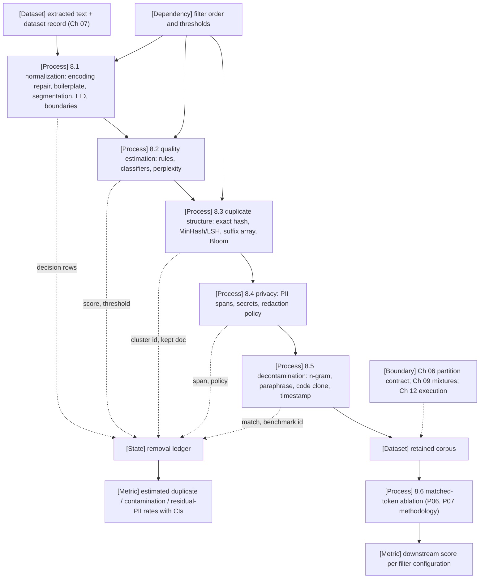

VOLUME I / PART II — DATA AND REPRESENTATION ENGINEERING / CHAPTER 08

# 08 — Cleaning, deduplication, privacy filtering, and contamination

Every filter applied to a corpus is a classifier with a selection rate, and a corpus is only auditable when each removal is recorded with the rule that made it, the score it saw, and the threshold it crossed — so this chapter treats cleaning, deduplication, privacy redaction and decontamination as one ordered pipeline whose ledger, not whose token count, is the deliverable.

6 sections · 6 spine papers · 4 implementations · prerequisites: 06–07 · artifact: an auditable filtering pipeline and removal ledger · updated 2026-09-23

## Why this chapter exists

What failed before was not the absence of cleaning but its invisibility. C4 was released with a list of heuristics and no record of what they removed; the first independent audit found that its blocklist "disproportionately removes text from and about minority individuals" and that the corpus contained machine-translated patents and verbatim benchmark targets (R8.11, PAPER-REPORTED). GPT-3's authors attempted to remove benchmark overlap before training, then reported that "a bug in the filtering caused us to ignore some overlaps, and due to the cost of training it was not feasible to retrain the model" (R8.7, PAPER-REPORTED). Two lessons follow: a filter that cannot be replayed cannot be audited, and a filter defect discovered after training is a defect that costs a training run.

The bottleneck that appeared as corpora grew to tens of trillions of tokens is that every stage — encoding repair, language identification, quality scoring, near-duplicate detection, PII redaction, benchmark decontamination — is a probabilistic decision with its own false-positive and false-negative rates, and the stages interact. FineWeb's authors found that deduplicating globally across 96 Common Crawl snapshots removed up to 90 % of the oldest snapshots and produced a corpus that trained *worse* than deduplicating each snapshot alone, because the survivors of global deduplication were the low-quality long tail (P06, PAPER-REPORTED). The dominant constraint is therefore not throughput but composition: the order and thresholds of filters determine which distribution is retained, and only a controlled ablation at matched token budget can say whether a stage helped.

What changed in the solution is that the community now runs data ablations as experiments — FineWeb trained more than 70 models at 1.71 B parameters to choose its filters (P06) and DCLM fixed model, tokens and evaluation so that only the data varies (P07) — and that the reference open pipelines (datatrove, Dolma's toolkit, DCLM's Ray pipeline) expose every stage as a replayable block. This chapter builds on those two moves: it formalises each filter as a classifier over a retained distribution, gives the algorithms with their cost lines, and specifies the removal ledger that makes the pipeline auditable. Contamination as a *design* failure — the split that should never have leaked — is owned by [§6.2](../../part-01-scientific-foundations/ch06-experimental-design-and-evaluation-before-optimization/06-2-data-partitioning.md); this chapter owns detection and removal.

## Concept map

- [Dataset] extracted text with its dataset record (owned by Chapter 07) enters the pipeline
  - [Process] 8.1 normalization: encoding repair, boilerplate removal, segmentation, language identification, document boundaries
  - [Process] 8.2 quality estimation: rule filters, learned classifiers, perplexity signals, domain-sensitive filters
  - [Process] 8.3 duplicate structure: exact hashes, MinHash/LSH banding, connected components, suffix-array exact substrings, Bloom filters
  - [Process] 8.4 privacy: PII span detection, contextual identifiers, secret scanning, selective redaction versus deletion
  - [Process] 8.5 decontamination: n-gram overlap, paraphrase and translation leakage, code clones, synthetic contamination, timestamp analysis
  - [Dataset] retained corpus
- [State] removal ledger receives one decision row from every stage (score, threshold, rule id and version, decision, reason code)
  - [Metric] estimated duplicate, contamination and residual-PII rates with confidence intervals (verification)
- [Process] 8.6 matched-token ablation compares filter configurations on downstream tasks → [Metric] score per configuration
- [Dependency] filter order and thresholds are inputs to 8.1–8.3 and are themselves ablated in 8.6
- [Boundary] Chapter 06 partition contract, Chapter 09 mixtures and Chapter 12 execution sit outside this chapter

## Position in the book

| Relation | Links |
|---|---|
| Prerequisites | [Chapter 06 — Experimental design](../../part-01-scientific-foundations/ch06-experimental-design-and-evaluation-before-optimization/README.md) (evaluation units, partition contract, matched-budget comparison, uncertainty); [Chapter 07 — Provenance and acquisition](../ch07-data-provenance-acquisition-and-dataset-semantics/README.md) (source identifiers, extraction lineage, dataset record); [§2.5 Statistical inference](../../part-01-scientific-foundations/ch02-mathematical-and-statistical-foundations/02-5-statistical-inference.md) (intervals for rate estimates) |
| Siblings (same part) | [07](../ch07-data-provenance-acquisition-and-dataset-semantics/README.md) · [09](../ch09-data-mixtures-curricula-and-sample-efficiency/README.md) · [10](../ch10-tokenization-serialization-and-interface-correctness/README.md) · [11](../ch11-synthetic-data-preferences-and-interactive-trajectories/README.md) · [12](../ch12-scalable-data-infrastructure-and-reproducible-ingestion/README.md) |
| Downstream | [Chapter 09 — Mixtures](../ch09-data-mixtures-curricula-and-sample-efficiency/README.md) (retained distribution as mixture input); [Chapter 11 — Synthetic data](../ch11-synthetic-data-preferences-and-interactive-trajectories/README.md) (synthetic contamination); [Chapter 12 — Data infrastructure](../ch12-scalable-data-infrastructure-and-reproducible-ingestion/README.md) (distributed execution of the pipeline); [Chapter 21 — Scaling laws](../../part-04-training-science-and-adaptation/ch21-scaling-laws-and-compute-allocation/README.md) (data-quality versus compute); [§24.5 Unlearning](../../part-04-training-science-and-adaptation/ch24-continual-learning-model-editing-and-unlearning/24-5-unlearning.md); [Chapter 61 — Benchmark validity](../../../vol-03-grounded-and-interactive-intelligence/part-11-evaluation-interpretability-and-deployment-assurance/ch61-capability-portfolios-and-benchmark-validity/README.md); [§65.2 Training/model attacks](../../../vol-03-grounded-and-interactive-intelligence/part-11-evaluation-interpretability-and-deployment-assurance/ch65-security-privacy-safety-and-adversarial-robustness/65-2-training-model-attacks.md) |
| Trades off with | [§9.2 Quality and diversity](../ch09-data-mixtures-curricula-and-sample-efficiency/09-2-quality-and-diversity.md) (aggressive filtering vs long-tail retention); [§9.6 Data scaling limits](../ch09-data-mixtures-curricula-and-sample-efficiency/09-6-data-scaling-limits.md) (deduplication vs repetition budget); [§6.2 Data partitioning](../../part-01-scientific-foundations/ch06-experimental-design-and-evaluation-before-optimization/06-2-data-partitioning.md) (decontaminate the corpus vs quarantine the benchmark) |

## Sections

| § | Title | What changes here | Primary evidence labels |
|---|---|---|---|
| [8.1](08-1-normalization.md) | Normalization | Extracted text becomes a stream of well-formed, language-labelled documents with explicit boundaries, and every normalisation is recorded as a reversible or irreversible transform | PAPER-REPORTED, OFFICIAL-DOCUMENTATION, MATHEMATICALLY-DERIVED |
| [8.2](08-2-quality-estimation.md) | Quality estimation | A filter is treated as a classifier with a selection rate; the retained distribution, not the removal count, is the object of design | MATHEMATICALLY-DERIVED, PAPER-REPORTED |
| [8.3](08-3-duplicate-structure.md) | Duplicate structure | Duplication is modelled as a graph over documents and substrings; the S-curve of banded MinHash and the linear-time suffix array give its two detectors | MATHEMATICALLY-DERIVED, PAPER-REPORTED |
| [8.4](08-4-privacy-and-sensitive-data.md) | Privacy and sensitive data | Memorisation evidence turns PII and secrets into a recall problem with a residual-rate estimate; redaction becomes a policy with a ledger | PAPER-REPORTED, OFFICIAL-DOCUMENTATION, DERIVED |
| [8.5](08-5-evaluation-contamination.md) | Evaluation contamination | Each detector (n-gram, paraphrase, translation, clone, synthetic, timestamp) is characterised by what it cannot see | PAPER-REPORTED, DERIVED, UNVERIFIED |
| [8.6](08-6-filter-interactions.md) | Filter interactions | Filters do not commute; ordering, language bias and rare-data loss are measured only by matched-token ablation | PAPER-REPORTED, MATHEMATICALLY-DERIVED, ASSUMED |

## Artifact

An auditable filtering pipeline and removal ledger, delivered as:

- `pipeline.yaml` — the pipeline as an ordered directed acyclic graph of stages, each with a *stage contract*: `stage_id, version, input_schema, output_schema, rule_or_classifier_id, threshold, unit (document | paragraph | line | span), decision_policy (drop | redact | mask | keep-one | annotate), idempotent (bool), depends_on[]`.
- `ledger.parquet` — one row per decision: `record_id, source_id, stage_id, rule_id, rule_version, score, threshold, decision, reason_code, unit, span_start, span_end, cluster_id, kept_record_id, reviewer_sample_flag, timestamp`. The schema is fixed in [verification.md](verification.md) §1.
- `rates.json` — estimated duplicate rate, contamination rate and residual-PII rate on a labelled sample, each with its interval, sample size, resampling unit and the estimator from [§2.5](../../part-01-scientific-foundations/ch02-mathematical-and-statistical-foundations/02-5-statistical-inference.md).
- `ablation_manifest.json` — the matched-token ablation configuration of Experiment 8.8 (model, tokenizer, tokens, seeds, benchmarks, evaluator version) so that any filter change is compared under the [§6.3](../../part-01-scientific-foundations/ch06-experimental-design-and-evaluation-before-optimization/06-3-controlled-comparisons.md) matched-budget rule.

## Verification

The falsifiable task is to estimate the duplicate and contamination rates of the retained corpus on a labelled sample and to measure downstream effects at matched token budgets. Experiment 8.7 draws a stratified sample of retained records, labels each by human review for near-duplicate and benchmark-overlap status against a frozen benchmark manifest, and reports rates with cluster-bootstrap intervals whose resampling unit is the source domain; the chapter's claim that the pipeline reduces both rates below stated thresholds is rejected if the interval's lower bound exceeds the threshold. Experiment 8.8 trains paired models at fixed parameters, tokens and seeds on the corpus with and without each stage (P06 and P07 methodology) and rejects the claim that a stage helps if the paired interval on the aggregate score includes zero. Neither experiment has been run; both are proposals with the protocol in [verification.md](verification.md).

## Lineage

- 2019 · CCNet (R8.2) · conceptual ancestor — paragraph-hash deduplication, fastText language identification with a 0.5 threshold, and Wikipedia-trained KenLM perplexity as a quality score split into head/middle/tail.
- 2020 · C4 / T5 (P02) · conceptual ancestor — line-level punctuation, bad-word blocklist, "lorem ipsum" and curly-bracket rules, three-sentence-span deduplication, langdetect ≥ 0.99.
- 2020 · GPT-3 (R8.7) · conceptual ancestor — classifier-based quality resampling with a Pareto rule, MinHashLSH with 10 hashes, and the 13-gram benchmark-overlap protocol with its documented bug.
- 2021 · The Pile (P03) · alternative branch — jusText on WARC, pycld2 language filter, fastText classifier against OpenWebText2, MinHashLSH with 10 hashes at Jaccard 0.5, 13-gram decontamination inherited from GPT-3.
- 2021 · Documenting C4 (R8.11) · conceptual ancestor — the first audit of what a filter removes; blocklist bias and benchmark contamination measured post hoc.
- 2021 · MassiveText / Gopher (R8.1) · engineering optimization — the word-count, mean-word-length, symbol-ratio, bullet, ellipsis, alphabetic and stop-word rules plus a thirteen-row repetition table that later pipelines reuse verbatim.
- 2021 · Deduplicating Training Data (R8.3) · engineering optimization — suffix-array exact-substring deduplication at 50 tokens and MinHash with 9,000 hashes; memorised-output rate cut by 10×.
- 2021–2023 · Extracting / Quantifying Memorization (R8.4, R8.5) and Kandpal et al. (R8.6) · conceptual ancestor — the evidence that memorisation grows with duplication and model size, which motivates 8.3 and 8.4.
- 2023 · RefinedWeb (P04) · engineering optimization — "scale first, strict deduplication, neutral filtering"; MinHash then exact substring; URL deduplication across shards.
- 2023 · Rephrased Samples (R8.8) and Lens of Time (R8.9) · alternative branch — paraphrase/translation contamination invisible to n-gram checks; longitudinal cutoff analysis.
- 2024 · Dolma (P05) · engineering optimization — Bloom-filter URL/document/paragraph deduplication, regex PII with a span-count policy, decontamination seeded from the evaluation suite.
- 2024 · FineWeb / FineWeb-Edu (P06) · current frontier — statistically derived heuristic thresholds, per-snapshot MinHash with 14 × 8 hashes, synthetic-annotation educational classifier, 28 B/350 B-token ablations with two seeds.
- 2024 · DCLM (P07) · current frontier — fixed training and evaluation recipe with five compute scales; fastText OH-2.5 + ELI5 classifier at a top-10 % threshold; Bloom-filter deduplication within 0.2 CORE points of MinHash + suffix array.
- 2025 · FineWeb2 (R8.12) · current frontier — per-language LID thresholds, statistically adapted filter thresholds, cluster-size-aware rehydration.

## Terms owned here

| Term | One-line definition | Section |
|---|---|---|
| normalization stage | A transform on extracted text (encoding repair, boilerplate removal, segmentation, boundary assignment) recorded as reversible or irreversible in the ledger. | 8.1 |
| language-identification threshold | The minimum classifier score at which a document is assigned its top language, whose effective precision depends on the language's prior in the crawl. | 8.1 |
| document boundary | The rule that decides where one training document ends and the next begins, and therefore what the loss mask and packing (§12.4) will treat as one context. | 8.1 |
| selection rate (of a filter) | The fraction of input units a filter keeps; the quantity that, with its precision, determines the retained distribution. | 8.2 |
| retained distribution | The mixture of good and bad content that survives a filter, as a function of the filter's true-positive and false-positive rates and the input prior. | 8.2 |
| rule filter / learned quality filter / perplexity filter | The three families of quality scorers distinguished by where their threshold comes from: hand statistics, a trained classifier, or a reference language model. | 8.2 |
| near-duplicate cluster | A connected component of the graph whose edges join documents whose n-gram Jaccard similarity exceeds a threshold, from which one representative is kept. | 8.3 |
| MinHash signature and banding | The vector of per-hash minimum shingle values, split into b bands of r rows so that two documents become candidates if any band matches. | 8.3 |
| exact-substring duplicate | A byte or token span of length ≥ k that occurs at two positions of the concatenated corpus, found by adjacent suffix-array entries. | 8.3 |
| cross-split / cross-source duplicate | A duplicate whose members lie in different partitions of the same corpus (train/validation) or in different source feeds (crawl snapshots, mirrors). | 8.3 |
| PII span | A character range classified as an identifier of a natural person (name, email, phone, IP, credential) with a type label and detector id. | 8.4 |
| redaction policy | The rule mapping (PII type, span count, document context) to one of replace-with-placeholder, replace-with-synthetic, drop-span, drop-document. | 8.4 |
| secret scanning | Detection of credentials and keys by structured regex, entropy and keyword detectors, with its documented inability to guarantee completeness. | 8.4 |
| contamination detector | A procedure that flags training records as overlapping an evaluation item under a stated similarity relation (n-gram, paraphrase, translation, clone, embedding, temporal). | 8.5 |
| rephrase contamination | Evaluation content present in training data after paraphrase or translation, invisible to n-gram overlap. | 8.5 |
| filter ordering effect | The change in the retained distribution produced by applying the same set of filters in a different order, non-zero whenever filter decisions are statistically dependent. | 8.6 |
| rare-data loss | The removal, by filters tuned on the majority distribution, of correct content from a minority language, dialect or domain. | 8.6 |
| removal ledger | The append-only record of every filtering decision with its record id, stage, rule id and version, score, threshold, decision, reason code and reviewer flag. | verification |
| stage contract | The typed input/output, unit, decision policy and idempotence declaration of one pipeline stage. | verification |

## Reference-stack coverage

Rows bind the chapter to `Instruction/AI_REFERENCE_STACK.md`. "Surface used" is the URL exactly as the reference stack lists it; where a text was opened through arXiv rather than the lab's own surface, the row says so. Access dates and exact pages are in [references.md](references.md).

| Stack section | Entry | Stack layer | What this chapter takes from it | Surface used | Sections | Evidence label |
|---|---|---|---|---|---|---|
| §1 lab | #27 Hugging Face Research | — | P06 FineWeb (trafilatura vs WET; base filtering; per-snapshot MinHash 14 × 8; C4 and custom filters with removal fractions; FineWeb-Edu classifier; ablation recipe); R8.12 FineWeb2 (GlotLID, per-language thresholds, rehydration); R8.10 StarCoder (PII annotation set, StarEncoder NER, F1 per type, placeholders, 800 A100 GPU-hours); R8.16 datatrove repository (MinhashConfig defaults, three-step MinHash, PIIFormatter); R8.27 FineWeb-Edu classifier card; R8.28 FineWeb dataset card; R8.26 lighteval. Papers opened via arXiv. | Papers: https://huggingface.co/papers · Code: https://github.com/huggingface · Models: https://huggingface.co/ | 8.1–8.6, verification | PAPER-REPORTED / OFFICIAL-DOCUMENTATION |
| §1 lab | #22 Allen Institute for AI (Ai2) | — | P05 Dolma (CCNet LID ≥ 0.5; regex PII with ≤ 5-span replacement policy and removal rates; URL/document/paragraph Bloom-filter deduplication with removal fractions; Paloma decontamination 0.003 %; filter non-redundancy); R8.11 Documenting C4 (blocklist bias, machine-translated patents, contamination rates); R8.29 dolma toolkit repository. Papers opened via arXiv. | Papers: https://allenai.org/papers · Code: https://github.com/allenai | 8.1, 8.3, 8.4, 8.5, 8.6 | PAPER-REPORTED / OFFICIAL-DOCUMENTATION |
| §1 lab | #3 Google DeepMind | — | R8.1 MassiveText / Gopher quality and repetition rules with thresholds, 13-gram MinHash at Jaccard 0.8, test-set filtering; R8.13 web-scale poisoning (split-view, frontrunning, integrity hashes). Texts opened via arXiv. | Papers: https://deepmind.google/research/publications/ | 8.2, 8.3, 8.5, 8.6 | PAPER-REPORTED |
| §1 lab | #18 Google Research | — | R8.3 exact-substring (suffix array, 50 tokens) and MinHash (9,000 hashes) deduplication with memorisation and train–test overlap results; R8.4 and R8.5 extraction and quantified memorisation; P02 C4 heuristics; R8.30 deduplicate-text-datasets repository. Texts opened via arXiv. | Papers: https://research.google/pubs/ · Code: https://github.com/google-research | 8.1–8.5 | PAPER-REPORTED / OFFICIAL-DOCUMENTATION |
| §1 lab | #4 Meta AI / FAIR | — | R8.2 CCNet: normalised paragraph SHA-1 deduplication, fastText LID with 0.5 threshold, KenLM perplexity head/middle/tail, per-stage CPU accounting; R8.17 fastText language-identification model page. Text opened via arXiv. | Papers: https://ai.meta.com/results/?content_types%5B0%5D=publication | 8.1, 8.2, 8.3 | PAPER-REPORTED / OFFICIAL-DOCUMENTATION |
| §1 lab | #2 OpenAI | — | R8.7 GPT-3 Appendix A (logistic-regression quality classifier, Pareto α = 9 resampling, MinHashLSH 10 hashes) and Appendix C (13-gram overlap, 200-character window, clean/dirty protocol, filtering bug). Text opened via arXiv. | Papers: https://openai.com/research/index/publication/ | 8.2, 8.3, 8.5 | PAPER-REPORTED |
| §1 lab | #40 Berkeley AI Research (BAIR) | — | R8.8 rephrased-sample contamination: n-gram checks bypassed by paraphrase/translation; LLM decontaminator; 8–18 % HumanEval overlap in code pre-training sets. Text opened via arXiv. | Papers: https://bair.berkeley.edu/ | 8.5 | PAPER-REPORTED |
| §1 lab | #13 Microsoft Research / Microsoft AI | — | R8.21 Presidio repository: NER + regex + rule + checksum + context detection and its no-guarantee statement. | Code: https://github.com/microsoft | 8.4 | OFFICIAL-DOCUMENTATION |
| §2 conference | #1 NeurIPS | — | Archival venue of P06 (NeurIPS 2024 Datasets and Benchmarks, stated on the arXiv PDF); archival versions not separately opened. | Papers: https://proceedings.neurips.cc/ | 8.1–8.6 | PAPER-REPORTED |
| §2 conference | #3 ICLR | — | Archival venue of R8.5 (ICLR 2023, stated on the arXiv PDF). | Papers: https://openreview.net/group?id=ICLR.cc/2026/Conference | 8.4 | PAPER-REPORTED |
| §2 conference | #2 ICML | — | Archival venue of R8.6 (PMLR 162, 2022, stated on the arXiv PDF). | Papers: https://proceedings.mlr.press/ | 8.4 | PAPER-REPORTED |
| §2 conference | #4 ACL | — | Route to the archival version of R8.3 (Source route, query 4); not opened, venue recorded as UNVERIFIED. | Papers: https://aclanthology.org/venues/acl/ | 8.3 | UNVERIFIED |
| §3 discovery source | #1 arXiv | — | Primary route actually used for every paper in `references.md` (abs pages, HTML renderings, PDFs with local text extraction). | Home: https://arxiv.org/ · Search/API: https://arxiv.org/search/advanced | all | PAPER-REPORTED |
| §3 discovery source | #10 Hugging Face Papers | — | Route from P06/P07/R8.12 to their dataset cards, classifier weights and pipeline code (Source route, query 3). | Home: https://huggingface.co/papers | 8.2, 8.3 | OFFICIAL-DOCUMENTATION |
| §3 discovery source | #7 Semantic Scholar | — | Citation-graph route for the memorisation–duplication lineage (Source route, query 6); not opened in this edition. | Search/API: https://api.semanticscholar.org/api-docs/ | 8.4 | UNVERIFIED |
| §4 system | #26 Hugging Face Transformers | Model definition / adaptation | R8.23 token-classification documentation (v5.17.0): `AutoModelForTokenClassification`, B-/I- tagging, first-subtoken labelling with −100 masks — the API surface for an NER-based PII detector of the StarCoder type. | docs/code: https://huggingface.co/docs/transformers/ | 8.4 | OFFICIAL-DOCUMENTATION |
| §4 system | #35 Nanotron | Distributed training | Named by P06 as the trainer of every FineWeb ablation model; R8.24 README describes it as a pretraining library with 3D parallelism. No training result in this chapter rests on it. | docs/code: https://github.com/huggingface/nanotron | 8.6, verification | OFFICIAL-DOCUMENTATION |
| §4 system | #17 PyTorch | Model / autograd framework | Framework of the reference classifier and NER code (R8.32, documentation redirect to 2.14 opened; no API page beyond the version was opened). | docs/code: https://pytorch.org/docs/stable/ | 8.2, 8.4 | OFFICIAL-DOCUMENTATION |
| §4 system | #41 vLLM | Inference engine | Named as the engine class on which LLM-as-annotator scoring (FineWeb-Edu's 460 k Llama-3-70B-Instruct annotations; R8.8's LLM decontaminator) would be batched; R8.25 landing page lists continuous batching. Throughput for that workload is NOT-DISCLOSED here. | docs/code: https://docs.vllm.ai/ | 8.2, 8.5 | OFFICIAL-DOCUMENTATION |
| *Outside the reference stack (routed via book_plan.md anchors)* | P07 DataComp-LM (UW / Apple / TRI / Ai2 consortium; R8.31 mlfoundations/dclm repository) | — | Five compute scales, CORE/EXTENDED metrics, resiliparse vs trafilatura, BFF vs MinHash + suffix array, fastText OH-2.5 + ELI5 top-10 %, question-plus-option decontamination. Justified by the plan's Chapter 08 source anchor "DCLM". | https://arxiv.org/abs/2406.11794 | 8.1–8.6 | PAPER-REPORTED |
| *Outside the reference stack (routed via book_plan.md anchors)* | P04 RefinedWeb (Technology Innovation Institute) | — | Design principles, MinHash 9,000 hashes, exact substring at 50 tokens, URL deduplication, per-stage removal rates. Justified by the plan's Appendix D entry P04 and Appendix C row. | https://arxiv.org/abs/2306.01116 | 8.1–8.3, 8.6 | PAPER-REPORTED |
| *Outside the reference stack (routed via book_plan.md anchors)* | P03 The Pile (EleutherAI) | — | jusText, pycld2, fastText classifier with Pareto α = 3, MinHashLSH 10 hashes at Jaccard 0.5, 13-gram decontamination. Justified by Appendix D entry P03. | https://arxiv.org/abs/2101.00027 | 8.1, 8.2, 8.3, 8.5 | PAPER-REPORTED |
| *Outside the reference stack (routed via book_plan.md anchors)* | R8.6 Kandpal, Wallace, Raffel (UNC / Berkeley); R8.9 Roberts et al. (Abacus.AI); R8.14 Allamanis; R8.15 Shi et al. (UW / Princeton) | — | Superlinear regeneration with duplication; longitudinal cutoff analysis; code-duplicate metric inflation; Min-K% membership inference. Justified by the matrix rows 08.4 (memorisation evidence) and 08.5 (timestamp analysis, code clones). | arXiv abs pages in references.md | 8.4, 8.5 | PAPER-REPORTED |
| *Outside the reference stack (routed via book_plan.md anchors)* | R8.19 Unicode Standard Annex #15; R8.20 ftfy documentation; R8.22 Yelp detect-secrets; R8.18 *Mining of Massive Datasets* ch. 3 | — | Normalisation-form definitions and the NFKC warning; mojibake repair with a no-false-positive goal; regex/entropy/keyword secret detectors and their stated limits; the minhash–Jaccard theorem and the (1/b)^(1/r) threshold approximation, which §8.3 also derives directly. Justified by matrix rows 08.1 (encoding repair), 08.4 (secret scanning) and 08.3 (MinHash/LSH). | URLs in references.md | 8.1, 8.3, 8.4 | OFFICIAL-DOCUMENTATION / KNOWN |

**Inspection dimensions applied.** Of the §4.2 dimensions this chapter analyses *Memory* (suffix-array bytes per token, Bloom-filter bits per token, MinHash signature bytes per document, hash tables for paragraph deduplication: §8.3), *Metrics* (selection rate, precision/recall of a filter, duplicate and contamination rates with intervals, CORE-style aggregate scores as ablation metrics: §8.2, §8.5, §8.6, verification), *Reproducibility* (rule and classifier versions, seeds for hash parameters, frozen benchmark manifests, ledger replay: every Reproducibility heading and `verification.md`), *Reliability* (idempotence of stages, resumable execution by completion markers, false-positive floors of probabilistic structures: §8.3, §8.6), and *Parallelism* only at the level of sharded deduplication and its effect on recall (§8.3, §8.6); accelerator parallelism, precision, communication, kernels, checkpointing, post-training and inference are not analysed here — distributed execution of the pipeline is developed in Chapter 12, and the training-side dimensions of the ablation models in Chapters 19 and 29.

## Source route

1. Lab-level protocol (§1.1): `site:huggingface.co/papers "FineWeb"` → dataset card → `github.com/huggingface/datatrove` for the exact filter and MinHash configuration; then `site:arxiv.org/abs "Hugging Face" "FineWeb2"` for the multilingual thresholds.
2. Paper cascade (§3.1): `"DataComp-LM" (NeurIPS OR ICML OR ICLR)` → resolve the archival version; then `github.com/mlfoundations/dclm` for the fastText classifier and BFF implementation.
3. Hugging Face Papers (§3 #10): search "FineWeb-Edu classifier" → model card `HuggingFaceFW/fineweb-edu-classifier` → threshold and F1 as published.
4. Conference workflow (§2.1): `site:aclanthology.org "Deduplicating Training Data Makes Language Models Better"` → archival ACL version of R8.3; `site:openreview.net/forum ICLR "Quantifying Memorization"` for R8.5.
5. arXiv advanced query (§3.2): `cat:cs.CL AND (ti:"contamination" OR abs:"decontamination") AND abs:"benchmark"` → detectors beyond n-gram overlap (paraphrase, temporal, membership inference).
6. Semantic Scholar API (§3.2): `query=training data extraction memorization duplication language model&fields=title,year,authors,venue,url` → the citation graph from R8.4 through R8.6 to later unlearning work (Chapter 24).

## Status

Editorial status: `manuscript_draft`. Evidence coverage: every threshold, parameter and removal fraction attributed to a corpus is PAPER-REPORTED from a source opened on 2026-09-20 or 2026-09-23 (see `references.md`); the S-curve, retained-distribution and rate-estimation results are MATHEMATICALLY-DERIVED; all experiments are proposals; no measurement in this chapter is the book's own.

NOT-DISCLOSED / UNVERIFIED items carried by this chapter:

- Wall-clock, CPU-hour and memory figures for running any stage of the reference pipelines at full corpus scale are NOT-DISCLOSED except where a paper states them (CCNet per-shard timings, R8.2; FineWeb-Edu classifier 6,000 H100 GPU-hours and 80,000 H100 GPU-hours of ablations, P06; StarCoder PII inference 800 A100 GPU-hours, R8.10; DCLM per-scale H100-hours, P07).
- The precise banding convention of RefinedWeb's 9,000-hash MinHash is stated inconsistently in P04 (main text "20 buckets of 450 hashes"; Appendix G.3.1 b = 20 hashes per bucket, r = 450 buckets); the chapter uses the appendix reading, which matches R8.3, and flags the discrepancy as UNVERIFIED.
- Human-label agreement rates for "quality", "duplicate" and "contaminated" on web text are UNVERIFIED for any corpus except where P07 Appendix N reports ROC-AUC against its own annotations; the verification protocol's acceptance thresholds are ASSUMED.
- The archival venue of R8.3 (ACL 2022), R8.11 (EMNLP 2021) and P07 (NeurIPS 2024) was not confirmed from proceedings pages; Status is recorded from the arXiv record.
- Whether a given production model's pipeline applies PII redaction, secret scanning or decontamination at all is NOT-DISCLOSED unless its report says so; P05's audit of closed reports finds several "N/A" entries and the chapter does not infer beyond them.
- The datatrove repository was inspected at commit `1ca2583` (2026-09-17) for its MinHash defaults and PII formatter; no code was executed, so CODE-VERIFIED is not used.
