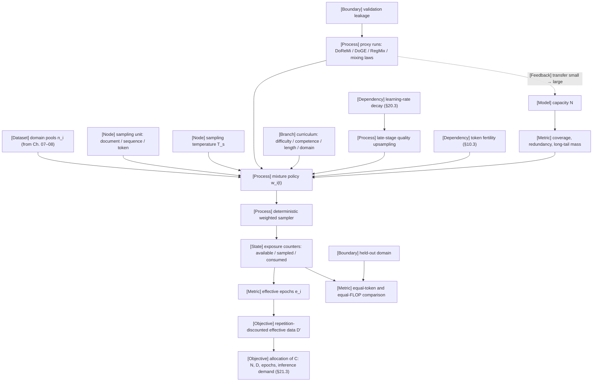

VOLUME I / PART II — DATA AND REPRESENTATION ENGINEERING / CHAPTER 09

# 09 — Data mixtures, curricula, and sample efficiency

A training run never sees "the corpus": it sees a sequence of samples drawn by a policy from finite pools, so the quantity that determines what a model learns per FLOP is the per-domain exposure that policy produces — tokens available, sampled and consumed, and the number of times each was repeated — and that quantity must be fixed, accounted and compared at equal tokens and equal FLOPs before any claim about data quality, curriculum or scale is attributable.

6 sections · 6 spine papers · 4 implementations · prerequisites: 06–08 · artifact: a mixture policy and exposure accounting report · updated 2026-09-20

## Why this chapter exists

What failed before was treating the training set as a bag. Chapters 07 and 08 deliver pools of documents with provenance and a removal ledger; the early practice was to concatenate those pools, shuffle, and train for "one epoch". That practice hides three decisions inside an accident of corpus sizes: how often each domain is visited, whether the unit drawn is a document, a packed sequence or a token, and how many times a small, valuable pool is silently repeated when it is up-weighted. PAPER-REPORTED (P03, Table 1): The Pile already made the decision explicit, listing per-component weights and "epochs" — Wikipedia seen up to three times per pass while its web component is seen once.

```figure
id: fig-9.1
kind: stat-panel
title: The Pile's per-component epochs
caption: >-
  The first published corpus card that states the repetition decision. An
  "epochs" value is the number of passes over a component during one pass over
  The Pile, so every up-weight appears as a repeat count: Wikipedia is read
  three times for each single read of Pile-CC. The effective size is 1.52× the
  raw size, so at least 429 GiB of each Pile epoch is re-read content. Only the
  components the chapter names are listed; the rest of Table 1 is in P03.
placement: rail
anchor: why-this-chapter-exists
evidence: PAPER-REPORTED
source: P03
alt: >-
  Instrument panel of values from The Pile's Table 1 as cited by the chapter
  (P03). Epochs, defined as passes over a component per full pass over The
  Pile: Pile-CC 1.0, Wikipedia (en) 3.0, Books3 1.5, PubMed Central 2.0, ArXiv
  2.0. Raw size 825.18 GiB; effective size 1,254.20 GiB; effective over raw
  1.52; effective minus raw 429.02 GiB, which is a lower bound on the re-read
  content in one Pile epoch. The up-weighting of high-quality components
  followed Brown et al. 2020.
spec:
  header: "THE PILE · TABLE 1 · EPOCHS PER PILE EPOCH"
  rows:
    - { key: "Pile-CC", value: "1.0" }
    - { key: "Wikipedia (en)", value: "3.0" }
    - { key: "Books3", value: "1.5" }
    - { key: "PubMed Central", value: "2.0" }
    - { key: "ArXiv", value: "2.0" }
    - { key: "raw size", value: "825.18 GiB" }
    - { key: "effective size", value: "1,254.20 GiB" }
    - { key: "effective ÷ raw", formula: "1254.20/825.18", format: ratio }
    - { key: "effective − raw, GiB", formula: "1254.20 - 825.18", format: fixed2, note: "lower bound on re-read content" }
    - { key: "up-weighting rule", value: "following Brown et al. 2020" }
```

The bottleneck that appeared is that the pools stopped being large relative to the budget. When a run consumes trillions of tokens, any up-weighted domain of tens of billions of tokens is repeated many times, and PAPER-REPORTED (R9.5): the value of a repeated token decays with repetition count until additional compute buys nothing. A mixture weight and a repetition count are therefore the same decision seen from two sides, and the filter of Chapter 08 sets the exchange rate between them.

```figure
id: fig-9.2
kind: memory-stack
title: One 20B-token domain at four weights in a 4T-token run
caption: >-
  The chapter's central claim in one picture. Bar height is what the run pays
  for, w·D consumed tokens; the two lower segments are what it gets, the first
  pass plus the repeats priced by Eq. 9.22 (R*_D = 15.39, fitted by R9.5 on
  English web text). At w = 2% the domain is read four times and 93% of its
  tokens still count; at 8% (16 epochs) 66%; at 20% (40 epochs) 38%. The
  hairline is the ceiling no weight can cross, 16.4 unique-data equivalents.
  Illustrative configuration, not a named model; the per-domain use of Eq.
  9.22 is the chapter's ASSUMED extension (Eq. 9.25).
placement: inline
evidence: MATHEMATICALLY-DERIVED
source: ["DERIVED:eq-9.1", "DERIVED:eq-9.22", "DERIVED:eq-9.25", R9.5]
alt: >-
  Four stacked bars in tokens for one domain of n = 20B unique tokens in a run
  of D = 4T consumed tokens, an illustrative configuration. Each bar is split
  into first pass, repeats counted at their fresh-token equivalent under Eq.
  9.22 with R*_D = 15.39, and repeats discounted away. Weight 0.5%, 1 epoch:
  20B consumed, all 20B count. Weight 2%, 4 epochs: 80B consumed, 20B first
  pass plus 54.5B fresh-equivalent, 5.5B discounted, 93% counted. Weight 8%,
  16 epochs: 320B consumed, 20B plus 191.7B, 108.3B discounted, 66% counted.
  Weight 20%, 40 epochs: 800B consumed, 20B plus 283.4B, 496.6B discounted, 38%
  counted. A budget line at n·(1 + R*_D) = 327.8B marks the most any weight can
  buy.
spec:
  format: tokens
  variables: { n: 2.0e10, D: 4.0e12, Rs: 15.39, wa: 0.005, wb: 0.02, wc: 0.08, wd: 0.2 }
  bars:
    - label: "w = 0.5% · e = 1"
      segments:
        - { label: "first pass, unique", kind: dataset, formula: "min(wa*D, n)" }
        - { label: "repeats, fresh-equivalent", kind: dataset, formula: "n*Rs*(1 - exp(-max(wa*D/n - 1, 0)/Rs))" }
        - { label: "repeats, discounted away", kind: dependency, formula: "max(wa*D - min(wa*D, n) - n*Rs*(1 - exp(-max(wa*D/n - 1, 0)/Rs)), 0)" }
    - label: "w = 2% · e = 4"
      segments:
        - { label: "first pass, unique", kind: dataset, formula: "min(wb*D, n)" }
        - { label: "repeats, fresh-equivalent", kind: dataset, formula: "n*Rs*(1 - exp(-max(wb*D/n - 1, 0)/Rs))" }
        - { label: "repeats, discounted away", kind: dependency, formula: "max(wb*D - min(wb*D, n) - n*Rs*(1 - exp(-max(wb*D/n - 1, 0)/Rs)), 0)" }
    - label: "w = 8% · e = 16"
      segments:
        - { label: "first pass, unique", kind: dataset, formula: "min(wc*D, n)" }
        - { label: "repeats, fresh-equivalent", kind: dataset, formula: "n*Rs*(1 - exp(-max(wc*D/n - 1, 0)/Rs))" }
        - { label: "repeats, discounted away", kind: dependency, formula: "max(wc*D - min(wc*D, n) - n*Rs*(1 - exp(-max(wc*D/n - 1, 0)/Rs)), 0)" }
    - label: "w = 20% · e = 40"
      segments:
        - { label: "first pass, unique", kind: dataset, formula: "min(wd*D, n)" }
        - { label: "repeats, fresh-equivalent", kind: dataset, formula: "n*Rs*(1 - exp(-max(wd*D/n - 1, 0)/Rs))" }
        - { label: "repeats, discounted away", kind: dependency, formula: "max(wd*D - min(wd*D, n) - n*Rs*(1 - exp(-max(wd*D/n - 1, 0)/Rs)), 0)" }
  budget: { label: "ceiling n·(1 + R*_D) ≈ 16.4·n", formula: "n*(1 + Rs)" }
```

The constraint that became dominant is unique tokens per domain under a fixed FLOP budget, not total corpus size. It couples to model capacity (a larger model memorises a repeated tail sooner), to the tokenizer (a token is not a fixed amount of content across languages), and to time (the same exposure late in training, under a decaying learning rate, acts differently from the same exposure early).

What changed in the solution is that the mixture became a versioned, time-indexed policy with exposure accounting: domain probabilities with a declared sampling unit, temperature and epoch caps; phase schedules that move scarce high-quality pools to the end of training; weights chosen by proxy runs rather than by intuition; and data-constrained scaling forms that price repetition. The evidence that these choices transfer from proxy scale to frontier scale is thin, and most frontier mixture weights are NOT-DISCLOSED; the chapter says so wherever it matters.

## Concept map



- [Dataset] domain pools n_i (delivered by Chapters 07–08)
  - [Process] mixture policy w_i(t), parameterised by
    - [Node] sampling unit: document / sequence / token
    - [Node] sampling temperature T_s
    - [Metric] coverage, redundancy, long-tail mass, which depend on [Model] capacity N
    - [Branch] curriculum: difficulty / competence / length / domain
    - [Process] late-stage quality upsampling, which depends on [Dependency] learning-rate decay (§20.3)
    - [Process] proxy runs (DoReMi / DoGE / RegMix / mixing laws), bounded by [Boundary] validation leakage and feeding back an unproven small → large transfer to [Model] capacity N
    - [Dependency] token fertility (§10.3)
  - [Process] deterministic weighted sampler
    - [State] exposure counters: available / sampled / consumed
      - [Metric] effective epochs e_i
        - [Objective] repetition-discounted effective data D'
          - [Objective] allocation of C across N, D, epochs and inference demand (§21.3)
      - [Metric] equal-token and equal-FLOP comparison, which also requires a [Boundary] held-out domain

## Position in the book

| Relation | Links |
|---|---|
| Prerequisites | [Chapter 06 — Experimental design](../../part-01-scientific-foundations/ch06-experimental-design-and-evaluation-before-optimization/README.md) (matched-budget comparison design is owned by [§6.3](../../part-01-scientific-foundations/ch06-experimental-design-and-evaluation-before-optimization/06-3-controlled-comparisons.md) and [§6.5](../../part-01-scientific-foundations/ch06-experimental-design-and-evaluation-before-optimization/06-5-quality-resource-frontiers.md)); [Chapter 07 — Provenance and dataset semantics](../ch07-data-provenance-acquisition-and-dataset-semantics/README.md) (dataset axes, [§7.2](../ch07-data-provenance-acquisition-and-dataset-semantics/07-2-orthogonal-dataset-axes.md)); [Chapter 08 — Cleaning, deduplication, contamination](../ch08-cleaning-deduplication-privacy-filtering-and-contamination/README.md) (quality estimation [§8.2](../ch08-cleaning-deduplication-privacy-filtering-and-contamination/08-2-quality-estimation.md), duplicate structure [§8.3](../ch08-cleaning-deduplication-privacy-filtering-and-contamination/08-3-duplicate-structure.md)) |
| Siblings (same part) | [07](../ch07-data-provenance-acquisition-and-dataset-semantics/README.md) · [08](../ch08-cleaning-deduplication-privacy-filtering-and-contamination/README.md) · [10](../ch10-tokenization-serialization-and-interface-correctness/README.md) · [11](../ch11-synthetic-data-preferences-and-interactive-trajectories/README.md) · [12](../ch12-scalable-data-infrastructure-and-reproducible-ingestion/README.md) |
| Downstream | [Chapter 10 — Tokenization](../ch10-tokenization-serialization-and-interface-correctness/README.md); [Chapter 11 — Synthetic data](../ch11-synthetic-data-preferences-and-interactive-trajectories/README.md); [Chapter 12 — Data infrastructure](../ch12-scalable-data-infrastructure-and-reproducible-ingestion/README.md); [Chapter 19 — Training loop](../../part-04-training-science-and-adaptation/ch19-pretraining-objectives-and-the-full-training-loop/README.md); [Chapter 21 — Scaling laws](../../part-04-training-science-and-adaptation/ch21-scaling-laws-and-compute-allocation/README.md); [Chapter 22 — Mid-training](../../part-04-training-science-and-adaptation/ch22-continued-pretraining-mid-training-and-domain-adaptation/README.md); [Chapter 31 — Supervised fine-tuning](../../../vol-02-execution-and-optimization/part-06-post-training-and-reinforcement-learning/ch31-supervised-fine-tuning-and-behavior-acquisition/README.md) |
| Trades off with | [§8.2 Quality estimation](../ch08-cleaning-deduplication-privacy-filtering-and-contamination/08-2-quality-estimation.md) (filter strictness vs. repetition count); [§10.3 Vocabulary economics](../ch10-tokenization-serialization-and-interface-correctness/10-3-vocabulary-economics.md) (fertility vs. content exposure per token); [§20.3 Scheduling](../../part-04-training-science-and-adaptation/ch20-optimization-schedules-and-training-stability/20-3-scheduling.md) (learning-rate decay vs. late-stage mixture shift); [§21.3 Inference-aware training](../../part-04-training-science-and-adaptation/ch21-scaling-laws-and-compute-allocation/21-3-inference-aware-training.md) (overtraining vs. unique-data exhaustion); [§22.4 Retention and interference](../../part-04-training-science-and-adaptation/ch22-continued-pretraining-mid-training-and-domain-adaptation/22-4-retention-and-interference.md) (specialist up-weighting vs. retention) |

## Sections

| § | Title | What changes here | Primary evidence labels |
|---|---|---|---|
| [9.1](09-1-mixture-formulation.md) | Mixture formulation | The corpus becomes a policy: domain probabilities over a declared sampling unit, with temperature and per-domain effective epochs as derived quantities and exposure counters as state | MATHEMATICALLY-DERIVED, PAPER-REPORTED, OFFICIAL-DOCUMENTATION |
| [9.2](09-2-quality-and-diversity.md) | Quality and diversity | Filter strictness and repetition become one budget-dependent decision; coverage and long-tail mass become measured constraints that interact with capacity | PAPER-REPORTED, DERIVED, ASSUMED |
| [9.3](09-3-curriculum-design.md) | Curriculum design | The policy becomes time-indexed; ordering by difficulty, competence, length or domain is separated from the late-stage shift that rides on learning-rate decay | PAPER-REPORTED, MATHEMATICALLY-DERIVED, DERIVED |
| [9.4](09-4-learned-mixture-selection.md) | Learned mixture selection | Weights become the output of an optimisation over proxy runs, which introduces selection bias and an unproven small-to-large transfer assumption | PAPER-REPORTED, MATHEMATICALLY-DERIVED, NOT-DISCLOSED |
| [9.5](09-5-multilingual-and-specialist-mixtures.md) | Multilingual and specialist mixtures | A token stops being a fixed unit of content; resource imbalance, cross-domain transfer and interference enter the weight vector | PAPER-REPORTED, MATHEMATICALLY-DERIVED, NOT-DISCLOSED |
| [9.6](09-6-data-scaling-limits.md) | Data scaling limits | Unique tokens become the binding constraint; repetition is priced, synthetic fractions and inference demand enter the allocation | PAPER-REPORTED, DERIVED, ASSUMED |

## Artifact

A **mixture policy and exposure accounting report**, delivered as:

- `mixture_policy.yaml` — one record per (schedule phase, domain): `phase_id, phase_start_token, phase_end_token, domain_id, source_ids (→ Chapter 07 inventory), filter_ledger_id (→ Chapter 08 removal ledger), sampling_unit ∈ {document, packed_sequence, token}, weight_kind ∈ {token, unit}, weight, sampling_temperature T_s (or null), epoch_cap, within_domain_order ∈ {permutation, with_replacement}, seed, tokenizer_id, tokenizer_hash`.
- `exposure_report.csv` — one row per (phase, domain) at each reporting step: `step, phase_id, domain_id, tokenizer_id, available_tokens, sampled_tokens, consumed_tokens, effective_epochs, max_unit_repetitions, skipped_tokens, masked_tokens, bytes_consumed, fertility_tokens_per_byte`.
- `sampler_state.json` — the resumable state of Algorithm 9.1: `step, phase_id, integer_credits[k], unit_counters[k], policy_hash, seed`.
- `comparison_manifest.json` — the matched-budget comparison record of [verification.md](verification.md): mixtures compared, equal-token and equal-FLOP budgets, held-out domain, seeds, evaluator identity.

Field definitions and invariants are in [verification.md](verification.md).

## Verification

The falsifiable task is a comparison of at least three mixture policies on the same pools, the same tokenizer and the same model family under two budget conventions — equal consumed tokens and equal training FLOPs — with one domain withheld from every mixture and from all mixture-selection signals. A policy is credited with a sample-efficiency gain only if it improves the in-mixture aggregate without degrading the held-out domain beyond a pre-registered margin, under both budget conventions, across seeds. The result that would reject the chapter's central claim is that per-domain exposure does not explain outcome differences: two policies with matched per-domain consumed tokens and repetition counts but different nominal weights and sampling units differ by more than seed noise. The protocol is in [verification.md](verification.md); the matched-budget design language is owned by [§6.3](../../part-01-scientific-foundations/ch06-experimental-design-and-evaluation-before-optimization/06-3-controlled-comparisons.md).

## Lineage

- 2009 · Curriculum Learning (R9.16) · conceptual ancestor — a curriculum as a sequence of reweighted training distributions of increasing entropy.
- 2010 · Self-Paced Learning for Latent Variable Models (R9.17) · alternative branch — the learner's own loss selects the easy samples; the threshold is annealed.
- 2019 · Competence-based Curriculum Learning for NMT (R9.18) · alternative branch — sample only examples whose difficulty is below a time-varying competence.
- 2020 · XLM-R (R9.13) and mT5 (R9.11) · engineering optimization — exponent-smoothed language sampling for imbalanced multilingual corpora.
- 2021 · The Pile (P03) · conceptual ancestor — explicit per-component weights and epochs in a published corpus.
- 2022 · Training Compute-Optimal Large Language Models (P09) · conceptual ancestor — tokens and parameters scaled together, which turned token supply into a first-order constraint.
- 2022 · Sequence length warmup (R9.19) · engineering optimization — a length curriculum used for stability at large batch and learning rate.
- 2022–2024 · Will we run out of data? (R9.6) · current frontier — stock estimates for public human text, with wide intervals.
- 2023 · DoReMi (R9.1) · current frontier — domain weights from a Group-DRO proxy; DoGE (R9.2) · alternative branch — gradient-alignment reweighting.
- 2023 · Scaling Data-Constrained Language Models (R9.5) · current frontier — a fitted price for repeated tokens and excess parameters.
- 2023 · UniMax (R9.12) · engineering optimization — epoch-capped uniform allocation replacing temperature sampling.
- 2024 · DataComp-LM (P07) · current frontier — controlled filtering and mixing tracks at fixed scales; RegMix (R9.3) and Data Mixing Laws (R9.4) · current frontier — mixtures chosen by regression or fitted laws over many small runs.
- 2024 · Llama 3 (R9.8), MiniCPM (R9.9), DeepSeekMath (P25), OLMo 2 (R9.7, 2024–2025) · current frontier — disclosed recipes with late-stage quality upsampling; the last two disclose their mixtures.
- 2024 · Beyond Chinchilla-Optimal (R9.10) · engineering optimization — inference demand enters the token/parameter allocation.
- 2025 · Scaling Laws for Optimal Data Mixtures (R9.31) · current frontier — loss predicted jointly in N, D and the weight vector.

```figure
id: fig-9.3
kind: lineage
title: Lineage of the mixture policy
caption: >-
  Read the relations, not the dates. Three ancestors define the problem: a
  curriculum as reweighting (2009), per-component epochs in a published corpus
  (2021) and joint scaling of parameters and tokens (2022). From 2023 the
  frontier splits in two: weights chosen from proxy runs (DoReMi, RegMix,
  mixing laws, the 2025 joint law) and repetition priced or capped (R9.5,
  UniMax). The 2024 recipes converge on late-stage quality upsampling; only
  DeepSeekMath and OLMo 2 disclose their mixtures.
placement: inline
evidence: PAPER-REPORTED
source: [R9.16, R9.17, R9.18, R9.13, R9.11, P03, P09, R9.19, R9.6, R9.1, R9.2, R9.5, R9.12, P07, R9.3, R9.4, R9.8, R9.9, P25, R9.7, R9.10, R9.31]
alt: >-
  Timeline of twenty entries from the chapter's Lineage list. 2009 Curriculum
  Learning (R9.16), conceptual ancestor. 2010 Self-Paced Learning (R9.17),
  alternative branch. 2019 Competence-based Curriculum Learning (R9.18),
  alternative branch. 2020 XLM-R and mT5 (R9.13, R9.11), engineering
  optimization. 2021 The Pile (P03), conceptual ancestor. 2022 Chinchilla
  (P09), conceptual ancestor. 2022 sequence length warmup (R9.19), engineering
  optimization. 2022, revised 2024, Will we run out of data? (R9.6), current
  frontier. 2023 DoReMi (R9.1), current frontier. 2023 DoGE (R9.2),
  alternative branch. 2023 Scaling Data-Constrained Language Models (R9.5),
  current frontier. 2023 UniMax (R9.12), engineering optimization. 2024
  DataComp-LM (P07), RegMix (R9.3) and Data Mixing Laws (R9.4), current
  frontier. 2024 Llama 3 with MiniCPM (R9.8, R9.9), DeepSeekMath (P25) and
  OLMo 2 (R9.7), current frontier. 2024 Beyond Chinchilla-Optimal (R9.10),
  engineering optimization. 2025 Scaling Laws for Optimal Data Mixtures
  (R9.31), current frontier.
spec:
  entries:
    - { year: 2009, work: "Curriculum Learning", cite: R9.16, relation: "conceptual ancestor", node: ms.section.9.3, note: "a curriculum as a sequence of reweighted training distributions of increasing entropy" }
    - { year: 2010, work: "Self-Paced Learning for Latent Variable Models", cite: R9.17, relation: "alternative branch", node: ms.section.9.3, note: "the learner's own loss selects easy samples; the threshold is annealed" }
    - { year: 2019, work: "Competence-based Curriculum Learning for NMT", cite: R9.18, relation: "alternative branch", node: ms.section.9.3, note: "sample only examples whose difficulty is below a time-varying competence" }
    - { year: 2020, work: "XLM-R and mT5", cite: R9.13, relation: "engineering optimization", node: ms.section.9.5, note: "exponent-smoothed language sampling for imbalanced multilingual corpora; mT5 is R9.11" }
    - { year: 2021, work: "The Pile", cite: P03, relation: "conceptual ancestor", node: ms.section.9.1, note: "explicit per-component weights and epochs in a published corpus" }
    - { year: 2022, work: "Training Compute-Optimal Large Language Models", cite: P09, relation: "conceptual ancestor", node: ms.section.9.6, note: "tokens and parameters scaled together, making token supply a first-order constraint" }
    - { year: 2022, work: "Sequence length warmup", cite: R9.19, relation: "engineering optimization", node: ms.section.9.3, note: "a length curriculum used for stability at large batch and learning rate" }
    - { year: 2022, work: "Will we run out of data?", cite: R9.6, relation: "current frontier", node: ms.section.9.6, note: "2022–2024: stock estimates for public human text, with wide intervals" }
    - { year: 2023, work: "DoReMi", cite: R9.1, relation: "current frontier", node: ms.section.9.4, note: "domain weights from a Group-DRO proxy" }
    - { year: 2023, work: "DoGE", cite: R9.2, relation: "alternative branch", node: ms.section.9.4, note: "gradient-alignment reweighting" }
    - { year: 2023, work: "Scaling Data-Constrained Language Models", cite: R9.5, relation: "current frontier", node: ms.section.9.6, note: "a fitted price for repeated tokens and excess parameters" }
    - { year: 2023, work: "UniMax", cite: R9.12, relation: "engineering optimization", node: ms.section.9.5, note: "epoch-capped uniform allocation replacing temperature sampling" }
    - { year: 2024, work: "DataComp-LM", cite: P07, relation: "current frontier", node: ms.section.9.2, note: "controlled filtering and mixing tracks at fixed scales" }
    - { year: 2024, work: "RegMix", cite: R9.3, relation: "current frontier", node: ms.section.9.4, note: "mixtures chosen by regression over many small runs" }
    - { year: 2024, work: "Data Mixing Laws", cite: R9.4, relation: "current frontier", node: ms.section.9.4, note: "mixtures chosen by fitted laws over small runs" }
    - { year: 2024, work: "Llama 3 and MiniCPM", cite: R9.8, relation: "current frontier", node: ms.section.9.3, note: "recipes with late-stage quality upsampling; MiniCPM is R9.9; mixtures not disclosed per source" }
    - { year: 2024, work: "DeepSeekMath", cite: P25, relation: "current frontier", node: ms.section.9.5, note: "disclosed recipe that also discloses its mixture" }
    - { year: 2024, work: "OLMo 2", cite: R9.7, relation: "current frontier", node: ms.section.9.3, note: "2024–2025: late-stage upsampling with disclosed mixtures" }
    - { year: 2024, work: "Beyond Chinchilla-Optimal", cite: R9.10, relation: "engineering optimization", node: ms.section.9.6, note: "inference demand enters the token/parameter allocation" }
    - { year: 2025, work: "Scaling Laws for Optimal Data Mixtures", cite: R9.31, relation: "current frontier", node: ms.section.9.4, note: "loss predicted jointly in N, D and the weight vector" }
```

## Terms owned here

| Term | One-line definition | Section |
|---|---|---|
| mixture policy | The versioned, time-indexed map from training position to a probability vector over domains, with a declared sampling unit, order rule and seed. | 9.1 |
| sampling unit | The object the sampler draws — document, packed sequence or token — which fixes whether a weight is a unit share or a token share. | 9.1 |
| sampling temperature (mixture) | The exponent parameter T_s in `p_i ∝ n_i^{1/T_s}` that interpolates between size-proportional (T_s = 1) and uniform (T_s → ∞) domain sampling. | 9.1 |
| effective epochs | Consumed tokens of a domain divided by its available tokens under the named tokenizer. | 9.1 |
| available / sampled / consumed tokens | Tokens in a pool after filtering; tokens emitted by the sampler; tokens that contributed to a retained optimiser step with non-zero loss mask. | 9.1 |
| exposure accounting | The per-phase, per-domain ledger of available, sampled and consumed tokens, effective epochs and maximum unit repetitions. | 9.1 |
| mixture coverage | The reference-distribution mass of content cells that receive at least a stated minimum of consumed tokens. | 9.2 |
| mixture redundancy | One minus unique consumed tokens over consumed tokens, counted over near-duplicate clusters and repetitions together. | 9.2 |
| long-tail retention | The fraction of low-frequency cells of the unfiltered pool that survive filtering and sampling with at least the minimum exposure. | 9.2 |
| data curriculum | A mixture policy whose weights depend on training position through a difficulty, competence, length or domain rule. | 9.3 |
| late-stage quality upsampling | A terminal schedule phase that raises the weight of scarce high-quality pools while the learning rate decays. | 9.3 |
| proxy run | A reduced-scale training run whose only product is a signal used to choose the mixture for a larger run. | 9.4 |
| excess loss (domain reweighting) | Per-token proxy loss minus reference-model loss, clipped at zero, as used by DoReMi. | 9.4 |
| rank-invariance assumption | The assumption that the ordering of mixtures by outcome is preserved across model size and token budget. | 9.4 |
| selection leakage (mixture) | Optimistic bias created when the signal used to choose a mixture is also, or is correlated with, the reported evaluation. | 9.4 |
| content-share weight | A domain weight expressed in bytes or words rather than tokens, related to the token weight through fertility. | 9.5 |
| cross-domain transfer matrix | The matrix of sensitivities of each validation domain's loss to each training domain's weight along the simplex. | 9.5 |
| data-constrained regime | The regime in which the planned consumed tokens exceed the unique available tokens of at least one weighted domain. | 9.6 |
| repetition-discounted effective data | Unique tokens plus a saturating contribution from repetitions, in the form fitted by R9.5. | 9.6 |
| synthetic fraction | The share of consumed tokens whose text was produced by a model, reported per phase. | 9.6 |

## Reference-stack coverage

Rows bind the chapter to `Instruction/AI_REFERENCE_STACK.md`. "Surface used" is the URL exactly as the reference stack lists it; where the primary text was opened through arXiv rather than the lab's own surface, the row says so. Pages opened and dates are in [references.md](references.md).

| Stack section | Entry | Stack layer | What this chapter takes from it | Surface used | Sections | Evidence label |
|---|---|---|---|---|---|---|
| §1 lab | #3 Google DeepMind | — | DoReMi (R9.1): Group-DRO minimax objective, clipped excess loss, exponentiated-gradient weight update, 280M proxy → 8B main model. Chinchilla (P09): equal scaling of parameters and tokens. Texts opened via arXiv / ar5iv, not the lab index. | Papers: https://deepmind.google/research/publications/ | 9.4, 9.6 | PAPER-REPORTED |
| §1 lab | #22 Allen Institute for AI (Ai2) | — | OLMo 2 (R9.7): OLMo 2 Mix 1124 and Dolmino Mix 1124 compositions, two-stage recipe, learning rate decayed linearly to zero, checkpoint averaging over data orders, microanneals. Dolma (P05) as the open corpus lineage. | Papers: https://allenai.org/papers | 9.1, 9.3, 9.5, 9.6 | PAPER-REPORTED |
| §1 lab | #27 Hugging Face Research | — | FineWeb (P06): per-snapshot versus global deduplication ablation; `datasets` streaming documentation (R9.35): `interleave_datasets` probabilities, seed, stopping strategies, iterable-dataset `state_dict`. Scaling Data-Constrained LMs (R9.5) is co-authored from this lab and released at `github.com/huggingface/datablations`. | Papers: https://huggingface.co/papers · Code: https://github.com/huggingface | 9.1, 9.2, 9.6 | PAPER-REPORTED / OFFICIAL-DOCUMENTATION |
| §1 lab | #8 DeepSeek | — | DeepSeekMath (P25): 120B-token math corpus, the disclosed 500B-token continued-pretraining mixture, code-before-math findings, arXiv-ineffectiveness finding, 10-gram decontamination. | Papers: https://github.com/deepseek-ai | 9.3, 9.5 | PAPER-REPORTED |
| §1 lab | #4 Meta AI / FAIR | — | Llama 3 (R9.8): category-level data mix, scaling-law experiments for the mix, annealing as a data-quality probe, staged context extension, final annealing with checkpoint averaging. XLM-R (R9.13), D4 (R9.25). Per-source weights NOT-DISCLOSED. | Papers: https://ai.meta.com/results/?content_types%5B0%5D=publication | 9.2, 9.3, 9.5 | PAPER-REPORTED / NOT-DISCLOSED |
| §1 lab | #5 Alibaba Qwen | — | Qwen3 technical report (R9.30): 36T tokens, 119 languages, three pre-training stages, instance-level mixture optimisation on proxy models; domain weights NOT-DISCLOSED. | Papers: https://qwenlm.github.io/ | 9.3, 9.4, 9.5 | PAPER-REPORTED / NOT-DISCLOSED |
| §1 lab | #25 Databricks / Mosaic AI Research | — | Domain upsampling at the end of training (R9.21); Beyond Chinchilla-Optimal (R9.10). | Papers: https://www.databricks.com/research | 9.3, 9.6 | PAPER-REPORTED |
| §1 lab | #18 Google Research | — | mT5 (R9.11) language-sampling exponent; UniMax (R9.12) epoch-capped allocation. Opened via arXiv / ar5iv. | Papers: https://research.google/pubs/ | 9.1, 9.5 | PAPER-REPORTED |
| §1 lab | #1 Anthropic | — | Scaling Laws and Interpretability of Learning from Repeated Data (R9.24): a small repeated fraction degrades a model disproportionately. Opened via arXiv. | Papers: https://www.anthropic.com/research | 9.2, 9.6 | PAPER-REPORTED |
| §2 conference | #1 NeurIPS | — | Archival venue of R9.1, R9.5, R9.14, R9.19, R9.20, R9.25, R9.31 and R9.17 (NIPS 2010). The R9.1 proceedings PDF was located and the R9.17 abstract page opened; other archival versions not separately opened. | Papers: https://proceedings.neurips.cc/ | 9.1–9.6 | PAPER-REPORTED |
| §2 conference | #3 ICLR | — | Archival venue of RegMix (R9.3) and Data Mixing Laws (R9.4), ICLR 2025; located via the ICLR proceedings listing; texts read from arXiv HTML. | Papers: https://openreview.net/group?id=ICLR.cc/2026/Conference | 9.4 | PAPER-REPORTED |
| §2 conference | #2 ICML | — | Archival venue of R9.16 (ICML 2009), R9.10 (ICML 2024), R9.26 (ICML 2023). | Papers: https://proceedings.mlr.press/ | 9.2, 9.3, 9.6 | PAPER-REPORTED |
| §3 discovery source | #1 arXiv | — | Primary route for every paper in `references.md` (abs pages; arXiv HTML; ar5iv renderings for pre-2024 papers; two PDFs with local text extraction). | Home: https://arxiv.org/ · Search/API: https://arxiv.org/search/advanced | 9.1–9.6 | PAPER-REPORTED |
| §3 discovery source | #4 NeurIPS Proceedings | — | Located the archival DoReMi paper; opened the abstract page of R9.17. | Home: https://proceedings.neurips.cc/ | 9.3, 9.4 | PAPER-REPORTED |
| §3 discovery source | #2 OpenReview | — | Route for the reviewed ICLR 2025 versions and discussions of R9.3 and R9.4; forum pages not opened in this edition. | Home: https://openreview.net/ | 9.4 | UNVERIFIED |
| §4 system | #33 MosaicML LLM Foundry | Distributed training | Its data layer, StreamingDataset (R9.33, R9.34): per-stream `proportion` / `repeat` / `choose`, `epoch_size`, `batching_method` including `stratified`, stateful mid-epoch resumption. The repository README confirms conversion to StreamingDataset format and training with Composer (R9.38). | docs/code: https://docs.mosaicml.com/projects/llm-foundry/ | 9.1, 9.3 | OFFICIAL-DOCUMENTATION |
| §4 system | #24 Megatron-LM | Distributed training | `megatron/core/datasets` readme (R9.36): IndexedDataset `.bin`/`.idx`, GPTDataset document / sample / shuffle indices built from a seed, BlendedDataset drawing from constituent datasets in proportion to weights up to a target size, hashed index caches. | docs/code: https://github.com/NVIDIA/Megatron-LM | 9.1 | OFFICIAL-DOCUMENTATION |
| §4 system | #21 TorchTitan | Distributed training | README (R9.37): checkpointable data loading with C4 pre-configured, custom-dataset hook, distributed checkpointing that includes dataloader state. Mixture support beyond a single dataset is NOT-DISCLOSED in the pages opened. | docs/code: https://github.com/pytorch/torchtitan | 9.1 | OFFICIAL-DOCUMENTATION |
| §4 system | #17 PyTorch | Model / autograd framework | `torchdata` `StatefulDataLoader` named by the Hugging Face documentation (R9.35) as the loader that carries iterable-dataset state; no property asserted beyond that page. | docs/code: https://pytorch.org/docs/stable/ | 9.1 | OFFICIAL-DOCUMENTATION |
| §4 system | #35 Nanotron | Distributed training | Named as the Hugging Face research trainer in the FineWeb lineage; its mixture interface was not opened. | docs/code: https://github.com/huggingface/nanotron | 9.1 | NOT-DISCLOSED |
| *Outside the reference stack (routed via book_plan.md anchors)* | Epoch AI — "Will we run out of data?" (R9.6) | — | Stock and exhaustion-date estimates with intervals. Epoch AI is a ranking-signal source in the reference stack's §0 and a measurement source in Appendix G; the plan's Chapter 09 guidance names it for data-stock estimates. | https://epoch.ai/data/ai-models (stack-listed surface); paper page opened: see R9.6 | 9.6 | PAPER-REPORTED |
| *Outside the reference stack (routed via book_plan.md anchors)* | Works from groups not in §1: DoGE (EPFL, R9.2), RegMix (Sea AI Lab et al., R9.3), Data Mixing Laws (Fudan, R9.4), MiniCPM (OpenBMB / Tsinghua, R9.9), ODM (R9.22) | — | Named by the plan's Chapter 09 matrix rows ("proxy runs, reweighting, bandit-style allocation") and reached through the §3.1 paper cascade on arXiv, a stack-listed discovery source. | https://arxiv.org/ | 9.3, 9.4 | PAPER-REPORTED |

**Inspection dimensions applied.** Of the §4.2 dimensions, this chapter analyses *Memory* only through sequence packing as the sampling unit (§9.1) and the attention-term cost of long sequences in length curricula (§9.3); *Checkpointing* as sampler-state restart semantics — what must be saved for the exposure ledger to survive a restart (§9.1, Algorithm 9.1, and the forward link to §12.5); *Metrics* as tokens consumed versus FLOPs spent, with the 6ND regime stated (§9.3, §9.6, verification); *Reliability* as the divergence between sampled and consumed tokens under skipped batches and rollbacks (§9.1); and *Reproducibility* as seed, policy hash, tokenizer hash and integer-exact sampling (§9.1 and every section's Reproducibility heading). *Parallelism* appears only as the requirement that data order be independent of world size (§9.1). *Precision*, *Communication*, *Kernels*, *Post-training* and *Inference* are not analysed here; inference demand enters §9.6 only as a token count in the allocation objective, with the mechanism owned by §21.3.

## Source route

1. Paper cascade (§3.1): arXiv advanced search `cat:cs.CL AND (ti:"data mixture" OR ti:"domain reweighting" OR abs:"domain weights")` → resolve DoReMi, DoGE, RegMix, Data Mixing Laws; then `site:proceedings.neurips.cc "DoReMi" "Xie"` for the archival NeurIPS 2023 version and `site:openreview.net/forum ICLR "RegMix"` for the reviewed ICLR 2025 version.
2. Lab-level protocol (§1.1), Ai2: `site:allenai.org/papers "OLMo 2" OR site:arxiv.org/abs "Allen Institute for AI" "OLMo 2"` → the technical report; then `site:github.com/allenai "dolmino"` and the model hub for the released mixes and configs.
3. Lab-level protocol (§1.1), training-detail template: `"Llama 3" (training OR pretraining OR post-training OR inference OR architecture) filetype:pdf` → §3.1–§3.4 of the Llama 3 report for data mix, annealing and the training recipe; the same template with `"Qwen3"` and `"DeepSeekMath"`.
4. Conference workflow (§2.1): `site:proceedings.neurips.cc "data-constrained" 2023` and `site:proceedings.mlr.press "inference" "scaling laws" "International Conference on Machine Learning"` → the archival versions of R9.5 and R9.10; ACL Anthology `site:aclanthology.org "language sampling" multilingual` for the multilingual sampling lineage.
5. Training-stack search protocol (§4.3): `"MosaicML LLM Foundry" official documentation distributed training` → Streaming "mixing data sources"; `site:github.com "Megatron-LM" (architecture OR design OR RFC OR benchmark) blended dataset` → `megatron/core/datasets/readme.md`; `site:github.com "TorchTitan" (OOM OR deadlock OR NCCL OR RCCL OR checkpoint OR hang) dataloader` → dataloader-state checkpoint issues.
6. Measurement source: Epoch AI publication page for the data-stock paper, then the arXiv v2 (June 2024) for the intervals; use the estimate only with its interval and date.

## Status

Editorial status: `manuscript_draft`. Evidence coverage: mechanism claims are MATHEMATICALLY-DERIVED from the stated sampling model or PAPER-REPORTED / OFFICIAL-DOCUMENTATION from sources opened on 2026-09-20; no measurement in this chapter is the book's own, and every experiment is a proposal.

NOT-DISCLOSED / UNVERIFIED items carried by this chapter:

- Per-source pretraining mixture weights, sampling temperatures, epoch caps and per-domain repetition counts of closed frontier models are NOT-DISCLOSED. Llama 3 (R9.8) discloses four category shares only; Qwen3 (R9.30) discloses stage token counts and no domain weights.
- Synthetic fractions of frontier pretraining corpora are NOT-DISCLOSED.
- Transfer of proxy-optimised weights beyond the scales the papers tested (8B for R9.1; 1B with comparisons to 7B for R9.3; 1B for R9.4; 684M for R9.2) is UNVERIFIED; no independent replication at frontier scale was found.
- The per-domain use of the R9.5 effective-data form (§9.6, Eq. 9.25) is an ASSUMED extension; the constants were fitted on English web text only, and their values for code, mathematics or other languages are UNVERIFIED.
- The specific functional forms of the competence schedule in R9.18 were not re-read beyond the abstract; the parametrisation in §9.3 is the book's and is marked ASSUMED.
- DoGE's peer-reviewed venue, and the OpenReview discussion threads of R9.3 and R9.4, were not opened: UNVERIFIED.
- Mixture interfaces of Nanotron and TorchTitan beyond the pages opened are NOT-DISCLOSED here; software version strings are recorded only where a fetched page showed one.
- Algorithm 9.1 and the artifact files have not been executed: their behaviour is MATHEMATICALLY-DERIVED from integer arithmetic, and any implementation is UNVERIFIED until the verification protocol is run.
