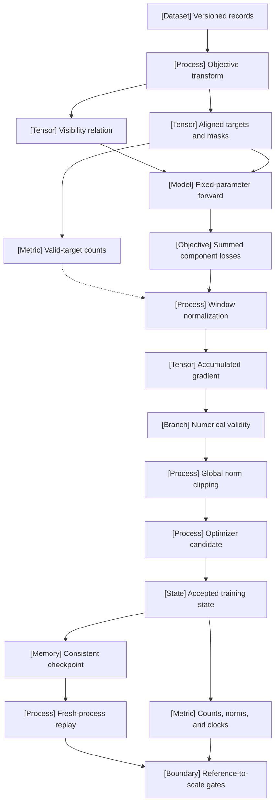

VOLUME I / PART IV — TRAINING SCIENCE AND ADAPTATION / CHAPTER 19

# 19 — Pretraining objectives and the full training loop

[MATHEMATICALLY-DERIVED] A reproducible training recipe specifies the scored-event measure and the complete accepted state transition; changing its execution preserves that recipe only when both contracts remain satisfied.

6 sections · 3 spine papers · 3 implementations · prerequisites: 04,06,12–18 · artifact: a complete single-device reference training recipe · updated 2026-10-08

## Why this chapter exists

[MATHEMATICALLY-DERIVED] A loss function and an optimizer name do not determine a training process. The same next-token loss can use different masks, denominators, microbatch partitions, schedules, and random realizations. A model checkpoint can preserve weights while omitting the moments and logical data position needed for the next update. Consequently, matching scalar loss or loading a tensor file does not establish that two runs implement the same recipe.

[OFFICIAL-DOCUMENTATION] The historical Transformers accumulation defect supplies a concrete example: averaging token-loss means from separate batches changed the weighting relative to a mean over the complete window's valid targets. PyTorch separately documents numerical-scale consistency within an accumulated batch and the need for optimizer state in a training checkpoint. These are distinct contracts at the objective, numerical, and state boundaries. [R19.23], defect analysis; [R19.22], accumulation; [R19.26], general checkpoint.

[DERIVED] The reference recipe therefore connects objective records to valid-target counts, counts to gradients, gradients to accepted updates, and accepted updates to resumable state. Its monitoring retains the same denominators and clocks. The handoff to Part V tests these invariants before treating a faster or larger execution as an equivalent training system. Technical quality is established by explicit premises, inspectable evidence, and falsifiable checks; no benchmark rank is inferred from source prestige.

## Concept map

- Versioned records
  - Objective transform
    - Visibility relation
    - Aligned targets and masks
      - Valid-target counts
- Fixed-parameter forward
  - Summed component losses
  - Window normalization, dependent on valid-target counts
    - Accumulated gradient
    - Numerical validity
    - Global norm clipping
    - Optimizer candidate
- Accepted training state
  - Consistent checkpoint
    - Fresh-process replay
  - Counts, norms, and clocks
  - Reference-to-scale gates, informed by replay and telemetry

## Position in the book

| Relation | Canonical location |
|---|---|
| Prerequisites | [Objectives, Chapter 04](../../part-01-scientific-foundations/ch04-language-modeling-and-learning-objectives/README.md); [experimental design, Chapter 06](../../part-01-scientific-foundations/ch06-experimental-design-and-evaluation-before-optimization/README.md); [ingestion, Chapter 12](../../part-02-data-and-representation-engineering/ch12-scalable-data-infrastructure-and-reproducible-ingestion/README.md); [architectures, Part III](../../part-03-model-architectures-and-state/README.md) |
| Siblings (same part) | [Optimizer mechanisms, Chapter 20](../ch20-optimization-schedules-and-training-stability/README.md); [compute allocation, Chapter 21](../ch21-scaling-laws-and-compute-allocation/README.md) |
| Downstream | [Hardware and distributed execution, Part V](../../../vol-02-execution-and-optimization/part-05-hardware-kernels-and-distributed-execution/README.md) |
| Trades off with | [Numerical representation, Chapter 03](../../part-01-scientific-foundations/ch03-numerical-computation-and-trustworthy-training/README.md); [data mixture, §9.1](../../part-02-data-and-representation-engineering/ch09-data-mixtures-curricula-and-sample-efficiency/09-1-mixture-formulation.md) |

## Sections

| Section | Title | What changes here | Primary evidence labels |
|---|---|---|---|
| [19.1](19-1-objective-selection.md) | Objective selection | Objective families become records with explicit visibility, targets, masks, and component denominators | PAPER-REPORTED; MATHEMATICALLY-DERIVED |
| [19.2](19-2-batch-semantics.md) | Batch semantics | A window-wide event measure constrains accumulation and distributed reduction | MATHEMATICALLY-DERIVED; OFFICIAL-DOCUMENTATION |
| [19.3](19-3-parameter-updates.md) | Parameter updates | Numerical and optimizer operations enter one ordered accepted transition | MATHEMATICALLY-DERIVED; OFFICIAL-DOCUMENTATION |
| [19.4](19-4-training-state-transitions.md) | Training-state transitions | Checkpoints close over the state determining the next update | MATHEMATICALLY-DERIVED; OFFICIAL-DOCUMENTATION |
| [19.5](19-5-monitoring.md) | Monitoring | Counts, slices, norms, and clocks define observable quantities | MATHEMATICALLY-DERIVED; PAPER-REPORTED |
| [19.6](19-6-reference-to-scale-handoff.md) | Reference-to-scale handoff | Equivalence and resource evidence bound execution changes | DERIVED; PAPER-REPORTED |

## Artifact

[DERIVED] The artifact is a mathematical single-device training recipe and its verification specification. It comprises an objective record (visibility, targets, masks, weights); a window ledger (ordered records, per-component counts, partial-window policy); an update record (precision, scale, clipping, groups, schedule clock); a checkpoint manifest (complete state identity and payload integrity); a monitoring record (sums/counts, attempts, accepted updates, raw diagnostics); and a handoff ledger (tested transformation, tolerances, resources, unresolved conditions). The manuscript defines these fields and transitions without programming-code listings.

## Verification

[DERIVED] The [verification protocol](verification.md) attempts to falsify the recipe through tiny-corpus fitting, full-batch/accumulation gradient comparisons, fresh-process checkpoint replay, mixture-controlled monitoring, and bounded execution-handoff comparisons. A scalar-loss match cannot substitute for gradient and persistent-state checks. This edition has not executed those training experiments.

## Lineage

- 2020 · P02, T5 · **conceptual ancestor**: objective construction tied to architecture and transfer evaluation.
- 2021 · P44, CLIP · **alternative branch**: batch-dependent pairing objectives require coupled candidate sets.
- 2022 · R19.18, FIM · **alternative branch**: serialization changes admissible conditioning without requiring an encoder-decoder.
- 2024 · R19.19, multi-token prediction · **alternative branch**: extra prediction paths require component counts and activation-lifetime accounting.
- 2024 · R19.23, Transformers disclosure · **engineering optimization**: correct accumulated target weighting; no speedup is asserted.
- 2025 · R19.28, OLMo 2 · **engineering optimization**: inspect gradients and state in stability ablations.

The dated works and precise uses are recorded in [references.md](references.md); lineage identifies relationships rather than a performance ordering.

## Terms owned here

| Term | Definition | Owner |
|---|---|---|
| Optimizer-step batch | The finite scored-event set supplying one parameter update | [19.2](19-2-batch-semantics.md#formulation) |
| Accepted-update boundary | The point at which parameters, persistent optimizer state, and declared update clocks commit consistently | [19.3](19-3-parameter-updates.md#algorithm) |
| Training-state closure | The retained state sufficient to determine the next declared training transition | [19.4](19-4-training-state-transitions.md#formulation) |
| Reference-to-scale gate | A finite invariant, numerical, or resource comparison bounding an execution transformation | [19.6](19-6-reference-to-scale-handoff.md#algorithm) |

Canonical gradient accumulation remains in Chapter 03; objective probability constructions remain in Chapter 04; packing and logical ingestion cursors remain in Chapter 12; optimizer recurrences remain in Chapter 20.

## Reference-stack coverage

| Stack section | Entry | Stack layer | What this chapter takes from it | Surface used | Sections | Evidence label |
|---|---|---|---|---|---|---|
| §1 lab | OpenAI (#2) | — | CLIP and FIM | https://github.com/openai | 19.1–19.2 | PAPER-REPORTED |
| §1 lab | Google Research (#18) | — | Historical T5 objective comparisons | https://research.google/pubs/ | 19.1 | PAPER-REPORTED |
| §1 lab | Meta AI / FAIR (#4) | — | Multi-token prediction methodology | https://github.com/facebookresearch | 19.1 | PAPER-REPORTED |
| §1 lab | DeepSeek (#8) | — | Disclosed training schedule and precision comparisons | https://github.com/deepseek-ai | 19.2,19.6 | PAPER-REPORTED |
| §1 lab | Allen Institute for AI (Ai2) (#22) | — | OLMo 2 monitoring and stability evidence | https://allenai.org/papers | 19.5 | PAPER-REPORTED |
| §2 conference | 2 ICML | — | Archival CLIP paper | https://proceedings.mlr.press/ | 19.1–19.2 | PAPER-REPORTED |
| §3 discovery source | 1 arXiv | — | Primary full-text retrieval; no discovery-based mechanism claims | https://arxiv.org/ | 19.1,19.2,19.5,19.6 | OFFICIAL-DOCUMENTATION |
| §4 system | PyTorch (#17) | MODEL / AUTOGRAD FRAMEWORK | Loss, precision, optimizer, checkpoint, reproducibility contracts | https://pytorch.org/docs/stable/ | 19.1–19.6 | OFFICIAL-DOCUMENTATION |
| §4 system | TorchTitan (#21) | DISTRIBUTED TRAINING | Pinned trainer/loss count interfaces | https://github.com/pytorch/torchtitan | 19.1–19.2,19.6 | OFFICIAL-DOCUMENTATION |
| §4 system | Hugging Face Transformers (#26) | MODEL DEFINITION / ADAPTATION | Historical accumulation defect | https://huggingface.co/docs/transformers/ | 19.2 | OFFICIAL-DOCUMENTATION |

**Inspection dimensions applied.** Parallelism and Communication (§§19.2,19.6); Precision and Memory (§§19.1–19.4,19.6); Checkpointing (§19.4); Metrics and Reliability (§§19.3–19.6); Reproducibility (all sections). Kernels are bounded by operator/allocation contracts; installed paths are UNVERIFIED. Post-training and inference mechanisms are outside this chapter. JMLR is outside the stack's discovery list but supplies the archival P02 explicitly anchored by Appendix D; CS336 is a plan-anchored prerequisite route, not evidence for the research results.

## Source route

Follow the reference stack's lab index → publication → full primary text → official artifact workflow, conference proceedings → exact paper → supplementary/code route, arXiv/OpenReview → archival venue → bibliographic cross-check → official code cascade, and official-docs-first systems protocol. Concrete queries are “site:arxiv.org/abs DeepSeek pretraining”; “site:allenai.org/papers OLMo 2”; “site:proceedings.mlr.press Learning Transferable Visual Models”; “PyTorch official documentation gradient accumulation”; and “site:github.com TorchTitan checkpoint”. Discovery order is not an evidence-quality ranking; the relevant method or API text must support the specific claim.

## Status

All six sections are manuscript drafts with mathematical algorithms and source-linked figures. No book-authored training experiment, independent benchmark reproduction, or installed-runtime compatibility check is claimed. Remaining gaps include unpinned FIM/MTP PDF revisions, storage publication guarantees, numerical equivalence tolerances, and measured resource/energy/cost data. These block a reviewed or released status; their scope is explicit in [verification.md](verification.md) and [references.md](references.md).
