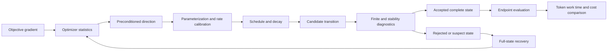

# Optimization, schedules, and training stability

[DERIVED] A pretraining recipe is a state transition, not a learning-rate curve attached to an optimizer name. Its state includes parameters, adaptive statistics, accepted-update counters, stochastic and data positions, precision controls, and, in sparse models, router adaptation. Optimizer mechanics determine the direction and stored history; parameterization determines how that direction scales with width and depth; the schedule determines when it is applied; instrumentation determines whether a failure can be located; recovery determines which state survives. Their coupling explains why a locally successful intervention need not transfer to a larger or longer run.

[PAPER-REPORTED] This chapter connects the Adam, AdamW, Adafactor, and Muon methods to the reported training behavior of OLMo 2, DeepSeek-V3, Kimi K2, and Llama 3. It retains the negative evidence: Adam's original blanket convergence argument is insufficient, naive factored updates can fail, a production precision ablation can diverge, late cooldown and short training can change schedule rankings, and a faster distributed optimizer can have a worse final-step metric than its best earlier checkpoint. [R20.1; R20.2; R20.3; R20.10; P13; R20.11; R20.18; R20.27; R20.17]

## Chapter map

| Topic | Technical development |
|---|---|
| [20.1 Optimizer mechanics](20-1-optimizer-mechanics.md) | Exact state recurrences, decay conventions, factored moments, finite matrix transforms, update calibration, and persistent versus temporary memory. |
| [20.2 Hyperparameter scaling](20-2-hyperparameter-scaling.md) | Local noise/curvature analysis, token and momentum clocks, width parameterization, residual depth scaling, and optimizer-specific transfer. |
| [20.3 Scheduling](20-3-scheduling.md) | Warmup transients, cosine and linear decay, WSD and cooldown branches, restarts, budget matching, and cumulative weight decay. |
| [20.4 Stability instrumentation](20-4-stability-instrumentation.md) | Gradient and update statistics, activations, attention maxima, router load, nonfinite boundaries, and source-reported diagnostic failures. |
| [20.5 Recovery interventions](20-5-recovery-interventions.md) | Full-state containment, batch isolation, rollback, clipping, rate changes, precision reconstruction, and causal limitations of a successful retry. |
| [20.6 Comparative evidence](20-6-comparative-evidence.md) | Quality-target accounting, tuning fairness, seed and architecture boundaries, endpoint dependence, and 2026 algorithmic and systems comparisons. |

[DERIVED] Chapters 2 and 3 supply probability, differentiation, and numerical-computation prerequisites; Chapter 19 supplies the pretraining objective and workload. This chapter owns optimizer state, schedule semantics, and training-stability reasoning. Data construction belongs to Chapters 17-18, statistical inference to Chapter 6, scaling-law model selection to Chapter 13, and distributed execution to Chapters 29-30. Downstream adaptation and fine-tuning use the state and accounting distinctions developed here in Chapters 21-22.

## Dependency graph

- Objective gradients update optimizer statistics and produce a preconditioned direction.
  - Parameterization and rate calibration determine the scale of that direction.
  - Schedule and weight decay produce the candidate transition.
- Diagnostics inspect the candidate and the boundaries that produced it.
  - Acceptance retains the complete new state.
  - A rejected or suspect state invokes recovery from a recorded complete state.
- Endpoint evaluation compares the resulting training procedure.
  - Token, computational work, elapsed time, and economic cost remain separate measurements.

## Mathematical contract

[DERIVED] The optimizer update index $k$ counts accepted updates unless an algorithm explicitly states otherwise. $g_k$ is the synchronized, objective-normalized, unscaled gradient. Adam's first raw moment is written $a_k$ to avoid reusing the book's $m$ loss mask. Its second raw moment is $v_k$. The rate is $\eta_k$ and decoupled weight-decay coefficient is $\omega_k$; neither is the loss-reduction denominator. Matrix shapes are declared at their point of use, and finite Newton-Schulz iterations are distinguished from an ideal polar factor. Equations 20.1-20.11 carry the derivation and accounting contracts.

[MATHEMATICALLY-DERIVED] State-memory counts retain their assumptions. Two FP32 Adam arrays require $8N$ bytes for $N$ parameters before master parameters, gradients, activations, sharding, and workspace. Factoring an $r\times c$ second moment reduces that statistic from $rc$ to $r+c$ entries, while a retained first-moment matrix restores linear state. A finite matrix transform has arithmetic cost proportional to its iteration count and matrix shape; it cannot be represented by the scalar-update count alone.

## Source basis and improvement lineage

[DERIVED] The reference-stack anchors are Stanford CS336 Spring 2026, DeepSeek (research stack entry 8), Moonshot AI/Kimi (entry 7), Ai 2 (entry 22), OpenAI's gradient-noise research, and official PyTorch documentation. The foundational optimizer papers and the width/depth and schedule studies are included because they supply the exact mechanisms used by these training accounts. The originating Muon technical article is identified as an author source; it is not a peer-reviewed proof of universal optimizer superiority. [R20.28; P13; R20.11; R20.10; R20.6; R20.19; R20.30]

[PAPER-REPORTED] The documented lineage runs from adaptive moment estimates and decoupled decay through factored state, width/depth-aware transfer, reusable cooldown schedules, calibrated matrix updates, architecture-specific QK control, and the inspected 2026 normalization, spectral, and distributed Muon reports. Each improvement is explained where its mechanism is developed. Reported gains retain the model, budget, metric, and comparison boundary; no single scalar ranking is imposed across those studies. [R20.1; R20.2; R20.3; R20.5; R20.7; R20.4; R20.11; R20.15; R20.16; R20.17]

## Chapter artifact and verification boundary

[DERIVED] The chapter artifact is an optimizer/schedule ablation protocol. Its required records are the complete parameter-group and state manifest, scaling and schedule clocks, source-derived diagnostic boundaries, intervention ledger, tuning allocation, and target-quality accounting table. [verification.md](verification.md) specifies controlled replay and matched-budget experiments, their metrics, baselines, and threats to validity. These are unexecuted book proposals. The chapter reports no new training measurements and remains `manuscript_draft`.

[DERIVED] [references.md](references.md) identifies the full primary texts and official documentation inspected on 2026-10-08, with revisions and section locators. Later revisions are not silently substituted for inspected ones. The June and August 2026 Muon reports were checked as full texts; their frontier-scale predictions and best-checkpoint comparisons remain explicitly bounded. Chapter-level completeness means coverage of the six declared mechanisms and their source boundaries, not a claim to enumerate every optimizer or establish one universal stable recipe.
