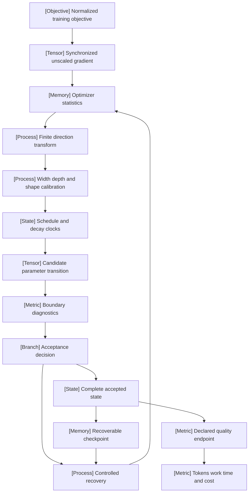

VOLUME I / PART IV — TRAINING SCIENCE AND ADAPTATION / CHAPTER 20

# 20 — Optimization, schedules, and training stability

[DERIVED] A defensible training recipe specifies the complete optimizer transition, its scale and clock, its numerical acceptance boundary, and the resources required to reach a declared quality target.

6 sections · 1 spine paper · 31 chapter references · 2 implementations · prerequisites: 2, 3, 19 · artifact: optimizer and schedule ablation protocol · updated 2026-10-08

## Why this chapter exists

[PAPER-REPORTED] An optimizer name does not determine a reproducible training procedure. Adam requires bias correction and an explicit epsilon convention; decoupled decay differs from adding an L2 term before adaptive preconditioning; factored statistics require accompanying update controls; finite matrix transforms require shape calibration. These distinctions change the transition being evaluated before a schedule or hardware implementation enters the comparison. The Adafactor ablations and Moonlight calibration study expose failures of substituting a compressed statistic or rectangular-matrix rule without checking the resulting update. [R20.1]; [R20.2]; [R20.3]; [R20.4]

[PAPER-REPORTED] Larger training runs add constraints that a scalar loss trace cannot isolate. OLMo 2 reports interactions among initialization, normalization, epsilon, repetitive documents, and a backward-path discrepancy. DeepSeek-V3 reports a precision ablation that diverges; Kimi K2 introduces architecture-specific attention control. Their diagnostic and intervention boundaries differ, so successful containment cannot be treated as proof of a common root cause. [R20.10]; [P13]; [R20.11]

[DERIVED] The resulting design object is a complete state transition with a declared observation boundary. Its direction, stored history, accepted-update index, token exposure, and precision state must agree. Width or depth transfer changes the parameterization; a reusable cooldown changes campaign accounting; a rejected update changes clock semantics. Resource comparisons therefore retain tokens, arithmetic, memory, communication, elapsed time, and economic cost separately. A lower validation loss at one endpoint establishes only that endpoint comparison. The chapter develops the equations and source-reported counterexamples needed to decide which part of a recipe can be transferred and which part must be remeasured.

## Concept map



- Normalized training objective
  - Synchronized unscaled gradient
    - Optimizer statistics
      - Finite direction transform
        - Width, depth, and shape calibration
          - Schedule and decay clocks
            - Candidate parameter transition
              - Boundary diagnostics
                - Acceptance decision
                  - Complete accepted state
                    - Recoverable checkpoint
                    - Declared quality endpoint
                      - Tokens, work, time, and cost
                  - Controlled recovery, using the checkpoint and returning to optimizer statistics

## Position in the book

| Relation | Canonical location and boundary |
|---|---|
| Prerequisites | [Chapter 2: mathematical foundations](../../part-01-scientific-foundations/ch02-mathematical-and-statistical-foundations/README.md), [Chapter 3: numerical computation](../../part-01-scientific-foundations/ch03-numerical-computation-and-trustworthy-training/README.md), and [Chapter 19: objective and complete training loop](../ch19-pretraining-objectives-and-the-full-training-loop/README.md). |
| Siblings (same part) | [Chapter 21](../ch21-scaling-laws-and-compute-allocation/README.md) selects model/data allocation; [Chapter 22](../ch22-continued-pretraining-mid-training-and-domain-adaptation/22-1-stage-definitions.md) changes the training distribution and stage. |
| Downstream | [Chapter 22 optimizer transitions](../ch22-continued-pretraining-mid-training-and-domain-adaptation/22-3-optimizer-transitions.md) and [Part V distributed execution](../../../vol-02-execution-and-optimization/part-05-hardware-kernels-and-distributed-execution/README.md) consume the accepted-state and accounting contracts. |
| Trades off with | [20.1 state and transform costs](20-1-optimizer-mechanics.md#implementation), [20.3 reusable schedule budgets](20-3-scheduling.md#formulation), and [Chapter 6 experimental design](../../part-01-scientific-foundations/ch06-experimental-design-and-evaluation-before-optimization/README.md). |

[DERIVED] Data construction remains in Chapters 7-12; model architecture remains in Chapters 13-18. This chapter owns update geometry, rate transfer, schedule clocks, diagnostic boundaries, recovery semantics, and optimizer comparisons. It links to objective construction and distributed execution where those constraints enter an update, without reteaching either subject.

## Sections

| Section | Title | What changes here | Primary evidence labels |
|---|---|---|---|
| [20.1](20-1-optimizer-mechanics.md) | Optimizer mechanics | Stored statistics and finite update geometry determine the actual transition and memory cost. | PAPER-REPORTED; OFFICIAL-DOCUMENTATION; MATHEMATICALLY-DERIVED |
| [20.2](20-2-hyperparameter-scaling.md) | Hyperparameter scaling | Batch, width, depth, and duration require distinct transfer rules and clocks. | PAPER-REPORTED; MATHEMATICALLY-DERIVED |
| [20.3](20-3-scheduling.md) | Scheduling | Endpoint functions and shared ancestry determine realized rates and campaign budgets. | PAPER-REPORTED; OFFICIAL-DOCUMENTATION; MATHEMATICALLY-DERIVED |
| [20.4](20-4-stability-instrumentation.md) | Stability instrumentation | Measurements localize the first observed anomaly while preserving numerical boundaries. | PAPER-REPORTED; OFFICIAL-DOCUMENTATION; DERIVED |
| [20.5](20-5-recovery-interventions.md) | Recovery interventions | Complete-state replay separates a targeted intervention from a causal claim. | PAPER-REPORTED; OFFICIAL-DOCUMENTATION; DERIVED |
| [20.6](20-6-comparative-evidence.md) | Comparative evidence | Common quality targets, tuning resources, and endpoint selection delimit reported efficiency. | PAPER-REPORTED; MATHEMATICALLY-DERIVED; NOT-DISCLOSED |

## Artifact

[DERIVED] The optimizer and schedule ablation protocol consists of a recipe manifest, a clock ledger, an incident/replay record, and a comparison ledger. The recipe identifies parameter names and shapes, semantic groups, statistic recurrences, state dtypes, epsilon and decay placement, clipping order, finite-transform coefficients, and matrix orientation. The clock ledger records attempted and accepted updates, valid tokens, batch size, rate position, moment memory, and branch ancestry. The incident record retains complete checkpoints, realized batches, observed boundaries, and interventions. The comparison ledger retains tuning allocation, target definition, executed work, elapsed-time boundaries, failed/censored runs, and uncertainty units. The concrete field and acceptance specification is in [verification.md](verification.md).

[DERIVED] Mathematical procedures specify inputs, outputs, state, preconditions, rejection, and termination using numbered transitions. Their pure candidate-state construction describes correctness semantics; it does not claim that a fused implementation allocates an additional full model copy. A finite Newton-Schulz transform remains distinct from its ideal polar-factor comparator. A schedule index remains distinct from elapsed time and valid-token count.

## Verification

[ASSUMED] The proposed protocol tests independent finite recurrences, held-out-scale transfer, schedule budget accounting, controlled failure replay, and common-target comparison. FP64 fixture agreement uses prespecified absolute and relative tolerances; discrete clocks and identifiers agree exactly. Training hypotheses retain a noninjected control and failed or censored trials. The protocol can reject a claimed equivalence or transfer rule for its declared workload; it cannot establish universal optimizer superiority. All experiments remain unexecuted book proposals, with full setup, metrics, baselines, threats to validity, and acceptance criteria in [verification.md](verification.md).

```figure
id: fig-20.19
kind: cycle
evidence: DERIVED
title: Accepted-state and recovery loop
caption: "DERIVED synthesis of Algorithms 20.1, 20.4, and 20.5: diagnostics precede acceptance, and recovery returns to a complete retained state. Arcs describe a correctness contract, not measured latency."
source: [R20.10, R20.19, R20.26]
alt: "Construct a candidate from complete state, inspect boundaries, accept or recover, and retain a checkpoint. Recovery returns to candidate construction after restoring the complete checkpoint."
placement: inline
spec:
  stages:
    - {id: state, label: Complete state, kind: state}
    - {id: candidate, label: Construct candidate, kind: process}
    - {id: observe, label: Inspect boundaries, kind: metric}
    - {id: accept, label: Accept transition, kind: state}
    - {id: retain, label: Retain checkpoint, kind: memory}
  edges:
    - {from: state, to: candidate}
    - {from: candidate, to: observe}
    - {from: observe, to: accept}
    - {from: accept, to: retain}
    - {from: retain, to: state, kind: feedback, label: next accepted update}
    - {from: observe, to: state, kind: feedback, label: reject and recover}
```

## Lineage

- 2015 · Adam [R20.1] · conceptual ancestor: [PAPER-REPORTED] adaptive moments and bias correction.
- 2018 · Adafactor [R20.3] · engineering optimization: [PAPER-REPORTED] factored second-moment storage coupled to update controls.
- 2019 · AdamW [R20.2] · engineering optimization: [PAPER-REPORTED] decay is separated from adaptive preconditioning.
- 2022 · Tensor Programs V [R20.5] · engineering optimization: [PAPER-REPORTED] width-aware transfer distinguishes parameterization from a scalar rate heuristic.
- 2024 · Reusable cooldowns [R20.7] · alternative branch: [PAPER-REPORTED] training prefixes support multiple endpoints with distinct campaign costs.
- 2024 · WSD analysis [R20.8] · alternative branch: [PAPER-REPORTED] stable trunks and cooldown branches have distinct trajectory and budget semantics.
- 2025 · Moonlight [R20.4] · engineering optimization: [PAPER-REPORTED] rectangular shape calibration extends a matrix-update recipe.
- 2025 · Kimi K2 [R20.11] · engineering optimization: [PAPER-REPORTED] architecture-specific attention control limits attention-score growth.
- 2026 · Muon+ [R20.15] · current frontier: [PAPER-REPORTED] post-transform normalization changes update balance.
- 2026 · Spectral Scaling Laws of Muon [R20.16] · current frontier: [PAPER-REPORTED] measured spectral structure motivates conditional finite-iteration analysis.
- 2026 · Scaling Muon for Diffusion Transformers [R20.17] · current frontier: [PAPER-REPORTED] periodic distributed geometry addresses matrix-transform execution costs.

## Terms owned here

[DERIVED] These condensed definitions identify the canonical mathematical development in the linked section.

| Term | Canonical definition and owner |
|---|---|
| Optimizer statistic | Persistent gradient-history quantity used to construct the next direction; [20.1](20-1-optimizer-mechanics.md#formulation). |
| Decoupled weight decay | A parameter shrinkage transition outside adaptive gradient preconditioning; [20.1](20-1-optimizer-mechanics.md#formulation). |
| Factored second moment | A matrix statistic represented through row and column marginals under a declared reconstruction; [20.1](20-1-optimizer-mechanics.md#mechanism). |
| Finite matrix direction transform | The prescribed polynomial iteration applied to matrix momentum, distinct from an exact polar factor; [20.1](20-1-optimizer-mechanics.md#mechanism). |
| Hyperparameter transfer | A declared parameterization-dependent mapping from base settings to a changed scale; [20.2](20-2-hyperparameter-scaling.md#mechanism). |
| Warmup-stable-decay schedule | A rate schedule with warmup, a stable prefix, and a chosen terminal cooldown; [20.3](20-3-scheduling.md#mechanism). |
| First observed nonfinite boundary | The earliest retained instrumented boundary reporting a nonfinite value, which need not be the originating cause; [20.4](20-4-stability-instrumentation.md#mechanism). |
| Complete-state rollback | Restoration of parameters and all declared optimizer, clock, precision, random, data, and adaptation state; [20.5](20-5-recovery-interventions.md#mechanism). |
| Common-target optimizer comparison | Resource accounting to the same declared evaluation target with explicit censoring and tuning boundaries; [20.6](20-6-comparative-evidence.md#formulation). |

## Reference-stack coverage

[DERIVED] The table identifies primary-source routes actually represented in the chapter. A stack surface names the discovery route; the inspected revision and claim locator are recorded in the chapter reference ledger. Conference identity does not imply that an arXiv revision is the archival proceedings text. Source priority is official lab disclosure, primary conference paper or technical report, then implementation documentation for implementation claims; market rankings establish no optimizer mechanism.

| Stack section | Entry | Stack layer | What this chapter takes from it | Surface used | Sections | Evidence label |
|---|---|---|---|---|---|---|
| 1 lab | OpenAI (#2) | - | Gradient-noise and large-batch study, R20.6 | Research: https://openai.com/research/ | 20.2 | PAPER-REPORTED |
| 1 lab | Meta AI / FAIR (#4) | - | Llama 3 interruption accounting and diffusion optimizer study, R20.27/R20.17 | Papers: https://ai.meta.com/results/?content_types%5B0%5D=publication | 20.5-20.6 | PAPER-REPORTED |
| 1 lab | Moonshot AI / Kimi (#7) | - | Moonlight and Kimi K2 matrix updates and attention control, R20.4/R20.11 | Research: https://github.com/MoonshotAI | 20.1, 20.4-20.6 | PAPER-REPORTED |
| 1 lab | DeepSeek (#8) | - | DeepSeek-V3 routing, schedule, and precision ablations, P13 | Research: https://github.com/deepseek-ai | 20.3-20.5 | PAPER-REPORTED |
| 1 lab | Microsoft Research / Microsoft AI (#13) | - | Tensor Programs V parameterization/transfer study, R20.5 | Papers: https://www.microsoft.com/research/publications/ | 20.2 | PAPER-REPORTED |
| 1 lab | Google Research (#18) | - | Adafactor and Adam convergence counterevidence, R20.3/R20.18 | Papers: https://research.google/pubs/ | 20.1 | PAPER-REPORTED |
| 1 lab | Apple Machine Learning Research (#21) | - | Multi-axis Complete(d)P transfer report, R20.14 | Papers: https://machinelearning.apple.com/research | 20.2 | PAPER-REPORTED |
| 1 lab | Allen Institute for AI (Ai2) (#22) | - | OLMo 2 methods and diagnostic ablations, R20.10 | Papers: https://allenai.org/papers | 20.4-20.5 | PAPER-REPORTED |
| 1 lab | Hugging Face Research (#27) | - | Coauthored duration/cooldown research, R20.7 | Papers: https://huggingface.co/papers | 20.3 | PAPER-REPORTED |
| 2 conference | NeurIPS (#1) | - | Venue identity for duration and matrix-transfer studies, R20.7/R20.13 | Papers: https://proceedings.neurips.cc/ | 20.2-20.3, 20.6 | DERIVED |
| 2 conference | ICML (#2) | - | Archival Adafactor methods and Table 2, R20.3 | Papers: https://proceedings.mlr.press/ | 20.1 | PAPER-REPORTED |
| 2 conference | ICLR (#3) | - | Venue identity for Adam, AdamW, counterexamples, and linear decay, R20.1/R20.2/R20.18/R20.9 | Papers: https://openreview.net/group?id=ICLR.cc/2026/Conference | 20.1, 20.3 | DERIVED |
| 3 discovery source | arXiv (#1) | - | Exact primary full texts and revisions, P13/R20.1-R20.18/R20.27/R20.29/R20.31 | Home: https://arxiv.org/ | 20.1-20.6 | DERIVED |
| 3 discovery source | PMLR (#3) | - | ICML archival Adafactor text, R20.3 | Home: https://proceedings.mlr.press/ | 20.1 | DERIVED |
| 4 system | PyTorch (#17) | Model / autograd framework | Versioned optimizer, scheduling, norm, AMP, and state-loading contracts, R20.19-R20.26 | docs-code: https://pytorch.org/docs/stable/ | 20.1-20.5 | OFFICIAL-DOCUMENTATION |
| 4 system | JAX (#18) | Model / autograd framework | Reported implementation context of the comparison in R20.31; no documentation/runtime test claimed | docs-code: https://docs.jax.dev/ | 20.6 | PAPER-REPORTED |
| Outside the reference stack (routed via book_plan.md anchors) | Stanford CS336; originating optimizer authors; academic training-science papers | - | The plan's Stanford CS336 optimization anchor routes the course R20.28, the finite Muon author article R20.30, and primary mechanism/transfer/schedule papers not otherwise assigned a lab entry, R20.1/R20.2/R20.8/R20.9/R20.12/R20.13/R20.15/R20.16/R20.29/R20.31. They establish only their inspected methods/results. | Course: https://cs336.stanford.edu/; exact paper/article URLs in references.md | 20.1-20.6 | PAPER-REPORTED; OFFICIAL-DOCUMENTATION |

**Inspection dimensions applied.** [DERIVED] Parallelism and Communication: full-matrix versus shard-local transforms (20.1/20.6). Precision and Kernels: finite transforms, clipping, AMP, and numerical boundaries (20.1/20.4/20.5). Memory: persistent state, workspace, and checkpoint payload (20.1/20.5). Checkpointing and Reliability: complete-state replay and containment (20.5). Metrics and Reproducibility: exact clocks, target selection, tuning, source versions, and censored comparisons (20.2/20.3/20.6). Post-training and Inference enter only as downstream boundaries; this chapter claims no serving or policy-optimization result.

## Source route

[DERIVED] Follow the lab protocol from official research/publication indexes to the exact full text and its supplementary or implementation surface. Follow the conference workflow from proceedings to paper, code, authors, and related work. Apply the paper-search cascade to resolve revisions and archival identity before interpreting a result. For framework behavior, inspect official documentation before issues or performance discussions. The following are filled-in queries from the reference-stack protocols; retrieval is not evidence until the relevant full text is inspected.

- Lab topic: site:arxiv.org/abs ("Moonshot AI" OR "Kimi") "Muon"
- Lab training detail: "DeepSeek-V3" (training OR pretraining OR post-training OR inference OR architecture) filetype:pdf
- Exact venue identity: "Adafactor: Adaptive Learning Rates with Sublinear Memory Cost" (NeurIPS OR ICML OR ICLR OR ACL OR CVPR OR EMNLP OR ICCV OR ECCV OR AAAI OR IJCAI)
- Conference route: site:proceedings.mlr.press "Adafactor" "International Conference on Machine Learning"
- Paper title search: cat:cs.LG AND ti:"Spectral Scaling Laws of Muon"
- Training-stack route: "PyTorch" official documentation distributed training

## Status

[DERIVED] Editorial status is manuscript_draft. The six manuscripts cover full methodology, mathematical procedures, implementation boundaries, reported protocols and observations, negative evidence, and documented descendants. Nineteen authored figures and the concept map connect equations and mechanisms to the chapter's source ledger; their validation is an editorial check. Full-text inspection is dated 2026-10-08, with pinned revisions or explicitly mutable surfaces in [references.md](references.md).

[UNVERIFIED] No new training run, independent paper reproduction, installed-runtime compatibility test, failure replay, distributed profiler, or seed resampling has been executed. No chapter-wide energy, monetary-cost, or common-hardware benchmark is available. Frontier extrapolations and source studies' unreplicated slices retain their stated boundaries. The verification protocol does not fill missing evidence with predicted measurements.

## References

[DERIVED] Claim-local keys resolve in the [primary-source register and inspection ledger](references.md). The [coverage audit and unexecuted protocol](verification.md) distinguish manuscript validation from scientific execution.
