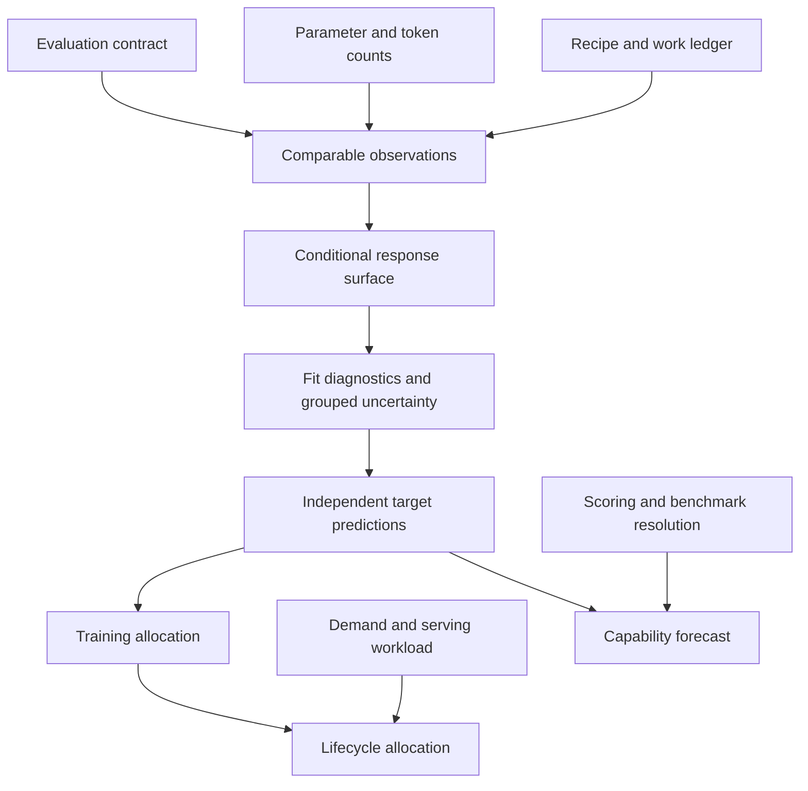

VOLUME I / PART IV — TRAINING SCIENCE AND ADAPTATION / CHAPTER 21

# 21 — Scaling laws and compute allocation

[DERIVED] A scaling estimate supports an allocation only when its measurement contract, fitted domain, resource boundary and independent predictive uncertainty match the decision.

6 sections · 3 spine papers · 18 chapter references · 13 figures · prerequisites: 06, 09, 13, 19–20 · artifact: fitted scaling model with uncertainty and held-out validation · updated 2026-10-09

## Why this chapter exists

[DERIVED] A scaling law is a conditional prediction of a measured outcome under a defined training and evaluation procedure. A compute allocation is a decision made using that prediction and a resource constraint. These are different mathematical objects: an accurate loss predictor can lead to a poor allocation when its parameter count, token count, hardware cost or deployment demand is misdefined. Conversely, similar allocations can follow from substantially different fitted coefficients. This chapter develops both objects and makes their connection explicit.

[PAPER-REPORTED] The historical disagreement between Kaplan et al. and Hoffmann et al. is scientifically useful because later controlled work identifies concrete sources of sensitivity: output-head accounting, warmup duration, scale-dependent hyperparameters, endpoint schedules and statistical fitting. Replication of one Chinchilla estimator also finds that rounded parameters and optimizer stopping affect the apparent optimum. These findings qualify particular methods; they do not establish a universal token-to-parameter ratio. [P08; P09; R21.1; R21.2]

## Concept map

- Evaluation contract, parameter/token counts, and recipe/work ledger determine comparable observations.
  - Comparable observations support a conditional response surface.
  - Fit diagnostics and grouped uncertainty precede independent target predictions.
- Validated predictions support training allocation.
  - Demand and serving workload extend it to lifecycle allocation.
  - Scoring and benchmark resolution extend prediction to a capability forecast.

## Position in the book

| Relation | Contract supplied or consumed |
|---|---|
| Prerequisites | [06: independent evaluation](../../part-01-scientific-foundations/ch06-experimental-design-and-evaluation-before-optimization/README.md), [09: data mixtures](../../part-02-data-and-representation-engineering/ch09-data-mixtures-curricula-and-sample-efficiency/README.md), [13: parameter allocation](../../part-03-model-architectures-and-state/ch13-dense-transformer-design-and-parameter-allocation/README.md), [19: training semantics](../ch19-pretraining-objectives-and-the-full-training-loop/README.md), [20: optimization and schedules](../ch20-optimization-schedules-and-training-stability/README.md). |
| Siblings (same part) | [Training semantics](../ch19-pretraining-objectives-and-the-full-training-loop/README.md) and [optimization](../ch20-optimization-schedules-and-training-stability/README.md) define each observation; [continued pretraining](../ch22-continued-pretraining-mid-training-and-domain-adaptation/README.md) and [efficient adaptation](../ch23-parameter-efficient-adaptation-and-model-composition/README.md) introduce later interventions. |
| Downstream | [Distributed optimization](../../../vol-02-execution-and-optimization/part-05-hardware-kernels-and-distributed-execution/ch29-parallelism-collectives-and-distributed-optimization/README.md), [run reliability](../../../vol-02-execution-and-optimization/part-05-hardware-kernels-and-distributed-execution/ch30-large-training-runs-reliability-monitoring-and-recovery/README.md), [adaptive inference](../../../vol-02-execution-and-optimization/part-07-inference-algorithms-distillation-and-compression/ch38-inference-time-reasoning-search-and-adaptive-compute/README.md), and [lifecycle benchmarking](../../../vol-02-execution-and-optimization/part-08-inference-engines-and-production-serving/ch48-capacity-planning-benchmarking-and-lifecycle-economics/README.md) use the allocation and measurement boundaries. |
| Trades off with | [21.3](21-3-inference-aware-training.md) trades one-time training against recurring service; [21.5](21-5-pilot-methodology.md) trades pilot coverage against proximity to the target. |

## Sections

| Section | What changes here | Primary evidence |
|---|---|---|
| [21.1 Empirical scaling](21-1-empirical-scaling.md) | Defines conditional surfaces, floor assumptions, count conventions and identifiability. | PAPER-REPORTED; MATHEMATICALLY-DERIVED |
| [21.2 Compute-optimal design](21-2-compute-optimal-design.md) | Constrains work, derives optima and separates three estimators and their sensitivities. | PAPER-REPORTED; MATHEMATICALLY-DERIVED |
| [21.3 Inference-aware training](21-3-inference-aware-training.md) | Adds fixed-quality lifecycle demand, serving costs and break-even. | PAPER-REPORTED; MATHEMATICALLY-DERIVED |
| [21.4 Beyond dense pretraining](21-4-beyond-dense-pretraining.md) | Separates repetition, routing, curation, transfer, context, teachers, RL and search coordinates. | PAPER-REPORTED; DERIVED |
| [21.5 Pilot methodology](21-5-pilot-methodology.md) | Adds grouped uncertainty, finite fitting state and untouched extrapolation targets. | PAPER-REPORTED; DERIVED |
| [21.6 Capability prediction](21-6-capability-prediction.md) | Separates loss from the scoring map, threshold effects and benchmark resolution. | PAPER-REPORTED; MATHEMATICALLY-DERIVED |

[DERIVED] Chapters 06 and 13 supply statistical estimation and model selection; Chapter 04 supplies the autoregressive likelihood and Chapter 09 data-mixture accounting. Chapters 19–20 supply objective, token, optimizer and schedule semantics. Chapter 21 owns conditional scaling estimation and resource allocation. Architecture and learning algorithms referenced in section 21.4 remain defined in their canonical chapters; here the question is which variables their scaling studies measure and which costs their conclusions optimize.

## Artifact

[DERIVED] The deliverable is a conditional scaling fit with a frozen independent validation record. Its observation ledger contains run/checkpoint identity, lineage, model configuration, count convention, presented and unique tokens, source loss/proxy status, evaluation revision, audited work and recipe. Its fit ledger contains family, residual scale, bounds, starts, stopping state, full-precision coefficients, numerical failures and resampling draws. Its prediction ledger contains untouched targets, uncertainty, revealed errors and decision regret. An allocation ledger adds feasible architectures, training horizons, demand scenarios and the actual cost boundary. [verification](verification.md) supplies the complete field and experiment specification.

### Mathematical contract

[MATHEMATICALLY-DERIVED] Throughout this chapter, $N$ is a precisely declared parameter-count convention, $D$ is the number of training-token presentations, $U$ is the number of unique available tokens under a stated deduplication rule, $C$ is an algorithmic compute budget in FLOPs, and $L$ is held-out mean negative log-likelihood in nats per token. The dense approximation $C=\kappa ND$, often with $\kappa\approx6$, is a declared model of work rather than a physical identity. Attention, output projection, recomputation, sparsity and hardware execution can require additional terms. $D/U$ measures repetition only when presentations and unique tokens share the same tokenizer and counting boundary.

[DERIVED] Coefficients belong to a particular family, data mixture and loss definition. The fitted offset $E$ is not automatically the entropy of natural language. A curve fitted in tokens does not transfer unchanged across tokenizers, and a FLOP-optimal model need not minimize latency, memory, currency or energy. Wall time needs achieved throughput; serving additionally needs batching, context and output lengths, KV-cache behavior, interconnect and memory constraints. Unreported quantities remain unreported rather than being filled with customary defaults.

## Verification

[DERIVED] Fit only training run lineages, freeze predictions and intervals, then reveal larger/longer targets. Compare fit families on held-out error and interval coverage while preserving failed fits and source proxy status. Verify allocation independently with bracketed iso-compute candidates; verify lifecycle decisions with quality-matched serving measurements. Where capability is the objective, validate its scoring map separately. These are falsifiable proposed tests; no book-authored training, fit or serving experiment has been executed.

## Lineage

- 2020 · Kaplan et al. [P08] · conceptual ancestor: [PAPER-REPORTED] controlled loss/size/data/compute regularities.
- 2022 · Hoffmann et al. [P09] · alternative branch: [PAPER-REPORTED] three allocation estimators and a large-scale tested split.
- 2023 · Muennighoff et al. [R21.4] · alternative branch: [PAPER-REPORTED] constrained unique data and repetition saturation.
- 2024 · Porian et al. [R21.1] · engineering optimization: [PAPER-REPORTED] work accounting, calibration and uncertainty in estimated minima.
- 2024 · Sardana et al. [R21.3] · alternative branch: [PAPER-REPORTED] fixed-quality training plus inference cost.
- 2025 · Busbridge et al. [R21.10] · alternative branch: [PAPER-REPORTED] teacher-conditioned loss and cost amortization.
- 2026 · Longpre et al., inspected February revision [R21.8] · current frontier: [PAPER-REPORTED] transfer/repetition-aware multilingual prediction on the paper's heldouts.

## Terms owned here

| Term | Canonical definition |
|---|---|
| Conditional scaling surface | Empirical response family tied to fixed recipe and evaluation conditions; 21.1. |
| Compute frontier | Minimum predicted loss over a declared feasible work constraint; 21.2. |
| Iso-compute curve | Loss across allocations sharing one audited compute budget; 21.2. |
| Lifecycle allocation | Training/deployment decision under quality, demand and service constraints; 21.3. |
| Effective data coordinate | Fitted quality-response coordinate distinct from paid presentations; 21.4. |
| Pilot extrapolation | Frozen prediction outside a reserved training support region; 21.5. |
| Observational scaling forecast | Cross-model prediction from measured covariates without a causal intervention claim; 21.6. |

## Reference-stack coverage

| Stack section | Entry | Stack layer | What this chapter takes from it | Surface used | Sections | Evidence label |
|---|---|---|---|---|---|---|
| §1 lab | OpenAI (#2) | — | Kaplan's primary loss and work analysis. | https://openai.com/research/index/publication/ | 21.1–21.2 | PAPER-REPORTED |
| §1 lab | Google DeepMind (#3) | — | Chinchilla and routed-model allocation studies; ATLAS provenance. | https://deepmind.google/research/publications/ | 21.1–21.4 | PAPER-REPORTED |
| §1 lab | Meta AI / FAIR (#4) | — | Context continuation and RL-compute studies. | https://ai.meta.com/research/ | 21.4 | PAPER-REPORTED |
| §1 lab | Anthropic (#1) | — | Predictability versus narrower behavior analysis. | https://www.anthropic.com/research | 21.6 | PAPER-REPORTED |
| §1 lab | Apple Machine Learning Research (#21) | — | Teacher-conditioned distillation scaling. | https://machinelearning.apple.com/research | 21.4 | PAPER-REPORTED |
| §1 lab | Databricks / Mosaic AI Research (#25) | — | Inference-aware training and long-horizon fitting limits. | https://www.databricks.com/research | 21.3 | PAPER-REPORTED |
| §2 conference | NeurIPS (#1) | — | Archival routes for allocation, repetition and capability work. | https://proceedings.neurips.cc/ | 21.1–21.6 | PAPER-REPORTED |
| §2 conference | ICML (#2) | — | Archival routes for routed, inference-aware and distillation studies. | https://proceedings.mlr.press/ | 21.3–21.5 | PAPER-REPORTED |
| §2 conference | ICLR (#3) | — | ATLAS conference identity; the inspected full text is the arXiv revision. | https://openreview.net/group?id=ICLR.cc/2026/Conference | 21.4 | PAPER-REPORTED |
| §3 discovery | arXiv (#1) | — | Versioned full methods/results and revision metadata. | https://arxiv.org/ | 21.1–21.6 | PAPER-REPORTED |
| §3 discovery | ACL Anthology (#5) | — | Stable NAACL context-study full text. | https://aclanthology.org/ | 21.4 | PAPER-REPORTED |
| §4 system | JAX (#18) | Model / autograd framework | Source-documented routed-model execution; no local API assertion. | https://docs.jax.dev/ | 21.1, 21.4 | PAPER-REPORTED |
| §4 system | FlashAttention (#39) | Kernels / numerics / collectives | Source-documented long-context execution choice; no benchmark transfer. | https://github.com/Dao-AILab/flash-attention | 21.3–21.4 | PAPER-REPORTED |

**Outside the reference stack (routed via book_plan.md anchors).** [DERIVED] Epoch AI's portal is an explicit Chapter 21 anchor used only for discovery. Supporting academic papers R21.1–R21.2, R21.6–R21.7, R21.13–R21.14 and R21.17 follow the P08/P09 allocation and capability topics through their primary full texts. TMLR, FAccT and NAACL source identities remain bibliographic facts rather than additions to the enumerated conference vocabulary. LM Eval Harness is reported as source evaluation tooling, not inserted as a §4 serving engine. No portal ranking supports a mechanism claim.

**Inspection dimensions applied.** [DERIVED] Metrics and Reproducibility apply throughout: count boundaries, heldouts, fit precision and failures. Precision, Memory, Communication and Parallelism constrain work transfer in 21.1–21.4. Kernels and Inference constrain the serving/context boundary in 21.3–21.4. Post-training distinguishes teacher/RL work from pretraining in 21.4. Reliability includes numerical fit failure and infeasible allocations in 21.2–21.5. Checkpointing appears as run lineage/endpoint provenance; no distributed restore implementation is claimed.

## Source route

[DERIVED] Apply the stack's originating-lab → publication → full paper/supplement workflow, then the conference exact-paper → supplement/code → author/lab route. Market measurements follow only after model/workload identity is fixed. Useful filled queries are `site:arxiv.org/abs "OpenAI" "scaling laws"`, `site:proceedings.neurips.cc "compute-optimal"`, `site:proceedings.mlr.press "distillation scaling" "International Conference on Machine Learning"`, and `site:openreview.net/forum ICLR "ATLAS"`. The §4.3 official-documentation and compatibility protocol applies before replacing a source execution description with a claim about a local runtime.

## Status

[PAPER-REPORTED] Primary methods inspected for this draft include the original Kaplan and Chinchilla analyses, controlled compute-optimality ablations, a Chinchilla fitting replication, inference-aware allocation, data-constrained scaling, routed and fine-grained MoE, DataComp-LM, multilingual transfer including the February 2026 ATLAS revision, long-context adaptation, distillation, RL scaling, test-time compute and capability measurement. The reference ledger records revisions, inspection locations and the difference between original training experiments and analyses of existing measurements. [P07; P08; P09; R21.1–R21.17]

[UNVERIFIED] No models were trained and no numerical scaling fit was executed for this manuscript. Figures are analytical dependency diagrams and equation calculators, not reconstructed empirical plots. Actual pilot coefficients, interval coverage, new-run outcomes, runtime compatibility and deployment economics remain unmeasured. The chapter remains `manuscript_draft`; inspected modern extensions do not establish an exhaustive state-of-the-art survey.

## Reading the evidence

[DERIVED] A reported exponent answers a question only after identifying the axis varied and the variables controlled. A fixed-token sparse-model study does not estimate optimal data allocation. A multilingual mixture fit does not prove that language identity is irrelevant. A successful performance forecast within a stable RL recipe does not show that a different reward or rollout policy follows the same trajectory. Each section reconstructs the relevant measurement and optimization procedure before interpreting its result.

[DERIVED] Improvements are presented as changes to identifiable parts of that procedure: corrected compute accounting; controlled optimizer tuning; repeated-data and transfer terms; lifecycle cost; grouped uncertainty; or a different measurement map. This makes the chapter's final artifact reviewable: every prediction has a training subset, target domain, resource boundary, uncertainty statement and independent validation result. Until those results exist, the artifact is a specification rather than evidence that a proposed allocation works.
