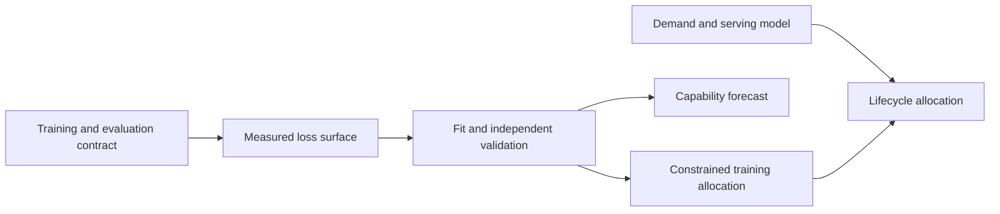

# Scaling laws and compute allocation

[DERIVED] A scaling law is a conditional prediction of a measured outcome under a defined training and evaluation procedure. A compute allocation is a decision made using that prediction and a resource constraint. These are different mathematical objects: an accurate loss predictor can lead to a poor allocation when its parameter count, token count, hardware cost or deployment demand is misdefined. Conversely, similar allocations can follow from substantially different fitted coefficients. This chapter develops both objects and makes their connection explicit.

[PAPER-REPORTED] The historical disagreement between Kaplan et al. and Hoffmann et al. is scientifically useful because later controlled work identifies concrete sources of sensitivity: output-head accounting, warmup duration, scale-dependent hyperparameters, endpoint schedules and statistical fitting. Replication of one Chinchilla estimator also finds that rounded parameters and optimizer stopping affect the apparent optimum. These findings qualify particular methods; they do not establish a universal token-to-parameter ratio. [P08; P09; R21.1; R21.2]

## Chapter map

| Topic | Technical development |
|---|---|
| [21.1 Empirical scaling](21-1-empirical-scaling.md) | Conditional loss surfaces, irreducible-loss assumptions, parameter and token definitions, identifiability and domain dependence. |
| [21.2 Compute-optimal design](21-2-compute-optimal-design.md) | Three original Chinchilla estimators, constrained optima, iso-compute curvature and recipe-sensitive replication. |
| [21.3 Inference-aware training](21-3-inference-aware-training.md) | Fixed-quality lifecycle optimization, input/output serving costs, demand uncertainty and break-even conditions. |
| [21.4 Beyond dense pretraining](21-4-beyond-dense-pretraining.md) | Repetition, sparse routing, filtering, language transfer, context, teachers, RL and test-time search as distinct scaling coordinates. |
| [21.5 Pilot methodology](21-5-pilot-methodology.md) | Experimental design, endpoint versus trajectory data, grouped uncertainty, fit-family sensitivity and independent extrapolation tests. |
| [21.6 Capability prediction](21-6-capability-prediction.md) | Loss-to-score mappings, threshold effects, finite benchmark resolution, observational prediction and failed extrapolations. |

[DERIVED] Chapters 06 and 13 supply statistical estimation and model selection; Chapter 09 supplies the autoregressive likelihood; Chapters 19 and 20 supply objective, token accounting and optimizer/schedule semantics. Chapter 21 owns conditional scaling estimation and resource allocation. The architecture and learning algorithms referenced in section 21.4 remain defined in their own chapters; here the question is which variables their scaling studies measure and which costs their conclusions actually optimize.

## Dependency graph

- A training and evaluation contract fixes the model family, tokenizer, data, optimizer, schedule and metric.
  - Measurements support a conditional loss surface rather than a distribution-free rule.
  - Fitting and independent validation determine which extrapolations are supported.
- A validated surface supports several decisions.
  - Training allocation minimizes a chosen loss under a training-resource constraint.
  - Lifecycle allocation additionally needs demand, serving costs and deployment constraints.
  - Capability forecasting additionally needs a validated mapping from predictors to task measurements.

## Mathematical contract

[MATHEMATICALLY-DERIVED] Throughout this chapter, $N$ is a precisely declared parameter-count convention, $D$ is the number of training-token presentations, $U$ is the number of unique available tokens under a stated deduplication rule, $C$ is an algorithmic compute budget in FLOPs, and $L$ is held-out mean negative log-likelihood in nats per token. The dense approximation $C=\kappa ND$, often with $\kappa\approx6$, is a declared model of work rather than a physical identity. Attention, output projection, recomputation, sparsity and hardware execution can require additional terms. $D/U$ measures repetition only when presentations and unique tokens share the same tokenizer and counting boundary.

[DERIVED] Coefficients belong to a particular family, data mixture and loss definition. The fitted offset $E$ is not automatically the entropy of natural language. A curve fitted in tokens does not transfer unchanged across tokenizers, and a FLOP-optimal model need not minimize latency, memory, currency or energy. Wall time needs achieved throughput; serving additionally needs batching, context and output lengths, KV-cache behavior, interconnect and memory constraints. Unreported quantities remain unreported rather than being filled with customary defaults.

## Evidence and inspection boundary

[PAPER-REPORTED] Primary methods inspected for this draft include the original Kaplan and Chinchilla analyses, controlled compute-optimality ablations, a Chinchilla fitting replication, inference-aware allocation, data-constrained scaling, routed and fine-grained MoE, DataComp-LM, multilingual transfer including the February 2026 ATLAS revision, long-context adaptation, distillation, RL scaling, test-time compute and capability measurement. The reference ledger records revisions, inspection locations and the difference between original training experiments and analyses of existing measurements. [P07; P08; P09; R21.1–R21.17]

[UNVERIFIED] No models were trained and no numerical scaling fit was executed for this manuscript. Figures are analytical dependency diagrams, not reconstructed empirical plots. The deliverable in [verification](verification.md) specifies an executable research artifact with fit coefficients, held-out predictions and uncertainty; its experiments remain explicitly unexecuted. This chapter therefore remains a manuscript draft, with source-backed explanations separated from its proposed verification work.

## Reading the evidence

[DERIVED] A reported exponent answers a question only after identifying the axis varied and the variables controlled. A fixed-token sparse-model study does not estimate optimal data allocation. A multilingual mixture fit does not prove that language identity is irrelevant. A successful performance forecast within a stable RL recipe does not show that a different reward or rollout policy follows the same trajectory. Each section reconstructs the relevant measurement and optimization procedure before interpreting its result.

[DERIVED] Improvements are presented as changes to identifiable parts of that procedure: corrected compute accounting; controlled optimizer tuning; repeated-data and transfer terms; lifecycle cost; grouped uncertainty; or a different measurement map. This makes the chapter's final artifact reviewable: every prediction has a training subset, target domain, resource boundary, uncertainty statement and independent validation result. Until those results exist, the artifact is a specification rather than evidence that a proposed allocation works.
