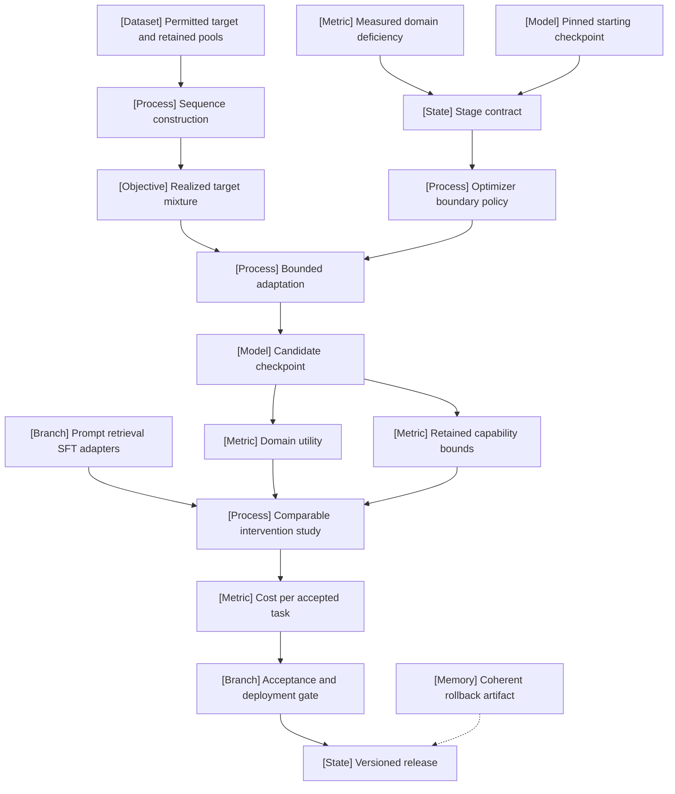

VOLUME I / PART IV — TRAINING SCIENCE AND ADAPTATION / CHAPTER 22

# 22 — Continued pretraining, mid-training, and domain adaptation

[DERIVED] Adaptation is an accepted distribution and state transition whose domain utility, retained capabilities, evidence-access policy, and lifecycle cost must be evaluated together.

6 sections · 2 spine papers · 2 implementation surfaces · prerequisites: 09–12, 19–21 · artifact: an adaptation decision record and retention evaluation · updated 2026-10-08

## Why this chapter exists

[DERIVED] Broad pretraining does not remove the need to choose how a model acquires a new domain, language, context regime, or response behavior. The choice is often obscured by stage labels: continued pretraining, mid-training, fine-tuning, and adaptation can describe different coordinates of the same intervention. A release name does not specify which targets are scored, what data is replayed, whether optimizer history is preserved, or how the candidate is accepted.

[DERIVED] The dominant constraint is joint rather than scalar. Target improvement must coexist with required retained behavior, reproducible state transitions, permitted data use, and feasible serving. A lower domain loss can leave the operational task unimproved. A high benchmark average can conceal a language or formatting regression. A seemingly cheap run can become expensive after pilots, repeated refresh, or rejected releases are counted.

[DERIVED] This chapter makes the intervention explicit before selecting a recipe. It separates the source population from the effective supervised-token mixture, inherited moments from schedule policy, retained-loss proxies from deployment capability tests, and parameter adaptation from evidence supplied at inference. Primary disclosures anchor the reported cases; mathematical reconstructions explain the mechanism under stated conditions. Where a report omits optimizer state or a common evaluation, the omission remains visible. The resulting artifact can reject adaptation, select retrieval or SFT, or admit a bounded training stage; writing a decision record is not a presumption that weights must change.

## Concept map



- Measured domain deficiency
  - Stage contract
    - Pinned starting checkpoint
    - Optimizer boundary policy
  - Permitted target and retained pools
    - Sequence construction
      - Realized target mixture
  - Bounded adaptation
    - Candidate checkpoint
      - Domain utility
      - Retained capability bounds
  - Prompt, retrieval, SFT, and adapter alternatives
    - Comparable intervention study
      - Cost per accepted task
        - Acceptance and deployment gate
          - Versioned release
            - Coherent rollback artifact

## Position in the book

| Relation | Canonical location and interface |
|---|---|
| Prerequisites | [09 — Mixtures and exposure](../../part-02-data-and-representation-engineering/ch09-data-mixtures-curricula-and-sample-efficiency/README.md); [10.4 — Serialization](../../part-02-data-and-representation-engineering/ch10-tokenization-serialization-and-interface-correctness/10-4-conversation-serialization.md); [19 — Training loop](../ch19-pretraining-objectives-and-the-full-training-loop/README.md); [20 — Optimization](../ch20-optimization-schedules-and-training-stability/README.md); [21 — Allocation](../ch21-scaling-laws-and-compute-allocation/README.md) |
| Siblings (same part) | [23 — Parameter-efficient adaptation and composition](../ch23-parameter-efficient-adaptation-and-model-composition/README.md); [24 — Continual learning, editing, and unlearning](../ch24-continual-learning-model-editing-and-unlearning/README.md) |
| Downstream | Chapter 31 SFT and Chapters 49–50 retrieval/context use this chapter's intervention contract; their canonical destinations are listed in the [book index](../../../README.md). |
| Trades off with | [21.3 — Inference-aware training](../ch21-scaling-laws-and-compute-allocation/21-3-inference-aware-training.md); retrieval and context budgets in the [book index](../../../README.md). |

## Sections

| Section | Title | What changes here | Primary evidence labels |
|---|---|---|---|
| [22.1](22-1-stage-definitions.md) | Stage definitions | A release label becomes an explicit intervention contract. | DERIVED · PAPER-REPORTED |
| [22.2](22-2-distribution-transitions.md) | Distribution transitions | Sequence sampling is translated into realized target exposure. | MATHEMATICALLY-DERIVED · PAPER-REPORTED |
| [22.3](22-3-optimizer-transitions.md) | Optimizer transitions | Moments, correction counters, and schedules get separate boundary policies. | MATHEMATICALLY-DERIVED · OFFICIAL-DOCUMENTATION |
| [22.4](22-4-retention-and-interference.md) | Retention and interference | Domain gain is constrained by every required retained population. | MATHEMATICALLY-DERIVED · PAPER-REPORTED |
| [22.5](22-5-alternative-interventions.md) | Alternative interventions | Evidence access, supervision, and parameterization become separate comparison axes. | DERIVED · PAPER-REPORTED |
| [22.6](22-6-adaptation-economics.md) | Adaptation economics | The useful release horizon and accepted-task denominator determine amortization. | MATHEMATICALLY-DERIVED · ASSUMED |

## Artifact

[DERIVED] The **adaptation decision record and retention evaluation** consists of linked records, not a single score. The exact schemas are in [verification](verification.md):

- stage manifest: checkpoint, tokenizer, distribution, objective, trainability, optimizer/scheduler transition, budget;
- exposure ledger: unique available material, realized consumed positions and targets, source shares, repetition;
- intervention ledger: prompt, retrieval, SFT, continued-pretraining, and matched-parameterization configurations;
- evaluation record: baseline, domain tests, retained populations, uncertainty, selection rule, and acceptance;
- lifecycle ledger: all trials, data/index preparation, serving workload, freshness, usable horizon, and rollback artifact.

[DERIVED] A rejected adaptation is a valid outcome when the evidence or feasibility constraints do not support a release. The record preserves why it was rejected and which missing observation would change the decision.

## Verification

[ASSUMED] Compare retrieval, SFT, and continued pretraining from a common checkpoint on a fixed domain task, retaining a strong prompt baseline and exact-start retention measurements. Freeze evidence access, test membership, budgets, selection rules, and per-slice regression tolerances before final evaluation. Include an objective-matched adapter/full-update ablation only when claiming parameterization efficiency. A failed domain or retained-capability gate rejects the candidate. The protocol is proposed and unexecuted; [verification.md](verification.md) gives the complete plan and editorial coverage audit.

## Lineage

- **2020 · Don’t Stop Pretraining · conceptual ancestor.** Domain and task-input continuation are distinguished experimentally. [R22.1]
- **2020 · Retrieval-Augmented Generation · alternative branch.** External evidence enters a trained retrieval-generator system. [P40]
- **2024 · DeepSeekMath · engineering optimization.** Domain-focused decoder continuation uses a mixed exposure law. [R22.2]
- **2024 · Simple and Scalable Strategies · engineering optimization.** Rewarming, decay, and replay are studied through controlled continuation. [R22.3]
- **2025 · Pretraining Data Injection · engineering optimization.** Retained-distribution loss is studied across data and model scales. [R22.5]
- **2025 · Olmo 3 · current frontier.** Individual-source screening is followed by mixture integration and post-trainability checks. [R22.4]
- **2026 · Nemotron 3 Ultra · current frontier.** Checkpoint branches and rollback expose precision and stability boundaries. [R22.9]

```figure
id: fig-22.1
kind: lineage
title: Adaptation evidence branches
caption: These branches change different intervention coordinates. Their dates identify disclosed work, not a ranking or a guarantee of transfer to another domain.
placement: inline
evidence: PAPER-REPORTED
source: [R22.1, P40, R22.2, R22.3, R22.5, R22.4, R22.9]
alt: DAPT and TAPT and RAG originate in 2020, decoder domain continuation and scalable replay studies appear in 2024, data-injection and staged mixture studies in 2025, and a 2026 precision continuation case exposes recovery limits.
spec:
  entries:
    - { year: 2020, work: Domain and task adaptation, cite: R22.1, relation: conceptual ancestor }
    - { year: 2020, work: Retrieval-Augmented Generation, cite: P40, relation: alternative branch }
    - { year: 2024, work: DeepSeekMath, cite: R22.2, relation: engineering optimization }
    - { year: 2024, work: Scalable continual pretraining, cite: R22.3, relation: engineering optimization }
    - { year: 2025, work: Pretraining data injection, cite: R22.5, relation: engineering optimization }
    - { year: 2025, work: Olmo 3, cite: R22.4, relation: current frontier }
    - { year: 2026, work: Nemotron 3 Ultra, cite: R22.9, relation: current frontier }
```

```figure
id: fig-22.2
kind: cycle
title: Adaptation decision and recovery loop
caption: Evaluation can reject a candidate or return it for a separately recorded revision. Release and rollback are explicit artifacts within the same decision boundary.
placement: inline
evidence: DERIVED
source: DERIVED:eq-22.1
alt: The loop proceeds from measured deficiency to intervention design, bounded trial, domain and retention evaluation, accepted release, and refresh monitoring, with evaluation feedback returning to design.
spec:
  stages:
    - { id: deficiency, label: Deficiency, kind: metric }
    - { id: design, label: Design, kind: process }
    - { id: trial, label: Bounded trial, kind: process }
    - { id: evaluate, label: Domain and retention, kind: metric }
    - { id: release, label: Accepted release, kind: model }
    - { id: monitor, label: Freshness and rollback, kind: state }
  edges:
    - { from: deficiency, to: design }
    - { from: design, to: trial }
    - { from: trial, to: evaluate }
    - { from: evaluate, to: release }
    - { from: release, to: monitor }
    - { from: monitor, to: deficiency, kind: feedback }
    - { from: evaluate, to: design, kind: feedback, label: reject or revise }
```

## Terms owned here

| Term | Definition and owner |
|---|---|
| Continued pretraining | Further optimization of a pretraining-style objective from an existing checkpoint; [22.1](22-1-stage-definitions.md#intuition). |
| Domain-adaptive pretraining | Continuation whose exposure is selected or reweighted toward a declared domain; [22.1](22-1-stage-definitions.md#intuition). |
| Task-adaptive pretraining | Continuation on unlabeled inputs associated with a declared downstream task; [22.1](22-1-stage-definitions.md#intuition). |
| Mid-training | A release-dependent intermediate curriculum label requiring a complete stage contract; [22.1](22-1-stage-definitions.md#why-this-exists). |
| Optimizer boundary policy | The explicit transformation of parameters, moments, counters, scheduler, and stochastic/data state between stages; [22.3](22-3-optimizer-transitions.md#formulation). |
| Retention gate | A conjunction of per-population regression constraints relative to a declared baseline; [22.4](22-4-retention-and-interference.md#mechanism). |
| Adaptation decision record | The versioned intervention, evidence, feasibility, and lifecycle-cost rationale for accepting or rejecting a specialization; [22.6](22-6-adaptation-economics.md#algorithm). |

## Reference-stack coverage

| Stack section | Entry | Stack layer | What this chapter takes from it | Surface used | Sections | Evidence label |
|---|---|---|---|---|---|---|
| §1 lab | DeepSeek (#8) | — | Math continuation and V3 context-extension reports | https://github.com/deepseek-ai | 22.1–22.4 | PAPER-REPORTED |
| §1 lab | Allen Institute for AI (Ai2) (#22) | — | Historical domain/task adaptation and Olmo 3 screening | https://allenai.org/papers | 22.1–22.2 | PAPER-REPORTED |
| §1 lab | Mila – Quebec AI Institute (#45) | — | Controlled continual-pretraining and moment-state study | https://mila.quebec/en/research | 22.3 | PAPER-REPORTED |
| §1 lab | Apple Machine Learning Research (#21) | — | Data-injection retention study | https://machinelearning.apple.com/ | 22.4 | PAPER-REPORTED |
| §1 lab | Meta AI / FAIR (#4) | — | Originating RAG study | https://ai.meta.com/research/ | 22.5 | PAPER-REPORTED |
| §1 lab | NVIDIA Research (#14) | — | 2026 continuation and recovery disclosure | https://research.nvidia.com/publications | 22.3,22.6 | PAPER-REPORTED |
| §2 conference | ACL (#4) | — | Stable DAPT/TAPT archival publication | https://aclanthology.org/venues/acl/ | 22.1 | PAPER-REPORTED |
| §2 conference | ICML (#2) | — | Publication identity of the 2025 injection study | https://proceedings.mlr.press/ | 22.4 | PAPER-REPORTED |
| §2 conference | NeurIPS (#1) | — | Spine-paper publication identity for RAG | https://proceedings.neurips.cc/ | 22.5 | PAPER-REPORTED |
| §3 discovery source | arXiv (#1) | — | Versioned full technical texts and revision identity | https://arxiv.org/ | 22.1–22.6 | PAPER-REPORTED |
| §3 discovery source | OpenReview (#2) | — | TMLR publication discovery; no unseen method attributed | https://openreview.net/ | 22.3 | PAPER-REPORTED |
| §3 discovery source | PMLR (#3) | — | ICML bibliographic cross-check | https://proceedings.mlr.press/ | 22.4 | PAPER-REPORTED |
| §3 discovery source | ACL Anthology (#5) | — | Full archival NLP source | https://aclanthology.org/ | 22.1 | PAPER-REPORTED |
| §4 system | PyTorch (#17) | MODEL / AUTOGRAD FRAMEWORK | Optimizer-state association and loading contract | https://pytorch.org/docs/stable/ | 22.3 | OFFICIAL-DOCUMENTATION |
| §4 system | Hugging Face Transformers (#26) | MODEL DEFINITION / ADAPTATION | Model versus trainer resumption interfaces | https://huggingface.co/docs/transformers/ | 22.1 | OFFICIAL-DOCUMENTATION |

**Inspection dimensions applied.** [DERIVED] Precision, Memory, Communication, Checkpointing, Reliability, and Reproducibility are examined in 22.2–22.3; Post-training compatibility in 22.1–22.2 and 22.5; Inference and Metrics in 22.4–22.6. Parallelism and Kernels enter resource boundaries in 22.2–22.3, with unspecified implementation details left unresolved. This is source inspection, not a runtime certification.

## Source route

[DERIVED] Follow the stack's §1.1 lab sequence, §2.1 topic-to-proceedings workflow, §3.1 paper cascade, and §4.3 system search, then inspect the full relevant text. Filled queries include:

- `site:arxiv.org/abs "DeepSeek" "math pre-training"`
- `site:arxiv.org/abs "Allen Institute for AI" "midtraining"`
- `site:proceedings.mlr.press "Scaling Laws for Forgetting" "International Conference on Machine Learning"`
- `site:aclanthology.org "Don’t Stop Pretraining" "Gururangan"`
- `site:arxiv.org/abs "Mila" "continually pre-train"`
- `"PyTorch" official documentation distributed training`

[DERIVED] Search results locate primary material; they do not establish its results. The [reference ledger](references.md) identifies exactly which full texts were inspected, including archival retrieval failures and unpinned surfaces.

## Status

[DERIVED] **Manuscript draft.** Six sections, mathematical procedures, source-backed case studies, and authored figures are present. Structural validation is separate from scientific review. The book has not run the proposed adaptation comparison, retention experiments, or lifecycle measurements.

[NOT-DISCLOSED] DeepSeekMath and V3's complete optimizer-state transitions remain absent from the inspected descriptions. [UNVERIFIED] Runtime compatibility, exact RAG PDF revision, NVIDIA PDF content hash, local demand/cost assumptions, and the common domain comparison remain unresolved. No global best-method or state-of-the-art ranking is asserted.
