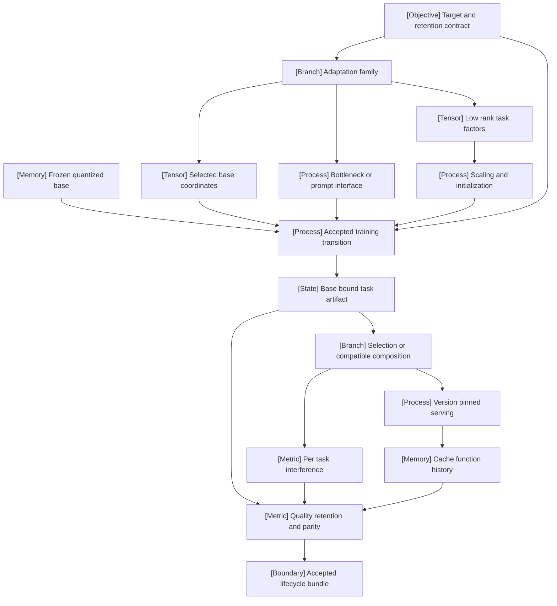

VOLUME I / PART IV — TRAINING SCIENCE AND ADAPTATION / CHAPTER 23

# 23 — Parameter-efficient adaptation and model composition

[MATHEMATICALLY-DERIVED] A small trainable update is a constraint on representation and state; its quality, compatibility and deployment cost require separate evidence.

6 sections · 2 spine papers · 3 implementations · prerequisites: 13, 19–22 · artifact: adapter lifecycle and composition study · updated 2026-10-09

## Why this chapter exists

[MATHEMATICALLY-DERIVED] Updating every pretrained tensor creates task-specific copies and optimizer state proportional to the model. Restricting learned variables reduces that burden, but moves the scientific question: which restricted changes can solve the target task, what behavior do they disturb, and what state must accompany them? A parameter count is insufficient because a frozen backbone still participates in forward/backward computation, activation storage and deployment.

[PAPER-REPORTED] LoRA places learned changes in a factored linear branch; QLoRA reduces frozen-base storage while retaining higher-precision task computation. Their reported comparisons establish useful operating regimes rather than universal full-tuning equivalence. Later controlled learning/forgetting studies expose dependence on data exposure, target placement and optimization. [P14] [P15] [R23.20] [R23.21]

[MATHEMATICALLY-DERIVED] Multiple task artifacts introduce another boundary. Identical tensor shapes do not establish a common coordinate origin. Adding deltas is distinct from selecting adapters, and selecting adapters is distinct from sharing their KV state. A correct merged matrix can still interfere on a critical task; a correct adapter file can still load against the wrong quantized base. This chapter therefore treats adaptation as a complete lifecycle: constrained optimization, explicit artifacts, compatible composition, version-stable execution and quality/retention/parity gates. The measurable result is an accepted function under a stated resource budget, with failures and uncertainty retained.

## Concept map



- Target and retention contract selects an adaptation family.
  - Existing coordinates, inserted interfaces or low-rank task factors define reachable updates.
  - Scaling, initialization and frozen-base representation constrain training.
- Accepted training produces a base-bound task artifact.
  - Selection preserves separate functions.
  - Compatible composition creates a new function requiring interference evaluation.
- Version-pinned serving carries artifact identity into cache history.
  - Quality, retention and representation parity gate the final lifecycle bundle.

## Position in the book

| Relation | Canonical location |
|---|---|
| Prerequisites | [Dense operators, Chapter 13](../../part-03-model-architectures-and-state/ch13-dense-transformer-design-and-parameter-allocation/README.md); [training state, Chapter 19](../ch19-pretraining-objectives-and-the-full-training-loop/README.md); [optimization, Chapter 20](../ch20-optimization-schedules-and-training-stability/README.md); [budgets, Chapter 21](../ch21-scaling-laws-and-compute-allocation/README.md); [domain adaptation, Chapter 22](../ch22-continued-pretraining-mid-training-and-domain-adaptation/README.md) |
| Siblings (same part) | [Continued pretraining, Chapter 22](../ch22-continued-pretraining-mid-training-and-domain-adaptation/README.md); [continual learning/editing/unlearning, Chapter 24](../ch24-continual-learning-model-editing-and-unlearning/README.md) |
| Downstream | [Quantized artifacts, Chapter 40](../../../vol-02-execution-and-optimization/part-07-inference-algorithms-distillation-and-compression/ch40-quantization-from-numerical-model-to-deployable-artifact/README.md); [serving scheduling, Chapter 44](../../../vol-02-execution-and-optimization/part-08-inference-engines-and-production-serving/ch44-scheduling-distributed-serving-and-disaggregation/README.md) |
| Trades off with | [Experimental control, Chapter 06](../../part-01-scientific-foundations/ch06-experimental-design-and-evaluation-before-optimization/README.md); [attention state, Chapter 14](../../part-03-model-architectures-and-state/ch14-attention-architectures-and-cache-representations/README.md) |

## Sections

| Section | Title | What changes here | Primary evidence labels |
|---|---|---|---|
| [23.1](23-1-adaptation-families.md) | Adaptation families | The location of trained variables defines a reachable-function restriction | PAPER-REPORTED; MATHEMATICALLY-DERIVED |
| [23.2](23-2-lora-mechanics.md) | LoRA mechanics | Factor rank, gradients and scaling become an explicit train/export contract | PAPER-REPORTED; MATHEMATICALLY-DERIVED; OFFICIAL-DOCUMENTATION |
| [23.3](23-3-quantized-base-adaptation.md) | Quantized-base adaptation | Packed base state is separated from compute and task/restart state | PAPER-REPORTED; MATHEMATICALLY-DERIVED |
| [23.4](23-4-multi-task-composition.md) | Multi-task composition | A common base enables coordinate algebra without guaranteeing task compatibility | PAPER-REPORTED; MATHEMATICALLY-DERIVED |
| [23.5](23-5-serving-implications.md) | Serving implications | Resident task state and cache history acquire immutable request identity | PAPER-REPORTED; MATHEMATICALLY-DERIVED; OFFICIAL-DOCUMENTATION |
| [23.6](23-6-evaluation.md) | Evaluation | Quality, retained behavior and deployed-function parity become separate gates | PAPER-REPORTED; MATHEMATICALLY-DERIVED |

## Falsifiable claims

[MATHEMATICALLY-DERIVED] Ordinary LoRA's merged and unmerged projection expressions are equal in exact arithmetic under identical base, scale, factors and disabled dropout. A mismatch under those conditions falsifies the implementation contract; floating-point parity requires declared tolerances. Eq. 23.6 and Algorithm 23.2 specify the boundary.

[MATHEMATICALLY-DERIVED] A shared-base sum of low-rank updates has an exact concatenated representation, whereas independently averaging factors introduces cross terms. Eq. 23.16–23.18 permit a direct algebraic counterexample.

[MATHEMATICALLY-DERIVED] DARE preserves each delta coordinate in expectation under the stated independent mask/rescale rule. It does not imply expected nonlinear-output equality. Eq. 23.20 provides both the mean and variance, so a claim of deterministic parity is testable and unjustified.

[MATHEMATICALLY-DERIVED] Before a correctly trained causal aLoRA activation boundary, compatible base-prefix KV state is equal by induction. Reusing post-activation state as base state lacks that guarantee. Eq. 23.25–23.26 identify the falsification cases.

[UNVERIFIED] Whether any proposed adapter reaches matched quality with lower total resident memory than full tuning remains an unexecuted experimental question. The book records no universal winning rank or method.

## Artifact

[UNVERIFIED] The **adapter lifecycle and composition study** is a specified deliverable, not an existing trained checkpoint. Its bundle contains a base/tokenizer/template manifest; complete trainable-tensor/rank/scale/initializer configuration; quantization identity and dtypes; consumed-token and optimizer-state records; standalone and merged adapter exports; composition coefficients/masks; deployment identities and cache policies; and per-example quality/retention/parity results with resource logs. Each exported function references exact source artifacts. Training restart includes moments, RNG and data cursor; deployment can omit these training-only fields.

## Verification

[UNVERIFIED] [The verification protocol](verification.md) compares separately tuned full and adapter updates under declared quality/retention gates, reporting peak total memory alongside trained scalars. Crossed rank/target/quantization controls distinguish mechanisms. Export tests compare fixed-history distributions and generated behavior; composition tests expose per-task regressions; serving tests include cold/warm residency and cache-history cases. The page also maps every required topic and substantive successor to its derivation, procedure, experiment and evidence limits.

## Lineage

```figure
id: fig-23.1
kind: lineage
title: Constraints move across the adaptation lifecycle
caption: Dated method lineage. Current frontier marks the inspected 2025 directions, not a benchmark ranking or an assertion that the complete 2026 literature was surveyed.
placement: inline
anchor: lineage
evidence: PAPER-REPORTED
source: [R23.1, R23.3, P14, P15, R23.12, R23.16, R23.17, R23.21]
alt: Bottleneck adapters in 2019 precede prefix tuning in 2021 and LoRA's 2022 conference publication. QLoRA and TIES add storage and composition constraints in 2023. RandLoRA, activated LoRA and the 2025 spectral study address update rank, cache history and retained behavior.
spec:
  entries:
    - {year: 2019, work: Bottleneck adapters, cite: R23.1, relation: conceptual ancestor, note: Insert trained nonlinear residual modules}
    - {year: 2021, work: Prefix tuning, cite: R23.3, relation: alternative branch, note: Train attention prefix state}
    - {year: 2022, work: LoRA, cite: P14, relation: alternative branch, note: Factor a linear weight correction}
    - {year: 2023, work: QLoRA, cite: P15, relation: engineering optimization, note: Quantize frozen storage}
    - {year: 2023, work: TIES Merging, cite: R23.12, relation: alternative branch, note: Resolve coordinate sign interference}
    - {year: 2025, work: RandLoRA, cite: R23.16, relation: current frontier, note: Learn coefficients over fixed random bases}
    - {year: 2025, work: Activated LoRA, cite: R23.17, relation: current frontier, note: Preserve a base aligned cache prefix}
    - {year: 2025, work: Spectral adaptation comparison, cite: R23.21, relation: current frontier, note: Inspect retained behavior at matched task quality}
```

## Terms owned here

| Term | Owning section | One-line definition |
|---|---|---|
| parameter-efficient adaptation | [23.1](23-1-adaptation-families.md) | Adaptation that restricts the learned task variables relative to full model updating |
| bottleneck adapter | [23.1](23-1-adaptation-families.md) | An inserted nonlinear down/up residual module with task-specific trained state |
| soft prompt tuning | [23.1](23-1-adaptation-families.md) | Optimization of prepended input embedding vectors with a frozen model |
| prefix tuning | [23.1](23-1-adaptation-families.md) | Optimization of designated layer-prefix activations for a frozen model |
| low-rank adaptation | [23.2](23-2-lora-mechanics.md) | A factored task correction to a fixed linear weight |
| quantized-base adaptation | [23.3](23-3-quantized-base-adaptation.md) | Task optimization against an exactly identified decoded quantized frozen base |
| task vector | [23.4](23-4-multi-task-composition.md) | A coordinate difference between a task checkpoint and its common reference |
| disjoint merge | [23.4](23-4-multi-task-composition.md) | Coordinate aggregation over retained updates agreeing with an elected sign |
| activated adapter | [23.5](23-5-serving-implications.md) | A trained correction applied from a specified token boundary |
| adaptation parity | [23.6](23-6-evaluation.md) | Agreement of accepted function behavior across specified exported representations |

## Reference-stack coverage

| Stack section | Entry | Stack layer | What this chapter takes from it | Surface used | Sections | Evidence label |
|---|---|---|---|---|---|---|
| §1 lab | #13 Microsoft Research / Microsoft AI | — | LoRA first-party identity; LoRA/LoftQ primary methods | Papers: https://www.microsoft.com/research/publications/ | 23.2–23.3 | PAPER-REPORTED |
| §1 lab | #18 Google Research | — | Adapter/prompt studies by Google researchers | Papers: https://research.google/pubs/ | 23.1 | PAPER-REPORTED |
| §1 lab | #24 IBM Research AI | — | aLoRA method and follow-up serving | Papers: https://research.ibm.com/publications | 23.5 | PAPER-REPORTED |
| §1 lab | #25 Databricks / Mosaic AI Research | — | Learning/retention comparison | Papers: https://www.databricks.com/research | 23.6 | PAPER-REPORTED |
| §1 lab | #27 Hugging Face Research | — | Versioned PEFT documentation | Code: https://github.com/huggingface | 23.1–23.6 | OFFICIAL-DOCUMENTATION |
| §1 lab | #41 MIT CSAIL | — | Spectral evaluation; cache-serving collaboration | Papers: https://www.csail.mit.edu/research | 23.5–23.6 | PAPER-REPORTED |
| §2 conference | #1 NeurIPS | — | QLoRA/TIES archival route; identified 2025 studies | Papers: https://proceedings.neurips.cc/ | 23.3–23.6 | PAPER-REPORTED |
| §2 conference | #2 ICML | — | Adapters, LoRA+, DoRA and DARE publication route | Papers: https://proceedings.mlr.press/ | 23.1–23.4 | PAPER-REPORTED |
| §2 conference | #3 ICLR | — | LoRA/LoftQ/task arithmetic; RandLoRA proceedings | Conference: https://iclr.cc/ | 23.2–23.4 | PAPER-REPORTED |
| §2 conference | #4 ACL | — | Prefix and selective-training archival papers | Papers: https://aclanthology.org/venues/acl/ | 23.1 | PAPER-REPORTED |
| §2 conference | #6 EMNLP | — | Prompt-tuning archival paper | Papers: https://aclanthology.org/venues/emnlp/ | 23.1 | PAPER-REPORTED |
| §3 discovery | #1 arXiv | — | Full methods/results and explicit revision routes | Home: https://arxiv.org/ | 23.2–23.6 | UNVERIFIED |
| §3 discovery | #3 PMLR | — | Stable adapter PDF and conference identity records | Home: https://proceedings.mlr.press/ | 23.1–23.2 | PAPER-REPORTED |
| §3 discovery | #4 NeurIPS Proceedings | — | Stable QLoRA full paper | Home: https://proceedings.neurips.cc/ | 23.3 | PAPER-REPORTED |
| §3 discovery | #5 ACL Anthology | — | Prompt/prefix/BitFit full papers | Home: https://aclanthology.org/ | 23.1 | PAPER-REPORTED |
| §4 system | #26 Hugging Face Transformers | MODEL DEFINITION / ADAPTATION | Base operator/adapter interface, as referenced by PEFT docs | docs-code: https://huggingface.co/docs/transformers/ | 23.1–23.3, 23.6 | OFFICIAL-DOCUMENTATION |
| §4 system | #28 Hugging Face PEFT | MODEL DEFINITION / ADAPTATION | Configuration, saved state and merge operators | docs-code: https://huggingface.co/docs/peft/ | 23.1–23.6 | OFFICIAL-DOCUMENTATION |
| §4 system | #41 vLLM | INFERENCE ENGINE | Per-request adaptation; source-reported experimental extension | docs-code: https://docs.vllm.ai/ | 23.5–23.6 | OFFICIAL-DOCUMENTATION |

**Outside the reference stack (routed via book_plan.md anchors).** Academic rsLoRA, LoRA+, DoRA, RandLoRA, task-arithmetic and TIES/DARE sources extend the plan's LoRA/composition anchors. Punica/S-LoRA extend its serving requirement; MLSys is outside §2's conference list. The QLoRA quantization backend is outside §4 and is discussed only through the inspected paper, without a backend API/runtime claim.

**Inspection dimensions applied.** Precision and Memory: 23.1–23.3/23.5; Parallelism, Communication and Kernels: 23.2/23.5; Checkpointing and Reliability: 23.3–23.5; Post-training: 23.1–23.4; Inference: 23.4–23.6; Metrics and Reproducibility: all sections. Discovery entries identify retrieval routes, not independent support for results.

## Source route

[UNVERIFIED] Apply the reference stack's lab protocol §1.1 first, then conference workflow §2.1, full-paper/revision cascade §3.1 and exact implementation/version inspection §4.3. Concrete queries are:

- “site:microsoft.com/research/publication LoRA LoftQ”
- “site:research.ibm.com/publications activated LoRA”
- “site:proceedings.iclr.cc RandLoRA 2025”
- “site:proceedings.mlr.press LoRA 2026”
- “site:arxiv.org adapter model merging 2026”
- “site:huggingface.co/docs/peft v0.21.0 LoraConfig”

## Status

[UNVERIFIED] Manuscript draft with primary-source reconstruction, 2025 successors, dated 2026 search, mathematical procedures and authored technical figures. Experiments are unexecuted. Unpinned PDFs/latest documentation, installed-backend compatibility and independent quality/parity results remain explicit gaps. **NOT-DISCLOSED:** deployment tolerances, private data overlap and full production workloads. The [reference ledger](references.md) records inspected revisions and locators; source prominence is not a benchmark rank.
