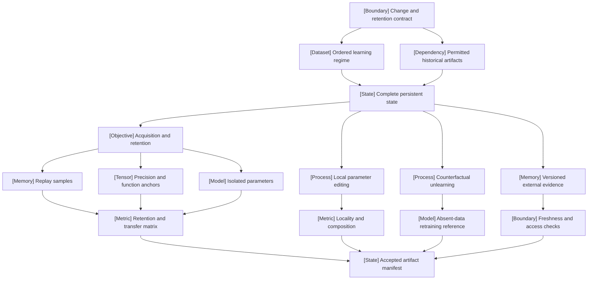

VOLUME I / PART IV — TRAINING SCIENCE AND ADAPTATION / CHAPTER 24

# 24 — Continual learning, model editing, and unlearning

[MATHEMATICALLY-DERIVED] A persistent change is defensible only when its permitted information flow, retained capability, intervention boundary, and comparison target are explicit and tested together.

6 sections · 0 spine papers · 2 implementations · prerequisites: 04,06,12,19–20,22–23 · artifact: a sequential-task evaluation with explicit data-retention constraints · updated 2026-10-08

## Why this chapter exists

[MATHEMATICALLY-DERIVED] A model that improves on the newest task can deteriorate on earlier tasks. An editor that writes one association can change neighboring predictions. An unlearning method that prevents a familiar completion can preserve information recoverable through another interface. These outcomes fail different contracts; a single final score cannot distinguish them. The bottleneck is identifying which state changed, what historical influence was permitted, and which observations are strong enough to support the intended claim.

[PAPER-REPORTED] EWC supplies a local quadratic retention mechanism, while Huszár identifies conditions and a recursive correction to its sequential Bayesian interpretation. ROME and AlphaEdit provide localized parameter interventions with distinct constraints. MUSE and benign-relearning studies expose why answer suppression and parameter removal need separate evidence. The 2026 SDFT paper supplies a current distillation-based continual-learning branch, and Google's 2026 conformal method illustrates a calibrated service-output intervention without parameter updates. [R24.4–R24.5], [R24.9], [R24.11], [R24.13], [R24.15], [R24.19–R24.20].

[DERIVED] The solution is a versioned transition-and-evaluation ledger. It declares sequential regimes and retention permissions, records acquisition and later changes, compares mechanisms under matched budgets, and binds targeted intervention claims to their correct comparator. External evidence introduces another state boundary whose freshness, provenance, and deletion semantics must be audited separately. The artifact makes these distinctions falsifiable; it does not infer a universal best mechanism or a frontier-model guarantee from a paper's date, venue, or affiliation.

## Concept map



- Change and retention contract
  - Ordered learning regime
  - Permitted historical artifacts
  - Complete persistent state
    - Acquisition and retention
      - Replay samples
      - Precision and function anchors
      - Isolated parameters
      - Retention and transfer matrix
    - Local parameter editing
      - Locality and composition
    - Counterfactual unlearning
      - Absent-data retraining reference
    - Versioned external evidence
      - Freshness and access checks
- Accepted artifact manifest, dependent on all applicable evaluation branches

## Position in the book

| Relation | Canonical location |
|---|---|
| Prerequisites | [Objectives, Chapter 04](../../part-01-scientific-foundations/ch04-language-modeling-and-learning-objectives/README.md); [evaluation, Chapter 06](../../part-01-scientific-foundations/ch06-experimental-design-and-evaluation-before-optimization/README.md); [ingestion, Chapter 12](../../part-02-data-and-representation-engineering/ch12-scalable-data-infrastructure-and-reproducible-ingestion/README.md); [training state, Chapter 19](../ch19-pretraining-objectives-and-the-full-training-loop/README.md) |
| Siblings (same part) | [Continued pretraining, Chapter 22](../ch22-continued-pretraining-mid-training-and-domain-adaptation/README.md); [parameter-efficient adaptation, Chapter 23](../ch23-parameter-efficient-adaptation-and-model-composition/README.md) |
| Downstream | [Retrieval, Chapter 49](../../../vol-03-grounded-and-interactive-intelligence/part-09-retrieval-context-and-agent-systems/ch49-retrieval-models-indexing-and-evidence-access/README.md); [agent state, Chapter 53](../../../vol-03-grounded-and-interactive-intelligence/part-09-retrieval-context-and-agent-systems/ch53-agent-memory-persistent-state-and-long-horizon-consistency/README.md); [evaluation and assurance, Part XI](../../../vol-03-grounded-and-interactive-intelligence/part-11-evaluation-interpretability-and-deployment-assurance/README.md) |
| Trades off with | [Compute allocation, Chapter 21](../ch21-scaling-laws-and-compute-allocation/README.md); [data mixtures, Chapter 09](../../part-02-data-and-representation-engineering/ch09-data-mixtures-curricula-and-sample-efficiency/README.md) |

## Sections

| Section | Title | What changes here | Primary evidence labels |
|---|---|---|---|
| [24.1](24-1-sequential-learning-regimes.md) | Sequential learning regimes | Information access and prediction interfaces become explicit problem inputs | DERIVED; PAPER-REPORTED |
| [24.2](24-2-forgetting-and-transfer.md) | Forgetting and transfer | Acquisition, historical change, and order dependence enter a complete matrix | MATHEMATICALLY-DERIVED; PAPER-REPORTED |
| [24.3](24-3-mechanism-families.md) | Mechanism families | Samples, geometry, outputs, and isolated paths preserve different objects | MATHEMATICALLY-DERIVED; PAPER-REPORTED; OFFICIAL-DOCUMENTATION |
| [24.4](24-4-model-editing.md) | Model editing | Local writes require collateral, composition, and persistence tests | MATHEMATICALLY-DERIVED; PAPER-REPORTED |
| [24.5](24-5-unlearning.md) | Unlearning | An absent-data comparator replaces suppression as the deletion target | MATHEMATICALLY-DERIVED; PAPER-REPORTED |
| [24.6](24-6-parametric-versus-external-memory.md) | Parametric versus external memory | The update boundary moves across separately versioned persistent stores | DERIVED; MATHEMATICALLY-DERIVED; PAPER-REPORTED |

## Artifact

[DERIVED] The sequential-task evaluation comprises a regime record (ordered tasks, task-identity availability, prediction space, boundary signals); permission/lineage manifest (records, statistics, teachers, generators, adapters, expiries); checkpoint ledger (parameters, optimizer, auxiliary state, routing, immutable identities); full retention/transfer matrix and inherited-capability panel; intervention-specific edit/deletion records; and an external-state manifest when applicable. Raw outputs, metric definitions, seeds/orders, selection rules, and tokens/FLOPs/retained bytes accompany every comparison. The deliverable is a mathematical specification and falsifiable verification protocol; it contains no executed training results.

## Verification

[DERIVED] The [verification protocol](verification.md) tests whether acquisition and retention survive matched orders and resource constraints; whether edits satisfy held-out paraphrases, neighborhood locality, composition, and later interventions; whether approximate unlearning differs from matched retraining under continuation, semantic, privacy, and benign-relearning probes; and whether external updates maintain coherent versions and permission boundaries. Analytical identities and figure validation can be checked without asserting a model experiment. All proposed training and service experiments remain unexecuted.

## Lineage

- 2016 · Progressive Neural Networks · **alternative branch**: protect historical execution paths through frozen columns.
- 2017 · EWC · **conceptual ancestor**: parameter-specific local quadratic retention.
- 2017 · Huszár's EWC analysis · **engineering optimization**: correct the recursive precision/anchor interpretation.
- 2020 · RAG · **alternative branch**: update an external evidence index.
- 2021 · SISA · **alternative branch**: isolate dependencies to reduce deletion retraining.
- 2022 · ROME · **alternative branch**: write a targeted local association.
- 2023 · MEMIT and MQuAKE · **engineering optimization**: batch editing and consequence-sensitive evaluation.
- 2024 · MUSE and NPO · **alternative branch**: multidimensional deletion evaluation and attenuated suppression updates.
- 2025 · AlphaEdit · **engineering optimization**: constrain updates on sampled preserved keys.
- 2026 · SDFT · **current frontier**: demonstrated on-policy distillation for sequential adaptation in its evaluated regime.
- 2026 · Conformal inference-time unlearning · **alternative branch**: calibrate verifier-defined response filtering.

```figure
id: fig-24.1
kind: lineage
title: Persistent adaptation branches
caption: >-
  The chronology separates retention, targeted editing, deletion, and external
  evidence. A later date does not imply dominance across their different contracts.
placement: inline
evidence: PAPER-REPORTED
source: [R24.4, R24.5, R24.9, R24.11, R24.13, R24.15, R24.16, R24.21]
alt: >-
  EWC and its 2017 correction precede external-memory RAG in 2020, SISA deletion
  in 2021, ROME editing in 2022, MUSE evaluation in 2024, AlphaEdit in 2025,
  and the evaluated SDFT continual-learning branch in 2026.
spec:
  entries:
    - { year: 2017, work: EWC, cite: R24.4, relation: conceptual ancestor }
    - { year: 2017, work: Recursive EWC correction, cite: R24.5, relation: engineering optimization }
    - { year: 2020, work: RAG, cite: R24.21, relation: alternative branch }
    - { year: 2021, work: SISA, cite: R24.16, relation: alternative branch }
    - { year: 2022, work: ROME, cite: R24.11, relation: alternative branch }
    - { year: 2024, work: MUSE, cite: R24.15, relation: alternative branch }
    - { year: 2025, work: AlphaEdit, cite: R24.13, relation: engineering optimization }
    - { year: 2026, work: SDFT, cite: R24.9, relation: current frontier }
```

```figure
id: fig-24.2
kind: cycle
title: Accepted sequential adaptation loop
caption: >-
  A new phase changes state only after permission and measurement gates. Rejected
  candidates return to the previous accepted artifact; failure records remain visible.
placement: inline
evidence: DERIVED
source: DERIVED:eq-24.5
alt: >-
  Define a phase, audit historical access, construct a candidate, evaluate it, and
  publish an accepted manifest. Evaluation failures return to the previous state;
  the next phase starts from the accepted manifest and updated permission ledger.
spec:
  stages:
    - { id: phase, label: Phase and contract, kind: dataset }
    - { id: audit, label: Permitted information, kind: boundary }
    - { id: candidate, label: Candidate transition, kind: process }
    - { id: evaluate, label: Retention and target gates, kind: metric }
    - { id: accept, label: Accepted manifest, kind: state }
  edges:
    - { from: phase, to: audit }
    - { from: audit, to: candidate }
    - { from: candidate, to: evaluate }
    - { from: evaluate, to: accept }
    - { from: evaluate, to: candidate, kind: feedback, label: reject and revise }
    - { from: accept, to: phase, kind: feedback, label: next authorized phase }
```

## Terms owned here

| Term | Canonical definition | Owner |
|---|---|---|
| Sequential learning regime | Ordered distributions plus observation, prediction, historical-access, and resource contracts | [24.1](24-1-sequential-learning-regimes.md#formulation) |
| Retention matrix | Scores for every evaluated phase/checkpoint against declared task distributions, including the initial row | [24.2](24-2-forgetting-and-transfer.md#formulation) |
| Peak forgetting | Current score loss relative to the greatest score since a task's acquisition | [24.2](24-2-forgetting-and-transfer.md#mechanism) |
| Editing locality | Bounded change on a declared non-target distribution and observation interface | [24.4](24-4-model-editing.md#formulation) |
| Unlearning counterfactual | The specified training process with selected influences absent, including its randomization and release boundary | [24.5](24-5-unlearning.md#formulation) |

Training-state closure remains owned by Chapter 19; adapter composition by Chapter 23; retrieval algorithms and agent-memory policies by Chapters 49 and 53. “No raw replay” does not mean “no retained information,” and “unchanged generator weights” does not mean “unchanged service.”

## Reference-stack coverage

| Stack section | Entry | Stack layer | What this chapter takes from it | Surface used | Sections | Evidence label |
|---|---|---|---|---|---|---|
| §1 lab | Google DeepMind (#3) | — | Originating EWC and progressive-column disclosures | https://deepmind.google/research/publications/ | 24.3 | PAPER-REPORTED |
| §1 lab | Meta AI / FAIR (#4) | — | GEM metrics/projection and RAG evidence updating | https://github.com/facebookresearch | 24.2–24.3,24.6 | PAPER-REPORTED |
| §1 lab | Google Research (#18) | — | Conformal verifier-defined output control and limits | https://research.google/pubs/ | 24.5–24.6 | PAPER-REPORTED |
| §1 lab | Salesforce AI Research (#23) | — | Originating NPO work through author affiliation | https://www.salesforceairesearch.com/research | 24.5 | PAPER-REPORTED |
| §1 lab | MIT CSAIL (#41) | — | Originating ROME/MEMIT work | https://www.csail.mit.edu/research | 24.4 | PAPER-REPORTED |
| §2 conference | NeurIPS (#1) | — | GEM, ROME, and RAG archival provenance | https://proceedings.neurips.cc/ | 24.2–24.4,24.6 | PAPER-REPORTED |
| §2 conference | ICML (#2) | — | SDFT 2026 archival metadata; v1 method text separately pinned | https://proceedings.mlr.press/ | 24.3 | PAPER-REPORTED |
| §2 conference | ICLR (#3) | — | MEMIT and AlphaEdit archival provenance | https://openreview.net/ | 24.4 | PAPER-REPORTED |
| §2 conference | EMNLP (#6) | — | MQuAKE archival provenance | https://aclanthology.org/venues/emnlp/ | 24.4,24.6 | PAPER-REPORTED |
| §3 discovery source | arXiv (#1) | — | Originating full-text versions and locators | https://arxiv.org/ | 24.1–24.6 | OFFICIAL-DOCUMENTATION |
| §3 discovery source | OpenReview (#2) | — | Conference metadata cross-check | https://openreview.net/ | 24.4 | OFFICIAL-DOCUMENTATION |
| §3 discovery source | PMLR (#3) | — | ICML metadata retrieval | https://proceedings.mlr.press/ | 24.3 | OFFICIAL-DOCUMENTATION |
| §3 discovery source | NeurIPS Proceedings (#4) | — | Archival metadata cross-check | https://proceedings.neurips.cc/ | 24.2,24.4 | OFFICIAL-DOCUMENTATION |
| §3 discovery source | ACL Anthology (#5) | — | MQuAKE bibliographic cross-check | https://aclanthology.org/ | 24.4,24.6 | OFFICIAL-DOCUMENTATION |
| §4 system | Hugging Face PEFT (#28) | MODEL DEFINITION / ADAPTATION | Adapter load/activation/trainability interface | https://huggingface.co/docs/peft/ | 24.3 | OFFICIAL-DOCUMENTATION |
| §4 system | Hugging Face TRL (#29) | POST-TRAINING / RL | Source-reported SDFT implementation route; no runtime verification | https://huggingface.co/docs/trl/ | 24.3 | PAPER-REPORTED |
| Outside the reference stack (routed via book_plan.md anchors) | Independent academic papers; PNAS; IEEE Security and Privacy | — | EWC is Chapter 24's explicit source anchor; Hsu/TRACE, Laplace correction, LwF/DGR, MQuAKE, SISA, MUSE/NPO/SimNPO, and benign-relearning sources complete its named regimes, mechanism, editing, and unlearning coverage | Exact primary texts in [references.md](references.md) | 24.1–24.6 | PAPER-REPORTED |

**Inspection dimensions applied.** Memory and Precision (§§24.1,24.3–24.5); Checkpointing and Reliability (§§24.1,24.4–24.6); Post-training (§§24.3–24.5); Inference (§§24.4–24.6); Metrics and Reproducibility (all sections); Parallelism and Communication through trainable/retained-state ownership (§§24.2–24.3,24.6). Kernel throughput is not inferred from abstract operation counts. No installed systems path is CODE-VERIFIED.

## Source route

Use the stack's originating-lab disclosure search, then archival paper/supplement cross-check, then official implementation surfaces. Apply the paper cascade arXiv → OpenReview → PMLR → NeurIPS Proceedings → ACL Anthology with author/title/version reconciliation. Concrete queries are `site:arxiv.org/abs "DeepMind" "catastrophic forgetting"`; `site:proceedings.mlr.press "Self-Distillation Enables Continual Learning"`; `site:openreview.net "AlphaEdit"`; `site:aclanthology.org "MQuAKE"`; `site:research.google/pubs "Unlearning" "Conformal"`; and `Hugging Face PEFT official documentation load_adapter set_adapter`. Discovery pages establish a route; the relevant originating full method, experiments, assumptions, or API entry support each attributed claim. Market observations are unnecessary for the scientific mechanisms here and supply no missing guarantees.

## Status

All six sections and their mathematical algorithms/figures are `manuscript_draft`. The [reference ledger](references.md) records 21 inspected primary sources with actual access dates and exact locators. Unresolved items include the unpinned SimNPO HTML revision, mutable PEFT API version, unavailable SDFT archival PDF, independent benchmark replication, complete production lineage, and measured resource costs. Finite locality/privacy/recovery tests cannot establish unrestricted functional preservation or global deletion. These limitations remain explicit review blockers in [verification.md](verification.md); the edition reports no book-authored training, editing, unlearning, or service experiment.
