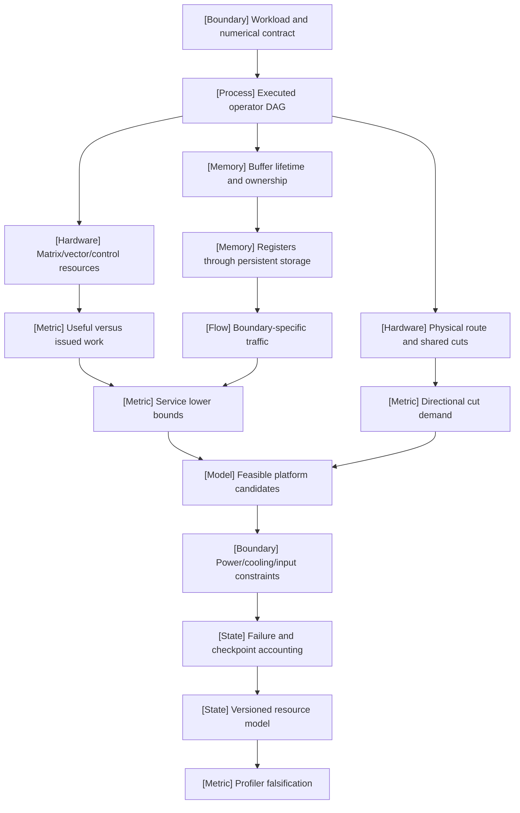

VOLUME II / PART V — HARDWARE, KERNELS, AND DISTRIBUTED EXECUTION / CHAPTER 25

# 25 — Accelerators, memory hierarchy, and performance models

[MATHEMATICALLY-DERIVED] A hardware choice is defensible only when its execution resources, storage lifetimes, physical communication cuts, and operational constraints can serve the specified workload under one explicit correctness and measurement contract.

6 sections · 0 spine papers · 3 implementation anchors · prerequisites: 01–03,05,13–17 · artifact: a hardware/resource model for a specified workload · updated 2026-10-09

## Why this chapter exists

[DERIVED] A device advertised with a large matrix peak can execute a small, irregular, or sequential workload poorly. A workload whose total tensors fit in HBM can still fail during a transient overlap of buffers. Eight endpoint links can converge on one oversubscribed physical cut. A rack with enough nominal compute can lack power, cooling, or checkpoint service for the intended placement. These failures share an accounting error: a local capacity or marketing number was substituted for the resources required by a complete execution.

[PAPER-REPORTED] The inspected December2025 Blackwell microbenchmark and May2026 analytical-model papers expose why instruction, memory, launch, and calibration boundaries matter. The latter explicitly permits fitted per-case multipliers and excludes some queueing and multi-node behavior. Its fitted errors cannot establish universal predictive accuracy. The June2026 TPU report describes a compiler-managed execution and memory organization; it does not supply a matched comparison for this book's workload. [R25.3–R25.5].

[DERIVED] The dominant constraint is therefore the reproducible mapping from a semantic workload to its actual physical path. The chapter replaces device ranking with a versioned resource ledger and falsifiable bottleneck hypotheses. The ledger distinguishes useful arithmetic from issued work, logical tensors from peak live storage, endpoint rates from shared cuts, and busy devices from retained progress. Contemporary vendor disclosures define candidate interfaces; only a qualified implementation and a declared measurement boundary could establish application performance. The resulting model supports a decision while making its unresolved inputs visible.

## Concept map



- Workload and numerical contract
  - Executed operator DAG
    - Matrix/vector/control resources
      - Useful versus issued work
    - Buffer lifetime and ownership
      - Registers through persistent storage
      - Boundary-specific traffic
    - Physical route and shared cuts
      - Directional cut demand
- Service lower bounds and physical-cut demands
  - Feasible platform candidates
    - Power/cooling/input constraints
    - Failure and checkpoint accounting
  - Versioned resource model
    - Profiler falsification

## Position in the book

| Relation | Canonical location and boundary |
|---|---|
| Prerequisites | [Scientific foundations, PartI](../../../vol-01-learning-and-representation/part-01-scientific-foundations/README.md); [architecture, PartIII](../../../vol-01-learning-and-representation/part-03-model-architectures-and-state/README.md). Shape, numerical, attention and expert definitions precede their resource models. |
| Siblings (same part) | [Kernel equivalence, Chapter26](../ch26-kernel-programming-and-numerical-equivalence/README.md); [specialized kernels, Chapter27](../ch27-attention-latent-attention-and-expert-kernels/README.md); [compiler/runtime integration, Chapter28](../ch28-frameworks-graph-compilers-and-runtime-integration/README.md); [distributed execution, Chapter29](../ch29-parallelism-collectives-and-distributed-optimization/README.md). |
| Downstream | [Joint optimization, §29.6](../ch29-parallelism-collectives-and-distributed-optimization/29-6-joint-optimization.md); [training reliability, Chapter30](../ch30-large-training-runs-reliability-monitoring-and-recovery/README.md). Physical resource feasibility constrains both. |
| Trades off with | [Memory lifetime, §25.2](25-2-memory-hierarchy.md), [connectivity, §25.4](25-4-physical-connectivity.md), and [cluster constraints, §25.6](25-6-cluster-constraints.md): extra staging, offload, and parallel degree move demand between scarce resources. |

## Sections

| Section | Title | What changes here | Primary evidence labels |
|---|---|---|---|
| [25.1](25-1-accelerator-organization.md) | Accelerator organization | Separate matrix, vector, control, and transfer resources and their dependencies | MATHEMATICALLY-DERIVED; OFFICIAL-DOCUMENTATION; PAPER-REPORTED |
| [25.2](25-2-memory-hierarchy.md) | Memory hierarchy | Replace tensor sums with ownership, live intervals, reservations, and boundary traffic | MATHEMATICALLY-DERIVED; PAPER-REPORTED |
| [25.3](25-3-roofline-reasoning.md) | Roofline reasoning | Treat a roof as a service ceiling and test bottleneck intervals against profiling | MATHEMATICALLY-DERIVED; PAPER-REPORTED |
| [25.4](25-4-physical-connectivity.md) | Physical connectivity | Bind endpoint communication to directional physical routes and shared cuts | MATHEMATICALLY-DERIVED; PAPER-REPORTED; OFFICIAL-DOCUMENTATION |
| [25.5](25-5-platform-comparison.md) | Platform comparison | Filter by correctness and deployment feasibility before comparing accepted work | DERIVED; OFFICIAL-DOCUMENTATION |
| [25.6](25-6-cluster-constraints.md) | Cluster constraints | Admit placements under simultaneous power, cooling, storage and recovery bounds | MATHEMATICALLY-DERIVED; PAPER-REPORTED |

[DERIVED] Each section has one central visual and two aligned explanatory instruments. Their numerical defaults are analytical fixtures. Moving a calculator input recomputes a stated equation; it does not run a device or predict a vendor benchmark. This distinction is part of the figure's evidence contract.

## Artifact

[DERIVED] Deliver **a hardware/resource model for a specified workload** as an immutable manifest plus its raw observations. `workload.json` records operator DAG, tensor shape/stride, precision, accepted numerical error, quality and deadline. `hardware.json` records device/SKU, firmware/driver/compiler, physical domains, directional rates and their provenance. `buffers.csv` records storage identity, aliases, creation, last completion, reservation and safe release. `routes.csv` records endpoints, traversed cuts, crossing bytes and degradation state. `predictions.csv` records compatible operation counts, transfer bytes, lower-bound intervals and predeclared bottleneck hypotheses. `measurements.csv` retains raw repetitions, timing boundaries, profiler identities and interference controls. `decision.json` records rejected candidates, unresolved inputs, and the conditions under which a candidate was accepted.

[DERIVED] A measured parameter must carry a workload/configuration identity and measurement interval. A disclosed peak must retain its precision, sparsity, scope, and direction convention. An assumed value must stay labeled assumed. Substituting an optimistic peak for an unknown sustained rate makes the prediction conditional on that assumption; it does not resolve the unknown. No artifact is supplied here with fabricated hardware measurements.

## Verification

[DERIVED] Predict whether selected GEMM, GEMV and reduction cases are limited by compute, memory service, or exposed overhead, then compare the predeclared predictions with profiler evidence under controlled shape, layout, precision and cache conditions. Hold out shapes from calibration and retain cases that fail the model. Extend the same workload to a shared physical cut and a burst-storage admission case. The full protocol, analytical identities, rejection conditions, and topic audit are in [verification.md](verification.md). These scientific experiments remain UNVERIFIED; manuscript compilation does not execute them.

## Lineage

[DERIVED] This bounded lineage includes only eligible publications/releases. It describes relations among the inspected contemporary evidence; it makes no claim that the underlying concepts originated in2026.

- 2025 · Blackwell microbenchmark, first2025-12-01 [R25.3] · **engineering optimization** — instruction and memory characterization.
- 2025 · Trainium3 disclosure,2025-12-02 [R25.6] · **alternative branch** — distinct accelerator/software qualification route.
- 2026 · Rubin platform disclosure,2026-01-05 [R25.1] · **current frontier** — coupled compute, memory and interconnect scope.
- 2026 · Analytical GPU modeling,2026-05-05 [R25.4] · **engineering optimization** — calibrated service terms and explicit exclusions.
- 2026 · TPU supercomputer report,2026-06-14 [R25.5] · **alternative branch** — compiler-managed execution and memory.
- 2026 · CDNA5/Helios disclosure,2026-08-04 [R25.2] · **current frontier** — Wave32 and rack-domain organization.
- 2026 · Switched CXL memory-pooling study,2026-08-22 [R25.9] · **alternative branch** — host-memory contention and fairness boundary.

```figure
id: fig-25.1
kind: lineage
title: Contemporary evidence changes different parts of the model
caption: The dated disclosures and studies concern different execution, calibration, and connectivity boundaries. Their order does not establish a cross-platform performance ranking.
placement: inline
evidence: DERIVED
source: R25.1
alt: December2025 microbenchmarks and Trainium release lead to2026 architecture, analytical-model, TPU, AMD and CXL evidence with different comparison boundaries.
spec:
  entries:
    - {year: 2025, work: Blackwell microbenchmark, cite: R25.3, relation: engineering optimization}
    - {year: 2025, work: Trainium3 disclosure, cite: R25.6, relation: alternative branch}
    - {year: 2026, work: Rubin platform disclosure, cite: R25.1, relation: current frontier}
    - {year: 2026, work: Calibrated analytical GPU model, cite: R25.4, relation: engineering optimization}
    - {year: 2026, work: TPU supercomputer report, cite: R25.5, relation: alternative branch}
    - {year: 2026, work: CDNA5 and Helios disclosure, cite: R25.2, relation: current frontier}
    - {year: 2026, work: Switched CXL transport, cite: R25.9, relation: alternative branch}
```

## Terms owned here

| Term | Definition and owning section |
|---|---|
| Execution-resource graph | Operator dependencies annotated with compatible matrix/vector/control/transfer service requirements; [§25.1](25-1-accelerator-organization.md#formulation). |
| Useful-work efficiency | Semantic arithmetic divided by actually issued padded arithmetic under a declared tile path; [§25.1](25-1-accelerator-organization.md#mechanism). |
| Safe buffer lifetime | Allocation interval extended through the final asynchronous completion that may access the storage; [§25.2](25-2-memory-hierarchy.md#formulation). |
| Boundary-specific arithmetic intensity | Compatible arithmetic divided by bytes crossing one named memory boundary under one execution; [§25.3](25-3-roofline-reasoning.md#formulation). |
| Physical-cut service bound | Crossing demand divided by the directional capacity of a shared physical cut; [§25.4](25-4-physical-connectivity.md#formulation). |
| Feasible platform candidate | A deployment route satisfying the declared semantics, capacity, quality and operational constraints; [§25.5](25-5-platform-comparison.md#formulation). |
| Retained-progress utilization | Fraction $T_u/T_w$ of the exclusive wall-time ledger contributing to progress that survives recovery; this time fraction does not establish matrix-FLOP utilization; [§25.6](25-6-cluster-constraints.md#formulation). |

## Reference-stack coverage

| Stack section | Entry | Stack layer | What this chapter takes from it | Surface used | Sections | Evidence label |
|---|---|---|---|---|---|---|
| §1 lab | #14 NVIDIA Research | Not applicable | Rubin architecture and versioned network support [R25.1,R25.12] | Blog: https://developer.nvidia.com/blog/ | 25.1–25.6 | OFFICIAL-DOCUMENTATION |
| §1 lab | #18 Google Research | Not applicable | Ironwood execution, memory, compiler and resilience disclosure [R25.5] | Papers: https://research.google/pubs/ | 25.1–25.3,25.5–25.6 | PAPER-REPORTED |
| §3 discovery | #1 arXiv | Discovery only | First-submission identity, full method, evaluation, limitations [R25.3–R25.5,R25.9–R25.10] | https://arxiv.org/ | 25.1–25.6 | Discovery route; paper claims retain PAPER-REPORTED |
| §4 system | #1 NVIDIA CUDA | ACCELERATOR / DRIVER / COMPILER | GPU execution/resource and software-path anchor; no untested compatibility claim | https://docs.nvidia.com/cuda/ | 25.1–25.5 | DERIVED; OFFICIAL-DOCUMENTATION |
| §4 system | #8 AMD ROCm | ACCELERATOR / DRIVER / COMPILER | Dated CDNA5/Helios disclosure routed through AMD engineering [R25.2] | https://rocm.docs.amd.com/ | 25.1–25.6 | OFFICIAL-DOCUMENTATION |
| §4 system | #14 Google TPU / XLA | ACCELERATOR / DRIVER / COMPILER | TPU/compiler-managed buffer and execution route [R25.5] | https://cloud.google.com/tpu/docs | 25.1–25.3,25.5–25.6 | PAPER-REPORTED |
| §4 system | #16 AWS Trainium/Inferentia + Neuron | ACCELERATOR / DRIVER / COMPILER | Trainium3 and Neuron2.30/NKI0.4 release scope [R25.6,R25.11]; Inferentia path unqualified | https://awsdocs-neuron.readthedocs-hosted.com/en/latest/ | 25.1,25.5 | OFFICIAL-DOCUMENTATION; UNVERIFIED |
| §4 system | #18 JAX | MODEL / AUTOGRAD FRAMEWORK | Report-described TPU/JAX/XLA/Pallas route; package compatibility untested [R25.5] | https://docs.jax.dev/ | 25.1,25.5 | PAPER-REPORTED; UNVERIFIED |
| §4 system | #49 OpenVINO | SERVING / PORTABLE RUNTIME | Dated2026.3 device coverage, distinct CPU/GPU/NPU routes [R25.13] | https://docs.openvino.ai/ | 25.5 | OFFICIAL-DOCUMENTATION |

**Additional originating primary surfaces (routed via book_plan.md anchors).** [DERIVED] Chapter25 owns hardware comparison and physical connectivity. That explicit ownership admits AMD's originating engineering post [R25.2], AWS's originating launch/release posts [R25.6,R25.11], Apple's originating M5 launch [R25.7], Intel's originating Series3 launch [R25.8], NetworkOperator's dated release/PDF [R25.12], and the CXL/confidential-computing originating studies [R25.9,R25.10]. Their exact primary URLs and scope are recorded in [references.md](references.md). Apple's launch is not relabeled Apple Machine Learning Research; Intel's launch is not relabeled a oneDNN study. The plan's CS336/Epoch anchors are discovery routes, not dated performance evidence used in this manuscript.

**Inspection dimensions applied.** [DERIVED] Precision and Kernels:25.1,25.3,25.5; Memory:25.2; Communication and Parallelism:25.4; Metrics and Reproducibility:25.3,25.5; Checkpointing and Reliability:25.6; Inference:25.3,25.5. Post-training objectives are outside this chapter. A framework or runtime name identifies a route requiring qualification, never proof that every shape/device works.

## Source route

[DERIVED] Apply lab protocol§1.1, conference workflow§2.1, paper cascade§3.1, and systems protocol§4.3 in `Instruction/AI_REFERENCE_STACK.md`: begin at the official owner; inspect paper and supplement; verify originating date and archival status; follow official code/configuration; record method, conditions, limitations and unavailable artifacts. Proceeding listings establish publication identity only. The inspected sources do not justify inventing a top-conference acceptance.

1. `site:research.nvidia.com/publications "Blackwell" OR site:arxiv.org/abs "NVIDIA" "Blackwell" after:2025-11-30 before:2026-10-10`
2. `site:research.google/pubs "Ironwood" OR site:arxiv.org/abs "Google Research" "Ironwood" after:2025-11-30 before:2026-10-10`
3. `"Microbenchmark-Driven Analytical Performance Modeling Across Modern GPU Architectures"` → originating arXiv record → fulltext → official artifact and venue identity.
4. `"AMD ROCm" official documentation distributed training "CDNA 5"` → originating dated release → memory/execution/communication restrictions.
5. `"AWS Trainium/Inferentia + Neuron" "Trainium3" "2.30.0"` → official release → interface/configuration scope.
6. `site:github.com "NVIDIA CUDA" (OOM OR deadlock OR checkpoint OR hang) "Blackwell"` → versioned issue/release context; an issue is not a measured incidence rate.

[DERIVED] Date filters aid discovery only. The originating publication/release record controls eligibility. A2026 revision of an older work is excluded; a source's historical citations do not enter this chapter through indirection. A source with no visible origin date is an unresolved candidate rather than admissible current evidence.

## Status

[DERIVED] **manuscript_draft**, evidence cutoff2026-10-09, originating source window2025-12-01–2026-10-09. Six sections and eighteen section figures are authored; the chapter lineage adds one figure. Mathematical identities, declared assumptions, source-reported observations and official disclosures remain separate. No accelerator, cluster, platform-ranking or independent replication experiment was executed.

[NOT-DISCLOSED] Deployment firmware, sustained resource rates, thermal headroom, operational failure rates and commercial price inputs require a particular deployment artifact. [UNVERIFIED] Cross-platform numerical compatibility, held-out predictive accuracy, physical-route service, Inferentia/specialist-ASIC coverage, and every proposed experiment remain unresolved. [PAPER-REPORTED] The Blackwell SM-count discrepancy and restricted model-validation scope are retained in the source ledger. These boundaries constrain the claims; an attractive figure does not remove them.
