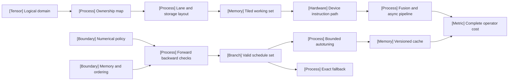

VOLUME II / PART V — HARDWARE, KERNELS, AND DISTRIBUTED EXECUTION / CHAPTER 26

# 26 — Kernel programming and numerical equivalence

A kernel optimization is acceptable only when its physical execution reduces a declared cost while preserving ownership, ordering, numerical and integration contracts over the required input envelope.

6 sections · 0 spine papers under the restricted source window · 8 named programming interfaces · prerequisites: 03, 05, 25 · artifact: a profiled operator with a correctness reference · updated 2026-10-09

## Why this chapter exists

[DERIVED] A correct tensor formula does not specify how indices are assigned to programs, how values move through storage or when another participant may consume them. Those decisions become dominant when an operator's arithmetic is small relative to data movement or submission overhead. Reusing a tile can remove reads; keeping its accumulator live can lower residency or create spills. Removing a launch can save submission cost while extending a dependency chain. The useful optimization is the one whose complete accounting improves under the required workload.

[DERIVED] The failure before this chapter is treating successful compilation and approximate output similarity as sufficient evidence. Partial tiles, duplicate indices, all-masked reductions, backward rules and mutable state expose defects that convenient square-matrix tests miss. Recent releases sharpen these boundaries: tile interfaces cross compiler layers, generated epilogues compete with library paths, and numerical debugging and memory instrumentation expose different defects. The solution is an explicit contract from scalar mathematics through layout, schedule, generated artifact and reference comparison. Correctness is a hard input to tuning. It is never adjusted afterward to rescue the timing winner.

[DERIVED] The dominant constraint can move after each accepted change. An implementation that removes global traffic may expose instruction issue or synchronization; a kernel that accelerates device work may expose framework dispatch. The artifact therefore retains rejected candidates and the full measurement boundary. That record makes a negative result useful and prevents the next integration layer from inheriting an unjustified speed claim.

## Concept map

- Logical domain → ownership → lane/storage layout → tiled working set → device instruction path.
  - Fusion and asynchronous pipelines change complete operator cost.
- Numerical policy and memory/ordering → forward/backward checks → valid schedules.
  - Bounded tuning → versioned cache → complete cost.
  - Unsupported inputs route to exact fallback.

## Position in the book

| Relation | Location | Boundary |
|---|---|---|
| Prerequisites | [Chapter 25](../ch25-accelerators-memory-hierarchy-and-performance-models/README.md) | Hardware hierarchy and performance premises; Chapters03/05 supply numerics and model operations |
| Siblings | [Chapter 27](../ch27-attention-latent-attention-and-expert-kernels/README.md), [Chapter 28](../ch28-frameworks-graph-compilers-and-runtime-integration/README.md) | Algorithm-specific kernels and graph/runtime integration |
| Downstream | [Chapter 29](../ch29-parallelism-collectives-and-distributed-optimization/README.md) | Distributed placement adds communication and ordering domains |
| Trades off with | [§26.5](26-5-tuning-and-portability.md), [§28.4](../ch28-frameworks-graph-compilers-and-runtime-integration/28-4-runtime-execution.md) | Specialization versus cold cost; fusion versus replay |

## Sections

| Section | Topic | What changes here | Evidence |
|---|---|---|---|
| [26.1](26-1-execution-primitives.md) | Execution primitives | Index ownership becomes a parallel schedule | DERIVED; OFFICIAL-DOCUMENTATION |
| [26.2](26-2-programming-ecosystems.md) | Programming ecosystems | Responsibilities move across interfaces/backends | OFFICIAL-DOCUMENTATION; DERIVED |
| [26.3](26-3-core-operators.md) | Core operators | Reuse, reduction and state contracts differ | MATHEMATICALLY-DERIVED; OFFICIAL-DOCUMENTATION |
| [26.4](26-4-fusion-and-dataflow.md) | Fusion and dataflow | Saved traffic extends local lifetime | MATHEMATICALLY-DERIVED; OFFICIAL-DOCUMENTATION |
| [26.5](26-5-tuning-and-portability.md) | Tuning and portability | Cached schedules require complete applicability keys | DERIVED; OFFICIAL-DOCUMENTATION |
| [26.6](26-6-correctness-under-optimization.md) | Correctness under optimization | Safety, values, derivatives and state pass separate gates | MATHEMATICALLY-DERIVED; OFFICIAL-DOCUMENTATION |

## Artifact

[DERIVED] The deliverable is a **profiled operator with a correctness reference**. `operator-contract.json` records shapes, strides, dtypes, masks, aliasing and state; `environment.json` records device/compiler/runtime/build hashes; `reference/` retains mathematical implementation and sealed inputs; `candidates.jsonl` preserves schedules and rejection reasons; `parity.jsonl` records forward/backward/state/safety gates; `profile.jsonl` records complete duration and bytes/resources; `dispatch.json` records applicability and fallback. Executable result fields remain unpopulated until the proposed study is run. A file schema is not a measurement.

## Verification

[DERIVED] Compare separated and optimized implementations across a sealed shape/layout/dtype matrix. Reject any candidate failing the predeclared numerical or memory/order contract. Profile accepted candidates only, including partial reductions, conversions, repacking and fallback under declared boundaries. One invalid required cell rejects the optimization for that envelope. Full protocol and topic audit are in [verification.md](verification.md); the experiment is unexecuted.

## Lineage

- 2025 · CUDA 13.1 tile interface, 2025-12-04 [R26.2] · **alternative branch** — thread-oriented and tile-oriented authoring have different interfaces.
- 2025 · Compute Sanitizer instrumentation, 2025-12-10 [R26.10] · **engineering optimization** — expanded memory detection.
- 2026 · ThunderKittens 2.0 deep dive, 2026-02-19 [R26.8] · **engineering optimization** — tile execution.
- 2026 · Triton 3.8 runtime/tuning record, 2026-08-28 [R26.16] · **current frontier** — inspected release boundary.
- 2026 · PyTorch 2.14 NVGEMM integration, 2026-09-02 [R26.11] · **engineering optimization** — kernel selection.

These are release relationships, not invention dates for established operators or tiling.

## Terms owned here

- **Kernel ownership map**, §26.1: assigns valid outputs or reduction contributions to authorized producers.
- **Complete-operator boundary**, §26.1: all launches, temporaries and synchronization required by the operator.
- **Fusion liveness contract**, §26.4: values/dependencies retained until the final required consumer.
- **Kernel applicability key**, §26.5: metadata class satisfying one cached schedule's preconditions.
- **Kernel numerical parity**, §26.6: agreement under declared value, gradient and state policies on a stated envelope.

## Reference-stack coverage

| Stack section | Entry | Stack layer | What is taken | Surface used | Sections | Evidence |
|---|---|---|---|---|---|---|
| §4 #1 | NVIDIA CUDA | Accelerator / driver / compiler | 13.1 execution, copies, sanitizer | https://docs.nvidia.com/cuda/ | 26.1,26.2,26.4,26.6 | OFFICIAL-DOCUMENTATION |
| §4 #2 | NVIDIA cuBLAS / cuBLASLt | Kernels / numerics / collectives | Possible product route; dispatch unverified | https://docs.nvidia.com/cuda/cublas/ | 26.3 | DERIVED |
| §4 #5 | NVIDIA CUTLASS | Kernels / numerics / collectives | 4.3.5 CuTeDSL interface | https://github.com/NVIDIA/cutlass | 26.2–26.5 | OFFICIAL-DOCUMENTATION |
| §4 #6 | Triton language | Kernels / numerics / collectives | 3.6 layouts,3.8 tuning/cache | https://triton-lang.org/ | 26.1,26.2,26.5 | OFFICIAL-DOCUMENTATION |
| §4 #8–9 | AMD ROCm; AMD HIP | Accelerator / driver / compiler | 7.2.0 hierarchy/memory | https://rocm.docs.amd.com/; https://rocm.docs.amd.com/projects/HIP/en/latest/ | 26.1–26.2 | OFFICIAL-DOCUMENTATION |
| §4 #17 | PyTorch | Model / autograd framework | 2.14 APIs/integration;2.10 debugging | https://pytorch.org/docs/stable/ | 26.2–26.6 | OFFICIAL-DOCUMENTATION |
| §4 #18 | JAX | Model / autograd framework | Released Pallas and numeric fixes | https://docs.jax.dev/ | 26.2,26.6 | OFFICIAL-DOCUMENTATION |
| Outside the reference stack | CuTeDSL; Pallas; TileLang; ThunderKittens | Kernel interfaces | Explicit plan§26.2 interfaces, kernel anchor | Dated/pinned official URLs in references | 26.2 | OFFICIAL-DOCUMENTATION |

**Inspection dimensions applied.** Precision appears in26.3/26.6; Memory and Kernels throughout; Parallelism in26.1/26.4; Communication is bounded to local coordination; Metrics in26.5; Reliability and Reproducibility in26.6/verification. Training datasets and checkpoint algorithms are not operator-owned; restoring optimizer state/layout is tested where applicable.

## Source route

[DERIVED] Follow the stack's official research/publication → primary full text → released code/configuration → independent measurement order. For papers use arXiv/OpenReview → proceedings → bibliographic identity → official code. This implementation chapter does not import older conference papers to fill the date window. Filled-in stack queries:

- `"NVIDIA CUDA" official documentation distributed training`
- `site:github.com "Triton" (architecture OR design OR RFC OR benchmark)`
- `"Triton" (throughput OR MFU OR tokens/s OR TTFT OR TPOT) "B200"`
- `"NVIDIA CUTLASS" "GEMM" "Blackwell" "4.3.5"`
- `site:github.com "Triton" (OOM OR deadlock OR NCCL OR RCCL OR checkpoint OR hang)`

Validate original release dates and exact versioned text. A search result or project ranking is a route, not primary mechanism evidence.

## Status

**manuscript_draft.** Nineteen authored figures accompany six full topics, with at least three figures and an adjustable calculator in every section. Sources are eligible primary disclosures/release artifacts; no experiment was run. UNVERIFIED: actual dispatch, runtime compatibility, sanitizer outcomes, performance, energy and money. NOT-DISCLOSED: matched all-interface protocols and independent uncertainty for vendor claims. These gaps block reviewed status and empirical superiority claims.
