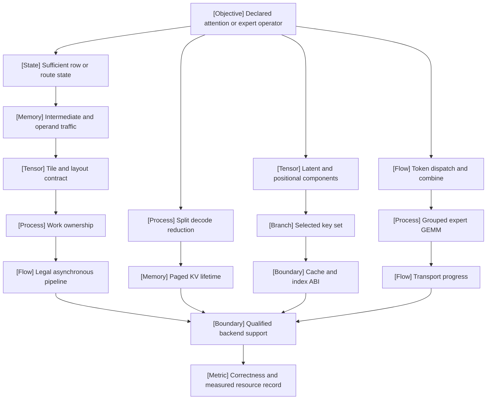

VOLUME II / PART V — HARDWARE, KERNELS, AND DISTRIBUTED EXECUTION / CHAPTER 27

# 27 — Attention, latent-attention, and expert kernels

[DERIVED] An attention or expert optimization is defensible only when its mathematical operator, representation, ownership, measured resource boundary, and release-specific support are preserved together.

6 sections · 0 spine papers · 7 reference-stack implementations · prerequisites: 14–17,25–26 · artifact: an algorithm-to-kernel analysis with hardware-specific measurements · updated 2026-10-09

## Why this chapter exists

[MATHEMATICALLY-DERIVED] Eliminating a quadratic attention intermediate does not eliminate dense query–key computation. Compressing KV state does not guarantee that the resulting matrix shapes execute efficiently. Selecting fewer keys changes the operator unless sparsity already belongs to its definition. Activating fewer experts does not remove dispatch, load imbalance, or communication. These are different interventions, and a single tokens/s number cannot identify which one produced a gain or which correctness contract it compromised.

[DERIVED] The dominant constraint changes with the execution phase. Prefill exposes many query rows; decode can expose too few owners while reading long histories. A newer device can shift the critical path from matrix multiplication to other units. A fused expert layer can save launches yet acquire a distributed progress obligation. At integration, package compatibility, cache compatibility, and kernel capability become separate constraints. The solution is an explicit chain from mathematical state through tensor layout and ownership to a qualified backend and a reproducible timer.

[DERIVED] This chapter's evidence window is **2025-12-01 through 2026-10-09**, inclusive. Every reference record states its first-publication or release date and the inspected revision. Established identities are reconstructed as mathematics, not advertised as newly discovered. An eligible recent report can discuss earlier mechanisms, but an inherited prewindow benchmark is not promoted to current empirical evidence. Primary-source prestige does not repair missing metadata: the FA4 source's hardware/date conflict and FlashMLA's breaking cache revision are retained as explicit review constraints.

## Concept map

- Declared operator
  - Sufficient state and intermediate traffic
    - Tile/layout contract and work ownership
      - Legal asynchronous pipeline
  - Split decode reduction and paged KV lifetime
  - Latent/position components and selected keys
    - Cache/index ABI
  - Dispatch/combine and grouped GEMM
    - Transport progress
  - Qualified support
    - Correctness and measured resource record

## Position in the book

| Relationship | Canonical locations |
|---|---|
| Prerequisites | [Attention/cache architectures](../../../vol-01-learning-and-representation/part-03-model-architectures-and-state/ch14-attention-architectures-and-cache-representations/README.md), [position/context](../../../vol-01-learning-and-representation/part-03-model-architectures-and-state/ch15-position-long-context-and-effective-information-access/README.md), [MoE architectures](../../../vol-01-learning-and-representation/part-03-model-architectures-and-state/ch16-mixture-of-experts-architectures/README.md), [sequence alternatives](../../../vol-01-learning-and-representation/part-03-model-architectures-and-state/ch17-state-space-recurrent-linear-attention-and-hybrid-models/README.md), [hardware models](../ch25-accelerators-memory-hierarchy-and-performance-models/README.md), [kernel correctness](../ch26-kernel-programming-and-numerical-equivalence/README.md) |
| Siblings (same part) | [Framework/compiler integration](../ch28-frameworks-graph-compilers-and-runtime-integration/README.md), [parallelism and collectives](../ch29-parallelism-collectives-and-distributed-optimization/README.md) |
| Downstream | [Inference resource models](../../part-07-inference-algorithms-distillation-and-compression/ch42-prefill-decode-kv-state-and-inference-resource-models/README.md) |
| Trades off with | [Numerical equivalence](../ch26-kernel-programming-and-numerical-equivalence/README.md), [effective information access](../../../vol-01-learning-and-representation/part-03-model-architectures-and-state/ch15-position-long-context-and-effective-information-access/README.md) |

## Sections

| Section | Title | What changes here | Primary evidence labels |
|---|---|---|---|
| [27.1](27-1-io-aware-attention.md) | IO-aware attention | A sufficient merge state replaces quadratic stored scores | MATHEMATICALLY-DERIVED; PAPER-REPORTED |
| [27.2](27-2-flashattention-lineage.md) | FlashAttention lineage | Execution follows a changing resource bottleneck | PAPER-REPORTED; DERIVED |
| [27.3](27-3-decode-specialized-attention.md) | Decode-specialized attention | Key partitions expose parallelism while adding a reduction | MATHEMATICALLY-DERIVED; PAPER-REPORTED |
| [27.4](27-4-mla-and-sparse-kernels.md) | MLA and sparse kernels | Representation, selection quality, and cache ABI separate | PAPER-REPORTED; OFFICIAL-DOCUMENTATION |
| [27.5](27-5-moe-execution.md) | MoE execution | Accepted routes become owned compute and transport work | MATHEMATICALLY-DERIVED; OFFICIAL-DOCUMENTATION |
| [27.6](27-6-integration-libraries.md) | Integration libraries | Capability qualification precedes dispatch and tuning | OFFICIAL-DOCUMENTATION; DERIVED |

## Artifact

[DERIVED] The deliverable is a reproducible **algorithm-to-kernel analysis with hardware-specific measurements**, specified in [verification](verification.md). It consists of `contract.json` for mathematical/operator semantics; `environment.json` for software/hardware identities; `capabilities.csv` for supported and rejected tuples; `accuracy.csv` for forward/backward and boundary errors; `resources.csv` for counted work and observed memory/transport; `timings.jsonl` for raw repeated costs; and `dispatch.jsonl` for selected backends, preparation, and fallback reasons. The manuscript contains the specification and unexecuted protocol, not fabricated measurement files.

[DERIVED] These records separate an algorithm change from a kernel change. The reference for exact attention uses the same admitted pairs. The reference for selected attention uses the same indices, with model-quality evaluation retained separately. Expert parity uses identical routes and mixture weights. Cache conversion has its own dequantization fixture. This makes a failure attributable instead of allowing one favorable end-to-end score to conceal several incompatible changes.

## Verification

[DERIVED] Compare every qualified kernel with the declared mathematical reference across a shape/mask/layout matrix, then measure matched implementations under identical workload and timing boundaries. Reject on any unsupported input silently accepted, invalid cache reinterpretation, numerical-budget violation, route loss, or unresolved race. Treat reduced traffic and improved elapsed time as separate hypotheses. The protocol also tests baseline sensitivity, split partitions, graph lifetimes, hot experts, and tuning-key invalidation. None of these experiments was performed for this edition.

## Lineage

- 2025 · DeepSeek-V3.2 report (2025-12-02) · **alternative branch**: [R27.2](references.md#r272) describes selection under a shared-latent model. The report explicitly inherits earlier architecture/evaluation; only its in-window disclosure is included here.
- 2026 · xFormers v0.0.35 (2026-02-20) · **engineering optimization**: [R27.9](references.md#r279) changes the dependency distribution boundary.
- 2026 · FlashAttention-4 (2026-03-05) · **current frontier**: [R27.1](references.md#r271) is a current hardware-co-design example, not a blanket frontier ranking.
- 2026 · FlashInfer v0.7/MegaMoE/Autotuner v2 (2026-09-22) · **engineering optimization**: [R27.5–R27.7], [R27.10] provide explicit execution, integration, and measurement boundaries.
- 2026 · FlashMLA breaking release (2026-09-30) · **alternative branch**: [R27.4](references.md#r274) changes model/device support and cache representation; compatibility must be requalified.

## Terms owned here

- **Streaming attention merge state — §27.1.** A shift, exponential denominator, and weighted numerator sufficient to combine disjoint admitted key subsets.
- **Attention partition normalizer — §27.3.** The exponential mass or its log representation that gives a partial output its correct global weight.
- **Cache ABI — §27.4.** A release-specific binary representation and interpretation contract for cache components, scales, pages, and selected indices.
- **Accepted-route conservation — §27.5.** The invariant that every admitted token–expert edge reaches compute and combine exactly once.
- **Capability-qualified dispatch — §27.6.** Selection only among implementations whose operator, representation, environment, and lifetime predicates hold.

[DERIVED] Architecture definitions, roofline concepts, standard latency metrics, and collective terminology remain at their canonical locations. These execution-specific terms do not redefine MLA, MoE, arithmetic intensity, or ITL.

## Reference-stack coverage

| Stack section | Entry | Stack layer | What this chapter takes from it | Surface used | Sections | Evidence label |
|---|---|---|---|---|---|---|
| §1 lab | #8 DeepSeek | — | December model disclosure and September cache release | Code: https://github.com/deepseek-ai | 27.4 | PAPER-REPORTED; OFFICIAL-DOCUMENTATION |
| §1 lab | #26 Together AI Research | — | FA4 coauthor affiliation and primary paper route | Research: https://www.together.ai/research | 27.1–27.2 | PAPER-REPORTED |
| §1 lab | #4 Meta AI / FAIR | — | xFormers release and FA4 coauthor affiliation | Code: https://github.com/facebookresearch | 27.2,27.6 | PAPER-REPORTED; OFFICIAL-DOCUMENTATION |
| §3 discovery | #1 arXiv | — | Exact v1 metadata and full-text retrieval for R27.1–R27.3 | https://arxiv.org/search/advanced | 27.1–27.4 | KNOWN: retrieval route only |
| §4 system | #39 FlashAttention | Kernels / numerics / collectives | FA4 execution example | https://github.com/Dao-AILab/flash-attention | 27.1–27.3,27.6 | PAPER-REPORTED |
| §4 system | #5 NVIDIA CUTLASS | Kernels / numerics / collectives | Source-disclosed kernel/DSL dependency | https://github.com/NVIDIA/cutlass | 27.1–27.2,27.5–27.6 | PAPER-REPORTED; OFFICIAL-DOCUMENTATION |
| §4 system | #3 NVIDIA cuDNN | Kernels / numerics / collectives | Version-bounded FA4 comparator | https://docs.nvidia.com/deeplearning/cudnn/ | 27.2 | PAPER-REPORTED |
| §4 system | #4 NVIDIA NCCL | Kernels / numerics / collectives | Source-disclosed split expert transport option | https://docs.nvidia.com/deeplearning/nccl/ | 27.5 | OFFICIAL-DOCUMENTATION |
| §4 system | #40 Liger Kernel | Kernels / numerics / collectives | v0.8.4 integration/correctness changes | https://github.com/linkedin/Liger-Kernel | 27.5–27.6 | OFFICIAL-DOCUMENTATION |
| §4 system | #17 PyTorch | Model / autograd framework | Framework compatibility boundary in release evidence | https://pytorch.org/docs/stable/ | 27.6 | OFFICIAL-DOCUMENTATION |
| §4 system | #41 vLLM | Inference engine | MegaMoE's disclosed integration/timing boundary | https://docs.vllm.ai/ | 27.3,27.5 | OFFICIAL-DOCUMENTATION |
| Outside the reference stack (routed via book_plan.md anchors) | FlashInfer; FlashMLA; NVSHMEM; xFormers | Kernels / numerics / collectives; inference integration | Named matrix coverage and official attention implementation anchor justify these specific releases and transport/dependency examples | R27.4–R27.7,R27.9–R27.10 primary URLs | 27.3–27.6 | OFFICIAL-DOCUMENTATION |
| Outside the reference stack (routed via book_plan.md anchors) | ByteCross authors | — | Matched decode-baseline study; not an implementation ranking | R27.3 originating paper | 27.3–27.4 | PAPER-REPORTED |

**Inspection dimensions applied.** [DERIVED] *Parallelism* covers query/key ownership and expert work; *Precision* covers accumulators, cache/weight/wire quantization; *Memory* covers score state, pages, scratch, and capacity; *Communication* covers expert payload/progress; *Kernels* covers attention/GEMM fusion; *Inference* covers decode, paging, and graph lifetime; *Metrics* fixes useful-work and recurring-call boundaries; *Reliability* covers stale buffers, route conservation, fallback, and abort; *Reproducibility* binds source versions and executed paths. Checkpointing and post-training objectives are not owned here because the operator reference does not specify a training-run or policy-learning procedure.

## Source route

[DERIVED] Apply the reference stack's lab search, paper cascade, and training-stack protocol literally, then reject sources outside the date window and inspect primary methods rather than relying on discovery snippets. Filled queries include:

- `site:arxiv.org/abs "Together AI" "FlashAttention-4"`
- `site:arxiv.org/abs "DeepSeek" "DeepSeek-V3.2" OR site:github.com/deepseek-ai "FlashMLA"`
- `cat:cs.CL AND ti:"FlashAttention"` followed by exact-title v1 history and full text.
- `site:github.com "FlashAttention" (architecture OR design OR RFC OR benchmark)`
- `"FlashInfer" (throughput OR TTFT OR TPOT) "B200"`
- `"Liger Kernel" "DeepSeek" "Blackwell" "v0.8.4"`

The cascade proceeds arXiv/OpenReview → proceedings if actually verified → author graph for identity → official code → first-party release context. No conference acceptance is inferred from an uploaded PDF or lab affiliation. The references retain preprint status where archival peer review was not established.

## Status

[DERIVED] **manuscript_draft**. Six substantive sections contain eighteen authored scientific figures, mathematical procedures, and explicit observation layers. Full text/release inspection supports bounded attribution; it does not certify scientific review, numerical equivalence, benchmark reproduction, or a rating. [UNVERIFIED] All local kernels, API compatibility, speed, traffic, gradient behavior, and deployment crossovers remain unexecuted. [NOT-DISCLOSED] Source inconsistencies, absent independent reproduction, and missing full hardware/energy/cost information are retained in [references](references.md) and [verification](verification.md).
