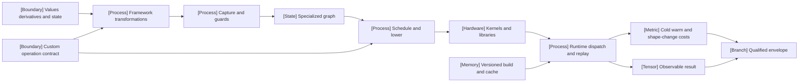

VOLUME II / PART V — HARDWARE, KERNELS, AND DISTRIBUTED EXECUTION / CHAPTER 28

# 28 — Frameworks, graph compilers, and runtime integration

A compiled execution profile is credible only when it identifies the preserved semantics, every specialization and integration boundary, and the complete cold, warm and changing-shape cost of its pinned artifact.

6 sections · 0 older spine papers under the restricted source window · 15 primary release/documentation records · prerequisites: 19, 25–27 · artifact: a reproducible framework/compiler execution profile · updated 2026-10-09

## Why this chapter exists

[DERIVED] A tensor program crosses several semantic owners before an accelerator executes it. The framework defines differentiation, state and placement; capture records a constrained computation; compilation decomposes and schedules it; custom operations expose or hide metadata; the runtime allocates, submits and replays work. A failure at one boundary can look like a failure at another. Fast kernels do not compensate for repeated compilation, and a successful trace does not certify an unvisited control path or a custom backward rule.

[DERIVED] This chapter makes the executable's applicability explicit. It distinguishes eager behavior from transformed behavior, mathematical values from storage ownership, graph capture from kernel generation, and launch replay from arithmetic reduction. Every optimization receives a semantic acceptance gate and a complete cost boundary. The proposed verification changes shapes, layouts and versions deliberately, because a deployment that works only for its warmup fixture is an inadequately specified deployment.

[OFFICIAL-DOCUMENTATION] The eligible release window exposes concrete integration changes: PyTorch 2.14 adds dynamic specifications, compiler/kernel routes and runtime facilities; JAX 0.11.2 changes export and FFI interfaces; LLVM and TVM release artifacts document representation and runtime responsibilities. These sources establish versioned contracts. They do not establish this book's performance results, compatibility matrix or a universal compiler ranking. [R28.1], release capabilities; [R28.3], release notes; [R28.7]–[R28.8], architecture artifacts.

## Concept map

- Values, derivatives and state ? framework transformations ? capture and guards ? specialized graph.
  - Scheduling and lowering produce kernels and library calls, then runtime dispatch/replay and observable results.
- Custom-operation contracts constrain transformations and lowering.
- Versioned build/cache identity constrains runtime reuse.
  - Observable parity and cold/warm/changing-shape costs jointly determine the qualified envelope.

The semantic contract enters before capture and remains an acceptance condition after replay. Custom-operation metadata constrains transformations and lowering. Build/cache identity governs whether an executable may be reused. Observable parity and the complete cost ledger jointly determine the qualified envelope; neither alone authorizes a performance claim.

## Position in the book

| Relation | Location | Boundary |
|---|---|---|
| Prerequisites | Chapters 19, 25–27 | Training state, hardware premises, kernel correctness and operator-specific implementations |
| Siblings | [Chapter 26](../ch26-kernel-programming-and-numerical-equivalence/README.md), [Chapter 27](../ch27-attention-latent-attention-and-expert-kernels/README.md) | Local numerical/scheduling contracts precede graph composition |
| Downstream | [Chapter 29](../ch29-parallelism-collectives-and-distributed-optimization/README.md), Chapter 30 | Placement/collectives and operational reliability inherit the executable contract |
| Trades off with | [§28.2](28-2-compilation-pipeline.md), [§28.4](28-4-runtime-execution.md), [§28.6](28-6-deployment-reproducibility.md) | Specialization versus cold cost; replay reuse versus memory; portability versus qualification burden |

## Sections

| Section | Topic | What changes here | Evidence |
|---|---|---|---|
| [28.1](28-1-framework-semantics.md) | Framework semantics | Values, derivatives, functional state and placements become explicit contracts | DERIVED; OFFICIAL-DOCUMENTATION |
| [28.2](28-2-compilation-pipeline.md) | Compilation pipeline | Capture assumptions become guarded applicability classes | DERIVED; OFFICIAL-DOCUMENTATION |
| [28.3](28-3-compiler-families.md) | Compiler families | Responsibilities are assigned to representations and backends | DERIVED; OFFICIAL-DOCUMENTATION |
| [28.4](28-4-runtime-execution.md) | Runtime execution | Replay adds storage, stream and amortization obligations | MATHEMATICALLY-DERIVED; OFFICIAL-DOCUMENTATION |
| [28.5](28-5-integration-boundaries.md) | Integration boundaries | Opaque operations expose transformation, derivative and fallback metadata | MATHEMATICALLY-DERIVED; OFFICIAL-DOCUMENTATION |
| [28.6](28-6-deployment-reproducibility.md) | Deployment reproducibility | Artifact identity bounds cache reuse and numerical qualification | DERIVED; OFFICIAL-DOCUMENTATION |

## Artifact

[DERIVED] The deliverable is a **reproducible framework/compiler execution profile**. Its semantic signature records shapes, layouts, dtypes, accumulation policy, state, gradients, placement and exceptions. Its capture ledger records guards, graph breaks, static arguments and variant identities. Its lowering ledger identifies generated kernels, external libraries and conversion work. Its runtime ledger records streams, buffers, graph/pool ownership, buckets and fallback. Its environment manifest records source/build hashes and framework, compiler, library, runtime, driver and architecture versions.

[DERIVED] Measurement fields distinguish tracing, compilation, artifact loading, allocation, warmup, first complete invocation, warmed execution and shape-triggered recompilation. A cache hit and a graph replay are separate events. The numerical record includes common cotangents, independently restored state and declared tolerances. Result fields remain unpopulated until execution. An exported graph, a manifest schema and an installed package are artifacts; none is a benchmark or a successful qualification result by itself.

[DERIVED] A reviewer should be able to answer a concrete question from this profile: for this request signature and environment, which artifact was selected, which assumptions were checked, what host/device work occurred, and what semantic and cost evidence authorizes reuse? If the record cannot answer that question, a single warmed latency is insufficiently attributable. Rejected input classes are retained because they define the boundary of the implementation rather than an embarrassing exception to remove.

## Verification

[DERIVED] Execute a sealed shape/layout/dtype/state matrix in eager/reference and compiled modes. Separate initial compile and warmup from steady reuse, then interleave supported signatures to trigger guards and recompilation. Test custom operation values and derivatives separately from registration metadata. Test graph replay with fresh values and repeated output consumption. Change one environment field and rerun qualification rather than assuming cache portability. The full unexecuted protocol and required-topic audit are in [verification.md](verification.md).

[DERIVED] Physical accounting preserves logical parameter count and valid token count when the transformation is semantics-preserving. Padding can increase executed work without adding valid tokens; fusion and lowering can change FLOPs, memory traffic and workspace. Placement can change communication while preserving a global tensor. Record those costs at the complete invocation boundary. Energy requires a synchronized power measurement, and money requires a dated resource price and billed duration; both are UNVERIFIED here. A reduction in visible launches alone cannot substantiate energy or financial savings.

## Lineage

- 2025 · CUDA 13.1 graph guide, 2025-12-04 [R28.9] · **engineering optimization** — inspected replay and update contract.
- 2026 · JAX 0.9.0, 2026-01-20 [R28.4] · **engineering optimization** — versioned explicit-sharding/export semantics.
- 2026 · TVM 0.23.0, 2026-02-01 [R28.8] · **alternative branch** — graph/primitive/runtime compilation architecture.
- 2026 · LLVM/MLIR 22.1.0, 2026-02-24 [R28.7] · **alternative branch** — infrastructure for representation and pass pipelines.
- 2026 · PyTorch 2.14, 2026-09-02 [R28.1] · **current frontier** — inspected framework/compiler/runtime integration release.
- 2026 · JAX 0.11.2, 2026-09-17 [R28.3] · **current frontier** — inspected JIT, FFI and cache snapshot.

These relations concern the selected release artifacts. They do not date the origin of automatic differentiation, tracing, graph compilers or runtime graphs, and they do not imply that one branch supersedes all others.

## Terms owned here

- **Framework semantic signature**, §28.1: observable values, derivatives, state and placement required of a transformed computation.
- **Guarded applicability set**, §28.2: inputs and environment satisfying one specialized executable's assumptions.
- **Compiler responsibility map**, §28.3: attribution of capture, transformations, schedules, libraries and target/runtime decisions.
- **Replay eligibility ledger**, §28.4: address, metadata, stream, pool and lifetime conditions permitting a graph launch.
- **Integration contract**, §28.5: custom operation metadata and rules needed by differentiation and compilation.
- **Deployment qualification identity**, §28.6: pinned artifact and environment for which numerical and execution evidence applies.

## Reference-stack coverage

| Stack section / entry | §4.1 layer / project role | What is taken | Surface used | Owning sections | Evidence |
|---|---|---|---|---|---|
| §4 #1 NVIDIA CUDA | ACCELERATOR / DRIVER / COMPILER; accelerator runtime | 13.1 graph and stream/lifetime contract | Versioned programming guide | 28.4, 28.6 | OFFICIAL-DOCUMENTATION |
| §4 #5 NVIDIA CUTLASS | KERNELS / NUMERICS / COLLECTIVES; kernel templates | NVGEMM's named generated-kernel dependency | PyTorch 2.14 release | 28.3 | OFFICIAL-DOCUMENTATION |
| §4 #6 Triton language | KERNELS / NUMERICS / COLLECTIVES; kernel DSL | Named kernel-generation boundary, not a universal dispatch claim | PyTorch 2.14 compiler guide | 28.3 | OFFICIAL-DOCUMENTATION |
| §4 #17 PyTorch | MODEL / AUTOGRAD FRAMEWORK; core training | Eager/autograd, capture, custom ops and runtime ownership | Versioned 2.14 docs/release | 28.1–28.6 | OFFICIAL-DOCUMENTATION |
| §4 #18 JAX | MODEL / AUTOGRAD FRAMEWORK; functional ML | Transformations, state, tracing, FFI and cache | Pinned 0.9.0/0.11.2 release trees | 28.1–28.3, 28.5–28.6 | OFFICIAL-DOCUMENTATION |
| §4 #20 PyTorch DTensor / DeviceMesh | DISTRIBUTED TRAINING; distributed tensor | Shard/Replicate/Partial placement semantics | Versioned 2.14 API | 28.1 | OFFICIAL-DOCUMENTATION |
| Outside the stack: TorchInductor, XLA, MLIR, Apache TVM | Compiler infrastructure / backend boundaries | Explicit book-plan §28.3 responsibilities | Release-scoped primary artifacts | 28.2–28.3 | OFFICIAL-DOCUMENTATION |

**Inspection dimensions applied.** Precision and gradients are semantic gates; memory includes saved values, workspace and replay pools; kernels and parallelism appear in lowering and placement; communication includes placement conversion and host transfers; reliability covers fallback, lifetimes and invalidation; metrics and reproducibility span the complete artifact. Training datasets are not owned here: inputs are sealed workload fixtures. Checkpoint recovery belongs downstream, while restoring state for parity is part of this chapter's protocol.

## Source route

[DERIVED] Follow official documentation/release → full primary text → pinned implementation → independent execution. Query examples instantiate the reference stack rather than substituting search snippets for evidence: `"PyTorch" "2.14" "compiler"`, `site:github.com/jax-ml/jax "jax-v0.11.2" "cache"`, `site:github.com/apache/tvm "v0.23.0" "architecture"`, and `site:github.com/llvm/llvm-project "llvmorg-22.1.0" "PassManagement"`. Verify the original release timestamp and inspect constraints as carefully as advertised capabilities. Full records are in [references.md](references.md).

## Status

**manuscript_draft.** Six substantive topics contain twenty authored scientific figures and numbered mathematical procedures, with at least three figures and an adjustable calculator in every section. Primary support is bounded to eligible release artifacts. No performance experiment, deployment compatibility test or gradient-check run was executed. These UNVERIFIED outcomes and inaccessible implementation decisions prevent reviewed status and any claim that the chapter has empirically outperformed a reference publication.
