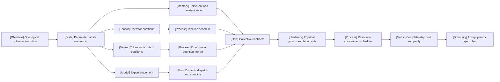

VOLUME II / PART V — HARDWARE, KERNELS, AND DISTRIBUTED EXECUTION / CHAPTER 29

# 29 — Parallelism, collectives, and distributed optimization

[DERIVED] A distributed training plan is valid only when its placements, communication and scheduling preserve one declared logical optimizer transition while satisfying physical resource and tensor-lifetime constraints.

6 sections · 0 eligible spine papers · 5 reference-stack implementations · prerequisites: 16, 19–20, 25–28 · artifact: a distributed placement and communication plan · updated 2026-10-09

## Why this chapter exists

[MATHEMATICALLY-DERIVED] Replication can exhaust parameter and optimizer capacity before local computation becomes the bottleneck. Sharding those states makes the persistent allocation smaller, but adds reconstruction and reduction. Partitioning operators reduces their local working sets, but introduces activation dependencies. Partitioning layers adds finite-wave fill and drain. Partitioning context requires a normalization-preserving attention algorithm; partitioning experts produces token-dependent traffic and load. None of those changes can be evaluated from its degree alone.

[DERIVED] The dominant constraint becomes the complete distributed execution graph: every tensor has a logical identity, physical ownership, production event, consumers and last-use boundary. Every collective has a result contract and a participant order. Every optimizer step has a token denominator and parameter version. Without those records, a faster trace can represent fewer tokens, a different mask, silently dropped assignments, stale weights, or omitted gradients. A principal-level review must reject such comparisons before considering throughput.

[DERIVED] This chapter therefore develops state and communication equations beside exact ownership and update invariants. It connects those equations to dated 2026 framework releases and recent primary systems papers, while distinguishing documented capability, source-reported evidence and original mathematical reconstruction. It includes a concrete counterexample to an overly broad peer-scheduling argument, because printed pseudocode also requires review. The resulting artifact predicts costs, declares gaps and specifies falsification tests. It does not claim that reading a release, rendering an interactive figure or compiling a manuscript reproduces distributed training.

## Evidence boundary

[DERIVED] Only primary artifacts first published or released from **2025-12-01 through 2026-10-09** support this chapter's factual disclosures. The user's cutoff excludes the historical spine papers P17/P18 as evidence; no updated revision is used to bypass that exclusion. Mathematical definitions and original derivations teach the canonical mechanisms without claiming recent invention. Version-specific release claims are narrower than executable compatibility. Papers are classified as preprints unless archival peer review was independently established.

## Concept map

- One logical optimizer transition fixes the reference computation.
  - Parameter-family ownership defines persistent/transient state.
  - Operator partitions define pipeline schedule and activation boundaries.
  - Token/context partitions require exact-mask attention merge.
  - Expert placement requires dynamic dispatch and weighted combine.
- Collective contracts satisfy those tensor dependencies.
  - Physical groups and fabric cuts constrain the execution schedule.
  - Complete-step cost and parity determine whether to accept or reject a plan.

## Position in the book

| Relation | Ownership and reading route |
|---|---|
| Prerequisites | [MoE architecture](../../../vol-01-learning-and-representation/part-03-model-architectures-and-state/ch16-mixture-of-experts-architectures/README.md), [training loop](../../../vol-01-learning-and-representation/part-04-training-science-and-adaptation/ch19-pretraining-objectives-and-the-full-training-loop/README.md), [optimization](../../../vol-01-learning-and-representation/part-04-training-science-and-adaptation/ch20-optimization-schedules-and-training-stability/README.md) |
| Siblings, same part | [Hardware/resource models](../ch25-accelerators-memory-hierarchy-and-performance-models/README.md), [kernel equivalence](../ch26-kernel-programming-and-numerical-equivalence/README.md), [specialized kernels](../ch27-attention-latent-attention-and-expert-kernels/README.md), [runtime integration](../ch28-frameworks-graph-compilers-and-runtime-integration/README.md) |
| Downstream | Planned Chapters 30, 36 and 44: reliability, distributed rollout and serving placement; [canonical chapter index](../../README.md) |
| Trades off with | Local operator efficiency in Chapter 26, saved activations and compiler/runtime boundaries in Chapter 28; distributed overhead can dominate a faster local kernel |

## Sections

| Section | What changes here | Primary evidence labels |
|---|---|---|
| [29.1 Data/state parallelism](29-1-data-state-parallelism.md) | Ownership of parameters, gradients and optimizer state changes while token-normalized updates remain fixed | MATHEMATICALLY-DERIVED; OFFICIAL-DOCUMENTATION |
| [29.2 Tensor and pipeline parallelism](29-2-tensor-and-pipeline-parallelism.md) | Operators and layers introduce different activation and schedule boundaries | MATHEMATICALLY-DERIVED; PAPER-REPORTED |
| [29.3 Sequence and context parallelism](29-3-sequence-and-context-parallelism.md) | Position sharding requires explicit mask-preserving normalization and load models | MATHEMATICALLY-DERIVED; PAPER-REPORTED |
| [29.4 Expert parallelism](29-4-expert-parallelism.md) | Dynamic assignments create irregular traffic, incast and parameter-family groups | MATHEMATICALLY-DERIVED; PAPER-REPORTED |
| [29.5 Collective communication](29-5-collective-communication.md) | Result semantics, physical algorithms and completion interfaces separate | MATHEMATICALLY-DERIVED; OFFICIAL-DOCUMENTATION |
| [29.6 Joint optimization](29-6-joint-optimization.md) | Placements, overlap and transitions become one resource-constrained problem | MATHEMATICALLY-DERIVED; PAPER-REPORTED |

## Artifact

[DERIVED] Deliver a **distributed placement and communication plan** containing: a logical model/update manifest; tensor-family ownership and replica groups; rank-to-GPU/NIC topology; explicit compute/collective/event DAG; per-rank persistent and peak-lifetime budgets; payload and physical-cut accounting; a schedule/overlap/recompute/offload configuration; numerical reference and acceptance tolerances; version and configuration hashes; cost predictions and their residuals; and a transition/recovery contract. Field-level requirements live in [verification](verification.md).

[DERIVED] Keep predicted quantities and measurements in separate fields. An unmeasured candidate remains a prediction. A plan rejected for numerical parity or capacity must retain that reason rather than disappear from the comparison. Do not convert missing source protocol details into plausible defaults: mark them unresolved and prevent stronger claims until the executor supplies a traceable configuration.

## Verification

[ASSUMED] The proposed protocol holds logical valid tokens, initialization, mask, routing and optimizer policy fixed, predicts state and traffic, and then changes parallel degrees and placements. It rejects an equivalence claim for mismatched gradients, omitted assignments, changed attention edges or mixed optimizer versions. A separate migration test checks integer coordinate coverage at non-power-of-two as well as power-of-two rank counts. No GPU experiment or independent paper reproduction was executed for this edition; [verification](verification.md) specifies future tests and the topic-completeness audit.

## Lineage

- 2025 · UCCL-EP v1, 22 December · *alternative branch*: portable expert communication control path. [R29.7]
- 2026 · NCCL 2.29.7, 27 February · *engineering optimization*: release-specific symmetric and device-communication capabilities. [R29.8]
- 2026 · DynaTrain v1, 12 May · *current frontier*: logical-coordinate layout transitions, with a peer-coverage qualification. [R29.4]
- 2026 · FlashCP v1, 7 June · *engineering optimization*: document-aware context placement. [R29.5]
- 2026 · Piper v1, 9 June · *current frontier*: explicit composed scheduling. [R29.3]
- 2026 · PyTorch 2.13, 8 July · *engineering optimization*: opt-in FSDP2 communicator separation. [R29.1]
- 2026 · HyDra v1, 28 September · *current frontier*: load-driven dynamic context distribution. [R29.6]

## Terms owned here

- **State ownership** — the unique or replicated logical coordinates assigned to a rank; §29.1.
- **Tensor-parallel boundary** — a placement change or partial-result completion required between partitioned operators; §29.2.
- **Pipeline bubble** — idle schedule capacity due to graph, stage and finite-wave constraints under a specified schedule; §29.2.
- **Context ownership** — assignment of query/KV positions together with the communication satisfying the declared attention mask; §29.3.
- **Expert assignment conservation** — every declared token/expert selection contributes exactly once to the combined output; §29.4.
- **Collective contract** — result semantics, group/split order and completion obligations of a distributed tensor transformation; §29.5.
- **Placement transition** — movement of one logically consistent state between physical layouts; §29.6.

## Reference-stack coverage

| Stack section | Entry | Stack layer | What this chapter takes | Surface used | Sections | Evidence |
|---|---|---|---|---|---|---|
| §3 | #1 arXiv | Discovery | Exact v1 full texts and original dates for five systems papers | https://arxiv.org/ | 29.1–29.6 | Retrieval only |
| §2 | #2 ICML | Discovery | Proceedings search route; original-date checks required before admission | https://proceedings.mlr.press/ | Source selection | Retrieval only |
| §4 | #17 PyTorch | Model / autograd framework | 2.11 differentiable collectives; 2.13 distributed release disclosures | https://pytorch.org/docs/stable/ | 29.1, 29.5 | OFFICIAL-DOCUMENTATION |
| §4 | #19 PyTorch FSDP2 | Distributed training | Separate AG/RS communicator option in 2.13 release | https://docs.pytorch.org/docs/stable/distributed.fsdp.fully_shard.html | 29.1 | OFFICIAL-DOCUMENTATION |
| §4 | #23 NVIDIA Megatron-Core | Distributed training | 0.19.0 MoE/CP/dispatch and release-specific limitations | https://docs.nvidia.com/megatron-core/index.html | 29.2–29.4, 29.6 | OFFICIAL-DOCUMENTATION |
| §4 | #4 NVIDIA NCCL | Kernels / numerics / collectives | 2.29.7 device/symmetric/ordering release record | https://docs.nvidia.com/deeplearning/nccl/ | 29.5 | OFFICIAL-DOCUMENTATION |
| §4 | #10 AMD RCCL | Kernels / numerics / collectives | ROCm 7.2.0 / RCCL 2.27.7 dated release | https://rocm.docs.amd.com/projects/rccl/en/latest/ | 29.4–29.5 | OFFICIAL-DOCUMENTATION |
| Outside the reference stack (routed via book_plan.md anchors) | Piper; DynaTrain; FlashCP; HyDra; UCCL-EP | Distributed training and communication studies | Original recent studies for the plan's parallelism/communication/MoE topics | Exact primary URLs in references.md | 29.1–29.6 | PAPER-REPORTED |
| Outside the reference stack (routed via book_plan.md anchors) | UCX; Open MPI; NVSHMEM | Communication interfaces | Plan explicitly lists MPI/UCX/NVSHMEM under communication | Exact tagged releases in references.md | 29.5–29.6 | OFFICIAL-DOCUMENTATION |

**Inspection dimensions applied.** Parallelism and Precision: §§29.1–29.4; Memory and Communication: all sections; Kernels: §§29.2–29.4; Checkpointing and Reliability: §§29.1, 29.5–29.6; Metrics and Reproducibility: all sections. Post-training and Inference are downstream applications, not experimentally established outcomes of this training-focused chapter. Discovery surfaces do not support a method or a performance claim.

## Source route

[DERIVED] Follow the reference stack's lab protocol (§1.1), conference workflow (§2.1), paper cascade (§3.1) and training-stack protocol (§4.3). Resolve first publication separately from revision and venue dates. Concrete queries used or retained for repeatable follow-up are:

- `site:arxiv.org/abs "NVIDIA" "expert parallelism"`
- `site:proceedings.mlr.press "context parallelism" "International Conference on Machine Learning"`
- `"Piper: A Programmable Distributed Training System" (NeurIPS OR ICML OR ICLR)`
- `"NVIDIA Megatron-Core" official documentation distributed training`
- `site:github.com "NVIDIA Megatron-Core" (architecture OR design OR RFC OR benchmark)`
- `site:github.com "NVIDIA NCCL" (OOM OR deadlock OR NCCL OR RCCL OR checkpoint OR hang)`

[DERIVED] The cascade is arXiv/OpenReview → exact title and revision → archival proceedings if eligible → bibliographic identity → official code/configuration → first-party implementation context. An ineligible first appearance remains excluded even if a newer archival version is available. Tag dates and embedded document dates can disagree; record both rather than silently choosing the convenient one.

## Status

[DERIVED] **Manuscript draft.** Six complete sections carry twenty-one authored native figures, twenty-one numbered equations and six mathematical procedures. Every section includes an adjustable analytical calculator. Figures calculate declared analytical examples or show ownership/dependency structures; none presents a fabricated benchmark. The bibliography records actual inspection on 2026-10-09. Scientific review and executable verification remain outstanding.

[NOT-DISCLOSED] Exact hardware/software/seed details are absent from some release disclosures, so no workload-specific gain is inferred. [UNVERIFIED] Installed compatibility, numerical parity, performance, power, monetary cost, fault recovery and the DynaTrain implementation's non-power-of-two behavior remain unchecked. Its printed peer loop is qualified by an explicit mathematical counterexample. These gaps prevent promotion to reviewed or released status.
