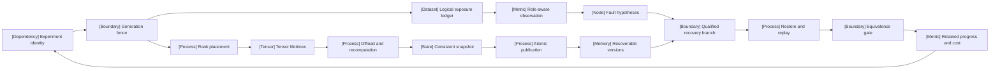

VOLUME II / PART V — HARDWARE, KERNELS, AND DISTRIBUTED EXECUTION / CHAPTER 30

# 30 — Large training runs: reliability, monitoring, and recovery

[DERIVED] A training run is recoverable only when its committed updates bind model, optimizer, data and scheduling state to one fenced experiment identity, and its monitoring distinguishes retained progress from repeated execution.

6 sections · 0 spine papers · 3 implementation anchors · prerequisites:12,19–21,25–29 · artifact:a training runbook and fault-injection report · updated2026-10-09

## Why this chapter exists

[DERIVED] A reference training step can be correct while its long-running execution is not. The process may read a different dependency, lose the data cursor during restart, mutate a checkpoint while writing it, or count replayed tokens as new progress. These failures are not repaired by a faster matrix multiplication. They require a consistent contract across the controller, execution layout, optimizer, input service and durable store. The relevant unit of reliability is the committed logical transition, not the lifetime of a process.

[PAPER-REPORTED] The inspected 2026 evidence develops several distinct responses: replica-scoped continuation, tiered or peer-memory copies, qualified communicator repair, and increasingly explicit diagnostic evidence contracts [R30.1, §4; R30.6, §3; R30.7, §V; R30.13, §III; R30.18, §4–6; R30.19, §3–4]. [DERIVED] The dominant constraint changes with what survives: storage bandwidth, host memory, healthy device state, or available diagnostic evidence. The methods cannot be substituted solely on a reported recovery-time number because their state and failure assumptions differ.

[DERIVED] This chapter binds those assumptions to implementable acceptance gates. It derives capacity and lost-work models, reconstructs source-specific experimental protocols, and treats unresolved state or cause as an explicit result. All book-authored diagrams and calculators are analytical explanations. They carry no invented measurements, and no proposed fault-injection experiment is presented as executed evidence.

## Concept map

- Experiment identity
  - Generation fence
    - Rank placement
      - Tensor lifetimes
        - Offload and recomputation
          - Consistent snapshot
            - Atomic publication
              - Recoverable versions
  - Logical exposure ledger
    - Role-aware observation
      - Fault hypotheses
        - Qualified recovery branch
          - Restore and replay
            - Equivalence gate
              - Retained progress and cost

[DERIVED] Identity and placement constrain memory; published state and observed faults jointly constrain recovery; validated retained progress informs the next run configuration.

## Position in the book

| Relation | Canonical chapters and boundary |
|---|---|
| Prerequisites | [Chapter 12](../../../vol-01-learning-and-representation/part-02-data-and-representation-engineering/ch12-scalable-data-infrastructure-and-reproducible-ingestion/README.md), [Chapter 19](../../../vol-01-learning-and-representation/part-04-training-science-and-adaptation/ch19-pretraining-objectives-and-the-full-training-loop/README.md), [Chapter 20](../../../vol-01-learning-and-representation/part-04-training-science-and-adaptation/ch20-optimization-schedules-and-training-stability/README.md), [Chapter 21](../../../vol-01-learning-and-representation/part-04-training-science-and-adaptation/ch21-scaling-laws-and-compute-allocation/README.md), [Chapter 25](../ch25-accelerators-memory-hierarchy-and-performance-models/README.md), [Chapter 26](../ch26-kernel-programming-and-numerical-equivalence/README.md), [Chapter 27](../ch27-attention-latent-attention-and-expert-kernels/README.md), [Chapter 28](../ch28-frameworks-graph-compilers-and-runtime-integration/README.md), [Chapter 29](../ch29-parallelism-collectives-and-distributed-optimization/README.md): update/state, numerical execution and distributed ownership contracts |
| Siblings (same part) | [Chapter 25](../ch25-accelerators-memory-hierarchy-and-performance-models/README.md), [Chapter 26](../ch26-kernel-programming-and-numerical-equivalence/README.md), [Chapter 27](../ch27-attention-latent-attention-and-expert-kernels/README.md), [Chapter 28](../ch28-frameworks-graph-compilers-and-runtime-integration/README.md), [Chapter 29](../ch29-parallelism-collectives-and-distributed-optimization/README.md): hardware, kernels and collective layouts; this chapter owns long-run execution state |
| Downstream | [Chapter 31](../../part-06-post-training-and-reinforcement-learning/ch31-supervised-fine-tuning-and-behavior-acquisition/README.md), [Chapter 36](../../part-06-post-training-and-reinforcement-learning/ch36-agent-rl-and-distributed-rollout-systems/README.md), [Chapter 44](../../part-08-inference-engines-and-production-serving/ch44-scheduling-distributed-serving-and-disaggregation/README.md): efficiency, scheduling and deployable artifacts require qualified state and cost records |
| Trades off with | [Chapter 25](../ch25-accelerators-memory-hierarchy-and-performance-models/README.md), [Chapter 29](../ch29-parallelism-collectives-and-distributed-optimization/README.md), [Chapter 31](../../part-06-post-training-and-reinforcement-learning/ch31-supervised-fine-tuning-and-behavior-acquisition/README.md): memory, communication, checkpoint durability and progress per allocated resource |

## Sections

| Section | Title | What changes here | Primary evidence |
|---|---|---|---|
| [30.1](30-1-training-orchestration.md) | Training orchestration | A configuration becomes a resolved, fenced launch contract | DERIVED; PAPER-REPORTED; OFFICIAL-DOCUMENTATION |
| [30.2](30-2-memory-management.md) | Memory management | Capacity follows lifetimes and exposed transfer/recompute cost | MATHEMATICALLY-DERIVED; PAPER-REPORTED |
| [30.3](30-3-checkpoint-design.md) | Checkpoint design | A collection of files becomes a qualified consistent state | DERIVED; PAPER-REPORTED; OFFICIAL-DOCUMENTATION |
| [30.4](30-4-failure-taxonomy.md) | Failure taxonomy | A symptom becomes a bounded hypothesis and containment decision | DERIVED; PAPER-REPORTED |
| [30.5](30-5-observability.md) | Observability | Metrics acquire denominators, closure and evidence limits | MATHEMATICALLY-DERIVED; PAPER-REPORTED |
| [30.6](30-6-recovery-and-reproducibility.md) | Recovery and reproducibility | Restart acquires a full-state equivalence and lost-work contract | MATHEMATICALLY-DERIVED; PAPER-REPORTED |

## Artifact

[DERIVED] The artifact is **a training runbook and fault-injection report**. Its runbook records resolved configuration/dependency digests, logical and physical rank maps, failure domains, numerical policies, admission constraints, resource reservations and phase deadlines. Its checkpoint ledger records immutable manifests, every state family, schema/coordinate ownership, completeness/integrity evidence, retention dependencies and source failure domains. Its replay ledger records canonical exposures, RNG identities, rejected and committed transitions, and the selected equivalence level. Its incident table records injection or real-event provenance, detector decisions, recovery phases, unresolved causes and allocated-resource cost. [Verification](verification.md) defines the exact file and field list; these are deliverable specifications, not artifacts claimed to have been produced by running training.

## Verification

[DERIVED] Kill a worker at controlled phases, select a qualified checkpoint, restore model/optimizer/data/scheduler state, and compare resumed transitions with an uninterrupted branch. Reject the recovery claim if any state family is absent, an obsolete generation can commit, canonical exposure is duplicated or omitted, or the declared equivalence gate fails. Extend the test to corrupt/incomplete shards, stalled telemetry and altered parallel layouts. The complete falsifiable protocols, controls and acceptance criteria are in [verification](verification.md). [UNVERIFIED] This edition has not executed them.

## Lineage

[DERIVED] The lineage lists eligible originating disclosures rather than silently reintroducing excluded older papers as new2026 work.

- 2026 · FT-HSDP [R30.1] · current frontier: replica-scoped continuation and catch-up.
- 2026 · TierCheck [R30.6] · engineering optimization: tiered differential recovery with a stated numerical contract.
- 2026 · DeadPool [R30.7] · alternative branch: host/peer state and hot swapping.
- 2026 · ARGUS [R30.18] · engineering optimization: bounded multi-resolution diagnostic evidence.
- 2026 · StageFrontier [R30.19] · alternative branch: inexpensive exact accounting with scoped attribution.
- 2026 · AccelPact v2 [R30.13] · current frontier: qualified repair of surviving committed state.

## Terms owned here

| Term | Canonical definition and owner |
|---|---|
| Generation fence | Sink-enforced rejection of obsolete launch writers; §30.1 |
| Experiment admission contract | Resolved identity, mesh and resource predicates required before launch; §30.1 |
| Checkpoint eligibility | Complete, integrity-qualified state satisfying identity/schema and recoverability requirements; §30.3 |
| Recovery equivalence level | Explicit state, bitwise, tolerance or statistical continuation claim; §30.6 |
| Retained exposure ledger | Logical training exposures committed after rollback/rejection accounting; §30.5–30.6 |
| Qualified in-memory repair | Continuation from committed healthy state only after audited communication-reference repair; §30.6 |

[DERIVED] Canonical optimizer, activation-checkpointing, sharding and utilization definitions remain in their prerequisite chapters. The present terms define the additional orchestration and recovery contracts and are not claims of new scientific terminology.

## Reference-stack coverage

| Stack section | Entry | Stack layer | What this chapter takes | Surface used | Sections | Evidence label |
|---|---|---|---|---|---|---|
| §1 lab |#4 Meta AI / FAIR | Not applicable | FT-HSDP originating report and authorship route | https://ai.meta.com/research/ ; https://github.com/facebookresearch |30.1,30.6 | PAPER-REPORTED |
| §3 discovery |1 · arXiv | Not applicable | Primary text/version history for R30.1,4–10,13,18–19 | https://arxiv.org/ ; https://arxiv.org/search/advanced | All | Retrieval route; primary records carry PAPER-REPORTED |
| §4 system |#21 TorchTitan | DISTRIBUTED TRAINING | v0.3.0 configuration, DCP guide/implementation and structured logging | https://github.com/pytorch/torchtitan |30.1–30.3,30.5–30.6 | OFFICIAL-DOCUMENTATION |
| §4 system |#23 NVIDIA Megatron-Core | DISTRIBUTED TRAINING |0.19.0 release and conditional numerical/transport issues | https://docs.nvidia.com/megatron-core/index.html |30.1–30.2,30.4 | OFFICIAL-DOCUMENTATION |
| §4 system |#24 Megatron-LM | DISTRIBUTED TRAINING | Official core release surface; source-reported training framework in DeadPool | https://github.com/NVIDIA/Megatron-LM |30.1,30.4,30.6 | OFFICIAL-DOCUMENTATION; PAPER-REPORTED |
| Outside the reference stack (routed via book_plan.md anchors) | MaxText | DISTRIBUTED TRAINING | Plan-explicit MaxText anchor;0.2.5 checkpoint migration/release | https://github.com/AI-Hypercomputer/maxtext |30.1,30.6 | OFFICIAL-DOCUMENTATION |

**Inspection dimensions applied.** [DERIVED] Parallelism (§30.1/30.6), Precision (§30.2/30.4/30.6), Memory (§30.2), Communication (§30.1/30.4–30.6), Kernels (§30.2/30.4/30.5), Checkpointing (§30.3/30.6), Metrics (§30.5/30.6), Reliability (all sections) and Reproducibility (all sections) are inspected. Post-training and Inference are not claimed as evaluated operating regimes. DeepSpeed, CUDA, NCCL and PyTorch versions appear as disclosed source testbed dependencies; no separately uninspected implementation capability is inferred from their names.

## Source route

[DERIVED] Follow the stack's lab sequence: official research index → publication index → primary version history → official code; independent measurement is relevant only after exact identity is established. Follow its conference workflow for an actual proceedings record before assigning peer review. The discovery cascade resolves a candidate to original full text, appendices and artifacts; a search result is not method evidence. The training-stack workflow then inspects configuration, precision, memory, collectives, checkpoint and reproducibility surfaces at one pinned release. Concrete queries used to recover eligible candidates include:

- `site:arxiv.org/abs "Meta AI" "fault tolerant" "2026"`
- `site:arxiv.org/abs "checkpointing" "2026" "training"`
- `site:arxiv.org/abs "silent data corruption" "2026"`
- `site:arxiv.org/abs "StageFrontier"`
- `site:github.com/pytorch/torchtitan "v0.3.0" "checkpoint"`
- `site:github.com/NVIDIA/Megatron-LM "core_v0.19.0"`

[DERIVED] Eligibility uses the originating disclosure date, not the newest revision date of an older paper. All canonical evidence families admitted here originate in 2026; versioned documentation is identified as a2026 artifact rather than an assertion that every underlying feature was invented then. The inspected sources do not establish a future conference presentation as completed. Exact dates, locators, exclusions and unresolved artifacts are recorded in [references](references.md).

## Status

[DERIVED] **manuscript_draft**. The six sections contain36 native authored figures, including six adjustable analytical calculators, and six numbered research-style procedures. The mathematics states its premises and is not presented as2026 invention. The chapter has no independently observed empirical claims. Source reports retain their original workload, scale, precision and uncertainty limits; selection of recent sources is not independent replication.

[NOT-DISCLOSED] Important gaps include full production dependency/model recipes for the 98K experiment; public complete code/schema audits for TierCheck; uniform confidence intervals and baseline pins across recovery studies; and exact deployment event prevalence. [UNVERIFIED] This edition has not executed launch partition tests, allocator stress, checkpoint power-loss tests, distributed SDC injection, instrumentation benchmarks or recovery/resharding experiments. DeadPool's inconsistent Vista device description is quarantined. These gaps prevent a reviewed-status or universal reliability claim. They do not justify replacing missing information with plausible constants.
