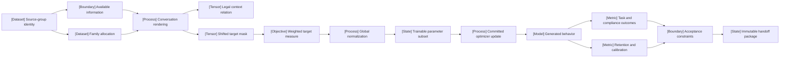

VOLUME II / PART VI — POST-TRAINING AND REINFORCEMENT LEARNING / CHAPTER 31

# 31 — Supervised fine-tuning and behavior acquisition

[DERIVED] Supervised fine-tuning acquires a declared conditional behavior only when its rendered information boundary, target measure and optimizer transition remain identifiable through training, validation and downstream handoff.

6 sections · 0 eligible historical spine papers · 9 eligible research papers · 1 versioned implementation · prerequisites: 10–12, 19–24, 30 · artifact: an SFT recipe with exact target masks and template fixtures · updated 2026-10-09

## Why this chapter exists

[MATHEMATICALLY-DERIVED] A completion dataset does not determine the behavior being optimized. The same conversation bytes can supervise the user, the assistant, tool observations, selected answer tokens or all valid positions. An example mean and a target-token mean can move gradients in different directions. Physical packing can introduce context across examples even when a target mask looks correct. A lower aggregate loss therefore cannot, by itself, establish a better assistant or even the same learning problem.

[DERIVED] The bottleneck is objective identifiability across a complete adaptation pipeline. Data selection changes the empirical population; rendering determines which evidence a target sees; truncation can remove its justification; training changes the distribution encountered during generated trajectories. After tuning, task utility, instruction compliance, base-domain retention and probability calibration remain separate obligations. An attractive answer can violate the tool protocol, and a correct extraction can carry an unjustified confidence value.

[DERIVED] The dominant constraint is an auditable contract linking source identity to legal conditioning, shifted labels, target mass, committed updates and evaluated outcomes. This chapter makes that contract explicit through derivations, bounded procedures and distinct falsification tests. It then relates the construction to primary studies first released in 2026 and a pinned trainer release. The result is a reproducible recipe specification with declared evidence gaps, rather than a universal hyperparameter prescription or an assertion that every contemporary model exposes its training details.

## Concept map



- Source-group identity determines family allocation and the available-information boundary.
  - Conversation rendering produces a legal context relation and a shifted target mask.
  - The mask defines a weighted target measure, then global normalization.
- The trainable parameter subset and committed optimizer update produce generated behavior.
  - Task/compliance outcomes and retention/calibration are distinct metrics.
  - Acceptance constraints determine whether an immutable handoff package is complete.

[DERIVED] Read the map as a dependency graph. No edge asserts that improving its source improves every downstream metric. In particular, target likelihood and generated utility are different observables. The text equivalent retains the same concepts so the graph is supplementary rather than the sole representation of the reasoning.

## Position in the book

| Relation | Canonical ownership and reading route |
|---|---|
| Prerequisites | [Tokenization/serialization](../../../vol-01-learning-and-representation/part-02-data-and-representation-engineering/ch10-tokenization-serialization-and-interface-correctness/README.md), [synthetic trajectories](../../../vol-01-learning-and-representation/part-02-data-and-representation-engineering/ch11-synthetic-data-preferences-and-interactive-trajectories/README.md), [reproducible ingestion](../../../vol-01-learning-and-representation/part-02-data-and-representation-engineering/ch12-scalable-data-infrastructure-and-reproducible-ingestion/README.md), [training loop](../../../vol-01-learning-and-representation/part-04-training-science-and-adaptation/ch19-pretraining-objectives-and-the-full-training-loop/README.md), [optimization](../../../vol-01-learning-and-representation/part-04-training-science-and-adaptation/ch20-optimization-schedules-and-training-stability/README.md), [compute allocation](../../../vol-01-learning-and-representation/part-04-training-science-and-adaptation/ch21-scaling-laws-and-compute-allocation/README.md), [continued training](../../../vol-01-learning-and-representation/part-04-training-science-and-adaptation/ch22-continued-pretraining-mid-training-and-domain-adaptation/README.md), [PEFT](../../../vol-01-learning-and-representation/part-04-training-science-and-adaptation/ch23-parameter-efficient-adaptation-and-model-composition/README.md), [continual learning](../../../vol-01-learning-and-representation/part-04-training-science-and-adaptation/ch24-continual-learning-model-editing-and-unlearning/README.md), [failure recovery](../../part-05-hardware-kernels-and-distributed-execution/ch30-large-training-runs-reliability-monitoring-and-recovery/README.md) |
| Siblings, same part | [Feedback and verifiers](../ch32-preferences-reward-models-verifiers-and-oversight/README.md), [direct preference objectives](../ch33-direct-preference-optimization-and-related-objectives/README.md), [policy-gradient alignment](../ch34-policy-gradients-ppo-and-rlhf/README.md), [reasoning and verifiable rewards](../ch35-verifiable-reward-rl-and-reasoning-policy-optimization/README.md), [distributed rollout](../ch36-agent-rl-and-distributed-rollout-systems/README.md) |
| Downstream | [Reference-policy scoring](../ch33-direct-preference-optimization-and-related-objectives/README.md), [RL initialization](../ch34-policy-gradients-ppo-and-rlhf/README.md), [online rollout](../ch36-agent-rl-and-distributed-rollout-systems/README.md), [policy distillation](../../part-07-inference-algorithms-distillation-and-compression/ch39-knowledge-response-and-policy-distillation/README.md) |
| Trades off with | [Full/parameter-efficient adaptation](../../../vol-01-learning-and-representation/part-04-training-science-and-adaptation/ch23-parameter-efficient-adaptation-and-model-composition/README.md) and [continual-learning retention](../../../vol-01-learning-and-representation/part-04-training-science-and-adaptation/ch24-continual-learning-model-editing-and-unlearning/README.md); changing capacity, input length or target population changes the cost/retention boundary |

## Sections

| Section | What changes here | Primary evidence labels |
|---|---|---|
| [31.1 SFT objectives](31-1-sft-objectives.md) | Selected positions and normalization become an explicit empirical measure | MATHEMATICALLY-DERIVED; OFFICIAL-DOCUMENTATION; PAPER-REPORTED |
| [31.2 Data families](31-2-data-families.md) | Seven data families require distinct information, validation and allocation contracts | MATHEMATICALLY-DERIVED; PAPER-REPORTED |
| [31.3 Conversation semantics](31-3-conversation-semantics.md) | Role events, shifted labels, truncation and packing preserve separate context and target boundaries | MATHEMATICALLY-DERIVED; OFFICIAL-DOCUMENTATION; PAPER-REPORTED |
| [31.4 Training choices](31-4-training-choices.md) | Capacity, learning rate, repetitions, curriculum and lengths define a bounded adaptation experiment | MATHEMATICALLY-DERIVED; PAPER-REPORTED |
| [31.5 Behavioral failure modes](31-5-behavioral-failure-modes.md) | Observable interventions distinguish style imitation, forgetting, execution failures and leakage | MATHEMATICALLY-DERIVED; PAPER-REPORTED |
| [31.6 Validation and handoff](31-6-validation-and-handoff.md) | Acceptance becomes a vector of independently assessed requirements and immutable interfaces | MATHEMATICALLY-DERIVED; PAPER-REPORTED |

## Artifact

[DERIVED] Deliver **an SFT recipe with exact target masks and template fixtures**. Its minimum package contains a source-group/split manifest; source licenses and provenance; tokenizer, processor and template revisions; rendered golden conversations with event offsets; legal attention relations; shifted labels and mask policies; fixed/detached weighting and denominator definitions; family allocation and exposure counters; trainable tensor identities; optimizer, precision and update-state records; complete candidate-selection history; generated evaluation outcomes; uncertainty and acceptance rules; and a frozen downstream scoring interface.

[DERIVED] Treat golden fixtures as executable contracts. Include multi-turn assistant/tool interactions, context-only system messages, an empty-target example, a truncated tool cycle, an example boundary inside a packed row and a long-context target requiring distant evidence. For each, the expected token identifiers, target positions and visibility edges are exact. An adapter alone is insufficient: it must identify the base model and merge/precision convention. A loss scalar alone is insufficient: it must identify numerator, target mass and normalization.

[DERIVED] Keep specification, prediction, source-reported result and future measurement in separate fields. Record a rejected candidate and its full budget, rather than deleting it from the comparison. A missing hardware revision or seed is unresolved evidence, even when the nominal framework name is present. The field-level package and the topic-completeness matrix are in [verification](verification.md).

```figure
id: fig-31.38
kind: cycle
title: Bounded SFT recipe revision
caption: Only training/selection evidence feeds recipe revision. The final held-out assessment remains outside this feedback
  loop; failed candidates and their full costs remain recorded.
placement: inline
evidence: DERIVED
source: DERIVED:eq-31.23
alt: Immutable source groups feed rendering, a bounded candidate fit and selection assessment. Selection evidence can revise
  the next recipe; acceptance freezes a handoff package. Final held-out test outcomes are not reused for selection.
spec:
  stages:
  - id: source
    label: Immutable source groups
    kind: dataset
  - id: render
    label: Render and audit
    kind: process
  - id: fit
    label: Bounded candidate fit
    kind: process
  - id: assess
    label: Selection assessment
    kind: metric
  - id: accept
    label: Freeze accepted package
    kind: state
  edges:
  - from: source
    to: render
  - from: render
    to: fit
  - from: fit
    to: assess
  - from: assess
    to: accept
  - from: assess
    to: render
    kind: feedback
    label: revise on selection data
```

## Verification

[ASSUMED] The proposed study compares response-only and full-sequence loss on identical source examples, initialization, rendered contexts and update budget. It checks target-mask fixtures and distributed normalization first, then evaluates generated utility, instruction compliance, retention, confidence and execution integrity on disjoint source groups. Additional controlled ablations isolate packing, example/token normalization and length. No GPU training or independent paper reproduction was executed for this manuscript; proposed thresholds and illustrative calculator inputs are not measured model capabilities.

## Lineage

- 2026 · Decision calibration v1, 19 January · *alternative branch*: separates answer accuracy from confidence quality. [R31.9]
- 2026 · RankTuner v1, 2 February · *current frontier*: a probability/rank-derived adaptive target indicator. [R31.2]
- 2026 · Data Repetition v1, 11 February · *alternative branch*: repeated small long-CoT subsets under a fixed update boundary. [R31.7]
- 2026 · TopoCurate v1, 2 March · *current frontier*: offline tool-trajectory structure with explicit mathematical qualifications. [R31.4]
- 2026 · GDO v1, 12 March · *current frontier*: goal-dependent multimodal selection. [R31.3]
- 2026 · FINCH v1, 19 May · *alternative branch*: a loss-adaptive learning-rate intervention for retention. [R31.8]
- 2026 · OpenAgent v1, 1 July · *current frontier*: controlled tool-environment shifts. [R31.5]
- 2026 · Post-Training Science v1, 1 September · *current frontier*: workload-specific recipe/metric sweeps. [R31.6]
- 2026 · TRL v1.13.0, 10 September · *engineering optimization*: versioned masking, collation and SFT execution interfaces. [R31.1]

```figure
id: fig-31.37
kind: lineage
title: Inspected 2026 SFT branches
caption: All artifacts first appeared in 2026. The order records first release within the eligibility window; it does not
  imply that one branch supersedes another.
placement: inline
evidence: PAPER-REPORTED
source:
- R31.9
- R31.2
- R31.7
- R31.4
- R31.3
- R31.8
- R31.5
- R31.6
- R31.1
alt: Nine dated branches span decision calibration, target weighting, repetition, trajectory selection, multimodal selection,
  retention, tool shifts, recipe sweeps and a trainer release. Their exact dates and relations are listed immediately above.
spec:
  entries:
  - year: 2026
    work: Decision calibration
    cite: R31.9
    relation: alternative branch
  - year: 2026
    work: RankTuner
    cite: R31.2
    relation: current frontier
  - year: 2026
    work: Data Repetition
    cite: R31.7
    relation: alternative branch
  - year: 2026
    work: TopoCurate
    cite: R31.4
    relation: current frontier
  - year: 2026
    work: GDO
    cite: R31.3
    relation: current frontier
  - year: 2026
    work: FINCH
    cite: R31.8
    relation: alternative branch
  - year: 2026
    work: OpenAgent
    cite: R31.5
    relation: current frontier
  - year: 2026
    work: Post-Training Science
    cite: R31.6
    relation: current frontier
  - year: 2026
    work: TRL v1.13.0
    cite: R31.1
    relation: engineering optimization
```

[DERIVED] These are parallel eligible branches, not a historical origin story for supervised learning. The plan's InstructGPT anchor predates the user's cutoff and is explicitly excluded as independent evidence. Contemporary source authors' older model or dataset choices are described only within their reported 2026 experiment. A new access date or revised preprint does not make an older first publication eligible.

## Terms owned here

- **SFT target measure** — the weighted empirical distribution over admitted shifted prediction events; §31.1.
- **Response-only objective** — supervision restricted to declared assistant response positions while retaining legal conditioning context; §31.1.
- **Example-normalized SFT** — equal mass per admitted nonempty example after its internal target normalization; §31.1.
- **Conversation fixture** — a versioned event-to-token rendering with exact expected masks, shifts and context edges; §31.3.
- **Semantically closed truncation** — a retained event prefix whose supervised targets keep their required evidence and event pairing; §31.3.
- **SFT acceptance vector** — independent task, compliance, retention, calibration and cost conditions for checkpoint selection; §31.6.
- **SFT handoff package** — immutable model, rendering and scoring identities required by the next learning stage; §31.6.

## Reference-stack coverage

| Stack section | Entry | Stack layer | What this chapter takes from it | Surface used | Sections | Evidence label |
|---|---|---|---|---|---|---|
| §3 | #1 arXiv | Discovery | Original dates and exact v1 full texts for R31.2–R31.10 | https://arxiv.org/ | 31.1–31.6 | Retrieval only |
| §2 | #2 ICML | Discovery | Archival RankTuner identity; acceptance is not inferred for OpenAgent | https://proceedings.mlr.press/ | 31.1; references | Retrieval only |
| §3 | #3 PMLR | Discovery | RankTuner proceedings identity distinct from inspected v1 | https://proceedings.mlr.press/ | 31.1; references | Retrieval only |
| §4 | #29 Hugging Face TRL | Post-training / RL | Tagged v1.13.0 SFT documentation, preparation/collation and release boundary | https://huggingface.co/docs/trl/ | 31.1–31.4, 31.6 | OFFICIAL-DOCUMENTATION |
| Outside the reference stack (routed via book_plan.md anchors) | None admitted | Not applicable | The TRL plan anchor is in §4; all papers use a listed primary-paper route | Exact primary URLs in references.md | All | No additional evidence route |

**Inspection dimensions applied.** [DERIVED] Post-training, Metrics and Reproducibility apply throughout; Precision and Memory are counted in §§31.1/31.4; Parallelism and Communication enter the global target denominator in §31.1; Kernels and padding/attention boundaries enter §31.3; Checkpointing and Reliability enter §§31.4–31.6. Inference is evaluated as generated behavior and tool execution, with no invented throughput or installed compatibility claim. A source's lab affiliation is not substituted for its disclosed method or budget.

## Source route

[DERIVED] Apply reference-stack §1.1's originating lab surface → primary paper/revision → code/config path when a lab attribution is relevant; §2.1's venue workflow for archival identity; §3.1's paper cascade for exact full text; and §4.3's documentation/architecture/compatibility/failure protocol for the trainer. Filled queries used or retained for repeatable follow-up are:

- `site:arxiv.org/abs "Qwen" "supervised fine-tuning" "2026"`
- `site:proceedings.mlr.press "Probability-Entropy Calibration" "International Conference on Machine Learning"`
- `"Data Repetition Beats Data Scaling in Long-CoT Supervised Fine-Tuning" (NeurIPS OR ICML OR ICLR)`
- `"Hugging Face TRL" official documentation distributed training`
- `site:github.com "Hugging Face TRL" (architecture OR design OR RFC OR benchmark)`
- `site:github.com "Hugging Face TRL" (OOM OR deadlock OR NCCL OR RCCL OR checkpoint OR hang)`

[DERIVED] Search results identify candidates, then originating full methods, experiments, appendices and tagged implementation establish what can be written. The first-publication filter precedes admission; inaccessible primary surfaces and omitted protocol fields remain recorded. Every cited artifact here first appeared in 2026 and was actually accessed on 2026-10-09. Discovery listings and venue prestige are retrieval metadata, not evidence for correctness or generalization.

## Status

[DERIVED] **Manuscript draft.** Six substantive sections contain 36 native technical figures, including six adjustable analytical calculators, 24 numbered derivations and six bounded research procedures. This chapter page adds the source-linked lineage figure. The evidence ledger admits ten original 2026 artifacts, nine research papers and one tagged release. All source-reported measurements are attributed; every calculator is a declared analytical example. Scientific review and the proposed model experiments remain outstanding.

[NOT-DISCLOSED] Some papers omit reconstructable hardware, precision, seeds or complete software locks; anonymous customer data and proprietary evaluation details restrict public reconstruction. [UNVERIFIED] Independent reproduction, source-code execution, trained checkpoint quality, deployment calibration, power, monetary cost and downstream compatibility remain untested. TopoCurate's threshold relation and appendix theory are qualified rather than promoted to mathematical guarantees. The failed archival-PDF and rendered-documentation requests are preserved in [references](references.md).
