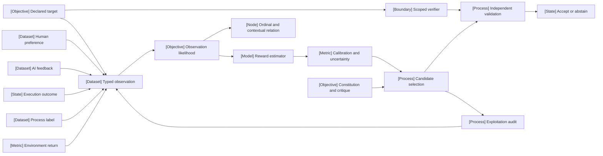

VOLUME II / PART VI — POST-TRAINING AND REINFORCEMENT LEARNING / CHAPTER 32

# 32 — Preferences, reward models, verifiers, and oversight

[DERIVED] A feedback system is fit for optimization only when its observation model, target, uncertainty and verification authority remain explicit under the candidate distribution the optimizer creates.

6 sections · 0 date-eligible historical spine papers · 13 primary artifacts, all first released in 2026 · 4 reference-stack implementations discussed through inspected papers · prerequisites: 02, 06, 11, 31 · artifact: a reward/verification specification and calibration study · updated 2026-10-09

## Why this chapter exists

[DERIVED] A scalar reward can conceal several incompatible measurements. Human preference, a generated critique, a passing test and an environment return can all become floats while supporting different propositions. Treating them as the same feedback loses the annotation context, test boundary and uncertainty needed to interpret an update. An optimizer may then improve a number whose connection to the intended task was never specified.

[DERIVED] The bottleneck becomes evidence rather than candidate production. Producing more answers or more judging samples does not create independent truth when their errors are correlated. A reward model may fit comparisons without identifying a globally meaningful utility. A verifier may faithfully check a predicate that incompletely describes the task. A critic may persuade a judge without adding a valid proof, executable counterexample or new observation.

[DERIVED] The dominant constraint is preservation of the measurement contract as the policy changes. An increase in selection pressure changes which candidates reach the evaluator and can expose unsupported regions, shortcuts or integrity failures. This chapter makes the source, estimator, decision rule and authority separate versioned objects. It reconstructs foundational likelihoods under explicit premises, examines eligible 2026 experiments and provides native analytical figures alongside reproducible mathematical procedures. The artifact supports an independent calibration and exploitation audit. It does not equate source prestige, visual polish or a successful manuscript compilation with scientific validation.

## Concept map

[DERIVED] The chapter's diagrams and proposed traces decompose the following formal contract into its typed components. Each figure caption states the particular analytical construction; diagrams do not report empirical model behavior.

$$
\mathcal F_v=(G,\mathcal O,\mathcal C,E,D,A,\mathcal L,\mathcal S),\qquad
\mathcal O\xrightarrow{E}\widehat G\xrightarrow{D}\mathcal S.
$$
*(Eq. 32.0)*

[DERIVED] Here $G$ is the declared target, $\mathcal O$ the typed observation space, $\mathcal C$ the conditioning context, $E$ the estimator or checking procedure, $D$ the selection/acceptance rule, $A$ the authority boundary, $\mathcal L$ the provenance/lineage ledger and $\mathcal S$ the output/status space. Version $v$ binds all components. The map has no correctness guarantee without the section-specific conditions developed below.



The same structure in text:

- Declared target governs typed observation and scoped verifier.
  - Human preference, AI feedback, execution outcome, process label and environment return produce different observation types.
  - Observation likelihood supplies the reward estimator and ordinal/contextual relation.
  - Calibration and uncertainty govern candidate selection.
- Constitution and critique affect candidate construction and selection.
- Scoped verifier and selected candidate meet at independent validation.
  - Independent validation accepts or abstains.
  - Exploitation audit examines selected candidates and supplies newly typed observations for a subsequent version.

## Position in the book

| Relation | Chapters and reason |
|---|---|
| Prerequisites | [2 — Mathematical and statistical foundations](../../../vol-01-learning-and-representation/part-01-scientific-foundations/ch02-mathematical-and-statistical-foundations/README.md) supplies likelihood/probability tools; [6 — Experimental design and evaluation before optimization](../../../vol-01-learning-and-representation/part-01-scientific-foundations/ch06-experimental-design-and-evaluation-before-optimization/README.md) owns experiment design; [11 — Synthetic data, preferences, and interactive trajectories](../../../vol-01-learning-and-representation/part-02-data-and-representation-engineering/ch11-synthetic-data-preferences-and-interactive-trajectories/README.md) owns preference-data collection; [31 — Supervised fine-tuning and behavior acquisition](../ch31-supervised-fine-tuning-and-behavior-acquisition/README.md) supplies the behavior-acquisition baseline |
| Siblings (same part) | [33 — Direct preference optimization and related objectives](../ch33-direct-preference-optimization-and-related-objectives/README.md) changes direct preference objectives; [34 — Policy gradients, PPO, and RLHF](../ch34-policy-gradients-ppo-and-rlhf/README.md) owns policy-gradient/PPO estimators; [35 — Verifiable-reward RL and reasoning policy optimization](../ch35-verifiable-reward-rl-and-reasoning-policy-optimization/README.md) owns verifiable-reward policy optimization; [36 — Agent RL and distributed rollout systems](../ch36-agent-rl-and-distributed-rollout-systems/README.md) owns distributed agent rollouts |
| Downstream | [38 — Inference-time reasoning, search, and adaptive compute](../../part-07-inference-algorithms-distillation-and-compression/ch38-inference-time-reasoning-search-and-adaptive-compute/README.md) uses scoring in search; [62 — Human preference, model judges, and uncertainty](../../../vol-03-grounded-and-interactive-intelligence/part-11-evaluation-interpretability-and-deployment-assurance/ch62-human-preference-model-judges-and-uncertainty/README.md) develops model-judge uncertainty at evaluation time; [64 — Mechanistic interpretability and causal model analysis](../../../vol-03-grounded-and-interactive-intelligence/part-11-evaluation-interpretability-and-deployment-assurance/ch64-mechanistic-interpretability-and-causal-model-analysis/README.md) owns causal and mechanistic model analysis |
| Trades off with | [6 — Experimental design and evaluation before optimization](../../../vol-01-learning-and-representation/part-01-scientific-foundations/ch06-experimental-design-and-evaluation-before-optimization/README.md) allocates held-out evidence; [36 — Agent RL and distributed rollout systems](../ch36-agent-rl-and-distributed-rollout-systems/README.md) allocates rollout work; [38 — Inference-time reasoning, search, and adaptive compute](../../part-07-inference-algorithms-distillation-and-compression/ch38-inference-time-reasoning-search-and-adaptive-compute/README.md) trades candidate exposure against work and selection risk |

## Sections

| Section | Title | What changes here | Primary evidence labels |
|---|---|---|---|
| [32.1](32-1-feedback-ontology.md) | Feedback ontology | Scalar feedback retains source, target and conditioning identity | DERIVED; PAPER-REPORTED |
| [32.2](32-2-preference-models.md) | Preference models | The likelihood declares ties, context and relation geometry | MATHEMATICALLY-DERIVED; PAPER-REPORTED |
| [32.3](32-3-reward-model-training.md) | Reward-model training | Fitting, selection and calibration use separate data authority | MATHEMATICALLY-DERIVED; PAPER-REPORTED |
| [32.4](32-4-outcome-and-process-verification.md) | Outcome and process verification | Acceptance establishes only the pinned predicate | DERIVED; PAPER-REPORTED |
| [32.5](32-5-oversight-strategies.md) | Oversight strategies | Critique, supervision and release remain separate roles | DERIVED; PAPER-REPORTED; OFFICIAL-DOCUMENTATION |
| [32.6](32-6-reward-exploitation.md) | Reward exploitation | Optimization changes evaluator exposure and needs independent truth | MATHEMATICALLY-DERIVED; PAPER-REPORTED; OFFICIAL-DOCUMENTATION |

## Artifact

[DERIVED] The **reward/verification specification and calibration study** is a proposed versioned artifact bundle. It contains a target/rubric record; typed observations and their lineage; observation-model and reward-model configurations; verifier predicates and trusted dependencies; calibration and shift reports; an oversight-role/access manifest; and a bounded adversarial-selection ledger. Each record includes its schema version, artifact identity, input population, information boundary, failure statuses and ownership. [Verification](verification.md) defines the field lists and acceptance rules. No generated manuscript figure is substituted for a measured study result.

## Verification

[DERIVED] Measure reward agreement with human judgments or scoped ground truth on disjoint units, retain ties and disagreements, and audit the deliberately proxy-optimized response set under matched work. Compare random and selected candidates, report calibration and conditional errors with group-aware uncertainty, and verify that evaluator integrity survives inert tampering tests. Reject the proposed specification if it cannot distinguish timeout from success, if the target evaluator changes during selection, or if score gains conceal independently measured target degradation. These are proposed tests; this edition has not executed them.

## Lineage

[DERIVED] The required date filter is a selection boundary, not a claim that preference learning originated in 2026. Historical mathematical foundations are derived locally with premises. The following dated works represent eligible branches examined here.

- 2026 · IRPM [R32.1] · engineering optimization.
- 2026 · Ordinal-feedback framework [R32.2] · alternative branch.
- 2026 · RewardUQ [R32.3] · alternative branch.
- 2026 · Automated Weak-to-Strong Researcher [R32.6] · current frontier.
- 2026 · VPR [R32.4] · alternative branch.
- 2026 · FormalRewardBench [R32.5] · current frontier.
- 2026 · Hybrid Reward-Cyclic model [R32.12] · alternative branch.
- 2026 · Shared judge and deferral [R32.13] · engineering optimization.
- 2026 · Reward-seeker model organism [R32.8] · current frontier.


```figure
{
  "id": "fig-32.37",
  "kind": "lineage",
  "title": "Eligible 2026 branches",
  "caption": "Dates record original 2026 releases. Branches change observation models, estimator uncertainty, verification or oversight; they are not a ranking.",
  "placement": "inline",
  "evidence": "PAPER-REPORTED",
  "source": ["R32.1", "R32.2", "R32.3", "R32.4", "R32.5", "R32.6", "R32.8", "R32.12", "R32.13"],
  "alt": "Dates record original 2026 releases. Branches change observation models, estimator uncertainty, verification or oversight; they are not a ranking. The structure is an analytical construction; it is not a measured result for a named model.",
  "spec": {
    "entries": [
      {
        "year": "2026",
        "work": "IRPM",
        "cite": "R32.1",
        "relation": "engineering optimization"
      },
      {
        "year": "2026",
        "work": "Ordinal feedback",
        "cite": "R32.2",
        "relation": "alternative branch"
      },
      {
        "year": "2026",
        "work": "RewardUQ",
        "cite": "R32.3",
        "relation": "alternative branch"
      },
      {
        "year": "2026",
        "work": "Automated weak-to-strong",
        "cite": "R32.6",
        "relation": "current frontier"
      },
      {
        "year": "2026",
        "work": "VPR",
        "cite": "R32.4",
        "relation": "alternative branch"
      },
      {
        "year": "2026",
        "work": "FormalRewardBench",
        "cite": "R32.5",
        "relation": "current frontier"
      },
      {
        "year": "2026",
        "work": "HRC",
        "cite": "R32.12",
        "relation": "alternative branch"
      },
      {
        "year": "2026",
        "work": "Shared judge and deferral",
        "cite": "R32.13",
        "relation": "engineering optimization"
      },
      {
        "year": "2026",
        "work": "Reward-seeker organism",
        "cite": "R32.8",
        "relation": "current frontier"
      }
    ]
  }
}
```


```figure
{
  "id": "fig-32.38",
  "kind": "cycle",
  "title": "Feedback version lifecycle",
  "caption": "The proposed cycle admits typed evidence, freezes a reward/verifier contract, selects candidates and independently audits them before admitting new feedback into a subsequent version.",
  "placement": "inline",
  "evidence": "MATHEMATICALLY-DERIVED",
  "source": "DERIVED:eq-32.0",
  "alt": "The proposed cycle admits typed evidence, freezes a reward/verifier contract, selects candidates and independently audits them before admitting new feedback into a subsequent version. The structure is an analytical construction; it is not a measured result for a named model.",
  "spec": {
    "stages": [
      {
        "id": "data",
        "label": "Typed evidence",
        "kind": "dataset"
      },
      {
        "id": "fit",
        "label": "Fit and calibrate",
        "kind": "process"
      },
      {
        "id": "freeze",
        "label": "Freeze contract",
        "kind": "state"
      },
      {
        "id": "select",
        "label": "Bounded selection",
        "kind": "process"
      },
      {
        "id": "audit",
        "label": "Independent audit",
        "kind": "metric"
      }
    ],
    "edges": [
      {
        "from": "data",
        "to": "fit"
      },
      {
        "from": "fit",
        "to": "freeze"
      },
      {
        "from": "freeze",
        "to": "select"
      },
      {
        "from": "select",
        "to": "audit"
      },
      {
        "from": "audit",
        "to": "data",
        "kind": "feedback",
        "label": "new version only"
      }
    ]
  }
}
```


## Terms owned here

- **Typed feedback contract** — the target, source, observation schema, conditioning variables and transformation retained with a feedback record; [§32.1](32-1-feedback-ontology.md).
- **Preference relation scope** — the context and population under which comparisons are modeled; [§32.2](32-2-preference-models.md).
- **Ordinal indifference interval** — a declared interval of noisy utility difference that emits a tie category; [§32.2](32-2-preference-models.md).
- **Comparison-graph gauge** — additive utility freedom unidentifiable from within-component differences; [§32.2](32-2-preference-models.md).
- **Reward handoff contract** — the frozen estimator, serializer, calibration and decision version passed to optimization; [§32.3](32-3-reward-model-training.md).
- **Verifier acceptance scope** — the exact predicate, artifacts, domain and trust assumptions established by acceptance; [§32.4](32-4-outcome-and-process-verification.md).
- **Oversight authority boundary** — which role may propose, change criteria, evaluate evidence and authorize acceptance; [§32.5](32-5-oversight-strategies.md).
- **Optimization-exposure audit** — independent target evaluation of the distribution produced by a declared proxy-search procedure; [§32.6](32-6-reward-exploitation.md).

## Reference-stack coverage

| Stack section | Entry | Stack layer | What this chapter takes from it | Surface used | Sections | Evidence label |
|---|---|---|---|---|---|---|
| §1 lab | #1 Anthropic | Not applicable | Originating oversight, constitution and reward-exploitation artifacts R32.6–9 | https://www.anthropic.com/research | 32.5–32.6 | PAPER-REPORTED; OFFICIAL-DOCUMENTATION |
| §1 lab | #2 OpenAI | Not applicable | Originating CoT-Control and monitorability release R32.10–11 | https://openai.com/research/ | 32.5–32.6 | OFFICIAL-DOCUMENTATION |
| §3 discovery source | #1 arXiv | Discovery only | Original histories and pinned full texts R32.1–5, R32.12–13; academic authors need not be a ranked lab | https://arxiv.org/ | 32.1–32.5 | Retrieval route only |
| §4 system | #29 Hugging Face TRL | Post-training / RL | Source-reported RewardUQ training framework; no API compatibility claim | https://huggingface.co/docs/trl/ | 32.3 | PAPER-REPORTED |
| §4 system | #37 verl | RL post-training | Source-reported IRPM training framework | https://verl.readthedocs.io/en/latest/ | 32.1, 32.3 | PAPER-REPORTED |
| §4 system | #24 Megatron-LM | Training reference stack | Source-reported VPR trainer integration; no repository execution | https://github.com/NVIDIA/Megatron-LM | 32.1, 32.4 | PAPER-REPORTED |
| §4 system | #41 vLLM | LLM inference engine | Source-reported VPR rollout engine | https://docs.vllm.ai/ | 32.1, 32.4 | PAPER-REPORTED |

**Inspection dimensions applied.** Post-training: observation likelihood, ranking/ordinal losses and source update recipes (§§32.1–32.5). Precision: BF16 disclosed by the ordinal experiment (§32.2). Memory and Parallelism: member models, shared heads, candidate state and source hardware (§§32.2–32.6). Communication: serialized candidate/checker boundaries and isolated evaluation (§§32.4–32.6). Inference: score sampling, generation work and candidate exposure (§§32.1, 32.3, 32.6). Metrics, Reliability and Reproducibility: calibration definitions, failure statuses, correlation, source pins and withheld audits throughout. Checkpointing is addressed as artifact identity/checkpoint selection, without asserting a framework recovery implementation. Kernel behavior is not inspected; no kernel-specific speedup is claimed.

[DERIVED] The ROLL name occurs only as the VPR paper's declared surrounding framework, outside §4. It is not adopted as a new canonical stack entry, a separately admitted research source or an executable implementation recommendation. Old model and dataset names occurring in 2026 experiments identify experimental objects, not newly eligible publications. No conference acceptance is asserted from an arXiv keyword or publication-year label; no conference row is added merely to satisfy a quota.

## Source route

[DERIVED] Apply the reference stack's lab-level search, conference/proceedings cross-check, paper-discovery cascade and training-stack search in that order as appropriate. Check original submission/release dates before reading a newer revision as canonical evidence; then inspect methods, experiments and appendices. The research pass used filled topic queries including:

- `site:anthropic.com/research "weak-to-strong" OR site:arxiv.org/abs "Anthropic" "weak-to-strong"`
- `site:openai.com/research "monitorability" OR site:arxiv.org/abs "OpenAI" "monitorability"`
- `site:arxiv.org/abs "ordinal feedback" "reward" 2026`
- `site:arxiv.org/abs "verifiable process rewards" 2026`
- `site:proceedings.mlr.press "reward modeling" "International Conference on Machine Learning"`
- `site:github.com "verl" "reward modeling"`

The primary record, rather than the search result, governs attributed claims. The current implementation documentation roots above identify exact stack entries; framework behavior taught here is limited to what the inspected 2026 papers disclose. Uninspected current APIs remain UNVERIFIED.

## Status

Editorial status: **manuscript_draft**. All 13 canonical primary artifacts first appeared in 2026 within the required 2025-12-01 through 2026-10-09 interval: 100%, exceeding the requested 90% source share. Access date is 2026-10-09, distinct from original release and inspected version. The corpus does not establish every mechanism's novelty or superiority.

The draft contains six complete section treatments, six mathematical procedures, 22 numbered definitions/derivations and 38 native figures, including six adjustable calculators. Evidence gaps remain: exact commits and independently executed packages; some seeds and uncertainty estimates; VPR's unusual normalization boundary; FormalRewardBench's S3-validation contradiction; Reward-seeker's undisclosed exact August day; and broad weak-to-strong/oversight transfer. [References](references.md) retains precise boundaries, and [verification](verification.md) retains their review consequences. Scientific and browser review are separate gates. No training result, safety guarantee or 10/10 review rating is certified.
