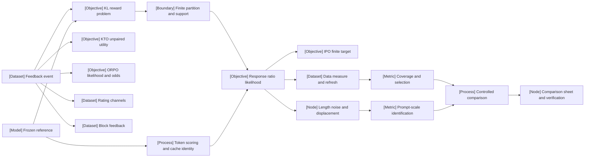

VOLUME II / PART VI — POST-TRAINING AND REINFORCEMENT LEARNING / CHAPTER 33

# 33 — Direct preference optimization and related objectives

[DERIVED] Direct preference training is scientifically interpretable only when its feedback model, reference measure, token reductions, data-generation process and outcome protocol remain explicit and independently auditable.

6 sections · 0 admitted spine papers · 1 inspected implementation family · prerequisites:02,23,31–32 · artifact: an objective-comparison sheet and controlled preference experiment · updated2026-10-09

## Why this chapter exists

[DERIVED] A binary comparison is easier to collect than a complete utility function, but it contains less information. The optimization problem becomes dangerous when that information limit disappears behind a convenient loss name. A preferred response can become less likely while its relative margin improves. A reference-free score can save model residency while changing the mathematical anchor. A length-normalized target can alter the learning problem while appearing to be a harmless numerical rescaling. These are observable technical distinctions, not stylistic preferences between trainers.

[DERIVED] The bottleneck is now consistency across the full chain from annotation to probability to deployment measurement. The same visible pair can acquire different log probabilities through chat templates, terminators, truncation and masks. Recently generated candidates can still support a frozen offline supervised objective. A prompt-dependent scale can fit residuals without identifying human uncertainty. A one-seed evaluation interval can be precise about prompts while saying little about training variation.

[DERIVED] This chapter makes those boundaries first-class objects. It derives the fixed-reference construction under explicit conditions, gives each canonical alternative its actual objective, and separates source-reported evidence from mathematical reconstruction. The resulting artifact supports a defensible decision about a particular intervention under a particular budget. It does not promise that fitting a preference proxy establishes general task capability or that one benchmark ranks every objective family.

## Concept map

- Feedback event
  - KL reward problem
    - Frozen reference
    - Finite partition and support
    - Response ratio likelihood
      - IPO finite target
  - KTO unpaired utility
  - ORPO likelihood and odds
  - Rating channels
  - Block feedback
- Token scoring and cache identity
  - Data measure and refresh
    - Coverage and selection
  - Length noise and displacement
    - Prompt-scale identification
- Controlled comparison
  - Comparison sheet and verification

[DERIVED] The graph distinguishes an objective branch from its data measure and evaluation. An edge denotes a stated dependency, not experimental proof of superiority. The text list repeats every concept for accessible reading without requiring the visualization.

## Position in the book

| Relation | Linked location and role |
|---|---|
| Prerequisites | [Chapter02](../../../vol-01-learning-and-representation/part-01-scientific-foundations/ch02-mathematical-and-statistical-foundations/README.md): probability and estimation; [Chapter23](../../../vol-01-learning-and-representation/part-04-training-science-and-adaptation/ch23-parameter-efficient-adaptation-and-model-composition/README.md): adapter ownership; [Chapter31](../ch31-supervised-fine-tuning-and-behavior-acquisition/README.md): instruction-tuned baseline; [Chapter32](../ch32-preferences-reward-models-verifiers-and-oversight/README.md): feedback/evaluators |
| Siblings (same part) | [Chapter34](../ch34-policy-gradients-ppo-and-rlhf/README.md): sampled policy-gradient updates; [Chapter35](../ch35-verifiable-reward-rl-and-reasoning-policy-optimization/README.md): verifier-driven reasoning policies |
| Downstream | [Chapter36](../ch36-agent-rl-and-distributed-rollout-systems/README.md): versioned generation/training systems |
| Trades off with | [Chapter32](../ch32-preferences-reward-models-verifiers-and-oversight/README.md): explicit reward models and oversight; [Chapter34](../ch34-policy-gradients-ppo-and-rlhf/README.md): online sampling cost and update assumptions |

[DERIVED] Definitions remain at their canonical locations. This chapter uses SFT and preference-data contracts rather than re-teaching their whole mechanisms. It owns the transformation from feedback to direct policy objective, including the implementation and comparison consequences of that transformation.

## Sections

| Section | Title | What changes here | Primary evidence labels |
|---|---|---|---|
| [33.1](33-1-dpo-derivation.md) | DPO derivation | A known-reward optimum becomes a conditional comparison likelihood under explicit premises | MATHEMATICALLY-DERIVED; PAPER-REPORTED |
| [33.2](33-2-reference-policy-effects.md) | Reference-policy effects | Reference odds and token-event identity become part of the objective | MATHEMATICALLY-DERIVED; OFFICIAL-DOCUMENTATION |
| [33.3](33-3-objective-families.md) | Objective families | Feedback, normalization, targets and training-only state differ by method | OFFICIAL-DOCUMENTATION; MATHEMATICALLY-DERIVED; PAPER-REPORTED |
| [33.4](33-4-offline-versus-online-data.md) | Offline versus online data | The data measure and selection process change independently of the loss | MATHEMATICALLY-DERIVED; PAPER-REPORTED |
| [33.5](33-5-bias-and-pathology.md) | Bias and pathology | Likelihood, length, noise and scale identification require separate diagnostics | MATHEMATICALLY-DERIVED; PAPER-REPORTED |
| [33.6](33-6-controlled-comparison.md) | Controlled comparison | Equal-data, equal-compute, calibration and task contrasts acquire different controls | MATHEMATICALLY-DERIVED; PAPER-REPORTED |

## Artifact

[DERIVED] Produce **an objective-comparison sheet and controlled preference experiment** with the exact schema in [verification](verification.md). The comparison sheet records objective equation and coefficient units; feedback type and information budget; preprocessing and masks; response-sum/mean/NLL reductions; reference/initialization identities; auxiliary state; valid row/token exposure; generation, label, cache, pilot, fit and evaluation costs; protocol locators; seed-level/per-prompt outcomes; uncertainty; negative findings; and unresolved fields.

[DERIVED] The experiment specification includes six bounded checks and a completeness map. Its expected outputs are proposed artifacts, not measurements already collected. A later implementation must retain failures and exclusions as results rather than adjusting the schema until every arm appears successful. Separate complete-study cost from marginal reuse cost when auxiliary artifacts are shared.

## Verification

[DERIVED] Falsify the mathematical and engineering contracts before interpreting model quality: a finite-support Gibbs identity, exact shifted-score parity and cache invalidation, objective-specific loss/gradient checks, bounded data-selection/refresh accounting, noise/length/scale identification controls, and a matched training/evaluation comparison. The final study must report actual task outcomes alongside preference fit and calibration, with beta, corruption and length sensitivity. [UNVERIFIED] These experiments are specified but unexecuted; their full protocol is in verification.md.

## Lineage

- 2026 · [Rating-informed DPO](references.md#r331) · **alternative branch** · numerical gaps add a supervision channel with explicit statistical conditions.
- 2026 · [Autoregressive DPO](references.md#r332) · **alternative branch** · block feedback changes the likelihood factorization.
- 2026 · [G2D](references.md#r334) · **engineering optimization** · bounded online preparation supplies a static offline dataset under the disclosed recipe.
- 2026 · [TRL v1.13.0](references.md#r335) · **engineering optimization** · a dated implementation surface exposes objective-specific score/reduction conventions.
- 2026 · [Uncertainty-normalized margins](references.md#r333) · **current frontier** · learned prompt scales and length units require a separate identification audit.

[DERIVED] Older conceptual foundations are reconstructed mathematically, with no historical novelty claim or admitted pre-window citation. The source ledger dates first publication, not the most recent revision. A model or dataset named inside an eligible experiment is workload context and does not smuggle its older founding paper into the evidence window.

## Terms owned here

| Term | Canonical definition and owner |
|---|---|
| Direct preference reparameterization | Expressing a same-prompt comparison utility gap through policy/reference log ratios under a declared optimum/feedback model; §33.1 |
| Reference-relative margin | Change in chosen/rejected log odds relative to a frozen reference; §33.2 |
| IPO target contract | A square target on a declared reference-relative score, including its response normalization; §33.3 |
| KTO baseline contract | Detached nonnegative batch statistic used by the inspected unpaired bounded-utility objective; §33.3 |
| ORPO odds contract | Chosen NLL plus odds contrast of declared mean response log probabilities; §33.3 |
| Feedback length | Number of local comparison events imposed by a declared block partition; §33.3 |
| Pairability | Event that a sampled verifier group contains both success and failure outcomes; §33.4 |
| Advantage-only margin scaling | Dividing the reward gap by prompt scale before subtracting a strength margin; §33.5 |
| Whole-residual margin scaling | Dividing the reward-gap-minus-margin residual by prompt scale; §33.5 |
| Objective-comparison boundary | The declared information, resource and outcome controls defining a method contrast; §33.6 |

## Reference-stack coverage

| Stack section | Entry | Stack layer | What this chapter takes from it | Surface used | Sections | Evidence label |
|---|---|---|---|---|---|---|
| §3 discovery source | #1 arXiv | Not applicable | Exact primary manuscript/history retrieval for R33.1–R33.4; no affiliation or peer-review inference | https://arxiv.org/ |33.1,33.3–33.6 | PAPER-REPORTED |
| §4 system | #29 Hugging Face TRL | Post-training / RL | v1.13.0 official release and tagged DPO/IPO/KTO/experimental ORPO scoring paths | https://huggingface.co/docs/trl/ |33.1–33.6 | OFFICIAL-DOCUMENTATION |

**Inspection dimensions applied.** [DERIVED] **Post-training**: all objective and feedback units; **Precision/Kernels**: log-domain stability and unexecuted parity boundary in33.2–33.3; **Memory/Communication**: reference residency, auxiliary caches and denominator aggregation; **Metrics**: preference fit, calibration, task outcomes and total cost in33.6; **Reliability/Checkpointing/Reproducibility**: finite failure exits, immutable identity, reference-cache binding and retained training state. No throughput, energy or compatibility claim is inferred merely from a system name.

[DERIVED] No independent out-of-stack implementation is used. Other frameworks and older model/dataset names occur only inside a primary paper's disclosed experimental context; their code is not represented as inspected. The plan explicitly anchors TRL. Discovery records route readers to evidence and are not evidence of a scientific mechanism themselves.

## Source route

[DERIVED] Apply the reference stack's §3.1cascade from exact primary title/history to archival proceedings if available, then bibliographic disambiguation and first-party code. The §1.1lab sequence starts with official research/publication indices before a primary manuscript; it does not turn a paper retrieved on arXiv into a top-lab paper. The §2.1conference workflow checks actual proceedings and review status before calling a work peer-reviewed. No inspected record here is promoted from preprint on the basis of a conference acronym in related work.

Repeatable filled-in queries and routes are:

- `cat:cs.LG AND ti:"preference optimization" AND submittedDate:[202512010000 TO 202610092359]`, followed by the originating arXiv history.
- `site:arxiv.org "Direct Preference Optimization with Rating Information"`, followed by v1method, proof and Appendix F.
- `site:arxiv.org "Uncertainty-Normalized Margins"`, followed by Appendix E and the identification proof.
- `"Hugging Face TRL" official documentation distributed training`, using §4.3official-documentation-first protocol, then the dated release/tag.
- `site:github.com "Hugging Face TRL" (architecture OR design OR RFC OR benchmark)`, followed by exact v1.13.0 source paths rather than mutable summaries.
- `site:proceedings.neurips.cc "direct preference optimization" "2026"`, following §2.1venue verification; a query is not proof of acceptance.

## Status

[DERIVED] **manuscript_draft**. The nine canonical files contain36authored native figures, six adjustable calculators, numbered mathematics and bounded procedures. All five canonical evidence families originate2026. The admitted primary studies are preprints; no external score, chief-scientist endorsement or independent replication is claimed.

[NOT-DISCLOSED] Several sources omit precision, seed counts, pinned software or complete end-to-end cost. [UNVERIFIED] Installed parity, independent training replication, total monetary/energy comparisons, universal method rankings and latent-noise calibration remain open. The draft can state precise conditional mechanisms while retaining those disclosure gaps; it cannot convert them into invented defaults or reviewed scientific results.
