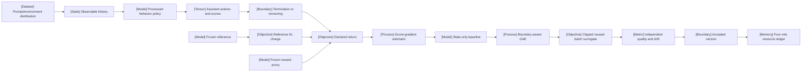

VOLUME II / PART VI — POST-TRAINING AND REINFORCEMENT LEARNING / CHAPTER 34

# 34 — Policy gradients, PPO, and RLHF

[DERIVED] A policy update is scientifically interpretable only when the rollout measure, reward/return boundary, gradient estimator, clipped surrogate and four-model resource ledger refer to the same versioned process.

6 sections · 10 eligible primary records · 1 pinned implementation · prerequisites: 02, 30–32 · artifact: transparent rollout-to-update implementation specification · updated 2026-10-09

## Why this chapter exists

[DERIVED] An RLHF trainer does not identify a unique learning problem. A change in temperature, top-p, tool semantics, reward normalization, stopping or token reduction can alter the sampled measure or the objective while leaving the trainer name unchanged. An assistant transcript also omits whether a response ended naturally, failed by task definition or was censored by collection. Those distinctions determine return targets and which terms belong in a score-function gradient.

[MATHEMATICALLY-DERIVED] This chapter reconstructs the path from a finite trajectory factorization to policy-gradient estimation, then identifies where PPO deliberately replaces the exact estimator with a clipped reused-batch surrogate. The distinctions are concrete: a state-only baseline can cancel in expectation without being accurate; a prefix ratio can correct a prefix-measurable current-policy quantity without correcting a behavior-sampled terminal reward; selected-action clipping can remove an incentive without bounding full-policy KL. Censoring can stop a sampled trace while preserving a valid continuation bootstrap.

[DERIVED] The implementation artifact binds actor, reference, critic and reward versions to each batch and counts their physical costs separately. The contemporary evidence consists entirely of original 2026 artifacts, with actual negative comparisons, missing protocol fields and proof limitations retained. The source window excludes historical PPO and InstructGPT publications; original explanatory derivations supply foundations without relabeling them as new research. Neither a compiler pass nor a plotted improvement certifies scientific completeness, alignment or a review score.

## Concept map



- Prompt/environment distribution determines observable history and the processed behavior policy.
  - Assistant actions and scores acquire a termination/censoring boundary and a declared return.
  - The score-gradient estimator uses a state-only baseline; boundary-aware GAE supplies a practical estimate.
- A frozen reference supplies the KL charge, and a frozen reward model supplies the outcome proxy.
  - The clipped reused-batch surrogate produces a candidate update.
  - Independent quality/drift determine an accepted version, whose four-role resource ledger remains explicit.

[DERIVED] The map is a dependency graph, not a guarantee that improving one metric improves its descendants. Reward validity and optimizer correctness are separate obligations. Its textual equivalent preserves every node so a visual is supplementary to the technical contract.

## Position in the book

| Relation | Canonical route |
|---|---|
| Prerequisites | [mathematics/statistics](../../../vol-01-learning-and-representation/part-01-scientific-foundations/ch02-mathematical-and-statistical-foundations/README.md), [reliability and recovery](../../part-05-hardware-kernels-and-distributed-execution/ch30-large-training-runs-reliability-monitoring-and-recovery/README.md), [SFT behavior acquisition](../ch31-supervised-fine-tuning-and-behavior-acquisition/README.md), [preferences/reward/verifiers](../ch32-preferences-reward-models-verifiers-and-oversight/README.md) |
| Siblings | [direct preference objectives](../ch33-direct-preference-optimization-and-related-objectives/README.md), [verifiable-reward optimization](../ch35-verifiable-reward-rl-and-reasoning-policy-optimization/README.md) |
| Downstream | [agent/distributed rollout](../ch36-agent-rl-and-distributed-rollout-systems/README.md), [inference-time budgets](../../part-07-inference-algorithms-distillation-and-compression/ch38-inference-time-reasoning-search-and-adaptive-compute/README.md), [policy distillation](../../part-07-inference-algorithms-distillation-and-compression/ch39-knowledge-response-and-policy-distillation/README.md) |
| Physical prerequisites | [parallelism and communication](../../../vol-01-learning-and-representation/part-03-model-architectures-and-state/ch16-mixture-of-experts-architectures/README.md), [optimizer state](../../../vol-01-learning-and-representation/part-04-training-science-and-adaptation/ch20-optimization-schedules-and-training-stability/README.md); their mechanisms are linked, not redefined |

## Sections

| Section | Owned change | Evidence |
|---|---|---|
| [34.1 Sequential decision process](34-1-sequential-decision-process.md) | A history/action/observation ledger with explicit behavior and stopping | MATHEMATICALLY-DERIVED; PAPER-REPORTED; DERIVED |
| [34.2 Policy gradients](34-2-policy-gradients.md) | Supported score estimation, baseline variance and prefix correction | MATHEMATICALLY-DERIVED; PAPER-REPORTED; DERIVED |
| [34.3 PPO](34-3-ppo.md) | GAE boundaries, policy/value clipping and bounded batch reuse | MATHEMATICALLY-DERIVED; PAPER-REPORTED; DERIVED |
| [34.4 RLHF components](34-4-rlhf-components.md) | Four model interfaces and reference-KL semantics | MATHEMATICALLY-DERIVED; PAPER-REPORTED; DERIVED |
| [34.5 Stability and exploitation](34-5-stability-and-exploitation.md) | Proxy, entropy, divergence, length and probability mismatch diagnostics | MATHEMATICALLY-DERIVED; PAPER-REPORTED; DERIVED |
| [34.6 Resource accounting](34-6-resource-accounting.md) | Role-specific memory, compute, synchronization and evaluation cost | MATHEMATICALLY-DERIVED; PAPER-REPORTED; DERIVED |

## Artifact

[DERIVED] Deliver **a transparent rollout-to-update implementation specification**. Its minimum package contains prompt/environment versions, tokenizer/processors, per-action behavior scores, action/observation/padding masks, termination and censoring semantics, reward placement and scale, critic state alignment, bootstrap/trace flags, actor/reference/critic/reward identities, detached targets, reduction denominators, clip/dual-clip settings, actual reuse and stopping decisions, independent evaluation and checkpoint selection, restore-state requirements, and a role-aware resource ledger.

[DERIVED] A sealed batch must reconstruct its loss and all boundary targets without guessing defaults. The physical inventory distinguishes aliases from independent rollout copies and reports modeled quantities separately from measurements. Rejected collection and update attempts remain in the workload denominator. Missing execution details remain unresolved fields rather than values inferred from a familiar model or framework name.

```figure
id: fig-34.37
kind: cycle
title: One auditable policy iteration
caption: Assessment can accept or stop an update. The next collection uses an acknowledged version; final held-out assessment
  is not recycled into indefinite selection.
placement: inline
evidence: MATHEMATICALLY-DERIVED
source: DERIVED:eq-34.13
alt: The cycle passes collection, role scoring, detached targets, bounded update, assessment and version seal before collecting
  again.
spec:
  stages:
  - id: collect
    label: Versioned collection
    kind: dataset
  - id: score
    label: Frozen role scoring
    kind: model
  - id: target
    label: Detached targets
    kind: objective
  - id: update
    label: Bounded PPO update
    kind: process
  - id: assess
    label: Independent assessment
    kind: metric
  - id: seal
    label: Version seal and transfer
    kind: boundary
  edges:
  - from: collect
    to: score
    kind: flow
  - from: score
    to: target
    kind: flow
  - from: target
    to: update
    kind: flow
  - from: update
    to: assess
    kind: flow
  - from: assess
    to: seal
    kind: flow
  - from: seal
    to: collect
    kind: feedback
```

## Verification

[ASSUMED] The [verification protocol](verification.md) first enumerates finite trajectories and checks probability support, baseline cancellation, prefix correction and boundary-aware GAE. A proposed neural study then isolates loss controls and resource placement at matched workload and independent quality. No GPU training, source reproduction or measured throughput was executed for this manuscript. The analytical calculators are chosen examples, not evidence of model capability.

## Lineage

[DERIVED] The dated branches below are eligible contemporary developments, not a historical origin story. “Alternative branch” does not imply replacement, and “engineering optimization” does not imply superior quality. Exact full-text versions and access records are in [references](references.md).

- 2026 · SAE v1, 12 January · *alternative branch*: trace segmentation; §34.3. [R34.2]
- 2026 · CTPO v1, 8 May · *alternative branch*: cumulative ratio weighting; §34.2. [R34.3]
- 2026 · OPEFO v1, 12 May · *alternative branch*: estimated entropy flows; §34.5. [R34.7]
- 2026 · DRPO v1, 8 June · *alternative branch*: smooth sampled-shift correction; §34.5. [R34.6]
- 2026 · CPPO v1, 9 June · *alternative branch*: position-aware gating; §34.5. [R34.5]
- 2026 · Categorical critics v1, 3 August · *alternative branch*: critic target/head; §§34.3–34.4. [R34.4]
- 2026 · verl v0.9.1, 20 September · *engineering optimization*: pinned implementation. [R34.1]
- 2026 · pass@k limitations v1, 5 October · *alternative branch*: evaluation axis; §34.6. [R34.8]

```figure
id: fig-34.38
kind: lineage
title: Inspected 2026 policy-optimization branches
caption: Release order records provenance and does not imply that one branch supersedes
  another. All eight entries first appeared in 2026.
placement: inline
evidence: PAPER-REPORTED
source:
- R34.2
- R34.3
- R34.7
- R34.6
- R34.5
- R34.4
- R34.1
- R34.8
alt: The eight dated branches and their changed mechanisms are listed immediately
  above.
spec:
  entries:
  - year: 2026
    work: SAE
    cite: R34.2
    relation: alternative branch
  - year: 2026
    work: CTPO
    cite: R34.3
    relation: alternative branch
  - year: 2026
    work: OPEFO
    cite: R34.7
    relation: alternative branch
  - year: 2026
    work: DRPO
    cite: R34.6
    relation: alternative branch
  - year: 2026
    work: CPPO
    cite: R34.5
    relation: alternative branch
  - year: 2026
    work: Categorical critics
    cite: R34.4
    relation: alternative branch
  - year: 2026
    work: verl v0.9.1
    cite: R34.1
    relation: engineering optimization
  - year: 2026
    work: pass@k limitations
    cite: R34.8
    relation: alternative branch
```

## Terms owned here

- **Behavior-policy contract** — the actual processed action distribution, its support and version; §34.1.
- **Censored continuation** — collection ends while the declared task can continue; §34.1.
- **Score-gradient estimator** — a probability-score expectation for a declared return objective; §34.2.
- **Action-independent baseline** — a detached conditional control variate with zero expected score product; §34.2.
- **Prefix-correctable multiplier** — a current-policy integrable quantity measurable through the corrected prefix; §34.2.
- **Boundary-aware GAE** — separate continuation bootstrap and sampled-trace semantics; §34.3.
- **Clipped PPO surrogate** — sign-dependent selected-action incentives on a reused batch; §34.3.
- **Four-role RLHF transaction** — versioned actor/reference/critic/reward interfaces; §34.4.
- **Accepted-update ledger** — physical expenditure including rejected attempts; §34.6.

## Reference-stack coverage

| Stack section | Exact entry | Layer | Surface / chapter use | Evidence |
|---|---|---|---|---|
| §3 #1 | arXiv | Scholarly primary discovery | Nine originating 2026 full texts; methods, experiments and appendices; all six sections | PAPER-REPORTED |
| §4 #37 | verl | RL post-training; §4.1 Post-training / RL | v0.9.1 release and tagged trainer, algorithm, scoring and rollout code | OFFICIAL-DOCUMENTATION |

[DERIVED] No top-ten lab affiliation or archival conference status is inferred for these preprints. The allowed arXiv route leads to originating evidence rather than replacing it with a search summary. The implementation is in the exact reference stack; no outside-stack system is used as independent authority. Models and datasets named by a paper are disclosed workload identifiers, not newly admitted historical evidence.

[DERIVED] Inspection dimensions applied: Post-training and Metrics throughout; Reproducibility and Reliability at all version boundaries; Precision and Kernels in probability parity; Parallelism/Communication in reductions and synchronization; Memory in §34.6; Checkpointing in rollback/version seals; Inference in actual processed collection. No hardware, energy, money or compatibility claim is inferred where disclosure is absent.

## Source route

[DERIVED] Use the reference-stack §3.1 cascade to originating full text and its revision history; use §2.1 only for independently verified archival identity; use §1.1 when a lab attribution is actually claimed. Apply §4.3 to exact trainer docs, architecture, numerical compatibility, benchmark boundary and failures. Concrete queries used or retained for reproducible follow-up are:

- `site:arxiv.org 2026 "Rethinking Importance Sampling" "Cumulative Token"`
- `site:arxiv.org 2026 "Categorical Critics"`
- `verl official documentation distributed training`
- `site:github.com "verl" (architecture OR design OR RFC OR benchmark)`
- `"verl" (throughput OR MFU OR tokens/s OR TTFT OR TPOT) "H100"`
- `site:github.com "verl" (OOM OR deadlock OR NCCL OR checkpoint OR hang)`

## Status

[DERIVED] **Manuscript draft.** Six sections contain 36 native technical figures, six adjustable analytical calculators, 24 numbered equations and six bounded procedures. This page adds a cycle and a source-linked lineage figure. Ten primary records first released in 2026 meet the requested window; the latest is 2026-10-05. Scientific review and proposed experiments remain outstanding. Validation checks structure and rendering; it does not certify factual completeness, executed performance or a numerical review score.
