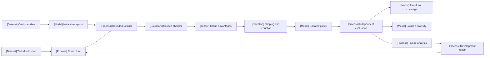

VOLUME II / PART VI — POST-TRAINING AND REINFORCEMENT LEARNING / CHAPTER 35

# 35 — Verifiable-reward RL and reasoning policy optimization

[DERIVED] A verifier-grounded training gain is scientifically interpretable only when the checker, group estimator, sampling distribution, resource boundary and independent evaluation remain explicit.

6 sections · 0 date-eligible historical spine papers · 11 primary artifacts first released in 2026 · 3 reference-stack implementations · prerequisites:11,32–34 · artifact: a verifier-grounded RL experiment with failure analysis · updated 2026-10-09

## Why this chapter exists

[DERIVED] A terminal pass/fail reward made it possible to optimize tasks with executable or formally checkable outcomes without fitting a separate learned reward model. That convenience also hid several incompatible meanings of success: a matching answer string, a passing finite test suite, a kernel-checked theorem and an evaluator prediction can all become the same scalar. The policy can improve that scalar while exploiting the measurement boundary.

[DERIVED] The next bottleneck is the estimator and collection process. Within-prompt groups avoid a critic but couple each response to its own baseline and scale. Dynamic sampling can provide more useful contrast while consuming more rejected rollouts. Token normalization, response caps and entropy diagnostics each change a different object. A bundled recipe's benchmark improvement does not identify which component caused it.

[DERIVED] The dominant constraint is therefore preservation of experimental meaning. This chapter derives canonical foundations without admitting older papers through later revisions, then examines eligible2026 methods and implementation releases. It retains source inconsistencies, finite-sample limits and disclosure gaps rather than treating prestige as a substitute for evidence. The resulting artifact separates training acceptance, independently checked correctness, strategy diversity and end-to-end cost. Native figures execute the numbered calculations and keep their assumptions visible as the argument changes.

## Concept map

[DERIVED] Equation 35.0 in §35.1 is the experiment identity governing this map. The nodes represent distinct contracts, not an empirical claim that any model implements the full pipeline.



The same structure in text:

- Task distribution and initialization determine what the policy can encounter.
  - Optional cold-start demonstrations provide external information.
  - Curriculum changes task allocation.
- Bounded rollouts preserve behavior identities and all attempt costs.
  - A scoped checker produces typed outcomes.
  - Group statistics construct detached advantages.
  - Clipping and normalization define the update surrogate.
- Independent evaluation measures pass1, coverage and diversity separately.
  - Failure analysis inspects checker gaming and execution integrity.
  - Development repairs create a new version before a fresh final audit.

## Position in the book

| Relation | Canonical neighbors |
|---|---|
| Prerequisites | [11 — Synthetic data, preferences, and interactive trajectories](../../../vol-01-learning-and-representation/part-02-data-and-representation-engineering/ch11-synthetic-data-preferences-and-interactive-trajectories/README.md); [32 — Preferences, reward models, verifiers, and oversight](../ch32-preferences-reward-models-verifiers-and-oversight/README.md); [33 — Direct preference optimization](../ch33-direct-preference-optimization-and-related-objectives/README.md); [34 — Policy gradients, PPO, and RLHF](../ch34-policy-gradients-ppo-and-rlhf/README.md) |
| Siblings (same part) | [36 — Agent RL and distributed rollout systems](../ch36-agent-rl-and-distributed-rollout-systems/README.md) owns asynchronous collection and execution reliability |
| Downstream | [38 — Inference-time reasoning, search, and adaptive compute](../../part-07-inference-algorithms-distillation-and-compression/ch38-inference-time-reasoning-search-and-adaptive-compute/README.md); [39 — Knowledge, response, and policy distillation](../../part-07-inference-algorithms-distillation-and-compression/ch39-knowledge-response-and-policy-distillation/README.md) |
| Trades off with | [32](../ch32-preferences-reward-models-verifiers-and-oversight/README.md) owns measurement validity; [34](../ch34-policy-gradients-ppo-and-rlhf/README.md) owns policy-gradient foundations; [36](../ch36-agent-rl-and-distributed-rollout-systems/README.md) owns rollout work and reliability |

## Sections

| Section | Title | What changes here | Primary evidence labels |
|---|---|---|---|
| [35.1](35-1-rlvr-formulation.md) | RLVR formulation | Reward means acceptance under a pinned procedure | DERIVED; PAPER-REPORTED |
| [35.2](35-2-group-relative-optimization.md) | Group-relative optimization | Baseline and random scale have separate statistical effects | MATHEMATICALLY-DERIVED; OFFICIAL-DOCUMENTATION |
| [35.3](35-3-reasoning-policy-development.md) | Reasoning-policy development | Initialization, curriculum and length are separate interventions | DERIVED; PAPER-REPORTED |
| [35.4](35-4-algorithmic-refinements.md) | Algorithmic refinements | Each variant declares its objective, collection and reduction | MATHEMATICALLY-DERIVED; PAPER-REPORTED |
| [35.5](35-5-what-improved.md) | What improved | Coverage, diversity and capability claims require distinct evidence | MATHEMATICALLY-DERIVED; PAPER-REPORTED |
| [35.6](35-6-scientific-boundaries.md) | Scientific boundaries | Integrity, leakage and causal interpretation remain separate | DERIVED; PAPER-REPORTED; OFFICIAL-DOCUMENTATION |

## Artifact

[DERIVED] The **verifier-grounded RL experiment with failure analysis** is a proposed immutable bundle: experiment identity; split/lineage manifest; initial and selected policy identities; optional supervised-data provenance; decoding/behavior contract; checker/parser/container identities; bounded attempt ledger; group statistics; loss and optimizer configuration; sampler-state checkpoints; independent evaluation records; failure taxonomy; and end-to-end cost report. Each attempted generation retains consumed tokens, checker work, termination status and parent group ID, including rejected and errored attempts.

[DERIVED] The bundle makes an algorithm label reviewable. GRPO, DrGRPO-style and DAPO-style configurations carry explicit scale, epsilon and denominator fields. AsymGRPO carries its positive/negative exponents. ARCUS carries belief, proposal and selection state. OPEFO carries its diagnostic formula and detach semantics, together with the source derivation counterexample. No named configuration is represented as independently reproduced merely because its equations compile.

## Verification

[DERIVED] The falsifiable task compares pass1 and pass@k under fixed candidate and token budgets, checks hidden tests independently of training reward, measures correct-only diversity with count/length controls, and inspects zero-variance groups and discarded work. Analytical checks test finite-group factors, reduction axes, entropy differentials and candidate-budget conservation. The proposed GPU study remains unexecuted. The full [verification protocol](verification.md) separates editorial coverage from proposed experiments and from finite mathematical checks.

## Lineage

[DERIVED] The date restriction selects recent evidence; it does not move the invention date of policy gradients, GRPO, DAPO or DrGRPO into2026. Older origin papers are excluded explicitly in references. The following entries are dated inspected branches, not a ranking.

- 2026 · GLM-5 [R35.2] · current frontier.
- 2026 · Tsallis-continuum cold-start study [R35.3] · alternative branch.
- 2026 · AsymGRPO v1 [R35.5] · alternative branch.
- 2026 · OPEFO [R35.6] · alternative branch.
- 2026 · VPR [R35.8] · alternative branch.
- 2026 · ARCUS [R35.4] · engineering optimization.
- 2026 · TRL v1.13.0 [R35.1] · engineering optimization.
- 2026 · Pass@k/diversity study [R35.7] · current frontier.


```figure
{
  "id": "fig-35.37",
  "kind": "lineage",
  "title": "Eligible2026 branches",
  "caption": "The entries identify inspected original2026 releases and distinct mechanisms; they do not rank methods.",
  "placement": "inline",
  "evidence": "PAPER-REPORTED",
  "source": [
    "R35.2",
    "R35.3",
    "R35.4",
    "R35.5",
    "R35.6",
    "R35.7",
    "R35.8"
  ],
  "alt": "GLM5, cold-start likelihood methods, AsymGRPO, OPEFO, VPR, ARCUS and the pass@k study are distinct2026 branches.",
  "spec": {
    "entries": [
      {
        "year": "2026",
        "work": "GLM5",
        "cite": "R35.2",
        "relation": "current frontier"
      },
      {
        "year": "2026",
        "work": "Cold-start continuum",
        "cite": "R35.3",
        "relation": "alternative branch"
      },
      {
        "year": "2026",
        "work": "AsymGRPO v1",
        "cite": "R35.5",
        "relation": "alternative branch"
      },
      {
        "year": "2026",
        "work": "OPEFO",
        "cite": "R35.6",
        "relation": "alternative branch"
      },
      {
        "year": "2026",
        "work": "VPR",
        "cite": "R35.8",
        "relation": "alternative branch"
      },
      {
        "year": "2026",
        "work": "ARCUS",
        "cite": "R35.4",
        "relation": "engineering optimization"
      },
      {
        "year": "2026",
        "work": "Pass@k boundary",
        "cite": "R35.7",
        "relation": "current frontier"
      }
    ]
  }
}
```

## Terms owned here

[DERIVED] These local terms have canonical teaching locations here; prerequisites retain ownership of general policy gradients, PPO, KL, reward modeling and verifier soundness.

| Term | Definition and owner |
|---|---|
| Verifiable-reward RL | Optimization against a declared checking procedure on a specified domain; §35.1 |
| Within-prompt group advantage | A response weight constructed from rewards sampled for the same prompt; §35.2 |
| Own-sample group centering | Subtracting a group mean that includes the response's own reward; §35.2 |
| Zero-variance group | A collected reward group with no observed reward variation; §35.2–35.4 |
| Dynamic mixed-group sampling | Bounded collection/refill conditioned on a mixed reward group; §35.4 |
| Pass@k coverage | Probability or estimate of at least one correct response among a declared candidate budget; §35.5 |

## Reference-stack coverage

| Stack section | Entry | Stack layer | What this chapter takes | Surface used | Sections | Evidence label |
|---|---|---|---|---|---|---|
| §1 lab | #1 Anthropic | — | Reward Seeker model-organism protocol and limits | Research https://www.anthropic.com/research | 35.6 | PAPER-REPORTED |
| §1 lab | #2 OpenAI | — | CoT-Control first-party evaluation and proxy boundary | Research https://openai.com/research/ | 35.6 | OFFICIAL-DOCUMENTATION |
| §1 lab | #6 Z.ai / Zhipu AI / GLM | — | GLM-5 SFT/reasoning-RL disclosure | Papers https://z.ai/blog | 35.1,35.3 | PAPER-REPORTED |
| §3 discovery source | #1 arXiv | — | Primary v1 methods, experiments, appendices and original histories for R35.2–R35.9 | Home https://arxiv.org/ | All | PAPER-REPORTED |
| §4 system | #29 Hugging Face TRL | Post-training / RL | Pinned group statistics, masks, clipping and reduction code | docs-code https://huggingface.co/docs/trl/ | 35.1,35.2,35.4 | OFFICIAL-DOCUMENTATION |
| §4 system | #37 verl | RL post-training | Framework named in inspected source protocols; no uninspected runtime claim | docs-code https://verl.readthedocs.io/en/latest/ | 35.3–35.4 | PAPER-REPORTED |
| §4 system | #41 vLLM | LLM inference engine | ARCUS generation layer; source-reported BF16 workload | docs-code https://docs.vllm.ai/ | 35.3–35.5 | PAPER-REPORTED |

**Inspection dimensions applied.** [DERIVED] Post-training is analyzed throughout; Metrics and Reproducibility in every source-protocol table; Memory and Precision in §35.1–35.4; Communication through global reductions in §35.2/35.4; Inference through decoding and candidate budgets in §35.3/35.5; Reliability through bounded attempts and isolation in §35.1/35.6. No undisclosed kernel, parallelism or hardware behavior is inferred from a framework name. Academic arXiv sources are used through the permitted discovery route without invented top-lab affiliation or peer-review status.

## Source route

[DERIVED] Apply the reference stack's official-index→primary-paper→supplement/code→history sequence. Conference routes are discovery leads, not substitutes for original publication dates; this chapter admits preprints as preprints. Concrete queries used to locate the current evidence include:

- Lab protocol: site:arxiv.org/abs ("Zhipu" OR "Z.ai" OR "GLM") "reasoning reinforcement learning".
- Lab protocol: site:anthropic.com/research "reward hacking"; follow the originating Alignment Science report.
- Conference workflow: site:openreview.net/forum ICLR "verifiable rewards" 2026; check first-publication history before admission.
- Paper cascade: site:arxiv.org/abs "entropy collapse" "2026" "RLVR".
- Paper cascade: site:arxiv.org/abs "pass@k" "diversity" "2026".
- Training-stack protocol: site:github.com/huggingface/trl "v1.13.0" "dr_grpo"; inspect the release, peeled commit and exact trainer/config files.

## Status

[DERIVED] Editorial status is manuscript_draft. All11 admitted canonical artifacts are first released within 2026, with the Reward Seeker report dated to August rather than an invented day. All methods and discussion are built around this eligible evidence and explicitly derived foundations. Original dates, inspected versions and access date are retained in references. The source set meets the date proportion; this is not scientific certification or a promised review score.

[NOT-DISCLOSED] Public gaps include several source optimizer/resource/seeding details, some missing exact implementation commits and frontier training recipes. OPEFO's derivation/table inconsistencies, FormalRewardBench's validation wording and current-source selection confounds remain visible. [UNVERIFIED] Independent training reproduction, general deployment transfer and causal reasoning faithfulness have not been established by this manuscript or its native figures.
