VOLUME II / PART VI — POST-TRAINING AND REINFORCEMENT LEARNING / CHAPTER 36

# 36 — Agent RL and distributed rollout systems

[DERIVED] Agent RL is interpretable only when its action probabilities, environment effects, reward identities, distributed versions and unsuccessful resource work remain joined to the same immutable experience and update records.

6 sections · 0 admitted historical spine papers · 7 eligible 2026 evidence families · prerequisites:11,29,30,34,35 · artifact: a versioned environment/rollout/update architecture · updated2026-10-09

## Why this chapter exists

[DERIVED] A token sequence is no longer the complete training example once an agent can mutate a workspace, wait for a service and resume generation under another checkpoint. The previous interface fails at several boundaries: returned observations are confused with generated actions, timeouts are confused with absent effects, terminal task failure is confused with infrastructure censoring, and model-version labels are confused with actual behavior probabilities. An optimizer can remain numerically stable while each of these errors changes what its data mean.

[DERIVED] The new bottleneck is consistency across world state, distributed execution and the training measure. Faster inference does not solve slow environment creation or private judging. Parallel branches can shorten a critical path while spending more total work. A queue can improve GPU occupancy while retaining mostly stale data. A checkpoint can restore parameters while duplicating consumed prompts or external effects. Consequently, throughput and restart success are insufficient scientific acceptance criteria.

[DERIVED] This chapter introduces a versioned architecture whose records expose those boundaries. It derives trajectory and selection laws, reconstructs current credit mechanisms from inspected source revisions, separates logical roles from physical placement, and includes failed attempts in resource accounting. The resulting artifact supports falsifiable implementation review. It does not certify a provider's undocumented internals, promise exact correction for an uncontrolled web environment, or treat a favorable component benchmark as a universal end-to-end gain.

## Concept map

```mermaid
flowchart LR
  H["[State] Observed interaction history"] --> A["[Dataset] Generated action provenance"]
  W["[State] Hidden and external world state"] --> H
  A --> E["[State] Typed effects and completion"]
  E --> R["[Metric] Reward and delayed verdict identity"]
  R --> C["[Process] Turn and token credit"]
  C --> V["[Model] Shared causal value readouts"]
  C --> G["[Objective] Gauge-sensitive token weights"]
  E --> S["[Boundary] Reset and isolation contract"]
  S --> Q["[Memory] Resource lease and quotas"]
  Q --> P["[Process] Actor environment reward pools"]
  P --> T["[Process] Versioned weight publication"]
  T --> B["[Tensor] True processed behavior probabilities"]
  B --> I["[Objective] Importance and selection measure"]
  I --> L["[Boundary] Bounded lag and backpressure"]
  L --> K["[Memory] Consistent checkpoint and effect ledger"]
  K --> U["[Metric] Cost per accepted update"]
  U --> F["[Metric] Independent quality evaluation"]
```

- Observed interaction history
  - Hidden and external world state
  - Generated action provenance
    - Typed effects and completion
      - Reward and delayed verdict identity
        - Turn and token credit
          - Shared causal value readouts
          - Gauge-sensitive token weights
- Reset and isolation contract
  - Resource lease and quotas
    - Actor environment reward pools
      - Versioned weight publication
- True processed behavior probabilities
  - Importance and selection measure
    - Bounded lag and backpressure
      - Consistent checkpoint and effect ledger
        - Cost per accepted update
          - Independent quality evaluation

[DERIVED] Edges identify a dependency or information boundary; none encodes empirical superiority. The text list repeats every node. In particular, the hidden world and observed history remain separate, and optimizer progress reaches quality evaluation through an independent protocol rather than an assumed equivalence.

## Position in the book

| Relation | Linked ownership |
|---|---|
| Prerequisites | [Chapter 11](../../../vol-01-learning-and-representation/part-02-data-and-representation-engineering/ch11-synthetic-data-preferences-and-interactive-trajectories/README.md), [Chapter 29](../../part-05-hardware-kernels-and-distributed-execution/ch29-parallelism-collectives-and-distributed-optimization/README.md), [Chapter 30](../../part-05-hardware-kernels-and-distributed-execution/ch30-large-training-runs-reliability-monitoring-and-recovery/README.md), [Chapter 34](../ch34-policy-gradients-ppo-and-rlhf/README.md), [Chapter 35](../ch35-verifiable-reward-rl-and-reasoning-policy-optimization/README.md) — model execution, distributed optimization, fault/state contracts and policy-gradient/verifier estimators |
| Siblings (same part) | [Chapter 32](../ch32-preferences-reward-models-verifiers-and-oversight/README.md), [Chapter 34](../ch34-policy-gradients-ppo-and-rlhf/README.md), [Chapter 35](../ch35-verifiable-reward-rl-and-reasoning-policy-optimization/README.md) — credit estimators and feedback ownership used here without duplicating their complete lessons |
| Downstream | [Chapter 38](../../part-07-inference-algorithms-distillation-and-compression/ch38-inference-time-reasoning-search-and-adaptive-compute/README.md), [Chapter 39](../../part-07-inference-algorithms-distillation-and-compression/ch39-knowledge-response-and-policy-distillation/README.md) — serving-time orchestration and multi-turn distillation depend on exact generation/state contracts |
| Trades off with | [Chapter 29](../../part-05-hardware-kernels-and-distributed-execution/ch29-parallelism-collectives-and-distributed-optimization/README.md), [Chapter 30](../../part-05-hardware-kernels-and-distributed-execution/ch30-large-training-runs-reliability-monitoring-and-recovery/README.md), [Chapter 37](../../part-07-inference-algorithms-distillation-and-compression/ch37-decoding-constrained-generation-and-speculative-execution/README.md) — synchronous update simplicity versus overlap, retained state versus recomputation |

[DERIVED] This chapter owns the integration boundary between policy events and external execution. Policy-gradient derivations remain in Chapter34 and group-estimator details in Chapter35. Recovery invariants from Chapter30 are specialized here to effectful agent episodes and asynchronous versioned experience. Decoding processors are treated as a required probability interface; their complete implementation belongs to Chapter37.

## Sections

| Section | Title | What changes here | Primary evidence labels |
|---|---|---|---|
| [36.1](36-1-agent-trajectories.md) | Agent trajectories | History/action/effect boundaries become explicit | MATHEMATICALLY-DERIVED; PAPER-REPORTED; OFFICIAL-DOCUMENTATION |
| [36.2](36-2-credit-assignment.md) | Credit assignment | Reward, value and token credit remain distinct | MATHEMATICALLY-DERIVED; PAPER-REPORTED; OFFICIAL-DOCUMENTATION |
| [36.3](36-3-environment-infrastructure.md) | Environment infrastructure | Reset, isolation and quota acquire testable contracts | MATHEMATICALLY-DERIVED; PAPER-REPORTED; OFFICIAL-DOCUMENTATION |
| [36.4](36-4-distributed-roles.md) | Distributed roles | Logical roles receive capacity/version ownership | MATHEMATICALLY-DERIVED; PAPER-REPORTED; OFFICIAL-DOCUMENTATION |
| [36.5](36-5-asynchrony-and-mismatch.md) | Asynchrony and mismatch | The target measure includes behavior and retention | MATHEMATICALLY-DERIVED; PAPER-REPORTED; OFFICIAL-DOCUMENTATION |
| [36.6](36-6-efficiency-and-reproducibility.md) | Efficiency and reproducibility | All attempted work enters accepted-update cost | MATHEMATICALLY-DERIVED; PAPER-REPORTED; OFFICIAL-DOCUMENTATION |

## Artifact

[DERIVED] Deliver a **versioned environment/rollout/update architecture** with seven joined manifests: task/environment/reset/schema digests; immutable episode/attempt event ledger; exact context/token/mask/behavior records; reward/checker/verdict identity; logical-role placement and resource leases; full/delta publication and receiver-version ledger; and checkpoint/consumption/cost ledger. A fixed independent evaluation manifest accompanies the architecture without becoming an input to adaptive training selection.

[DERIVED] Required fields include occurrence identity, content digests, completion/effect classification, per-position versions and processed log probabilities, resource reservations before calls, finite deadlines/caps, parent/node quota ownership, result artifacts, accepted/rejected reasons, update commits and external reconciliation status. Human-readable transcripts and diagrams are projections of this artifact, not substitutes for its state. Implementations may choose different storage formats while preserving the contracts.

## Verification

[DERIVED] The falsifiable task is to inject delayed workers and environment faults, then check state/selection/resource consequences against a synchronous baseline. Compare exact finite-state probability identities, prefix versus terminal correction, token provenance, reset/isolation, fenced weight publication, duplicate-effect prevention and full checkpoint recovery. Measure all attempted work per accepted update and use an untouched quality protocol. These are unexecuted proposals in [verification.md](verification.md), distinct from source-reported experiments.

## Lineage

- 2026 · GLM-5 v1 · **current frontier**: disclosed synchronous/asynchronous correction and environment pipelines, with source-expression limitations retained.
- 2026 · Kimi K2.5 v2 · **alternative branch**: frozen-subagent orchestrator RL and critical-path-oriented parallel execution.
- 2026 · ActFocus v1 · **alternative branch**: token-span weighting whose empirical utility is separate from an invariant confidence interpretation.
- 2026 · SAPO v3 · **engineering optimization**: shared causal value readouts and matched PPO comparisons; earlier readout/results superseded within the same study.
- 2026 · DSec v1 · **engineering optimization**: composable environments, resource management and retained-state rollout infrastructure.
- 2026 · verl v0.9.1 / AReaL v2.1.0 · **engineering optimization**: release-pinned asynchronous modes and versioned weight-control surfaces.

[DERIVED] Historical foundations are reconstructed under explicit premises without independent old-paper citations or a claim of 2026 novelty. Release and manuscript revision are different clocks. The source ledger records original dates rather than admitting older work solely through a recent revision.

## Terms owned here

- **Episode occurrence** (§36.1): immutable execution instance distinct from a reusable task identifier.
- **Effect ambiguity** (§36.1): caller cannot establish whether an external command committed.
- **Environment reset projection** (§36.3): declared fields whose reset equality or stochastic parity is tested.
- **Rollout role graph** (§36.4): logical generation, execution, judging and training owners independent of device colocation.
- **Within-episode behavior identity** (§36.5): per-generated-event model/processor/context/probability provenance.
- **Trajectory selection law** (§36.5): retention probability/process layered on the generated path measure.
- **Accepted-update resource cost** (§36.6): all physical attempted work divided by committed admissible updates, with zero-denominator behavior explicit.

## Reference-stack coverage

| Stack section | Entry | Stack layer | What this chapter takes from it | Surface used | Sections | Evidence label |
|---|---|---|---|---|---|---|
| §1 lab | #6 Z.ai / Zhipu AI / GLM | — | GLM-5 report, DSDM, TITO and environment disclosure | https://github.com/zai-org ; https://z.ai/blog |36.1,36.5 | PAPER-REPORTED |
| §1 lab | #7 Moonshot AI / Kimi | — | PARL, managed environment roles and reported swarm evaluation | https://github.com/MoonshotAI |36.1,36.2,36.6 | PAPER-REPORTED |
| §1 lab | #8 DeepSeek | — | DSec environment, isolation and recovery mechanisms | https://github.com/deepseek-ai |36.3,36.6 | PAPER-REPORTED |
| §3 discovery source | #1 arXiv | — | Primary full texts and submission histories for all five paper families; SAPO/ActFocus scholarly route, no false lab affiliation | https://arxiv.org/ |36.1–36.6 | OFFICIAL-DOCUMENTATION |
| §4 system | #37 verl | RL post-training; §4.1 **POST-TRAINING / RL** | Release-pinned modes, replay and weight transfer | https://verl.readthedocs.io/en/latest/ |36.1–36.6 | OFFICIAL-DOCUMENTATION |
| Outside the reference stack (routed via book_plan.md anchors) | AReaL | Plan-anchored agent RL | v2.1.0 async configuration and weight gateway | https://github.com/areal-project/AReaL |36.1,36.2,36.4–36.6 | OFFICIAL-DOCUMENTATION |

**Inspection dimensions applied.** [DERIVED] Parallelism/Memory/Communication: roles, sharding, old-policy swaps and transfer (§36.4). Precision/Kernels/Inference: processed probability parity and KV reconstruction (§§36.5–36.6). Post-training: targets and surrogates (§36.2). Checkpointing/Reliability: effect state, queue ownership and recovery (§§36.3,36.6). Metrics/Reproducibility: source protocol boundaries, resource vector and evidence gaps throughout. No irrelevant conference quota is inserted; admitted papers are identified as preprints/technical reports.

## Source route

[DERIVED] Follow the reference-stack lab protocol, paper cascade and versioned systems inspection rather than treating search snippets as evidence. Queries actually used for primary discovery included:

- `site:arxiv.org/abs ("Zhipu" OR "Z.ai" OR "GLM") "GLM-5"`
- `site:arxiv.org/abs ("Moonshot AI" OR "Kimi") "K2.5"`
- `site:arxiv.org/abs "DeepSeek" "Elastic Compute"`
- `site:arxiv.org "SAPO" "Single-Rollout"`
- `site:arxiv.org "Resolving Action Bottleneck"`
- `site:github.com/verl-project/verl "v0.9.1" "async"`

[DERIVED] Discovery was followed by full method/equation/experiment/appendix inspection and independent tag/commit/date resolution. The exact claims and locators are in [references.md](references.md). Lab affiliation and conference status are not inferred from citation proximity. Source code was read without executing the training systems.

## Status

[DERIVED] Editorial status: **manuscript_draft**. Six complete section drafts contain 36 native technical figures, including six adjustable analytical calculators, numbered mathematical transitions and explicit source/proposal separation. Seven canonical evidence families originated in2026. Static/in-memory checks validate structure and finite instrument states; they do not constitute scientific peer review or an external score.

[NOT-DISCLOSED] Open gaps include complete frontier-agent training artifacts/seeds, DSDM detach semantics, private task mixtures, exact SAPO/ActFocus code commits, full DSec production implementation, independent infrastructure/recovery uncertainty and power/tariff evidence. The inaccessible V4.1 report supplies no detailed training claims. Each gap has a consequence and follow-up in the verification ledger rather than an invented default.
