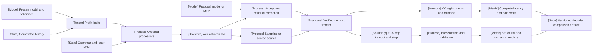

VOLUME II / PART VII — INFERENCE ALGORITHMS, DISTILLATION, AND COMPRESSION / CHAPTER37

# 37 — Decoding, constrained generation, and speculative execution

[DERIVED] A decoder is a versioned probability, termination, search and execution contract, so neither syntactic validity nor faster candidate production alone establishes correct delivered behavior.

6 sections · 0 eligible historical spine papers · 6 contemporary primary papers · 1 pinned implementation · prerequisites:04–05,14,31 · artifact: a decoding-policy comparison with distributional checks · updated 2026-10-09

## Why this chapter exists

[DERIVED] Treating the checkpoint as the generator leaves essential decisions unspecified. Penalties, temperature, support filters and grammar restrictions change the actual next-event law. Stopping and presentation then map token trajectories into delivered outputs, while caps and timeouts censor some trajectories. A structurally valid object can still contain incorrect values or omit a required effect. A beam score can improve without improving task utility. These failures appear even with a fixed model and are not repaired by a more attractive visual or a larger candidate count.

[DERIVED] The execution bottleneck adds another layer: each sequential target step costs time, yet drafting, verification, parser work and memory traffic also consume resources. Cheap proposals are useful only when their correction and state transitions preserve the intended generator and their total paid work improves the deployment objective. The dominant constraint is therefore a joint contract over probability, prefix state, final validity and physical cost. It cannot be reduced to accepted length or a single throughput number.

[DERIVED] Contemporary methods move different boundaries. Draft conditioning changes the target context; parser-stack classification moves online work into compilation; multi-token prediction changes proposal architecture; residual shaping changes verification mathematics. The chapter reconstructs these mechanisms separately and retains negative results, missing protocol fields and a finite counterexample to an inspected sufficient-condition claim. All admitted primary records originate in 2026. Foundational probability identities are derived here without relabeling historical ideas as new research, and source-reported experiments remain distinct from unexecuted book verification proposals.

## Concept map



- Frozen model and tokenizer produce prefix logits using committed history.
  - Ordered processors combine those logits with grammar and lexer state to define the actual token law.
  - Sampling or scored search consumes that law.
- A proposal model or MTP supplies candidates to acceptance and residual correction, which also consumes the actual target law.
  - Verified events cross the commit frontier.
  - EOS, caps, timeouts and text stops determine the ending boundary.
- Presentation and validation produce separate structural and semantic verdicts.
  - KV/logits/masks/rollback state contributes to complete latency and paid work.
  - Those costs and verdicts enter a versioned decoder-comparison artifact.

[DERIVED] This is a dependency map, not a causal claim that any individual optimization improves all downstream metrics. All16 nodes have an accessible textual counterpart. Structural recognizer state and the target probability law interact but remain separately versioned objects.

## Position in the book

| Relation | Canonical route |
|---|---|
| Prerequisites | [tokenization](../../../vol-01-learning-and-representation/part-01-scientific-foundations/ch04-language-modeling-and-learning-objectives/README.md), [numerics and correctness](../../../vol-01-learning-and-representation/part-01-scientific-foundations/ch05-minimal-transformer-and-execution-trace/README.md), [transformer computation](../../../vol-01-learning-and-representation/part-03-model-architectures-and-state/ch14-attention-architectures-and-cache-representations/README.md), [behavior acquisition](../../part-06-post-training-and-reinforcement-learning/ch31-supervised-fine-tuning-and-behavior-acquisition/README.md) |
| Siblings (same part) | [inference-time reasoning and search](../ch38-inference-time-reasoning-search-and-adaptive-compute/README.md), [distillation](../ch39-knowledge-response-and-policy-distillation/README.md), [quantization](../ch40-quantization-from-numerical-model-to-deployable-artifact/README.md) |
| Downstream | [serving runtimes](../ch42-prefill-decode-kv-state-and-inference-resource-models/README.md), [capacity and economics](../../part-08-inference-engines-and-production-serving/ch48-capacity-planning-benchmarking-and-lifecycle-economics/README.md), [tool interfaces](../../../vol-03-grounded-and-interactive-intelligence/part-09-retrieval-context-and-agent-systems/ch51-tool-use-protocol-interfaces-and-reliable-execution/README.md) |
| Trades off with | [additional reasoning/search compute](../ch38-inference-time-reasoning-search-and-adaptive-compute/README.md), [lower-precision execution](../ch40-quantization-from-numerical-model-to-deployable-artifact/README.md), [batching and service latency](../ch42-prefill-decode-kv-state-and-inference-resource-models/README.md) |

## Sections

| Section | Title and owned change | Primary evidence labels |
|---|---|---|
| [37.1](37-1-sampling-distributions.md) | Sampling distributions: ordered processing defines the actual normalized law | MATHEMATICALLY-DERIVED; OFFICIAL-DOCUMENTATION; PAPER-REPORTED |
| [37.2](37-2-sequence-termination.md) | Sequence termination: committed actions, delivered text and censoring are separated | MATHEMATICALLY-DERIVED; OFFICIAL-DOCUMENTATION; PAPER-REPORTED |
| [37.3](37-3-search-versus-sampling.md) | Search versus sampling: sequence ranking and task utility acquire different contracts | MATHEMATICALLY-DERIVED; OFFICIAL-DOCUMENTATION; PAPER-REPORTED |
| [37.4](37-4-structured-generation.md) | Structured generation: local language projection is separated from global conditioning and truth | MATHEMATICALLY-DERIVED; PAPER-REPORTED; OFFICIAL-DOCUMENTATION |
| [37.5](37-5-speculative-decoding.md) | Speculative decoding: proposals require exact conditional correction and state rollback | MATHEMATICALLY-DERIVED; PAPER-REPORTED; OFFICIAL-DOCUMENTATION |
| [37.6](37-6-runtime-coupling.md) | Runtime coupling: progress, physical work, compilation and deadlines determine value | MATHEMATICALLY-DERIVED; PAPER-REPORTED; OFFICIAL-DOCUMENTATION |

## Artifact

[DERIVED] Deliver **a decoding-policy comparison with distributional checks**. `decoder-contract.yaml` binds model/tokenizer hashes, chat template, processor ordering, penalties/history scopes, temperature, cutoff/tie rules, seed/RNG domains, grammar and schema dialect, EOS and stop rules, presentation policy, caps/deadlines, search score and speculative proof assumptions. `law-trace.parquet` stores prefix/event identities, raw and processed scores, support, proposal probabilities, acceptance/residual normalization, branch ancestry and committed status. `output-ledger.jsonl` keeps raw tokens, delivered text, finish reason and independent structural/task verdicts.

[DERIVED] `resource-ledger.parquet` separates draft/target resident weights, KV, logits, grammar storage, transfer/staging, computed/discarded events, wall-time boundaries, queueing and quarantine allocations. `comparison.csv` reports the actual target-law fidelity, ending validity, task utility and quality/latency frontier per immutable configuration. Missing fields remain explicit, and a service result cannot inherit an exactness label from a different configuration. The artifact specification is a proposal; no generated file package or model benchmark is claimed by writing this manuscript.

```figure
id: fig-37.37
kind: cycle
title: A speculative cycle returns to a committed prefix
caption: Only verified events advance the next prefix. Rejection discards tentative descendants; stop-aware delivery remains
  downstream of commit. This loop is a mathematical state contract, not an executed serving trace.
placement: inline
evidence: MATHEMATICALLY-DERIVED
source: DERIVED:eq-37.14
alt: The cycle moves from committed prefix to proposal, target verification, acceptance or correction, rollback/seal and the
  next committed prefix.
spec:
  stages:
  - id: h
    label: Committed prefix
    kind: state
  - id: d
    label: Bounded proposal
    kind: model
  - id: v
    label: Target verification
    kind: tensor
  - id: a
    label: Accept or residual
    kind: process
  - id: c
    label: Rollback and seal
    kind: boundary
  edges:
  - from: h
    to: d
  - from: d
    to: v
  - from: v
    to: a
  - from: a
    to: c
  - from: c
    to: h
    kind: feedback
    label: next committed prefix
```

## Verification

[ASSUMED] The [verification protocol](verification.md) enumerates finite token laws and trajectories, checks processor noncommutativity, termination/presentation, beam-score bounds, local/global conditioning and exact/residual/proxy conditions, then proposes a matched-quality runtime comparison. A failed law identity rejects the relevant exactness contract regardless of speed. The finite formulas and native instruments are explanatory mathematical objects; proposed model runs, latency measurements and source replications have not been executed.

## Lineage

[DERIVED] The dated entries record eligible contemporary branches and optimizations, not the historical invention of decoding. A relation describes what changed in the inspected work; it does not certify superiority or scientific review. Version/date records are in [references](references.md).

- 2026 · DCCD v1, February8 · *alternative branch*: draft-conditioned projection changes the target context. [R37.2]
- 2026 · GLM-5 v1, February17 · *engineering optimization*: shared MTP proposal parameters, private accepted-length protocol. [R37.7]
- 2026 · Parser Stack Classification v1, August4 · *engineering optimization*: move token admissibility simulation into a compiled classifier. [R37.3]
- 2026 · ResiSpec v1, August25 · *alternative branch*: residual shaping with the inspected exactness-condition caveat. [R37.6]
- 2026 · Beam/self-consistency SQL study v1, August26 · *alternative branch*: task-specific decoding comparison and incomplete-grammar negative results. [R37.5]
- 2026 · Structural/semantic-gap study v1, September20 · *alternative branch*: separate syntax and content evaluation. [R37.4]
- 2026 · vLLM v0.31.0, October5 · *engineering optimization*: pinned sampling/verification/state implementation. [R37.1]

```figure
id: fig-37.38
kind: lineage
title: Inspected2026 decoding branches
caption: All seven records originate in2026. Provenance order does not imply replacement or universal gains; ResiSpec exactness
  remains qualified by the finite counterexample.
placement: inline
evidence: PAPER-REPORTED
source:
- R37.2
- R37.7
- R37.3
- R37.6
- R37.5
- R37.4
- R37.1
alt: DCCD and GLM MTP appear in February, parser-stack classification and ResiSpec/beam studies in August, semantic-gap evaluation
  in September, and the pinned vLLM release in October.
spec:
  entries:
  - year: 2026
    work: DCCD v1
    cite: R37.2
    relation: alternative branch
  - year: 2026
    work: GLM-5 MTP
    cite: R37.7
    relation: engineering optimization
  - year: 2026
    work: Parser Stack Classification
    cite: R37.3
    relation: engineering optimization
  - year: 2026
    work: 'ResiSpec v1: caveat retained'
    cite: R37.6
    relation: alternative branch
  - year: 2026
    work: Beam versus sampling SQL
    cite: R37.5
    relation: alternative branch
  - year: 2026
    work: Structural and semantic gap
    cite: R37.4
    relation: alternative branch
  - year: 2026
    work: vLLM v0.31.0
    cite: R37.1
    relation: engineering optimization
```

## Terms owned here

| Term | Canonical definition / owner |
|---|---|
| Processed sampling law | Normalized event law after a declared ordered processor pipeline; §37.1 |
| Greedy decoding | Deterministic maximum-score event selection with explicit tie convention; §37.1 |
| Nucleus support | Smallest ordered prefix reaching declared probability mass under the selected law; §37.1 |
| Committed token frontier | Longest prefix whose events are accepted as actual generation; §37.2 |
| Presentation pushforward | Distribution of delivered text induced by a token-trajectory-to-text map; §37.2 |
| Beam sequence score | Declared accumulated path score and normalization used to rank retained paths; §37.3 |
| Local grammar projection | Renormalization over immediately admitted next events; §37.4 |
| Global validity conditioning | Conditioning the full sequence law on eventual membership in a language; §37.4 |
| Residual correction law | Positive target-minus-proposal mass normalized after rejection; §37.5 |
| Speculative exactness | Equality to a declared target law under same-event conditional verification assumptions; §37.5 |
| Parser-stack classifier | Compiled function from lexer/parser stack state to a token-validity mask; §37.6 |

## Reference-stack coverage

| Stack section | Entry | Stack layer | What this chapter takes | Surface used | Sections | Evidence label |
|---|---|---|---|---|---|---|
| §1 lab | #6 **Z.ai / Zhipu AI / GLM** | Not applicable | Originating GLM-5 report's shared MTP and bounded Table 2 claim, via scholarly primary record | Papers/Blog: https://z.ai/blog ; paper retrieved through §3 arXiv |37.5 | PAPER-REPORTED |
| §3 discovery source | #1 **arXiv** | Not applicable | Retrieval/history route for all six originating primary papers; discovery is not proof | https://arxiv.org/ ; https://arxiv.org/search/advanced |37.1–37.6 | DERIVED route; PAPER-REPORTED originating text |
| §3 discovery source | #2 **OpenReview** | Not applicable | Earliest-publication inspection attempt for excluded SSD candidate | https://openreview.net/ | references exclusion only | UNVERIFIED chronology |
| §2 conference | #3 **ICLR** | Not applicable | Archival identity route for excluded SSD candidate; not admitted as evidence | https://openreview.net/group?id=ICLR.cc/2026/Conference | references exclusion only | UNVERIFIED original public date |
| §4 system | #41 **vLLM** | **LLM inference engine**; §4.1 **INFERENCE ENGINE** | v0.31.0 official release and full-SHA sampling, stopping, beam, grammar, mapping and rejection code | docs-code: https://docs.vllm.ai/ ; official repository resolved from project |37.1–37.6 | OFFICIAL-DOCUMENTATION |

**Inspection dimensions applied.** [DERIVED] Parallelism and Communication: tree ancestry, batching, device placement and transfer (§§37.5–37.6). Precision and Kernels: processed logits, residual stability, fused/native distinctions and chunking (§§37.1,37.5–37.6). Memory: logits, target/draft KV and grammar artifacts (§§37.3–37.6). Inference, Metrics, Reliability and Reproducibility: finish reasons, law fidelity, syntax/content, bounded operations, rollback and exact pins throughout. Checkpointing is limited to immutable identities and committed cache boundaries; no training checkpoint mechanism is retaught. Post-training is a prerequisite, not a new optimization claim. XGrammar/Outlines and other named backends are disclosed study components, not invented independent top-ten entries. No outside-stack source is admitted through a nonexistent exception; scholarly primary preprints use the explicitly permitted arXiv route.

## Source route

[DERIVED] Apply the stack's exact protocols: §1.1 uses the lab's research/papers surfaces and checks originating evidence; §2.1 verifies the venue record, year and supplement; §3.1 follows the originating-paper cascade rather than treating indexes as proof; §4.3 checks runtime/version and inspected implementation dimensions. Filled-in discovery queries include:

- `site:arxiv.org/abs ("Zhipu" OR "Z.ai" OR "GLM") "multi-token prediction"`
- `site:arxiv.org/abs "Parser Stack Classification"`
- `site:arxiv.org/abs "Draft-Conditioned Constrained Decoding"`
- `site:arxiv.org/abs "ResiSpec"`
- `site:docs.vllm.ai "speculative decoding" "sampling"`
- `site:openreview.net "Speculative Speculative Decoding" "ICLR 2026"`

[DERIVED] Inspect original submission histories before admission, then open full methods, experiments, appendices and relevant official code. Pin the runtime tag to its full commit. An unavailable earliest-publication record leaves the SSD candidate excluded rather than assigning a convenient date from its later arXiv appearance. Do not claim that a conference-formatted PDF is an accepted paper or that a third-party draft model creates a top-ten-lab attribution.

## Status

[DERIVED] **manuscript_draft**. Seven canonical records, all first published/released 2026, inspected 2026-10-09. All six sections carry numbered equations, bounded procedures, source-reported protocols/observations and six distinct native figures including an adjustable calculator. This is an authored draft with source inspection and static validation, not a10/10 certification, peer-review decision, model execution or empirical reproduction.

[NOT-DISCLOSED] Several exact checkpoint/dependency revisions, precision fields, seed identifiers and independent uncertainty estimates remain absent. GLM MTP prompts are private; no matched latency follows from its accepted length. Some PSC throughput uses oracle accepted continuations and has large cold-start costs. DCCD changes conditioning and does not establish equal-FLOP efficiency. Beam study candidate counts are not compute budgets. Structural validity does not certify task truth. ResiSpec v1's local sufficient conditions do not prove the general sample-dependent proxy exactness claim; the finite counterexample and analytic-KL limitation remain explicit. SSD's earliest public history is UNVERIFIED and excluded. These are review consequences carried by the chapter, not fields filled by assumption.
