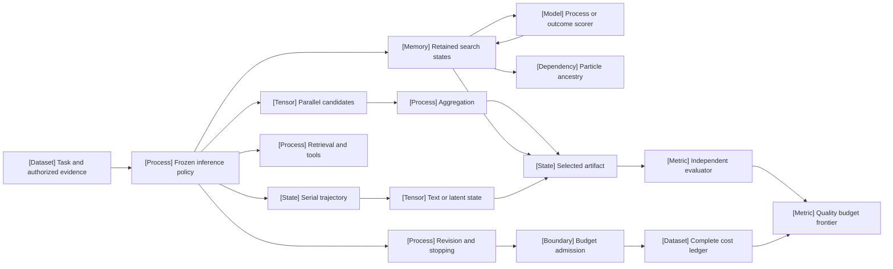

VOLUME II / PART VII — INFERENCE ALGORITHMS, DISTILLATION, AND COMPRESSION / CHAPTER 38

# 38 — Inference-time reasoning, search, and adaptive compute

[DERIVED] An inference improvement is interpretable only when the information available to the policy, the distribution of its attempts, the selection rule and every consumed resource remain explicit.

6 sections · 0 date-eligible historical spine papers · 10 primary artifacts first released in 2026 · 2 source-reported serving implementations · prerequisites:06,32,35,37 · artifact: a quality-versus-inference-budget frontier · updated2026-10-09

## Why this chapter exists

[DERIVED] Fixed model weights do not imply fixed inference behavior. A deployment controller can change how long a trajectory runs, how many alternatives it samples, which intermediate states it expands, when it retrieves external information and which verifier decides the answer. These interventions spend different resources and change different conditional distributions. A benchmark gain without those distinctions cannot identify the mechanism that produced it.

[DERIVED] The central bottleneck is deciding which computation is worth executing before the controller knows its eventual answer quality. Candidate agreement can reflect concentrated mistakes. A process score can accelerate search while pruning a correct path. A router can satisfy an average budget while exceeding an individual cap. A short latent representation can require many network evaluations, and a cheap deployment policy can hide an expensive oracle-labeling stage. The chapter therefore treats statistical selection, search-state conservation and physical resource admission as separate contracts.

[DERIVED] The resulting artifact is a frontier with inspectable execution records, not a single leaderboard score. The chapter derives classical mechanisms from stated premises without presenting them as2026 inventions. Its primary evidence is entirely first released in2026 and includes positive results, negative workload regimes, conditional theory and explicit source inconsistencies. Native figures expose the equations and resource consequences while preserving the website's scientific visual grammar. A claim remains bounded by the method, evaluator and protocol actually disclosed.

## Concept map

[DERIVED] Equation38.0 in §38.1 defines the experiment identity shared by these concepts. The graph describes distinct scientific objects; it does not assert that a provider implements this full system.



- Authorized task and evidence enter the frozen inference policy.
  - Serial trajectories create text or latent state.
  - Parallel candidates enter aggregation.
  - Retrieval and tools add observations or effects.
  - Retained search states use process/outcome guidance and particle ancestry.
  - Revision and stopping choose further actions under budget admission.
- Selected artifacts enter an independent evaluator.
  - Complete attempt-cost ledgers supply the cost coordinate.
  - Independent quality and cost join the frontier.

## Position in the graph

| Relationship | Chapters and reason |
|---|---|
| Prerequisites | Chapter06 resource units; Chapter32 feedback/verifier validity; Chapter35 verifiable-reward estimators; Chapter37 actual processed decoding distributions |
| Siblings | Chapter36 rollout scheduling; Chapter49 retrieval; Chapter63 agent evaluation; these supply operations and measurements used by the controller |
| Downstream | Chapter39 amortizes expensive inference through distillation; Chapter47 consumes frontier evidence for deployment decisions |
| Trades off with | Additional generation, scoring and evidence can improve selected quality while increasing work, memory, elapsed time or currency; no universal conversion is assumed |

## Sections

| Section | Owned question | Native visual argument |
|---|---|---|
| [38.1 Computation dimensions](38-1-computation-dimensions.md) | What is being spent and what information does it buy? | Work/span calculator, operation graph, resource ledger |
| [38.2 Candidate aggregation](38-2-candidate-aggregation.md) | When do samples, votes and verifier selection improve an answer? | Coverage/correlation calculator, voting comparison, error concentration |
| [38.3 Guided search](38-3-guided-search.md) | Which state is expanded and what makes pruning valid? | In-flight PUCT calculator, prefix bound, cancellation conservation |
| [38.4 Revision and adaptive stopping](38-4-revision-and-adaptive-stopping.md) | Which further action has value under which budget constraint? | Randomization gap, price/slack derivation, mode crossover |
| [38.5 Representation and evidence](38-5-representation-and-evidence.md) | What do text and latent steps physically execute and establish? | Flow/refiner grammar, transition-score calculator, trace evidence boundary |
| [38.6 Evaluation and economics](38-6-evaluation-and-economics.md) | Which policy belongs on a defensible quality-cost frontier? | Break-even calculator, workload reversal, unknown-label bounds |

## Artifact

[DERIVED] The artifact is a versioned quality-versus-inference-budget frontier. Each point joins a frozen policy configuration to its task distribution, information-access contract, raw attempts, terminal statuses, selected artifact, independent evaluator result and full cost boundary. It includes preparation and development costs separately from deployment, all rejected/cancelled work, and uncertainty at the task level. A point lacking a valid denominator or reconstructable resource coordinate is marked incomplete rather than placed on a falsely precise frontier.

## Verification task

[DERIVED] [verification.md](verification.md) specifies the falsifiable matched-budget comparison, source reproduction gaps and variant-specific completeness audit. Its proposed service and GPU experiments have not been executed. Editorial, mathematical and figure checks establish the manuscript's internal contracts; they do not establish benchmark superiority.

## Lineage

[PAPER-REPORTED] The admitted2026 lineage contains several independent branches. February's Kimi report studies parallel agent orchestration, while February's ICML theory studies approximate twists and particle resampling. April's AP-MCTS study exposes search-serving tradeoffs; April's constrained allocation study learns expected-budget routing. August's mode-learning study changes the distribution of short and long trajectories. September's aggregation study examines concentrated wrong answers, while ATF and LRT change internal representation and computation. October's pass@$k$ study questions what an apparently stable coverage curve measures. These are related questions rather than a single proven improvement chain. Exact original dates and inspected versions are in [references.md](references.md).

```figure
{
  "id": "fig-38.37",
  "kind": "lineage",
  "title": "Different interventions, different guarantees",
  "caption": "The 2026 evidence branches through parallel orchestration, particle theory, search serving, expected-budget routing, aggregation and latent representation. Connections describe question succession, not causal superiority.",
  "placement": "inline",
  "evidence": "PAPER-REPORTED",
  "source": "R38.10",
  "alt": "Parallel orchestration and SMC theory precede April search/routing, August mode allocation, September aggregation and latent methods, then October measurement critique. These are distinct branches.",
  "spec": {
    "entries": [
      {"year": 2026, "work": "Parallel agents (R38.8)", "relation": "alternative branch"},
      {"year": 2026, "work": "SMC theory (R38.10)", "relation": "alternative branch"},
      {"year": 2026, "work": "Search serving (R38.3)", "relation": "alternative branch"},
      {"year": 2026, "work": "Budget routing (R38.1)", "relation": "alternative branch"},
      {"year": 2026, "work": "Mode learning (R38.2)", "relation": "alternative branch"},
      {"year": 2026, "work": "Error concentration (R38.7)", "relation": "alternative branch"},
      {"year": 2026, "work": "Latent flow / recurrence (R38.4; R38.5)", "relation": "alternative branch"},
      {"year": 2026, "work": "Coverage limits (R38.6)", "relation": "alternative branch"}
    ]
  }
}
```

## Research cycle

[DERIVED] The meaningful cycle is task contract → admitted computation → selected artifact → independent evaluation → frozen development revision. Final audit feedback does not return through that loop. Search feedback can guide a run, but it is not the independent evidence used to assess the final policy.

## Terms owned here

| Term | Operational definition |
|---|---|
| Inference policy | Bounded controller choosing computation from authorized state and history without an unrecorded identity change |
| Work / span | Aggregate executed work / longest dependency-path work under declared scheduling premises |
| Oracle coverage | Existence of a correct candidate under an adequate independent checker; distinct from selected-answer quality |
| Weighted vote | A declared nonnegative finite weighting of normalized candidate answers; distinct from calibrated correctness |
| Search state | Prefix plus environment, cache and legal-transition identity retained for future expansion |
| Proxy futility | Inability to cross a specified proxy threshold under stated immutable-prefix premises |
| Particle twist | Positive intermediate path weighting used with explicit proposal support and incremental importance weights |
| Expected budget | Constraint on an average over a declared task/action law, distinct from a per-run hard cap |
| Latent step | A representation-specific network/numerical update with disclosed dimension and physical cost |
| Quality-cost frontier | Nondominated policy points under one task measure, evaluator and declared resource boundary |

## Reference-stack coverage

[DERIVED] Rows reproduce the applicable catalog identifiers in `Instruction/AI_REFERENCE_STACK.md`; admitting an academic paper through a scholarly discovery route does not affiliate it with a top-ten lab.

| Exact catalog entry | Canonical surface | Actual use |
|---|---|---|
| §1 #2 OpenAI | https://openai.com/research/ | First-party deployment-safety card reached through OpenAI's research/safety surface; R38.9 supports only disclosed controllability measurements |
| §1 #7 Moonshot AI / Kimi | https://github.com/MoonshotAI | R38.8 primary technical report; no uninspected repository execution claim |
| §2 #2 ICML | https://proceedings.mlr.press/ | Official PMLR306 record verifies R38.10 venue; first date remains its February arXiv release |
| §3 #1 arXiv | https://arxiv.org/ | R38.1–8 and R38.10 original histories plus full versioned methods/appendices |
| §3 #3 PMLR | https://proceedings.mlr.press/ | Primary proceedings metadata for the SMC theory, not evidence for unrelated empirical claims |
| §4 #41 vLLM | https://docs.vllm.ai/ | Source-reported serving layer/version in R38.7; compatibility not independently executed |
| §4 #42 SGLang | https://docs.sglang.ai/ | Source-reported LRT environment in R38.5 AppendixK; not a claim about current installed software |

[DERIVED] The LRT companion repository is outside the catalog's named implementation organizations. It is admitted as author-owned primary implementation discovered from the arXiv method and needed to inspect the frozen-decoder/recurrent-state contract. The inspected full commit is pinned in references.md. No affiliation with a catalog lab, general implementation endorsement or GPU execution is implied.

## Search and source admission

[DERIVED] Actual web searches and primary inspection occurred on2026-10-09. Direct versioned full-text inspection followed discovery before detailed source claims were drafted. The search was targeted rather than an exhaustive survey. A result without a confirmed original date and inspected relevant methods was not admitted merely because its conference year was2026.

| Route searched | Query family and outcome |
|---|---|
| Anthropic; Google DeepMind; Alibaba Qwen; ByteDance Seed | Official-domain searches combining2026, reasoning and test-time compute; no additional fully inspected chapter source admitted |
| Meta AI / FAIR; Z.ai / Zhipu / GLM; DeepSeek; xAI / SpaceXAI | Official-domain/author-name searches for adaptive inference and reasoning; product/model leads did not become mechanism evidence |
| Moonshot / Kimi; OpenAI | Kimi PARL and OpenAI chain-of-thought controllability searches produced R38.8 and current R38.9; full relevant sections inspected |
| NeurIPS; ICML/PMLR; ICLR/OpenReview; ACL | Proceedings searches for adaptive compute, Monte Carlo reasoning and latent inference; official ICML/PMLR R38.10 admitted; other uninspected leads excluded |
| CVPR; IJCAI |2026 proceedings searches returned vision/reasoning leads; no additional full-method/original-history admission |
| EMNLP; ECCV; ICCV; AAAI | Topic searches returned prior EMNLP/ICCV work, ECCV leads and AAAI SCALE/GenPRM surfaces; proceedings dates alone did not establish an eligible original, so none admitted |
| arXiv targeted methods | Exact IDs and titles for allocation, AP-MCTS, ATF, LRT, pass@$k$ and aggregation; histories and relevant full-text sections inspected |

## Reading routes

[DERIVED] Resource-first readers should follow38.1 →38.6. Selection-first readers should follow38.2 →38.3 →38.6. Adaptive-policy readers should follow38.4 after the Chapter35 estimator treatment. Latent-method readers should keep38.1's units open while reading38.5, because fewer intermediate states do not imply less physical work.

## Status and evidence gaps

[DERIVED] Status is **manuscript_draft**. All10 canonical evidence artifacts have an original2026 release; none enters through a later revision of an older original. The main scientific gaps are unavailable raw records and exact run environments, source-specific theorem inconsistencies, incomplete hosted-model cost disclosure, finite model/task coverage and no executed chapter-level matched-budget study. Passing internal render/figure checks does not certify a review score or a performance claim.
