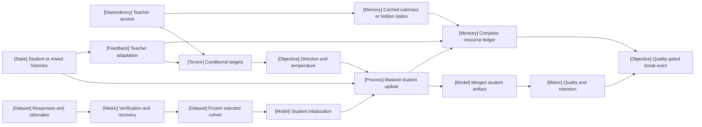

VOLUME II / PART VII — INFERENCE ALGORITHMS, DISTILLATION, AND COMPRESSION / CHAPTER 39

# 39 — Knowledge, response, and policy distillation

[DERIVED] Distillation is an information-constrained transfer experiment whose objective, sampled histories and complete resource bill must be explicit before teacher agreement can be interpreted as student capability.

6 sections · 0 admitted historical spine papers · 9 current primary research records · 8 reference-stack systems · prerequisites:11,23,31–38 · artifact:a teacher–student experiment with transparent information access · updated2026-10-09

## Why this chapter exists

[DERIVED] A teacher response can be copied without revealing what the teacher would have done otherwise. This makes response imitation easy to implement but difficult to interpret as distribution transfer. Exposing probabilities or hidden states supplies richer supervision, yet the resulting loss depends on vocabulary alignment, omitted probability mass, temperature and the histories where it is evaluated. A compressed student can reproduce the teacher's formatting while failing its reasoning or tool behavior. Agreement and capability therefore need separate measurements.

[PAPER-REPORTED] The inspected2026 sources make these constraints concrete. Offline top-k targets reduce repeated teacher execution but retain a subnormalized measure. Recoverability tests whether students can continue verified teacher reasoning. Guided-OPD changes turn ownership; SCOUT changes the teacher itself. RED changes initialization and shows a strong interaction with temperature. GLM-5 and DeepSeek-V4 disclose final specialist transfer without complete component-isolated budgets [R39.1, R39.3–R39.5, R39.7–R39.9].

[DERIVED] The dominant constraint is identifying the experiment actually performed. A full-vocabulary objective and a sampled clipped update are different. A teacher-guided history and a pure student history are different. A cheap learner iteration and a cheap complete pipeline are different. The chapter develops the mathematical and operational contracts needed to preserve these distinctions, then links them to actual source protocols, negative findings and unresolved disclosure limits. The result is a reviewable research artifact rather than a ranking of teachers or a claim that any model has been reproduced.

## Concept map



[DERIVED] Text counterpart of the same fifteen concept-map nodes:

- Teacher access determines the supplied information.
  - Conditional targets supply the local categorical law.
  - Direction and temperature define its objective.
  - Cached submass or hidden states retain different information.
- Responses and rationales supply sampled demonstrations.
  - Verification and recovery assess outcome validity and student compatibility.
  - Frozen selected cohort preserves the chosen population.
- Student initialization supplies the starting architecture and representation.
  - Masked student update applies the declared objective.
  - Student or mixed histories determine the visited states.
  - Teacher adaptation changes the supervising model.
  - Merged student artifact fixes the deployable weights.
- Quality and retention evaluate the final artifact.
  - Complete resource ledger records every teacher/student stage.
  - Quality-gated break-even combines valid substitution with complete cost.


## Position in the book

| Relation | Canonical connections |
|---|---|
| Prerequisites | [Synthetic trajectories](../../../vol-01-learning-and-representation/part-02-data-and-representation-engineering/ch11-synthetic-data-preferences-and-interactive-trajectories/README.md), [Parameter-efficient adaptation](../../../vol-01-learning-and-representation/part-04-training-science-and-adaptation/ch23-parameter-efficient-adaptation-and-model-composition/README.md), [SFT](../../part-06-post-training-and-reinforcement-learning/ch31-supervised-fine-tuning-and-behavior-acquisition/README.md), [Policy gradients](../../part-06-post-training-and-reinforcement-learning/ch34-policy-gradients-ppo-and-rlhf/README.md), [Decoding](../ch37-decoding-constrained-generation-and-speculative-execution/README.md), [Inference-time reasoning](../ch38-inference-time-reasoning-search-and-adaptive-compute/README.md) |
| Siblings, same part | [Decoding, constrained generation, and speculative execution](../ch37-decoding-constrained-generation-and-speculative-execution/README.md), [Inference-time reasoning, search, and adaptive compute](../ch38-inference-time-reasoning-search-and-adaptive-compute/README.md) |
| Downstream | [Quantization](../ch40-quantization-from-numerical-model-to-deployable-artifact/README.md), [Structural compression](../ch41-pruning-sparsity-rank-reduction-and-adaptive-execution/README.md), [Inference resource models](../ch42-prefill-decode-kv-state-and-inference-resource-models/README.md), [Lifecycle economics](../../part-08-inference-engines-and-production-serving/ch48-capacity-planning-benchmarking-and-lifecycle-economics/README.md) |
| Trades off with | [Student initialization](39-5-student-optimization.md), [Information access](39-2-information-access.md), [Complete accounting](39-6-experimental-accounting.md) |

[DERIVED] Chapter31 owns response-target masking and normalization; Chapters34–36 own policy-gradient and verifiable-reward objectives; Chapter37 owns actual decoding laws and stopping; Chapter23 owns parameter-efficient adaptation and composition, while Chapter38 owns inference-time reasoning, search and adaptive compute. This chapter uses those contracts to separate the teacher signal from the state distribution and optimizer. Quantization and structural pruning change the student's operators or architecture; their recovery interactions are taught here, while the structural algorithms remain in their owning chapters.

## Sections

| Section | What changes here | Primary evidence |
|---|---|---|
| [39.1 Distillation objectives](39-1-distillation-objectives.md) | Direction, temperature, hard mixtures and feature alignment determine the gradient | MATHEMATICALLY-DERIVED; PAPER-REPORTED |
| [39.2 Information access](39-2-information-access.md) | Full laws, submass, tail buckets, features and text expose different targets | DERIVED; OFFICIAL-DOCUMENTATION |
| [39.3 Sequence and reasoning data](39-3-sequence-and-reasoning-data.md) | Acceptance and student recoverability change which traces are useful | PAPER-REPORTED; MATHEMATICALLY-DERIVED |
| [39.4 Policy and trajectory transfer](39-4-policy-and-trajectory-transfer.md) | Offline, student, mixed and adapted-teacher histories differ | MATHEMATICALLY-DERIVED; PAPER-REPORTED |
| [39.5 Student optimization](39-5-student-optimization.md) | Initialization, trainable state, merge and retention constrain recovery | PAPER-REPORTED; DERIVED |
| [39.6 Experimental accounting](39-6-experimental-accounting.md) | Full cost, untouched selection and matched serving determine valid savings | DERIVED; PAPER-REPORTED |

## Artifact

[DERIVED] The deliverable is **a teacher–student experiment with transparent information access**: an immutable run manifest, teacher-access record, token/prefix alignment table, candidate-attempt ledger, accepted dataset with role masks, student/teacher version history, stage-tagged compute/memory/I/O record, validation selection record, paired quality/retention report and conditional serving-cost calculation. Every target identifies its temperature, truncation, tail treatment, tokenizer and denominator. Every reported gain identifies its baseline, data, budget and evaluator. The detailed field schema and proposed execution are in [verification.md](verification.md).

[DERIVED] This artifact makes several claims independently falsifiable. An invalid cache key can be rejected without running a benchmark. An incorrect sparse loss can fail a finite distribution check. A teacher-guidance objective can fail an occupancy counterexample even if task scores improve. A student can meet quality while missing the cost target, or meet cost while failing retention. Keeping these outcomes separate prevents a successful compiler run or attractive figure from becoming evidence for model performance.

## Verification

[DERIVED] The [proposed verification](verification.md#verification-task) starts with finite objective/support/occupancy contracts, then compares response-only, full-law and declared truncated-law transfer under frozen teacher/data/evaluator identities. It adds separately budgeted teacher adaptation and matched-quality serving evaluation only when their resource records are complete. The central claim is rejected for an implementation if its targets, masks, gradients or cost ledger disagree with the declared contract, or if its selected artifact fails untouched quality/retention requirements. These are proposed model experiments; this edition has not executed them.

## Lineage

[DERIVED] The date window excludes historical originals; this lineage is a dated map of admitted2026 branches, without implying that they invented distillation's foundations.


```figure
{
  "id": "fig-39.38",
  "kind": "lineage",
  "title": "Admitted 2026 distillation branches",
  "caption": "These current primary branches change different contracts: conditioning, teacher adaptation, initialization or systems residency. Chronology is not a ranking of scientific quality.",
  "placement": "wide",
  "evidence": "PAPER-REPORTED",
  "source": [
    "R39.1",
    "R39.2",
    "R39.3",
    "R39.4",
    "R39.6",
    "R39.8",
    "R39.9"
  ],
  "alt": "These current primary branches change different contracts: conditioning, teacher adaptation, initialization or systems residency. Chronology is not a ranking of scientific quality.",
  "spec": {
    "entries": [
      {
        "year": 2026,
        "work": "OPCD",
        "cite": "R39.6",
        "relation": "alternative branch",
        "note": "Privileged-context transfer"
      },
      {
        "year": 2026,
        "work": "GLM-5 / DeepSeek-V4",
        "cite": "R39.8",
        "relation": "current frontier",
        "note": "Prior-stage or specialist targets"
      },
      {
        "year": 2026,
        "work": "RED",
        "cite": "R39.9",
        "relation": "alternative branch",
        "note": "Inherited projection initialization"
      },
      {
        "year": 2026,
        "work": "Offline top-k / fused KL",
        "cite": "R39.1",
        "relation": "engineering optimization",
        "note": "Target reuse and output memory"
      },
      {
        "year": 2026,
        "work": "Recoverability",
        "cite": "R39.3",
        "relation": "alternative branch",
        "note": "Student compatibility diagnostic"
      },
      {
        "year": 2026,
        "work": "Guided-OPD / SCOUT",
        "cite": "R39.4",
        "relation": "current frontier",
        "note": "Mixed histories or adapted teacher"
      },
      {
        "year": 2026,
        "work": "CaRE-KD",
        "cite": "R39.2",
        "relation": "alternative branch",
        "note": "Confidence-dependent weighting"
      }
    ]
  }
}
```


[PAPER-REPORTED] 2026 · OPCD · alternative branch: privileged-context teacher transfer [R39.6]. 2026 · GLM-5 and DeepSeek-V4 · current frontier: specialist/cross-stage policy transfer [R39.7–R39.8]. 2026 · RED · alternative branch: inherited initialization and recovery [R39.9]. 2026 · offline top-k/fused KL · engineering optimization: teacher reuse and output-memory boundary [R39.1]. 2026 · Recoverability · alternative branch: student-dependent diagnostic [R39.3]. 2026 · Guided-OPD and SCOUT · current frontier: mixed histories and adapted supervision [R39.4–R39.5]. 2026 · CaRE-KD · alternative branch: confidence-sensitive target weighting [R39.2].

## Terms owned here

| Term | Canonical meaning and owner |
|---|---|
| Distillation temperature | Positive shared scaling that defines teacher/student soft-target laws; [§39.1](39-1-distillation-objectives.md#formulation) |
| Retained teacher submass | Sum of original teacher probabilities retained by a selected-token cache; [§39.2](39-2-information-access.md#formulation) |
| Prefix recovery | Verifier success under a declared student continuation/prefix intervention; [§39.3](39-3-sequence-and-reasoning-data.md#formulation) |
| Teacher-access contract | Available target information and its alignment/normalization identity; [§39.2](39-2-information-access.md#scope) |
| Cross-stage distillation | Transfer from earlier specialist/stage checkpoints into a final student under a declared prompt/teacher mixture; [§39.4](39-4-policy-and-trajectory-transfer.md#mechanism) |

## Reference-stack coverage

| Stack section | Entry | Stack layer | What this chapter takes | Surface used | Sections | Evidence |
|---|---|---|---|---|---|---|
| §1 lab | #6 Z.ai / Zhipu AI / GLM | — | GLM-5 cross-stage transfer and masked trajectory disclosure | Papers/Blog: https://z.ai/blog; primary report R39.7 via arXiv |39.3–39.4 | PAPER-REPORTED |
| §1 lab | #8 DeepSeek | — | Multi-expert full-vocabulary OPD and teacher-head scheduling | Papers/Code: https://github.com/deepseek-ai; primary report R39.8 via arXiv |39.2,39.4,39.6 | PAPER-REPORTED |
| §3 discovery | #1 arXiv | — | Originating primary versions/histories for all nine records | https://arxiv.org/advanced |39.1–39.6 | Retrieval route; claims use primary records |
| §4 system | #17 PyTorch | MODEL / AUTOGRAD FRAMEWORK | Loss/autograd and disclosed runtime protocols | https://pytorch.org/docs/stable/ |39.1–39.6 | PAPER-REPORTED; implementation reading under R39.1 |
| §4 system | #24 Megatron-LM | DISTRIBUTED TRAINING | Offline study's TP/SP loss boundary and training context | https://github.com/NVIDIA/Megatron-LM |39.2 | PAPER-REPORTED |
| §4 system | #25 Microsoft DeepSpeed | DISTRIBUTED TRAINING | RED distributed recovery protocol | https://www.deepspeed.ai/ |39.5 | PAPER-REPORTED |
| §4 system | #26 Hugging Face Transformers | MODEL DEFINITION / ADAPTATION | Named model/evaluation runtime in source protocols | https://huggingface.co/docs/transformers/ |39.1,39.2,39.4,39.5 | PAPER-REPORTED |
| §4 system | #28 Hugging Face PEFT | MODEL DEFINITION / ADAPTATION | LoRA training interface contextualized from CaRE; no package pin inferred | https://huggingface.co/docs/peft/ |39.1,39.5 | NOT-DISCLOSED for exact library/version |
| §4 system | #37 verl | POST-TRAINING / RL | SCOUT actor/teacher-update protocol | https://verl.readthedocs.io/en/latest/ |39.4,39.6 | PAPER-REPORTED |
| §4 system | #41 vLLM | INFERENCE ENGINE | SCOUT rollout version.12 | https://docs.vllm.ai/ |39.4 | PAPER-REPORTED |
| §4 system | #42 SGLang | INFERENCE ENGINE | Offline study's teacher precomputation | https://docs.sglang.ai/ |39.2 | PAPER-REPORTED |

**Additional author-owned artifacts reached through permitted primary routes.** [DERIVED] CompactifAI's originating fused-loss repository is admitted as the artifact of R39.1, reached through the permitted arXiv primary route, not as a top-ten lab. Trinity-RFT, Megatron-Bridge and TileLang are source-disclosed execution components in R39.5/R39.1/R39.8; no unsupported standalone ranking or compatibility claim is attached to them. Academic CaRE/Recoverability/SCOUT/Guided/OPCD/RED records are originating arXiv evidence, not invented top-ten conference or lab memberships. The plan's historical KD anchor is excluded by the user's narrower first-publication window.

**Inspection dimensions applied.** [DERIVED] Parallelism, precision, memory, communication and kernels are analyzed in39.2; post-training, inference and target versioning in39.4; checkpointing and merge reliability in39.5; metrics, complete resource boundaries and reproducibility in39.6. Source omissions stay NOT-DISCLOSED rather than being filled from framework defaults.

## Source route

[DERIVED] Apply the reference stack's lab search, conference workflow, paper cascade and training-stack protocol: locate originating reports, inspect full methods/experiments/appendices, check first submission, then follow only the implementation surfaces needed for the claim. No conference acceptance is inferred from a PDF template or arXiv comment.

- `site:arxiv.org/abs "GLM-5" "distillation"`
- `site:github.com/deepseek-ai "DeepSeek-V4" "OPD"`
- `site:arxiv.org "Efficient Knowledge Distillation" "Offline Top-K"`
- `site:arxiv.org "On the Off-Policy Teacher" "2026"`
- `site:arxiv.org "Curriculum Turn-level Guidance"`
- `site:github.com "Full-Chunked-KL-Loss" (benchmark OR memory)`

[DERIVED] Actual retrieval and full-version locators are retained in [references.md](references.md). Candidate discovery is not counted as technical evidence until the relevant full primary surface is inspected. Mutable documentation without a pin supports only a disclosed interface, not reproducible kernel behavior.

## Status

[DERIVED] **manuscript_draft.** Nine admitted primary records first published in2026; all accessed2026-10-09. Every section includes a mathematical procedure, source protocol, four observation layers, failure/alternative treatment and six technically distinct native figures. These editorial checks do not certify scientific review or a10/10 score.

[NOT-DISCLOSED] OPCD tail normalization and selection-dependent tests; Recoverability hardware/precision/update confounds; CaRE exact optimizer-skip/evaluator behavior; GLM/DeepSeek isolated distillation budgets/routing/contributions; RED calibration-count and coefficient/version gaps remain explicit. [UNVERIFIED] Most production code/checkpoint pins and independent model reproduction are absent. No GPU training, synthetic generation or serving measurement was executed. The [variant audit](verification.md#topic-completeness-audit) states the consequence of each gap.
